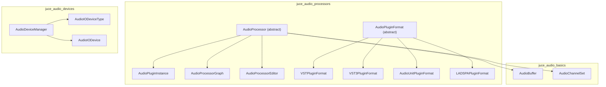
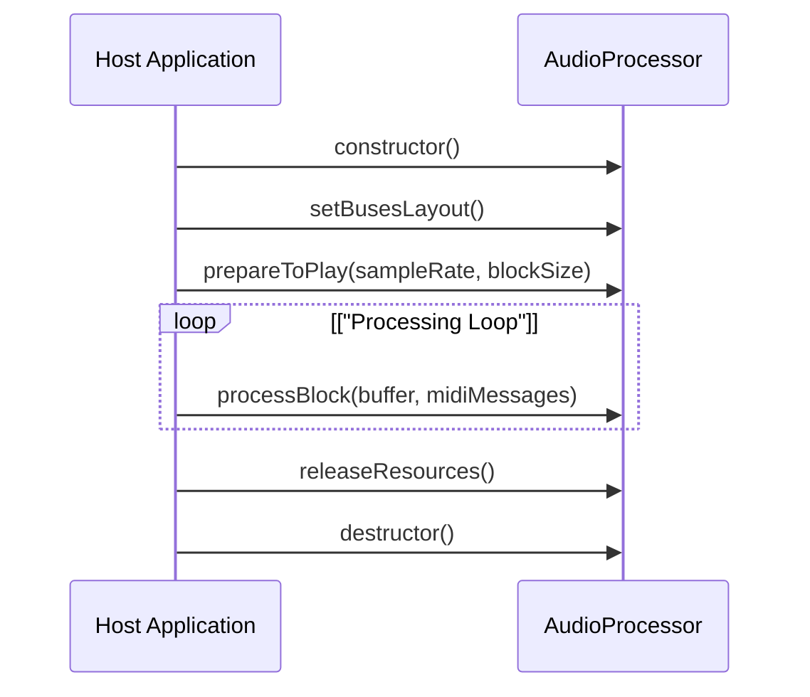
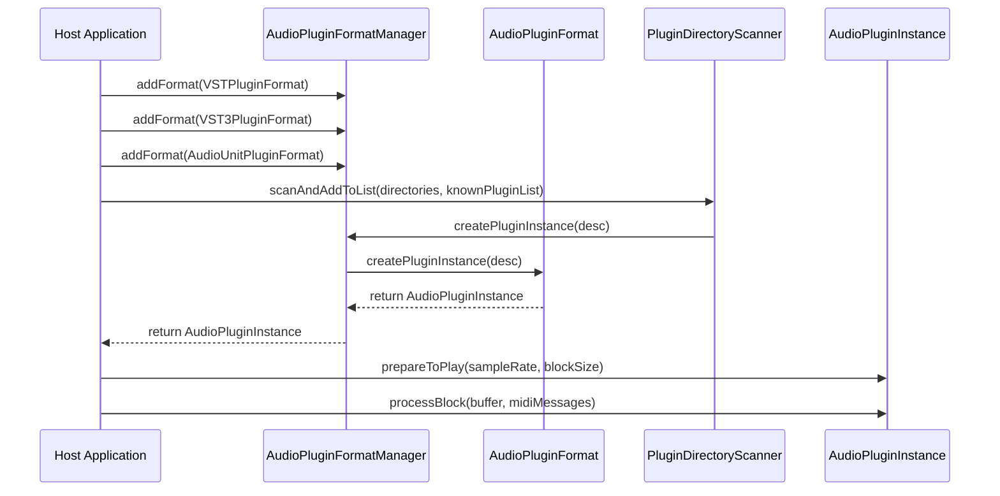

# Audio Framework

> **Relevant source files**
> * [LICENSE.md](https://github.com/juce-framework/JUCE/blob/d6181bde/LICENSE.md)
> * [README.md](https://github.com/juce-framework/JUCE/blob/d6181bde/README.md)
> * [examples/Audio/CMakeLists.txt](https://github.com/juce-framework/JUCE/blob/d6181bde/examples/Audio/CMakeLists.txt)
> * [examples/CMake/AudioPlugin/CMakeLists.txt](https://github.com/juce-framework/JUCE/blob/d6181bde/examples/CMake/AudioPlugin/CMakeLists.txt)
> * [examples/CMake/AudioPlugin/PluginProcessor.h](https://github.com/juce-framework/JUCE/blob/d6181bde/examples/CMake/AudioPlugin/PluginProcessor.h)
> * [examples/CMake/CMakeLists.txt](https://github.com/juce-framework/JUCE/blob/d6181bde/examples/CMake/CMakeLists.txt)
> * [examples/CMake/ConsoleApp/CMakeLists.txt](https://github.com/juce-framework/JUCE/blob/d6181bde/examples/CMake/ConsoleApp/CMakeLists.txt)
> * [examples/CMake/GuiApp/CMakeLists.txt](https://github.com/juce-framework/JUCE/blob/d6181bde/examples/CMake/GuiApp/CMakeLists.txt)
> * [examples/DSP/CMakeLists.txt](https://github.com/juce-framework/JUCE/blob/d6181bde/examples/DSP/CMakeLists.txt)
> * [examples/GUI/CMakeLists.txt](https://github.com/juce-framework/JUCE/blob/d6181bde/examples/GUI/CMakeLists.txt)
> * [examples/Plugins/CMakeLists.txt](https://github.com/juce-framework/JUCE/blob/d6181bde/examples/Plugins/CMakeLists.txt)
> * [extras/AudioPluginHost/Source/Plugins/IOConfigurationWindow.cpp](https://github.com/juce-framework/JUCE/blob/d6181bde/extras/AudioPluginHost/Source/Plugins/IOConfigurationWindow.cpp)
> * [extras/Build/CMake/FindWebView2.cmake](https://github.com/juce-framework/JUCE/blob/d6181bde/extras/Build/CMake/FindWebView2.cmake)
> * [modules/juce_audio_basics/buffers/juce_AudioChannelSet.cpp](https://github.com/juce-framework/JUCE/blob/d6181bde/modules/juce_audio_basics/buffers/juce_AudioChannelSet.cpp)
> * [modules/juce_audio_basics/buffers/juce_AudioChannelSet.h](https://github.com/juce-framework/JUCE/blob/d6181bde/modules/juce_audio_basics/buffers/juce_AudioChannelSet.h)
> * [modules/juce_audio_basics/buffers/juce_AudioSampleBuffer.h](https://github.com/juce-framework/JUCE/blob/d6181bde/modules/juce_audio_basics/buffers/juce_AudioSampleBuffer.h)
> * [modules/juce_audio_basics/buffers/juce_FloatVectorOperations.cpp](https://github.com/juce-framework/JUCE/blob/d6181bde/modules/juce_audio_basics/buffers/juce_FloatVectorOperations.cpp)
> * [modules/juce_audio_basics/buffers/juce_FloatVectorOperations.h](https://github.com/juce-framework/JUCE/blob/d6181bde/modules/juce_audio_basics/buffers/juce_FloatVectorOperations.h)
> * [modules/juce_audio_basics/juce_audio_basics.cpp](https://github.com/juce-framework/JUCE/blob/d6181bde/modules/juce_audio_basics/juce_audio_basics.cpp)
> * [modules/juce_audio_devices/audio_io/juce_AudioDeviceManager.cpp](https://github.com/juce-framework/JUCE/blob/d6181bde/modules/juce_audio_devices/audio_io/juce_AudioDeviceManager.cpp)
> * [modules/juce_audio_devices/audio_io/juce_AudioDeviceManager.h](https://github.com/juce-framework/JUCE/blob/d6181bde/modules/juce_audio_devices/audio_io/juce_AudioDeviceManager.h)
> * [modules/juce_audio_devices/audio_io/juce_AudioIODevice.cpp](https://github.com/juce-framework/JUCE/blob/d6181bde/modules/juce_audio_devices/audio_io/juce_AudioIODevice.cpp)
> * [modules/juce_audio_devices/audio_io/juce_AudioIODevice.h](https://github.com/juce-framework/JUCE/blob/d6181bde/modules/juce_audio_devices/audio_io/juce_AudioIODevice.h)
> * [modules/juce_audio_devices/audio_io/juce_AudioIODeviceType.cpp](https://github.com/juce-framework/JUCE/blob/d6181bde/modules/juce_audio_devices/audio_io/juce_AudioIODeviceType.cpp)
> * [modules/juce_audio_devices/audio_io/juce_AudioIODeviceType.h](https://github.com/juce-framework/JUCE/blob/d6181bde/modules/juce_audio_devices/audio_io/juce_AudioIODeviceType.h)
> * [modules/juce_audio_devices/juce_audio_devices.cpp](https://github.com/juce-framework/JUCE/blob/d6181bde/modules/juce_audio_devices/juce_audio_devices.cpp)
> * [modules/juce_audio_devices/native/juce_JackAudio.cpp](https://github.com/juce-framework/JUCE/blob/d6181bde/modules/juce_audio_devices/native/juce_JackAudio.cpp)
> * [modules/juce_audio_formats/codecs/flac/Flac Licence.txt](https://github.com/juce-framework/JUCE/blob/d6181bde/modules/juce_audio_formats/codecs/flac/Flac Licence.txt)
> * [modules/juce_audio_processors/format/juce_AudioPluginFormat.cpp](https://github.com/juce-framework/JUCE/blob/d6181bde/modules/juce_audio_processors/format/juce_AudioPluginFormat.cpp)
> * [modules/juce_audio_processors/format/juce_AudioPluginFormat.h](https://github.com/juce-framework/JUCE/blob/d6181bde/modules/juce_audio_processors/format/juce_AudioPluginFormat.h)
> * [modules/juce_audio_processors/format/juce_AudioPluginFormatManager.cpp](https://github.com/juce-framework/JUCE/blob/d6181bde/modules/juce_audio_processors/format/juce_AudioPluginFormatManager.cpp)
> * [modules/juce_audio_processors/format/juce_AudioPluginFormatManager.h](https://github.com/juce-framework/JUCE/blob/d6181bde/modules/juce_audio_processors/format/juce_AudioPluginFormatManager.h)
> * [modules/juce_audio_processors/format_types/juce_AudioUnitPluginFormat.h](https://github.com/juce-framework/JUCE/blob/d6181bde/modules/juce_audio_processors/format_types/juce_AudioUnitPluginFormat.h)
> * [modules/juce_audio_processors/format_types/juce_AudioUnitPluginFormat.mm](https://github.com/juce-framework/JUCE/blob/d6181bde/modules/juce_audio_processors/format_types/juce_AudioUnitPluginFormat.mm)
> * [modules/juce_audio_processors/format_types/juce_LADSPAPluginFormat.cpp](https://github.com/juce-framework/JUCE/blob/d6181bde/modules/juce_audio_processors/format_types/juce_LADSPAPluginFormat.cpp)
> * [modules/juce_audio_processors/format_types/juce_LADSPAPluginFormat.h](https://github.com/juce-framework/JUCE/blob/d6181bde/modules/juce_audio_processors/format_types/juce_LADSPAPluginFormat.h)
> * [modules/juce_audio_processors/format_types/juce_VST3Common.h](https://github.com/juce-framework/JUCE/blob/d6181bde/modules/juce_audio_processors/format_types/juce_VST3Common.h)
> * [modules/juce_audio_processors/format_types/juce_VST3Headers.h](https://github.com/juce-framework/JUCE/blob/d6181bde/modules/juce_audio_processors/format_types/juce_VST3Headers.h)
> * [modules/juce_audio_processors/format_types/juce_VST3PluginFormat.cpp](https://github.com/juce-framework/JUCE/blob/d6181bde/modules/juce_audio_processors/format_types/juce_VST3PluginFormat.cpp)
> * [modules/juce_audio_processors/format_types/juce_VST3PluginFormat.h](https://github.com/juce-framework/JUCE/blob/d6181bde/modules/juce_audio_processors/format_types/juce_VST3PluginFormat.h)
> * [modules/juce_audio_processors/format_types/juce_VST3PluginFormat_test.cpp](https://github.com/juce-framework/JUCE/blob/d6181bde/modules/juce_audio_processors/format_types/juce_VST3PluginFormat_test.cpp)
> * [modules/juce_audio_processors/format_types/juce_VSTPluginFormat.cpp](https://github.com/juce-framework/JUCE/blob/d6181bde/modules/juce_audio_processors/format_types/juce_VSTPluginFormat.cpp)
> * [modules/juce_audio_processors/format_types/juce_VSTPluginFormat.h](https://github.com/juce-framework/JUCE/blob/d6181bde/modules/juce_audio_processors/format_types/juce_VSTPluginFormat.h)
> * [modules/juce_audio_processors/juce_audio_processors.cpp](https://github.com/juce-framework/JUCE/blob/d6181bde/modules/juce_audio_processors/juce_audio_processors.cpp)
> * [modules/juce_audio_processors/processors/juce_AudioProcessor.cpp](https://github.com/juce-framework/JUCE/blob/d6181bde/modules/juce_audio_processors/processors/juce_AudioProcessor.cpp)
> * [modules/juce_audio_processors/processors/juce_AudioProcessor.h](https://github.com/juce-framework/JUCE/blob/d6181bde/modules/juce_audio_processors/processors/juce_AudioProcessor.h)
> * [modules/juce_audio_processors/utilities/juce_ParameterAttachments.h](https://github.com/juce-framework/JUCE/blob/d6181bde/modules/juce_audio_processors/utilities/juce_ParameterAttachments.h)
> * [modules/juce_audio_utils/gui/juce_AudioDeviceSelectorComponent.cpp](https://github.com/juce-framework/JUCE/blob/d6181bde/modules/juce_audio_utils/gui/juce_AudioDeviceSelectorComponent.cpp)
> * [modules/juce_audio_utils/gui/juce_AudioDeviceSelectorComponent.h](https://github.com/juce-framework/JUCE/blob/d6181bde/modules/juce_audio_utils/gui/juce_AudioDeviceSelectorComponent.h)
> * [modules/juce_core/containers/juce_PropertySet.h](https://github.com/juce-framework/JUCE/blob/d6181bde/modules/juce_core/containers/juce_PropertySet.h)
> * [modules/juce_graphics/fonts/harfbuzz/COPYING](https://github.com/juce-framework/JUCE/blob/d6181bde/modules/juce_graphics/fonts/harfbuzz/COPYING)
> * [modules/juce_gui_basics/mouse/juce_FileDragAndDropTarget.h](https://github.com/juce-framework/JUCE/blob/d6181bde/modules/juce_gui_basics/mouse/juce_FileDragAndDropTarget.h)
> * [modules/juce_gui_basics/widgets/juce_TableHeaderComponent.cpp](https://github.com/juce-framework/JUCE/blob/d6181bde/modules/juce_gui_basics/widgets/juce_TableHeaderComponent.cpp)
> * [modules/juce_gui_basics/widgets/juce_TableHeaderComponent.h](https://github.com/juce-framework/JUCE/blob/d6181bde/modules/juce_gui_basics/widgets/juce_TableHeaderComponent.h)

The JUCE Audio Framework is a modular, cross-platform system for real-time audio processing, plugin hosting, and audio device management. It provides the foundation for building audio applications and plugins (VST, VST3, AU, AAX, LADSPA, etc.), and for interfacing with audio hardware.

For details on specific subsystems, see:

* [Audio Plugin System](/juce-framework/JUCE/4.1-audio-plugin-system)
* [Audio Device Management](/juce-framework/JUCE/4.2-audio-device-management)
* [Standalone Plugin Applications](/juce-framework/JUCE/4.3-standalone-plugin-applications)

## System Overview and Code Entity Mapping

The Audio Framework is composed of several key modules and classes, each responsible for a specific aspect of audio processing or device management.

**Diagram: High-Level System and Code Entity Mapping**



This diagram shows the main code entities and their relationships, using class names as they appear in the codebase.

Sources:
[modules/juce_audio_processors/processors/juce_AudioProcessor.h L40-L77](https://github.com/juce-framework/JUCE/blob/d6181bde/modules/juce_audio_processors/processors/juce_AudioProcessor.h#L40-L77)

[modules/juce_audio_processors/format/juce_AudioPluginFormat.h](https://github.com/juce-framework/JUCE/blob/d6181bde/modules/juce_audio_processors/format/juce_AudioPluginFormat.h)

[modules/juce_audio_devices/audio_io/juce_AudioDeviceManager.h L38-L77](https://github.com/juce-framework/JUCE/blob/d6181bde/modules/juce_audio_devices/audio_io/juce_AudioDeviceManager.h#L38-L77)

[modules/juce_audio_basics/buffers/juce_AudioBuffer.h](https://github.com/juce-framework/JUCE/blob/d6181bde/modules/juce_audio_basics/buffers/juce_AudioBuffer.h)

[modules/juce_audio_basics/buffers/juce_AudioChannelSet.h](https://github.com/juce-framework/JUCE/blob/d6181bde/modules/juce_audio_basics/buffers/juce_AudioChannelSet.h)

## AudioProcessor: Central Processing Abstraction

The `AudioProcessor` class is the abstract base for all audio processing in JUCE. It defines the interface for both plugin and standalone audio processing components.

**Diagram: AudioProcessor and Related Classes**

```

```

**Key responsibilities:**

* `processBlock`: Main audio processing callback.
* `prepareToPlay` / `releaseResources`: Resource management for audio streaming.
* Bus and channel layout management.
* Parameter and state handling.
* Optional UI editor creation.

Sources:
[modules/juce_audio_processors/processors/juce_AudioProcessor.h L40-L77](https://github.com/juce-framework/JUCE/blob/d6181bde/modules/juce_audio_processors/processors/juce_AudioProcessor.h#L40-L77)

[modules/juce_audio_processors/processors/juce_AudioProcessor.h L136-L192](https://github.com/juce-framework/JUCE/blob/d6181bde/modules/juce_audio_processors/processors/juce_AudioProcessor.h#L136-L192)

[modules/juce_audio_processors/processors/juce_AudioProcessor.h L218-L286](https://github.com/juce-framework/JUCE/blob/d6181bde/modules/juce_audio_processors/processors/juce_AudioProcessor.h#L218-L286)

## Audio Processing Lifecycle

The audio processing lifecycle is defined by a strict sequence of method calls on `AudioProcessor` objects.

**Diagram: AudioProcessor Lifecycle**



* `prepareToPlay`: Initialize resources before audio streaming.
* `processBlock`: Main real-time audio callback.
* `releaseResources`: Cleanup after streaming.

Sources:
[modules/juce_audio_processors/processors/juce_AudioProcessor.h L118-L143](https://github.com/juce-framework/JUCE/blob/d6181bde/modules/juce_audio_processors/processors/juce_AudioProcessor.h#L118-L143)

[modules/juce_audio_processors/processors/juce_AudioProcessor.h L156-L197](https://github.com/juce-framework/JUCE/blob/d6181bde/modules/juce_audio_processors/processors/juce_AudioProcessor.h#L156-L197)

[modules/juce_audio_processors/processors/juce_AudioProcessor.cpp L33-L68](https://github.com/juce-framework/JUCE/blob/d6181bde/modules/juce_audio_processors/processors/juce_AudioProcessor.cpp#L33-L68)

## Audio Channel and Bus Configuration

JUCE provides flexible channel and bus management using `AudioChannelSet`, `AudioProcessor::Bus`, and `AudioProcessor::BusesLayout`.

**Diagram: Channel and Bus Configuration Entities**

```

```

* **Bus**: Logical group of channels (e.g., main input, sidechain).
* **AudioChannelSet**: Defines a channel layout (mono, stereo, surround, ambisonic, etc.).
* **BusesLayout**: Complete input/output configuration for a processor.

Supports:

* Mono, stereo, surround, ambisonic, and custom layouts.

Sources:
[modules/juce_audio_processors/processors/juce_AudioProcessor.h L317-L370](https://github.com/juce-framework/JUCE/blob/d6181bde/modules/juce_audio_processors/processors/juce_AudioProcessor.h#L317-L370)

[modules/juce_audio_basics/buffers/juce_AudioChannelSet.h L58-L94](https://github.com/juce-framework/JUCE/blob/d6181bde/modules/juce_audio_basics/buffers/juce_AudioChannelSet.h#L58-L94)

[modules/juce_audio_basics/buffers/juce_AudioChannelSet.cpp L40-L97](https://github.com/juce-framework/JUCE/blob/d6181bde/modules/juce_audio_basics/buffers/juce_AudioChannelSet.cpp#L40-L97)

## Plugin Format Abstraction

JUCE supports multiple plugin formats using a unified interface.

**Diagram: Plugin Format Class Hierarchy**

```

```

Supported formats include VST3, VST, AudioUnit, LADSPA, and others. The `AudioPluginFormatManager` manages discovery and instantiation.

Sources:
[modules/juce_audio_processors/format/juce_AudioPluginFormat.h](https://github.com/juce-framework/JUCE/blob/d6181bde/modules/juce_audio_processors/format/juce_AudioPluginFormat.h)

[modules/juce_audio_processors/format_types/juce_VST3PluginFormat.h L40-L55](https://github.com/juce-framework/JUCE/blob/d6181bde/modules/juce_audio_processors/format_types/juce_VST3PluginFormat.h#L40-L55)

[modules/juce_audio_processors/format_types/juce_VSTPluginFormat.h L40-L65](https://github.com/juce-framework/JUCE/blob/d6181bde/modules/juce_audio_processors/format_types/juce_VSTPluginFormat.h#L40-L65)

[modules/juce_audio_processors/format_types/juce_AudioUnitPluginFormat.h](https://github.com/juce-framework/JUCE/blob/d6181bde/modules/juce_audio_processors/format_types/juce_AudioUnitPluginFormat.h)

[modules/juce_audio_processors/format_types/juce_LADSPAPluginFormat.h](https://github.com/juce-framework/JUCE/blob/d6181bde/modules/juce_audio_processors/format_types/juce_LADSPAPluginFormat.h)

## Audio Device Management

Audio device management is handled by `AudioDeviceManager`, which abstracts device discovery, configuration, and I/O.

**Diagram: Audio Device Management Entities**

```

```

* Device discovery and selection
* Sample rate, buffer size, and channel configuration
* Audio callback registration and routing

Sources:
[modules/juce_audio_devices/audio_io/juce_AudioDeviceManager.h L78-L102](https://github.com/juce-framework/JUCE/blob/d6181bde/modules/juce_audio_devices/audio_io/juce_AudioDeviceManager.h#L78-L102)

[modules/juce_audio_devices/audio_io/juce_AudioDeviceManager.cpp L125-L134](https://github.com/juce-framework/JUCE/blob/d6181bde/modules/juce_audio_devices/audio_io/juce_AudioDeviceManager.cpp#L125-L134)

[modules/juce_audio_devices/audio_io/juce_AudioDeviceManager.cpp L248-L262](https://github.com/juce-framework/JUCE/blob/d6181bde/modules/juce_audio_devices/audio_io/juce_AudioDeviceManager.cpp#L248-L262)

## Plugin Hosting Architecture

JUCE enables plugin hosting via a layered architecture.

**Diagram: Plugin Hosting Sequence**



* Format registration
* Plugin discovery and scanning
* Plugin instantiation and processing

Sources:
[modules/juce_audio_processors/format/juce_AudioPluginFormat.cpp](https://github.com/juce-framework/JUCE/blob/d6181bde/modules/juce_audio_processors/format/juce_AudioPluginFormat.cpp)

[modules/juce_audio_processors/format/juce_AudioPluginFormatManager.cpp](https://github.com/juce-framework/JUCE/blob/d6181bde/modules/juce_audio_processors/format/juce_AudioPluginFormatManager.cpp)

[modules/juce_audio_processors/format_types/juce_VST3PluginFormat.cpp L199-L257](https://github.com/juce-framework/JUCE/blob/d6181bde/modules/juce_audio_processors/format_types/juce_VST3PluginFormat.cpp#L199-L257)

[modules/juce_audio_processors/format_types/juce_VSTPluginFormat.cpp L599-L639](https://github.com/juce-framework/JUCE/blob/d6181bde/modules/juce_audio_processors/format_types/juce_VSTPluginFormat.cpp#L599-L639)

## Audio Processing Components

Key classes for audio processing:

| Class | Description | Features |
| --- | --- | --- |
| `AudioProcessor` | Abstract base for audio processing | Real-time callback, bus config, parameters |
| `AudioProcessorGraph` | Graph of processors for routing | Flexible routing, parallelism, feedback |
| `AudioPluginInstance` | Wrapper for loaded plugin | Unified interface for all plugin formats |
| `AudioProcessorEditor` | UI editor for processor | Custom controls, visualization |
| `AudioProcessorParameter` | Parameter interface for automation | Value range, automation, UI binding |
| `AudioDeviceManager` | Audio hardware interface | Device selection, configuration, I/O |

Sources:
[modules/juce_audio_processors/processors/juce_AudioProcessor.h L56-L106](https://github.com/juce-framework/JUCE/blob/d6181bde/modules/juce_audio_processors/processors/juce_AudioProcessor.h#L56-L106)

[modules/juce_audio_processors/juce_audio_processors.cpp L183-L211](https://github.com/juce-framework/JUCE/blob/d6181bde/modules/juce_audio_processors/juce_audio_processors.cpp#L183-L211)

## Integration with Host Applications

The framework integrates with host applications using a callback-based architecture.

**Diagram: Host Integration Flow**

```

```

Typical setup:

* Initialize `AudioDeviceManager`
* Use `AudioProcessorPlayer` to connect processors to device
* Load plugins and add to `AudioProcessorGraph`
* Route audio through the graph

Sources:
[modules/juce_audio_utils/gui/juce_AudioDeviceSelectorComponent.cpp](https://github.com/juce-framework/JUCE/blob/d6181bde/modules/juce_audio_utils/gui/juce_AudioDeviceSelectorComponent.cpp)

[modules/juce_audio_processors/processors/juce_AudioProcessor.cpp L333-L424](https://github.com/juce-framework/JUCE/blob/d6181bde/modules/juce_audio_processors/processors/juce_AudioProcessor.cpp#L333-L424)

## Cross-Platform Support

JUCE abstracts platform-specific audio APIs and plugin formats.

| Platform | Audio Devices | Plugin Formats | Notes |
| --- | --- | --- | --- |
| Windows | WASAPI, DirectSound, ASIO | VST, VST3 | ASIO requires separate SDK |
| macOS | CoreAudio | AU, VST, VST3 | AU is native/preferred |
| iOS | CoreAudio | AU | Mobile constraints |
| Linux | ALSA, JACK, PulseAudio | VST, VST3, LADSPA | JACK for low-latency |

Abstraction is provided by `AudioIODevice` and `AudioPluginFormat`.

Sources:
[modules/juce_audio_devices/juce_audio_devices.cpp L60-L139](https://github.com/juce-framework/JUCE/blob/d6181bde/modules/juce_audio_devices/juce_audio_devices.cpp#L60-L139)

[modules/juce_audio_devices/juce_audio_devices.cpp L248-L262](https://github.com/juce-framework/JUCE/blob/d6181bde/modules/juce_audio_devices/juce_audio_devices.cpp#L248-L262)

[modules/juce_audio_processors/juce_audio_processors.cpp L54-L66](https://github.com/juce-framework/JUCE/blob/d6181bde/modules/juce_audio_processors/juce_audio_processors.cpp#L54-L66)

## Common Use Patterns

Typical usage patterns include:

* **Implementing a custom `AudioProcessor`**: Inherit from `AudioProcessor`, configure buses, and implement required methods.
* **Hosting plugins**: Use `AudioPluginFormatManager` to load plugins, connect them to an `AudioProcessorGraph`, and route audio via `AudioDeviceManager` and `AudioProcessorPlayer`.

Sources:
[modules/juce_audio_processors/processors/juce_AudioProcessor.cpp L45-L58](https://github.com/juce-framework/JUCE/blob/d6181bde/modules/juce_audio_processors/processors/juce_AudioProcessor.cpp#L45-L58)

[modules/juce_audio_processors/format/juce_AudioPluginFormatManager.cpp](https://github.com/juce-framework/JUCE/blob/d6181bde/modules/juce_audio_processors/format/juce_AudioPluginFormatManager.cpp)

## Performance Considerations

* **Buffer size**: Lower values reduce latency but increase CPU load.
* **Sample rate**: Higher rates require more processing.
* **Thread safety**: Audio callbacks must not block or allocate memory.
* **Realtime safety**: Avoid file I/O and locks in the audio thread.
* **Plugin scanning**: Can be slow; use background threads and cache results.

Sources:
[modules/juce_audio_processors/processors/juce_AudioProcessor.h L92-L97](https://github.com/juce-framework/JUCE/blob/d6181bde/modules/juce_audio_processors/processors/juce_AudioProcessor.h#L92-L97)

[modules/juce_audio_processors/processors/juce_AudioProcessor.h L156-L215](https://github.com/juce-framework/JUCE/blob/d6181bde/modules/juce_audio_processors/processors/juce_AudioProcessor.h#L156-L215)

## Conclusion

The JUCE Audio Framework provides a comprehensive system for developing audio applications and plugins. Its modular design separates concerns between audio processing, plugin formats, and device management while maintaining a consistent interface. This abstraction enables developers to create cross-platform audio software without managing platform-specific audio implementations directly.

For more detailed information on specific components, refer to the related pages on the [Audio Plugin System](/juce-framework/JUCE/4.1-audio-plugin-system), [Audio Device Management](/juce-framework/JUCE/4.2-audio-device-management), and [Standalone Plugin Applications](/juce-framework/JUCE/4.3-standalone-plugin-applications).