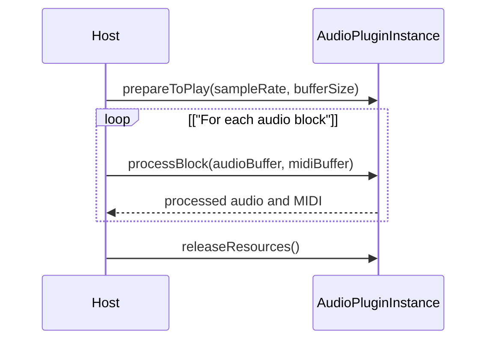

# Audio Plugin System

> **Relevant source files**
> * [extras/AudioPluginHost/Source/Plugins/IOConfigurationWindow.cpp](https://github.com/juce-framework/JUCE/blob/d6181bde/extras/AudioPluginHost/Source/Plugins/IOConfigurationWindow.cpp)
> * [modules/juce_audio_basics/buffers/juce_AudioChannelSet.cpp](https://github.com/juce-framework/JUCE/blob/d6181bde/modules/juce_audio_basics/buffers/juce_AudioChannelSet.cpp)
> * [modules/juce_audio_basics/buffers/juce_AudioChannelSet.h](https://github.com/juce-framework/JUCE/blob/d6181bde/modules/juce_audio_basics/buffers/juce_AudioChannelSet.h)
> * [modules/juce_audio_basics/sources/juce_MemoryAudioSource.cpp](https://github.com/juce-framework/JUCE/blob/d6181bde/modules/juce_audio_basics/sources/juce_MemoryAudioSource.cpp)
> * [modules/juce_audio_formats/codecs/juce_AiffAudioFormat.cpp](https://github.com/juce-framework/JUCE/blob/d6181bde/modules/juce_audio_formats/codecs/juce_AiffAudioFormat.cpp)
> * [modules/juce_audio_formats/codecs/juce_AiffAudioFormat.h](https://github.com/juce-framework/JUCE/blob/d6181bde/modules/juce_audio_formats/codecs/juce_AiffAudioFormat.h)
> * [modules/juce_audio_formats/codecs/juce_CoreAudioFormat.cpp](https://github.com/juce-framework/JUCE/blob/d6181bde/modules/juce_audio_formats/codecs/juce_CoreAudioFormat.cpp)
> * [modules/juce_audio_formats/codecs/juce_CoreAudioFormat.h](https://github.com/juce-framework/JUCE/blob/d6181bde/modules/juce_audio_formats/codecs/juce_CoreAudioFormat.h)
> * [modules/juce_audio_formats/codecs/juce_FlacAudioFormat.cpp](https://github.com/juce-framework/JUCE/blob/d6181bde/modules/juce_audio_formats/codecs/juce_FlacAudioFormat.cpp)
> * [modules/juce_audio_formats/codecs/juce_FlacAudioFormat.h](https://github.com/juce-framework/JUCE/blob/d6181bde/modules/juce_audio_formats/codecs/juce_FlacAudioFormat.h)
> * [modules/juce_audio_formats/codecs/juce_LAMEEncoderAudioFormat.cpp](https://github.com/juce-framework/JUCE/blob/d6181bde/modules/juce_audio_formats/codecs/juce_LAMEEncoderAudioFormat.cpp)
> * [modules/juce_audio_formats/codecs/juce_MP3AudioFormat.h](https://github.com/juce-framework/JUCE/blob/d6181bde/modules/juce_audio_formats/codecs/juce_MP3AudioFormat.h)
> * [modules/juce_audio_formats/codecs/juce_OggVorbisAudioFormat.cpp](https://github.com/juce-framework/JUCE/blob/d6181bde/modules/juce_audio_formats/codecs/juce_OggVorbisAudioFormat.cpp)
> * [modules/juce_audio_formats/codecs/juce_OggVorbisAudioFormat.h](https://github.com/juce-framework/JUCE/blob/d6181bde/modules/juce_audio_formats/codecs/juce_OggVorbisAudioFormat.h)
> * [modules/juce_audio_formats/codecs/juce_WavAudioFormat.cpp](https://github.com/juce-framework/JUCE/blob/d6181bde/modules/juce_audio_formats/codecs/juce_WavAudioFormat.cpp)
> * [modules/juce_audio_formats/codecs/juce_WavAudioFormat.h](https://github.com/juce-framework/JUCE/blob/d6181bde/modules/juce_audio_formats/codecs/juce_WavAudioFormat.h)
> * [modules/juce_audio_formats/codecs/juce_WindowsMediaAudioFormat.cpp](https://github.com/juce-framework/JUCE/blob/d6181bde/modules/juce_audio_formats/codecs/juce_WindowsMediaAudioFormat.cpp)
> * [modules/juce_audio_formats/codecs/juce_WindowsMediaAudioFormat.h](https://github.com/juce-framework/JUCE/blob/d6181bde/modules/juce_audio_formats/codecs/juce_WindowsMediaAudioFormat.h)
> * [modules/juce_audio_formats/format/juce_AudioFormat.cpp](https://github.com/juce-framework/JUCE/blob/d6181bde/modules/juce_audio_formats/format/juce_AudioFormat.cpp)
> * [modules/juce_audio_formats/format/juce_AudioFormat.h](https://github.com/juce-framework/JUCE/blob/d6181bde/modules/juce_audio_formats/format/juce_AudioFormat.h)
> * [modules/juce_audio_formats/format/juce_AudioFormatManager.cpp](https://github.com/juce-framework/JUCE/blob/d6181bde/modules/juce_audio_formats/format/juce_AudioFormatManager.cpp)
> * [modules/juce_audio_formats/format/juce_AudioFormatManager.h](https://github.com/juce-framework/JUCE/blob/d6181bde/modules/juce_audio_formats/format/juce_AudioFormatManager.h)
> * [modules/juce_audio_formats/format/juce_AudioFormatReader.cpp](https://github.com/juce-framework/JUCE/blob/d6181bde/modules/juce_audio_formats/format/juce_AudioFormatReader.cpp)
> * [modules/juce_audio_formats/format/juce_AudioFormatReader.h](https://github.com/juce-framework/JUCE/blob/d6181bde/modules/juce_audio_formats/format/juce_AudioFormatReader.h)
> * [modules/juce_audio_formats/format/juce_AudioSubsectionReader.cpp](https://github.com/juce-framework/JUCE/blob/d6181bde/modules/juce_audio_formats/format/juce_AudioSubsectionReader.cpp)
> * [modules/juce_audio_formats/format/juce_BufferingAudioFormatReader.cpp](https://github.com/juce-framework/JUCE/blob/d6181bde/modules/juce_audio_formats/format/juce_BufferingAudioFormatReader.cpp)
> * [modules/juce_audio_formats/format/juce_BufferingAudioFormatReader.h](https://github.com/juce-framework/JUCE/blob/d6181bde/modules/juce_audio_formats/format/juce_BufferingAudioFormatReader.h)
> * [modules/juce_audio_formats/format/juce_MemoryMappedAudioFormatReader.h](https://github.com/juce-framework/JUCE/blob/d6181bde/modules/juce_audio_formats/format/juce_MemoryMappedAudioFormatReader.h)
> * [modules/juce_audio_processors/format/juce_AudioPluginFormat.cpp](https://github.com/juce-framework/JUCE/blob/d6181bde/modules/juce_audio_processors/format/juce_AudioPluginFormat.cpp)
> * [modules/juce_audio_processors/format/juce_AudioPluginFormat.h](https://github.com/juce-framework/JUCE/blob/d6181bde/modules/juce_audio_processors/format/juce_AudioPluginFormat.h)
> * [modules/juce_audio_processors/format/juce_AudioPluginFormatManager.cpp](https://github.com/juce-framework/JUCE/blob/d6181bde/modules/juce_audio_processors/format/juce_AudioPluginFormatManager.cpp)
> * [modules/juce_audio_processors/format/juce_AudioPluginFormatManager.h](https://github.com/juce-framework/JUCE/blob/d6181bde/modules/juce_audio_processors/format/juce_AudioPluginFormatManager.h)
> * [modules/juce_audio_processors/format_types/juce_AudioUnitPluginFormat.h](https://github.com/juce-framework/JUCE/blob/d6181bde/modules/juce_audio_processors/format_types/juce_AudioUnitPluginFormat.h)
> * [modules/juce_audio_processors/format_types/juce_AudioUnitPluginFormat.mm](https://github.com/juce-framework/JUCE/blob/d6181bde/modules/juce_audio_processors/format_types/juce_AudioUnitPluginFormat.mm)
> * [modules/juce_audio_processors/format_types/juce_LADSPAPluginFormat.cpp](https://github.com/juce-framework/JUCE/blob/d6181bde/modules/juce_audio_processors/format_types/juce_LADSPAPluginFormat.cpp)
> * [modules/juce_audio_processors/format_types/juce_LADSPAPluginFormat.h](https://github.com/juce-framework/JUCE/blob/d6181bde/modules/juce_audio_processors/format_types/juce_LADSPAPluginFormat.h)
> * [modules/juce_audio_processors/format_types/juce_VST3Common.h](https://github.com/juce-framework/JUCE/blob/d6181bde/modules/juce_audio_processors/format_types/juce_VST3Common.h)
> * [modules/juce_audio_processors/format_types/juce_VST3Headers.h](https://github.com/juce-framework/JUCE/blob/d6181bde/modules/juce_audio_processors/format_types/juce_VST3Headers.h)
> * [modules/juce_audio_processors/format_types/juce_VST3PluginFormat.cpp](https://github.com/juce-framework/JUCE/blob/d6181bde/modules/juce_audio_processors/format_types/juce_VST3PluginFormat.cpp)
> * [modules/juce_audio_processors/format_types/juce_VST3PluginFormat.h](https://github.com/juce-framework/JUCE/blob/d6181bde/modules/juce_audio_processors/format_types/juce_VST3PluginFormat.h)
> * [modules/juce_audio_processors/format_types/juce_VST3PluginFormat_test.cpp](https://github.com/juce-framework/JUCE/blob/d6181bde/modules/juce_audio_processors/format_types/juce_VST3PluginFormat_test.cpp)
> * [modules/juce_audio_processors/format_types/juce_VSTPluginFormat.cpp](https://github.com/juce-framework/JUCE/blob/d6181bde/modules/juce_audio_processors/format_types/juce_VSTPluginFormat.cpp)
> * [modules/juce_audio_processors/format_types/juce_VSTPluginFormat.h](https://github.com/juce-framework/JUCE/blob/d6181bde/modules/juce_audio_processors/format_types/juce_VSTPluginFormat.h)
> * [modules/juce_audio_processors/juce_audio_processors.cpp](https://github.com/juce-framework/JUCE/blob/d6181bde/modules/juce_audio_processors/juce_audio_processors.cpp)
> * [modules/juce_audio_processors/processors/juce_AudioProcessor.cpp](https://github.com/juce-framework/JUCE/blob/d6181bde/modules/juce_audio_processors/processors/juce_AudioProcessor.cpp)
> * [modules/juce_audio_processors/processors/juce_AudioProcessor.h](https://github.com/juce-framework/JUCE/blob/d6181bde/modules/juce_audio_processors/processors/juce_AudioProcessor.h)

The Audio Plugin System in JUCE provides a unified framework for hosting and interacting with audio plugins in multiple industry-standard formats, including VST2, VST3, Audio Unit (AU), LADSPA, and LV2. This system enables applications to discover, load, instantiate, and control third-party audio processing plugins using a consistent API, regardless of the underlying plugin technology.

For information on authoring your own plugins, see [4](/juce-framework/JUCE/4-audio-framework).

## System Architecture

The JUCE Audio Plugin System is structured around a set of core abstractions that decouple plugin format specifics from host application logic. The main components are:

* `AudioPluginFormat`: Abstract base class for plugin format handlers (e.g., VST, VST3, AU).
* `AudioPluginFormatManager`: Manages a set of `AudioPluginFormat` instances and coordinates plugin discovery and instantiation.
* `AudioPluginInstance`: Represents a loaded plugin, providing a uniform interface for audio processing and parameter control.
* `PluginDescription`: Stores metadata about a plugin, such as name, format, manufacturer, and version.

### Diagram: Core Audio Plugin System Entities

```

```

Sources:

* [modules/juce_audio_processors/format/juce_AudioPluginFormat.h L46-L89](https://github.com/juce-framework/JUCE/blob/d6181bde/modules/juce_audio_processors/format/juce_AudioPluginFormat.h#L46-L89)
* [modules/juce_audio_processors/format/juce_AudioPluginFormatManager.h L46-L65](https://github.com/juce-framework/JUCE/blob/d6181bde/modules/juce_audio_processors/format/juce_AudioPluginFormatManager.h#L46-L65)
* [modules/juce_audio_processors/processors/juce_PluginDescription.cpp](https://github.com/juce-framework/JUCE/blob/d6181bde/modules/juce_audio_processors/processors/juce_PluginDescription.cpp)

## Supported Plugin Formats

JUCE supports the following plugin formats via dedicated handler classes:

| Format | Platforms | Handler Class | Source File |
| --- | --- | --- | --- |
| VST2 | Windows, macOS, Linux | `VSTPluginFormat` | juce_VSTPluginFormat.cpp |
| VST3 | Windows, macOS, Linux | `VST3PluginFormat` | juce_VST3PluginFormat.cpp |
| Audio Unit | macOS, iOS | `AudioUnitPluginFormat` | juce_AudioUnitPluginFormat.mm |
| LADSPA | Linux | `LADSPAPluginFormat` | juce_LADSPAPluginFormat.cpp |
| LV2 | Windows, macOS, Linux | `LV2PluginFormat` | juce_LV2PluginFormat.cpp |

The `AudioPluginFormatManager` class provides the `addDefaultFormats()` method to register all available plugin formats for the current platform. This method conditionally adds each format handler based on compile-time flags.

Sources:

* [modules/juce_audio_processors/format_types/juce_VSTPluginFormat.cpp](https://github.com/juce-framework/JUCE/blob/d6181bde/modules/juce_audio_processors/format_types/juce_VSTPluginFormat.cpp)
* [modules/juce_audio_processors/format_types/juce_VST3PluginFormat.cpp](https://github.com/juce-framework/JUCE/blob/d6181bde/modules/juce_audio_processors/format_types/juce_VST3PluginFormat.cpp)
* [modules/juce_audio_processors/format_types/juce_AudioUnitPluginFormat.mm](https://github.com/juce-framework/JUCE/blob/d6181bde/modules/juce_audio_processors/format_types/juce_AudioUnitPluginFormat.mm)
* [modules/juce_audio_processors/format_types/juce_LADSPAPluginFormat.cpp](https://github.com/juce-framework/JUCE/blob/d6181bde/modules/juce_audio_processors/format_types/juce_LADSPAPluginFormat.cpp)
* [modules/juce_audio_processors/juce_audio_processors.cpp L42-L66](https://github.com/juce-framework/JUCE/blob/d6181bde/modules/juce_audio_processors/juce_audio_processors.cpp#L42-L66)

## Core Components

### AudioPluginFormat

`AudioPluginFormat` is the abstract base class for all plugin format handlers. It defines the interface for:

* Discovering available plugins (`findAllTypesForFile`)
* Instantiating plugins (`createInstanceFromDescription`)
* Providing default search locations (`getDefaultLocationsToSearch`)

Each supported plugin format (VST, VST3, AU, etc.) implements its own subclass of `AudioPluginFormat`.

Sources:

* [modules/juce_audio_processors/format/juce_AudioPluginFormat.h L46-L89](https://github.com/juce-framework/JUCE/blob/d6181bde/modules/juce_audio_processors/format/juce_AudioPluginFormat.h#L46-L89)

### AudioPluginFormatManager

`AudioPluginFormatManager` manages a collection of `AudioPluginFormat` objects and provides unified methods for plugin discovery and instantiation across all registered formats.

Sources:

* [modules/juce_audio_processors/format/juce_AudioPluginFormatManager.h L46-L65](https://github.com/juce-framework/JUCE/blob/d6181bde/modules/juce_audio_processors/format/juce_AudioPluginFormatManager.h#L46-L65)
* [modules/juce_audio_processors/format/juce_AudioPluginFormatManager.cpp L42-L72](https://github.com/juce-framework/JUCE/blob/d6181bde/modules/juce_audio_processors/format/juce_AudioPluginFormatManager.cpp#L42-L72)

### PluginDescription

`PluginDescription` encapsulates metadata about a plugin, such as its name, format, manufacturer, version, and unique identifier. This information is used to identify, display, and instantiate plugins.

Sources:

* [modules/juce_audio_processors/processors/juce_PluginDescription.cpp](https://github.com/juce-framework/JUCE/blob/d6181bde/modules/juce_audio_processors/processors/juce_PluginDescription.cpp)

### AudioPluginInstance

`AudioPluginInstance` is a subclass of `AudioProcessor` that represents a loaded plugin instance. It provides a consistent interface for audio processing, parameter management, and state handling, regardless of the plugin's native format.

Sources:

* [modules/juce_audio_processors/processors/juce_AudioPluginInstance.cpp](https://github.com/juce-framework/JUCE/blob/d6181bde/modules/juce_audio_processors/processors/juce_AudioPluginInstance.cpp)

## Plugin Loading and Instantiation Flow

The process of loading and instantiating a plugin in JUCE involves several steps, coordinated by the `AudioPluginFormatManager` and the relevant `AudioPluginFormat` subclass.

### Diagram: Plugin Loading Sequence

```

```

Sources:

* [modules/juce_audio_processors/format/juce_AudioPluginFormat.cpp L41-L63](https://github.com/juce-framework/JUCE/blob/d6181bde/modules/juce_audio_processors/format/juce_AudioPluginFormat.cpp#L41-L63)
* [modules/juce_audio_processors/format/juce_AudioPluginFormatManager.cpp L108-L128](https://github.com/juce-framework/JUCE/blob/d6181bde/modules/juce_audio_processors/format/juce_AudioPluginFormatManager.cpp#L108-L128)

## Format-Specific Implementations

Each plugin format is implemented as a subclass of `AudioPluginFormat`, with additional classes for managing plugin instances and format-specific details.

### VST2 Plugin Format

* Handler: `VSTPluginFormat`
* Instance: `VSTPluginInstance`
* Module management: `ModuleHandle`
* Parameter abstraction: `VSTParameter`

```

```

Sources:

* [modules/juce_audio_processors/format_types/juce_VSTPluginFormat.h L46-L107](https://github.com/juce-framework/JUCE/blob/d6181bde/modules/juce_audio_processors/format_types/juce_VSTPluginFormat.h#L46-L107)
* [modules/juce_audio_processors/format_types/juce_VSTPluginFormat.cpp L589-L826](https://github.com/juce-framework/JUCE/blob/d6181bde/modules/juce_audio_processors/format_types/juce_VSTPluginFormat.cpp#L589-L826)
* [modules/juce_audio_processors/format_types/juce_VSTPluginFormat.cpp L860-L999](https://github.com/juce-framework/JUCE/blob/d6181bde/modules/juce_audio_processors/format_types/juce_VSTPluginFormat.cpp#L860-L999)

### VST3 Plugin Format

* Handler: `VST3PluginFormat`
* Instance: `VST3PluginInstance`
* Host context: `VST3HostContext`

```

```

Sources:

* [modules/juce_audio_processors/format_types/juce_VST3PluginFormat.h L45-L90](https://github.com/juce-framework/JUCE/blob/d6181bde/modules/juce_audio_processors/format_types/juce_VST3PluginFormat.h#L45-L90)
* [modules/juce_audio_processors/format_types/juce_VST3PluginFormat.cpp L558-L735](https://github.com/juce-framework/JUCE/blob/d6181bde/modules/juce_audio_processors/format_types/juce_VST3PluginFormat.cpp#L558-L735)
* [modules/juce_audio_processors/format_types/juce_VST3Common.h L57-L183](https://github.com/juce-framework/JUCE/blob/d6181bde/modules/juce_audio_processors/format_types/juce_VST3Common.h#L57-L183)

### AudioUnit Plugin Format

* Handler: `AudioUnitPluginFormat`
* Instance: `AudioUnitPluginInstance`
* Parameter abstraction: `AUInstanceParameter`

```

```

Sources:

* [modules/juce_audio_processors/format_types/juce_AudioUnitPluginFormat.h L46-L64](https://github.com/juce-framework/JUCE/blob/d6181bde/modules/juce_audio_processors/format_types/juce_AudioUnitPluginFormat.h#L46-L64)
* [modules/juce_audio_processors/format_types/juce_AudioUnitPluginFormat.mm L599-L664](https://github.com/juce-framework/JUCE/blob/d6181bde/modules/juce_audio_processors/format_types/juce_AudioUnitPluginFormat.mm#L599-L664)

## Bus and Channel Management

JUCE provides a flexible system for managing audio channel configurations using the concepts of "buses" and "channel sets". A bus is a logical group of audio channels (e.g., a stereo input or surround output).

### Diagram: Bus and ChannelSet Relationships

```

```

This system enables plugins to:

* Support multiple input and output buses
* Negotiate compatible channel layouts with the host
* Handle complex multi-channel and surround configurations

`AudioChannelSet` provides standard layouts (mono, stereo, 5.1, etc.) and methods for custom channel arrangements.

Sources:

* [modules/juce_audio_processors/processors/juce_AudioProcessor.h L317-L470](https://github.com/juce-framework/JUCE/blob/d6181bde/modules/juce_audio_processors/processors/juce_AudioProcessor.h#L317-L470)
* [modules/juce_audio_processors/processors/juce_AudioProcessor.cpp L118-L330](https://github.com/juce-framework/JUCE/blob/d6181bde/modules/juce_audio_processors/processors/juce_AudioProcessor.cpp#L118-L330)
* [modules/juce_audio_basics/buffers/juce_AudioChannelSet.h L58-L183](https://github.com/juce-framework/JUCE/blob/d6181bde/modules/juce_audio_basics/buffers/juce_AudioChannelSet.h#L58-L183)
* [modules/juce_audio_basics/buffers/juce_AudioChannelSet.cpp L40-L166](https://github.com/juce-framework/JUCE/blob/d6181bde/modules/juce_audio_basics/buffers/juce_AudioChannelSet.cpp#L40-L166)

## Plugin Communication and Audio Processing

The host interacts with a loaded plugin instance via the `AudioPluginInstance` interface, which is a subclass of `AudioProcessor`. The main methods involved in the audio processing lifecycle are:

* `prepareToPlay(double sampleRate, int maximumExpectedSamplesPerBlock)`
* `processBlock(AudioBuffer<float>& buffer, MidiBuffer& midiMessages)`
* `releaseResources()`

### Diagram: Audio Processing Lifecycle



Parameter interaction is also standardized:

* `getParameters()`
* `getParameter()`, `setParameter()`
* `getParameterName()`, `getParameterText()`

Sources:

* [modules/juce_audio_processors/processors/juce_AudioProcessor.h L136-L214](https://github.com/juce-framework/JUCE/blob/d6181bde/modules/juce_audio_processors/processors/juce_AudioProcessor.h#L136-L214)
* [modules/juce_audio_processors/processors/juce_AudioProcessor.h L217-L286](https://github.com/juce-framework/JUCE/blob/d6181bde/modules/juce_audio_processors/processors/juce_AudioProcessor.h#L217-L286)

## Channel Mapping Between Host and Plugin

Different plugin formats may use different channel ordering conventions. The JUCE Audio Plugin System provides mechanisms to map between the host's (JUCE's) channel order and the plugin's native order.

### Diagram: Channel Mapping Flow

```

```

Format-specific implementations:

* `VST3PluginFormat`: Uses `SingleDirectionChannelMapping` to map between VST3 and JUCE layouts.
* `AudioUnitPluginFormat`: Implements mapping between AudioUnit and JUCE layouts.

Sources:

* [modules/juce_audio_processors/format_types/juce_VST3Common.h L209-L321](https://github.com/juce-framework/JUCE/blob/d6181bde/modules/juce_audio_processors/format_types/juce_VST3Common.h#L209-L321)
* [modules/juce_audio_processors/format_types/juce_AudioUnitPluginFormat.mm L372-L427](https://github.com/juce-framework/JUCE/blob/d6181bde/modules/juce_audio_processors/format_types/juce_AudioUnitPluginFormat.mm#L372-L427)

## Integration with JUCE's Audio Pipeline

The Audio Plugin System is designed to integrate seamlessly with the JUCE audio processing pipeline. The `AudioProcessorGraph` class allows multiple `AudioPluginInstance` objects to be connected in a directed graph, enabling complex audio routing and processing networks.

### Diagram: AudioProcessorGraph and Plugin Instances

```

```

This architecture enables flexible and modular audio processing chains.

Sources:

* [modules/juce_audio_processors/processors/juce_AudioProcessorGraph.cpp](https://github.com/juce-framework/JUCE/blob/d6181bde/modules/juce_audio_processors/processors/juce_AudioProcessorGraph.cpp)

## Plugin Parameter Handling

The Audio Plugin System standardizes parameter access and manipulation using the `AudioProcessorParameter` class hierarchy. Each plugin format translates its native parameter model into JUCE's common interface, enabling consistent parameter automation, display, and control.

Sources:

* [modules/juce_audio_processors/processors/juce_AudioProcessor.h L430-L457](https://github.com/juce-framework/JUCE/blob/d6181bde/modules/juce_audio_processors/processors/juce_AudioProcessor.h#L430-L457)
* [modules/juce_audio_processors/format_types/juce_VSTPluginFormat.cpp L864-L998](https://github.com/juce-framework/JUCE/blob/d6181bde/modules/juce_audio_processors/format_types/juce_VSTPluginFormat.cpp#L864-L998)
* [modules/juce_audio_processors/format_types/juce_VST3PluginFormat.cpp L111-L125](https://github.com/juce-framework/JUCE/blob/d6181bde/modules/juce_audio_processors/format_types/juce_VST3PluginFormat.cpp#L111-L125)
* [modules/juce_audio_processors/format_types/juce_AudioUnitPluginFormat.mm L602-L665](https://github.com/juce-framework/JUCE/blob/d6181bde/modules/juce_audio_processors/format_types/juce_AudioUnitPluginFormat.mm#L602-L665)

## Summary

The JUCE Audio Plugin System provides a comprehensive framework for hosting and interacting with audio plugins across multiple formats. It abstracts away the format-specific details, allowing applications to work with plugins through a consistent interface.

Key features include:

* Support for multiple plugin formats (VST, VST3, AudioUnit, LADSPA, LV2)
* Unified parameter handling
* Flexible bus and channel configuration
* Seamless integration with JUCE's audio processing pipeline

The system handles the complexities of different plugin APIs, channel arrangements, and parameter models, providing a simplified interface for host applications.