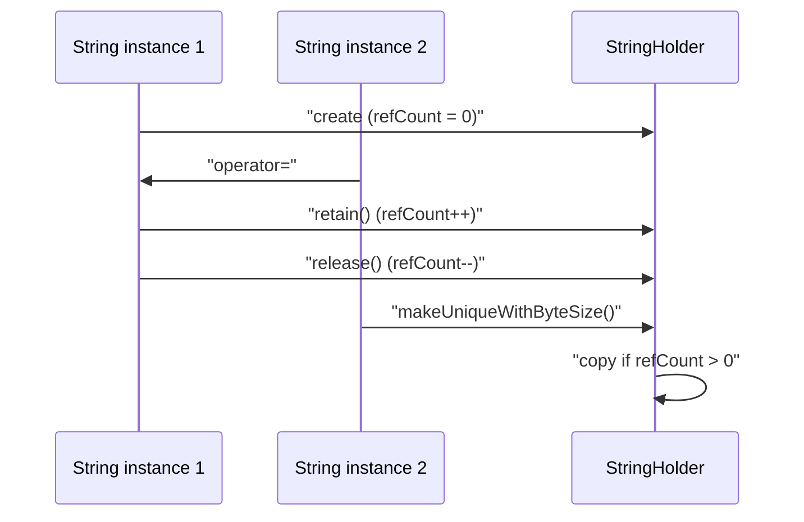
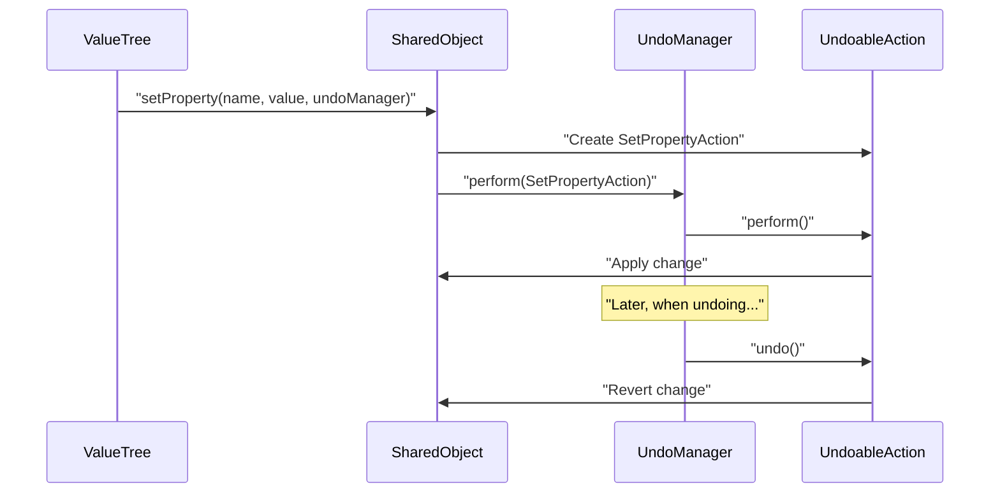
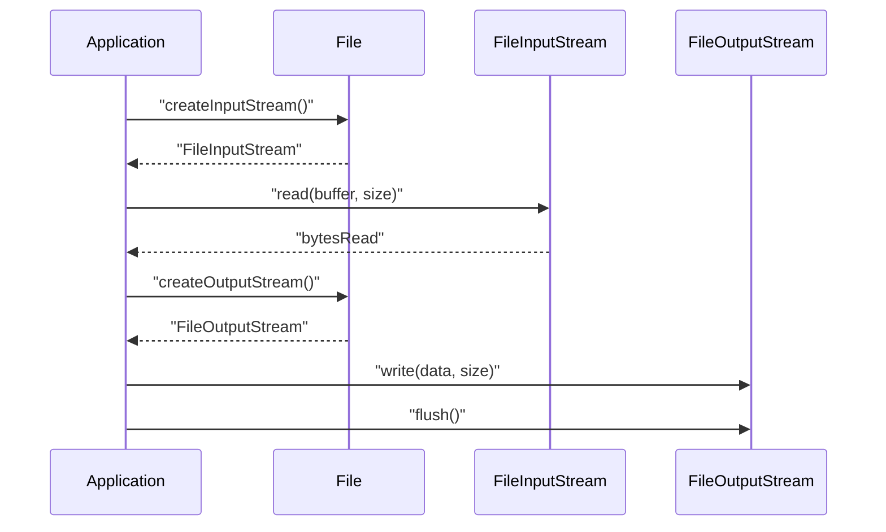

# String, ValueTree, and File

> **Relevant source files**
> * [BREAKING_CHANGES.md](https://github.com/juce-framework/JUCE/blob/d6181bde/BREAKING_CHANGES.md)
> * [CHANGE_LIST.md](https://github.com/juce-framework/JUCE/blob/d6181bde/CHANGE_LIST.md)
> * [modules/juce_core/containers/juce_DynamicObject.cpp](https://github.com/juce-framework/JUCE/blob/d6181bde/modules/juce_core/containers/juce_DynamicObject.cpp)
> * [modules/juce_core/containers/juce_DynamicObject.h](https://github.com/juce-framework/JUCE/blob/d6181bde/modules/juce_core/containers/juce_DynamicObject.h)
> * [modules/juce_core/containers/juce_NamedValueSet.cpp](https://github.com/juce-framework/JUCE/blob/d6181bde/modules/juce_core/containers/juce_NamedValueSet.cpp)
> * [modules/juce_core/containers/juce_NamedValueSet.h](https://github.com/juce-framework/JUCE/blob/d6181bde/modules/juce_core/containers/juce_NamedValueSet.h)
> * [modules/juce_core/containers/juce_Variant.cpp](https://github.com/juce-framework/JUCE/blob/d6181bde/modules/juce_core/containers/juce_Variant.cpp)
> * [modules/juce_core/containers/juce_Variant.h](https://github.com/juce-framework/JUCE/blob/d6181bde/modules/juce_core/containers/juce_Variant.h)
> * [modules/juce_core/files/juce_File.cpp](https://github.com/juce-framework/JUCE/blob/d6181bde/modules/juce_core/files/juce_File.cpp)
> * [modules/juce_core/files/juce_File.h](https://github.com/juce-framework/JUCE/blob/d6181bde/modules/juce_core/files/juce_File.h)
> * [modules/juce_core/native/juce_BasicNativeHeaders.h](https://github.com/juce-framework/JUCE/blob/d6181bde/modules/juce_core/native/juce_BasicNativeHeaders.h)
> * [modules/juce_core/network/juce_URL.cpp](https://github.com/juce-framework/JUCE/blob/d6181bde/modules/juce_core/network/juce_URL.cpp)
> * [modules/juce_core/network/juce_URL.h](https://github.com/juce-framework/JUCE/blob/d6181bde/modules/juce_core/network/juce_URL.h)
> * [modules/juce_core/network/juce_WebInputStream.cpp](https://github.com/juce-framework/JUCE/blob/d6181bde/modules/juce_core/network/juce_WebInputStream.cpp)
> * [modules/juce_core/network/juce_WebInputStream.h](https://github.com/juce-framework/JUCE/blob/d6181bde/modules/juce_core/network/juce_WebInputStream.h)
> * [modules/juce_core/text/juce_Identifier.cpp](https://github.com/juce-framework/JUCE/blob/d6181bde/modules/juce_core/text/juce_Identifier.cpp)
> * [modules/juce_core/text/juce_Identifier.h](https://github.com/juce-framework/JUCE/blob/d6181bde/modules/juce_core/text/juce_Identifier.h)
> * [modules/juce_core/text/juce_NewLine.h](https://github.com/juce-framework/JUCE/blob/d6181bde/modules/juce_core/text/juce_NewLine.h)
> * [modules/juce_core/text/juce_String.cpp](https://github.com/juce-framework/JUCE/blob/d6181bde/modules/juce_core/text/juce_String.cpp)
> * [modules/juce_core/text/juce_String.h](https://github.com/juce-framework/JUCE/blob/d6181bde/modules/juce_core/text/juce_String.h)
> * [modules/juce_core/text/juce_StringRef.h](https://github.com/juce-framework/JUCE/blob/d6181bde/modules/juce_core/text/juce_StringRef.h)
> * [modules/juce_core/xml/juce_XmlElement.cpp](https://github.com/juce-framework/JUCE/blob/d6181bde/modules/juce_core/xml/juce_XmlElement.cpp)
> * [modules/juce_data_structures/values/juce_ValueTree.cpp](https://github.com/juce-framework/JUCE/blob/d6181bde/modules/juce_data_structures/values/juce_ValueTree.cpp)
> * [modules/juce_data_structures/values/juce_ValueTree.h](https://github.com/juce-framework/JUCE/blob/d6181bde/modules/juce_data_structures/values/juce_ValueTree.h)
> * [modules/juce_product_unlocking/native/java/app/com/rmsl/juce/JuceBillingClient.java](https://github.com/juce-framework/JUCE/blob/d6181bde/modules/juce_product_unlocking/native/java/app/com/rmsl/juce/JuceBillingClient.java)

This page documents three core data types in the JUCE framework: `String`, `ValueTree`, and `File`. These types are foundational to the operation of JUCE applications and are used throughout the framework for text processing, hierarchical data modeling, and file system access.

* **String**: Unicode-capable, reference-counted text representation and manipulation.
* **ValueTree**: Hierarchical, property-based data structure with undo/redo and change notification.
* **File**: Platform-independent abstraction for files and directories, supporting comprehensive file system operations.

These types are tightly integrated: `String` is used for property names, values, and file paths; `ValueTree` uses `String` for its identifiers and properties and can be serialized to or from a `File` for persistence.

Sources: [modules/juce_core/text/juce_String.h L53-L1442](https://github.com/juce-framework/JUCE/blob/d6181bde/modules/juce_core/text/juce_String.h#L53-L1442)

 [modules/juce_data_structures/values/juce_ValueTree.h L80-L1097](https://github.com/juce-framework/JUCE/blob/d6181bde/modules/juce_data_structures/values/juce_ValueTree.h#L80-L1097)

 [modules/juce_core/files/juce_File.h L56-L872](https://github.com/juce-framework/JUCE/blob/d6181bde/modules/juce_core/files/juce_File.h#L56-L872)

## String: Unicode Text Handling

The `juce::String` class is the primary text representation in JUCE. It is designed for efficient Unicode text storage and manipulation, using a reference-counted internal buffer to minimize unnecessary copying.

### Key Features

* Reference-counted internal storage for efficient memory usage.
* Multiple constructors for different encodings (ASCII, UTF-8, UTF-16, UTF-32, `wchar_t`).
* Comprehensive string manipulation, comparison, and conversion methods.
* Configurable internal encoding via `JUCE_STRING_UTF_TYPE`.

#### Diagram: "String" and "StringHolder" Relationship

```

```

Sources: [modules/juce_core/text/juce_String.h L53-L1442](https://github.com/juce-framework/JUCE/blob/d6181bde/modules/juce_core/text/juce_String.h#L53-L1442)

 [modules/juce_core/text/juce_String.cpp L38-L246](https://github.com/juce-framework/JUCE/blob/d6181bde/modules/juce_core/text/juce_String.cpp#L38-L246)

### Reference Counting and Copy-on-Write

`String` uses a reference-counted buffer (`StringHolder`) to allow multiple `String` objects to share the same memory until a modification is required (copy-on-write).

#### Diagram: "String" Reference Counting and Copy-on-Write



Sources: [modules/juce_core/text/juce_String.cpp L60-L229](https://github.com/juce-framework/JUCE/blob/d6181bde/modules/juce_core/text/juce_String.cpp#L60-L229)

 [modules/juce_core/text/juce_String.cpp L245-L284](https://github.com/juce-framework/JUCE/blob/d6181bde/modules/juce_core/text/juce_String.cpp#L245-L284)

### String Construction and Conversion

`String` can be constructed from:

* C-style strings (ASCII, UTF-8, UTF-16, UTF-32, `wchar_t`)
* Numeric types (int, double, float, etc.)
* Other `String` objects

It also provides conversion methods to numeric types and different encodings.

| Constructor/Method | Description |
| --- | --- |
| `String(const char*)` | From ASCII/UTF-8 C-string |
| `String(int)` | From integer |
| `String(double)` | From floating-point |
| `String(const String&)` | Copy constructor |
| `toInteger()` | Convert to integer |
| `toDouble()` | Convert to double |
| `toUTF8()` | Get UTF-8 encoded representation |

Sources: [modules/juce_core/text/juce_String.cpp L306-L384](https://github.com/juce-framework/JUCE/blob/d6181bde/modules/juce_core/text/juce_String.cpp#L306-L384)

 [modules/juce_core/text/juce_String.cpp L526-L538](https://github.com/juce-framework/JUCE/blob/d6181bde/modules/juce_core/text/juce_String.cpp#L526-L538)

### Unicode and Encoding

`String` supports Unicode and can use different internal encodings, selectable at compile time via `JUCE_STRING_UTF_TYPE`. It interoperates with `CharPointer_UTF8`, `CharPointer_UTF16`, and `CharPointer_UTF32`.

#### Diagram: "String" Internal Encoding and Conversion

```

```

Sources: [modules/juce_core/text/juce_String.h L194-L202](https://github.com/juce-framework/JUCE/blob/d6181bde/modules/juce_core/text/juce_String.h#L194-L202)

 [modules/juce_core/text/juce_String.cpp L45-L52](https://github.com/juce-framework/JUCE/blob/d6181bde/modules/juce_core/text/juce_String.cpp#L45-L52)

## ValueTree: Hierarchical Data Structure

The `juce::ValueTree` class is a reference-counted, hierarchical data structure for storing named properties and child nodes. It is used for representing structured data such as application state, plugin parameters, and document models.

### Key Features

* Each node has a type (`Identifier`), a set of properties (`NamedValueSet`), and zero or more child nodes.
* Properties are stored as name-value pairs, where names are `Identifier` and values are `var`.
* Supports undo/redo via `UndoManager`.
* Change notification via listeners.

#### Diagram: "ValueTree" and Related Code Entities

```

```

Sources: [modules/juce_data_structures/values/juce_ValueTree.h L80-L1097](https://github.com/juce-framework/JUCE/blob/d6181bde/modules/juce_data_structures/values/juce_ValueTree.h#L80-L1097)

 [modules/juce_data_structures/values/juce_ValueTree.cpp L38-L582](https://github.com/juce-framework/JUCE/blob/d6181bde/modules/juce_data_structures/values/juce_ValueTree.cpp#L38-L582)

### Structure and Example

Each `ValueTree` node has:

* A type (`Identifier`)
* Properties (`NamedValueSet`)
* Zero or more children (`ValueTree`)

#### Diagram: "ValueTree" Example Structure

```

```

Sources: [modules/juce_data_structures/values/juce_ValueTree.h L125-L138](https://github.com/juce-framework/JUCE/blob/d6181bde/modules/juce_data_structures/values/juce_ValueTree.h#L125-L138)

 [modules/juce_data_structures/values/juce_ValueTree.cpp L38-L129](https://github.com/juce-framework/JUCE/blob/d6181bde/modules/juce_data_structures/values/juce_ValueTree.cpp#L38-L129)

### Property Access and Manipulation

`ValueTree` provides methods for property access and modification:

| Method | Description |
| --- | --- |
| `getProperty(const Identifier&)` | Retrieve a property value |
| `setProperty(const Identifier&, const var&, UndoManager*)` | Set a property value (with optional undo) |
| `hasProperty(const Identifier&)` | Check if a property exists |
| `removeProperty(const Identifier&, UndoManager*)` | Remove a property (with optional undo) |
| `getPropertyAsValue()` | Get a `Value` object for dynamic binding |

Sources: [modules/juce_data_structures/values/juce_ValueTree.cpp L746-L859](https://github.com/juce-framework/JUCE/blob/d6181bde/modules/juce_data_structures/values/juce_ValueTree.cpp#L746-L859)

### Child Node Management

`ValueTree` supports hierarchical data via child node operations:

| Method | Description |
| --- | --- |
| `getNumChildren()` | Get the number of child nodes |
| `getChild(int)` | Get a child node by index |
| `addChild(const ValueTree&, int, UndoManager*)` | Add a child node (with optional undo) |
| `removeChild(int, UndoManager*)` | Remove a child node (with optional undo) |
| `moveChild(int, int, UndoManager*)` | Move a child node (with optional undo) |

Sources: [modules/juce_data_structures/values/juce_ValueTree.cpp L862-L935](https://github.com/juce-framework/JUCE/blob/d6181bde/modules/juce_data_structures/values/juce_ValueTree.cpp#L862-L935)

### Undo/Redo Integration

`ValueTree` supports undo/redo for all structural and property changes via the `UndoManager` class. Modifying methods accept an optional `UndoManager*` parameter.

#### Diagram: "ValueTree" Undo/Redo Flow



Sources: [modules/juce_data_structures/values/juce_ValueTree.cpp L139-L179](https://github.com/juce-framework/JUCE/blob/d6181bde/modules/juce_data_structures/values/juce_ValueTree.cpp#L139-L179)

 [modules/juce_data_structures/values/juce_ValueTree.cpp L418-L479](https://github.com/juce-framework/JUCE/blob/d6181bde/modules/juce_data_structures/values/juce_ValueTree.cpp#L418-L479)

### Change Notification and Listeners

`ValueTree` supports change notification via a listener interface. Listeners are notified of property changes, child addition/removal, and structural changes.

#### Diagram: "ValueTree" Listener Notification

```

```

Sources: [modules/juce_data_structures/values/juce_ValueTree.cpp L77-L137](https://github.com/juce-framework/JUCE/blob/d6181bde/modules/juce_data_structures/values/juce_ValueTree.cpp#L77-L137)

 [modules/juce_data_structures/values/juce_ValueTree.h L367-L423](https://github.com/juce-framework/JUCE/blob/d6181bde/modules/juce_data_structures/values/juce_ValueTree.h#L367-L423)

## File: Platform-Independent File and Directory Abstraction

The `juce::File` class represents files and directories in a platform-independent way. It provides methods for path manipulation, file and directory operations, and file I/O.

### Key Features

* Stores absolute file paths as `String`.
* Methods for path parsing, normalization, and manipulation.
* File and directory creation, deletion, copying, and moving.
* File I/O via `FileInputStream` and `FileOutputStream`.

#### Diagram: "File" and Related Code Entities

```

```

Sources: [modules/juce_core/files/juce_File.h L56-L872](https://github.com/juce-framework/JUCE/blob/d6181bde/modules/juce_core/files/juce_File.h#L56-L872)

 [modules/juce_core/files/juce_File.cpp L38-L229](https://github.com/juce-framework/JUCE/blob/d6181bde/modules/juce_core/files/juce_File.cpp#L38-L229)

### Path Representation and Manipulation

`File` uses `String` for path representation and provides methods for manipulating and normalizing paths.

#### Diagram: "File" Path Operations

```

```

Sources: [modules/juce_core/files/juce_File.cpp L79-L235](https://github.com/juce-framework/JUCE/blob/d6181bde/modules/juce_core/files/juce_File.cpp#L79-L235)

 [modules/juce_core/files/juce_File.h L154-L242](https://github.com/juce-framework/JUCE/blob/d6181bde/modules/juce_core/files/juce_File.h#L154-L242)

### File Operations

`File` provides methods for file and directory operations:

| Operation | Method | Description |
| --- | --- | --- |
| Create file | `create()` | Create a new file |
| Create directory | `createDirectory()` | Create a directory |
| Copy | `copyFileTo(const File&)` | Copy to a new location |
| Move | `moveFileTo(const File&)` | Move to a new location |
| Delete | `deleteFile()` | Delete the file |
| Delete recursively | `deleteRecursively()` | Delete a directory and its contents |

Sources: [modules/juce_core/files/juce_File.cpp L272-L354](https://github.com/juce-framework/JUCE/blob/d6181bde/modules/juce_core/files/juce_File.cpp#L272-L354)

 [modules/juce_core/files/juce_File.cpp L510-L547](https://github.com/juce-framework/JUCE/blob/d6181bde/modules/juce_core/files/juce_File.cpp#L510-L547)

### File Information and Metadata

`File` provides methods to query file properties and metadata:

| Information | Method | Description |
| --- | --- | --- |
| Existence | `exists()` | Check if the file exists |
| Type | `isDirectory()` | Check if it's a directory |
| Size | `getSize()` | Get the file size in bytes |
| Dates | `getLastModificationTime()` | Get the last modification time |
| Permissions | `hasReadAccess()` | Check read permissions |
| Permissions | `hasWriteAccess()` | Check write permissions |

Sources: [modules/juce_core/files/juce_File.cpp L113-L141](https://github.com/juce-framework/JUCE/blob/d6181bde/modules/juce_core/files/juce_File.cpp#L113-L141)

 [modules/juce_core/files/juce_File.h L109-L146](https://github.com/juce-framework/JUCE/blob/d6181bde/modules/juce_core/files/juce_File.h#L109-L146)

### File I/O Streams

`File` can create input and output streams for reading and writing file data.

#### Diagram: "File" I/O Stream Usage



Sources: [modules/juce_core/files/juce_File.cpp L744-L762](https://github.com/juce-framework/JUCE/blob/d6181bde/modules/juce_core/files/juce_File.cpp#L744-L762)

 [modules/juce_core/files/juce_File.h L744-L762](https://github.com/juce-framework/JUCE/blob/d6181bde/modules/juce_core/files/juce_File.h#L744-L762)

### File Searching and Filtering

`File` provides methods for searching and filtering files and directories.

#### Diagram: "File" Searching and Filtering

```

```

Sources: [modules/juce_core/files/juce_File.cpp L584-L617](https://github.com/juce-framework/JUCE/blob/d6181bde/modules/juce_core/files/juce_File.cpp#L584-L617)

 [modules/juce_core/files/juce_File.h L601-L617](https://github.com/juce-framework/JUCE/blob/d6181bde/modules/juce_core/files/juce_File.h#L601-L617)

## Integration: String, ValueTree, and File

These three types are designed to work together for data modeling, persistence, and I/O in JUCE applications.

#### Diagram: "String", "ValueTree", and "File" Integration

```

```

Sources: [modules/juce_data_structures/values/juce_ValueTree.cpp L374-L415](https://github.com/juce-framework/JUCE/blob/d6181bde/modules/juce_data_structures/values/juce_ValueTree.cpp#L374-L415)

 [modules/juce_core/files/juce_File.cpp L558-L576](https://github.com/juce-framework/JUCE/blob/d6181bde/modules/juce_core/files/juce_File.cpp#L558-L576)

### Usage Patterns and Performance

Common usage patterns enabled by these types:

* **Configuration Storage**: `ValueTree` for settings, persisted via `File`.
* **Document Models**: `ValueTree` as document model, serialized to/from `File`.
* **Plugin State**: Audio plugins use `ValueTree` for state, serialized for host communication.
* **UI State**: UI layouts and state stored in `ValueTree`.

Performance considerations:

* `String` and `ValueTree` use reference counting for efficient memory usage and sharing.
* `File` is a lightweight wrapper; actual I/O is performed by stream classes.

Sources: [modules/juce_core/text/juce_String.cpp L245-L284](https://github.com/juce-framework/JUCE/blob/d6181bde/modules/juce_core/text/juce_String.cpp#L245-L284)

 [modules/juce_data_structures/values/juce_ValueTree.cpp L585-L648](https://github.com/juce-framework/JUCE/blob/d6181bde/modules/juce_data_structures/values/juce_ValueTree.cpp#L585-L648)

 [modules/juce_core/files/juce_File.cpp L744-L762](https://github.com/juce-framework/JUCE/blob/d6181bde/modules/juce_core/files/juce_File.cpp#L744-L762)

## Summary

The String, ValueTree, and File classes form a foundational triad of data structures in JUCE:

* **String** provides efficient Unicode text handling with reference counting
* **ValueTree** delivers a flexible hierarchical data structure with undo/redo support
* **File** offers platform-independent file system operations

These components are tightly integrated, with ValueTree using String for property names/values and File for persistence, while File uses String for path representation. Understanding these three classes is essential for effective JUCE application development.