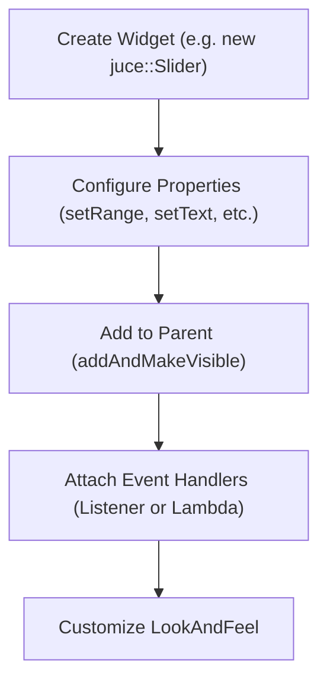

# Widgets and Controls

> **Relevant source files**
> * [extras/Projucer/Source/Utility/UI/jucer_ProjucerLookAndFeel.cpp](https://github.com/juce-framework/JUCE/blob/d6181bde/extras/Projucer/Source/Utility/UI/jucer_ProjucerLookAndFeel.cpp)
> * [extras/Projucer/Source/Utility/UI/jucer_ProjucerLookAndFeel.h](https://github.com/juce-framework/JUCE/blob/d6181bde/extras/Projucer/Source/Utility/UI/jucer_ProjucerLookAndFeel.h)
> * [modules/juce_core/maths/juce_StatisticsAccumulator.h](https://github.com/juce-framework/JUCE/blob/d6181bde/modules/juce_core/maths/juce_StatisticsAccumulator.h)
> * [modules/juce_graphics/geometry/juce_BorderSize.h](https://github.com/juce-framework/JUCE/blob/d6181bde/modules/juce_graphics/geometry/juce_BorderSize.h)
> * [modules/juce_graphics/geometry/juce_Parallelogram.h](https://github.com/juce-framework/JUCE/blob/d6181bde/modules/juce_graphics/geometry/juce_Parallelogram.h)
> * [modules/juce_graphics/placement/juce_Justification.h](https://github.com/juce-framework/JUCE/blob/d6181bde/modules/juce_graphics/placement/juce_Justification.h)
> * [modules/juce_graphics/placement/juce_RectanglePlacement.cpp](https://github.com/juce-framework/JUCE/blob/d6181bde/modules/juce_graphics/placement/juce_RectanglePlacement.cpp)
> * [modules/juce_graphics/placement/juce_RectanglePlacement.h](https://github.com/juce-framework/JUCE/blob/d6181bde/modules/juce_graphics/placement/juce_RectanglePlacement.h)
> * [modules/juce_gui_basics/layout/juce_ScrollBar.cpp](https://github.com/juce-framework/JUCE/blob/d6181bde/modules/juce_gui_basics/layout/juce_ScrollBar.cpp)
> * [modules/juce_gui_basics/layout/juce_ScrollBar.h](https://github.com/juce-framework/JUCE/blob/d6181bde/modules/juce_gui_basics/layout/juce_ScrollBar.h)
> * [modules/juce_gui_basics/layout/juce_Viewport.cpp](https://github.com/juce-framework/JUCE/blob/d6181bde/modules/juce_gui_basics/layout/juce_Viewport.cpp)
> * [modules/juce_gui_basics/layout/juce_Viewport.h](https://github.com/juce-framework/JUCE/blob/d6181bde/modules/juce_gui_basics/layout/juce_Viewport.h)
> * [modules/juce_gui_basics/lookandfeel/juce_LookAndFeel_V1.cpp](https://github.com/juce-framework/JUCE/blob/d6181bde/modules/juce_gui_basics/lookandfeel/juce_LookAndFeel_V1.cpp)
> * [modules/juce_gui_basics/lookandfeel/juce_LookAndFeel_V1.h](https://github.com/juce-framework/JUCE/blob/d6181bde/modules/juce_gui_basics/lookandfeel/juce_LookAndFeel_V1.h)
> * [modules/juce_gui_basics/lookandfeel/juce_LookAndFeel_V2.cpp](https://github.com/juce-framework/JUCE/blob/d6181bde/modules/juce_gui_basics/lookandfeel/juce_LookAndFeel_V2.cpp)
> * [modules/juce_gui_basics/lookandfeel/juce_LookAndFeel_V2.h](https://github.com/juce-framework/JUCE/blob/d6181bde/modules/juce_gui_basics/lookandfeel/juce_LookAndFeel_V2.h)
> * [modules/juce_gui_basics/lookandfeel/juce_LookAndFeel_V3.cpp](https://github.com/juce-framework/JUCE/blob/d6181bde/modules/juce_gui_basics/lookandfeel/juce_LookAndFeel_V3.cpp)
> * [modules/juce_gui_basics/lookandfeel/juce_LookAndFeel_V3.h](https://github.com/juce-framework/JUCE/blob/d6181bde/modules/juce_gui_basics/lookandfeel/juce_LookAndFeel_V3.h)
> * [modules/juce_gui_basics/lookandfeel/juce_LookAndFeel_V4.cpp](https://github.com/juce-framework/JUCE/blob/d6181bde/modules/juce_gui_basics/lookandfeel/juce_LookAndFeel_V4.cpp)
> * [modules/juce_gui_basics/lookandfeel/juce_LookAndFeel_V4.h](https://github.com/juce-framework/JUCE/blob/d6181bde/modules/juce_gui_basics/lookandfeel/juce_LookAndFeel_V4.h)
> * [modules/juce_gui_basics/menus/juce_PopupMenu.cpp](https://github.com/juce-framework/JUCE/blob/d6181bde/modules/juce_gui_basics/menus/juce_PopupMenu.cpp)
> * [modules/juce_gui_basics/menus/juce_PopupMenu.h](https://github.com/juce-framework/JUCE/blob/d6181bde/modules/juce_gui_basics/menus/juce_PopupMenu.h)
> * [modules/juce_gui_basics/mouse/juce_DragAndDropContainer.cpp](https://github.com/juce-framework/JUCE/blob/d6181bde/modules/juce_gui_basics/mouse/juce_DragAndDropContainer.cpp)
> * [modules/juce_gui_basics/mouse/juce_DragAndDropContainer.h](https://github.com/juce-framework/JUCE/blob/d6181bde/modules/juce_gui_basics/mouse/juce_DragAndDropContainer.h)
> * [modules/juce_gui_basics/mouse/juce_MouseEvent.cpp](https://github.com/juce-framework/JUCE/blob/d6181bde/modules/juce_gui_basics/mouse/juce_MouseEvent.cpp)
> * [modules/juce_gui_basics/mouse/juce_MouseEvent.h](https://github.com/juce-framework/JUCE/blob/d6181bde/modules/juce_gui_basics/mouse/juce_MouseEvent.h)
> * [modules/juce_gui_basics/mouse/juce_TooltipClient.h](https://github.com/juce-framework/JUCE/blob/d6181bde/modules/juce_gui_basics/mouse/juce_TooltipClient.h)
> * [modules/juce_gui_basics/widgets/juce_ComboBox.cpp](https://github.com/juce-framework/JUCE/blob/d6181bde/modules/juce_gui_basics/widgets/juce_ComboBox.cpp)
> * [modules/juce_gui_basics/widgets/juce_ComboBox.h](https://github.com/juce-framework/JUCE/blob/d6181bde/modules/juce_gui_basics/widgets/juce_ComboBox.h)
> * [modules/juce_gui_basics/widgets/juce_Label.cpp](https://github.com/juce-framework/JUCE/blob/d6181bde/modules/juce_gui_basics/widgets/juce_Label.cpp)
> * [modules/juce_gui_basics/widgets/juce_Label.h](https://github.com/juce-framework/JUCE/blob/d6181bde/modules/juce_gui_basics/widgets/juce_Label.h)
> * [modules/juce_gui_basics/widgets/juce_ListBox.cpp](https://github.com/juce-framework/JUCE/blob/d6181bde/modules/juce_gui_basics/widgets/juce_ListBox.cpp)
> * [modules/juce_gui_basics/widgets/juce_ListBox.h](https://github.com/juce-framework/JUCE/blob/d6181bde/modules/juce_gui_basics/widgets/juce_ListBox.h)
> * [modules/juce_gui_basics/widgets/juce_ProgressBar.cpp](https://github.com/juce-framework/JUCE/blob/d6181bde/modules/juce_gui_basics/widgets/juce_ProgressBar.cpp)
> * [modules/juce_gui_basics/widgets/juce_ProgressBar.h](https://github.com/juce-framework/JUCE/blob/d6181bde/modules/juce_gui_basics/widgets/juce_ProgressBar.h)
> * [modules/juce_gui_basics/widgets/juce_Slider.cpp](https://github.com/juce-framework/JUCE/blob/d6181bde/modules/juce_gui_basics/widgets/juce_Slider.cpp)
> * [modules/juce_gui_basics/widgets/juce_Slider.h](https://github.com/juce-framework/JUCE/blob/d6181bde/modules/juce_gui_basics/widgets/juce_Slider.h)
> * [modules/juce_gui_basics/widgets/juce_TableListBox.cpp](https://github.com/juce-framework/JUCE/blob/d6181bde/modules/juce_gui_basics/widgets/juce_TableListBox.cpp)
> * [modules/juce_gui_basics/widgets/juce_TableListBox.h](https://github.com/juce-framework/JUCE/blob/d6181bde/modules/juce_gui_basics/widgets/juce_TableListBox.h)
> * [modules/juce_gui_basics/widgets/juce_TextEditor.cpp](https://github.com/juce-framework/JUCE/blob/d6181bde/modules/juce_gui_basics/widgets/juce_TextEditor.cpp)
> * [modules/juce_gui_basics/widgets/juce_TextEditor.h](https://github.com/juce-framework/JUCE/blob/d6181bde/modules/juce_gui_basics/widgets/juce_TextEditor.h)
> * [modules/juce_gui_basics/widgets/juce_ToolbarItemComponent.cpp](https://github.com/juce-framework/JUCE/blob/d6181bde/modules/juce_gui_basics/widgets/juce_ToolbarItemComponent.cpp)
> * [modules/juce_gui_basics/widgets/juce_TreeView.cpp](https://github.com/juce-framework/JUCE/blob/d6181bde/modules/juce_gui_basics/widgets/juce_TreeView.cpp)
> * [modules/juce_gui_basics/widgets/juce_TreeView.h](https://github.com/juce-framework/JUCE/blob/d6181bde/modules/juce_gui_basics/widgets/juce_TreeView.h)
> * [modules/juce_gui_extra/code_editor/juce_CPlusPlusCodeTokeniser.cpp](https://github.com/juce-framework/JUCE/blob/d6181bde/modules/juce_gui_extra/code_editor/juce_CPlusPlusCodeTokeniser.cpp)
> * [modules/juce_gui_extra/code_editor/juce_CPlusPlusCodeTokeniser.h](https://github.com/juce-framework/JUCE/blob/d6181bde/modules/juce_gui_extra/code_editor/juce_CPlusPlusCodeTokeniser.h)
> * [modules/juce_gui_extra/code_editor/juce_CodeDocument.cpp](https://github.com/juce-framework/JUCE/blob/d6181bde/modules/juce_gui_extra/code_editor/juce_CodeDocument.cpp)
> * [modules/juce_gui_extra/code_editor/juce_CodeDocument.h](https://github.com/juce-framework/JUCE/blob/d6181bde/modules/juce_gui_extra/code_editor/juce_CodeDocument.h)
> * [modules/juce_gui_extra/code_editor/juce_CodeEditorComponent.cpp](https://github.com/juce-framework/JUCE/blob/d6181bde/modules/juce_gui_extra/code_editor/juce_CodeEditorComponent.cpp)
> * [modules/juce_gui_extra/code_editor/juce_CodeEditorComponent.h](https://github.com/juce-framework/JUCE/blob/d6181bde/modules/juce_gui_extra/code_editor/juce_CodeEditorComponent.h)
> * [modules/juce_gui_extra/code_editor/juce_CodeTokeniser.h](https://github.com/juce-framework/JUCE/blob/d6181bde/modules/juce_gui_extra/code_editor/juce_CodeTokeniser.h)

This page documents the standard user interface widgets and controls provided by the JUCE framework. These widgets are the primary means for user interaction in JUCE applications, supporting input, selection, and display of information. For the underlying component model, see page 3.1. For rendering details, see page 3.3.

---

## Widget System Overview

All JUCE widgets are subclasses of `juce::Component`. The widget system is designed for cross-platform consistency, with extensibility via the LookAndFeel system.

### Diagram: Widget Class Hierarchy and Code Entities

```

```

Sources: [modules/juce_gui_basics/widgets/juce_TextEditor.h L49-L69](https://github.com/juce-framework/JUCE/blob/d6181bde/modules/juce_gui_basics/widgets/juce_TextEditor.h#L49-L69)

 [modules/juce_gui_basics/widgets/juce_Slider.h L108-L143](https://github.com/juce-framework/JUCE/blob/d6181bde/modules/juce_gui_basics/widgets/juce_Slider.h#L108-L143)

 [modules/juce_gui_basics/widgets/juce_ComboBox.h L54-L72](https://github.com/juce-framework/JUCE/blob/d6181bde/modules/juce_gui_basics/widgets/juce_ComboBox.h#L54-L72)

 [modules/juce_gui_basics/buttons/juce_Button.h L50-L76](https://github.com/juce-framework/JUCE/blob/d6181bde/modules/juce_gui_basics/buttons/juce_Button.h#L50-L76)

---

## Widget Usage Lifecycle

Most widgets follow a standard lifecycle for creation, configuration, event handling, and appearance customization.

### Diagram: Widget Usage Lifecycle



Sources: [modules/juce_gui_basics/widgets/juce_Slider.cpp L51-L59](https://github.com/juce-framework/JUCE/blob/d6181bde/modules/juce_gui_basics/widgets/juce_Slider.cpp#L51-L59)

 [modules/juce_gui_basics/widgets/juce_ComboBox.cpp L38-L45](https://github.com/juce-framework/JUCE/blob/d6181bde/modules/juce_gui_basics/widgets/juce_ComboBox.cpp#L38-L45)

 [modules/juce_gui_basics/buttons/juce_Button.cpp L85-L92](https://github.com/juce-framework/JUCE/blob/d6181bde/modules/juce_gui_basics/buttons/juce_Button.cpp#L85-L92)

## Button Widgets

Buttons are used for user actions and toggles. All button types inherit from `juce::Button`.

### Button Base Class (juce::Button)

* Provides text display (`setButtonText`)
* Toggle state (`setToggleState`)
* Radio group support (`setRadioGroupId`)
* Event handling via listeners or `onClick` lambda

#### Diagram: Button Class and Listener Relationship

```

```

Sources: [modules/juce_gui_basics/buttons/juce_Button.h L50-L76](https://github.com/juce-framework/JUCE/blob/d6181bde/modules/juce_gui_basics/buttons/juce_Button.h#L50-L76)

 [modules/juce_gui_basics/buttons/juce_Button.cpp L85-L120](https://github.com/juce-framework/JUCE/blob/d6181bde/modules/juce_gui_basics/buttons/juce_Button.cpp#L85-L120)

### Button Types

* `juce::TextButton`: Standard text button
* `juce::ToggleButton`: Checkbox-style toggle
* `juce::DrawableButton`: Displays a drawable (image/vector)
* `juce::HyperlinkButton`: Styled as a hyperlink

Sources: [modules/juce_gui_basics/buttons/juce_TextButton.h L1-L54](https://github.com/juce-framework/JUCE/blob/d6181bde/modules/juce_gui_basics/buttons/juce_TextButton.h#L1-L54)

 [modules/juce_gui_basics/buttons/juce_ToggleButton.h L1-L50](https://github.com/juce-framework/JUCE/blob/d6181bde/modules/juce_gui_basics/buttons/juce_ToggleButton.h#L1-L50)

 [modules/juce_gui_basics/buttons/juce_Button.cpp L105-L142](https://github.com/juce-framework/JUCE/blob/d6181bde/modules/juce_gui_basics/buttons/juce_Button.cpp#L105-L142)

## Text Input Widgets

JUCE provides text input controls for both general and specialized use cases.

### juce::TextEditor

* Single-line or multi-line input (`setMultiLine`)
* Password masking (`setPasswordCharacter`)
* Read-only mode (`setReadOnly`)
* Undo/redo, selection, and scroll support
* Event: `onTextChange` lambda or `TextEditor::Listener`

Sources: [modules/juce_gui_basics/widgets/juce_TextEditor.h L49-L145](https://github.com/juce-framework/JUCE/blob/d6181bde/modules/juce_gui_basics/widgets/juce_TextEditor.h#L49-L145)

 [modules/juce_gui_basics/widgets/juce_TextEditor.cpp L228-L305](https://github.com/juce-framework/JUCE/blob/d6181bde/modules/juce_gui_basics/widgets/juce_TextEditor.cpp#L228-L305)

### juce::CodeEditorComponent

* Syntax highlighting (via `CodeTokeniser`)
* Line numbering, code folding, large file support
* Used for code and advanced text editing

Sources: [modules/juce_gui_extra/code_editor/juce_CodeEditorComponent.h L50-L78](https://github.com/juce-framework/JUCE/blob/d6181bde/modules/juce_gui_extra/code_editor/juce_CodeEditorComponent.h#L50-L78)

 [modules/juce_gui_extra/code_editor/juce_CodeEditorComponent.cpp L39-L128](https://github.com/juce-framework/JUCE/blob/d6181bde/modules/juce_gui_extra/code_editor/juce_CodeEditorComponent.cpp#L39-L128)

## Value Controls

### juce::Slider

A flexible control for numeric input and adjustment.

* Supports multiple styles: linear (horizontal/vertical), rotary, bar, increment/decrement, two-value, three-value
* Range and value configuration (`setRange`, `setValue`)
* Text box for direct entry (`setTextBoxStyle`)
* Event handling: `onValueChange`, `onDragStart`, `onDragEnd`, or `Slider::Listener`

#### Diagram: Slider Styles and API

```

```

Sources: [modules/juce_gui_basics/widgets/juce_Slider.h L108-L143](https://github.com/juce-framework/JUCE/blob/d6181bde/modules/juce_gui_basics/widgets/juce_Slider.h#L108-L143)

 [modules/juce_gui_basics/widgets/juce_Slider.cpp L38-L143](https://github.com/juce-framework/JUCE/blob/d6181bde/modules/juce_gui_basics/widgets/juce_Slider.cpp#L38-L143)

## Selection Controls

### juce::ComboBox

* Dropdown list for single selection
* Add items with unique IDs (`addItem`)
* Enable/disable items, add separators and section headings
* Editable text option
* Event: `onChange` lambda or `ComboBox::Listener`

Sources: [modules/juce_gui_basics/widgets/juce_ComboBox.h L54-L108](https://github.com/juce-framework/JUCE/blob/d6181bde/modules/juce_gui_basics/widgets/juce_ComboBox.h#L54-L108)

 [modules/juce_gui_basics/widgets/juce_ComboBox.cpp L38-L126](https://github.com/juce-framework/JUCE/blob/d6181bde/modules/juce_gui_basics/widgets/juce_ComboBox.cpp#L38-L126)

### juce::PopupMenu

* Context menus and popup selection lists
* Add items, submenus, separators, and section headers
* Asynchronous display (`showMenuAsync`)
* Used by `ComboBox`, `Button`, and directly

#### Diagram: PopupMenu Structure and Item API

```

```

Sources: [modules/juce_gui_basics/menus/juce_PopupMenu.h L88-L126](https://github.com/juce-framework/JUCE/blob/d6181bde/modules/juce_gui_basics/menus/juce_PopupMenu.h#L88-L126)

 [modules/juce_gui_basics/menus/juce_PopupMenu.cpp L56-L85](https://github.com/juce-framework/JUCE/blob/d6181bde/modules/juce_gui_basics/menus/juce_PopupMenu.cpp#L56-L85)

## Display Elements

### juce::Label

* Displays static or editable text
* Font, color, and justification configuration
* Optional editing on single/double click
* Can be attached to other components

Sources: [modules/juce_gui_basics/widgets/juce_Label.cpp L38-L60](https://github.com/juce-framework/JUCE/blob/d6181bde/modules/juce_gui_basics/widgets/juce_Label.cpp#L38-L60)

 [modules/juce_gui_basics/widgets/juce_Label.h L1-L50](https://github.com/juce-framework/JUCE/blob/d6181bde/modules/juce_gui_basics/widgets/juce_Label.h#L1-L50)

### juce::ProgressBar

* Displays progress (0.0 to 1.0)
* Optional custom text
* Indeterminate mode supported

Sources: [modules/juce_gui_basics/widgets/juce_ProgressBar.h L1-L50](https://github.com/juce-framework/JUCE/blob/d6181bde/modules/juce_gui_basics/widgets/juce_ProgressBar.h#L1-L50)

 [modules/juce_gui_basics/widgets/juce_ProgressBar.cpp L1-L50](https://github.com/juce-framework/JUCE/blob/d6181bde/modules/juce_gui_basics/widgets/juce_ProgressBar.cpp#L1-L50)

## LookAndFeel Customization

All widgets delegate their drawing to a `juce::LookAndFeel` instance. JUCE provides several built-in implementations:

* `juce::LookAndFeel_V2`
* `juce::LookAndFeel_V3`
* `juce::LookAndFeel_V4` (supports color schemes)

Widgets call LookAndFeel methods such as `drawButtonBackground`, `drawPopupMenuItemWithOptions`, etc., for rendering.

### Diagram: LookAndFeel Delegation

```mermaid
sequenceDiagram
  participant Application
  participant juce::Component
  participant juce::LookAndFeel

  Application->>juce::Component: paint()
  juce::Component->>juce::LookAndFeel: drawXYZ(Graphics&, widget, ...)
  juce::LookAndFeel-->>juce::Component: returns
  juce::Component-->>Application: returns
  note over juce::Component,juce::LookAndFeel: Widget delegates all drawing to LookAndFeel methods
```

Sources: [modules/juce_gui_basics/lookandfeel/juce_LookAndFeel_V2.h L46-L73](https://github.com/juce-framework/JUCE/blob/d6181bde/modules/juce_gui_basics/lookandfeel/juce_LookAndFeel_V2.h#L46-L73)

 [modules/juce_gui_basics/lookandfeel/juce_LookAndFeel_V3.h L1-L50](https://github.com/juce-framework/JUCE/blob/d6181bde/modules/juce_gui_basics/lookandfeel/juce_LookAndFeel_V3.h#L1-L50)

 [modules/juce_gui_basics/lookandfeel/juce_LookAndFeel_V4.h L1-L70](https://github.com/juce-framework/JUCE/blob/d6181bde/modules/juce_gui_basics/lookandfeel/juce_LookAndFeel_V4.h#L1-L70)

## Event Handling

JUCE widgets support several event handling mechanisms:

* **Listener Classes**: Register a listener object (e.g., `Slider::Listener`, `Button::Listener`)
* **Lambda Callbacks**: Assign a lambda to properties like `onClick`, `onValueChange`
* **Subclassing**: Override virtual methods in a custom subclass

Sources: [modules/juce_gui_basics/buttons/juce_Button.h L148-L180](https://github.com/juce-framework/JUCE/blob/d6181bde/modules/juce_gui_basics/buttons/juce_Button.h#L148-L180)

 [modules/juce_gui_basics/widgets/juce_Slider.h L326-L366](https://github.com/juce-framework/JUCE/blob/d6181bde/modules/juce_gui_basics/widgets/juce_Slider.h#L326-L366)

 [modules/juce_gui_basics/widgets/juce_TextEditor.h L326-L366](https://github.com/juce-framework/JUCE/blob/d6181bde/modules/juce_gui_basics/widgets/juce_TextEditor.h#L326-L366)

## Common Widget Properties

All widgets inherit from `juce::Component` and share common properties:

| Property | Description | Method Example |
| --- | --- | --- |
| Visibility | Show/hide widget | `setVisible(bool)` |
| Position/Size | Set widget bounds | `setBounds(x, y, w, h)` |
| Enabled State | Enable/disable input | `setEnabled(bool)` |
| Focus | Keyboard focus handling | `setWantsKeyboardFocus(bool)` |
| Tooltip | Help text on hover | `setTooltip(String)` |
| Coloration | Set widget-specific colors | `setColour(int, Colour)` |

Sources: [modules/juce_gui_basics/components/juce_Component.h](https://github.com/juce-framework/JUCE/blob/d6181bde/modules/juce_gui_basics/components/juce_Component.h)

## Widget Integration Patterns

### Value Objects

Many widgets support data binding via `juce::Value`:

* `Slider::getValueObject().referTo(Value&)`
* `Label::getTextValue().referTo(Value&)`

### Component Hierarchies

Widgets are arranged in parent-child hierarchies using `addAndMakeVisible` and managed in `resized()` overrides.

Sources: [modules/juce_gui_basics/components/juce_Component.h](https://github.com/juce-framework/JUCE/blob/d6181bde/modules/juce_gui_basics/components/juce_Component.h)

## Summary

JUCE provides a comprehensive set of widgets for building interactive applications:

* **Button variants** for triggering actions
* **Text input controls** for collecting user input
* **Sliders and value controls** for numerical input
* **Selection controls** like ComboBox and PopupMenu
* **Display elements** for showing information

All widgets build on JUCE's `Component` class and integrate with the LookAndFeel system for consistent styling. The framework offers multiple approaches to event handling, making it flexible for different programming styles and requirements.