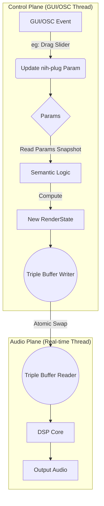

# 5. 功能模块设计

本文档详细描述 Rust 版本的内部模块划分。

## 5.1 核心数据流 (更新)

核心思想是构建一个清晰的、单向的数据流，将用户交互（GUI/OSC）与音频处理（DSP）安全地解耦。



这个流程确保了：
1.  **`Params` 是真理之源**：所有状态变更都必须先通过参数系统。
2.  **逻辑与渲染分离**：`Semantic Logic` 是一个纯计算模块，不关心UI或音频。
3.  **线程安全**：`Triple Buffer` 保证了从控制平面到音频平面的数据传递是无锁且无撕裂的。

## 5.2 模块详解

### 5.2.1 `Registry` (全局注册表)
替代原有的 `GlobalPluginState`。
*（设计保持不变，该模块是解决多实例通信的核心）*
```rust
pub struct Registry {
    instances: HashMap<InstanceId, Weak<Sender<PluginMessage>>>,
    master_id: Option<InstanceId>,
}
```

### 5.2.2 `SemanticState` (语义状态机)
替代 `SemanticChannelState`。这是一个纯逻辑模块，不依赖 VST 框架。它的核心职责是：**接收参数快照，计算出最终的渲染状态**。

```rust
// 输入: 从 nih-plug Params 系统中获取的参数值
pub struct LogicInput<'a> {
    pub master_gain: &'a FloatParam,
    pub channel_solo: &'a Vec<BoolParam>,
    // ... 其他所有相关参数
}

// 纯逻辑计算单元
pub struct ChannelLogic {
    // ... 内部状态，如 Solo 模式
}

impl ChannelLogic {
    // 输入用户操作，输出最终的 Gain/Mute 状态
    pub fn compute_render_state(&self, input: LogicInput) -> RenderState {
        // ... 纯函数计算 ...
        // 遍历 input.channel_solo, 结合 solo 模式，计算出每个通道的最终增益
    }
}
```

### 5.2.3 `RenderState` (渲染状态)
这是从 `SemanticState` 计算得出的、用于音频处理的**最终产物**。它必须是 `Clone`-able 且数据扁平，以便于在 `TripleBuffer` 中高效传递和在 DSP 中快速读取。

```rust
#[derive(Clone)]
pub struct RenderState {
    // 扁平化的增益数组，便于 SIMD 优化
    pub channel_gains: [f32; MAX_CHANNELS], 
    pub master_gain: f32,
    pub dim_active: bool,
}
```

### 5.2.4 `AudioProcessor`
实现 `nih_plug::Plugin` trait。其 `process` 方法的核心逻辑是：
1.  **消费 `RenderState`**：尝试从 `TripleBuffer` 读取最新的 `RenderState` 快照。
2.  **应用处理**：将 `RenderState` 中的增益值应用到音频缓冲区上。

```rust
impl Plugin for MonitorController {
    fn process(&mut self, buffer: &mut Buffer, context: &mut ProcessContext) {
        // 1. 从 TripleBuffer 获取最新的 RenderState
        if let Some(new_state) = self.state_receiver.read() {
            self.current_state = new_state.clone();
        }

        // 2. 应用音频处理 (SIMD)
        // ...
    }
}
```

### 5.2.5 `Editor` (GUI 实现) - **新增模块设计**
这是实现 `nih_plug_egui::Editor` trait 的结构体，负责UI的创建和绘制。

```rust
pub struct PluginEditor {
    // 用于访问和修改插件参数
    params: Arc<PluginParams>,
    // 用于管理缩放等编辑器状态
    editor_state: EguiState,
}

impl Editor for PluginEditor {
    fn create(
        params: Arc<PluginParams>,
        editor_state: EguiState,
        // ...
    ) -> Self {
        // 关键：在创建时就设置好缩放因子
        editor_state.set_scale_factor_override(Some(editor_state.scale_factor()));
        Self { params, editor_state }
    }

    fn update(&mut self, ui: &mut egui::Ui, context: &mut EguiContext) {
        // 绘制逻辑
        ui.group(|ui| {
            // 从 Params 读取当前值来绘制 Slider
            let mut gain_value = self.params.master_gain.value();
            
            // 使用 nih-plug 提供的 egui 控件
            if ui.add(nih_egui_knob(..)).changed() {
                // 当控件变化时，通过 context 来设置参数值
                context.set_parameter(&self.params.master_gain, gain_value);
            }
        });
    }
}
```
`Editor` 的设计严格遵循“参数驱动”的原则，自身不存储业务逻辑状态。

## 5.3 消息协议 (Protocol)
定义 Master 和 Slave 之间交互的语言。
*（设计保持不变）*
```rust
pub enum PluginMessage {
    SyncLayout(LayoutConfig),
    BroadcastState(RenderState),
}
```

## 5.4 硬件映射 (Hardware Mapper)
将 OSC 地址映射到对 `Params` 的修改请求。
```rust
// /monitor/master/gain 0.8 -> context.set_parameter(&params.master_gain, 0.8)
```
这一层负责解析 OSC 字符串并转换为对强类型参数的更新调用。

