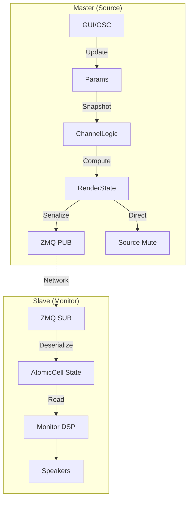

# 5. 功能模块设计

本文档详细描述 Rust 版本的内部模块划分。

## 5.1 核心数据流 (v4.0 Revised)

核心思想是构建一个清晰的、单向的、跨网络的流式架构。

## 5.2 模块详解

### 5.2.1 `Params` (参数定义)
在 `lib.rs` 中定义的单一真理源。
*   **Channels**: 18x (Mute, Solo)
*   **Global**: Master Gain, Dim, Cut, Solo Mode
*   **Config**: Role (Master/Slave), Network Port

### 5.2.2 `ChannelLogic` (语义逻辑核心)
纯函数模块，实现 v4.0 规范中的真值表逻辑。
*   **Input**: `Params` 快照, `InteractionState` (Pending等)。
*   **Output**: `RenderState`。
*   **职责**: 处理混合 Solo、SUB 豁免、A/B 对比等复杂逻辑。

### 5.2.3 `NetworkManager` (网络层)
负责 ZMQ 通信。
*   **Master**: `NetworkPublisher`。监听状态变化，发送 `NetworkPacket`。
*   **Slave**: `NetworkSubscriber`。后台线程死循环接收，原子更新全局缓存。

### 5.2.4 `RenderState` & `NetworkPacket`
*   `RenderState`: 内存中的状态结构。
*   `NetworkPacket`: 序列化后的网络包 (`#[repr(C)]`)，包含 Gain、Channel Mask、Timestamp。

### 5.2.5 `AudioProcessor`
*   **Master**: 读取 `RenderState`，仅执行 Source Mute (为了校准软件)。
*   **Slave**: 读取 `NetworkSubscriber` 的缓存，执行 Monitor Mute 和 Gain/Dim。

### 5.2.6 `Editor` (GUI)
已实现的基于 `egui` + `wgpu` 的界面，负责可视化 `Params` 并处理用户交互（如 A/B 对比的点击逻辑）。

## 5.3 交互状态管理 (`InteractionManager`)
管理 GUI 层的临时状态（非持久化）：
*   **Modes**: Idle, SoloActive, MuteActive, SoloCompare, MuteCompare.
*   **Contexts**: SoloSet, MuteSet (HashSet).
*   **Action**: 处理点击事件，决定是修改 Context 还是切换 Mode。

## 5.4 硬件映射
Master 负责将 OSC 硬件指令映射为 `Params` 修改，并将最终的逻辑状态（红/绿灯）反馈给硬件。
