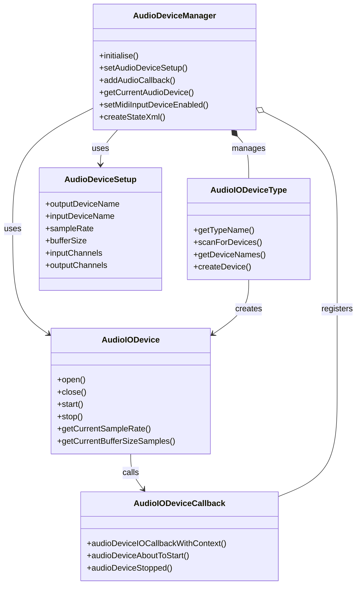
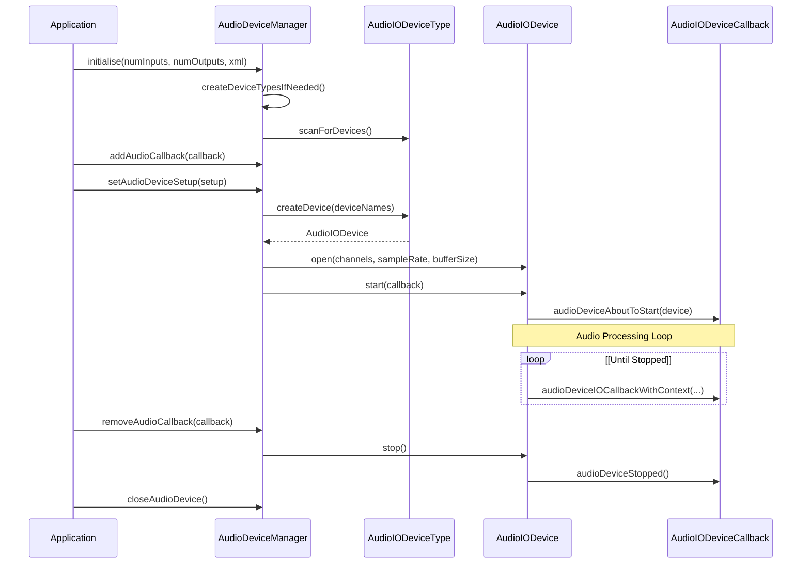
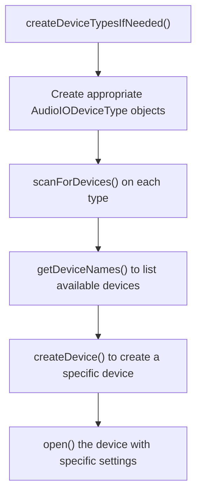
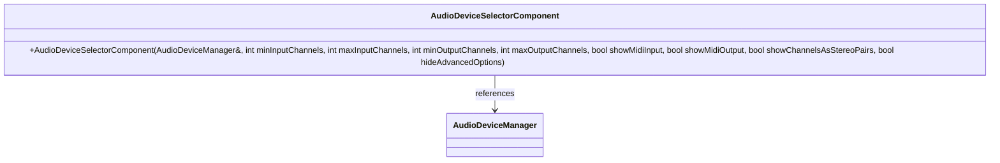

# Audio Device Management

> **Relevant source files**
> * [modules/juce_audio_devices/audio_io/juce_AudioDeviceManager.cpp](https://github.com/juce-framework/JUCE/blob/10a58961/modules/juce_audio_devices/audio_io/juce_AudioDeviceManager.cpp)
> * [modules/juce_audio_devices/audio_io/juce_AudioDeviceManager.h](https://github.com/juce-framework/JUCE/blob/10a58961/modules/juce_audio_devices/audio_io/juce_AudioDeviceManager.h)
> * [modules/juce_audio_devices/audio_io/juce_AudioIODevice.cpp](https://github.com/juce-framework/JUCE/blob/10a58961/modules/juce_audio_devices/audio_io/juce_AudioIODevice.cpp)
> * [modules/juce_audio_devices/audio_io/juce_AudioIODevice.h](https://github.com/juce-framework/JUCE/blob/10a58961/modules/juce_audio_devices/audio_io/juce_AudioIODevice.h)
> * [modules/juce_audio_devices/audio_io/juce_AudioIODeviceType.cpp](https://github.com/juce-framework/JUCE/blob/10a58961/modules/juce_audio_devices/audio_io/juce_AudioIODeviceType.cpp)
> * [modules/juce_audio_devices/audio_io/juce_AudioIODeviceType.h](https://github.com/juce-framework/JUCE/blob/10a58961/modules/juce_audio_devices/audio_io/juce_AudioIODeviceType.h)
> * [modules/juce_audio_devices/juce_audio_devices.cpp](https://github.com/juce-framework/JUCE/blob/10a58961/modules/juce_audio_devices/juce_audio_devices.cpp)
> * [modules/juce_audio_devices/native/juce_JackAudio.cpp](https://github.com/juce-framework/JUCE/blob/10a58961/modules/juce_audio_devices/native/juce_JackAudio.cpp)
> * [modules/juce_audio_utils/gui/juce_AudioDeviceSelectorComponent.cpp](https://github.com/juce-framework/JUCE/blob/10a58961/modules/juce_audio_utils/gui/juce_AudioDeviceSelectorComponent.cpp)
> * [modules/juce_audio_utils/gui/juce_AudioDeviceSelectorComponent.h](https://github.com/juce-framework/JUCE/blob/10a58961/modules/juce_audio_utils/gui/juce_AudioDeviceSelectorComponent.h)

The JUCE Audio Device Management system provides a high-level, cross-platform way to access and control audio hardware. It acts as a central coordinator for handling audio input/output devices, their settings, and the audio data flow. This page describes how the audio device management system works, the main classes involved, and how to use them in your applications.

For information about audio plugin formats and hosting, see [Audio Plugin System](/juce-framework/JUCE/4.1-audio-plugin-system). For standalone applications based on audio plugins, see [Standalone Plugin Applications](/juce-framework/JUCE/4.3-standalone-plugin-applications).

## Overview

The Audio Device Management system allows applications to:

* Discover available audio hardware and their capabilities
* Open and configure audio devices with specific settings
* Route audio data between hardware and your application
* Save and load device configurations
* Handle MIDI inputs and outputs

### Core Components




Sources: [modules/juce_audio_devices/audio_io/juce_AudioDeviceManager.h L39-L78](https://github.com/juce-framework/JUCE/blob/10a58961/modules/juce_audio_devices/audio_io/juce_AudioDeviceManager.h#L39-L78)

 [modules/juce_audio_devices/audio_io/juce_AudioIODeviceType.h L39-L73](https://github.com/juce-framework/JUCE/blob/10a58961/modules/juce_audio_devices/audio_io/juce_AudioIODeviceType.h#L39-L73)

 [modules/juce_audio_devices/audio_io/juce_AudioIODevice.h L146-L162](https://github.com/juce-framework/JUCE/blob/10a58961/modules/juce_audio_devices/audio_io/juce_AudioIODevice.h#L146-L162)

 [modules/juce_audio_devices/audio_io/juce_AudioIODevice.h L66-L67](https://github.com/juce-framework/JUCE/blob/10a58961/modules/juce_audio_devices/audio_io/juce_AudioIODevice.h#L66-L67)

 [modules/juce_audio_devices/audio_io/juce_AudioDeviceManager.h L102-L157](https://github.com/juce-framework/JUCE/blob/10a58961/modules/juce_audio_devices/audio_io/juce_AudioDeviceManager.h#L102-L157)

## AudioDeviceManager

The `AudioDeviceManager` is the central class of the audio device management system. It's designed to be a global manager that handles:

* Finding, opening, and closing audio devices
* Registering audio callbacks for processing audio data
* Managing MIDI devices
* Saving and loading audio device settings

A typical application usually creates a single instance of `AudioDeviceManager` that lives for the application's lifetime.

### Basic Usage

```sql
// Create an AudioDeviceManager
AudioDeviceManager deviceManager;

// Initialize with 2 input channels and 2 output channels
deviceManager.initialise(2, 2, nullptr, true);

// Register a callback
deviceManager.addAudioCallback(myAudioCallback);

// When done
deviceManager.removeAudioCallback(myAudioCallback);
```

Sources: [modules/juce_audio_devices/audio_io/juce_AudioDeviceManager.h L39-L78](https://github.com/juce-framework/JUCE/blob/10a58961/modules/juce_audio_devices/audio_io/juce_AudioDeviceManager.h#L39-L78)

 [modules/juce_audio_devices/audio_io/juce_AudioDeviceManager.h L194-L199](https://github.com/juce-framework/JUCE/blob/10a58961/modules/juce_audio_devices/audio_io/juce_AudioDeviceManager.h#L194-L199)

 [modules/juce_audio_devices/audio_io/juce_AudioDeviceManager.h L309-L310](https://github.com/juce-framework/JUCE/blob/10a58961/modules/juce_audio_devices/audio_io/juce_AudioDeviceManager.h#L309-L310)

### Device Initialization

The `initialise()` method sets up the audio device with the requested number of input and output channels:

```javascript
String AudioDeviceManager::initialise(int numInputChannelsNeeded,
                                     int numOutputChannelsNeeded,
                                     const XmlElement* savedState,
                                     bool selectDefaultDeviceOnFailure,
                                     const String& preferredDefaultDeviceName,
                                     const AudioDeviceSetup* preferredSetupOptions)
```

You can provide:

* The number of input and output channels your app needs
* Optional XML that contains previously saved settings
* A preferred device name as a fallback option
* Preferred setup options

Sources: [modules/juce_audio_devices/audio_io/juce_AudioDeviceManager.h L194-L199](https://github.com/juce-framework/JUCE/blob/10a58961/modules/juce_audio_devices/audio_io/juce_AudioDeviceManager.h#L194-L199)

 [modules/juce_audio_devices/audio_io/juce_AudioDeviceManager.cpp L304-L323](https://github.com/juce-framework/JUCE/blob/10a58961/modules/juce_audio_devices/audio_io/juce_AudioDeviceManager.cpp#L304-L323)

### Device Setup

The `AudioDeviceSetup` structure holds the configuration for an audio device:

```
struct AudioDeviceSetup {
    String outputDeviceName;
    String inputDeviceName;
    double sampleRate = 0;
    int bufferSize = 0;
    BigInteger inputChannels;
    bool useDefaultInputChannels = true;
    BigInteger outputChannels;
    bool useDefaultOutputChannels = true;
};
```

You can get and set the current setup using:

```javascript
AudioDeviceSetup getAudioDeviceSetup() const;
String setAudioDeviceSetup(const AudioDeviceSetup& newSetup, bool treatAsChosenDevice);
```

Sources: [modules/juce_audio_devices/audio_io/juce_AudioDeviceManager.h L102-L157](https://github.com/juce-framework/JUCE/blob/10a58961/modules/juce_audio_devices/audio_io/juce_AudioDeviceManager.h#L102-L157)

 [modules/juce_audio_devices/audio_io/juce_AudioDeviceManager.h L219-L220](https://github.com/juce-framework/JUCE/blob/10a58961/modules/juce_audio_devices/audio_io/juce_AudioDeviceManager.h#L219-L220)

 [modules/juce_audio_devices/audio_io/juce_AudioDeviceManager.h L251](https://github.com/juce-framework/JUCE/blob/10a58961/modules/juce_audio_devices/audio_io/juce_AudioDeviceManager.h#L251-L251)

### Audio Callbacks

To process audio data, register a callback that implements the `AudioIODeviceCallback` interface:

```
void addAudioCallback(AudioIODeviceCallback* newCallback);
void removeAudioCallback(AudioIODeviceCallback* callback);
```

The callback must implement:

```javascript
void audioDeviceIOCallbackWithContext(const float* const* inputChannelData,
                                     int numInputChannels,
                                     float* const* outputChannelData,
                                     int numOutputChannels,
                                     int numSamples,
                                     const AudioIODeviceCallbackContext& context);

void audioDeviceAboutToStart(AudioIODevice* device);
void audioDeviceStopped();
```

Sources: [modules/juce_audio_devices/audio_io/juce_AudioDeviceManager.h L309-L318](https://github.com/juce-framework/JUCE/blob/10a58961/modules/juce_audio_devices/audio_io/juce_AudioDeviceManager.h#L309-L318)

 [modules/juce_audio_devices/audio_io/juce_AudioIODevice.h L66-L143](https://github.com/juce-framework/JUCE/blob/10a58961/modules/juce_audio_devices/audio_io/juce_AudioIODevice.h#L66-L143)

### Saving and Loading Configuration

Device settings can be saved to XML and restored later:

```cpp
// Save current settings to XML
std::unique_ptr<XmlElement> xml = deviceManager.createStateXml();

// Later, restore these settings
deviceManager.initialise(2, 2, xml.get(), true);
```

Sources: [modules/juce_audio_devices/audio_io/juce_AudioDeviceManager.h L213](https://github.com/juce-framework/JUCE/blob/10a58961/modules/juce_audio_devices/audio_io/juce_AudioDeviceManager.h#L213-L213)

 [modules/juce_audio_devices/audio_io/juce_AudioDeviceManager.cpp L612-L618](https://github.com/juce-framework/JUCE/blob/10a58961/modules/juce_audio_devices/audio_io/juce_AudioDeviceManager.cpp#L612-L618)

## Audio Device Lifecycle




Sources: [modules/juce_audio_devices/audio_io/juce_AudioDeviceManager.cpp L304-L323](https://github.com/juce-framework/JUCE/blob/10a58961/modules/juce_audio_devices/audio_io/juce_AudioDeviceManager.cpp#L304-L323)

 [modules/juce_audio_devices/audio_io/juce_AudioDeviceManager.cpp L734-L843](https://github.com/juce-framework/JUCE/blob/10a58961/modules/juce_audio_devices/audio_io/juce_AudioDeviceManager.cpp#L734-L843)

 [modules/juce_audio_devices/audio_io/juce_AudioDeviceManager.cpp L973-L1005](https://github.com/juce-framework/JUCE/blob/10a58961/modules/juce_audio_devices/audio_io/juce_AudioDeviceManager.cpp#L973-L1005)

## Supported Device Types

JUCE supports multiple audio device APIs across different platforms:

| Platform | Device Types |
| --- | --- |
| Windows | WASAPI (Shared, Exclusive, Low Latency), DirectSound, ASIO |
| macOS | CoreAudio |
| iOS | iOS Audio |
| Linux | ALSA, JACK |
| Android | OpenSL ES, Oboe, Android Audio |

The `AudioIODeviceType` class provides static factory methods to create these types:

```
static AudioIODeviceType* createAudioIODeviceType_WASAPI(WASAPIDeviceMode mode);
static AudioIODeviceType* createAudioIODeviceType_DirectSound();
static AudioIODeviceType* createAudioIODeviceType_ASIO();
static AudioIODeviceType* createAudioIODeviceType_CoreAudio();
// ...and more
```

The `AudioDeviceManager` creates appropriate types for the current platform in its `createAudioDeviceTypes()` method.

Sources: [modules/juce_audio_devices/audio_io/juce_AudioDeviceManager.cpp L248-L262](https://github.com/juce-framework/JUCE/blob/10a58961/modules/juce_audio_devices/audio_io/juce_AudioDeviceManager.cpp#L248-L262)

 [modules/juce_audio_devices/audio_io/juce_AudioIODeviceType.h L159-L180](https://github.com/juce-framework/JUCE/blob/10a58961/modules/juce_audio_devices/audio_io/juce_AudioIODeviceType.h#L159-L180)

 [modules/juce_audio_devices/audio_io/juce_AudioIODeviceType.cpp L57-L150](https://github.com/juce-framework/JUCE/blob/10a58961/modules/juce_audio_devices/audio_io/juce_AudioIODeviceType.cpp#L57-L150)

## Audio Device Discovery

The process of discovering audio devices involves:




Sources: [modules/juce_audio_devices/audio_io/juce_AudioDeviceManager.cpp L137-L154](https://github.com/juce-framework/JUCE/blob/10a58961/modules/juce_audio_devices/audio_io/juce_AudioDeviceManager.cpp#L137-L154)

 [modules/juce_audio_devices/audio_io/juce_AudioDeviceManager.cpp L620-L632](https://github.com/juce-framework/JUCE/blob/10a58961/modules/juce_audio_devices/audio_io/juce_AudioDeviceManager.cpp#L620-L632)

### Device Selection and Configuration

Discovering and selecting devices typically follows these steps:

1. Call `getAvailableDeviceTypes()` to get a list of device types
2. For each type, call `scanForDevices()` then `getDeviceNames()` to list available devices
3. Use `setCurrentAudioDeviceType()` to select a device type
4. Create an `AudioDeviceSetup` with the desired device names, sample rate, etc.
5. Call `setAudioDeviceSetup()` to apply the configuration

Sources: [modules/juce_audio_devices/audio_io/juce_AudioDeviceManager.h L402](https://github.com/juce-framework/JUCE/blob/10a58961/modules/juce_audio_devices/audio_io/juce_AudioDeviceManager.h#L402-L402)

 [modules/juce_audio_devices/audio_io/juce_AudioIODeviceType.h L89-L98](https://github.com/juce-framework/JUCE/blob/10a58961/modules/juce_audio_devices/audio_io/juce_AudioIODeviceType.h#L89-L98)

 [modules/juce_audio_devices/audio_io/juce_AudioDeviceManager.h L274-L275](https://github.com/juce-framework/JUCE/blob/10a58961/modules/juce_audio_devices/audio_io/juce_AudioDeviceManager.h#L274-L275)

 [modules/juce_audio_devices/audio_io/juce_AudioDeviceManager.h L251](https://github.com/juce-framework/JUCE/blob/10a58961/modules/juce_audio_devices/audio_io/juce_AudioDeviceManager.h#L251-L251)

## MIDI Device Management

The `AudioDeviceManager` can also manage MIDI inputs and outputs:

### MIDI Inputs

```javascript
void setMidiInputDeviceEnabled(const String& deviceIdentifier, bool enabled);
bool isMidiInputDeviceEnabled(const String& deviceIdentifier) const;
void addMidiInputDeviceCallback(const String& deviceIdentifier, MidiInputCallback* callback);
void removeMidiInputDeviceCallback(const String& deviceIdentifier, MidiInputCallback* callback);
```

### MIDI Outputs

```javascript
void setDefaultMidiOutputDevice(const String& deviceIdentifier);
const String& getDefaultMidiOutputIdentifier() const noexcept;
MidiOutput* getDefaultMidiOutput() const noexcept;
```

Sources: [modules/juce_audio_devices/audio_io/juce_AudioDeviceManager.h L347-L353](https://github.com/juce-framework/JUCE/blob/10a58961/modules/juce_audio_devices/audio_io/juce_AudioDeviceManager.h#L347-L353)

 [modules/juce_audio_devices/audio_io/juce_AudioDeviceManager.h L365-L370](https://github.com/juce-framework/JUCE/blob/10a58961/modules/juce_audio_devices/audio_io/juce_AudioDeviceManager.h#L365-L370)

 [modules/juce_audio_devices/audio_io/juce_AudioDeviceManager.h L385-L398](https://github.com/juce-framework/JUCE/blob/10a58961/modules/juce_audio_devices/audio_io/juce_AudioDeviceManager.h#L385-L398)

## User Interface Components

JUCE provides a ready-to-use UI component for audio device selection:




The `AudioDeviceSelectorComponent` class provides a complete UI for configuring audio devices:

* Device type selection
* Input/output device selection
* Sample rate and buffer size controls
* Channel selection
* MIDI device configuration

```sql
// Create a device selector component
AudioDeviceSelectorComponent selector(deviceManager, 
                                     2, // min input channels
                                     2, // max input channels
                                     2, // min output channels 
                                     2, // max output channels
                                     true, // show MIDI input options
                                     true, // show MIDI output selector
                                     true, // show channels as stereo pairs
                                     false); // show advanced options

// Add it to your UI
addAndMakeVisible(selector);
```

Sources: [modules/juce_audio_utils/gui/juce_AudioDeviceSelectorComponent.h L49-L86](https://github.com/juce-framework/JUCE/blob/10a58961/modules/juce_audio_utils/gui/juce_AudioDeviceSelectorComponent.h#L49-L86)

 [modules/juce_audio_utils/gui/juce_AudioDeviceSelectorComponent.cpp L72-L129](https://github.com/juce-framework/JUCE/blob/10a58961/modules/juce_audio_utils/gui/juce_AudioDeviceSelectorComponent.cpp#L72-L129)

## Performance Monitoring

`AudioDeviceManager` provides methods to monitor audio processing performance:

```javascript
// Get CPU usage (0.0 to 1.0)
double getCpuUsage() const;

// Get count of audio dropouts (xruns)
int getXRunCount() const noexcept;
```

Sources: [modules/juce_audio_devices/audio_io/juce_AudioDeviceManager.h L325](https://github.com/juce-framework/JUCE/blob/10a58961/modules/juce_audio_devices/audio_io/juce_AudioDeviceManager.h#L325-L325)

 [modules/juce_audio_devices/audio_io/juce_AudioDeviceManager.h L486](https://github.com/juce-framework/JUCE/blob/10a58961/modules/juce_audio_devices/audio_io/juce_AudioDeviceManager.h#L486-L486)

## Device Error Handling

When audio devices encounter errors, they can notify the application:

1. AudioIODevice detects an error
2. AudioIODevice calls audioDeviceError() on the registered callbacks
3. Application can respond (e.g., showing an error message, switching devices)

You can also check for errors when setting up a device:

```
String result = deviceManager.initialise(2, 2, nullptr, true);
if (result.isNotEmpty())
{
    // Handle error
}
```

Sources: [modules/juce_audio_devices/audio_io/juce_AudioIODevice.h L142](https://github.com/juce-framework/JUCE/blob/10a58961/modules/juce_audio_devices/audio_io/juce_AudioIODevice.h#L142-L142)

 [modules/juce_audio_devices/audio_io/juce_AudioDeviceManager.h L194-L199](https://github.com/juce-framework/JUCE/blob/10a58961/modules/juce_audio_devices/audio_io/juce_AudioDeviceManager.h#L194-L199)

## Platform-Specific Considerations

### JACK Audio Connection Kit

JUCE provides a `JackAudioIODevice` for systems with JACK support (Linux, macOS, Windows):

* Automatically connects to appropriate JACK input/output ports
* Monitors connection status to update active channels
* Supports device-specific control panels (via `showControlPanel()`)

Sources: [modules/juce_audio_devices/native/juce_JackAudio.cpp L175-L179](https://github.com/juce-framework/JUCE/blob/10a58961/modules/juce_audio_devices/native/juce_JackAudio.cpp#L175-L179)

### WASAPI Modes

On Windows, WASAPI supports three different modes:

* Shared mode: Default mode with system mixing
* Exclusive mode: Direct hardware access with potentially lower latency
* Shared low-latency mode: Uses low-latency endpoints when available

Sources: [modules/juce_audio_devices/audio_io/juce_AudioDeviceManager.cpp L250-L252](https://github.com/juce-framework/JUCE/blob/10a58961/modules/juce_audio_devices/audio_io/juce_AudioDeviceManager.cpp#L250-L252)

## Best Practices

1. **Create a single AudioDeviceManager**: Keep a single instance for the lifetime of your application.
2. **Handle device errors**: Always check return values from initialization and setup methods.
3. **Save/restore device settings**: Use `createStateXml()` and restore with `initialise()` to preserve user preferences.
4. **Minimize audio callback work**: Keep audio processing efficient to avoid dropouts.
5. **Provide sensible defaults**: Set reasonable defaults for sample rate and buffer size.
6. **Consider latency needs**: Lower buffer sizes reduce latency but increase CPU load.
7. **Customize for your platform**: Consider different device types for different platforms.
8. **Lock safely**: Use `getAudioCallbackLock()` and `getMidiCallbackLock()` when modifying shared data.

Sources: [modules/juce_audio_devices/audio_io/juce_AudioDeviceManager.h L471-L477](https://github.com/juce-framework/JUCE/blob/10a58961/modules/juce_audio_devices/audio_io/juce_AudioDeviceManager.h#L471-L477)

## Conclusion

The Audio Device Management system in JUCE provides a robust, cross-platform way to work with audio hardware. By using `AudioDeviceManager` as the central coordinator, applications can discover, configure, and use audio devices across different operating systems and hardware configurations with a consistent API.

The system handles the complexities of different audio APIs (like CoreAudio, WASAPI, ASIO, ALSA) while providing a unified interface for applications, making it easier to develop professional audio applications that work reliably across platforms.