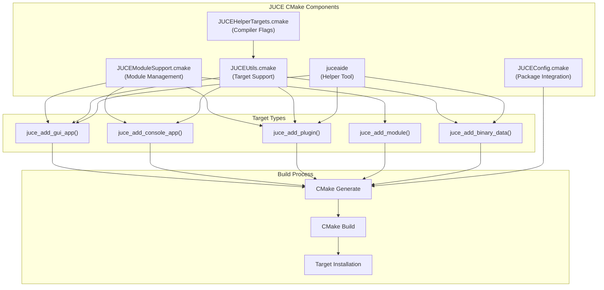
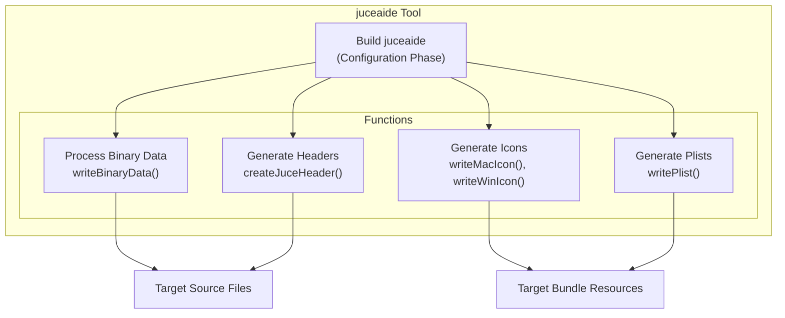
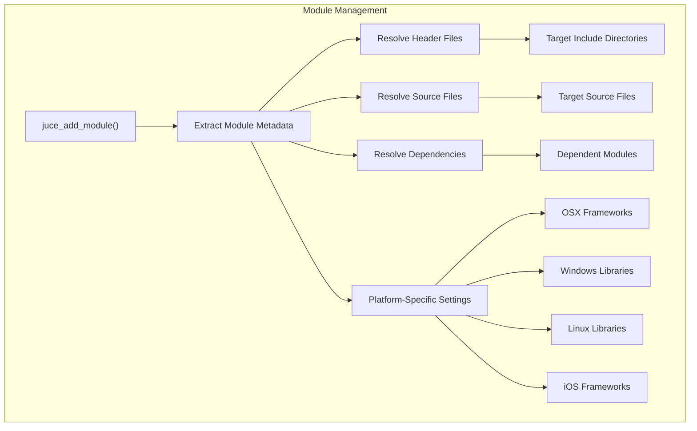
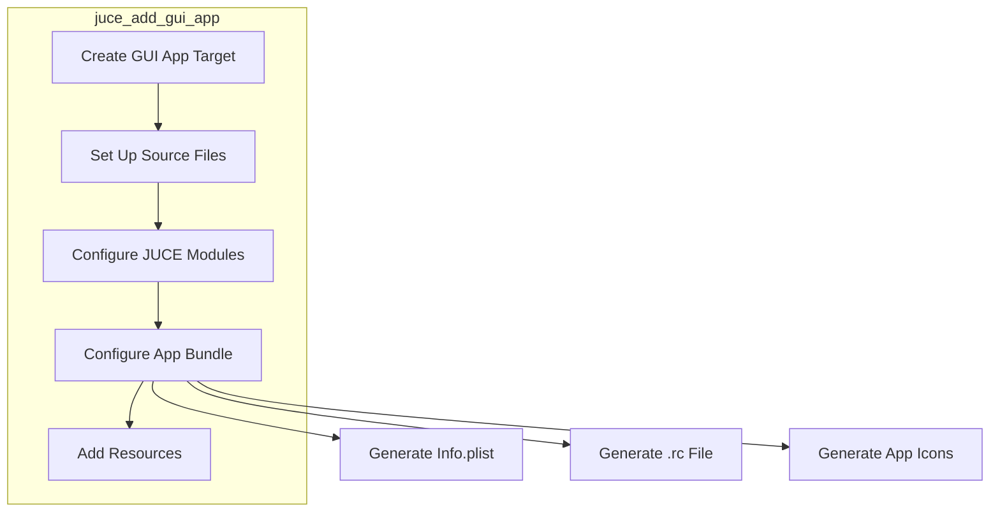
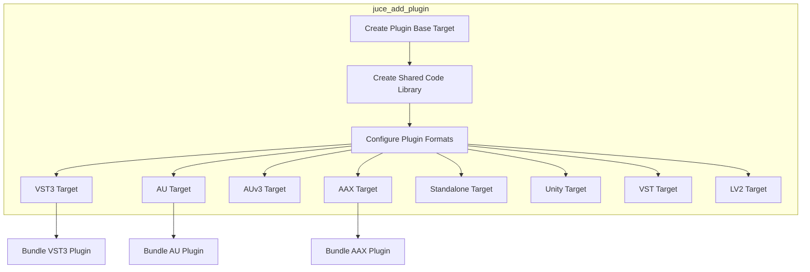
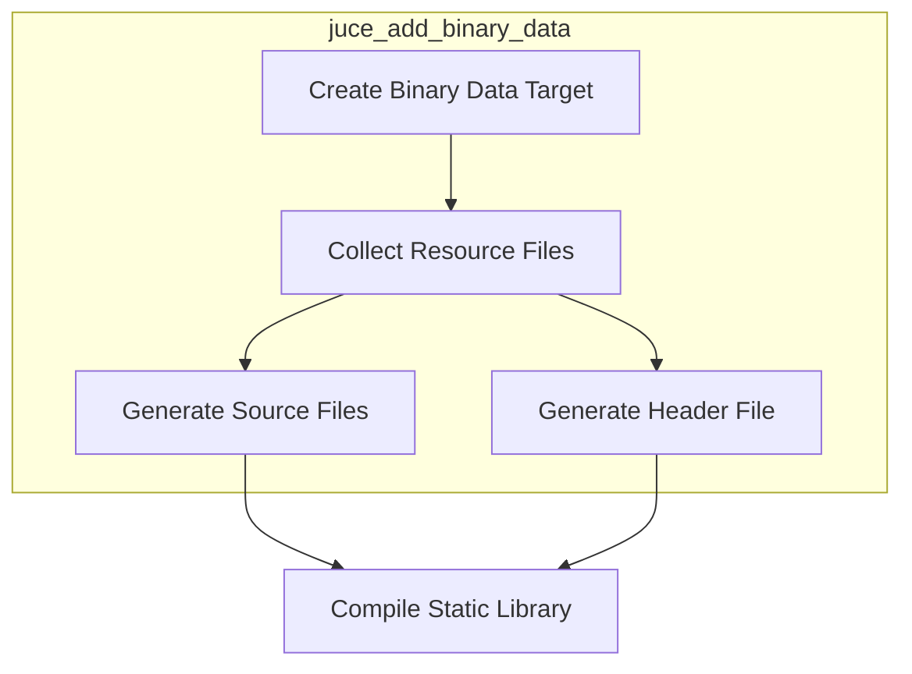
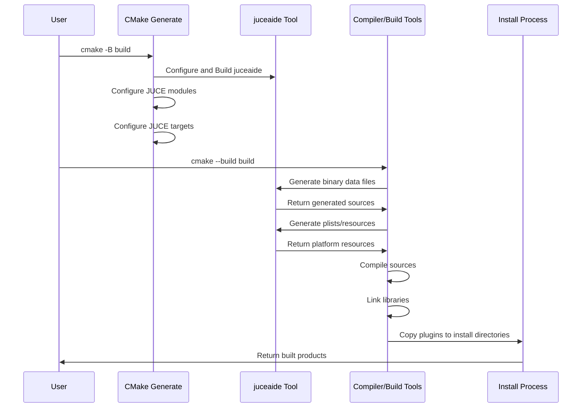

# CMake Build System

> **Relevant source files**
> * [CMakeLists.txt](https://github.com/juce-framework/JUCE/blob/10a58961/CMakeLists.txt)
> * [docs/CMake API.md](https://github.com/juce-framework/JUCE/blob/10a58961/docs/CMake API.md)
> * [docs/JUCE Module Format.md](https://github.com/juce-framework/JUCE/blob/10a58961/docs/JUCE Module Format.md)
> * [examples/DemoRunner/CMakeLists.txt](https://github.com/juce-framework/JUCE/blob/10a58961/examples/DemoRunner/CMakeLists.txt)
> * [extras/AudioPluginHost/CMakeLists.txt](https://github.com/juce-framework/JUCE/blob/10a58961/extras/AudioPluginHost/CMakeLists.txt)
> * [extras/BinaryBuilder/CMakeLists.txt](https://github.com/juce-framework/JUCE/blob/10a58961/extras/BinaryBuilder/CMakeLists.txt)
> * [extras/Build/CMake/JUCEConfig.cmake.in](https://github.com/juce-framework/JUCE/blob/10a58961/extras/Build/CMake/JUCEConfig.cmake.in)
> * [extras/Build/CMake/JUCEHelperTargets.cmake](https://github.com/juce-framework/JUCE/blob/10a58961/extras/Build/CMake/JUCEHelperTargets.cmake)
> * [extras/Build/CMake/JUCEModuleSupport.cmake](https://github.com/juce-framework/JUCE/blob/10a58961/extras/Build/CMake/JUCEModuleSupport.cmake)
> * [extras/Build/CMake/JUCEUtils.cmake](https://github.com/juce-framework/JUCE/blob/10a58961/extras/Build/CMake/JUCEUtils.cmake)
> * [extras/Build/juce_build_tools/utils/juce_Icons.cpp](https://github.com/juce-framework/JUCE/blob/10a58961/extras/Build/juce_build_tools/utils/juce_Icons.cpp)
> * [extras/Build/juce_build_tools/utils/juce_PlistOptions.cpp](https://github.com/juce-framework/JUCE/blob/10a58961/extras/Build/juce_build_tools/utils/juce_PlistOptions.cpp)
> * [extras/Build/juce_build_tools/utils/juce_PlistOptions.h](https://github.com/juce-framework/JUCE/blob/10a58961/extras/Build/juce_build_tools/utils/juce_PlistOptions.h)
> * [extras/Build/juce_build_tools/utils/juce_RelativePath.h](https://github.com/juce-framework/JUCE/blob/10a58961/extras/Build/juce_build_tools/utils/juce_RelativePath.h)
> * [extras/Build/juce_build_tools/utils/juce_VersionNumbers.cpp](https://github.com/juce-framework/JUCE/blob/10a58961/extras/Build/juce_build_tools/utils/juce_VersionNumbers.cpp)
> * [extras/Build/juce_build_tools/utils/juce_VersionNumbers.h](https://github.com/juce-framework/JUCE/blob/10a58961/extras/Build/juce_build_tools/utils/juce_VersionNumbers.h)
> * [extras/Build/juceaide/CMakeLists.txt](https://github.com/juce-framework/JUCE/blob/10a58961/extras/Build/juceaide/CMakeLists.txt)
> * [extras/Build/juceaide/Main.cpp](https://github.com/juce-framework/JUCE/blob/10a58961/extras/Build/juceaide/Main.cpp)
> * [extras/Projucer/Source/Project/Modules/jucer_Modules.cpp](https://github.com/juce-framework/JUCE/blob/10a58961/extras/Projucer/Source/Project/Modules/jucer_Modules.cpp)
> * [extras/Projucer/Source/Project/Modules/jucer_Modules.h](https://github.com/juce-framework/JUCE/blob/10a58961/extras/Projucer/Source/Project/Modules/jucer_Modules.h)
> * [extras/UnitTestRunner/CMakeLists.txt](https://github.com/juce-framework/JUCE/blob/10a58961/extras/UnitTestRunner/CMakeLists.txt)
> * [modules/CMakeLists.txt](https://github.com/juce-framework/JUCE/blob/10a58961/modules/CMakeLists.txt)

This document outlines JUCE's CMake build system, which provides a modern, flexible way to build JUCE-based applications and plugins across multiple platforms. The CMake system offers an alternative to the Projucer-based workflow described in [Projucer](/juce-framework/JUCE/5.1-projucer).

## Overview

JUCE's CMake integration allows developers to:

* Build JUCE applications and plugins using standard CMake workflows
* Easily incorporate JUCE modules into CMake-based projects
* Generate IDE projects for various platforms (Visual Studio, Xcode, etc.)
* Configure build settings and dependencies declaratively
* Support cross-platform builds with the same build scripts

### System Requirements

* CMake 3.22 or higher
* C++ compiler supporting C++17 or later
* Platform-specific build tools (e.g., Visual Studio, Xcode)

Note that Android targets are not currently supported through the CMake system.

## Architecture

The JUCE CMake system consists of several key components that work together to provide a complete build system.



Sources: [extras/Build/CMake/JUCEUtils.cmake L33-L42](https://github.com/juce-framework/JUCE/blob/10a58961/extras/Build/CMake/JUCEUtils.cmake#L33-L42)

 [extras/Build/CMake/JUCEModuleSupport.cmake L33-L42](https://github.com/juce-framework/JUCE/blob/10a58961/extras/Build/CMake/JUCEModuleSupport.cmake#L33-L42)

 [extras/Build/juceaide/CMakeLists.txt L32-L70](https://github.com/juce-framework/JUCE/blob/10a58961/extras/Build/juceaide/CMakeLists.txt#L32-L70)

 [CMakeLists.txt L33-L107](https://github.com/juce-framework/JUCE/blob/10a58961/CMakeLists.txt#L33-L107)

## Core Components

### juceaide Helper Tool

The `juceaide` is a crucial utility that handles various build-time tasks:

* Generates BinaryData source files from resource files
* Creates platform-specific resources (icons, plists, etc.)
* Generates JuceHeader.h for projects
* Processes plugin manifests

This tool is automatically built during the CMake configuration phase to ensure it's available for the build process.



Sources: [extras/Build/juceaide/CMakeLists.txt L32-L191](https://github.com/juce-framework/JUCE/blob/10a58961/extras/Build/juceaide/CMakeLists.txt#L32-L191)

 [extras/Build/juceaide/Main.cpp L34-L113](https://github.com/juce-framework/JUCE/blob/10a58961/extras/Build/juceaide/Main.cpp#L34-L113)

### Module Support System

The JUCE module system is integrated with CMake through the `JUCEModuleSupport.cmake` file, which provides:

* Module discovery and dependency resolution
* Platform-specific module configuration
* Module source file management
* Compiler and linker settings for modules



Sources: [extras/Build/CMake/JUCEModuleSupport.cmake L95-L569](https://github.com/juce-framework/JUCE/blob/10a58961/extras/Build/CMake/JUCEModuleSupport.cmake#L95-L569)

## JUCE Target Functions

JUCE provides specialized functions to create different types of targets:

### juce_add_gui_app

Creates a GUI application target with JUCE-specific configuration.



### juce_add_plugin

Creates an audio plugin target with support for multiple plugin formats.



Sources: [extras/Build/CMake/JUCEUtils.cmake L250-L768](https://github.com/juce-framework/JUCE/blob/10a58961/extras/Build/CMake/JUCEUtils.cmake#L250-L768)

### juce_add_binary_data

Creates a static library target that compiles binary resources (images, fonts, etc.) into C++ source code.



Sources: [extras/Build/CMake/JUCEUtils.cmake L436-L500](https://github.com/juce-framework/JUCE/blob/10a58961/extras/Build/CMake/JUCEUtils.cmake#L436-L500)

## Configuration Options

The JUCE CMake system provides several global options to customize the build process:

| Option | Description | Default |
| --- | --- | --- |
| `JUCE_BUILD_EXTRAS` | Build the projects in the 'extras' folder | OFF |
| `JUCE_BUILD_EXAMPLES` | Build the example projects | OFF |
| `JUCE_ENABLE_MODULE_SOURCE_GROUPS` | Include module source files in IDE projects | OFF |
| `JUCE_COPY_PLUGIN_AFTER_BUILD` | Install plugins to system locations after building | OFF |
| `JUCE_MODULES_ONLY` | Only configure JUCE modules, not the full build system | OFF |
| `JUCE_WEBVIEW2_PACKAGE_LOCATION` | Custom location for WebView2 packages | (system default) |

Sources: [CMakeLists.txt L47-L130](https://github.com/juce-framework/JUCE/blob/10a58961/CMakeLists.txt#L47-L130)

 [docs/CMake L177-L242](https://github.com/juce-framework/JUCE/blob/10a58961/docs/CMake API.md#L177-L242)

## Target Properties

When creating JUCE targets, various properties can be specified to customize the target configuration:

| Property Category | Examples |
| --- | --- |
| Application Information | `PRODUCT_NAME`, `VERSION`, `COMPANY_NAME`, `COMPANY_COPYRIGHT` |
| Bundle Configuration | `BUNDLE_ID`, `ICON_BIG`, `ICON_SMALL`, `DOCUMENT_EXTENSIONS` |
| Permissions | `MICROPHONE_PERMISSION_ENABLED`, `CAMERA_PERMISSION_ENABLED`, `BLUETOOTH_PERMISSION_ENABLED` |
| Platform Features | `HARDENED_RUNTIME_ENABLED`, `APP_SANDBOX_ENABLED`, `PLUGINHOST_AU` |
| Plugin-Specific | `FORMATS`, `PLUGIN_NAME`, `PLUGIN_MANUFACTURER_CODE`, `PLUGIN_CODE` |

Sources: [docs/CMake L246-L603](https://github.com/juce-framework/JUCE/blob/10a58961/docs/CMake API.md#L246-L603)

## Using the JUCE CMake System

### Basic Usage

There are two main ways to include JUCE in your CMake project:

1. **Using `add_subdirectory`**: * Add JUCE as a subdirectory of your project * Include `add_subdirectory(JUCE)` in your CMakeLists.txt
2. **Using `find_package`**: * Install JUCE globally on your system * Use `find_package(JUCE CONFIG REQUIRED)` in your CMakeLists.txt

### Example Project Structure

```
MyProject/
├── CMakeLists.txt
├── Source/
│   ├── Main.cpp
│   └── ...
└── JUCE/  (submodule or copy)
```

Example CMakeLists.txt:

```yaml
cmake_minimum_required(VERSION 3.22)
project(MyProject VERSION 1.0.0)

add_subdirectory(JUCE)

juce_add_gui_app(MyApp
    PRODUCT_NAME "My Application"
    VERSION "1.0.0"
    COMPANY_NAME "My Company"
    COMPANY_COPYRIGHT "Copyright (c) 2023 My Company"
)

target_sources(MyApp PRIVATE
    Source/Main.cpp
)

target_compile_features(MyApp PRIVATE cxx_std_17)

target_link_libraries(MyApp PRIVATE
    juce::juce_core
    juce::juce_gui_basics
)
```

Sources: [docs/CMake L14-L75](https://github.com/juce-framework/JUCE/blob/10a58961/docs/CMake API.md#L14-L75)

 [examples/DemoRunner/CMakeLists.txt L1-L88](https://github.com/juce-framework/JUCE/blob/10a58961/examples/DemoRunner/CMakeLists.txt#L1-L88)

### Plugin Project Example

```yaml
juce_add_plugin(MyPlugin
    PRODUCT_NAME "My Plugin"
    COMPANY_NAME "My Company"
    PLUGIN_MANUFACTURER_CODE "Mcom"
    PLUGIN_CODE "Mplu"
    FORMATS AU VST3 Standalone
    IS_SYNTH FALSE
    NEEDS_MIDI_INPUT TRUE
    NEEDS_MIDI_OUTPUT FALSE
)

target_sources(MyPlugin PRIVATE
    Source/PluginProcessor.cpp
    Source/PluginEditor.cpp
)

target_link_libraries(MyPlugin PRIVATE
    juce::juce_audio_utils
    juce::juce_recommended_config_flags
    juce::juce_recommended_lto_flags
    juce::juce_recommended_warning_flags
)
```

Sources: [extras/AudioPluginHost/CMakeLists.txt L33-L93](https://github.com/juce-framework/JUCE/blob/10a58961/extras/AudioPluginHost/CMakeLists.txt#L33-L93)

## Build Process Flow

The JUCE CMake build process follows these key steps:



Sources: [extras/Build/juceaide/CMakeLists.txt L64-L191](https://github.com/juce-framework/JUCE/blob/10a58961/extras/Build/juceaide/CMakeLists.txt#L64-L191)

 [extras/Build/CMake/JUCEUtils.cmake L33-L190](https://github.com/juce-framework/JUCE/blob/10a58961/extras/Build/CMake/JUCEUtils.cmake#L33-L190)

## Platform-Specific Features

### iOS Build Support

For iOS builds, special configuration is needed:

```
cmake -Bbuild-ios -GXcode -DCMAKE_SYSTEM_NAME=iOS -DCMAKE_OSX_DEPLOYMENT_TARGET=9.3
```

Additional properties for iOS:

* `IPHONE_SCREEN_ORIENTATIONS`
* `IPAD_SCREEN_ORIENTATIONS`
* `STATUS_BAR_HIDDEN`
* `REQUIRES_FULL_SCREEN`
* `LAUNCH_STORYBOARD_FILE`
* `CUSTOM_XCASSETS_FOLDER`

### macOS Features

* Bundle signing through `HARDENED_RUNTIME_ENABLED`
* App Sandbox support with `APP_SANDBOX_ENABLED`
* Audio Unit plugin hosting with `PLUGINHOST_AU`
* Universal binary support through `-DCMAKE_OSX_ARCHITECTURES="arm64;x86_64"`

### Windows Features

* Visual Studio project generation
* MSVC or Clang compiler support
* WebView2 integration through `NEEDS_WEBVIEW2`

### Linux/BSD Features

* Package dependency management
* Plugin format support (VST3, LV2)

Sources: [docs/CMake L76-L175](https://github.com/juce-framework/JUCE/blob/10a58961/docs/CMake API.md#L76-L175)

 [extras/Build/CMake/JUCEUtils.cmake L108-L144](https://github.com/juce-framework/JUCE/blob/10a58961/extras/Build/CMake/JUCEUtils.cmake#L108-L144)

## Advanced Features

### Plugin Copy Locations

The build system provides properties to configure where built plugins are installed:

| Property | Description |
| --- | --- |
| `JUCE_VST_COPY_DIR` | Installation location for VST2 plugins |
| `JUCE_VST3_COPY_DIR` | Installation location for VST3 plugins |
| `JUCE_AU_COPY_DIR` | Installation location for AU plugins |
| `JUCE_AAX_COPY_DIR` | Installation location for AAX plugins |
| `JUCE_UNITY_COPY_DIR` | Installation location for Unity plugins |
| `JUCE_LV2_COPY_DIR` | Installation location for LV2 plugins |

The default locations are platform-specific and are configured in [extras/Build/CMake/JUCEUtils.cmake L118-L146](https://github.com/juce-framework/JUCE/blob/10a58961/extras/Build/CMake/JUCEUtils.cmake#L118-L146)

### Bundle Resources

The `juce_add_bundle_resources_directory` function allows adding a directory of resources to an app bundle:

```
juce_add_bundle_resources_directory(MyTarget Resources)
```

This will recursively add all files in the specified directory to the target's resources.

Sources: [extras/Build/CMake/JUCEUtils.cmake L152-L169](https://github.com/juce-framework/JUCE/blob/10a58961/extras/Build/CMake/JUCEUtils.cmake#L152-L169)

## Troubleshooting

### Common Issues

1. **Missing Modules**: Make sure JUCE modules are correctly added to your target.
2. **Plugin SDK Paths**: To build VST2/AAX/ARA plugins, you need to set the SDK paths: ``` juce_set_vst2_sdk_path(path/to/VST2_SDK) juce_set_aax_sdk_path(path/to/AAX_SDK) juce_set_ara_sdk_path(path/to/ARA_SDK) ```
3. **Universal Binaries on macOS**: To build universal binaries: ``` cmake -B build -DCMAKE_OSX_ARCHITECTURES="arm64;x86_64" ```
4. **iOS Build Issues**: When building for iOS, use the Xcode generator and specify the iOS system: ``` cmake -B build-ios -GXcode -DCMAKE_SYSTEM_NAME=iOS ```

Sources: [docs/CMake L127-L152](https://github.com/juce-framework/JUCE/blob/10a58961/docs/CMake API.md#L127-L152)

 [CMakeLists.txt L93-L107](https://github.com/juce-framework/JUCE/blob/10a58961/CMakeLists.txt#L93-L107)

## Summary

The JUCE CMake Build System provides a powerful, flexible way to build JUCE applications and plugins across multiple platforms. By integrating with the standard CMake workflow, it offers:

1. **Simplified Cross-Platform Development**: The same build scripts work across Windows, macOS, iOS, and Linux
2. **Modern Build System Integration**: Works with standard CMake features and IDE integrations
3. **Declarative Configuration**: Clear, readable target configuration with sensible defaults
4. **Plugin Format Support**: Builds multiple plugin formats from a single codebase
5. **Extensibility**: Can be integrated into larger CMake projects seamlessly

For a complete reference of all available options and functions, refer to the [docs/CMake API.md](https://github.com/juce-framework/JUCE/blob/10a58961/docs/CMake API.md)

 file in the JUCE repository.