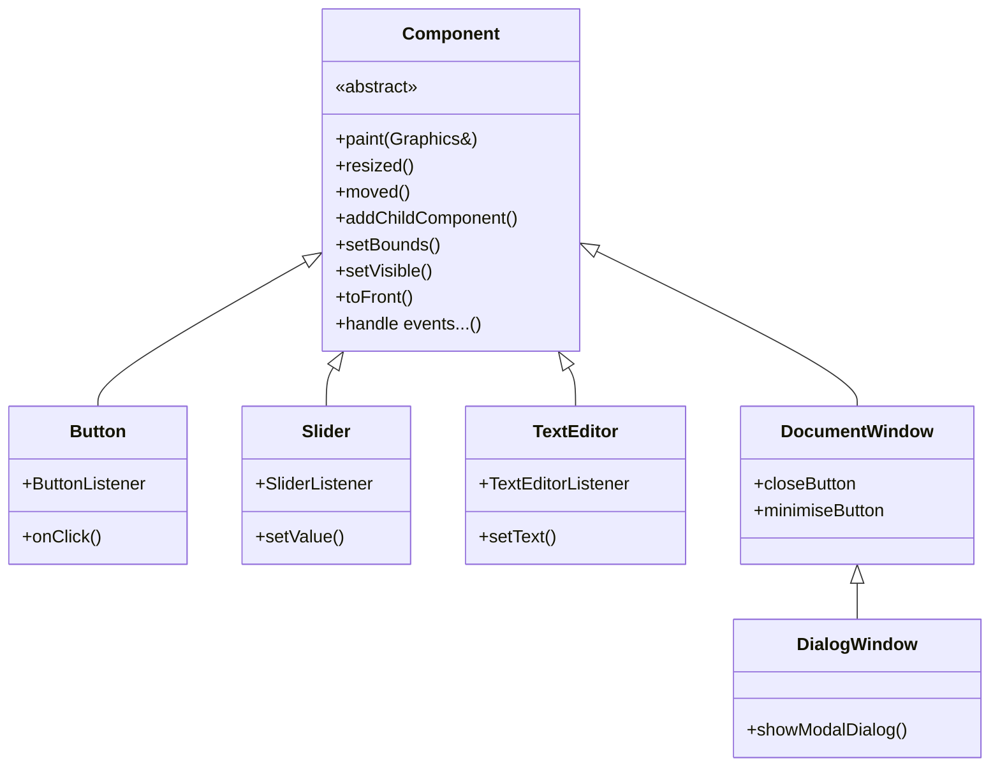
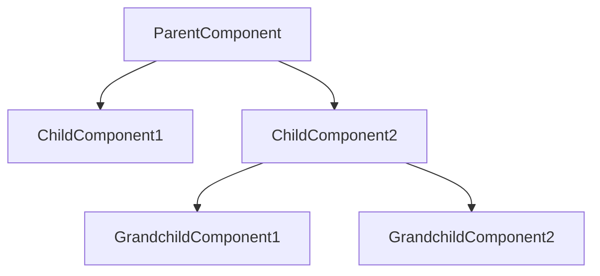
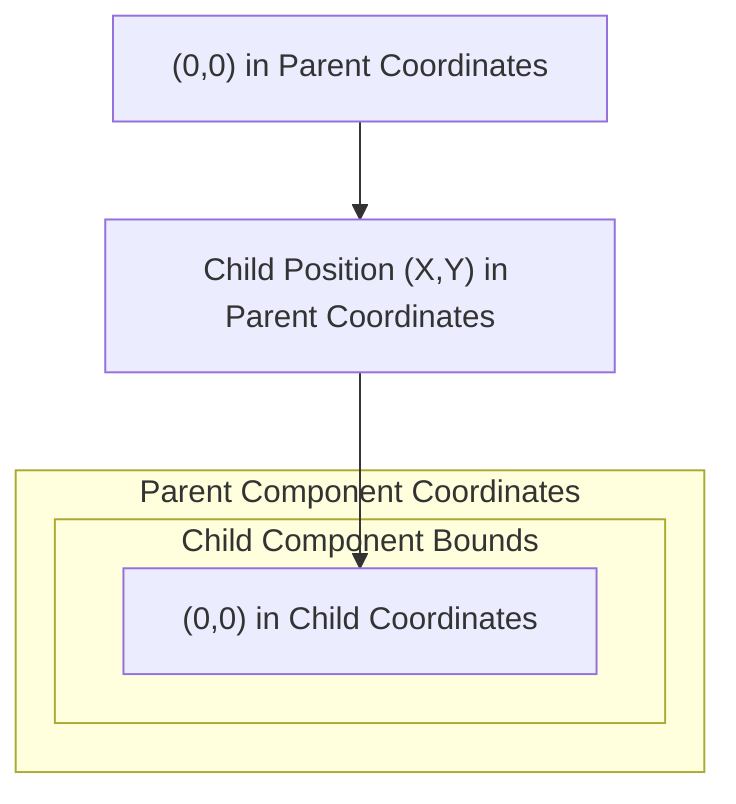
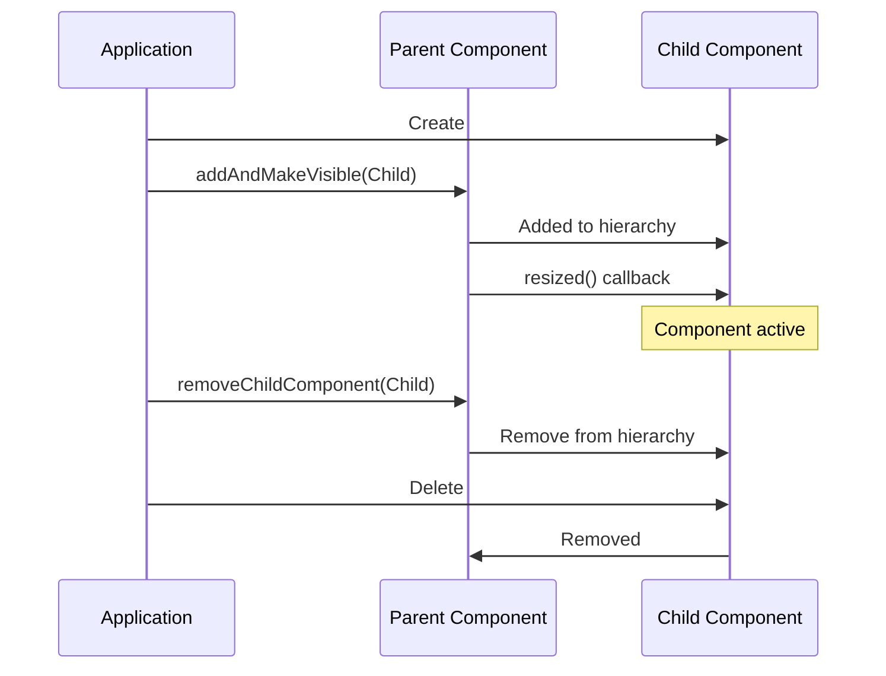
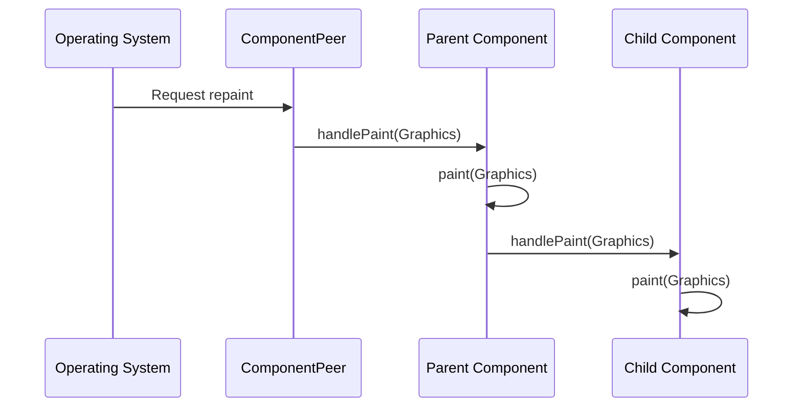
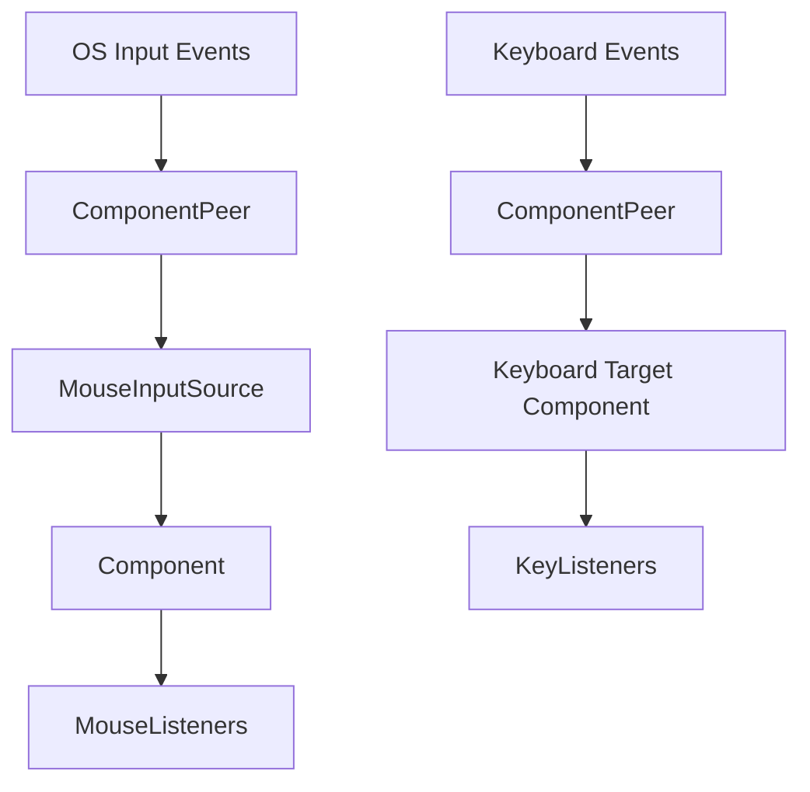

# Component System

> **Relevant source files**
> * [modules/juce_core/native/juce_CFHelpers_mac.h](https://github.com/juce-framework/JUCE/blob/d6181bde/modules/juce_core/native/juce_CFHelpers_mac.h)
> * [modules/juce_graphics/effects/juce_DropShadowEffect.cpp](https://github.com/juce-framework/JUCE/blob/d6181bde/modules/juce_graphics/effects/juce_DropShadowEffect.cpp)
> * [modules/juce_graphics/effects/juce_DropShadowEffect.h](https://github.com/juce-framework/JUCE/blob/d6181bde/modules/juce_graphics/effects/juce_DropShadowEffect.h)
> * [modules/juce_graphics/effects/juce_GlowEffect.cpp](https://github.com/juce-framework/JUCE/blob/d6181bde/modules/juce_graphics/effects/juce_GlowEffect.cpp)
> * [modules/juce_graphics/effects/juce_GlowEffect.h](https://github.com/juce-framework/JUCE/blob/d6181bde/modules/juce_graphics/effects/juce_GlowEffect.h)
> * [modules/juce_graphics/images/juce_Image.cpp](https://github.com/juce-framework/JUCE/blob/d6181bde/modules/juce_graphics/images/juce_Image.cpp)
> * [modules/juce_graphics/images/juce_Image.h](https://github.com/juce-framework/JUCE/blob/d6181bde/modules/juce_graphics/images/juce_Image.h)
> * [modules/juce_graphics/native/juce_CoreGraphicsContext_mac.h](https://github.com/juce-framework/JUCE/blob/d6181bde/modules/juce_graphics/native/juce_CoreGraphicsContext_mac.h)
> * [modules/juce_graphics/native/juce_CoreGraphicsContext_mac.mm](https://github.com/juce-framework/JUCE/blob/d6181bde/modules/juce_graphics/native/juce_CoreGraphicsContext_mac.mm)
> * [modules/juce_graphics/native/juce_Direct2DGraphicsContextImpl_windows.cpp](https://github.com/juce-framework/JUCE/blob/d6181bde/modules/juce_graphics/native/juce_Direct2DGraphicsContextImpl_windows.cpp)
> * [modules/juce_graphics/native/juce_Direct2DGraphicsContextImpl_windows.h](https://github.com/juce-framework/JUCE/blob/d6181bde/modules/juce_graphics/native/juce_Direct2DGraphicsContextImpl_windows.h)
> * [modules/juce_graphics/native/juce_Direct2DGraphicsContext_windows.cpp](https://github.com/juce-framework/JUCE/blob/d6181bde/modules/juce_graphics/native/juce_Direct2DGraphicsContext_windows.cpp)
> * [modules/juce_graphics/native/juce_Direct2DGraphicsContext_windows.h](https://github.com/juce-framework/JUCE/blob/d6181bde/modules/juce_graphics/native/juce_Direct2DGraphicsContext_windows.h)
> * [modules/juce_graphics/native/juce_Direct2DImageContext_windows.cpp](https://github.com/juce-framework/JUCE/blob/d6181bde/modules/juce_graphics/native/juce_Direct2DImageContext_windows.cpp)
> * [modules/juce_graphics/native/juce_Direct2DImageContext_windows.h](https://github.com/juce-framework/JUCE/blob/d6181bde/modules/juce_graphics/native/juce_Direct2DImageContext_windows.h)
> * [modules/juce_graphics/native/juce_Direct2DImage_windows.cpp](https://github.com/juce-framework/JUCE/blob/d6181bde/modules/juce_graphics/native/juce_Direct2DImage_windows.cpp)
> * [modules/juce_graphics/native/juce_Direct2DImage_windows.h](https://github.com/juce-framework/JUCE/blob/d6181bde/modules/juce_graphics/native/juce_Direct2DImage_windows.h)
> * [modules/juce_graphics/native/juce_Direct2DMetrics_windows.h](https://github.com/juce-framework/JUCE/blob/d6181bde/modules/juce_graphics/native/juce_Direct2DMetrics_windows.h)
> * [modules/juce_graphics/native/juce_DirectX_windows.cpp](https://github.com/juce-framework/JUCE/blob/d6181bde/modules/juce_graphics/native/juce_DirectX_windows.cpp)
> * [modules/juce_graphics/native/juce_DirectX_windows.h](https://github.com/juce-framework/JUCE/blob/d6181bde/modules/juce_graphics/native/juce_DirectX_windows.h)
> * [modules/juce_graphics/native/juce_EventTracing.h](https://github.com/juce-framework/JUCE/blob/d6181bde/modules/juce_graphics/native/juce_EventTracing.h)
> * [modules/juce_gui_basics/components/juce_Component.cpp](https://github.com/juce-framework/JUCE/blob/d6181bde/modules/juce_gui_basics/components/juce_Component.cpp)
> * [modules/juce_gui_basics/components/juce_Component.h](https://github.com/juce-framework/JUCE/blob/d6181bde/modules/juce_gui_basics/components/juce_Component.h)
> * [modules/juce_gui_basics/detail/juce_ComponentHelpers.h](https://github.com/juce-framework/JUCE/blob/d6181bde/modules/juce_gui_basics/detail/juce_ComponentHelpers.h)
> * [modules/juce_gui_basics/detail/juce_MouseInputSourceImpl.h](https://github.com/juce-framework/JUCE/blob/d6181bde/modules/juce_gui_basics/detail/juce_MouseInputSourceImpl.h)
> * [modules/juce_gui_basics/detail/juce_StandardCachedComponentImage.h](https://github.com/juce-framework/JUCE/blob/d6181bde/modules/juce_gui_basics/detail/juce_StandardCachedComponentImage.h)
> * [modules/juce_gui_basics/misc/juce_DropShadower.cpp](https://github.com/juce-framework/JUCE/blob/d6181bde/modules/juce_gui_basics/misc/juce_DropShadower.cpp)
> * [modules/juce_gui_basics/misc/juce_DropShadower.h](https://github.com/juce-framework/JUCE/blob/d6181bde/modules/juce_gui_basics/misc/juce_DropShadower.h)
> * [modules/juce_gui_basics/mouse/juce_MouseInputSource.cpp](https://github.com/juce-framework/JUCE/blob/d6181bde/modules/juce_gui_basics/mouse/juce_MouseInputSource.cpp)
> * [modules/juce_gui_basics/mouse/juce_MouseInputSource.h](https://github.com/juce-framework/JUCE/blob/d6181bde/modules/juce_gui_basics/mouse/juce_MouseInputSource.h)
> * [modules/juce_gui_basics/native/juce_Direct2DHwndContext_windows.cpp](https://github.com/juce-framework/JUCE/blob/d6181bde/modules/juce_gui_basics/native/juce_Direct2DHwndContext_windows.cpp)
> * [modules/juce_gui_basics/native/juce_Direct2DHwndContext_windows.h](https://github.com/juce-framework/JUCE/blob/d6181bde/modules/juce_gui_basics/native/juce_Direct2DHwndContext_windows.h)
> * [modules/juce_gui_basics/native/juce_ScopedThreadDPIAwarenessSetter_windows.h](https://github.com/juce-framework/JUCE/blob/d6181bde/modules/juce_gui_basics/native/juce_ScopedThreadDPIAwarenessSetter_windows.h)
> * [modules/juce_gui_basics/native/juce_Windowing_windows.cpp](https://github.com/juce-framework/JUCE/blob/d6181bde/modules/juce_gui_basics/native/juce_Windowing_windows.cpp)
> * [modules/juce_gui_basics/windows/juce_ComponentPeer.cpp](https://github.com/juce-framework/JUCE/blob/d6181bde/modules/juce_gui_basics/windows/juce_ComponentPeer.cpp)
> * [modules/juce_gui_basics/windows/juce_ComponentPeer.h](https://github.com/juce-framework/JUCE/blob/d6181bde/modules/juce_gui_basics/windows/juce_ComponentPeer.h)
> * [modules/juce_opengl/opengl/juce_OpenGLImage.cpp](https://github.com/juce-framework/JUCE/blob/d6181bde/modules/juce_opengl/opengl/juce_OpenGLImage.cpp)

The JUCE Component system is the foundation of all user interface elements in the JUCE framework. This document describes the architecture and functionality of the Component class hierarchy, how components interact with each other, and how they handle user input and rendering. For information about specific widgets and controls built on top of this system, see [Widgets and Controls](/juce-framework/JUCE/3.2-widgets-and-controls).

## Overview

The Component class serves as the base for all visual elements in JUCE applications. It provides functionality for:

* Creating visual hierarchies through parent-child relationships
* Handling mouse and keyboard input
* Managing component bounds, visibility, and z-order
* Painting and rendering to the screen
* Integration with native window systems

### Component Class Hierarchy



Sources: [modules/juce_gui_basics/components/juce_Component.h L39-L45](https://github.com/juce-framework/JUCE/blob/d6181bde/modules/juce_gui_basics/components/juce_Component.h#L39-L45)

## Component Hierarchy and Containment

Components in JUCE are organized in a tree-like hierarchy where each component can have a parent and multiple children.

### Parent-Child Relationships



The key methods for managing this hierarchy include:

| Method | Description |
| --- | --- |
| `addChildComponent(Component*)` | Adds a component as a child but doesn't make it visible |
| `addAndMakeVisible(Component*)` | Adds a component as a child and makes it visible |
| `removeChildComponent(Component*)` | Removes a component from the children list |
| `getParentComponent()` | Returns the parent component |
| `getNumChildComponents()` | Returns the number of child components |
| `getChildComponent(int)` | Gets a child at a specific index |

Sources: [modules/juce_gui_basics/components/juce_Component.h L675-L704](https://github.com/juce-framework/JUCE/blob/d6181bde/modules/juce_gui_basics/components/juce_Component.h#L675-L704)

 [modules/juce_gui_basics/components/juce_Component.cpp L602-L616](https://github.com/juce-framework/JUCE/blob/d6181bde/modules/juce_gui_basics/components/juce_Component.cpp#L602-L616)

### Coordinate Systems and Bounds

Each component has its own coordinate system, with (0,0) at its top-left corner. The component's bounds are defined relative to its parent's coordinate system.



Methods for working with component bounds:

| Method | Description |
| --- | --- |
| `setBounds(int x, int y, int w, int h)` | Sets the component's position and size |
| `setBounds(Rectangle<int>)` | Sets bounds using a Rectangle object |
| `setSize(int w, int h)` | Changes the component's size |
| `setTopLeftPosition(int x, int y)` | Moves the component to a new position |
| `getX()`, `getY()`, `getWidth()`, `getHeight()` | Get individual bounds components |
| `getBounds()` | Gets the bounds relative to parent |
| `getLocalBounds()` | Gets bounds relative to the component's own origin (0,0) |

The component system includes methods for coordinate transformation:

| Method | Description |
| --- | --- |
| `getLocalPoint(Component*, Point)` | Converts a point from another component's coordinate space |
| `localPointToGlobal(Point)` | Converts a local point to screen coordinates |
| `getScreenPosition()` | Gets the component's position on screen |

Sources: [modules/juce_gui_basics/components/juce_Component.h L260-L440](https://github.com/juce-framework/JUCE/blob/d6181bde/modules/juce_gui_basics/components/juce_Component.h#L260-L440)

 [modules/juce_gui_basics/components/juce_Component.cpp L775-L968](https://github.com/juce-framework/JUCE/blob/d6181bde/modules/juce_gui_basics/components/juce_Component.cpp#L775-L968)

## Component Lifecycle

### Creation and Destruction



Key lifecycle considerations:

1. Components can be created on the stack or heap
2. When a component is deleted, its children are NOT automatically deleted
3. A component can be moved between parents
4. When a component is removed from a parent, it's not automatically deleted

Sources: [modules/juce_gui_basics/components/juce_Component.h L48-L74](https://github.com/juce-framework/JUCE/blob/d6181bde/modules/juce_gui_basics/components/juce_Component.h#L48-L74)

 [modules/juce_gui_basics/components/juce_Component.cpp L242-L273](https://github.com/juce-framework/JUCE/blob/d6181bde/modules/juce_gui_basics/components/juce_Component.cpp#L242-L273)

### Visibility Management

Components have a visible state that can be controlled:

| Method | Description |
| --- | --- |
| `setVisible(bool)` | Shows or hides the component |
| `isVisible()` | Returns if the component is set to be visible |
| `isShowing()` | Returns if the component and all its parents are visible |

A component will only be rendered if it and all its parents are visible.

Sources: [modules/juce_gui_basics/components/juce_Component.h L108-L143](https://github.com/juce-framework/JUCE/blob/d6181bde/modules/juce_gui_basics/components/juce_Component.h#L108-L143)

 [modules/juce_gui_basics/components/juce_Component.cpp L300-L371](https://github.com/juce-framework/JUCE/blob/d6181bde/modules/juce_gui_basics/components/juce_Component.cpp#L300-L371)

## Painting and Rendering

### The Paint Process



Components are painted through the following process:

1. The operating system sends a repaint request to the `ComponentPeer`
2. The peer creates a `Graphics` context and passes it to the component
3. The component's `paint()` method is called, allowing it to render content
4. Each visible child component is then painted in back-to-front z-order

Sources: [modules/juce_gui_basics/windows/juce_ComponentPeer.cpp L115-L173](https://github.com/juce-framework/JUCE/blob/d6181bde/modules/juce_gui_basics/windows/juce_ComponentPeer.cpp#L115-L173)

### Custom Painting

To create a custom component, override the `paint()` method:

```
void paint(Graphics& g) override
{
    g.fillAll(Colours::white);          // Fill background
    g.setColour(Colours::black);        // Set drawing color
    g.drawRect(getLocalBounds(), 1.0f); // Draw a border
    g.drawText("Hello, World!", getLocalBounds(), Justification::centred, true);
}
```

Components can also request a repaint:

| Method | Description |
| --- | --- |
| `repaint()` | Marks the entire component for repainting |
| `repaint(Rectangle<int>)` | Marks a specific area for repainting |

The actual repainting happens asynchronously unless `ComponentPeer::performAnyPendingRepaintsNow()` is called.

Sources: [modules/juce_gui_basics/components/juce_Component.h L1520-L1545](https://github.com/juce-framework/JUCE/blob/d6181bde/modules/juce_gui_basics/components/juce_Component.h#L1520-L1545)

## Event Handling

Events in the Component system flow through a well-defined hierarchy from OS-level events to component-specific callbacks.

### Event Flow Architecture



Sources: [modules/juce_gui_basics/windows/juce_ComponentPeer.cpp L95-L112](https://github.com/juce-framework/JUCE/blob/d6181bde/modules/juce_gui_basics/windows/juce_ComponentPeer.cpp#L95-L112)

 [modules/juce_gui_basics/windows/juce_ComponentPeer.cpp L175-L233](https://github.com/juce-framework/JUCE/blob/d6181bde/modules/juce_gui_basics/windows/juce_ComponentPeer.cpp#L175-L233)

### Mouse Events

Mouse events are processed through a `MouseInputSource` which represents a pointer device (mouse, touch, or pen):

1. OS events are received by the `ComponentPeer`
2. The peer passes events to a `MouseInputSource`
3. The source dispatches events to the appropriate component
4. Events bubble up the component hierarchy

Key mouse handling methods that can be overridden:

| Method | Description |
| --- | --- |
| `mouseMove()` | Called when mouse moves over component |
| `mouseEnter()` | Called when mouse enters component bounds |
| `mouseExit()` | Called when mouse leaves component bounds |
| `mouseDown()` | Called when mouse button is pressed |
| `mouseDrag()` | Called when mouse is moved while button is pressed |
| `mouseUp()` | Called when mouse button is released |
| `mouseDoubleClick()` | Called for second click of a double-click |
| `mouseWheelMove()` | Called when mouse wheel is scrolled |

Components can also add `MouseListener` objects to receive these events without subclassing.

Sources: [modules/juce_gui_basics/mouse/juce_MouseInputSource.h L39-L62](https://github.com/juce-framework/JUCE/blob/d6181bde/modules/juce_gui_basics/mouse/juce_MouseInputSource.h#L39-L62)

 [modules/juce_gui_basics/components/juce_Component.cpp L124-L195](https://github.com/juce-framework/JUCE/blob/d6181bde/modules/juce_gui_basics/components/juce_Component.cpp#L124-L195)

### Keyboard Events

Keyboard events are dispatched to the currently focused component:

1. The peer receives a key event from the OS
2. The event is sent to the currently focused component
3. If not handled, it propagates up the component hierarchy
4. Components can register `KeyListener` objects to receive events

Key keyboard handling methods:

| Method | Description |
| --- | --- |
| `keyPressed()` | Called when a key is pressed |
| `keyStateChanged()` | Called when any key is pressed or released |
| `focusGained()` | Called when component gains keyboard focus |
| `focusLost()` | Called when component loses keyboard focus |

Sources: [modules/juce_gui_basics/windows/juce_ComponentPeer.cpp L189-L233](https://github.com/juce-framework/JUCE/blob/d6181bde/modules/juce_gui_basics/windows/juce_ComponentPeer.cpp#L189-L233)

## Desktop Integration

Components can be attached directly to the desktop to create top-level windows.

### Component-to-Window Relationship

```

```

Key methods for desktop integration:

| Method | Description |
| --- | --- |
| `addToDesktop(int styleFlags)` | Attaches component to desktop as a window |
| `removeFromDesktop()` | Removes component from desktop |
| `isOnDesktop()` | Checks if component is a top-level window |
| `getPeer()` | Gets the peer for this component |

Style flags control window appearance (title bar, close button, etc.).

Sources: [modules/juce_gui_basics/components/juce_Component.h L146-L220](https://github.com/juce-framework/JUCE/blob/d6181bde/modules/juce_gui_basics/components/juce_Component.h#L146-L220)

 [modules/juce_gui_basics/components/juce_Component.cpp L383-L551](https://github.com/juce-framework/JUCE/blob/d6181bde/modules/juce_gui_basics/components/juce_Component.cpp#L383-L551)

### ComponentPeer

The `ComponentPeer` is an abstract class that interfaces between a Component and the native window system:

1. Each platform (Windows, macOS, Linux) has its own implementation
2. Handles platform-specific window operations
3. Translates OS events to JUCE events
4. Manages rendering to the screen

Sources: [modules/juce_gui_basics/windows/juce_ComponentPeer.h L39-L51](https://github.com/juce-framework/JUCE/blob/d6181bde/modules/juce_gui_basics/windows/juce_ComponentPeer.h#L39-L51)

 [modules/juce_gui_basics/windows/juce_ComponentPeer.cpp L41-L57](https://github.com/juce-framework/JUCE/blob/d6181bde/modules/juce_gui_basics/windows/juce_ComponentPeer.cpp#L41-L57)

## Advanced Features

### Z-Order Management

Components are drawn in a specific order within their parent, with the component at index 0 being at the back, and the last component being at the front.

| Method | Description |
| --- | --- |
| `toFront()` | Brings component to the front of siblings |
| `toBack()` | Sends component to the back of siblings |
| `toBehind(Component*)` | Positions component behind another sibling |
| `setAlwaysOnTop(bool)` | Makes component stay above other siblings |

Sources: [modules/juce_gui_basics/components/juce_Component.h L223-L258](https://github.com/juce-framework/JUCE/blob/d6181bde/modules/juce_gui_basics/components/juce_Component.h#L223-L258)

 [modules/juce_gui_basics/components/juce_Component.cpp L618-L772](https://github.com/juce-framework/JUCE/blob/d6181bde/modules/juce_gui_basics/components/juce_Component.cpp#L618-L772)

### Component Transformations

Components can be transformed using an `AffineTransform`:

```

```

Transforms affect:

* The component's appearance
* How mouse coordinates are interpreted
* Child component positioning

Methods:

* `setTransform(AffineTransform)`: Apply a transform to the component
* `getTransform()`: Get the current transform
* `isTransformed()`: Check if component has a non-identity transform

Sources: [modules/juce_gui_basics/components/juce_Component.h L606-L640](https://github.com/juce-framework/JUCE/blob/d6181bde/modules/juce_gui_basics/components/juce_Component.h#L606-L640)

 [modules/juce_gui_basics/components/juce_Component.cpp L1006-L1062](https://github.com/juce-framework/JUCE/blob/d6181bde/modules/juce_gui_basics/components/juce_Component.cpp#L1006-L1062)

### Hit Testing and Mouse Interception

Components can control how mouse events are processed:

| Method | Description |
| --- | --- |
| `hitTest(int x, int y)` | Determines if a point should be considered "inside" the component |
| `setInterceptsMouseClicks(bool, bool)` | Controls whether component receives mouse clicks |

This allows components to create non-rectangular interaction areas or pass events to components beneath them.

Sources: [modules/juce_gui_basics/components/juce_Component.h L2169-L2176](https://github.com/juce-framework/JUCE/blob/d6181bde/modules/juce_gui_basics/components/juce_Component.h#L2169-L2176)

 [modules/juce_gui_basics/components/juce_Component.cpp L1065-L1097](https://github.com/juce-framework/JUCE/blob/d6181bde/modules/juce_gui_basics/components/juce_Component.cpp#L1065-L1097)

## Summary

The JUCE Component system provides a comprehensive framework for creating user interfaces. Its hierarchical structure, event propagation system, and integration with native windowing systems make it powerful and flexible for cross-platform application development.

Key aspects to remember:

1. Components form parent-child hierarchies
2. Each component has its own coordinate system
3. Events propagate up the component hierarchy
4. Components can be attached directly to the desktop as windows
5. The `paint()` method is used for custom rendering

Understanding the Component system is fundamental to creating any JUCE application with a graphical user interface.