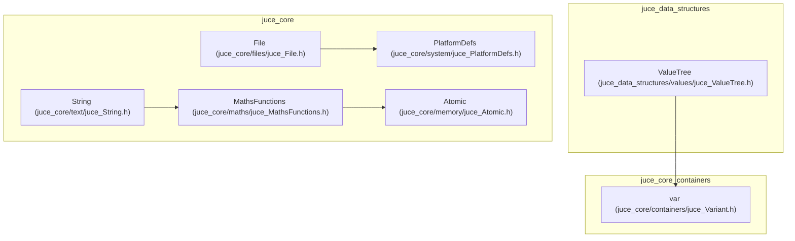

# Core Systems

> **Relevant source files**
> * [BREAKING_CHANGES.md](https://github.com/juce-framework/JUCE/blob/d6181bde/BREAKING_CHANGES.md)
> * [CHANGE_LIST.md](https://github.com/juce-framework/JUCE/blob/d6181bde/CHANGE_LIST.md)
> * [modules/juce_audio_basics/sources/juce_ChannelRemappingAudioSource.cpp](https://github.com/juce-framework/JUCE/blob/d6181bde/modules/juce_audio_basics/sources/juce_ChannelRemappingAudioSource.cpp)
> * [modules/juce_core/containers/juce_DynamicObject.cpp](https://github.com/juce-framework/JUCE/blob/d6181bde/modules/juce_core/containers/juce_DynamicObject.cpp)
> * [modules/juce_core/containers/juce_DynamicObject.h](https://github.com/juce-framework/JUCE/blob/d6181bde/modules/juce_core/containers/juce_DynamicObject.h)
> * [modules/juce_core/containers/juce_NamedValueSet.cpp](https://github.com/juce-framework/JUCE/blob/d6181bde/modules/juce_core/containers/juce_NamedValueSet.cpp)
> * [modules/juce_core/containers/juce_NamedValueSet.h](https://github.com/juce-framework/JUCE/blob/d6181bde/modules/juce_core/containers/juce_NamedValueSet.h)
> * [modules/juce_core/containers/juce_SparseSet.cpp](https://github.com/juce-framework/JUCE/blob/d6181bde/modules/juce_core/containers/juce_SparseSet.cpp)
> * [modules/juce_core/containers/juce_SparseSet.h](https://github.com/juce-framework/JUCE/blob/d6181bde/modules/juce_core/containers/juce_SparseSet.h)
> * [modules/juce_core/containers/juce_Variant.cpp](https://github.com/juce-framework/JUCE/blob/d6181bde/modules/juce_core/containers/juce_Variant.cpp)
> * [modules/juce_core/containers/juce_Variant.h](https://github.com/juce-framework/JUCE/blob/d6181bde/modules/juce_core/containers/juce_Variant.h)
> * [modules/juce_core/files/juce_File.cpp](https://github.com/juce-framework/JUCE/blob/d6181bde/modules/juce_core/files/juce_File.cpp)
> * [modules/juce_core/files/juce_File.h](https://github.com/juce-framework/JUCE/blob/d6181bde/modules/juce_core/files/juce_File.h)
> * [modules/juce_core/maths/juce_BigInteger.cpp](https://github.com/juce-framework/JUCE/blob/d6181bde/modules/juce_core/maths/juce_BigInteger.cpp)
> * [modules/juce_core/maths/juce_BigInteger.h](https://github.com/juce-framework/JUCE/blob/d6181bde/modules/juce_core/maths/juce_BigInteger.h)
> * [modules/juce_core/maths/juce_Expression.h](https://github.com/juce-framework/JUCE/blob/d6181bde/modules/juce_core/maths/juce_Expression.h)
> * [modules/juce_core/maths/juce_MathsFunctions.h](https://github.com/juce-framework/JUCE/blob/d6181bde/modules/juce_core/maths/juce_MathsFunctions.h)
> * [modules/juce_core/maths/juce_Random.cpp](https://github.com/juce-framework/JUCE/blob/d6181bde/modules/juce_core/maths/juce_Random.cpp)
> * [modules/juce_core/maths/juce_Random.h](https://github.com/juce-framework/JUCE/blob/d6181bde/modules/juce_core/maths/juce_Random.h)
> * [modules/juce_core/memory/juce_Atomic.h](https://github.com/juce-framework/JUCE/blob/d6181bde/modules/juce_core/memory/juce_Atomic.h)
> * [modules/juce_core/memory/juce_ByteOrder.h](https://github.com/juce-framework/JUCE/blob/d6181bde/modules/juce_core/memory/juce_ByteOrder.h)
> * [modules/juce_core/native/juce_BasicNativeHeaders.h](https://github.com/juce-framework/JUCE/blob/d6181bde/modules/juce_core/native/juce_BasicNativeHeaders.h)
> * [modules/juce_core/system/juce_CompilerSupport.h](https://github.com/juce-framework/JUCE/blob/d6181bde/modules/juce_core/system/juce_CompilerSupport.h)
> * [modules/juce_core/system/juce_PlatformDefs.h](https://github.com/juce-framework/JUCE/blob/d6181bde/modules/juce_core/system/juce_PlatformDefs.h)
> * [modules/juce_core/system/juce_TargetPlatform.h](https://github.com/juce-framework/JUCE/blob/d6181bde/modules/juce_core/system/juce_TargetPlatform.h)
> * [modules/juce_core/text/juce_Identifier.cpp](https://github.com/juce-framework/JUCE/blob/d6181bde/modules/juce_core/text/juce_Identifier.cpp)
> * [modules/juce_core/text/juce_Identifier.h](https://github.com/juce-framework/JUCE/blob/d6181bde/modules/juce_core/text/juce_Identifier.h)
> * [modules/juce_core/text/juce_NewLine.h](https://github.com/juce-framework/JUCE/blob/d6181bde/modules/juce_core/text/juce_NewLine.h)
> * [modules/juce_core/text/juce_String.cpp](https://github.com/juce-framework/JUCE/blob/d6181bde/modules/juce_core/text/juce_String.cpp)
> * [modules/juce_core/text/juce_String.h](https://github.com/juce-framework/JUCE/blob/d6181bde/modules/juce_core/text/juce_String.h)
> * [modules/juce_core/text/juce_StringRef.h](https://github.com/juce-framework/JUCE/blob/d6181bde/modules/juce_core/text/juce_StringRef.h)
> * [modules/juce_core/unit_tests/juce_UnitTest.cpp](https://github.com/juce-framework/JUCE/blob/d6181bde/modules/juce_core/unit_tests/juce_UnitTest.cpp)
> * [modules/juce_core/unit_tests/juce_UnitTest.h](https://github.com/juce-framework/JUCE/blob/d6181bde/modules/juce_core/unit_tests/juce_UnitTest.h)
> * [modules/juce_core/xml/juce_XmlElement.cpp](https://github.com/juce-framework/JUCE/blob/d6181bde/modules/juce_core/xml/juce_XmlElement.cpp)
> * [modules/juce_data_structures/app_properties/juce_PropertiesFile.cpp](https://github.com/juce-framework/JUCE/blob/d6181bde/modules/juce_data_structures/app_properties/juce_PropertiesFile.cpp)
> * [modules/juce_data_structures/app_properties/juce_PropertiesFile.h](https://github.com/juce-framework/JUCE/blob/d6181bde/modules/juce_data_structures/app_properties/juce_PropertiesFile.h)
> * [modules/juce_data_structures/values/juce_ValueTree.cpp](https://github.com/juce-framework/JUCE/blob/d6181bde/modules/juce_data_structures/values/juce_ValueTree.cpp)
> * [modules/juce_data_structures/values/juce_ValueTree.h](https://github.com/juce-framework/JUCE/blob/d6181bde/modules/juce_data_structures/values/juce_ValueTree.h)
> * [modules/juce_graphics/geometry/juce_AffineTransform.cpp](https://github.com/juce-framework/JUCE/blob/d6181bde/modules/juce_graphics/geometry/juce_AffineTransform.cpp)
> * [modules/juce_graphics/geometry/juce_AffineTransform.h](https://github.com/juce-framework/JUCE/blob/d6181bde/modules/juce_graphics/geometry/juce_AffineTransform.h)
> * [modules/juce_graphics/geometry/juce_Line.h](https://github.com/juce-framework/JUCE/blob/d6181bde/modules/juce_graphics/geometry/juce_Line.h)
> * [modules/juce_graphics/geometry/juce_Point.h](https://github.com/juce-framework/JUCE/blob/d6181bde/modules/juce_graphics/geometry/juce_Point.h)
> * [modules/juce_graphics/geometry/juce_Rectangle.h](https://github.com/juce-framework/JUCE/blob/d6181bde/modules/juce_graphics/geometry/juce_Rectangle.h)
> * [modules/juce_graphics/geometry/juce_RectangleList.h](https://github.com/juce-framework/JUCE/blob/d6181bde/modules/juce_graphics/geometry/juce_RectangleList.h)
> * [modules/juce_gui_basics/positioning/juce_RelativeCoordinate.cpp](https://github.com/juce-framework/JUCE/blob/d6181bde/modules/juce_gui_basics/positioning/juce_RelativeCoordinate.cpp)
> * [modules/juce_gui_basics/positioning/juce_RelativeCoordinate.h](https://github.com/juce-framework/JUCE/blob/d6181bde/modules/juce_gui_basics/positioning/juce_RelativeCoordinate.h)

The Core Systems in JUCE are the foundational modules that provide essential abstractions and utilities for all higher-level functionality. These systems ensure that JUCE applications behave consistently across platforms by standardizing data types, file access, text handling, mathematical operations, and platform integration.

For details on higher-level systems built on this foundation, see the [GUI Framework](/juce-framework/JUCE/3-gui-framework) and [Audio Framework](/juce-framework/JUCE/4-audio-framework) pages.

## Core System Modules and Their Code Entities

Below is a diagram mapping the main core modules to their key code entities, as found in the codebase:

**Diagram: Core System Modules and Code Entities**



Sources: [modules/juce_core/text/juce_String.h](https://github.com/juce-framework/JUCE/blob/d6181bde/modules/juce_core/text/juce_String.h)

 [modules/juce_core/files/juce_File.h](https://github.com/juce-framework/JUCE/blob/d6181bde/modules/juce_core/files/juce_File.h)

 [modules/juce_core/maths/juce_MathsFunctions.h](https://github.com/juce-framework/JUCE/blob/d6181bde/modules/juce_core/maths/juce_MathsFunctions.h)

 [modules/juce_core/system/juce_PlatformDefs.h](https://github.com/juce-framework/JUCE/blob/d6181bde/modules/juce_core/system/juce_PlatformDefs.h)

 [modules/juce_core/memory/juce_Atomic.h](https://github.com/juce-framework/JUCE/blob/d6181bde/modules/juce_core/memory/juce_Atomic.h)

 [modules/juce_data_structures/values/juce_ValueTree.h](https://github.com/juce-framework/JUCE/blob/d6181bde/modules/juce_data_structures/values/juce_ValueTree.h)

 [modules/juce_core/containers/juce_Variant.h](https://github.com/juce-framework/JUCE/blob/d6181bde/modules/juce_core/containers/juce_Variant.h)

These modules provide:

* **Text handling**: Unicode string manipulation and conversion (`String`)
* **File operations**: Cross-platform file system access (`File`)
* **Data structures**: Hierarchical trees and dynamic containers (`ValueTree`, `var`)
* **Mathematical functions**: Numeric operations and geometric primitives (`MathsFunctions`)
* **Platform abstractions**: Consistent APIs and macros for OS/compiler/architecture detection (`PlatformDefs`)
* **Atomic operations**: Thread-safe primitives (`Atomic`)

## Platform-Independent Data Types and Macros

JUCE defines a set of platform-independent types and macros to ensure code portability and consistency.

**Diagram: Numeric Types and Platform Macros**

```

```

Sources: [modules/juce_core/maths/juce_MathsFunctions.h L44-L99](https://github.com/juce-framework/JUCE/blob/d6181bde/modules/juce_core/maths/juce_MathsFunctions.h#L44-L99)

 [modules/juce_core/system/juce_TargetPlatform.h L42-L97](https://github.com/juce-framework/JUCE/blob/d6181bde/modules/juce_core/system/juce_TargetPlatform.h#L42-L97)

 [modules/juce_core/system/juce_CompilerSupport.h L42-L126](https://github.com/juce-framework/JUCE/blob/d6181bde/modules/juce_core/system/juce_CompilerSupport.h#L42-L126)

These types and macros are used throughout the framework to abstract away platform differences and provide a uniform programming interface.

## Text Handling: String Class

The `String` class is the primary Unicode text container in JUCE. It is reference-counted for efficient copying and supports a wide range of text operations.

**Diagram: String Class and Key Methods**

```

```

Sources: [modules/juce_core/text/juce_String.h L64-L203](https://github.com/juce-framework/JUCE/blob/d6181bde/modules/juce_core/text/juce_String.h#L64-L203)

 [modules/juce_core/text/juce_String.cpp L38-L98](https://github.com/juce-framework/JUCE/blob/d6181bde/modules/juce_core/text/juce_String.cpp#L38-L98)

**Key Features:**

* Unicode support (UTF-8, UTF-16, or UTF-32, configurable via `JUCE_STRING_UTF_TYPE`)
* Reference counting for efficient memory usage
* Rich set of manipulation and comparison methods
* Numeric conversion utilities
* Case-insensitive and case-sensitive operations

Sources: [modules/juce_core/text/juce_String.cpp L226-L296](https://github.com/juce-framework/JUCE/blob/d6181bde/modules/juce_core/text/juce_String.cpp#L226-L296)

 [modules/juce_core/text/juce_String.cpp L398-L536](https://github.com/juce-framework/JUCE/blob/d6181bde/modules/juce_core/text/juce_String.cpp#L398-L536)

## Data Storage: ValueTree and var

### ValueTree

`ValueTree` is a hierarchical, reference-counted data structure for storing tree-like data with named properties. It supports undo/redo and change listeners.

**Diagram: ValueTree and Related Entities**

```

```

Sources: [modules/juce_data_structures/values/juce_ValueTree.h L80-L917](https://github.com/juce-framework/JUCE/blob/d6181bde/modules/juce_data_structures/values/juce_ValueTree.h#L80-L917)

 [modules/juce_data_structures/values/juce_ValueTree.cpp L38-L582](https://github.com/juce-framework/JUCE/blob/d6181bde/modules/juce_data_structures/values/juce_ValueTree.cpp#L38-L582)

**Key Features:**

* Hierarchical structure with type identifiers
* Name-value property storage
* Undo/redo support via `UndoManager`
* Change notification via listeners
* XML serialization/deserialization

Sources: [modules/juce_data_structures/values/juce_ValueTree.cpp L140-L209](https://github.com/juce-framework/JUCE/blob/d6181bde/modules/juce_data_structures/values/juce_ValueTree.cpp#L140-L209)

 [modules/juce_data_structures/values/juce_ValueTree.cpp L769-L799](https://github.com/juce-framework/JUCE/blob/d6181bde/modules/juce_data_structures/values/juce_ValueTree.cpp#L769-L799)

### var (Variant)

The `var` class is a dynamic type that can hold numbers, strings, arrays, objects, and more.

**Diagram: var Class Structure**

```

```

Sources: [modules/juce_core/containers/juce_Variant.h L39-L44](https://github.com/juce-framework/JUCE/blob/d6181bde/modules/juce_core/containers/juce_Variant.h#L39-L44)

 [modules/juce_core/containers/juce_Variant.cpp L38-L86](https://github.com/juce-framework/JUCE/blob/d6181bde/modules/juce_core/containers/juce_Variant.cpp#L38-L86)

Supported types include:

* Numeric (int, int64, double)
* Boolean
* String
* Object references (`DynamicObject`)
* Arrays of `var`
* Binary data

Sources: [modules/juce_core/containers/juce_Variant.cpp L52-L86](https://github.com/juce-framework/JUCE/blob/d6181bde/modules/juce_core/containers/juce_Variant.cpp#L52-L86)

## File System Operations: File Class

The `File` class abstracts file and directory operations in a cross-platform manner.

**Diagram: File Class and Key Methods**

```

```

Sources: [modules/juce_core/files/juce_File.h L56-L1141](https://github.com/juce-framework/JUCE/blob/d6181bde/modules/juce_core/files/juce_File.h#L56-L1141)

 [modules/juce_core/files/juce_File.cpp L35-L354](https://github.com/juce-framework/JUCE/blob/d6181bde/modules/juce_core/files/juce_File.cpp#L35-L354)

**Key Features:**

* Path parsing and manipulation
* File and directory creation, deletion, copying, and moving
* Directory iteration and searching
* File metadata (size, modification time, etc.)
* File content reading and writing

Sources: [modules/juce_core/files/juce_File.cpp L550-L582](https://github.com/juce-framework/JUCE/blob/d6181bde/modules/juce_core/files/juce_File.cpp#L550-L582)

 [modules/juce_core/files/juce_File.cpp L300-L354](https://github.com/juce-framework/JUCE/blob/d6181bde/modules/juce_core/files/juce_File.cpp#L300-L354)

## Mathematics and Geometry

### Mathematical Functions

JUCE provides mathematical constants and utility functions for numeric and geometric operations.

**Diagram: MathConstants and MathFunctions**

```

```

Sources: [modules/juce_core/maths/juce_MathsFunctions.h L148-L166](https://github.com/juce-framework/JUCE/blob/d6181bde/modules/juce_core/maths/juce_MathsFunctions.h#L148-L166)

 [modules/juce_core/maths/juce_MathsFunctions.h L348-L373](https://github.com/juce-framework/JUCE/blob/d6181bde/modules/juce_core/maths/juce_MathsFunctions.h#L348-L373)

### Geometric Primitives

JUCE defines geometric primitives for spatial calculations and layout.

**Diagram: Geometric Primitives**

```

```

Sources: [modules/juce_graphics/geometry/juce_Point.h](https://github.com/juce-framework/JUCE/blob/d6181bde/modules/juce_graphics/geometry/juce_Point.h)

 [modules/juce_graphics/geometry/juce_Rectangle.h L74-L1135](https://github.com/juce-framework/JUCE/blob/d6181bde/modules/juce_graphics/geometry/juce_Rectangle.h#L74-L1135)

 [modules/juce_graphics/geometry/juce_Line.h](https://github.com/juce-framework/JUCE/blob/d6181bde/modules/juce_graphics/geometry/juce_Line.h)

 [modules/juce_graphics/geometry/juce_AffineTransform.h](https://github.com/juce-framework/JUCE/blob/d6181bde/modules/juce_graphics/geometry/juce_AffineTransform.h)

 [modules/juce_graphics/geometry/juce_AffineTransform.cpp](https://github.com/juce-framework/JUCE/blob/d6181bde/modules/juce_graphics/geometry/juce_AffineTransform.cpp)

These classes provide:

* Point positioning and distance calculations
* Rectangle area, intersection, and containment
* Line properties and intersection
* Affine transformations for scaling, rotation, and translation

## Platform Abstraction

JUCE abstracts platform differences to provide a consistent API across operating systems and compilers.

**Diagram: Platform Abstraction Entities and Supported Platforms**

```

```

Sources: [modules/juce_core/system/juce_TargetPlatform.h](https://github.com/juce-framework/JUCE/blob/d6181bde/modules/juce_core/system/juce_TargetPlatform.h)

 [modules/juce_core/system/juce_PlatformDefs.h](https://github.com/juce-framework/JUCE/blob/d6181bde/modules/juce_core/system/juce_PlatformDefs.h)

 [modules/juce_core/native/juce_BasicNativeHeaders.h](https://github.com/juce-framework/JUCE/blob/d6181bde/modules/juce_core/native/juce_BasicNativeHeaders.h)

 [modules/juce_core/memory/juce_Atomic.h](https://github.com/juce-framework/JUCE/blob/d6181bde/modules/juce_core/memory/juce_Atomic.h)

 [modules/juce_core/memory/juce_ByteOrder.h](https://github.com/juce-framework/JUCE/blob/d6181bde/modules/juce_core/memory/juce_ByteOrder.h)

**Key abstractions:**

* Operating system and compiler detection macros
* Platform-specific definitions and utilities
* Memory management and atomic operations
* Native API access encapsulation
* Endianness and byte order handling

## Debug and Assertion Tools

JUCE provides macros for debugging and assertions, which adapt to debug/release builds.

**Diagram: Debug and Assertion Macros**

```

```

Sources: [modules/juce_core/system/juce_PlatformDefs.h L146-L202](https://github.com/juce-framework/JUCE/blob/d6181bde/modules/juce_core/system/juce_PlatformDefs.h#L146-L202)

These macros provide debug output and assertion checking, and are disabled or minimized in release builds.

## Conclusion

The JUCE Core Systems provide a comprehensive foundation of cross-platform abstractions and utilities that higher-level JUCE modules build upon. By providing consistent APIs across different platforms, these systems allow developers to focus on application logic rather than platform-specific implementation details.

Key benefits of the Core Systems include:

* **Unicode text handling** with the `String` class
* **Hierarchical data management** with `ValueTree`
* **Platform-independent file operations** with the `File` class
* **Mathematical utilities** and geometric primitives
* **Platform abstraction** for consistent behavior across operating systems

These core components serve as the foundation for more specialized systems like the GUI Framework and Audio Framework, which build upon these basic facilities to provide higher-level functionality.

Sources: [modules/juce_core/maths/juce_MathsFunctions.h](https://github.com/juce-framework/JUCE/blob/d6181bde/modules/juce_core/maths/juce_MathsFunctions.h)

 [modules/juce_core/text/juce_String.h](https://github.com/juce-framework/JUCE/blob/d6181bde/modules/juce_core/text/juce_String.h)

 [modules/juce_data_structures/values/juce_ValueTree.h](https://github.com/juce-framework/JUCE/blob/d6181bde/modules/juce_data_structures/values/juce_ValueTree.h)

 [modules/juce_core/files/juce_File.h](https://github.com/juce-framework/JUCE/blob/d6181bde/modules/juce_core/files/juce_File.h)

 [modules/juce_core/system/juce_TargetPlatform.h](https://github.com/juce-framework/JUCE/blob/d6181bde/modules/juce_core/system/juce_TargetPlatform.h)