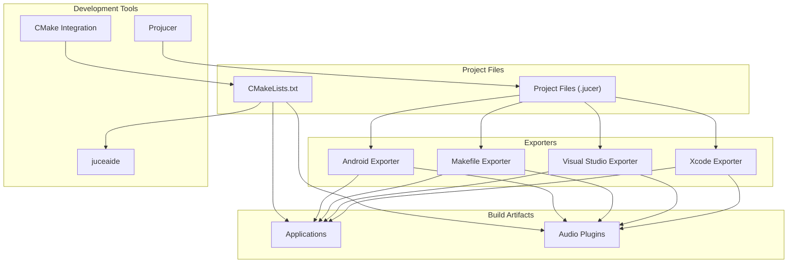
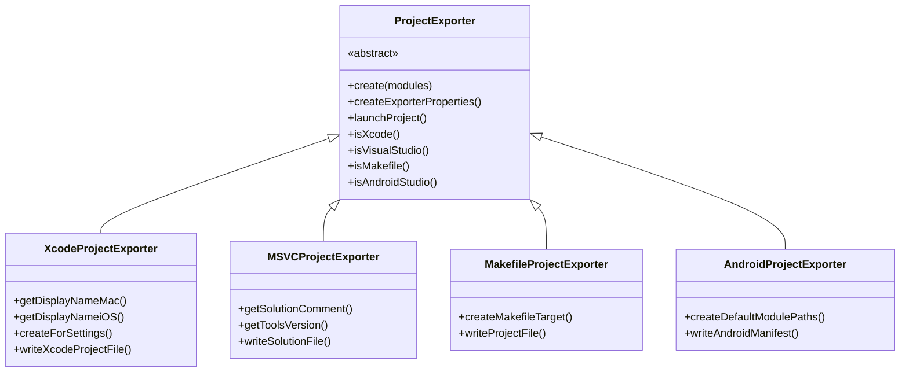
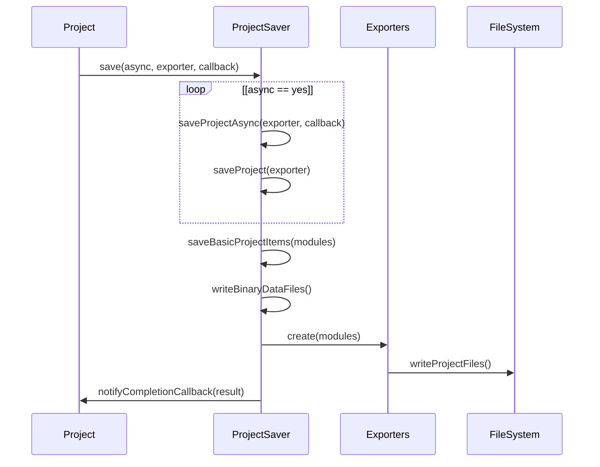
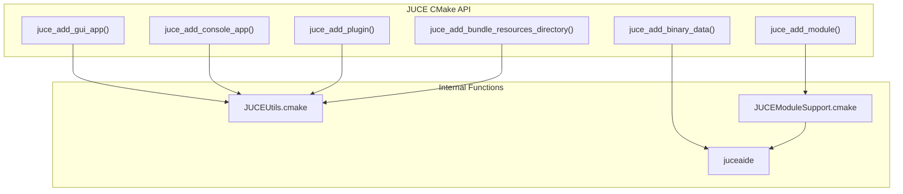
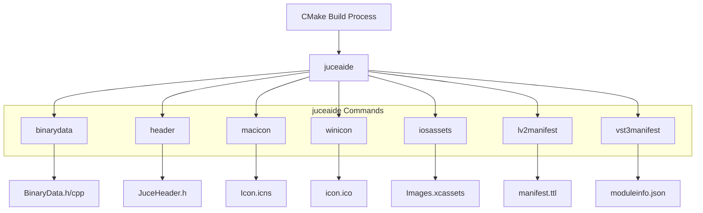

# Development Tools

> **Relevant source files**
> * [CMakeLists.txt](https://github.com/juce-framework/JUCE/blob/10a58961/CMakeLists.txt)
> * [docs/CMake API.md](https://github.com/juce-framework/JUCE/blob/10a58961/docs/CMake API.md)
> * [docs/JUCE Module Format.md](https://github.com/juce-framework/JUCE/blob/10a58961/docs/JUCE Module Format.md)
> * [examples/DemoRunner/CMakeLists.txt](https://github.com/juce-framework/JUCE/blob/10a58961/examples/DemoRunner/CMakeLists.txt)
> * [extras/AudioPluginHost/CMakeLists.txt](https://github.com/juce-framework/JUCE/blob/10a58961/extras/AudioPluginHost/CMakeLists.txt)
> * [extras/BinaryBuilder/CMakeLists.txt](https://github.com/juce-framework/JUCE/blob/10a58961/extras/BinaryBuilder/CMakeLists.txt)
> * [extras/Build/CMake/JUCEConfig.cmake.in](https://github.com/juce-framework/JUCE/blob/10a58961/extras/Build/CMake/JUCEConfig.cmake.in)
> * [extras/Build/CMake/JUCEHelperTargets.cmake](https://github.com/juce-framework/JUCE/blob/10a58961/extras/Build/CMake/JUCEHelperTargets.cmake)
> * [extras/Build/CMake/JUCEModuleSupport.cmake](https://github.com/juce-framework/JUCE/blob/10a58961/extras/Build/CMake/JUCEModuleSupport.cmake)
> * [extras/Build/CMake/JUCEUtils.cmake](https://github.com/juce-framework/JUCE/blob/10a58961/extras/Build/CMake/JUCEUtils.cmake)
> * [extras/Build/juce_build_tools/utils/juce_Icons.cpp](https://github.com/juce-framework/JUCE/blob/10a58961/extras/Build/juce_build_tools/utils/juce_Icons.cpp)
> * [extras/Build/juce_build_tools/utils/juce_PlistOptions.cpp](https://github.com/juce-framework/JUCE/blob/10a58961/extras/Build/juce_build_tools/utils/juce_PlistOptions.cpp)
> * [extras/Build/juce_build_tools/utils/juce_PlistOptions.h](https://github.com/juce-framework/JUCE/blob/10a58961/extras/Build/juce_build_tools/utils/juce_PlistOptions.h)
> * [extras/Build/juce_build_tools/utils/juce_RelativePath.h](https://github.com/juce-framework/JUCE/blob/10a58961/extras/Build/juce_build_tools/utils/juce_RelativePath.h)
> * [extras/Build/juce_build_tools/utils/juce_VersionNumbers.cpp](https://github.com/juce-framework/JUCE/blob/10a58961/extras/Build/juce_build_tools/utils/juce_VersionNumbers.cpp)
> * [extras/Build/juce_build_tools/utils/juce_VersionNumbers.h](https://github.com/juce-framework/JUCE/blob/10a58961/extras/Build/juce_build_tools/utils/juce_VersionNumbers.h)
> * [extras/Build/juceaide/CMakeLists.txt](https://github.com/juce-framework/JUCE/blob/10a58961/extras/Build/juceaide/CMakeLists.txt)
> * [extras/Build/juceaide/Main.cpp](https://github.com/juce-framework/JUCE/blob/10a58961/extras/Build/juceaide/Main.cpp)
> * [extras/Projucer/Source/Project/Modules/jucer_Modules.cpp](https://github.com/juce-framework/JUCE/blob/10a58961/extras/Projucer/Source/Project/Modules/jucer_Modules.cpp)
> * [extras/Projucer/Source/Project/Modules/jucer_Modules.h](https://github.com/juce-framework/JUCE/blob/10a58961/extras/Projucer/Source/Project/Modules/jucer_Modules.h)
> * [extras/Projucer/Source/Project/jucer_Project.cpp](https://github.com/juce-framework/JUCE/blob/10a58961/extras/Projucer/Source/Project/jucer_Project.cpp)
> * [extras/Projucer/Source/Project/jucer_Project.h](https://github.com/juce-framework/JUCE/blob/10a58961/extras/Projucer/Source/Project/jucer_Project.h)
> * [extras/Projucer/Source/ProjectSaving/jucer_ProjectExport_Android.h](https://github.com/juce-framework/JUCE/blob/10a58961/extras/Projucer/Source/ProjectSaving/jucer_ProjectExport_Android.h)
> * [extras/Projucer/Source/ProjectSaving/jucer_ProjectExport_MSVC.h](https://github.com/juce-framework/JUCE/blob/10a58961/extras/Projucer/Source/ProjectSaving/jucer_ProjectExport_MSVC.h)
> * [extras/Projucer/Source/ProjectSaving/jucer_ProjectExport_Make.h](https://github.com/juce-framework/JUCE/blob/10a58961/extras/Projucer/Source/ProjectSaving/jucer_ProjectExport_Make.h)
> * [extras/Projucer/Source/ProjectSaving/jucer_ProjectExport_Xcode.h](https://github.com/juce-framework/JUCE/blob/10a58961/extras/Projucer/Source/ProjectSaving/jucer_ProjectExport_Xcode.h)
> * [extras/Projucer/Source/ProjectSaving/jucer_ProjectExporter.cpp](https://github.com/juce-framework/JUCE/blob/10a58961/extras/Projucer/Source/ProjectSaving/jucer_ProjectExporter.cpp)
> * [extras/Projucer/Source/ProjectSaving/jucer_ProjectExporter.h](https://github.com/juce-framework/JUCE/blob/10a58961/extras/Projucer/Source/ProjectSaving/jucer_ProjectExporter.h)
> * [extras/Projucer/Source/ProjectSaving/jucer_ProjectSaver.cpp](https://github.com/juce-framework/JUCE/blob/10a58961/extras/Projucer/Source/ProjectSaving/jucer_ProjectSaver.cpp)
> * [extras/Projucer/Source/ProjectSaving/jucer_ProjectSaver.h](https://github.com/juce-framework/JUCE/blob/10a58961/extras/Projucer/Source/ProjectSaving/jucer_ProjectSaver.h)
> * [extras/Projucer/Source/Utility/Helpers/jucer_PresetIDs.h](https://github.com/juce-framework/JUCE/blob/10a58961/extras/Projucer/Source/Utility/Helpers/jucer_PresetIDs.h)
> * [extras/UnitTestRunner/CMakeLists.txt](https://github.com/juce-framework/JUCE/blob/10a58961/extras/UnitTestRunner/CMakeLists.txt)
> * [modules/CMakeLists.txt](https://github.com/juce-framework/JUCE/blob/10a58961/modules/CMakeLists.txt)

JUCE offers a comprehensive set of development tools that help developers create, manage, and build audio applications and plugins across multiple platforms. This page provides an overview of the main development tools in the JUCE ecosystem and explains how they integrate with your development workflow.

## Overview of JUCE Development Tools

JUCE provides two primary approaches to project management and building:

1. **Projucer** - A GUI application for creating, configuring, and managing JUCE projects
2. **CMake Integration** - A modern build system approach for JUCE projects

Additionally, there are several supporting tools that assist in the build process:

* **juceaide** - A command-line utility for build-time tasks like generating binary data
* **Platform-specific exporters** - Components that generate native project files for different IDEs and platforms

The following diagram illustrates the relationships between these tools:

Sources: [extras/Projucer/Source/ProjectSaving/jucer_ProjectExporter.h L95-L198](https://github.com/juce-framework/JUCE/blob/10a58961/extras/Projucer/Source/ProjectSaving/jucer_ProjectExporter.h#L95-L198)

 [CMakeLists.txt L1-L124](https://github.com/juce-framework/JUCE/blob/10a58961/CMakeLists.txt#L1-L124)

 [extras/Build/juceaide/CMakeLists.txt L1-L60](https://github.com/juce-framework/JUCE/blob/10a58961/extras/Build/juceaide/CMakeLists.txt#L1-L60)

## Projucer

The Projucer is JUCE's graphical project management application. It allows developers to create, configure, and manage JUCE projects with a user-friendly interface.

### Key Features

* Create new projects from templates
* Configure modules and dependencies
* Manage source files and resources
* Define build configurations
* Export to multiple platforms (macOS, Windows, Linux, iOS, Android)
* Integrated code editor for quick changes

### Project Exporters

The Projucer includes several platform-specific exporters that generate native project files:

Sources: [extras/Projucer/Source/ProjectSaving/jucer_ProjectExporter.cpp L77-L167](https://github.com/juce-framework/JUCE/blob/10a58961/extras/Projucer/Source/ProjectSaving/jucer_ProjectExporter.cpp#L77-L167)

 [extras/Projucer/Source/ProjectSaving/jucer_ProjectExport_Xcode.h L171-L456](https://github.com/juce-framework/JUCE/blob/10a58961/extras/Projucer/Source/ProjectSaving/jucer_ProjectExport_Xcode.h#L171-L456)

 [extras/Projucer/Source/ProjectSaving/jucer_ProjectExport_MSVC.h L311-L450](https://github.com/juce-framework/JUCE/blob/10a58961/extras/Projucer/Source/ProjectSaving/jucer_ProjectExport_MSVC.h#L311-L450)

 [extras/Projucer/Source/ProjectSaving/jucer_ProjectExport_Make.h L39-L606](https://github.com/juce-framework/JUCE/blob/10a58961/extras/Projucer/Source/ProjectSaving/jucer_ProjectExport_Make.h#L39-L606)

 [extras/Projucer/Source/ProjectSaving/jucer_ProjectExport_Android.h L39-L241](https://github.com/juce-framework/JUCE/blob/10a58961/extras/Projucer/Source/ProjectSaving/jucer_ProjectExport_Android.h#L39-L241)

### Project Saving Process

When a project is saved in the Projucer, the following process occurs:

Sources: [extras/Projucer/Source/ProjectSaving/jucer_ProjectSaver.cpp L44-L89](https://github.com/juce-framework/JUCE/blob/10a58961/extras/Projucer/Source/ProjectSaving/jucer_ProjectSaver.cpp#L44-L89)

 [extras/Projucer/Source/ProjectSaving/jucer_ProjectSaver.h L42-L62](https://github.com/juce-framework/JUCE/blob/10a58961/extras/Projucer/Source/ProjectSaving/jucer_ProjectSaver.h#L42-L62)

## CMake Integration

JUCE provides comprehensive CMake integration as a modern approach to building JUCE projects. This allows developers to define projects in CMakeLists.txt files and build for multiple platforms from a single project definition.

### Key CMake Functions

Sources: [extras/Build/CMake/JUCEUtils.cmake L151-L249](https://github.com/juce-framework/JUCE/blob/10a58961/extras/Build/CMake/JUCEUtils.cmake#L151-L249)

 [extras/Build/CMake/JUCEModuleSupport.cmake L32-L60](https://github.com/juce-framework/JUCE/blob/10a58961/extras/Build/CMake/JUCEModuleSupport.cmake#L32-L60)

 [docs/CMake L1-L60](https://github.com/juce-framework/JUCE/blob/10a58961/docs/CMake API.md#L1-L60)

### The juceaide Tool

The `juceaide` tool is a command-line utility that performs several build-time tasks:

* Generating BinaryData source files from resources
* Converting images to platform-specific icon formats
* Creating JuceHeader.h files with module includes
* Preprocessing PList files for macOS/iOS apps

The tool is automatically built and used by the CMake build system to generate necessary source files during the build process.

Sources: [extras/Build/juceaide/Main.cpp L34-L185](https://github.com/juce-framework/JUCE/blob/10a58961/extras/Build/juceaide/Main.cpp#L34-L185)

 [extras/Build/juceaide/CMakeLists.txt L32-L60](https://github.com/juce-framework/JUCE/blob/10a58961/extras/Build/juceaide/CMakeLists.txt#L32-L60)

 [extras/Build/CMake/JUCEUtils.cmake L436-L499](https://github.com/juce-framework/JUCE/blob/10a58961/extras/Build/CMake/JUCEUtils.cmake#L436-L499)

## Development Workflows

JUCE offers two main development workflows:

### Projucer Workflow

1. Create or open a project in the Projucer
2. Configure modules, settings, and add source files
3. Save the project, which generates native project files
4. Open the generated project in the native IDE (Xcode, Visual Studio, etc.)
5. Build and run the project in the IDE

### CMake Workflow

1. Create a CMakeLists.txt file defining your project
2. Configure the project with CMake
3. Build the project using your preferred build system
4. Run the built application or plugin

The following table compares these two approaches:

| Feature | Projucer | CMake |
| --- | --- | --- |
| UI for project configuration | Yes | No (text-based) |
| Integrated code editor | Yes | No |
| Version control friendly | Limited | Yes |
| CI/CD integration | Limited | Excellent |
| Cross-platform consistency | Varies by exporter | Consistent |
| Custom build steps | Limited | Flexible |
| Build performance | Dependent on IDE | Optimized |
| Learning curve | Gentle | Steeper |

Sources: [docs/CMake L45-L124](https://github.com/juce-framework/JUCE/blob/10a58961/docs/CMake API.md#L45-L124)

 [extras/Projucer/Source/Project/jucer_Project.cpp L127-L196](https://github.com/juce-framework/JUCE/blob/10a58961/extras/Projucer/Source/Project/jucer_Project.cpp#L127-L196)

## Platform-Specific Considerations

### macOS/iOS (Xcode)

The Xcode exporter handles:

* Code signing and entitlements
* App sandbox configuration
* Bundle resources and assets
* macOS/iOS specific permissions
* Framework dependencies

Sources: [extras/Projucer/Source/ProjectSaving/jucer_ProjectExport_Xcode.h L171-L290](https://github.com/juce-framework/JUCE/blob/10a58961/extras/Projucer/Source/ProjectSaving/jucer_ProjectExport_Xcode.h#L171-L290)

### Windows (Visual Studio)

The Visual Studio exporter handles:

* Architecture settings (Win32, x64, ARM64)
* Visual Studio version-specific features
* Windows resource files
* DLL dependencies

Sources: [extras/Projucer/Source/ProjectSaving/jucer_ProjectExport_MSVC.h L243-L307](https://github.com/juce-framework/JUCE/blob/10a58961/extras/Projucer/Source/ProjectSaving/jucer_ProjectExport_MSVC.h#L243-L307)

### Linux (Makefile)

The Makefile exporter handles:

* Linux-specific build flags
* Library dependencies through pkg-config
* Installation paths
* Compiler and linker options

Sources: [extras/Projucer/Source/ProjectSaving/jucer_ProjectExport_Make.h L39-L130](https://github.com/juce-framework/JUCE/blob/10a58961/extras/Projucer/Source/ProjectSaving/jucer_ProjectExport_Make.h#L39-L130)

### Android (Android Studio)

The Android exporter handles:

* Android SDK/NDK integration
* Java source files and resources
* Android manifest
* Gradle build system

Sources: [extras/Projucer/Source/ProjectSaving/jucer_ProjectExport_Android.h L39-L120](https://github.com/juce-framework/JUCE/blob/10a58961/extras/Projucer/Source/ProjectSaving/jucer_ProjectExport_Android.h#L39-L120)

## See Also

* For detailed information about the Projucer application, see [Projucer](/juce-framework/JUCE/5.1-projucer)
* For detailed information about the CMake build system, see [CMake Build System](/juce-framework/JUCE/5.2-cmake-build-system)