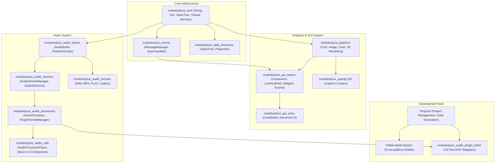
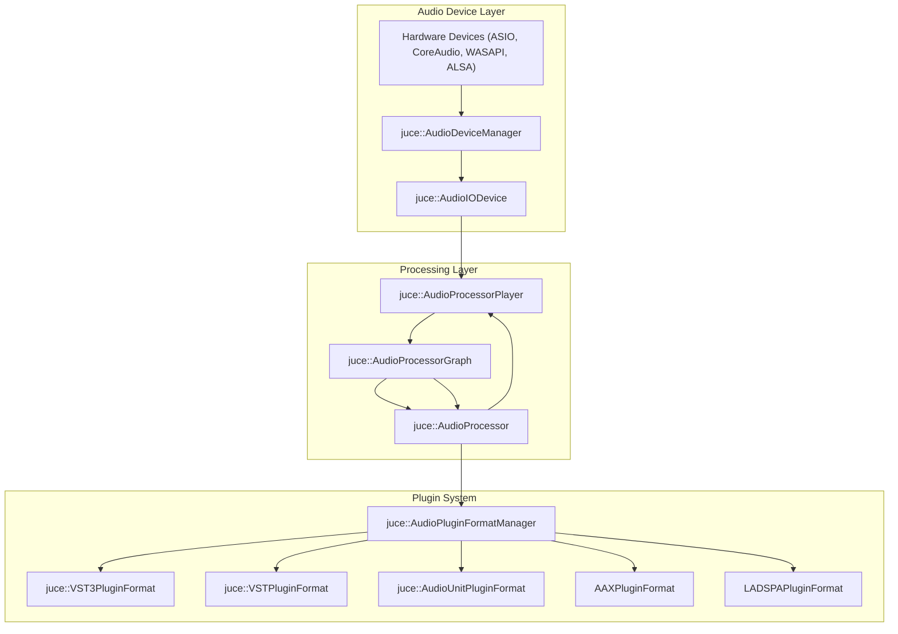

# JUCE Framework Overview

> **Relevant source files**
> * [BREAKING_CHANGES.md](https://github.com/juce-framework/JUCE/blob/d6181bde/BREAKING_CHANGES.md)
> * [CHANGE_LIST.md](https://github.com/juce-framework/JUCE/blob/d6181bde/CHANGE_LIST.md)
> * [modules/juce_audio_basics/juce_audio_basics.h](https://github.com/juce-framework/JUCE/blob/d6181bde/modules/juce_audio_basics/juce_audio_basics.h)
> * [modules/juce_audio_basics/sources/juce_ChannelRemappingAudioSource.cpp](https://github.com/juce-framework/JUCE/blob/d6181bde/modules/juce_audio_basics/sources/juce_ChannelRemappingAudioSource.cpp)
> * [modules/juce_audio_devices/juce_audio_devices.h](https://github.com/juce-framework/JUCE/blob/d6181bde/modules/juce_audio_devices/juce_audio_devices.h)
> * [modules/juce_audio_formats/juce_audio_formats.h](https://github.com/juce-framework/JUCE/blob/d6181bde/modules/juce_audio_formats/juce_audio_formats.h)
> * [modules/juce_audio_plugin_client/juce_audio_plugin_client.h](https://github.com/juce-framework/JUCE/blob/d6181bde/modules/juce_audio_plugin_client/juce_audio_plugin_client.h)
> * [modules/juce_audio_processors/juce_audio_processors.h](https://github.com/juce-framework/JUCE/blob/d6181bde/modules/juce_audio_processors/juce_audio_processors.h)
> * [modules/juce_audio_utils/juce_audio_utils.h](https://github.com/juce-framework/JUCE/blob/d6181bde/modules/juce_audio_utils/juce_audio_utils.h)
> * [modules/juce_box2d/juce_box2d.h](https://github.com/juce-framework/JUCE/blob/d6181bde/modules/juce_box2d/juce_box2d.h)
> * [modules/juce_core/containers/juce_DynamicObject.cpp](https://github.com/juce-framework/JUCE/blob/d6181bde/modules/juce_core/containers/juce_DynamicObject.cpp)
> * [modules/juce_core/containers/juce_DynamicObject.h](https://github.com/juce-framework/JUCE/blob/d6181bde/modules/juce_core/containers/juce_DynamicObject.h)
> * [modules/juce_core/containers/juce_NamedValueSet.cpp](https://github.com/juce-framework/JUCE/blob/d6181bde/modules/juce_core/containers/juce_NamedValueSet.cpp)
> * [modules/juce_core/containers/juce_NamedValueSet.h](https://github.com/juce-framework/JUCE/blob/d6181bde/modules/juce_core/containers/juce_NamedValueSet.h)
> * [modules/juce_core/containers/juce_SparseSet.cpp](https://github.com/juce-framework/JUCE/blob/d6181bde/modules/juce_core/containers/juce_SparseSet.cpp)
> * [modules/juce_core/containers/juce_SparseSet.h](https://github.com/juce-framework/JUCE/blob/d6181bde/modules/juce_core/containers/juce_SparseSet.h)
> * [modules/juce_core/containers/juce_Variant.cpp](https://github.com/juce-framework/JUCE/blob/d6181bde/modules/juce_core/containers/juce_Variant.cpp)
> * [modules/juce_core/containers/juce_Variant.h](https://github.com/juce-framework/JUCE/blob/d6181bde/modules/juce_core/containers/juce_Variant.h)
> * [modules/juce_core/files/juce_File.cpp](https://github.com/juce-framework/JUCE/blob/d6181bde/modules/juce_core/files/juce_File.cpp)
> * [modules/juce_core/files/juce_File.h](https://github.com/juce-framework/JUCE/blob/d6181bde/modules/juce_core/files/juce_File.h)
> * [modules/juce_core/juce_core.cpp](https://github.com/juce-framework/JUCE/blob/d6181bde/modules/juce_core/juce_core.cpp)
> * [modules/juce_core/juce_core.h](https://github.com/juce-framework/JUCE/blob/d6181bde/modules/juce_core/juce_core.h)
> * [modules/juce_core/maths/juce_BigInteger.cpp](https://github.com/juce-framework/JUCE/blob/d6181bde/modules/juce_core/maths/juce_BigInteger.cpp)
> * [modules/juce_core/maths/juce_BigInteger.h](https://github.com/juce-framework/JUCE/blob/d6181bde/modules/juce_core/maths/juce_BigInteger.h)
> * [modules/juce_core/maths/juce_Expression.h](https://github.com/juce-framework/JUCE/blob/d6181bde/modules/juce_core/maths/juce_Expression.h)
> * [modules/juce_core/maths/juce_MathsFunctions.h](https://github.com/juce-framework/JUCE/blob/d6181bde/modules/juce_core/maths/juce_MathsFunctions.h)
> * [modules/juce_core/maths/juce_Random.cpp](https://github.com/juce-framework/JUCE/blob/d6181bde/modules/juce_core/maths/juce_Random.cpp)
> * [modules/juce_core/maths/juce_Random.h](https://github.com/juce-framework/JUCE/blob/d6181bde/modules/juce_core/maths/juce_Random.h)
> * [modules/juce_core/memory/juce_Atomic.h](https://github.com/juce-framework/JUCE/blob/d6181bde/modules/juce_core/memory/juce_Atomic.h)
> * [modules/juce_core/memory/juce_ByteOrder.h](https://github.com/juce-framework/JUCE/blob/d6181bde/modules/juce_core/memory/juce_ByteOrder.h)
> * [modules/juce_core/native/juce_BasicNativeHeaders.h](https://github.com/juce-framework/JUCE/blob/d6181bde/modules/juce_core/native/juce_BasicNativeHeaders.h)
> * [modules/juce_core/system/juce_CompilerSupport.h](https://github.com/juce-framework/JUCE/blob/d6181bde/modules/juce_core/system/juce_CompilerSupport.h)
> * [modules/juce_core/system/juce_PlatformDefs.h](https://github.com/juce-framework/JUCE/blob/d6181bde/modules/juce_core/system/juce_PlatformDefs.h)
> * [modules/juce_core/system/juce_TargetPlatform.h](https://github.com/juce-framework/JUCE/blob/d6181bde/modules/juce_core/system/juce_TargetPlatform.h)
> * [modules/juce_core/text/juce_Identifier.cpp](https://github.com/juce-framework/JUCE/blob/d6181bde/modules/juce_core/text/juce_Identifier.cpp)
> * [modules/juce_core/text/juce_Identifier.h](https://github.com/juce-framework/JUCE/blob/d6181bde/modules/juce_core/text/juce_Identifier.h)
> * [modules/juce_core/text/juce_NewLine.h](https://github.com/juce-framework/JUCE/blob/d6181bde/modules/juce_core/text/juce_NewLine.h)
> * [modules/juce_core/text/juce_String.cpp](https://github.com/juce-framework/JUCE/blob/d6181bde/modules/juce_core/text/juce_String.cpp)
> * [modules/juce_core/text/juce_String.h](https://github.com/juce-framework/JUCE/blob/d6181bde/modules/juce_core/text/juce_String.h)
> * [modules/juce_core/text/juce_StringRef.h](https://github.com/juce-framework/JUCE/blob/d6181bde/modules/juce_core/text/juce_StringRef.h)
> * [modules/juce_core/unit_tests/juce_UnitTest.cpp](https://github.com/juce-framework/JUCE/blob/d6181bde/modules/juce_core/unit_tests/juce_UnitTest.cpp)
> * [modules/juce_core/unit_tests/juce_UnitTest.h](https://github.com/juce-framework/JUCE/blob/d6181bde/modules/juce_core/unit_tests/juce_UnitTest.h)
> * [modules/juce_core/xml/juce_XmlElement.cpp](https://github.com/juce-framework/JUCE/blob/d6181bde/modules/juce_core/xml/juce_XmlElement.cpp)
> * [modules/juce_cryptography/juce_cryptography.h](https://github.com/juce-framework/JUCE/blob/d6181bde/modules/juce_cryptography/juce_cryptography.h)
> * [modules/juce_data_structures/app_properties/juce_PropertiesFile.cpp](https://github.com/juce-framework/JUCE/blob/d6181bde/modules/juce_data_structures/app_properties/juce_PropertiesFile.cpp)
> * [modules/juce_data_structures/app_properties/juce_PropertiesFile.h](https://github.com/juce-framework/JUCE/blob/d6181bde/modules/juce_data_structures/app_properties/juce_PropertiesFile.h)
> * [modules/juce_data_structures/juce_data_structures.h](https://github.com/juce-framework/JUCE/blob/d6181bde/modules/juce_data_structures/juce_data_structures.h)
> * [modules/juce_data_structures/values/juce_ValueTree.cpp](https://github.com/juce-framework/JUCE/blob/d6181bde/modules/juce_data_structures/values/juce_ValueTree.cpp)
> * [modules/juce_data_structures/values/juce_ValueTree.h](https://github.com/juce-framework/JUCE/blob/d6181bde/modules/juce_data_structures/values/juce_ValueTree.h)
> * [modules/juce_events/juce_events.h](https://github.com/juce-framework/JUCE/blob/d6181bde/modules/juce_events/juce_events.h)
> * [modules/juce_graphics/geometry/juce_AffineTransform.cpp](https://github.com/juce-framework/JUCE/blob/d6181bde/modules/juce_graphics/geometry/juce_AffineTransform.cpp)
> * [modules/juce_graphics/geometry/juce_AffineTransform.h](https://github.com/juce-framework/JUCE/blob/d6181bde/modules/juce_graphics/geometry/juce_AffineTransform.h)
> * [modules/juce_graphics/geometry/juce_Line.h](https://github.com/juce-framework/JUCE/blob/d6181bde/modules/juce_graphics/geometry/juce_Line.h)
> * [modules/juce_graphics/geometry/juce_Point.h](https://github.com/juce-framework/JUCE/blob/d6181bde/modules/juce_graphics/geometry/juce_Point.h)
> * [modules/juce_graphics/geometry/juce_Rectangle.h](https://github.com/juce-framework/JUCE/blob/d6181bde/modules/juce_graphics/geometry/juce_Rectangle.h)
> * [modules/juce_graphics/geometry/juce_RectangleList.h](https://github.com/juce-framework/JUCE/blob/d6181bde/modules/juce_graphics/geometry/juce_RectangleList.h)
> * [modules/juce_graphics/juce_graphics.h](https://github.com/juce-framework/JUCE/blob/d6181bde/modules/juce_graphics/juce_graphics.h)
> * [modules/juce_gui_basics/juce_gui_basics.cpp](https://github.com/juce-framework/JUCE/blob/d6181bde/modules/juce_gui_basics/juce_gui_basics.cpp)
> * [modules/juce_gui_basics/juce_gui_basics.h](https://github.com/juce-framework/JUCE/blob/d6181bde/modules/juce_gui_basics/juce_gui_basics.h)
> * [modules/juce_gui_basics/positioning/juce_RelativeCoordinate.cpp](https://github.com/juce-framework/JUCE/blob/d6181bde/modules/juce_gui_basics/positioning/juce_RelativeCoordinate.cpp)
> * [modules/juce_gui_basics/positioning/juce_RelativeCoordinate.h](https://github.com/juce-framework/JUCE/blob/d6181bde/modules/juce_gui_basics/positioning/juce_RelativeCoordinate.h)
> * [modules/juce_gui_extra/juce_gui_extra.h](https://github.com/juce-framework/JUCE/blob/d6181bde/modules/juce_gui_extra/juce_gui_extra.h)
> * [modules/juce_opengl/juce_opengl.h](https://github.com/juce-framework/JUCE/blob/d6181bde/modules/juce_opengl/juce_opengl.h)
> * [modules/juce_video/juce_video.h](https://github.com/juce-framework/JUCE/blob/d6181bde/modules/juce_video/juce_video.h)

JUCE (Jules' Utility Class Extensions) is a cross-platform C++ framework for building audio applications, plugins, and graphical user interfaces. It provides a modular architecture, with each module encapsulating a specific set of functionality, and is widely used for professional audio software development.

For detailed documentation on specific subsystems, see [Core Systems](/juce-framework/JUCE/2-core-systems), [GUI Framework](/juce-framework/JUCE/3-gui-framework), and [Audio Framework](/juce-framework/JUCE/4-audio-framework).

## High-Level Architecture

The JUCE framework is structured as a set of modules, each responsible for a major subsystem. The following diagram shows the main modules and their relationships, using code entity names as they appear in the codebase.

**Diagram: JUCE Module and System Relationships**



Sources:

* [modules/juce_core/juce_core.h](https://github.com/juce-framework/JUCE/blob/d6181bde/modules/juce_core/juce_core.h)
* [modules/juce_gui_basics/juce_gui_basics.h](https://github.com/juce-framework/JUCE/blob/d6181bde/modules/juce_gui_basics/juce_gui_basics.h)
* [modules/juce_audio_processors/juce_audio_processors.h](https://github.com/juce-framework/JUCE/blob/d6181bde/modules/juce_audio_processors/juce_audio_processors.h)

## Core Systems

The core of JUCE is built on a set of foundational modules that provide essential data types, utilities, and abstractions.

**Diagram: Core System Code Entities**

```

```

### juce_core

* Unicode text: [`juce](https://github.com/juce-framework/JUCE/blob/d6181bde/`juce#LNaN-LNaN) ()
* File system: [`juce](https://github.com/juce-framework/JUCE/blob/d6181bde/`juce#LNaN-LNaN) ()
* Containers: [`juce](https://github.com/juce-framework/JUCE/blob/d6181bde/`juce#LNaN-LNaN) ()
* Memory: [`juce](https://github.com/juce-framework/JUCE/blob/d6181bde/`juce#LNaN-LNaN) ()
* Threading: [`juce](https://github.com/juce-framework/JUCE/blob/d6181bde/`juce#LNaN-LNaN) ()

### juce_events

* Event/message dispatch: [`juce](https://github.com/juce-framework/JUCE/blob/d6181bde/`juce#LNaN-LNaN) ()
* Timers and async callbacks: [`juce](https://github.com/juce-framework/JUCE/blob/d6181bde/`juce#LNaN-LNaN) ()

### juce_data_structures

* Hierarchical data: [`juce](https://github.com/juce-framework/JUCE/blob/d6181bde/`juce#LNaN-LNaN) ()
* Serialization: XML/JSON ([modules/juce_core/xml/juce_XmlElement.cpp](https://github.com/juce-framework/JUCE/blob/d6181bde/modules/juce_core/xml/juce_XmlElement.cpp)  [modules/juce_core/json/juce_JSON.cpp](https://github.com/juce-framework/JUCE/blob/d6181bde/modules/juce_core/json/juce_JSON.cpp) )

Sources:

* [modules/juce_core/juce_core.cpp L128-L204](https://github.com/juce-framework/JUCE/blob/d6181bde/modules/juce_core/juce_core.cpp#L128-L204)
* [modules/juce_core/juce_core.h](https://github.com/juce-framework/JUCE/blob/d6181bde/modules/juce_core/juce_core.h)
* [modules/juce_events/juce_events.h](https://github.com/juce-framework/JUCE/blob/d6181bde/modules/juce_events/juce_events.h)
* [modules/juce_data_structures/values/juce_ValueTree.cpp](https://github.com/juce-framework/JUCE/blob/d6181bde/modules/juce_data_structures/values/juce_ValueTree.cpp)

## GUI Framework

JUCE's GUI system is based on a component hierarchy and event-driven model. All visual elements inherit from `juce::Component`.

**Diagram: GUI System Code Entities and Relationships**

```

```

* `juce::Component` is the base class for all UI elements ([modules/juce_gui_basics/components/juce_Component.h L56-L314](https://github.com/juce-framework/JUCE/blob/d6181bde/modules/juce_gui_basics/components/juce_Component.h#L56-L314) ).
* `juce::ComponentPeer` abstracts native windowing ([modules/juce_gui_basics/windows/juce_ComponentPeer.h](https://github.com/juce-framework/JUCE/blob/d6181bde/modules/juce_gui_basics/windows/juce_ComponentPeer.h) ).
* `juce::LookAndFeel` provides rendering customization ([modules/juce_gui_basics/lookandfeel/juce_LookAndFeel.h](https://github.com/juce-framework/JUCE/blob/d6181bde/modules/juce_gui_basics/lookandfeel/juce_LookAndFeel.h) ).
* `juce::Graphics` is used for 2D drawing ([modules/juce_graphics/juce_graphics.h](https://github.com/juce-framework/JUCE/blob/d6181bde/modules/juce_graphics/juce_graphics.h) ).
* Widgets like `juce::Button`, `juce::Slider`, and `juce::TextEditor` inherit from `Component`.

Platform-specific details are handled by `ComponentPeer` subclasses, which bridge to native APIs.

Sources:

* [modules/juce_gui_basics/components/juce_Component.h L56-L314](https://github.com/juce-framework/JUCE/blob/d6181bde/modules/juce_gui_basics/components/juce_Component.h#L56-L314)
* [modules/juce_gui_basics/juce_gui_basics.cpp L132-L156](https://github.com/juce-framework/JUCE/blob/d6181bde/modules/juce_gui_basics/juce_gui_basics.cpp#L132-L156)
* [modules/juce_gui_basics/windows/juce_ComponentPeer.h](https://github.com/juce-framework/JUCE/blob/d6181bde/modules/juce_gui_basics/windows/juce_ComponentPeer.h)
* [modules/juce_gui_basics/mouse/juce_MouseInputSource.cpp](https://github.com/juce-framework/JUCE/blob/d6181bde/modules/juce_gui_basics/mouse/juce_MouseInputSource.cpp)

## Audio Framework

JUCE's audio system is built around the `juce::AudioProcessor` class and related plugin and device abstractions.

**Diagram: Audio Processing Pipeline and Code Entities**



* `juce::AudioProcessor` is the base class for audio processing ([modules/juce_audio_processors/processors/juce_AudioProcessor.h](https://github.com/juce-framework/JUCE/blob/d6181bde/modules/juce_audio_processors/processors/juce_AudioProcessor.h) ).
* `juce::AudioProcessorGraph` allows modular, node-based audio routing.
* `juce::AudioPluginFormatManager` and related classes handle plugin discovery and instantiation.
* Device management is handled by `juce::AudioDeviceManager` and `juce::AudioIODevice`.

Key methods in `juce::AudioProcessor`:

* `prepareToPlay(double sampleRate, int maxBlockSize)`
* `processBlock(AudioBuffer<float>&, MidiBuffer&)`
* `releaseResources()`

Sources:

* [modules/juce_audio_processors/processors/juce_AudioProcessor.h](https://github.com/juce-framework/JUCE/blob/d6181bde/modules/juce_audio_processors/processors/juce_AudioProcessor.h)
* [modules/juce_audio_processors/format_types/juce_VST3PluginFormat.cpp](https://github.com/juce-framework/JUCE/blob/d6181bde/modules/juce_audio_processors/format_types/juce_VST3PluginFormat.cpp)
* [modules/juce_audio_processors/format_types/juce_VSTPluginFormat.cpp](https://github.com/juce-framework/JUCE/blob/d6181bde/modules/juce_audio_processors/format_types/juce_VSTPluginFormat.cpp)
* [modules/juce_audio_processors/format_types/juce_AudioUnitPluginFormat.mm](https://github.com/juce-framework/JUCE/blob/d6181bde/modules/juce_audio_processors/format_types/juce_AudioUnitPluginFormat.mm)
* [modules/juce_audio_devices/juce_audio_devices.h](https://github.com/juce-framework/JUCE/blob/d6181bde/modules/juce_audio_devices/juce_audio_devices.h)

## Plugin Support

JUCE supports development and hosting of audio plugins in multiple formats using a unified codebase.

| Format | Platforms | JUCE Code Entity |
| --- | --- | --- |
| VST3 | Windows, macOS, Linux | `juce::VST3PluginFormat` |
| VST2 | Windows, macOS, Linux | `juce::VSTPluginFormat` |
| Audio Unit (AU) | macOS, iOS | `juce::AudioUnitPluginFormat` |
| AAX | Windows, macOS | `AAXPluginFormat` (wrapper) |
| Standalone | All | `StandalonePluginHolder` |

The same `juce::AudioProcessor` implementation can be compiled for all supported plugin formats and as a standalone application.

Sources:

* [modules/juce_audio_processors/format_types/juce_VST3Common.h](https://github.com/juce-framework/JUCE/blob/d6181bde/modules/juce_audio_processors/format_types/juce_VST3Common.h)
* [modules/juce_audio_plugin_client/juce_audio_plugin_client.h](https://github.com/juce-framework/JUCE/blob/d6181bde/modules/juce_audio_plugin_client/juce_audio_plugin_client.h)

## Cross-Platform Abstraction

JUCE provides a consistent API across platforms by abstracting platform-specific details behind code entities.

**Diagram: Platform Abstraction in JUCE**

```mermaid
flowchart TD

Component["juce::Component"]
Graphics["juce::Graphics"]
File["juce::File"]
AudioIODevice["juce::AudioIODevice"]
HWNDPeer["HWNDComponentPeer"]
Direct2D["Direct2DGraphicsContext"]
WinFile["Windows File Implementation"]
WASAPI["WASAPI Audio Devices"]
NSViewPeer["NSViewComponentPeer"]
CoreG["CoreGraphicsContext"]
AppleFile["Apple File Implementation"]
CoreAudio["Core Audio Devices"]
X11Peer["X11ComponentPeer"]
X11Graphics["X11 Graphics Context"]
LinuxFile["Linux File Implementation"]
ALSA["ALSA Audio Devices"]

Component --> HWNDPeer
Component --> NSViewPeer
Component --> X11Peer
Graphics --> Direct2D
Graphics --> CoreG
Graphics --> X11Graphics
File --> WinFile
File --> AppleFile
File --> LinuxFile
AudioIODevice --> WASAPI
AudioIODevice --> CoreAudio
AudioIODevice --> ALSA

subgraph subGraph4 ["Platform Implementations"]

subgraph Linux ["Linux"]
    X11Peer
    X11Graphics
    LinuxFile
    ALSA
end

subgraph macOS ["macOS"]
    NSViewPeer
    CoreG
    AppleFile
    CoreAudio
end

subgraph Windows ["Windows"]
    HWNDPeer
    Direct2D
    WinFile
    WASAPI
end
end

subgraph subGraph0 ["JUCE Abstraction Layer"]
    Component
    Graphics
    File
    AudioIODevice
end
```



Supported platforms include Windows, macOS, Linux, iOS, Android, and experimental Web support. Platform-specific code is isolated in native implementation files.

Sources:

* [modules/juce_gui_basics/juce_gui_basics.cpp L132-L156](https://github.com/juce-framework/JUCE/blob/d6181bde/modules/juce_gui_basics/juce_gui_basics.cpp#L132-L156)
* [modules/juce_gui_basics/native/juce_Windowing_mac.mm](https://github.com/juce-framework/JUCE/blob/d6181bde/modules/juce_gui_basics/native/juce_Windowing_mac.mm)
* [modules/juce_gui_basics/native/juce_Windowing_windows.cpp](https://github.com/juce-framework/JUCE/blob/d6181bde/modules/juce_gui_basics/native/juce_Windowing_windows.cpp)
* [modules/juce_gui_basics/native/juce_Windowing_linux.cpp](https://github.com/juce-framework/JUCE/blob/d6181bde/modules/juce_gui_basics/native/juce_Windowing_linux.cpp)
* [modules/juce_audio_devices/juce_audio_devices.h](https://github.com/juce-framework/JUCE/blob/d6181bde/modules/juce_audio_devices/juce_audio_devices.h)

## Development Tools

JUCE provides tools to simplify project management and building:

### Projucer

The Projucer is a project management tool that helps with:

* Creating and configuring JUCE projects
* Managing module dependencies
* Exporting to various IDEs and build systems

### CMake Integration

For more advanced build system needs, JUCE offers CMake integration with functions like:

* `juce_add_plugin`: For building audio plugins
* `juce_add_gui_app`: For building GUI applications
* `juce_add_console_app`: For building console applications

Sources:

* [extras/Projucer/Source/Projucer.cpp](https://github.com/juce-framework/JUCE/blob/d6181bde/extras/Projucer/Source/Projucer.cpp)
* [extras/Build/CMake](https://github.com/juce-framework/JUCE/blob/d6181bde/extras/Build/CMake)