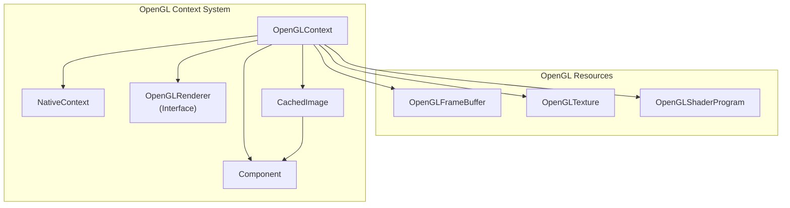
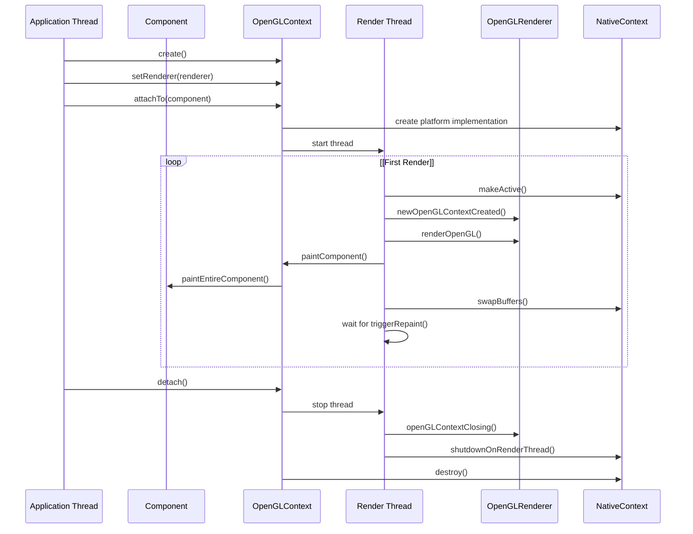
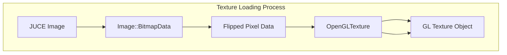
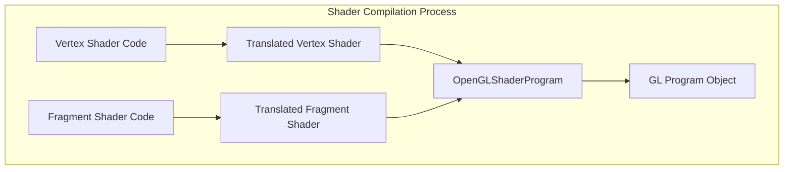
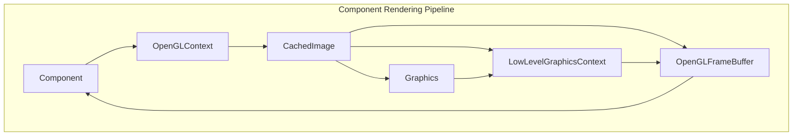
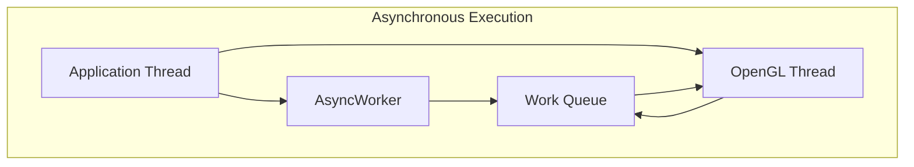
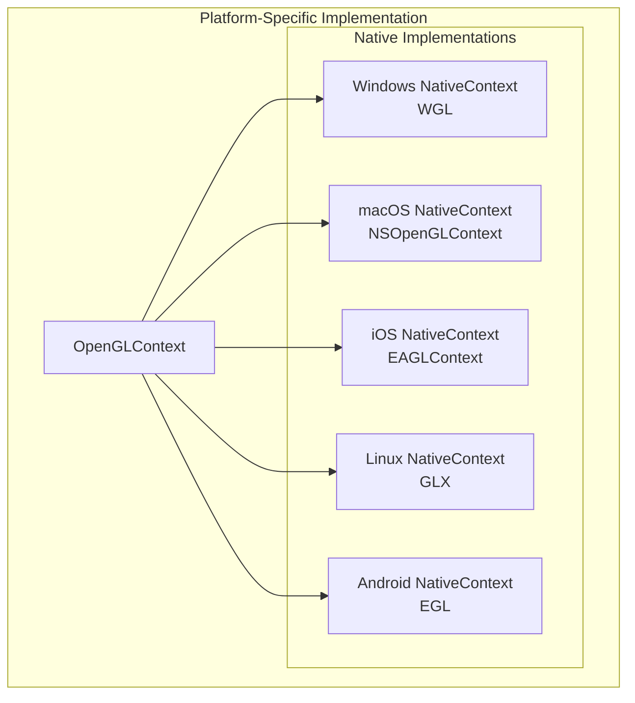

# OpenGL Integration

> **Relevant source files**
> * [modules/juce_opengl/juce_opengl.cpp](https://github.com/juce-framework/JUCE/blob/d6181bde/modules/juce_opengl/juce_opengl.cpp)
> * [modules/juce_opengl/native/java/app/com/rmsl/juce/JuceOpenGLView.java](https://github.com/juce-framework/JUCE/blob/d6181bde/modules/juce_opengl/native/java/app/com/rmsl/juce/JuceOpenGLView.java)
> * [modules/juce_opengl/native/juce_OpenGLExtensions.h](https://github.com/juce-framework/JUCE/blob/d6181bde/modules/juce_opengl/native/juce_OpenGLExtensions.h)
> * [modules/juce_opengl/native/juce_OpenGL_android.h](https://github.com/juce-framework/JUCE/blob/d6181bde/modules/juce_opengl/native/juce_OpenGL_android.h)
> * [modules/juce_opengl/native/juce_OpenGL_ios.h](https://github.com/juce-framework/JUCE/blob/d6181bde/modules/juce_opengl/native/juce_OpenGL_ios.h)
> * [modules/juce_opengl/native/juce_OpenGL_linux.h](https://github.com/juce-framework/JUCE/blob/d6181bde/modules/juce_opengl/native/juce_OpenGL_linux.h)
> * [modules/juce_opengl/opengl/juce_OpenGLContext.cpp](https://github.com/juce-framework/JUCE/blob/d6181bde/modules/juce_opengl/opengl/juce_OpenGLContext.cpp)
> * [modules/juce_opengl/opengl/juce_OpenGLContext.h](https://github.com/juce-framework/JUCE/blob/d6181bde/modules/juce_opengl/opengl/juce_OpenGLContext.h)
> * [modules/juce_opengl/opengl/juce_OpenGLFrameBuffer.cpp](https://github.com/juce-framework/JUCE/blob/d6181bde/modules/juce_opengl/opengl/juce_OpenGLFrameBuffer.cpp)
> * [modules/juce_opengl/opengl/juce_OpenGLFrameBuffer.h](https://github.com/juce-framework/JUCE/blob/d6181bde/modules/juce_opengl/opengl/juce_OpenGLFrameBuffer.h)
> * [modules/juce_opengl/opengl/juce_OpenGLGraphicsContext.cpp](https://github.com/juce-framework/JUCE/blob/d6181bde/modules/juce_opengl/opengl/juce_OpenGLGraphicsContext.cpp)
> * [modules/juce_opengl/opengl/juce_OpenGLGraphicsContext.h](https://github.com/juce-framework/JUCE/blob/d6181bde/modules/juce_opengl/opengl/juce_OpenGLGraphicsContext.h)
> * [modules/juce_opengl/opengl/juce_OpenGLHelpers.cpp](https://github.com/juce-framework/JUCE/blob/d6181bde/modules/juce_opengl/opengl/juce_OpenGLHelpers.cpp)
> * [modules/juce_opengl/opengl/juce_OpenGLHelpers.h](https://github.com/juce-framework/JUCE/blob/d6181bde/modules/juce_opengl/opengl/juce_OpenGLHelpers.h)
> * [modules/juce_opengl/opengl/juce_OpenGLShaderProgram.cpp](https://github.com/juce-framework/JUCE/blob/d6181bde/modules/juce_opengl/opengl/juce_OpenGLShaderProgram.cpp)
> * [modules/juce_opengl/opengl/juce_OpenGLShaderProgram.h](https://github.com/juce-framework/JUCE/blob/d6181bde/modules/juce_opengl/opengl/juce_OpenGLShaderProgram.h)
> * [modules/juce_opengl/opengl/juce_OpenGLTexture.cpp](https://github.com/juce-framework/JUCE/blob/d6181bde/modules/juce_opengl/opengl/juce_OpenGLTexture.cpp)
> * [modules/juce_opengl/opengl/juce_OpenGLTexture.h](https://github.com/juce-framework/JUCE/blob/d6181bde/modules/juce_opengl/opengl/juce_OpenGLTexture.h)

This document provides a comprehensive overview of the OpenGL integration capabilities within the JUCE framework. The OpenGL module allows you to integrate hardware-accelerated 3D graphics into JUCE applications using modern OpenGL. This page explains how to create and manage OpenGL contexts, implement custom rendering, and integrate OpenGL rendering with standard JUCE components.

For information about standard 2D graphics rendering without OpenGL, see the [Graphics Rendering](/juce-framework/JUCE/3.3-graphics-rendering) page.

## Core Concepts

OpenGL integration in JUCE centers around the `OpenGLContext` class, which manages the connection between a JUCE component and an OpenGL rendering context. This provides a platform-independent way to use OpenGL across different operating systems while maintaining compatibility with JUCE's component system.

## OpenGL Architecture Overview



Sources:

* [modules/juce_opengl/opengl/juce_OpenGLContext.h L41-L57](https://github.com/juce-framework/JUCE/blob/d6181bde/modules/juce_opengl/opengl/juce_OpenGLContext.h#L41-L57)
* [modules/juce_opengl/opengl/juce_OpenGLContext.h L58-L73](https://github.com/juce-framework/JUCE/blob/d6181bde/modules/juce_opengl/opengl/juce_OpenGLContext.h#L58-L73)
* [modules/juce_opengl/opengl/juce_OpenGLContext.cpp L104-L116](https://github.com/juce-framework/JUCE/blob/d6181bde/modules/juce_opengl/opengl/juce_OpenGLContext.cpp#L104-L116)
* [modules/juce_opengl/opengl/juce_OpenGLContext.cpp L359-L440](https://github.com/juce-framework/JUCE/blob/d6181bde/modules/juce_opengl/opengl/juce_OpenGLContext.cpp#L359-L440)

## OpenGLContext Class

The `OpenGLContext` class is the main entry point for OpenGL integration in JUCE. It handles:

1. Creation and management of an OpenGL rendering context
2. Connection to a JUCE component for display
3. Setting up a background thread for rendering
4. Managing OpenGL resource lifecycles
5. Handling platform-specific implementation details

### Creating and Attaching a Context

To use OpenGL in your application, you need to:

1. Create an instance of `OpenGLContext`
2. Optionally set a renderer using `setRenderer()`
3. Attach the context to a JUCE component using `attachTo()`

```python
// Example setup
OpenGLContext context;
context.setRenderer(this);  // Assuming your class implements OpenGLRenderer
context.attachTo(*myComponent);
```

When you attach a context to a component, JUCE creates a background thread that handles OpenGL rendering. The context creates a platform-specific implementation (through the `NativeContext` inner class) that manages the native OpenGL context and integration with the component's window.

The `attachTo()` method will wait until the component is fully visible before creating the native context. Once created, the rendering thread will be started and will call your `OpenGLRenderer` methods.

Sources:

* [modules/juce_opengl/opengl/juce_OpenGLContext.h L67-L86](https://github.com/juce-framework/JUCE/blob/d6181bde/modules/juce_opengl/opengl/juce_OpenGLContext.h#L67-L86)
* [modules/juce_opengl/opengl/juce_OpenGLContext.cpp L1078-L1095](https://github.com/juce-framework/JUCE/blob/d6181bde/modules/juce_opengl/opengl/juce_OpenGLContext.cpp#L1078-L1095)
* [modules/juce_opengl/opengl/juce_OpenGLContext.cpp L1083-L1118](https://github.com/juce-framework/JUCE/blob/d6181bde/modules/juce_opengl/opengl/juce_OpenGLContext.cpp#L1083-L1118)

### Context Configuration

Before attaching a context, you can configure various properties:

* **Pixel Format**: Set color depth, stencil buffer, etc. using `setPixelFormat()`
* **OpenGL Version**: Specify minimum OpenGL version with `setOpenGLVersionRequired()`
* **Shared Context**: Share OpenGL resources with another context via `setNativeSharedContext()`
* **Multisampling**: Enable antialiasing with `setMultisamplingEnabled()`
* **Component Rendering**: Enable/disable JUCE component rendering with `setComponentPaintingEnabled()`
* **Continuous Repaint**: Control whether the context continuously repaints with `setContinuousRepainting()`
* **Texture Magnification Filter**: Set the texture filtering mode with `setTextureMagnificationFilter()`
* **Image Cache Size**: Control memory usage for cached images with `setImageCacheSize()`

The OpenGL version can be specified using the `OpenGLVersion` enum:

```
// Request OpenGL 3.2 Core profile
context.setOpenGLVersionRequired(OpenGLContext::openGL3_2);
```

Sources:

* [modules/juce_opengl/opengl/juce_OpenGLContext.h L107-L191](https://github.com/juce-framework/JUCE/blob/d6181bde/modules/juce_opengl/opengl/juce_OpenGLContext.h#L107-L191)
* [modules/juce_opengl/opengl/juce_OpenGLContext.h L154-L166](https://github.com/juce-framework/JUCE/blob/d6181bde/modules/juce_opengl/opengl/juce_OpenGLContext.h#L154-L166)
* [modules/juce_opengl/opengl/juce_OpenGLContext.h L112-L123](https://github.com/juce-framework/JUCE/blob/d6181bde/modules/juce_opengl/opengl/juce_OpenGLContext.h#L112-L123)

## Rendering with OpenGL

### The OpenGLRenderer Interface

To perform custom OpenGL rendering, create a class that implements the `OpenGLRenderer` interface and register it with your context:

```python
class MyOpenGLRenderer : public OpenGLRenderer
{
public:
    void newOpenGLContextCreated() override
    {
        // Initialize shaders, textures, etc.
    }
    
    void renderOpenGL() override
    {
        // Perform OpenGL drawing here
    }
    
    void openGLContextClosing() override
    {
        // Clean up resources
    }
};
```

The renderer's methods are called on the OpenGL thread:

* `newOpenGLContextCreated()`: Called when the context is first created
* `renderOpenGL()`: Called for each frame that needs to be rendered
* `openGLContextClosing()`: Called before the context is destroyed

Sources:

* [modules/juce_opengl/opengl/juce_OpenGLContext.cpp L204-L206](https://github.com/juce-framework/JUCE/blob/d6181bde/modules/juce_opengl/opengl/juce_OpenGLContext.cpp#L204-L206)
* [modules/juce_opengl/opengl/juce_OpenGLContext.cpp L668-L671](https://github.com/juce-framework/JUCE/blob/d6181bde/modules/juce_opengl/opengl/juce_OpenGLContext.cpp#L668-L671)

### Rendering Architecture

## Rendering Lifecycle



Sources:

* [modules/juce_opengl/opengl/juce_OpenGLContext.cpp L329-L440](https://github.com/juce-framework/JUCE/blob/d6181bde/modules/juce_opengl/opengl/juce_OpenGLContext.cpp#L329-L440)
* [modules/juce_opengl/opengl/juce_OpenGLContext.cpp L745-L893](https://github.com/juce-framework/JUCE/blob/d6181bde/modules/juce_opengl/opengl/juce_OpenGLContext.cpp#L745-L893)
* [modules/juce_opengl/opengl/juce_OpenGLContext.cpp L169-L217](https://github.com/juce-framework/JUCE/blob/d6181bde/modules/juce_opengl/opengl/juce_OpenGLContext.cpp#L169-L217)

## Frame Buffers and Textures

### OpenGLFrameBuffer

The `OpenGLFrameBuffer` class allows you to render to an off-screen buffer instead of directly to the screen. This is useful for effects processing, multi-pass rendering, and other advanced techniques.

Key features:

* Create buffers with specific dimensions
* Load and save image data
* Use as render targets
* Read and write pixel data
* Save and reload buffer contents when context is lost

```
// Example usage
OpenGLFrameBuffer frameBuffer;
frameBuffer.initialise(openGLContext, 512, 512);

// Make the framebuffer the current render target
frameBuffer.makeCurrentRenderingTarget();

// Render to the framebuffer
// ...

// Release the framebuffer
frameBuffer.releaseAsRenderingTarget();
```

The framebuffer implementation handles platform-specific details and provides a consistent interface across all supported platforms. It manages the underlying OpenGL resources including texture objects and renderbuffer objects.

Sources:

* [modules/juce_opengl/opengl/juce_OpenGLFrameBuffer.h L39-L140](https://github.com/juce-framework/JUCE/blob/d6181bde/modules/juce_opengl/opengl/juce_OpenGLFrameBuffer.h#L39-L140)
* [modules/juce_opengl/opengl/juce_OpenGLFrameBuffer.cpp L38-L102](https://github.com/juce-framework/JUCE/blob/d6181bde/modules/juce_opengl/opengl/juce_OpenGLFrameBuffer.cpp#L38-L102)
* [modules/juce_opengl/opengl/juce_OpenGLFrameBuffer.cpp L209-L275](https://github.com/juce-framework/JUCE/blob/d6181bde/modules/juce_opengl/opengl/juce_OpenGLFrameBuffer.cpp#L209-L275)

### OpenGLTexture

The `OpenGLTexture` class manages textures in OpenGL:

* Load from JUCE Images
* Create from raw pixel data
* Bind/unbind for rendering
* Check for non-power-of-two texture support
* Handle texture filtering modes

```
// Example usage
OpenGLTexture texture;
texture.loadImage(myImage);

// Bind the texture for use
texture.bind();

// Use the texture in OpenGL calls
// ...

// Unbind when done
texture.unbind();
```

The texture class automatically handles non-power-of-two textures based on the capabilities of the current OpenGL context. It will use the appropriate texture filtering mode based on the context's configuration.



Sources:

* [modules/juce_opengl/opengl/juce_OpenGLTexture.h L39-L111](https://github.com/juce-framework/JUCE/blob/d6181bde/modules/juce_opengl/opengl/juce_OpenGLTexture.h#L39-L111)
* [modules/juce_opengl/opengl/juce_OpenGLTexture.cpp L38-L64](https://github.com/juce-framework/JUCE/blob/d6181bde/modules/juce_opengl/opengl/juce_OpenGLTexture.cpp#L38-L64)
* [modules/juce_opengl/opengl/juce_OpenGLTexture.cpp L138-L156](https://github.com/juce-framework/JUCE/blob/d6181bde/modules/juce_opengl/opengl/juce_OpenGLTexture.cpp#L138-L156)

## Shader Programming

The `OpenGLShaderProgram` class facilitates the use of GLSL shaders:

* Compile and link vertex and fragment shaders
* Set uniform values
* Handle shader attributes
* Manage shader program lifecycle
* Support for different GLSL versions

```
// Example shader use
OpenGLShaderProgram shader(openGLContext);
shader.addVertexShader(vertexShaderCode);
shader.addFragmentShader(fragmentShaderCode);
shader.link();

// Use the shader
shader.use();

// Set uniforms
shader.setUniform("resolution", (float)width, (float)height);
```

The `OpenGLHelpers` class provides utility functions for working with shaders, including conversion between different GLSL versions. It can automatically translate shader code to be compatible with the current OpenGL context version.



Sources:

* [modules/juce_opengl/opengl/juce_OpenGLShaderProgram.h L44-L194](https://github.com/juce-framework/JUCE/blob/d6181bde/modules/juce_opengl/opengl/juce_OpenGLShaderProgram.h#L44-L194)
* [modules/juce_opengl/opengl/juce_OpenGLShaderProgram.cpp L38-L108](https://github.com/juce-framework/JUCE/blob/d6181bde/modules/juce_opengl/opengl/juce_OpenGLShaderProgram.cpp#L38-L108)
* [modules/juce_opengl/opengl/juce_OpenGLHelpers.cpp L198-L253](https://github.com/juce-framework/JUCE/blob/d6181bde/modules/juce_opengl/opengl/juce_OpenGLHelpers.cpp#L198-L253)
* [modules/juce_opengl/opengl/juce_OpenGLHelpers.cpp L209-L241](https://github.com/juce-framework/JUCE/blob/d6181bde/modules/juce_opengl/opengl/juce_OpenGLHelpers.cpp#L209-L241)

## Integration with JUCE Components

The OpenGL context can be configured to render JUCE components, allowing you to combine standard JUCE UI elements with custom OpenGL rendering.

## Component Rendering Pipeline



When component painting is enabled (the default), JUCE:

1. Creates an `OpenGLFrameBuffer` for the component
2. Creates a specialized `LowLevelGraphicsContext` that renders into this buffer
3. Calls the component's `paint()` method with a `Graphics` object that uses this context
4. Renders the resulting texture to the screen using OpenGL

This approach enables hardware acceleration for standard JUCE components without modifying their code. The `CachedImage` class manages this process and handles the synchronization between the component thread and the OpenGL rendering thread.

Sources:

* [modules/juce_opengl/opengl/juce_OpenGLContext.cpp L512-L602](https://github.com/juce-framework/JUCE/blob/d6181bde/modules/juce_opengl/opengl/juce_OpenGLContext.cpp#L512-L602)
* [modules/juce_opengl/opengl/juce_OpenGLGraphicsContext.cpp L53-L218](https://github.com/juce-framework/JUCE/blob/d6181bde/modules/juce_opengl/opengl/juce_OpenGLGraphicsContext.cpp#L53-L218)
* [modules/juce_opengl/opengl/juce_OpenGLContext.cpp L567-L602](https://github.com/juce-framework/JUCE/blob/d6181bde/modules/juce_opengl/opengl/juce_OpenGLContext.cpp#L567-L602)

## Advanced Features

### Custom Shaders for JUCE Graphics

The `OpenGLGraphicsContextCustomShader` class enables the use of custom fragment shaders for 2D rendering operations:

```
// Example custom shader
OpenGLGraphicsContextCustomShader shader(
    "varying vec2 pixelPos;"
    "varying vec4 frontColour;"
    "void main()"
    "{"
    "   float distance = length(pixelPos - vec2(0.5, 0.5));"
    "   gl_FragColor = frontColour * vec4(1.0 - distance * 2.0, 0.0, 0.0, 1.0);"
    "}"
);

// Use in paint method
g.fillRect(area, shader);
```

This allows for complex effects like blurs, distortions, and color transformations that would be inefficient to compute on the CPU. The shader has access to:

* `pixelPos`: The position of the current pixel in the component's coordinate space
* `frontColour`: The color that would normally be used for rendering
* `pixelAlpha`: The alpha value for the current pixel (for anti-aliasing)

You can also set up custom uniforms and textures by using the `onShaderActivated` callback:

```markdown
shader.onShaderActivated = [](OpenGLShaderProgram& program) {
    // Set up uniforms, bind textures, etc.
    program.setUniform("time", (float)Time::getMillisecondCounter() / 1000.0f);
};
```

Sources:

* [modules/juce_opengl/opengl/juce_OpenGLGraphicsContext.h L53-L103](https://github.com/juce-framework/JUCE/blob/d6181bde/modules/juce_opengl/opengl/juce_OpenGLGraphicsContext.h#L53-L103)
* [modules/juce_opengl/opengl/juce_OpenGLGraphicsContext.cpp L512-L565](https://github.com/juce-framework/JUCE/blob/d6181bde/modules/juce_opengl/opengl/juce_OpenGLGraphicsContext.cpp#L512-L565)

### Asynchronous Operations

The `executeOnGLThread()` method allows you to perform operations on the OpenGL thread:

```markdown
openGLContext.executeOnGLThread([](OpenGLContext& context) {
    // Perform OpenGL operations here
    // This will run on the OpenGL thread with a valid context
}, true); // Block until complete
```

This is useful for operations like texture uploads, frame buffer creation, and other tasks that require a valid OpenGL context. The method takes a template parameter that can be any callable object (function, lambda, functor) that takes an `OpenGLContext&` parameter.

The second parameter determines whether the call should block until the operation is complete. If set to `true`, the calling thread will wait until the operation finishes. If `false`, the operation will be queued and executed asynchronously.



Sources:

* [modules/juce_opengl/opengl/juce_OpenGLContext.h L263-L281](https://github.com/juce-framework/JUCE/blob/d6181bde/modules/juce_opengl/opengl/juce_OpenGLContext.h#L263-L281)
* [modules/juce_opengl/opengl/juce_OpenGLContext.h L373-L389](https://github.com/juce-framework/JUCE/blob/d6181bde/modules/juce_opengl/opengl/juce_OpenGLContext.h#L373-L389)
* [modules/juce_opengl/opengl/juce_OpenGLContext.cpp L675-L738](https://github.com/juce-framework/JUCE/blob/d6181bde/modules/juce_opengl/opengl/juce_OpenGLContext.cpp#L675-L738)

## Platform-Specific Implementation

JUCE abstracts platform differences through the `NativeContext` class, which has specialized implementations for each supported platform:

* **Windows**: Uses WGL for context creation and window integration
* **macOS**: Uses Core Animation layers and NSOpenGLContext
* **iOS**: Uses CAEAGLLayer and EAGLContext
* **Linux**: Uses GLX for context creation and X11 window integration
* **Android**: Uses EGL with SurfaceView

Each implementation handles:

* Native context creation
* Framebuffer setup
* Buffer swapping
* Event handling
* Window integration
* Multi-sampling support
* OpenGL version selection



The platform-specific implementations are created when the context is attached to a component and handle all the low-level details of interacting with the native OpenGL APIs. They provide a consistent interface to the `OpenGLContext` class, which shields the rest of the code from platform differences.

Sources:

* [modules/juce_opengl/native/juce_OpenGL_ios.h L35-L319](https://github.com/juce-framework/JUCE/blob/d6181bde/modules/juce_opengl/native/juce_OpenGL_ios.h#L35-L319)
* [modules/juce_opengl/native/juce_OpenGL_linux.h L85-L183](https://github.com/juce-framework/JUCE/blob/d6181bde/modules/juce_opengl/native/juce_OpenGL_linux.h#L85-L183)
* [modules/juce_opengl/native/juce_OpenGL_android.h L115-L183](https://github.com/juce-framework/JUCE/blob/d6181bde/modules/juce_opengl/native/juce_OpenGL_android.h#L115-L183)
* [modules/juce_opengl/juce_opengl.cpp L264-L293](https://github.com/juce-framework/JUCE/blob/d6181bde/modules/juce_opengl/juce_opengl.cpp#L264-L293)

## Best Practices

## Best Practices

### Resource Management

* Create and destroy OpenGL resources on the OpenGL thread
* Use `executeOnGLThread()` for asynchronous resource management
* Clean up resources in the `openGLContextClosing()` method
* Check for shader compilation and linking errors
* Use the `setAssociatedObject()` method to store objects that should be deleted when the context is destroyed

### Performance Optimization

* Minimize context switches and state changes
* Use vertex buffer objects for frequently rendered geometry
* Leverage frame buffers for multi-pass rendering
* Consider disabling component painting for pure OpenGL applications
* Use `setContinuousRepainting(false)` and manually call `triggerRepaint()` when needed
* Control the swap interval to match your application's frame rate requirements

### Cross-Platform Compatibility

* Check shader compatibility across platforms
* Use `isTextureNpotSupported()` to determine texture size limitations
* Test on all target platforms, as OpenGL implementations vary
* Use `OpenGLHelpers::translateVertexShaderToV3()` and `translateFragmentShaderToV3()` for shader compatibility
* Be aware of the different OpenGL versions available on each platform


Sources:

* [modules/juce_opengl/opengl/juce_OpenGLContext.h L140-L166](https://github.com/juce-framework/JUCE/blob/d6181bde/modules/juce_opengl/opengl/juce_OpenGLContext.h#L140-L166)
* [modules/juce_opengl/opengl/juce_OpenGLContext.h L197-L214](https://github.com/juce-framework/JUCE/blob/d6181bde/modules/juce_opengl/opengl/juce_OpenGLContext.h#L197-L214)
* [modules/juce_opengl/opengl/juce_OpenGLTexture.cpp L81-L108](https://github.com/juce-framework/JUCE/blob/d6181bde/modules/juce_opengl/opengl/juce_OpenGLTexture.cpp#L81-L108)
* [modules/juce_opengl/opengl/juce_OpenGLHelpers.cpp L209-L253](https://github.com/juce-framework/JUCE/blob/d6181bde/modules/juce_opengl/opengl/juce_OpenGLHelpers.cpp#L209-L253)

## Example: Basic OpenGL Rendering

Here's a simple example of a component with OpenGL rendering:

```javascript
class OpenGLDemo : public Component, private OpenGLRenderer
{
public:
    OpenGLDemo()
    {
        // Set up the OpenGL context
        openGLContext.setRenderer(this);
        openGLContext.setComponentPaintingEnabled(false); // For pure OpenGL rendering
        openGLContext.setContinuousRepainting(true);      // Render continuously
        openGLContext.attachTo(*this);
    }
    
    ~OpenGLDemo()
    {
        // Clean up
        openGLContext.detach();
    }
    
private:
    void newOpenGLContextCreated() override
    {
        // Set up OpenGL resources
        // This is called on the OpenGL thread when the context is created
    }
    
    void renderOpenGL() override
    {
        // Clear the background
        OpenGLHelpers::clear(Colours::black);
        
        // Get the current rendering scale (for high DPI displays)
        const float scale = (float) openGLContext.getRenderingScale();
        
        // Draw with OpenGL
        glBegin(GL_TRIANGLES);
        glColor3f(1.0f, 0.0f, 0.0f); glVertex2f(0.0f, 0.5f * scale);
        glColor3f(0.0f, 1.0f, 0.0f); glVertex2f(-0.5f * scale, -0.5f * scale);
        glColor3f(0.0f, 0.0f, 1.0f); glVertex2f(0.5f * scale, -0.5f * scale);
        glEnd();
    }
    
    void openGLContextClosing() override
    {
        // Clean up OpenGL resources
        // This is called on the OpenGL thread before the context is destroyed
    }
    
    // The OpenGL context
    OpenGLContext openGLContext;
};
```

This example demonstrates a basic OpenGL rendering setup. For more advanced usage, you would typically use modern OpenGL with shaders, vertex buffers, and other features instead of the deprecated immediate mode shown here.

Sources:

* [modules/juce_opengl/opengl/juce_OpenGLHelpers.cpp L181-L187](https://github.com/juce-framework/JUCE/blob/d6181bde/modules/juce_opengl/opengl/juce_OpenGLHelpers.cpp#L181-L187)
* [modules/juce_opengl/opengl/juce_OpenGLContext.h L290-L293](https://github.com/juce-framework/JUCE/blob/d6181bde/modules/juce_opengl/opengl/juce_OpenGLContext.h#L290-L293)

## Conclusion

JUCE's OpenGL integration provides a powerful way to incorporate hardware-accelerated graphics into your applications while maintaining compatibility with JUCE's component system. By leveraging the `OpenGLContext` and associated classes, you can create sophisticated rendering effects, improved performance, and cross-platform compatibility.

The system handles the complexities of platform-specific OpenGL implementations, threading, and component integration, allowing you to focus on your rendering code.