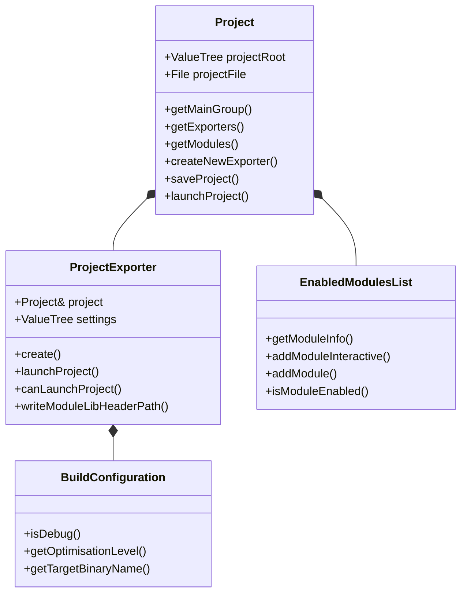
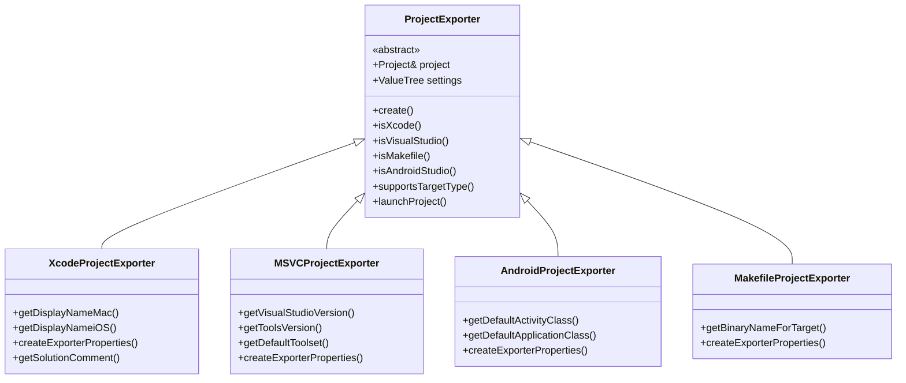
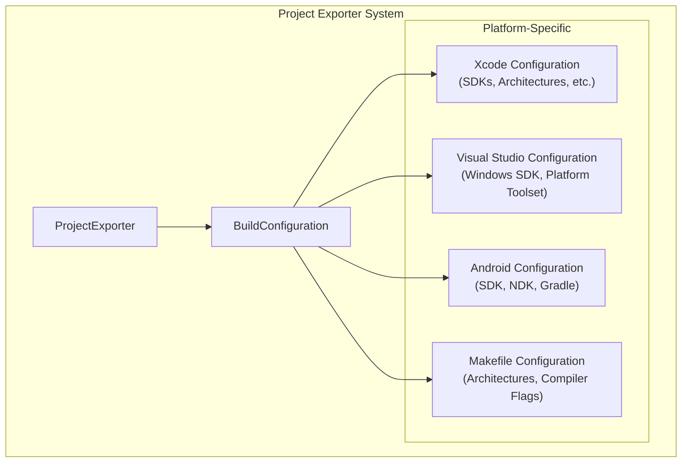
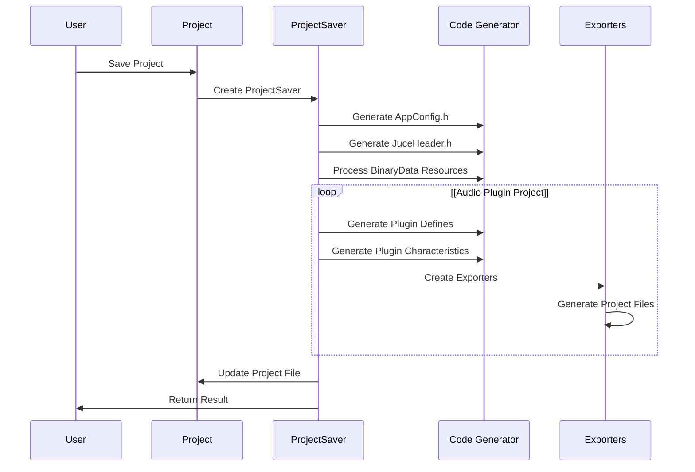
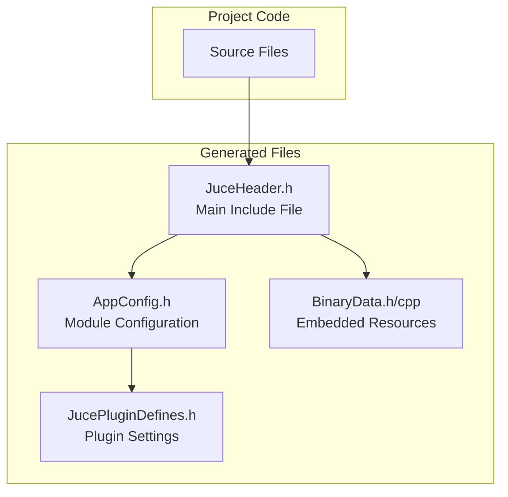
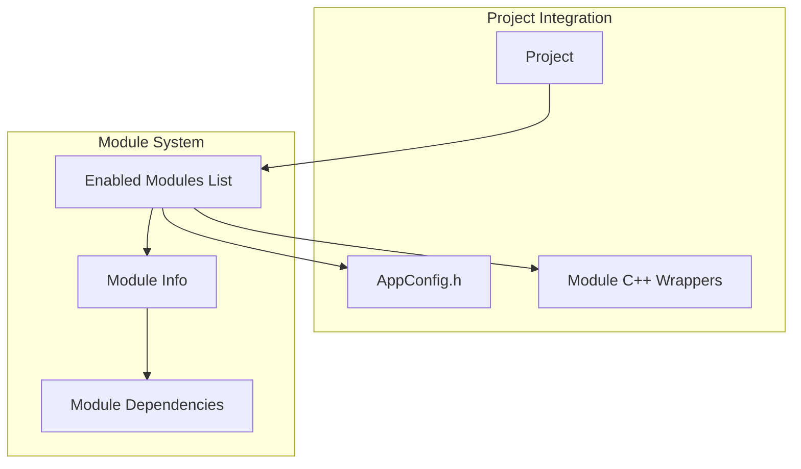
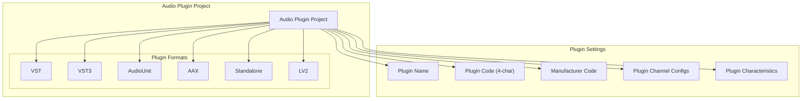
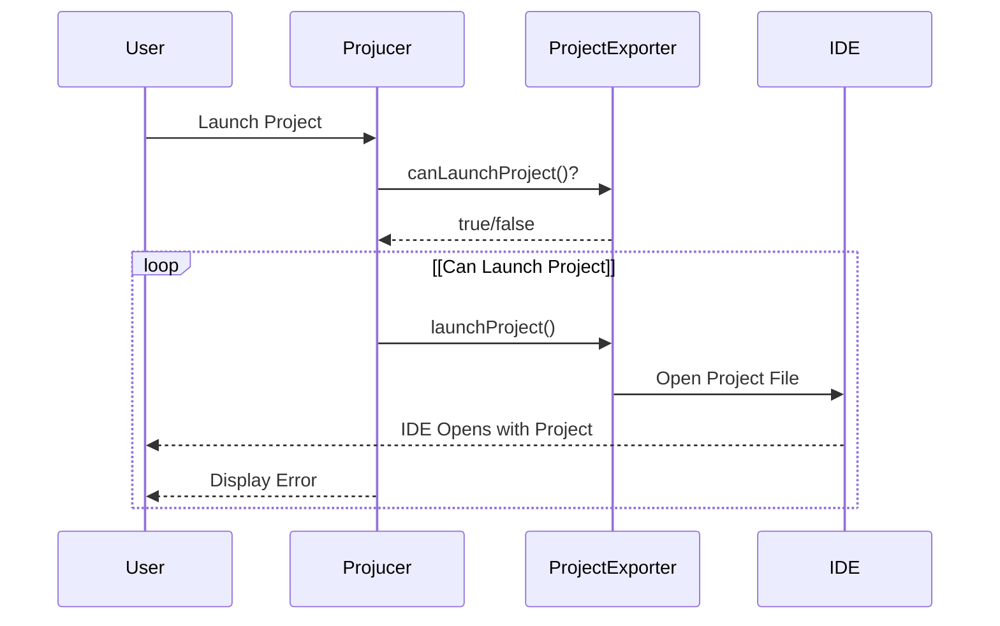

# Projucer

> **Relevant source files**
> * [extras/Projucer/Source/Project/jucer_Project.cpp](https://github.com/juce-framework/JUCE/blob/10a58961/extras/Projucer/Source/Project/jucer_Project.cpp)
> * [extras/Projucer/Source/Project/jucer_Project.h](https://github.com/juce-framework/JUCE/blob/10a58961/extras/Projucer/Source/Project/jucer_Project.h)
> * [extras/Projucer/Source/ProjectSaving/jucer_ProjectExport_Android.h](https://github.com/juce-framework/JUCE/blob/10a58961/extras/Projucer/Source/ProjectSaving/jucer_ProjectExport_Android.h)
> * [extras/Projucer/Source/ProjectSaving/jucer_ProjectExport_MSVC.h](https://github.com/juce-framework/JUCE/blob/10a58961/extras/Projucer/Source/ProjectSaving/jucer_ProjectExport_MSVC.h)
> * [extras/Projucer/Source/ProjectSaving/jucer_ProjectExport_Make.h](https://github.com/juce-framework/JUCE/blob/10a58961/extras/Projucer/Source/ProjectSaving/jucer_ProjectExport_Make.h)
> * [extras/Projucer/Source/ProjectSaving/jucer_ProjectExport_Xcode.h](https://github.com/juce-framework/JUCE/blob/10a58961/extras/Projucer/Source/ProjectSaving/jucer_ProjectExport_Xcode.h)
> * [extras/Projucer/Source/ProjectSaving/jucer_ProjectExporter.cpp](https://github.com/juce-framework/JUCE/blob/10a58961/extras/Projucer/Source/ProjectSaving/jucer_ProjectExporter.cpp)
> * [extras/Projucer/Source/ProjectSaving/jucer_ProjectExporter.h](https://github.com/juce-framework/JUCE/blob/10a58961/extras/Projucer/Source/ProjectSaving/jucer_ProjectExporter.h)
> * [extras/Projucer/Source/ProjectSaving/jucer_ProjectSaver.cpp](https://github.com/juce-framework/JUCE/blob/10a58961/extras/Projucer/Source/ProjectSaving/jucer_ProjectSaver.cpp)
> * [extras/Projucer/Source/ProjectSaving/jucer_ProjectSaver.h](https://github.com/juce-framework/JUCE/blob/10a58961/extras/Projucer/Source/ProjectSaving/jucer_ProjectSaver.h)
> * [extras/Projucer/Source/Utility/Helpers/jucer_PresetIDs.h](https://github.com/juce-framework/JUCE/blob/10a58961/extras/Projucer/Source/Utility/Helpers/jucer_PresetIDs.h)

The Projucer is JUCE's project management application that allows developers to create, configure, and export JUCE projects for various platforms and IDEs. It serves as the central hub for managing audio applications, plugins, and other software built with the JUCE framework. This document details the architecture, functionality, and usage of the Projucer within the JUCE ecosystem. For information about the CMake build system, see [CMake Build System](/juce-framework/JUCE/5.2-cmake-build-system).

## Overview

The Projucer provides a GUI-based approach to manage cross-platform C++ projects. It enables developers to:

1. Create new JUCE projects from templates
2. Configure project settings, modules, and dependencies
3. Manage source files and resources
4. Export projects to various platforms (Windows, macOS, iOS, Linux, Android)
5. Generate build files for different IDEs (Visual Studio, Xcode, Android Studio, Makefiles)
6. Launch integrated development environments with the configured project

```mermaid
flowchart TD

ProjectManager["Project Manager"]
ProjectCreation["Project Creation"]
ProjectEditing["Project Editing"]
ModuleManagement["Module Management"]
CodeGeneration["Code Generation"]
ProjectExporting["Project Exporting"]
VSExporter["Visual Studio Exporter"]
XcodeExporter["Xcode Exporter"]
AndroidExporter["Android Studio Exporter"]
MakefileExporter["Makefile Exporter"]
AppConfig["AppConfig.h"]
JuceHeader["JuceHeader.h"]
BinaryResources["Binary Resource Files"]
PluginDefines["Plugin Defines"]
ModuleDependencies["Module Dependencies"]
ModulePaths["Module Paths"]
ModuleOptions["Module Options"]

ProjectExporting --> VSExporter
ProjectExporting --> XcodeExporter
ProjectExporting --> AndroidExporter
ProjectExporting --> MakefileExporter
CodeGeneration --> AppConfig
CodeGeneration --> JuceHeader
CodeGeneration --> BinaryResources
CodeGeneration --> PluginDefines
ModuleManagement --> ModuleDependencies
ModuleManagement --> ModulePaths
ModuleManagement --> ModuleOptions

subgraph subGraph0 ["Projucer Application"]
    ProjectManager
    ProjectCreation
    ProjectEditing
    ModuleManagement
    CodeGeneration
    ProjectExporting
    ProjectManager --> ProjectCreation
    ProjectManager --> ProjectEditing
    ProjectManager --> ModuleManagement
    ProjectManager --> CodeGeneration
    ProjectManager --> ProjectExporting
end
```

Sources: [extras/Projucer/Source/Project/jucer_Project.h L193-L738](https://github.com/juce-framework/JUCE/blob/10a58961/extras/Projucer/Source/Project/jucer_Project.h#L193-L738)

 [extras/Projucer/Source/ProjectSaving/jucer_ProjectExporter.h L95-L149](https://github.com/juce-framework/JUCE/blob/10a58961/extras/Projucer/Source/ProjectSaving/jucer_ProjectExporter.h#L95-L149)

## Project Model

The Projucer's core is built around the `Project` class, which represents a JUCE project with all its settings, files, modules, and exporters. This class is defined in `jucer_Project.h` and implemented in `jucer_Project.cpp`.

### Project Structure

A JUCE project consists of several key components:

1. **Project Settings**: Basic properties like name, version, company info, C++ standard
2. **Modules**: JUCE modules required by the project
3. **File Groups**: Source files, resources, and other project files
4. **Exporters**: Configurations for different target platforms and IDEs

Sources: [extras/Projucer/Source/Project/jucer_Project.h L193-L738](https://github.com/juce-framework/JUCE/blob/10a58961/extras/Projucer/Source/Project/jucer_Project.h#L193-L738)

 [extras/Projucer/Source/Project/jucer_Project.cpp L127-L191](https://github.com/juce-framework/JUCE/blob/10a58961/extras/Projucer/Source/Project/jucer_Project.cpp#L127-L191)

### Project Settings

Projects contain numerous settings that control various aspects of the build process, modules, code generation, and more. These are stored in the `ValueTree` structure and accessed using property references.

Key project settings include:

| Setting | Description | Default Value |
| --- | --- | --- |
| projectName | Name of the project | "JUCE Project" |
| version | Project version | "1.0.0" |
| companyName | Company/author name | (empty) |
| companyCopyright | Copyright notice | (empty) |
| companyWebsite | Company website | (based on project name) |
| cppStandard | C++ standard to use | "17" |
| projectType | Type of project | "GUI Application" |
| bundleIdentifier | Bundle ID for macOS/iOS apps | (based on project name) |
| modulesPaths | Paths to JUCE modules | (JUCE path) |

Sources: [extras/Projucer/Source/Project/jucer_Project.cpp L300-L342](https://github.com/juce-framework/JUCE/blob/10a58961/extras/Projucer/Source/Project/jucer_Project.cpp#L300-L342)

 [extras/Projucer/Source/Utility/Helpers/jucer_PresetIDs.h L39-L410](https://github.com/juce-framework/JUCE/blob/10a58961/extras/Projucer/Source/Utility/Helpers/jucer_PresetIDs.h#L39-L410)

## Exporters System

The Projucer's exporting system is one of its core features, allowing a project to be exported to multiple target platforms and IDEs. Each exporter handles the generation of platform-specific project files.

### Available Exporters

The Projucer supports the following exporters:

1. **Visual Studio** (Windows): For Visual Studio 2019 and 2022
2. **Xcode** (macOS/iOS): For macOS and iOS development
3. **Android Studio** (Android): For Android development
4. **Makefile** (Linux): For Linux development using makefiles

Each exporter is implemented as a subclass of the `ProjectExporter` base class.

Sources: [extras/Projucer/Source/ProjectSaving/jucer_ProjectExporter.cpp L168-L167](https://github.com/juce-framework/JUCE/blob/10a58961/extras/Projucer/Source/ProjectSaving/jucer_ProjectExporter.cpp#L168-L167)

 [extras/Projucer/Source/ProjectSaving/jucer_ProjectExport_Xcode.h L172-L456](https://github.com/juce-framework/JUCE/blob/10a58961/extras/Projucer/Source/ProjectSaving/jucer_ProjectExport_Xcode.h#L172-L456)

 [extras/Projucer/Source/ProjectSaving/jucer_ProjectExport_MSVC.h L311-L446](https://github.com/juce-framework/JUCE/blob/10a58961/extras/Projucer/Source/ProjectSaving/jucer_ProjectExport_MSVC.h#L311-L446)

 [extras/Projucer/Source/ProjectSaving/jucer_ProjectExport_Android.h L39-L97](https://github.com/juce-framework/JUCE/blob/10a58961/extras/Projucer/Source/ProjectSaving/jucer_ProjectExport_Android.h#L39-L97)

 [extras/Projucer/Source/ProjectSaving/jucer_ProjectExport_Make.h L39-L127](https://github.com/juce-framework/JUCE/blob/10a58961/extras/Projucer/Source/ProjectSaving/jucer_ProjectExport_Make.h#L39-L127)

### Exporter Configuration

Each exporter has its own set of configurations, typically including at least Debug and Release builds. Exporters also handle platform-specific settings like architectures, SDK versions, compiler flags, and more.

Sources: [extras/Projucer/Source/ProjectSaving/jucer_ProjectExporter.h L302-L449](https://github.com/juce-framework/JUCE/blob/10a58961/extras/Projucer/Source/ProjectSaving/jucer_ProjectExporter.h#L302-L449)

 [extras/Projucer/Source/ProjectSaving/jucer_ProjectExport_Xcode.h L186-L267](https://github.com/juce-framework/JUCE/blob/10a58961/extras/Projucer/Source/ProjectSaving/jucer_ProjectExport_Xcode.h#L186-L267)

 [extras/Projucer/Source/ProjectSaving/jucer_ProjectExport_MSVC.h L461-L507](https://github.com/juce-framework/JUCE/blob/10a58961/extras/Projucer/Source/ProjectSaving/jucer_ProjectExport_MSVC.h#L461-L507)

 [extras/Projucer/Source/ProjectSaving/jucer_ProjectExport_Android.h L288-L362](https://github.com/juce-framework/JUCE/blob/10a58961/extras/Projucer/Source/ProjectSaving/jucer_ProjectExport_Android.h#L288-L362)

## Project Saving and Code Generation

When a project is saved, the Projucer uses the `ProjectSaver` class to generate necessary code files and export the project to the configured platforms.

### ProjectSaver Flow

Sources: [extras/Projucer/Source/ProjectSaving/jucer_ProjectSaver.h L43-L149](https://github.com/juce-framework/JUCE/blob/10a58961/extras/Projucer/Source/ProjectSaving/jucer_ProjectSaver.h#L43-L149)

 [extras/Projucer/Source/ProjectSaving/jucer_ProjectSaver.cpp L44-L59](https://github.com/juce-framework/JUCE/blob/10a58961/extras/Projucer/Source/ProjectSaving/jucer_ProjectSaver.cpp#L44-L59)

 [extras/Projucer/Source/ProjectSaving/jucer_ProjectSaver.cpp L290-L327](https://github.com/juce-framework/JUCE/blob/10a58961/extras/Projucer/Source/ProjectSaving/jucer_ProjectSaver.cpp#L290-L327)

### Generated Files

The ProjectSaver generates several key files that are essential for JUCE projects:

1. **AppConfig.h**: Contains configuration options for JUCE modules
2. **JuceHeader.h**: Central header file that includes all required JUCE modules
3. **BinaryData.h/cpp**: C++ code for embedded binary resources
4. **Plugin-specific files**: For audio plugin projects (VST, AU, AAX, etc.)

Sources: [extras/Projucer/Source/ProjectSaving/jucer_ProjectSaver.cpp L229-L367](https://github.com/juce-framework/JUCE/blob/10a58961/extras/Projucer/Source/ProjectSaving/jucer_ProjectSaver.cpp#L229-L367)

 [extras/Projucer/Source/ProjectSaving/jucer_ProjectSaver.cpp L385-L553](https://github.com/juce-framework/JUCE/blob/10a58961/extras/Projucer/Source/ProjectSaving/jucer_ProjectSaver.cpp#L385-L553)

## Module Management

The Projucer handles JUCE modules, which are collections of C++ code that provide specific functionality. Projects can enable/disable modules and configure their settings.

### Module System

Sources: [extras/Projucer/Source/Project/jucer_Project.cpp L138-L168](https://github.com/juce-framework/JUCE/blob/10a58961/extras/Projucer/Source/Project/jucer_Project.cpp#L138-L168)

 [extras/Projucer/Source/ProjectSaving/jucer_ProjectSaver.cpp L258-L287](https://github.com/juce-framework/JUCE/blob/10a58961/extras/Projucer/Source/ProjectSaving/jucer_ProjectSaver.cpp#L258-L287)

## Audio Plugin Support

The Projucer provides specialized support for developing audio plugins, including VST, VST3, AU, AAX, and standalone applications.

### Plugin Types and Formats

Sources: [extras/Projucer/Source/Project/jucer_Project.cpp L344-L385](https://github.com/juce-framework/JUCE/blob/10a58961/extras/Projucer/Source/Project/jucer_Project.cpp#L344-L385)

 [extras/Projucer/Source/Project/jucer_Project.cpp L490-L549](https://github.com/juce-framework/JUCE/blob/10a58961/extras/Projucer/Source/Project/jucer_Project.cpp#L490-L549)

## Building and Running Projects

After configuring a project, the Projucer allows launching the project in the appropriate IDE for further development and building.

### Launch Process

Sources: [extras/Projucer/Source/Project/jucer_Project.cpp L808-L824](https://github.com/juce-framework/JUCE/blob/10a58961/extras/Projucer/Source/Project/jucer_Project.cpp#L808-L824)

 [extras/Projucer/Source/ProjectSaving/jucer_ProjectExporter.cpp L169-L191](https://github.com/juce-framework/JUCE/blob/10a58961/extras/Projucer/Source/ProjectSaving/jucer_ProjectExporter.cpp#L169-L191)

 [extras/Projucer/Source/ProjectSaving/jucer_ProjectExport_Xcode.h L189-L269](https://github.com/juce-framework/JUCE/blob/10a58961/extras/Projucer/Source/ProjectSaving/jucer_ProjectExport_Xcode.h#L189-L269)

 [extras/Projucer/Source/ProjectSaving/jucer_ProjectExport_Android.h L189-L207](https://github.com/juce-framework/JUCE/blob/10a58961/extras/Projucer/Source/ProjectSaving/jucer_ProjectExport_Android.h#L189-L207)

## Platform-Specific Configuration

Each platform supported by the Projucer has unique settings that can be configured.

### macOS/iOS (Xcode)

The Xcode exporter provides options for:

* macOS/iOS deployment targets
* Code signing identities
* App sandbox settings
* Framework dependencies
* Bundle identifiers
* Permission settings
* Screen orientations (iOS)
* Device family (iOS)

Sources: [extras/Projucer/Source/ProjectSaving/jucer_ProjectExport_Xcode.h L456-L573](https://github.com/juce-framework/JUCE/blob/10a58961/extras/Projucer/Source/ProjectSaving/jucer_ProjectExport_Xcode.h#L456-L573)

 [extras/Projucer/Source/ProjectSaving/jucer_ProjectExport_Xcode.h L486-L519](https://github.com/juce-framework/JUCE/blob/10a58961/extras/Projucer/Source/ProjectSaving/jucer_ProjectExport_Xcode.h#L486-L519)

### Windows (Visual Studio)

The Visual Studio exporter provides options for:

* Windows SDK versions
* Platform toolsets
* Architecture support (Win32, x64, ARM64)
* Manifest files
* Static/dynamic runtime libraries
* Debug information format
* Incremental linking

Sources: [extras/Projucer/Source/ProjectSaving/jucer_ProjectExport_MSVC.h L341-L356](https://github.com/juce-framework/JUCE/blob/10a58961/extras/Projucer/Source/ProjectSaving/jucer_ProjectExport_MSVC.h#L341-L356)

 [extras/Projucer/Source/ProjectSaving/jucer_ProjectExport_MSVC.h L614-L670](https://github.com/juce-framework/JUCE/blob/10a58961/extras/Projucer/Source/ProjectSaving/jucer_ProjectExport_MSVC.h#L614-L670)

### Linux (Makefile)

The Makefile exporter provides options for:

* Architecture settings
* Compiler flags
* Plugin binary locations
* Package dependencies

Sources: [extras/Projucer/Source/ProjectSaving/jucer_ProjectExport_Make.h L59-L96](https://github.com/juce-framework/JUCE/blob/10a58961/extras/Projucer/Source/ProjectSaving/jucer_ProjectExport_Make.h#L59-L96)

### Android (Android Studio)

The Android exporter provides options for:

* SDK/NDK settings
* Gradle version
* Minimum/target SDK versions
* Permissions
* Screen orientation
* Java libraries and resources
* Package signing

Sources: [extras/Projucer/Source/ProjectSaving/jucer_ProjectExport_Android.h L171-L186](https://github.com/juce-framework/JUCE/blob/10a58961/extras/Projucer/Source/ProjectSaving/jucer_ProjectExport_Android.h#L171-L186)

 [extras/Projucer/Source/ProjectSaving/jucer_ProjectExport_Android.h L311-L341](https://github.com/juce-framework/JUCE/blob/10a58961/extras/Projucer/Source/ProjectSaving/jucer_ProjectExport_Android.h#L311-L341)

## Conclusion

The Projucer is a powerful project management tool that serves as a central component in the JUCE ecosystem. It abstracts away many of the complexities of cross-platform development by providing a unified interface for configuring projects, managing modules, and exporting to various platforms and IDEs. By handling code generation and project file creation, it allows developers to focus on their application logic rather than platform-specific build configurations.