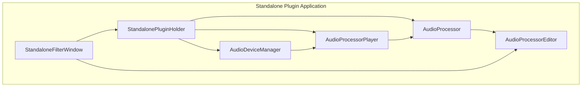
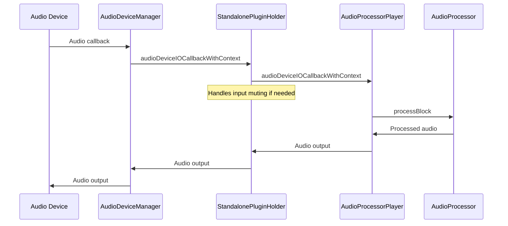
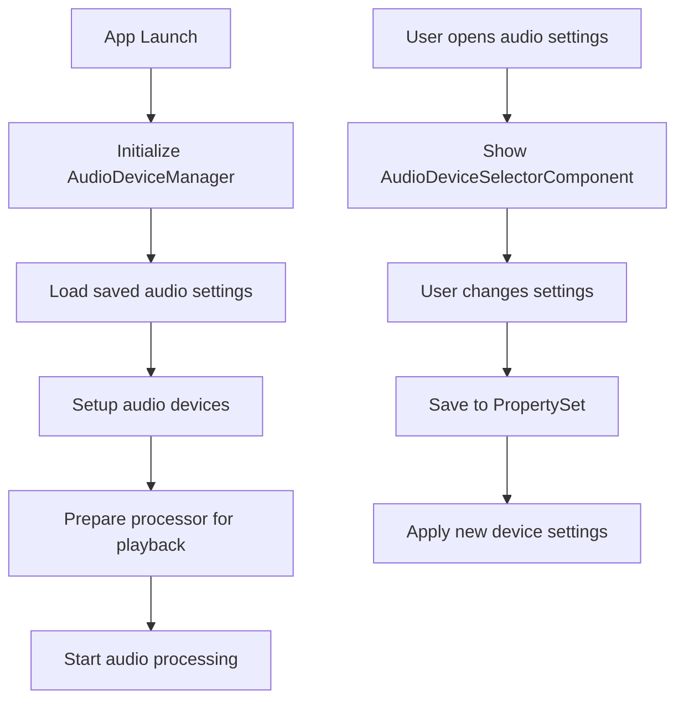
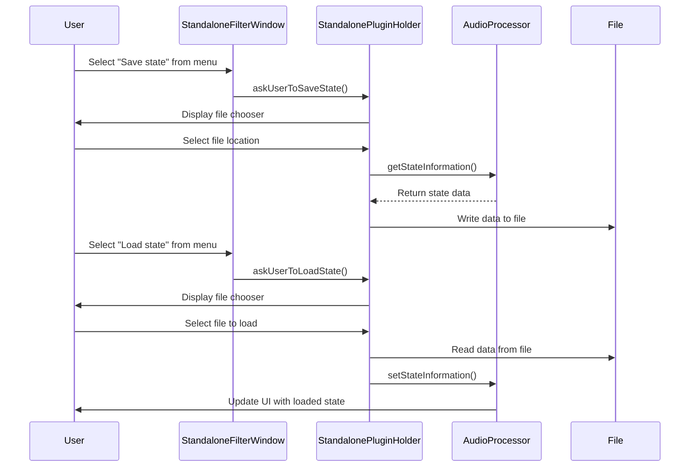
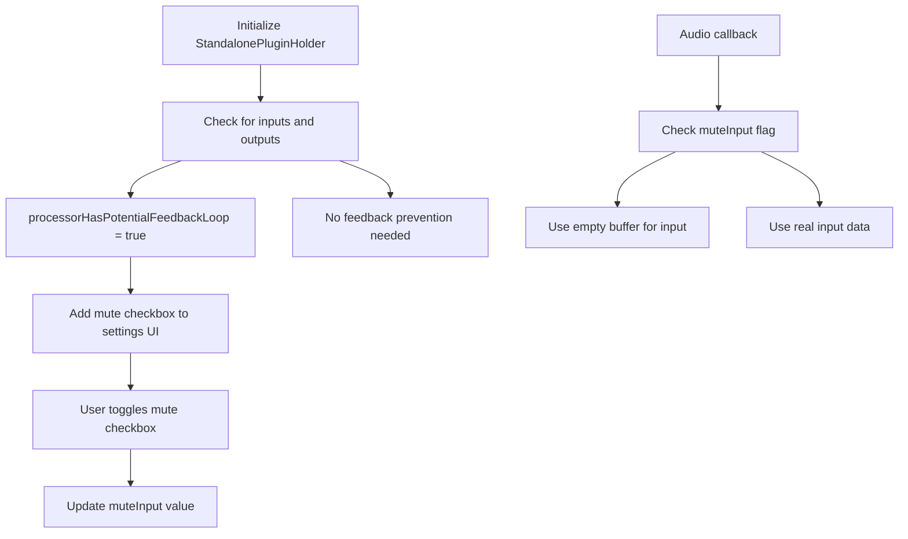
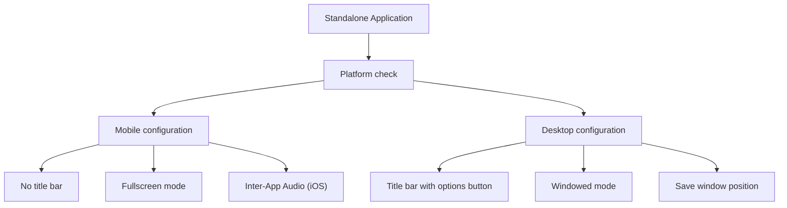
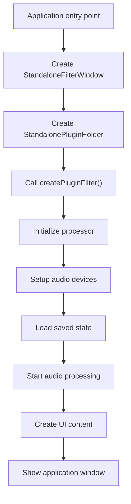

# Standalone Plugin Applications

> **Relevant source files**
> * [examples/Assets/AudioLiveScrollingDisplay.h](https://github.com/juce-framework/JUCE/blob/10a58961/examples/Assets/AudioLiveScrollingDisplay.h)
> * [modules/juce_audio_devices/sources/juce_AudioSourcePlayer.cpp](https://github.com/juce-framework/JUCE/blob/10a58961/modules/juce_audio_devices/sources/juce_AudioSourcePlayer.cpp)
> * [modules/juce_audio_devices/sources/juce_AudioSourcePlayer.h](https://github.com/juce-framework/JUCE/blob/10a58961/modules/juce_audio_devices/sources/juce_AudioSourcePlayer.h)
> * [modules/juce_audio_plugin_client/Standalone/juce_StandaloneFilterWindow.h](https://github.com/juce-framework/JUCE/blob/10a58961/modules/juce_audio_plugin_client/Standalone/juce_StandaloneFilterWindow.h)
> * [modules/juce_audio_processors/processors/juce_AudioProcessorGraph.cpp](https://github.com/juce-framework/JUCE/blob/10a58961/modules/juce_audio_processors/processors/juce_AudioProcessorGraph.cpp)
> * [modules/juce_audio_processors/processors/juce_AudioProcessorGraph.h](https://github.com/juce-framework/JUCE/blob/10a58961/modules/juce_audio_processors/processors/juce_AudioProcessorGraph.h)
> * [modules/juce_audio_utils/players/juce_AudioProcessorPlayer.cpp](https://github.com/juce-framework/JUCE/blob/10a58961/modules/juce_audio_utils/players/juce_AudioProcessorPlayer.cpp)
> * [modules/juce_audio_utils/players/juce_AudioProcessorPlayer.h](https://github.com/juce-framework/JUCE/blob/10a58961/modules/juce_audio_utils/players/juce_AudioProcessorPlayer.h)
> * [modules/juce_audio_utils/players/juce_SoundPlayer.cpp](https://github.com/juce-framework/JUCE/blob/10a58961/modules/juce_audio_utils/players/juce_SoundPlayer.cpp)
> * [modules/juce_audio_utils/players/juce_SoundPlayer.h](https://github.com/juce-framework/JUCE/blob/10a58961/modules/juce_audio_utils/players/juce_SoundPlayer.h)

This document details JUCE's standalone application wrapper system, which enables audio plugins to run as independent applications outside of a Digital Audio Workstation (DAW). For information about creating plugins for use within DAWs, see [Audio Plugin System](/juce-framework/JUCE/4.1-audio-plugin-system).

## Overview

The standalone application wrapper creates a complete application around an AudioProcessor, handling audio device management, MIDI input/output, window and editor creation, and user settings. The system uses the same plugin code that runs in a host, but provides all the necessary infrastructure to make it function as an independent application.



Sources: [modules/juce_audio_plugin_client/Standalone/juce_StandaloneFilterWindow.h L720-L730](https://github.com/juce-framework/JUCE/blob/10a58961/modules/juce_audio_plugin_client/Standalone/juce_StandaloneFilterWindow.h#L720-L730)

 [modules/juce_audio_plugin_client/Standalone/juce_StandaloneFilterWindow.h L46-L54](https://github.com/juce-framework/JUCE/blob/10a58961/modules/juce_audio_plugin_client/Standalone/juce_StandaloneFilterWindow.h#L46-L54)

## Core Components

### StandalonePluginHolder

This class manages the core functionality of a standalone plugin application:

* Creates and initializes the plugin's AudioProcessor
* Manages audio device setup via AudioDeviceManager
* Handles MIDI input/output
* Provides state saving/loading functionality
* Manages audio processing via AudioProcessorPlayer

The StandalonePluginHolder creates the AudioProcessor by calling the same `createPluginFilter()` function that plugin wrappers use, ensuring consistent behavior between plugin and standalone versions.

```

```

Sources: [modules/juce_audio_plugin_client/Standalone/juce_StandaloneFilterWindow.h L54-L718](https://github.com/juce-framework/JUCE/blob/10a58961/modules/juce_audio_plugin_client/Standalone/juce_StandaloneFilterWindow.h#L54-L718)

### StandaloneFilterWindow

This class provides the application window that hosts the plugin's UI:

* Creates a DocumentWindow to contain the plugin's editor
* Adds UI controls like the options button
* Handles window state management
* Provides a menu for accessing audio settings, saving/loading state
* Manages window sizing based on the plugin editor

```

```

Sources: [modules/juce_audio_plugin_client/Standalone/juce_StandaloneFilterWindow.h L730-L900](https://github.com/juce-framework/JUCE/blob/10a58961/modules/juce_audio_plugin_client/Standalone/juce_StandaloneFilterWindow.h#L730-L900)

## Audio Processing Flow

The audio processing in a standalone plugin application follows this flow:



Sources: [modules/juce_audio_plugin_client/Standalone/juce_StandaloneFilterWindow.h L642-L678](https://github.com/juce-framework/JUCE/blob/10a58961/modules/juce_audio_plugin_client/Standalone/juce_StandaloneFilterWindow.h#L642-L678)

 [modules/juce_audio_utils/players/juce_AudioProcessorPlayer.cpp L227-L342](https://github.com/juce-framework/JUCE/blob/10a58961/modules/juce_audio_utils/players/juce_AudioProcessorPlayer.cpp#L227-L342)

## Setting Up Audio Devices

The StandalonePluginHolder handles audio device management through these key methods:

1. `setupAudioDevices()` - Initializes audio devices and prepares them for use
2. `showAudioSettingsDialog()` - Shows a dialog allowing users to configure audio settings
3. `saveAudioDeviceState()` - Persists audio device settings in the PropertySet
4. `reloadAudioDeviceState()` - Restores audio device settings from the PropertySet

The settings dialog displays options for:

* Audio input/output device selection
* Sample rate selection
* Buffer size configuration
* Input channel selection
* MIDI device configuration
* Input muting to prevent feedback loops



Sources: [modules/juce_audio_plugin_client/Standalone/juce_StandaloneFilterWindow.h L681-L697](https://github.com/juce-framework/JUCE/blob/10a58961/modules/juce_audio_plugin_client/Standalone/juce_StandaloneFilterWindow.h#L681-L697)

 [modules/juce_audio_plugin_client/Standalone/juce_StandaloneFilterWindow.h L283-L317](https://github.com/juce-framework/JUCE/blob/10a58961/modules/juce_audio_plugin_client/Standalone/juce_StandaloneFilterWindow.h#L283-L317)

## Plugin State Management

Standalone applications provide the ability to save and load plugin state through these key methods:

1. `askUserToSaveState()` - Shows a file chooser and saves the plugin state to a file
2. `askUserToLoadState()` - Shows a file chooser and loads plugin state from a file
3. `savePluginState()` - Saves the plugin state to the PropertySet
4. `reloadPluginState()` - Loads plugin state from the PropertySet



Sources: [modules/juce_audio_plugin_client/Standalone/juce_StandaloneFilterWindow.h L201-L261](https://github.com/juce-framework/JUCE/blob/10a58961/modules/juce_audio_plugin_client/Standalone/juce_StandaloneFilterWindow.h#L201-L261)

 [modules/juce_audio_plugin_client/Standalone/juce_StandaloneFilterWindow.h L366-L386](https://github.com/juce-framework/JUCE/blob/10a58961/modules/juce_audio_plugin_client/Standalone/juce_StandaloneFilterWindow.h#L366-L386)

## Feedback Prevention

Standalone plugin applications include a mechanism to prevent feedback loops (which can occur when a plugin receives its own output through the audio input):

1. Upon creation, StandalonePluginHolder checks if the processor has inputs and outputs
2. If both are present, it sets `processorHasPotentialFeedbackLoop = true`
3. The UI displays a "Mute audio input" checkbox in the settings dialog
4. When muted, the audio callback uses an empty buffer instead of the real input



Sources: [modules/juce_audio_plugin_client/Standalone/juce_StandaloneFilterWindow.h L98-L101](https://github.com/juce-framework/JUCE/blob/10a58961/modules/juce_audio_plugin_client/Standalone/juce_StandaloneFilterWindow.h#L98-L101)

 [modules/juce_audio_plugin_client/Standalone/juce_StandaloneFilterWindow.h L642-L678](https://github.com/juce-framework/JUCE/blob/10a58961/modules/juce_audio_plugin_client/Standalone/juce_StandaloneFilterWindow.h#L642-L678)

## Platform-Specific Features

The standalone wrapper includes platform-specific adaptations:

### iOS/Android

* Automatic fullscreen mode
* No title bar
* Inter-App Audio (IAA) support on iOS
* Auto-open MIDI devices by default
* Runtime permission handling for audio input

### Desktop

* Windowed mode with title bar
* Resizable window (if plugin editor is resizable)
* Options button in title bar
* Window position saved between sessions



Sources: [modules/juce_audio_plugin_client/Standalone/juce_StandaloneFilterWindow.h L746-L801](https://github.com/juce-framework/JUCE/blob/10a58961/modules/juce_audio_plugin_client/Standalone/juce_StandaloneFilterWindow.h#L746-L801)

 [modules/juce_audio_plugin_client/Standalone/juce_StandaloneFilterWindow.h L389-L416](https://github.com/juce-framework/JUCE/blob/10a58961/modules/juce_audio_plugin_client/Standalone/juce_StandaloneFilterWindow.h#L389-L416)

## Main Window Components

The main window of a standalone application consists of:

1. DocumentWindow - Base window class
2. MainContentComponent - Contains the processor's editor
3. SettingsComponent - Dialog for audio/MIDI settings
4. Notification - Optional component for displaying status messages

```

```

Sources: [modules/juce_audio_plugin_client/Standalone/juce_StandaloneFilterWindow.h L934-L1072](https://github.com/juce-framework/JUCE/blob/10a58961/modules/juce_audio_plugin_client/Standalone/juce_StandaloneFilterWindow.h#L934-L1072)

 [modules/juce_audio_plugin_client/Standalone/juce_StandaloneFilterWindow.h L550-L628](https://github.com/juce-framework/JUCE/blob/10a58961/modules/juce_audio_plugin_client/Standalone/juce_StandaloneFilterWindow.h#L550-L628)

## Setup Process

Here's the typical process for setting up a standalone plugin application:

1. Create a StandaloneFilterWindow with appropriate settings
2. StandaloneFilterWindow creates a StandalonePluginHolder
3. StandalonePluginHolder creates the processor through createPluginFilter()
4. Audio devices are initialized
5. Plugin state is loaded from settings
6. Audio processing begins
7. UI is displayed

This process ensures that the audio processing and UI are properly set up before the application is shown to the user.



Sources: [modules/juce_audio_plugin_client/Standalone/juce_StandaloneFilterWindow.h L737-L801](https://github.com/juce-framework/JUCE/blob/10a58961/modules/juce_audio_plugin_client/Standalone/juce_StandaloneFilterWindow.h#L737-L801)

## Creating a Standalone Plugin

To use the standalone wrapper for your plugin:

1. Ensure your plugin project includes the juce_audio_plugin_client module
2. Implement the createPluginFilter() function that returns your AudioProcessor
3. Configure your build system to create a standalone target
4. Add any platform-specific customizations if needed

The standalone wrapper will then handle all the infrastructure needed to run your plugin as a standalone application.

Sources: [modules/juce_audio_plugin_client/Standalone/juce_StandaloneFilterWindow.h L37-L39](https://github.com/juce-framework/JUCE/blob/10a58961/modules/juce_audio_plugin_client/Standalone/juce_StandaloneFilterWindow.h#L37-L39)

## Conclusion

The JUCE standalone plugin wrapper provides a complete solution for turning audio plugins into standalone applications with minimal additional code. It handles all the complex aspects of audio device management, window creation, and user interface, allowing developers to focus on the core audio processing functionality of their plugin.

The key classes—StandalonePluginHolder and StandaloneFilterWindow—work together to create a seamless user experience while ensuring that the plugin's audio processing functions identically to how it would in a host environment.