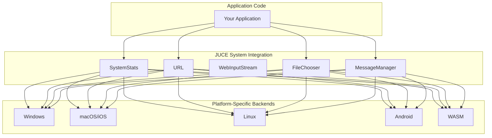

# System Information and Platform Integration

> **Relevant source files**
> * [modules/juce_core/network/juce_URL.cpp](https://github.com/juce-framework/JUCE/blob/d6181bde/modules/juce_core/network/juce_URL.cpp)
> * [modules/juce_core/network/juce_URL.h](https://github.com/juce-framework/JUCE/blob/d6181bde/modules/juce_core/network/juce_URL.h)
> * [modules/juce_core/network/juce_WebInputStream.cpp](https://github.com/juce-framework/JUCE/blob/d6181bde/modules/juce_core/network/juce_WebInputStream.cpp)
> * [modules/juce_core/network/juce_WebInputStream.h](https://github.com/juce-framework/JUCE/blob/d6181bde/modules/juce_core/network/juce_WebInputStream.h)
> * [modules/juce_core/threads/juce_CriticalSection.h](https://github.com/juce-framework/JUCE/blob/d6181bde/modules/juce_core/threads/juce_CriticalSection.h)
> * [modules/juce_events/broadcasters/juce_AsyncUpdater.cpp](https://github.com/juce-framework/JUCE/blob/d6181bde/modules/juce_events/broadcasters/juce_AsyncUpdater.cpp)
> * [modules/juce_events/broadcasters/juce_AsyncUpdater.h](https://github.com/juce-framework/JUCE/blob/d6181bde/modules/juce_events/broadcasters/juce_AsyncUpdater.h)
> * [modules/juce_events/messages/juce_MessageManager.cpp](https://github.com/juce-framework/JUCE/blob/d6181bde/modules/juce_events/messages/juce_MessageManager.cpp)
> * [modules/juce_events/messages/juce_MessageManager.h](https://github.com/juce-framework/JUCE/blob/d6181bde/modules/juce_events/messages/juce_MessageManager.h)
> * [modules/juce_gui_basics/components/juce_ComponentListener.cpp](https://github.com/juce-framework/JUCE/blob/d6181bde/modules/juce_gui_basics/components/juce_ComponentListener.cpp)
> * [modules/juce_gui_basics/components/juce_ComponentListener.h](https://github.com/juce-framework/JUCE/blob/d6181bde/modules/juce_gui_basics/components/juce_ComponentListener.h)
> * [modules/juce_gui_basics/filebrowser/juce_FileChooser.cpp](https://github.com/juce-framework/JUCE/blob/d6181bde/modules/juce_gui_basics/filebrowser/juce_FileChooser.cpp)
> * [modules/juce_gui_basics/filebrowser/juce_FileChooser.h](https://github.com/juce-framework/JUCE/blob/d6181bde/modules/juce_gui_basics/filebrowser/juce_FileChooser.h)
> * [modules/juce_product_unlocking/native/java/app/com/rmsl/juce/JuceBillingClient.java](https://github.com/juce-framework/JUCE/blob/d6181bde/modules/juce_product_unlocking/native/java/app/com/rmsl/juce/JuceBillingClient.java)

This page documents JUCE's core platform integration and system information facilities. These enable JUCE applications to interact with the underlying operating system, adapt to different environments, and access system-level resources in a cross-platform manner.

## Overview

JUCE provides a unified API for:

* Detecting and identifying the operating system and hardware
* Accessing environment variables and user/device information
* Performing platform-specific actions (such as launching URLs)
* Integrating with native file and network resources

The main classes and modules involved are:

| System Area | Main Class / Module | File(s) |
| --- | --- | --- |
| System information | `SystemStats` | `juce_core/system/juce_SystemStats.h` |
| URL/network integration | `URL`, `WebInputStream` | `juce_core/network/juce_URL.h`, `juce_core/network/juce_WebInputStream.h` |
| File selection/dialogs | `FileChooser` | `juce_gui_basics/filebrowser/juce_FileChooser.h` |
| Event/message loop | `MessageManager` | `juce_events/messages/juce_MessageManager.h` |

These APIs abstract platform differences, allowing code to be portable across Windows, macOS, Linux, iOS, Android, and WASM.

Sources: [modules/juce_core/system/juce_SystemStats.h](https://github.com/juce-framework/JUCE/blob/d6181bde/modules/juce_core/system/juce_SystemStats.h)

 [modules/juce_core/network/juce_URL.h](https://github.com/juce-framework/JUCE/blob/d6181bde/modules/juce_core/network/juce_URL.h)

 [modules/juce_core/network/juce_WebInputStream.h](https://github.com/juce-framework/JUCE/blob/d6181bde/modules/juce_core/network/juce_WebInputStream.h)

 [modules/juce_gui_basics/filebrowser/juce_FileChooser.h](https://github.com/juce-framework/JUCE/blob/d6181bde/modules/juce_gui_basics/filebrowser/juce_FileChooser.h)

 [modules/juce_events/messages/juce_MessageManager.h](https://github.com/juce-framework/JUCE/blob/d6181bde/modules/juce_events/messages/juce_MessageManager.h)

## Architecture Overview

### System Integration and Platform Abstraction

**Diagram: JUCE System Integration Layer**



This diagram shows how JUCE's core system classes provide a unified interface to platform-specific implementations.

Sources: [modules/juce_core/system/juce_SystemStats.h](https://github.com/juce-framework/JUCE/blob/d6181bde/modules/juce_core/system/juce_SystemStats.h)

 [modules/juce_core/network/juce_URL.h](https://github.com/juce-framework/JUCE/blob/d6181bde/modules/juce_core/network/juce_URL.h)

 [modules/juce_gui_basics/filebrowser/juce_FileChooser.h](https://github.com/juce-framework/JUCE/blob/d6181bde/modules/juce_gui_basics/filebrowser/juce_FileChooser.h)

 [modules/juce_events/messages/juce_MessageManager.h](https://github.com/juce-framework/JUCE/blob/d6181bde/modules/juce_events/messages/juce_MessageManager.h)

## System Information: SystemStats

The `SystemStats` class provides static methods for retrieving system and environment information. It is designed to be cross-platform and is the main entry point for querying OS, CPU, memory, user, and device details.

**Diagram: SystemStats API and Related Types**

```

```

Sources: [modules/juce_core/system/juce_SystemStats.h L44-L304](https://github.com/juce-framework/JUCE/blob/d6181bde/modules/juce_core/system/juce_SystemStats.h#L44-L304)

## Operating System Detection

JUCE provides facilities for detecting the current operating system and version, which is essential for writing portable code.

### Operating System Types

The `SystemStats::OperatingSystemType` enum defines constants for each supported OS and version.

| Enum Value | Description |
| --- | --- |
| `UnknownOS` | Unknown OS |
| `MacOSX` | macOS (with version bits) |
| `Windows` | Windows (with version bits) |
| `Linux` | Linux |
| `Android` | Android |
| `iOS` | iOS |
| `WASM` | WebAssembly |
| ... | Specific versions |

Example usage:

```
if ((SystemStats::getOperatingSystemType() & SystemStats::Windows) != 0)
{
    // Windows-specific code
}
```

**Diagram: OS Detection API**

```

```

Sources: [modules/juce_core/system/juce_SystemStats.h L54-L91](https://github.com/juce-framework/JUCE/blob/d6181bde/modules/juce_core/system/juce_SystemStats.h#L54-L91)

 [modules/juce_core/native/juce_SystemStats_windows.cpp L282-L341](https://github.com/juce-framework/JUCE/blob/d6181bde/modules/juce_core/native/juce_SystemStats_windows.cpp#L282-L341)

 [modules/juce_core/native/juce_SystemStats_mac.mm L129-L196](https://github.com/juce-framework/JUCE/blob/d6181bde/modules/juce_core/native/juce_SystemStats_mac.mm#L129-L196)

**Implementation Details**

* Windows: Uses `RtlGetVersion` and other Win32 APIs
* macOS: Reads `SystemVersion.plist`
* iOS: Uses `UIDevice`
* Linux: Uses `uname` and distribution info
* Android: Uses JNI to access system properties

Sources: [modules/juce_core/native/juce_SystemStats_windows.cpp L247-L302](https://github.com/juce-framework/JUCE/blob/d6181bde/modules/juce_core/native/juce_SystemStats_windows.cpp#L247-L302)

 [modules/juce_core/native/juce_SystemStats_mac.mm L102-L166](https://github.com/juce-framework/JUCE/blob/d6181bde/modules/juce_core/native/juce_SystemStats_mac.mm#L102-L166)

## CPU and Hardware Information

JUCE provides methods to query CPU and memory characteristics.

### CPU Capabilities

`SystemStats` exposes methods to detect CPU features and details:

| Method | Description |
| --- | --- |
| `getNumCpus()` | Logical CPU count |
| `getNumPhysicalCpus()` | Physical CPU count |
| `getCpuSpeedInMegahertz()` | CPU speed |
| `getCpuVendor()` | Vendor string |
| `getCpuModel()` | Model string |
| `hasSSE()`, `hasAVX()`, etc. | Feature detection |

**Diagram: CPU Feature Querying**

```

```

Platform-specific implementations use:

* Windows: CPUID instruction
* macOS/iOS: sysctl
* Linux: `/proc/cpuinfo`
* ARM: architecture flags

Sources: [modules/juce_core/system/juce_SystemStats.cpp L137-L185](https://github.com/juce-framework/JUCE/blob/d6181bde/modules/juce_core/system/juce_SystemStats.cpp#L137-L185)

 [modules/juce_core/native/juce_SystemStats_windows.cpp L137-L232](https://github.com/juce-framework/JUCE/blob/d6181bde/modules/juce_core/native/juce_SystemStats_windows.cpp#L137-L232)

 [modules/juce_core/native/juce_SystemStats_mac.mm L59-L98](https://github.com/juce-framework/JUCE/blob/d6181bde/modules/juce_core/native/juce_SystemStats_mac.mm#L59-L98)

### Memory Information

| Method | Description |
| --- | --- |
| `getMemorySizeInMegabytes()` | Total physical memory |
| `getPageSize()` | System memory page size |

Sources: [modules/juce_core/native/juce_SystemStats_windows.cpp L375-L381](https://github.com/juce-framework/JUCE/blob/d6181bde/modules/juce_core/native/juce_SystemStats_windows.cpp#L375-L381)

 [modules/juce_core/native/juce_SystemStats_windows.cpp L549-L555](https://github.com/juce-framework/JUCE/blob/d6181bde/modules/juce_core/native/juce_SystemStats_windows.cpp#L549-L555)

 [modules/juce_core/native/juce_SystemStats_mac.mm L207-L214](https://github.com/juce-framework/JUCE/blob/d6181bde/modules/juce_core/native/juce_SystemStats_mac.mm#L207-L214)

 [modules/juce_core/native/juce_SystemStats_mac.mm L361-L364](https://github.com/juce-framework/JUCE/blob/d6181bde/modules/juce_core/native/juce_SystemStats_mac.mm#L361-L364)

## User and Device Information

### User Information

`SystemStats` provides methods to retrieve user and host information:

| Method | Description |
| --- | --- |
| `getLogonName()` | Current user's login name |
| `getFullUserName()` | User's full name |
| `getUserLanguage()` | User's language (ISO 639) |
| `getUserRegion()` | User's region (ISO 3166) |
| `getDisplayLanguage()` | OS display language |
| `getComputerName()` | Host computer name |

Sources: [modules/juce_core/system/juce_SystemStats.h L115-L146](https://github.com/juce-framework/JUCE/blob/d6181bde/modules/juce_core/system/juce_SystemStats.h#L115-L146)

 [modules/juce_core/native/juce_SystemStats_windows.cpp L558-L623](https://github.com/juce-framework/JUCE/blob/d6181bde/modules/juce_core/native/juce_SystemStats_windows.cpp#L558-L623)

 [modules/juce_core/native/juce_SystemStats_mac.mm L265-L299](https://github.com/juce-framework/JUCE/blob/d6181bde/modules/juce_core/native/juce_SystemStats_mac.mm#L265-L299)

### Device Identification

JUCE provides device identification for licensing, analytics, and user-specific settings.

**Diagram: Device ID Methods and Platform Backends**

```

```

Note: `getDeviceIdentifiers()` is deprecated; use `getMachineIdentifiers()` or `getUniqueDeviceID()`.

Sources: [modules/juce_core/system/juce_SystemStats.h L163-L203](https://github.com/juce-framework/JUCE/blob/d6181bde/modules/juce_core/system/juce_SystemStats.h#L163-L203)

 [modules/juce_core/system/juce_SystemStats.cpp L73-L134](https://github.com/juce-framework/JUCE/blob/d6181bde/modules/juce_core/system/juce_SystemStats.cpp#L73-L134)

 [modules/juce_core/native/juce_SystemStats_windows.cpp L633-L846](https://github.com/juce-framework/JUCE/blob/d6181bde/modules/juce_core/native/juce_SystemStats_windows.cpp#L633-L846)

 [modules/juce_core/native/juce_SystemStats_mac.mm L366-L391](https://github.com/juce-framework/JUCE/blob/d6181bde/modules/juce_core/native/juce_SystemStats_mac.mm#L366-L391)

## Application Environment

### Environment Variables

`SystemStats::getEnvironmentVariable(const String& name, const String& defaultValue)` provides cross-platform access to environment variables.

Sources: [modules/juce_core/system/juce_SystemStats.h L110-L113](https://github.com/juce-framework/JUCE/blob/d6181bde/modules/juce_core/system/juce_SystemStats.h#L110-L113)

 [modules/juce_core/native/juce_SystemStats_windows.cpp L384-L396](https://github.com/juce-framework/JUCE/blob/d6181bde/modules/juce_core/native/juce_SystemStats_windows.cpp#L384-L396)

### Sandbox Detection

On Apple platforms, JUCE can detect sandboxed environments:

* `SystemStats::isRunningInAppExtensionSandbox()`
* `SystemStats::isAppSandboxEnabled()` (macOS only)

Sources: [modules/juce_core/system/juce_SystemStats.h L286-L293](https://github.com/juce-framework/JUCE/blob/d6181bde/modules/juce_core/system/juce_SystemStats.h#L286-L293)

 [modules/juce_core/system/juce_SystemStats.cpp L280-L301](https://github.com/juce-framework/JUCE/blob/d6181bde/modules/juce_core/system/juce_SystemStats.cpp#L280-L301)

 [modules/juce_core/native/juce_SystemStats_mac.mm L393-L425](https://github.com/juce-framework/JUCE/blob/d6181bde/modules/juce_core/native/juce_SystemStats_mac.mm#L393-L425)

## Error Handling and Debugging

### Stack Traces

`SystemStats::getStackBacktrace()` returns a string with the current call stack, useful for debugging.

Sources: [modules/juce_core/system/juce_SystemStats.h L267-L271](https://github.com/juce-framework/JUCE/blob/d6181bde/modules/juce_core/system/juce_SystemStats.h#L267-L271)

 [modules/juce_core/system/juce_SystemStats.cpp L189-L239](https://github.com/juce-framework/JUCE/blob/d6181bde/modules/juce_core/system/juce_SystemStats.cpp#L189-L239)

### Crash Handling

You can set a global crash handler:

* `SystemStats::setApplicationCrashHandler(CrashHandlerFunction)`

This function is called on fatal errors or illegal instructions.

Sources: [modules/juce_core/system/juce_SystemStats.h L273-L284](https://github.com/juce-framework/JUCE/blob/d6181bde/modules/juce_core/system/juce_SystemStats.h#L273-L284)

 [modules/juce_core/system/juce_SystemStats.cpp L244-L277](https://github.com/juce-framework/JUCE/blob/d6181bde/modules/juce_core/system/juce_SystemStats.cpp#L244-L277)

## Common Usage Examples

Below are common scenarios for using JUCE's system integration APIs.

### Platform-Specific Code

```
if ((SystemStats::getOperatingSystemType() & SystemStats::Windows) != 0)
{
    // Windows-specific code
}
```

### CPU Feature Detection

```
if (SystemStats::hasSSE41() && SystemStats::hasAVX())
{
    // Use AVX implementation
}
```

### Device Identification

```
String deviceId = SystemStats::getUniqueDeviceID();
userSettings.setValue("deviceId", deviceId);
```

### System Information Display

See the SystemInfoDemo example for a comprehensive display of system information.

Sources: [examples/Utilities/SystemInfoDemo.h L132-L196](https://github.com/juce-framework/JUCE/blob/d6181bde/examples/Utilities/SystemInfoDemo.h#L132-L196)

## Related Classes

Other JUCE classes relevant to platform integration:

| Class | Description |
| --- | --- |
| `File` | Platform-independent file access |
| `Time` | Date and time handling |
| `MACAddress` | Network MAC address utilities |
| `IPAddress` | IP address utilities |
| `Process` | Current process information |
| `URL` | Cross-platform URL/network access |
| `FileChooser` | Native file dialogs |
| `MessageManager` | Event/message loop integration |

Sources: [modules/juce_core/network/juce_URL.h](https://github.com/juce-framework/JUCE/blob/d6181bde/modules/juce_core/network/juce_URL.h)

 [modules/juce_gui_basics/filebrowser/juce_FileChooser.h](https://github.com/juce-framework/JUCE/blob/d6181bde/modules/juce_gui_basics/filebrowser/juce_FileChooser.h)

 [modules/juce_events/messages/juce_MessageManager.h](https://github.com/juce-framework/JUCE/blob/d6181bde/modules/juce_events/messages/juce_MessageManager.h)

## Conclusion

The `SystemStats` class and related functionality provide a comprehensive platform abstraction layer that allows JUCE applications to adapt to different operating systems and hardware configurations. By using these APIs, you can write code that works consistently across different platforms while still taking advantage of platform-specific features when necessary.