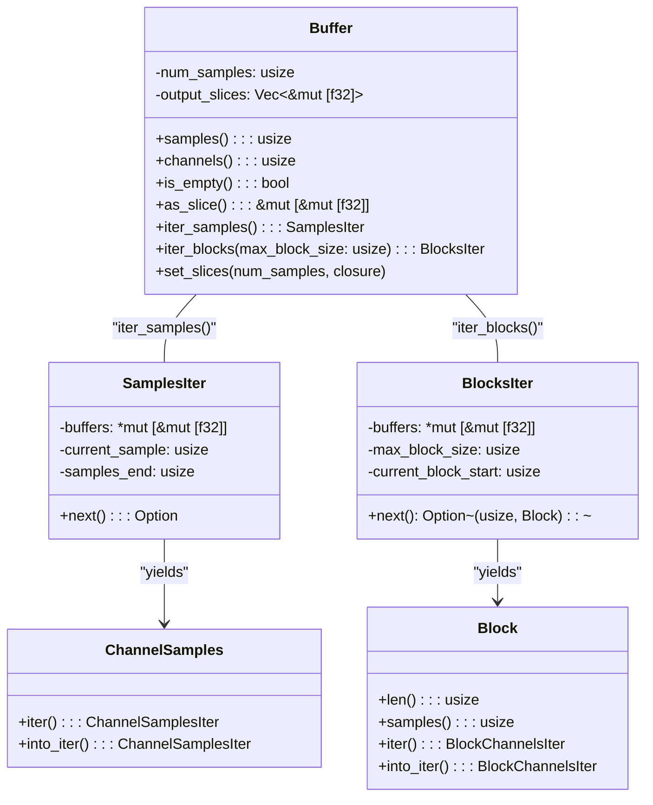
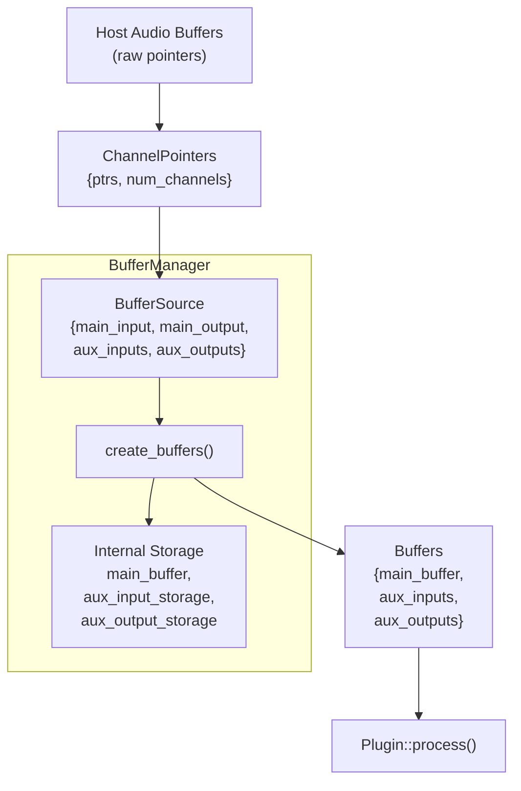
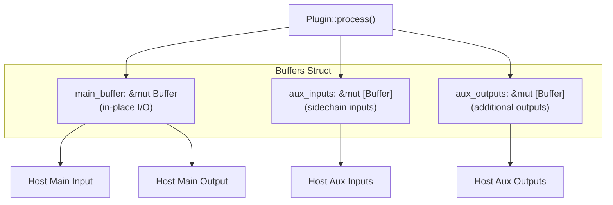
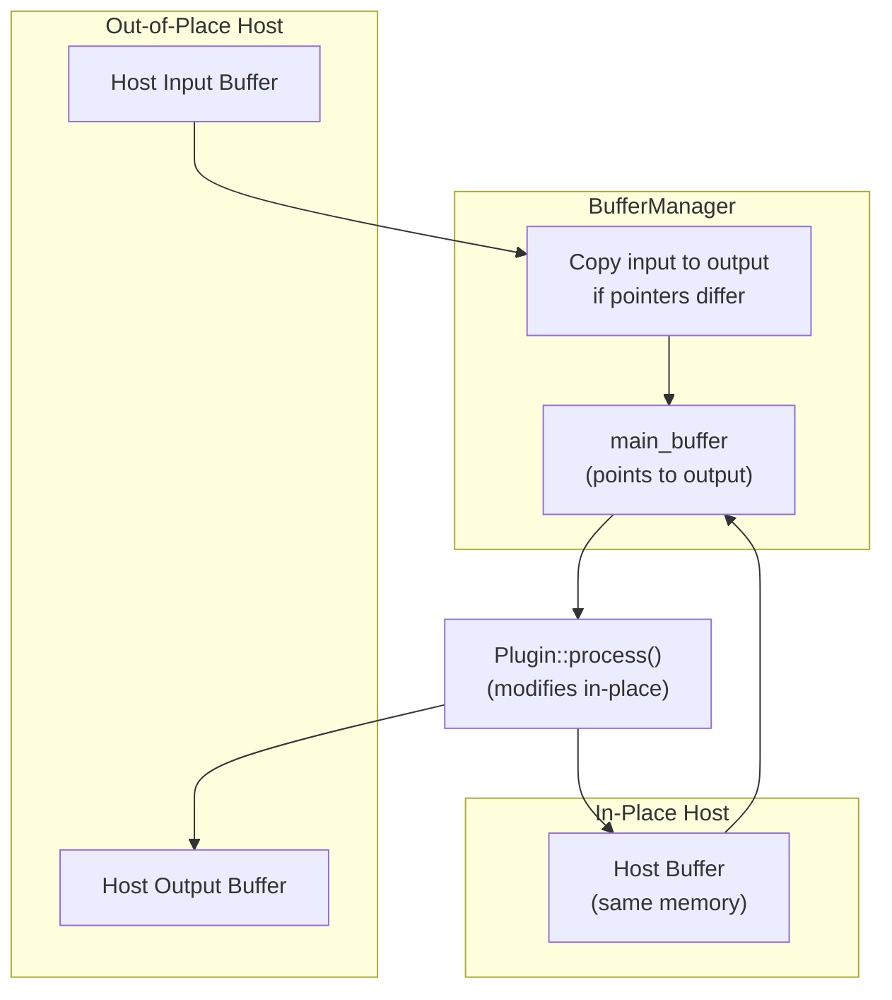
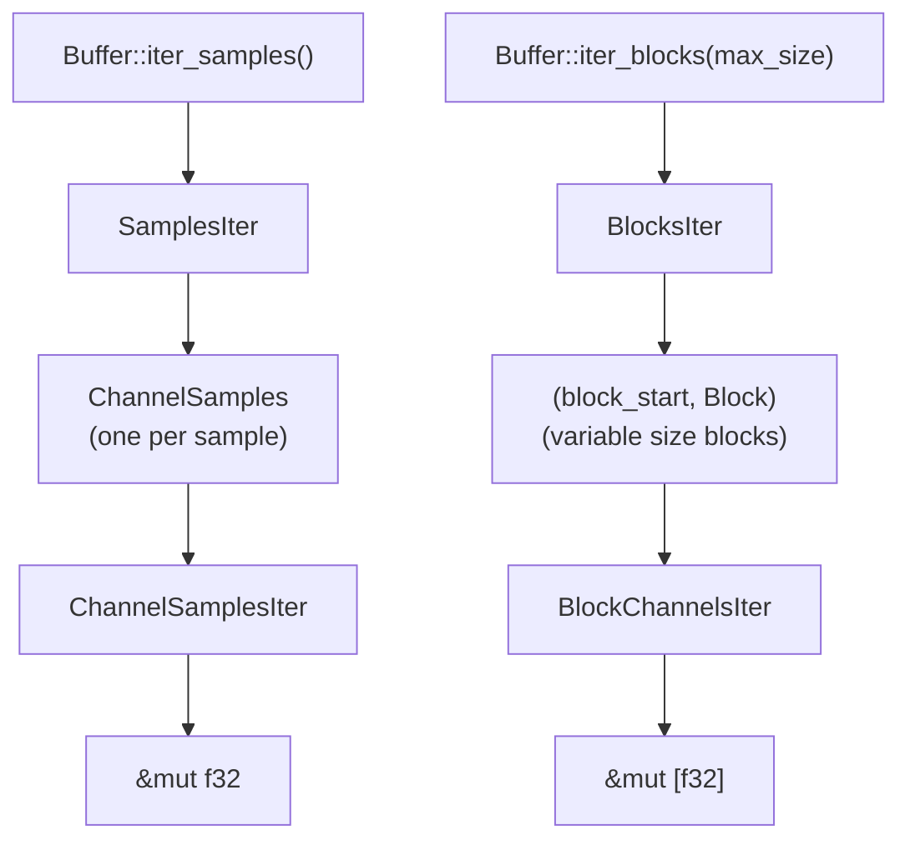
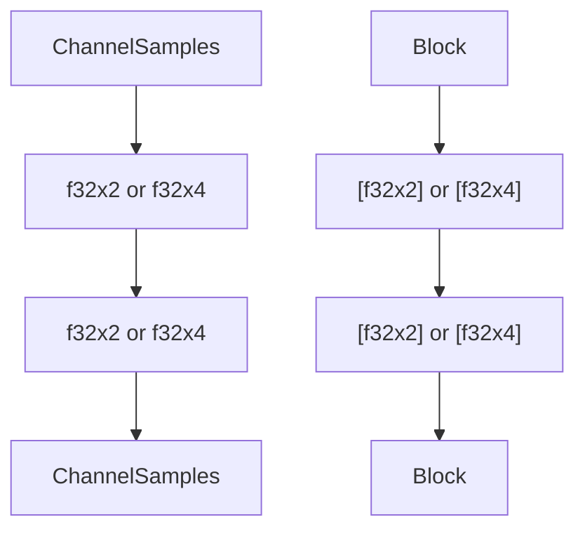
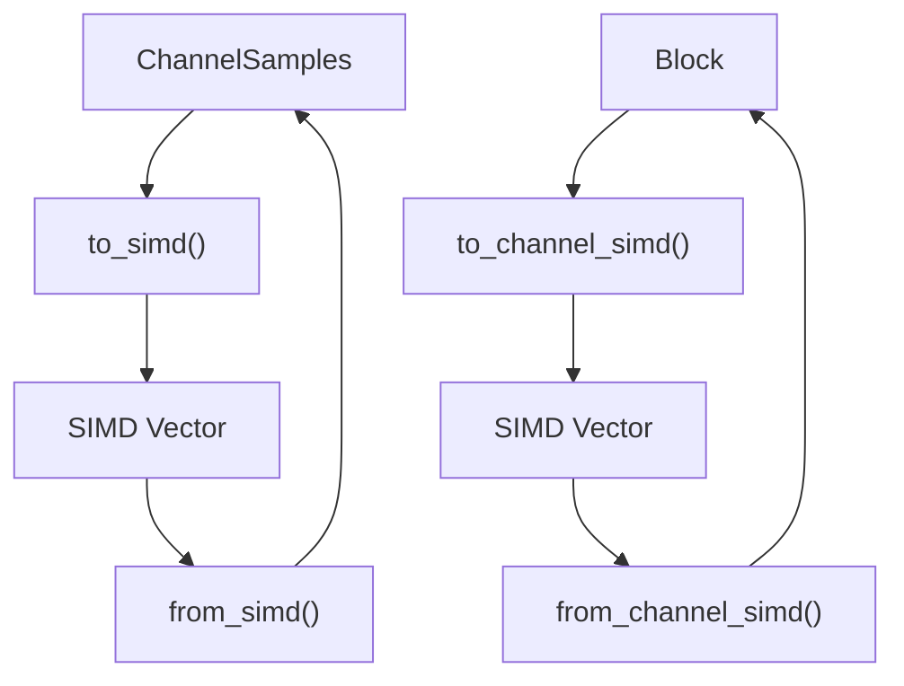
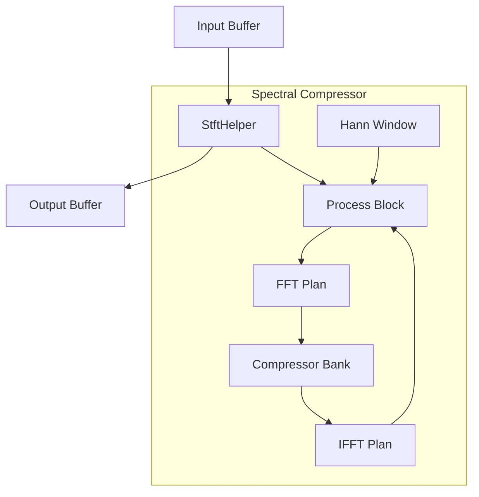

# Audio Buffer System

> **Relevant source files**
> * [CHANGELOG.md](https://github.com/robbert-vdh/nih-plug/blob/28b149ec/CHANGELOG.md)
> * [src/wrapper/util.rs](https://github.com/robbert-vdh/nih-plug/blob/28b149ec/src/wrapper/util.rs)
> * [src/wrapper/util/buffer_management.rs](https://github.com/robbert-vdh/nih-plug/blob/28b149ec/src/wrapper/util/buffer_management.rs)
> * [src/wrapper/vst3/factory.rs](https://github.com/robbert-vdh/nih-plug/blob/28b149ec/src/wrapper/vst3/factory.rs)
> * [src/wrapper/vst3/view.rs](https://github.com/robbert-vdh/nih-plug/blob/28b149ec/src/wrapper/vst3/view.rs)

The Audio Buffer System in NIH-plug provides safe abstractions for handling audio data during plugin processing. The system consists of the `Buffer` type for audio samples, the `BufferManager` for safely constructing buffers from host pointers, and `AuxiliaryBuffers` for sidechain inputs and auxiliary outputs. All processing follows an in-place model for efficiency. For parameter handling, see [Parameter System](/robbert-vdh/nih-plug/2.2-parameter-system), and for context management, see [Context System](/robbert-vdh/nih-plug/2.4-context-system).

## Overview

NIH-plug's buffer system bridges the gap between unsafe host-provided raw pointers and safe Rust abstractions that plugins can use. The key components are:

| Component | Purpose | Location |
| --- | --- | --- |
| `Buffer<'a>` | Main audio buffer with iteration methods | [src/buffer.rs](https://github.com/robbert-vdh/nih-plug/blob/28b149ec/src/buffer.rs) |
| `BufferManager` | Safely creates buffers from host pointers | [src/wrapper/util/buffer_management.rs](https://github.com/robbert-vdh/nih-plug/blob/28b149ec/src/wrapper/util/buffer_management.rs) |
| `ChannelPointers` | Raw pointer wrapper for host audio data | [src/wrapper/util/buffer_management.rs L63-L71](https://github.com/robbert-vdh/nih-plug/blob/28b149ec/src/wrapper/util/buffer_management.rs#L63-L71) |
| `Buffers<'a, 'buffer>` | Container for main and auxiliary buffers | [src/wrapper/util/buffer_management.rs L11-L18](https://github.com/robbert-vdh/nih-plug/blob/28b149ec/src/wrapper/util/buffer_management.rs#L11-L18) |
| `AuxiliaryBuffers` | Sidechain inputs and auxiliary outputs | Referenced in wrapper code |

Sources: [src/wrapper/util/buffer_management.rs L1-L505](https://github.com/robbert-vdh/nih-plug/blob/28b149ec/src/wrapper/util/buffer_management.rs#L1-L505)

 [src/buffer.rs](https://github.com/robbert-vdh/nih-plug/blob/28b149ec/src/buffer.rs)

## Buffer Structure

**Diagram: Buffer Type and Iteration**



The `Buffer<'a>` struct contains mutable slices to f32 audio samples, with each slice representing one channel. The lifetime `'a` ensures the buffer cannot outlive the underlying audio data. The buffer supports two primary iteration patterns through `iter_samples()` and `iter_blocks()`.

Sources: [src/buffer.rs L18-L109](https://github.com/robbert-vdh/nih-plug/blob/28b149ec/src/buffer.rs#L18-L109)

 [src/buffer/samples.rs L10-L114](https://github.com/robbert-vdh/nih-plug/blob/28b149ec/src/buffer/samples.rs#L10-L114)

 [src/buffer/blocks.rs L13-L250](https://github.com/robbert-vdh/nih-plug/blob/28b149ec/src/buffer/blocks.rs#L13-L250)

## BufferManager

**Diagram: BufferManager Data Flow**



The `BufferManager` is responsible for safely translating host-provided raw audio pointers into safe Rust `Buffer` instances. It handles:

* **In-place detection**: Detecting when input and output buffers share the same memory
* **Channel count mismatches**: Padding or truncating channels as needed
* **Null pointer handling**: Substituting empty slices for missing buffers
* **Auxiliary buffer copying**: Copying auxiliary input data to owned storage
* **Zero-initialization**: Filling output buffers with zeroes when appropriate

The manager is initialized once with `BufferManager::for_audio_io_layout()` based on the plugin's `AudioIOLayout`, allocating all necessary storage upfront. During each process call, `create_buffers()` reuses this storage to construct the `Buffers` struct without allocating.

Sources: [src/wrapper/util/buffer_management.rs L20-L147](https://github.com/robbert-vdh/nih-plug/blob/28b149ec/src/wrapper/util/buffer_management.rs#L20-L147)

 [src/wrapper/util/buffer_management.rs L167-L374](https://github.com/robbert-vdh/nih-plug/blob/28b149ec/src/wrapper/util/buffer_management.rs#L167-L374)

 [CHANGELOG.md L289-L298](https://github.com/robbert-vdh/nih-plug/blob/28b149ec/CHANGELOG.md#L289-L298)

## Auxiliary Buffers

**Diagram: Main and Auxiliary Buffer Organization**



Auxiliary buffers enable plugins to handle sidechain inputs and multiple output buses. The `Buffers` struct passed to `Plugin::process()` contains:

* **main_buffer**: The primary input/output buffer, processed in-place
* **aux_inputs**: Array of auxiliary input buffers (e.g., sidechain for compressors)
* **aux_outputs**: Array of auxiliary output buffers (e.g., separate wet/dry outputs)

Auxiliary inputs are always copied to owned storage because the `Buffer` API is designed around mutable access, and the host may reuse input buffers between plugins. This copying happens in `BufferManager::create_buffers()` using the `aux_input_storage` field.

Sources: [src/wrapper/util/buffer_management.rs L11-L18](https://github.com/robbert-vdh/nih-plug/blob/28b149ec/src/wrapper/util/buffer_management.rs#L11-L18)

 [src/wrapper/util/buffer_management.rs L38-L44](https://github.com/robbert-vdh/nih-plug/blob/28b149ec/src/wrapper/util/buffer_management.rs#L38-L44)

 [src/wrapper/util/buffer_management.rs L259-L317](https://github.com/robbert-vdh/nih-plug/blob/28b149ec/src/wrapper/util/buffer_management.rs#L259-L317)

## In-Place Processing

NIH-plug uses an in-place processing model where the main input and output buffers share the same memory when possible. This is efficient and matches how most plugin APIs work.

**Diagram: In-Place Processing Flow**



The `BufferManager` handles both scenarios:

1. **In-place**: Input and output pointers are identical. The buffer points directly to this memory.
2. **Out-of-place**: Input and output pointers differ. Input data is copied to the output buffer first, then the plugin processes it in-place.

The detection happens in `create_buffers()` at [src/wrapper/util/buffer_management.rs L219-L255](https://github.com/robbert-vdh/nih-plug/blob/28b149ec/src/wrapper/util/buffer_management.rs#L219-L255)

 When pointers match (`input_channel_pointer == output_channel_pointer`), the copy is skipped. This was fixed in a 2024 update to handle edge cases correctly.

Sources: [src/wrapper/util/buffer_management.rs L217-L255](https://github.com/robbert-vdh/nih-plug/blob/28b149ec/src/wrapper/util/buffer_management.rs#L217-L255)

 [CHANGELOG.md L74-L76](https://github.com/robbert-vdh/nih-plug/blob/28b149ec/CHANGELOG.md#L74-L76)

 [CHANGELOG.md L289-L308](https://github.com/robbert-vdh/nih-plug/blob/28b149ec/CHANGELOG.md#L289-L308)

## Buffer Iteration Patterns

NIH-plug provides multiple iteration patterns optimized for different processing styles.

**Diagram: Iteration Pattern Hierarchy**



### Per-Sample Processing

```
for channel_samples in buffer.iter_samples() {
    for sample in channel_samples {
        *sample *= gain;
    }
}
```

The per-sample iterator yields a `ChannelSamples` for each sample index, which can then be iterated over channels. This pattern is simple and clear for basic effects.

### Per-Block Processing

```
for (block_start, block) in buffer.iter_blocks(512) {
    for channel in block {
        // process slice of samples
        apply_filter(channel);
    }
}
```

The per-block iterator yields blocks of up to `max_block_size` samples. The actual block size may be smaller for the final block. This pattern is more efficient for algorithms that process multiple samples at once or benefit from cache locality.

### Per-Block-Per-Sample Processing

The block iterator also allows nested sample iteration:

```
for (_, block) in buffer.iter_blocks(512) {
    for samples in block.iter_samples() {
        for sample in samples {
            *sample *= gain;
        }
    }
}
```

This combines block-based processing with per-sample access, useful when you need sample-accurate parameter automation within blocks.

Sources: [src/buffer.rs L68-L109](https://github.com/robbert-vdh/nih-plug/blob/28b149ec/src/buffer.rs#L68-L109)

 [src/buffer/samples.rs L10-L114](https://github.com/robbert-vdh/nih-plug/blob/28b149ec/src/buffer/samples.rs#L10-L114)

 [src/buffer/blocks.rs L13-L250](https://github.com/robbert-vdh/nih-plug/blob/28b149ec/src/buffer/blocks.rs#L13-L250)

## SIMD Support

When compiled with the `simd` nightly feature, buffer types provide SIMD (Single Instruction, Multiple Data) methods for processing multiple samples in parallel.

**Diagram: SIMD Conversion Flow**



The SIMD methods convert regular samples to packed SIMD vectors (either `f32x2` or `f32x4` depending on platform), allowing vectorized operations that process 2 or 4 channels simultaneously. This is particularly useful for stereo plugins that can process left and right channels together.

Example SIMD usage for stereo processing:

```javascript
// With simd feature enabled
for samples in buffer.iter_samples() {
    let stereo = samples.to_simd();
    // Process both channels at once
    let processed = stereo * gain_simd;
    samples.from_simd(processed);
}
```

The Diopser plugin demonstrates SIMD usage for stereo all-pass filtering, achieving significant performance improvements over scalar processing.

Sources: [src/buffer/samples.rs L169-L249](https://github.com/robbert-vdh/nih-plug/blob/28b149ec/src/buffer/samples.rs#L169-L249)

 [src/buffer/blocks.rs L223-L332](https://github.com/robbert-vdh/nih-plug/blob/28b149ec/src/buffer/blocks.rs#L223-L332)

 [plugins/diopser/src/lib.rs](https://github.com/robbert-vdh/nih-plug/blob/28b149ec/plugins/diopser/src/lib.rs)

## SIMD Optimizations

When the `simd` feature is enabled, several components of the buffer system provide SIMD (Single Instruction, Multiple Data) optimizations:



These optimizations allow for efficient vectorized operations when processing multiple audio channels.

Sources: [src/buffer/samples.rs L169-L249](https://github.com/robbert-vdh/nih-plug/blob/28b149ec/src/buffer/samples.rs#L169-L249)

 [src/buffer/blocks.rs L223-L332](https://github.com/robbert-vdh/nih-plug/blob/28b149ec/src/buffer/blocks.rs#L223-L332)

## Real-World Example: Spectral Compressor

The Spectral Compressor plugin demonstrates how the buffer system is used for advanced spectral processing:



This plugin uses the STFT helper to perform FFT-based compression on individual frequency bins.

Sources: [plugins/spectral_compressor/src/lib.rs L55-L87](https://github.com/robbert-vdh/nih-plug/blob/28b149ec/plugins/spectral_compressor/src/lib.rs#L55-L87)

 [plugins/spectral_compressor/src/lib.rs L439-L492](https://github.com/robbert-vdh/nih-plug/blob/28b149ec/plugins/spectral_compressor/src/lib.rs#L439-L492)

 [plugins/spectral_compressor/src/lib.rs L546-L595](https://github.com/robbert-vdh/nih-plug/blob/28b149ec/plugins/spectral_compressor/src/lib.rs#L546-L595)

## Buffer Processing Patterns

The buffer system supports several common audio processing patterns:

| Pattern | Description | Suitable For |
| --- | --- | --- |
| Sample-by-sample | Process each sample individually | Simple effects like gain adjustments |
| Block-by-block | Process blocks of samples at once | Filters, effects with time-dependence |
| Spectral processing | Transform to frequency domain | EQ, spectral effects, analysis |
| Sidechain processing | Analysis from auxiliary inputs | Dynamics processors, analyzers |

Sources: [src/buffer.rs L68-L109](https://github.com/robbert-vdh/nih-plug/blob/28b149ec/src/buffer.rs#L68-L109)

 [src/util/stft.rs L288-L559](https://github.com/robbert-vdh/nih-plug/blob/28b149ec/src/util/stft.rs#L288-L559)

## Best Practices

When working with the NIH-plug buffer system:

1. Choose the appropriate iteration pattern for your algorithm
2. Use block-based processing when possible for better cache efficiency
3. Apply window functions correctly for spectral processing
4. Be careful with raw buffer access and unsafe code
5. Consider the latency introduced by STFT processing
6. Use the available SIMD optimizations for performance-critical code

Sources: [plugins/spectral_compressor/src/lib.rs L439-L492](https://github.com/robbert-vdh/nih-plug/blob/28b149ec/plugins/spectral_compressor/src/lib.rs#L439-L492)

 [plugins/diopser/src/spectrum.rs L108-L146](https://github.com/robbert-vdh/nih-plug/blob/28b149ec/plugins/diopser/src/spectrum.rs#L108-L146)

The audio buffer system is a fundamental part of NIH-plug, providing flexible and efficient ways to process audio data across various plugin types and processing paradigms.