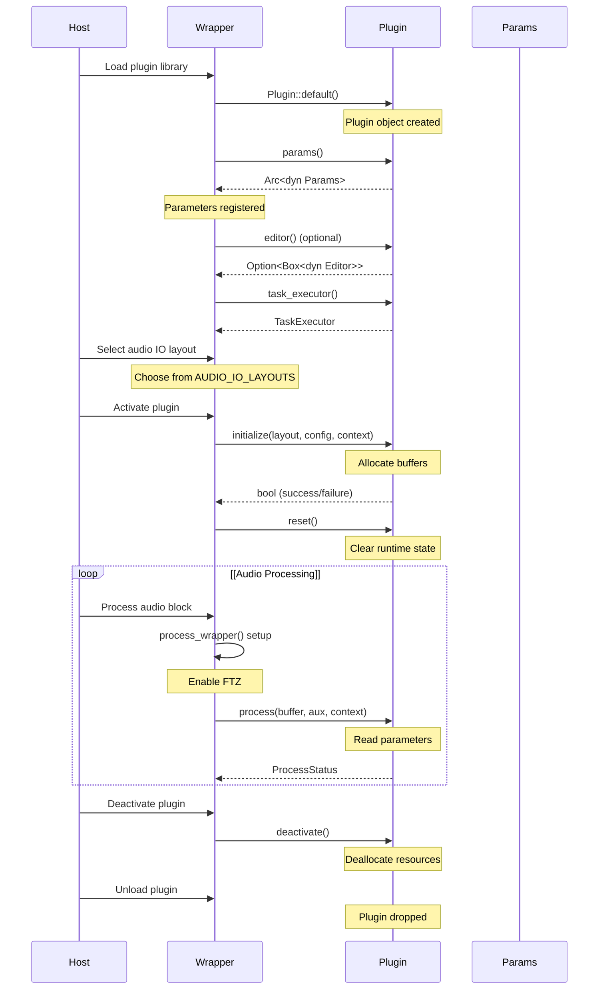
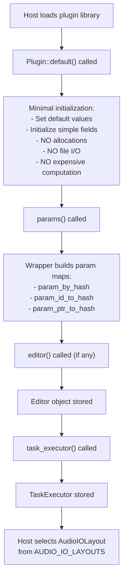
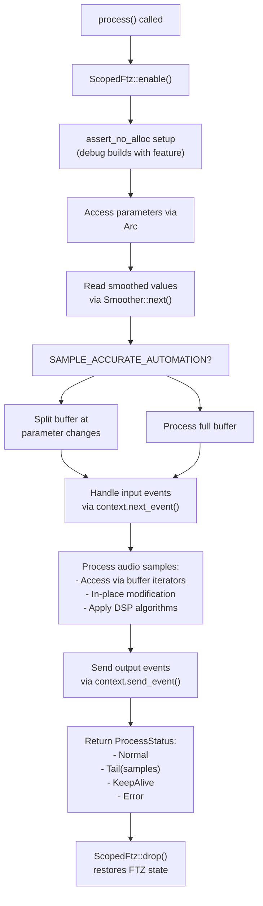
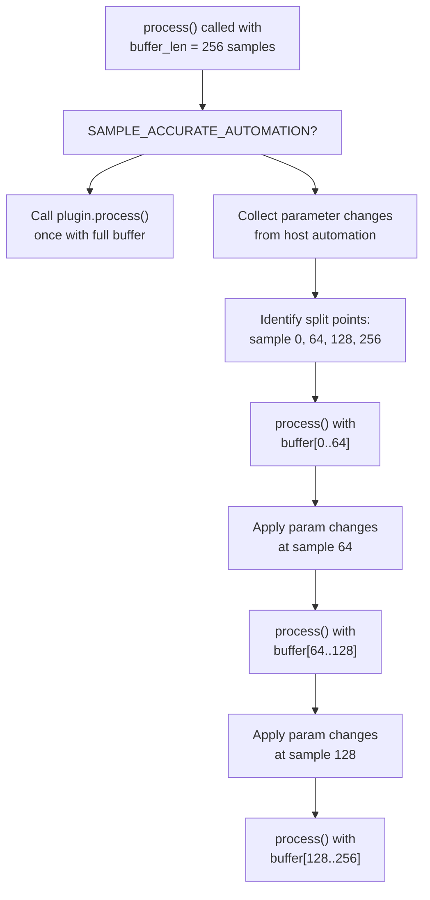
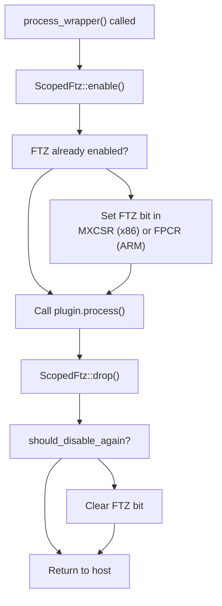
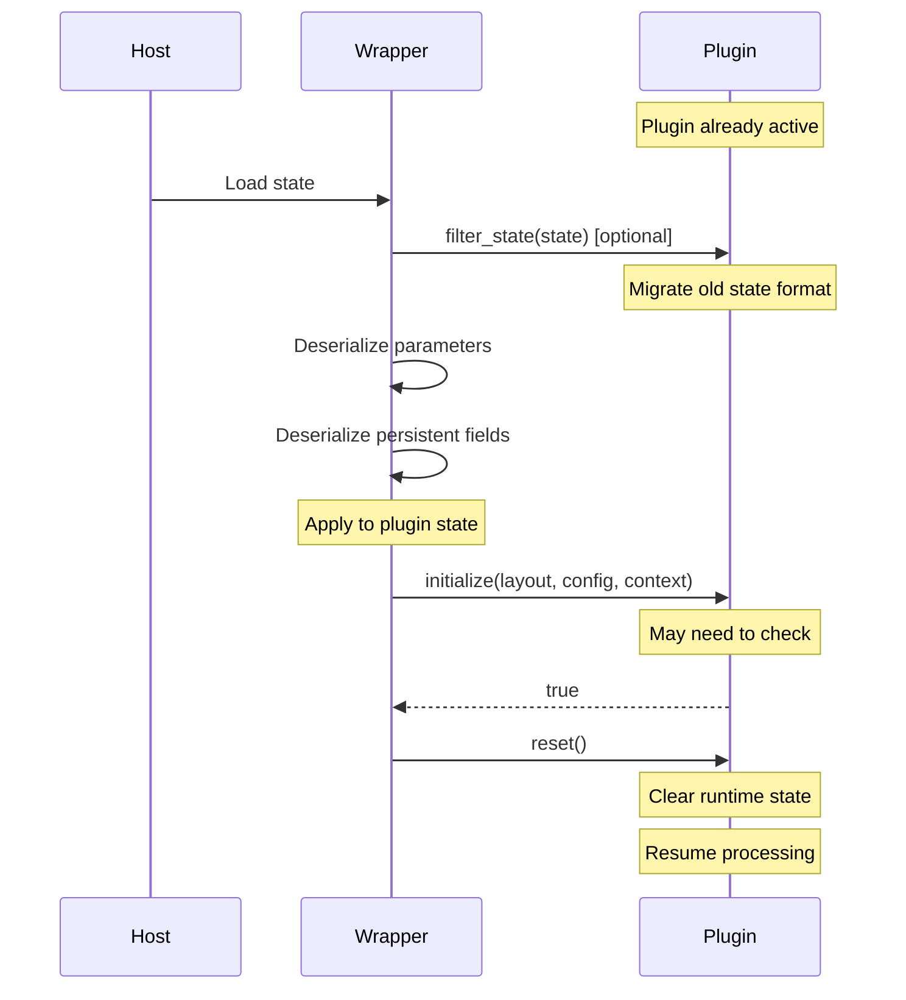

# Audio Processing Lifecycle

> **Relevant source files**
> * [CHANGELOG.md](https://github.com/robbert-vdh/nih-plug/blob/28b149ec/CHANGELOG.md)
> * [src/lib.rs](https://github.com/robbert-vdh/nih-plug/blob/28b149ec/src/lib.rs)
> * [src/plugin.rs](https://github.com/robbert-vdh/nih-plug/blob/28b149ec/src/plugin.rs)
> * [src/wrapper/util.rs](https://github.com/robbert-vdh/nih-plug/blob/28b149ec/src/wrapper/util.rs)
> * [src/wrapper/util/buffer_management.rs](https://github.com/robbert-vdh/nih-plug/blob/28b149ec/src/wrapper/util/buffer_management.rs)
> * [src/wrapper/vst3/factory.rs](https://github.com/robbert-vdh/nih-plug/blob/28b149ec/src/wrapper/vst3/factory.rs)
> * [src/wrapper/vst3/view.rs](https://github.com/robbert-vdh/nih-plug/blob/28b149ec/src/wrapper/vst3/view.rs)

## Purpose and Scope

This page describes the complete processing flow in NIH-plug, from plugin instantiation through audio processing to deactivation. It covers the sequence of lifecycle method calls, the processing callback's structure, sample-accurate automation, event handling, and realtime safety considerations.

For details on the individual methods and constants referenced here, see [Plugin Trait](/robbert-vdh/nih-plug/2.1-plugin-trait). For information about the buffer and context objects used during processing, see [Audio Buffer System](/robbert-vdh/nih-plug/2.3-audio-buffer-system) and [Context System](/robbert-vdh/nih-plug/2.4-context-system).

---

## Lifecycle Overview

A NIH-plug plugin follows a well-defined lifecycle managed by the wrapper layer. The host calls specific methods at specific times, and the plugin must respond appropriately to ensure correct operation.



**Lifecycle Phases:**

| Phase | Methods Called | Allocation Allowed | Purpose |
| --- | --- | --- | --- |
| Construction | `Plugin::default()`, `params()`, `editor()`, `task_executor()` | Yes | Create plugin object and query static information |
| Initialization | `initialize()`, `reset()` | Yes (initialize only) | Allocate resources and clear state |
| Processing | `process()` | No | Process audio in realtime |
| Deactivation | `deactivate()` | Yes | Clean up resources |
| Destruction | Drop | Yes | Final cleanup |

Sources: [src/plugin.rs L59-L255](https://github.com/robbert-vdh/nih-plug/blob/28b149ec/src/plugin.rs#L59-L255)

 [src/lib.rs L37-L66](https://github.com/robbert-vdh/nih-plug/blob/28b149ec/src/lib.rs#L37-L66)

---

## Construction Phase

### Plugin Instantiation

The plugin object is created using its `Default` implementation immediately after the host loads the library. At this point, the plugin should perform minimal initialization only—no expensive calculations, file I/O, or memory allocation beyond what's necessary for the struct itself.



The wrapper queries the plugin's parameters, editor, and task executor exactly once after construction. These methods take `&self` or `&mut self` and allow the plugin to move data into these structures without requiring interior mutability.

Sources: [src/plugin.rs L59-L167](https://github.com/robbert-vdh/nih-plug/blob/28b149ec/src/plugin.rs#L59-L167)

 [src/lib.rs L39-L41](https://github.com/robbert-vdh/nih-plug/blob/28b149ec/src/lib.rs#L39-L41)

---

## Initialization Phase

### The initialize() Method

After the host selects an audio I/O layout from `Plugin::AUDIO_IO_LAYOUTS`, it calls `Plugin::initialize()` with the selected configuration. This is the **only place** where the plugin should perform expensive setup operations.

**Function Signature:**

```rust
fn initialize(
    &mut self,
    audio_io_layout: &AudioIOLayout,
    buffer_config: &BufferConfig,
    context: &mut impl InitContext<Self>,
) -> bool
```

**When to allocate resources:**

* Allocate processing buffers sized to `buffer_config.max_buffer_size`
* Precompute lookup tables based on `buffer_config.sample_rate`
* Initialize filters and DSP structures
* Set up FFT plans for spectral processing
* Allocate memory for delay lines, reverb buffers, etc.

**Important constraints:**

* This method may be called multiple times without an intervening `deactivate()` call, especially when restoring state
* The plugin should check if initialization has already been performed for the current configuration to avoid redundant work
* If initialization fails, return `false` (the plugin will not be activated)
* Store `buffer_config` and `audio_io_layout` if needed during processing

Sources: [src/plugin.rs L204-L211](https://github.com/robbert-vdh/nih-plug/blob/28b149ec/src/plugin.rs#L204-L211)

 [src/lib.rs L46-L49](https://github.com/robbert-vdh/nih-plug/blob/28b149ec/src/lib.rs#L46-L49)

### The reset() Method

`Plugin::reset()` is always called immediately after `initialize()`, and may also be called at any time from the audio thread. This method must be **realtime-safe** (no allocations).

**Function Signature:**

```rust
fn reset(&mut self)
```

**What to clear:**

* Filter coefficients and state variables
* Envelope states
* Oscillator phases
* Delay line contents
* Reverb tail states
* Any accumulated runtime state

**Realtime constraints:**

* No memory allocation
* No file I/O
* No blocking operations
* No expensive computation (precomputed data should be done in `initialize()`)

Sources: [src/plugin.rs L213-L216](https://github.com/robbert-vdh/nih-plug/blob/28b149ec/src/plugin.rs#L213-L216)

 [src/lib.rs L50-L54](https://github.com/robbert-vdh/nih-plug/blob/28b149ec/src/lib.rs#L50-L54)

---

## Processing Phase

### The process() Callback

`Plugin::process()` is called repeatedly by the host to process audio. This is the plugin's core DSP function and must be **realtime-safe**.

**Function Signature:**

```rust
fn process(
    &mut self,
    buffer: &mut Buffer,
    aux: &mut AuxiliaryBuffers,
    context: &mut impl ProcessContext<Self>,
) -> ProcessStatus
```

**Processing flow:**



**Buffer access patterns:**
The `Buffer` object provides several iteration methods for different processing needs:

* `buffer.iter_samples()` - Per-sample per-channel iteration
* `buffer.iter_blocks(block_size)` - Block-based processing
* SIMD adapters for `f32x2`, `f32x4` (nightly only)
* Direct slice access via `buffer.as_slice()` and `buffer.as_slice_mut()`

**Auxiliary buffers:**
The `AuxiliaryBuffers` parameter provides access to:

* Sidechain input ports (defined in `AUDIO_IO_LAYOUTS`)
* Auxiliary output ports

See [Audio Buffer System](/robbert-vdh/nih-plug/2.3-audio-buffer-system) for detailed buffer API documentation.

Sources: [src/plugin.rs L218-L244](https://github.com/robbert-vdh/nih-plug/blob/28b149ec/src/plugin.rs#L218-L244)

 [src/wrapper/util.rs L186-L200](https://github.com/robbert-vdh/nih-plug/blob/28b149ec/src/wrapper/util.rs#L186-L200)

### Parameter Access

Parameters are accessed through the `Arc<dyn Params>` returned by `params()`. During processing, read parameter values atomically:

```javascript
// Access plain values (includes monophonic modulation)
let gain = self.params.gain.value();

// Access smoothed values
let smoothed_gain = self.params.gain.smoothed.next();

// For block-based processing
let mut gain_block = [0.0f32; 64];
self.params.gain.smoothed.next_block(&mut gain_block, 64);
```

Parameter updates from the host are applied by the wrapper before `process()` is called. The plugin reads the current values atomically without synchronization overhead.

Sources: [src/plugin.rs L147-L152](https://github.com/robbert-vdh/nih-plug/blob/28b149ec/src/plugin.rs#L147-L152)

### Event Handling

Events (MIDI, note events, automation) are accessed through the `ProcessContext`:

```javascript
while let Some(event) = context.next_event() {
    match event {
        NoteEvent::NoteOn { note, velocity, .. } => {
            // Handle note on
        }
        NoteEvent::NoteOff { note, .. } => {
            // Handle note off
        }
        // Other event types...
        _ => {}
    }
}
```

Output events are sent using:

```yaml
context.send_event(NoteEvent::NoteOn {
    timing: sample_offset,
    voice_id: Some(voice_id),
    channel: 0,
    note: 60,
    velocity: 0.8,
});
```

See [Context System](/robbert-vdh/nih-plug/2.4-context-system) for complete event handling documentation.

Sources: [src/plugin.rs L233-L236](https://github.com/robbert-vdh/nih-plug/blob/28b149ec/src/plugin.rs#L233-L236)

---

## Sample-Accurate Automation

When `Plugin::SAMPLE_ACCURATE_AUTOMATION` is set to `true`, the wrapper splits the processing buffer at parameter change boundaries. This ensures automation is applied precisely at the correct sample.

**How it works:**



**Performance considerations:**

* Some hosts (Bitwig Studio) limit parameter changes to every 64 samples
* Other hosts may split down to single-sample blocks
* The wrapper handles all splitting logic transparently
* The plugin's `process()` method is called multiple times per host callback

**When to use:**

* Plugins with audible parameter stepping artifacts (e.g., frequency-dependent processing)
* When smooth parameter curves are critical (e.g., filter sweeps)

**When not to use:**

* Plugins with heavy per-block overhead (FFT setup, etc.)
* Simple gain/dynamics processing where smoothing is sufficient

Sources: [src/plugin.rs L109-L113](https://github.com/robbert-vdh/nih-plug/blob/28b149ec/src/plugin.rs#L109-L113)

 [CHANGELOG.md L232-L233](https://github.com/robbert-vdh/nih-plug/blob/28b149ec/CHANGELOG.md#L232-L233)

---

## Realtime Safety

NIH-plug enforces realtime safety through several mechanisms:

### FTZ (Flush to Zero)

The wrapper automatically enables FTZ for denormal handling using `ScopedFtz`:



**Platform-specific implementation:**

* **x86/x86_64:** Sets bit 15 of MXCSR register
* **AArch64:** Sets bit 24 of FPCR register
* Restores previous state when `ScopedFtz` is dropped

Sources: [src/wrapper/util.rs L12-L284](https://github.com/robbert-vdh/nih-plug/blob/28b149ec/src/wrapper/util.rs#L12-L284)

### Allocation Checking (Debug Mode)

With the `assert_process_allocs` feature enabled in debug builds, any memory allocation in `process()` triggers an abort:

```javascript
pub fn process_wrapper<T, F: FnOnce() -> T>(f: F) -> T {
    let _ftz_guard = ScopedFtz::enable();
    
    cfg_if::cfg_if! {
        if #[cfg(all(debug_assertions, feature = "assert_process_allocs"))] {
            assert_no_alloc::assert_no_alloc(f)
        } else {
            f()
        }
    }
}
```

This helps catch realtime violations during development.

**Realtime-safe operations:**

* Reading atomic parameter values
* Stack allocations (fixed-size arrays)
* Arithmetic operations
* Calling the plugin's `process()` method

**Realtime-unsafe operations (forbidden):**

* Heap allocation (Vec, Box, etc.)
* Acquiring mutexes/locks (may block)
* File I/O
* Network I/O
* System calls (except specific audio APIs)

Sources: [src/wrapper/util.rs L186-L200](https://github.com/robbert-vdh/nih-plug/blob/28b149ec/src/wrapper/util.rs#L186-L200)

 [src/plugin.rs L218-L223](https://github.com/robbert-vdh/nih-plug/blob/28b149ec/src/plugin.rs#L218-L223)

### HARD_REALTIME_ONLY

Setting `Plugin::HARD_REALTIME_ONLY = true` tells the host that the plugin requires strict realtime guarantees:

```javascript
const HARD_REALTIME_ONLY: bool = true;
```

Supported hosts will:

* Never ask the plugin to do offline processing
* Provide stricter timing guarantees
* Avoid suspending the plugin unexpectedly

Sources: [src/plugin.rs L115-L118](https://github.com/robbert-vdh/nih-plug/blob/28b149ec/src/plugin.rs#L115-L118)

---

## Deactivation Phase

### The deactivate() Method

Called when the host deactivates the plugin. This is optional—most plugins don't need to implement it.

**Function Signature:**

```rust
fn deactivate(&mut self)
```

**Use cases:**

* Deallocate large processing buffers
* Close file handles
* Clean up external resources

**Important notes:**

* There is no one-to-one relationship between `initialize()` and `deactivate()` calls
* `initialize()` may be called multiple times before `deactivate()`
* This is **not** called from the audio thread, so allocations are allowed

Sources: [src/plugin.rs L246-L254](https://github.com/robbert-vdh/nih-plug/blob/28b149ec/src/plugin.rs#L246-L254)

### Plugin Destruction

When the plugin is finally unloaded, the `Plugin` object is dropped normally. Any remaining resources are cleaned up through standard Rust `Drop` implementations.

---

## State Restoration and Re-initialization

When the host loads a saved state, the lifecycle sequence is:



**Key points:**

* `Plugin::filter_state()` allows migrating old state formats before deserialization
* The plugin may already be initialized when state is loaded
* `initialize()` should check if reinitialization is needed
* `reset()` clears runtime state for the new preset

Sources: [src/plugin.rs L169-L179](https://github.com/robbert-vdh/nih-plug/blob/28b149ec/src/plugin.rs#L169-L179)

 [src/lib.rs L55](https://github.com/robbert-vdh/nih-plug/blob/28b149ec/src/lib.rs#L55-L55)

---

## ProcessStatus Return Values

The `process()` method returns a `ProcessStatus` to communicate the plugin's state to the host:

| Status | Meaning | Use Case |
| --- | --- | --- |
| `ProcessStatus::Normal` | Standard processing | Default for most plugins |
| `ProcessStatus::Tail(samples)` | Reverb tail active | Reverb, delay plugins with feedback |
| `ProcessStatus::KeepAlive` | Always producing sound | Synthesizers, tone generators |
| `ProcessStatus::Error(msg)` | Processing error | Fatal errors (rare) |

**Tail reporting:**

```rust
fn process(&mut self, buffer: &mut Buffer, ...) -> ProcessStatus {
    // ... process audio ...
    
    if self.reverb.is_active() {
        ProcessStatus::Tail(self.reverb.tail_length_samples())
    } else if self.silence_detected {
        ProcessStatus::Normal  // Host may suspend
    } else {
        ProcessStatus::KeepAlive  // Don't suspend
    }
}
```

The host uses this information to:

* Keep processing reverb tails after input stops
* Suspend plugins during silence to save CPU
* Avoid suspending synthesizers and generators

Sources: [src/plugin.rs L257-L271](https://github.com/robbert-vdh/nih-plug/blob/28b149ec/src/plugin.rs#L257-L271)

---

## Summary

The NIH-plug audio processing lifecycle follows a strict sequence:

1. **Construction:** `Default` → `params()` → `editor()` → `task_executor()` (allocations allowed)
2. **Initialization:** `initialize()` → `reset()` (allocations allowed in `initialize()` only)
3. **Processing:** `process()` called repeatedly (realtime-safe, no allocations)
4. **Deactivation:** `deactivate()` (allocations allowed)
5. **Destruction:** Plugin dropped

Key invariants:

* All allocations happen in `initialize()` or construction
* `reset()` and `process()` are realtime-safe
* State restoration may call `initialize()` without `deactivate()`
* FTZ and allocation checking are handled automatically by the wrapper

For implementation examples, see [Simple Examples](/robbert-vdh/nih-plug/5.1-simple-examples) and [Diopser Plugin](/robbert-vdh/nih-plug/5.2-diopser-plugin).