# CLAP Extensions

> **Relevant source files**
> * [src/wrapper/clap/wrapper.rs](https://github.com/robbert-vdh/nih-plug/blob/28b149ec/src/wrapper/clap/wrapper.rs)
> * [src/wrapper/vst3/inner.rs](https://github.com/robbert-vdh/nih-plug/blob/28b149ec/src/wrapper/vst3/inner.rs)
> * [src/wrapper/vst3/wrapper.rs](https://github.com/robbert-vdh/nih-plug/blob/28b149ec/src/wrapper/vst3/wrapper.rs)

## Purpose and Scope

This document describes the CLAP extensions implemented by nih-plug's CLAP wrapper. CLAP (CLever Audio Plugin) is an extensible plugin format where additional functionality is provided through optional extensions. The wrapper implements extensions for audio routing, parameters, state management, MIDI/note events, latency reporting, and GUI integration.

For information about the overall CLAP wrapper architecture and `nih_export_clap!`, see [CLAP Wrapper](/robbert-vdh/nih-plug/3.2-clap-wrapper).

## Extension System Overview

CLAP uses a query-based extension system where both plugins and hosts can expose optional functionality. Extensions are identified by constant string IDs (e.g., `CLAP_EXT_PARAMS`, `CLAP_EXT_AUDIO_PORTS`) and are discovered at runtime.

### Extension Discovery Mechanism

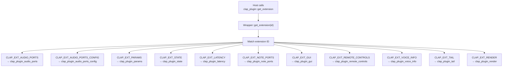

**Sources:** [src/wrapper/clap/wrapper.rs L1-L98](https://github.com/robbert-vdh/nih-plug/blob/28b149ec/src/wrapper/clap/wrapper.rs#L1-L98)

 [src/wrapper/clap/wrapper.rs L567-L698](https://github.com/robbert-vdh/nih-plug/blob/28b149ec/src/wrapper/clap/wrapper.rs#L567-L698)

The wrapper stores function pointer structs for each extension in the `Wrapper
` struct. The host queries extensions by calling `clap_plugin::get_extension` with an extension ID string, and the wrapper returns a pointer to the appropriate vtable struct.

### Extension Struct Pattern

Each extension follows a common pattern:

| Component | Description |
| --- | --- |
| **Extension ID** | String constant (e.g., `CLAP_EXT_PARAMS = "clap.params"`) |
| **Plugin Vtable** | Struct with function pointers the plugin implements (e.g., `clap_plugin_params`) |
| **Host Vtable** | Optional struct with callbacks the host provides (e.g., `clap_host_params`) |
| **Wrapper Storage** | Field in `Wrapper
` storing the vtable (e.g., `clap_plugin_params`) |
| **Host Cache** | Optional field caching host extension pointer (e.g., `host_params`) |

**Sources:** [src/wrapper/clap/wrapper.rs L103-L259](https://github.com/robbert-vdh/nih-plug/blob/28b149ec/src/wrapper/clap/wrapper.rs#L103-L259)

## Core Extensions

### Audio Ports Extension

The audio ports extension (`CLAP_EXT_AUDIO_PORTS`) describes the plugin's audio input and output configuration.

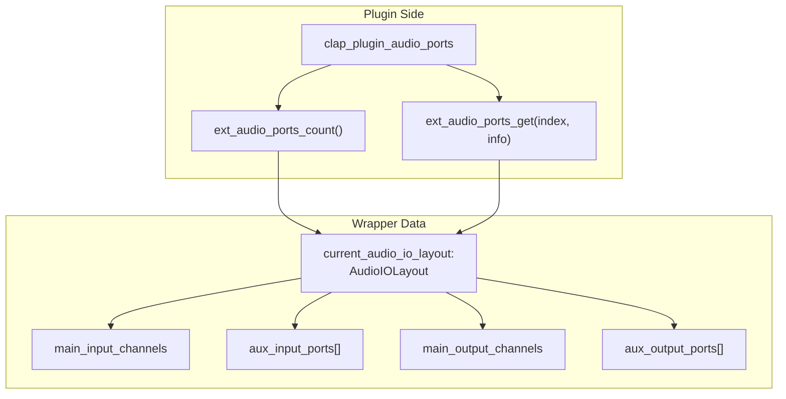

**Key Methods:**

* `ext_audio_ports_count`: Returns total number of input/output ports (main + auxiliary)
* `ext_audio_ports_get`: Fills `clap_audio_port_info` with port name, channel count, flags

The wrapper translates `Plugin::AUDIO_IO_LAYOUTS` into CLAP audio port information. Main ports are marked with `CLAP_AUDIO_PORT_IS_MAIN`, while auxiliary ports use index offsets.

**Sources:** [src/wrapper/clap/wrapper.rs L18-L21](https://github.com/robbert-vdh/nih-plug/blob/28b149ec/src/wrapper/clap/wrapper.rs#L18-L21)

 [src/wrapper/clap/wrapper.rs L178](https://github.com/robbert-vdh/nih-plug/blob/28b149ec/src/wrapper/clap/wrapper.rs#L178-L178)

 [src/wrapper/clap/wrapper.rs L594-L596](https://github.com/robbert-vdh/nih-plug/blob/28b149ec/src/wrapper/clap/wrapper.rs#L594-L596)

### Audio Ports Config Extension

The audio ports config extension (`CLAP_EXT_AUDIO_PORTS_CONFIG`) allows plugins to switch between different audio IO configurations.

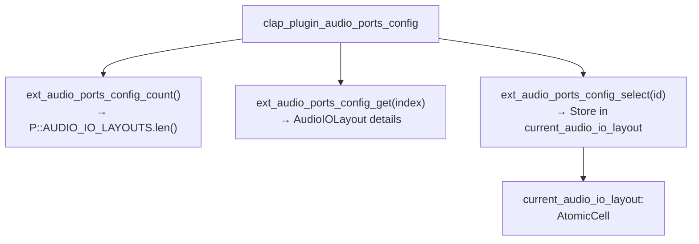

**Key Methods:**

* `ext_audio_ports_config_count`: Returns length of `Plugin::AUDIO_IO_LAYOUTS`
* `ext_audio_ports_config_get`: Provides configuration name and port counts for a layout
* `ext_audio_ports_config_select`: Switches to a specific layout, stores in `current_audio_io_layout`

**Sources:** [src/wrapper/clap/wrapper.rs L22-L24](https://github.com/robbert-vdh/nih-plug/blob/28b149ec/src/wrapper/clap/wrapper.rs#L22-L24)

 [src/wrapper/clap/wrapper.rs L169](https://github.com/robbert-vdh/nih-plug/blob/28b149ec/src/wrapper/clap/wrapper.rs#L169-L169)

 [src/wrapper/clap/wrapper.rs L588-L592](https://github.com/robbert-vdh/nih-plug/blob/28b149ec/src/wrapper/clap/wrapper.rs#L588-L592)

### Params Extension

The params extension (`CLAP_EXT_PARAMS`) exposes the plugin's parameters to the host for automation and UI display.

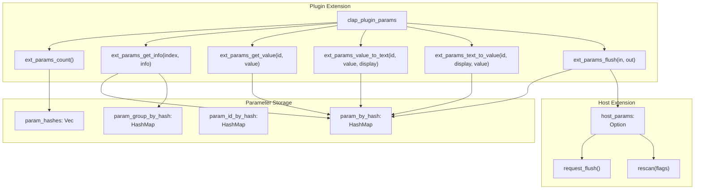

**Key Implementation Details:**

| Method | Purpose | Implementation |
| --- | --- | --- |
| `ext_params_count` | Returns total parameter count | Returns `param_hashes.len()` (or includes generated MIDI CC params if `P::MIDI_INPUT >= MidiConfig::MidiCCs`) |
| `ext_params_get_info` | Fills `clap_param_info` struct | Retrieves `ParamPtr` from `param_by_hash`, sets flags (automatable, hidden, bypass, stepped) |
| `ext_params_get_value` | Returns current normalized value | Calls `param_ptr.modulated_normalized_value()` |
| `ext_params_value_to_text` | Converts value to display string | Uses `param_ptr.normalized_value_to_string()` |
| `ext_params_text_to_value` | Parses display string to value | Uses `param_ptr.string_to_normalized_value()` |
| `ext_params_flush` | Handles parameter automation events | Processes `clap_input_events`, updates values, generates `clap_output_events` |

**Parameter Value Flow:**

CLAP uses "plain values" for discrete parameters (normalized value × step count). The wrapper handles conversion:

* `ClapParamUpdate::PlainValueSet`: Divides by step count to get normalized value
* `ClapParamUpdate::PlainValueMod`: Handles polyphonic modulation offsets

**Sources:** [src/wrapper/clap/wrapper.rs L37-L42](https://github.com/robbert-vdh/nih-plug/blob/28b149ec/src/wrapper/clap/wrapper.rs#L37-L42)

 [src/wrapper/clap/wrapper.rs L188-L224](https://github.com/robbert-vdh/nih-plug/blob/28b149ec/src/wrapper/clap/wrapper.rs#L188-L224)

 [src/wrapper/clap/wrapper.rs L628-L634](https://github.com/robbert-vdh/nih-plug/blob/28b149ec/src/wrapper/clap/wrapper.rs#L628-L634)

 [src/wrapper/clap/wrapper.rs L285-L294](https://github.com/robbert-vdh/nih-plug/blob/28b149ec/src/wrapper/clap/wrapper.rs#L285-L294)

### State Extension

The state extension (`CLAP_EXT_STATE`) handles plugin state serialization for preset management and session saving.

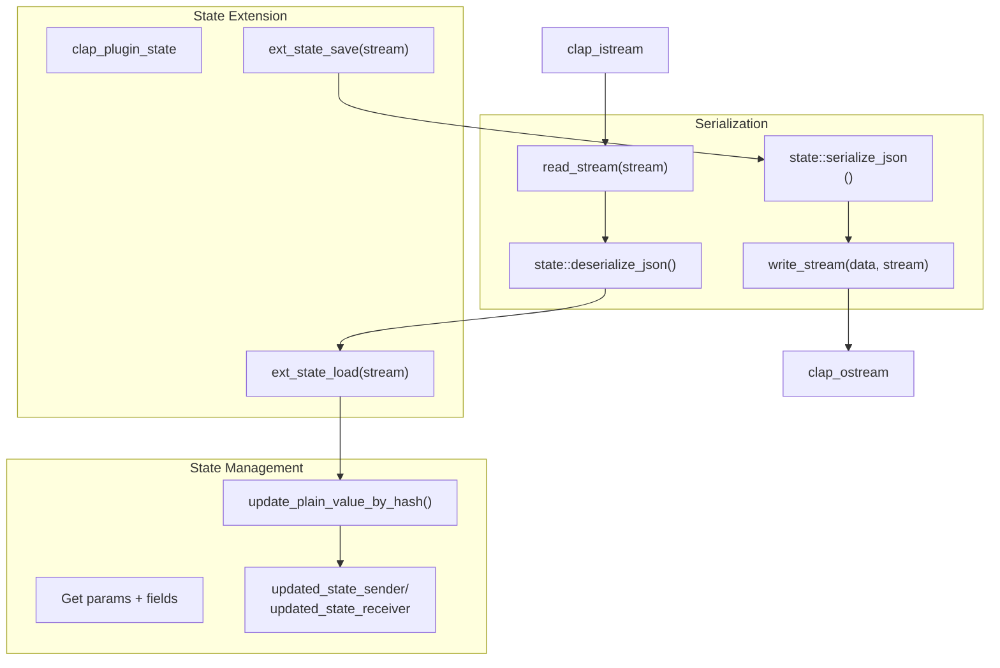

**Implementation Notes:**

* **Serialization Format:** JSON with optional Zstandard compression (see [State Serialization](/robbert-vdh/nih-plug/2.2.2-state-serialization))
* **Thread Safety:** State loading via GUI uses zero-capacity channel to prevent mid-processing changes
* **Round-trip Path:** `params` → `serialize_json` → `clap_ostream` → host → `clap_istream` → `deserialize_json` → `params`

**Sources:** [src/wrapper/clap/wrapper.rs L47](https://github.com/robbert-vdh/nih-plug/blob/28b149ec/src/wrapper/clap/wrapper.rs#L47-L47)

 [src/wrapper/clap/wrapper.rs L234](https://github.com/robbert-vdh/nih-plug/blob/28b149ec/src/wrapper/clap/wrapper.rs#L234-L234)

 [src/wrapper/clap/wrapper.rs L659-L662](https://github.com/robbert-vdh/nih-plug/blob/28b149ec/src/wrapper/clap/wrapper.rs#L659-L662)

 [src/wrapper/clap/wrapper.rs L154-L164](https://github.com/robbert-vdh/nih-plug/blob/28b149ec/src/wrapper/clap/wrapper.rs#L154-L164)

## Audio Processing Extensions

### Latency Extension

The latency extension (`CLAP_EXT_LATENCY`) reports and updates plugin processing latency.

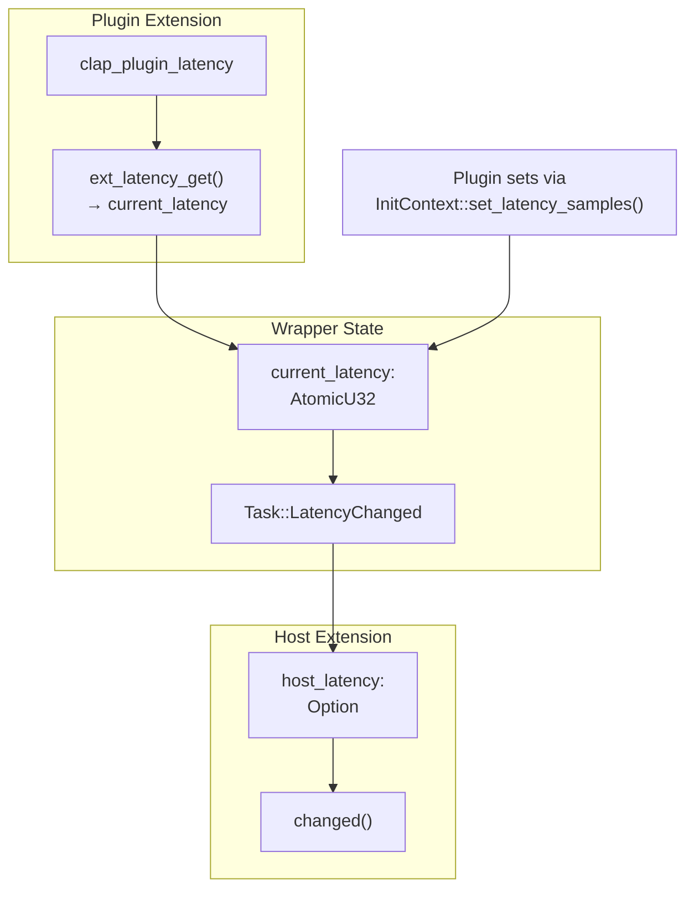

**Update Flow:**

1. Plugin calls `context.set_latency_samples(n)` during initialization or processing
2. Wrapper stores value in `current_latency: AtomicU32`
3. If changed, schedules `Task::LatencyChanged` on GUI thread
4. Task calls `host_latency.changed()` to notify host
5. Host may request restart or query new latency via `ext_latency_get`

**Sources:** [src/wrapper/clap/wrapper.rs L32](https://github.com/robbert-vdh/nih-plug/blob/28b149ec/src/wrapper/clap/wrapper.rs#L32-L32)

 [src/wrapper/clap/wrapper.rs L183-L184](https://github.com/robbert-vdh/nih-plug/blob/28b149ec/src/wrapper/clap/wrapper.rs#L183-L184)

 [src/wrapper/clap/wrapper.rs L150](https://github.com/robbert-vdh/nih-plug/blob/28b149ec/src/wrapper/clap/wrapper.rs#L150-L150)

 [src/wrapper/clap/wrapper.rs L618-L620](https://github.com/robbert-vdh/nih-plug/blob/28b149ec/src/wrapper/clap/wrapper.rs#L618-L620)

 [src/wrapper/clap/wrapper.rs L392-L407](https://github.com/robbert-vdh/nih-plug/blob/28b149ec/src/wrapper/clap/wrapper.rs#L392-L407)

### Tail Extension

The tail extension (`CLAP_EXT_TAIL`) informs the host about plugin tail time (reverb decay, delay feedback, etc.).

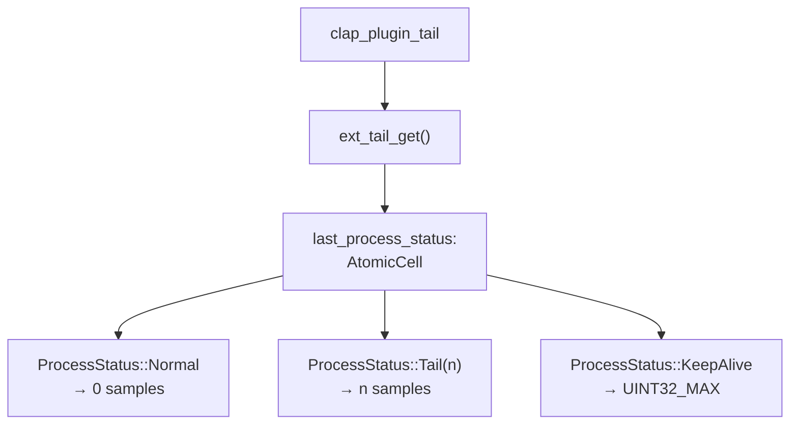

The plugin returns tail length from `Plugin::process()`. The wrapper caches this in `last_process_status` and converts to CLAP tail samples.

**Sources:** [src/wrapper/clap/wrapper.rs L48](https://github.com/robbert-vdh/nih-plug/blob/28b149ec/src/wrapper/clap/wrapper.rs#L48-L48)

 [src/wrapper/clap/wrapper.rs L236](https://github.com/robbert-vdh/nih-plug/blob/28b149ec/src/wrapper/clap/wrapper.rs#L236-L236)

 [src/wrapper/clap/wrapper.rs L147](https://github.com/robbert-vdh/nih-plug/blob/28b149ec/src/wrapper/clap/wrapper.rs#L147-L147)

 [src/wrapper/clap/wrapper.rs L664-L666](https://github.com/robbert-vdh/nih-plug/blob/28b149ec/src/wrapper/clap/wrapper.rs#L664-L666)

### Render Extension

The render extension (`CLAP_EXT_RENDER`) allows switching between realtime and offline rendering modes.

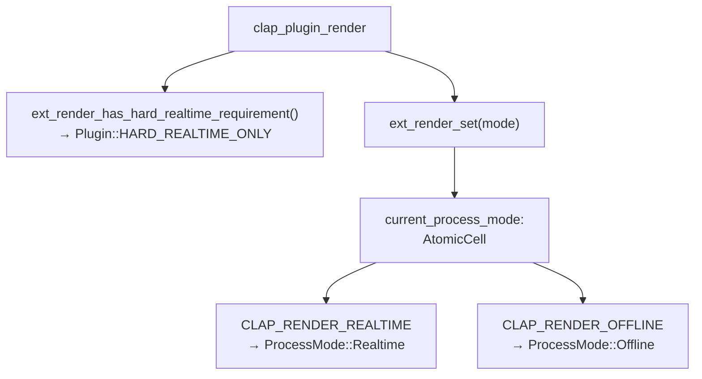

**Hard Realtime Requirement:** If `Plugin::HARD_REALTIME_ONLY` is true, the plugin cannot be used for offline rendering (bouncing). Most plugins return `false`.

**Sources:** [src/wrapper/clap/wrapper.rs L43-L46](https://github.com/robbert-vdh/nih-plug/blob/28b149ec/src/wrapper/clap/wrapper.rs#L43-L46)

 [src/wrapper/clap/wrapper.rs L232](https://github.com/robbert-vdh/nih-plug/blob/28b149ec/src/wrapper/clap/wrapper.rs#L232-L232)

 [src/wrapper/clap/wrapper.rs L136](https://github.com/robbert-vdh/nih-plug/blob/28b149ec/src/wrapper/clap/wrapper.rs#L136-L136)

 [src/wrapper/clap/wrapper.rs L654-L657](https://github.com/robbert-vdh/nih-plug/blob/28b149ec/src/wrapper/clap/wrapper.rs#L654-L657)

## MIDI and Note Extensions

### Note Ports Extension

The note ports extension (`CLAP_EXT_NOTE_PORTS`) declares MIDI/note input and output capabilities.

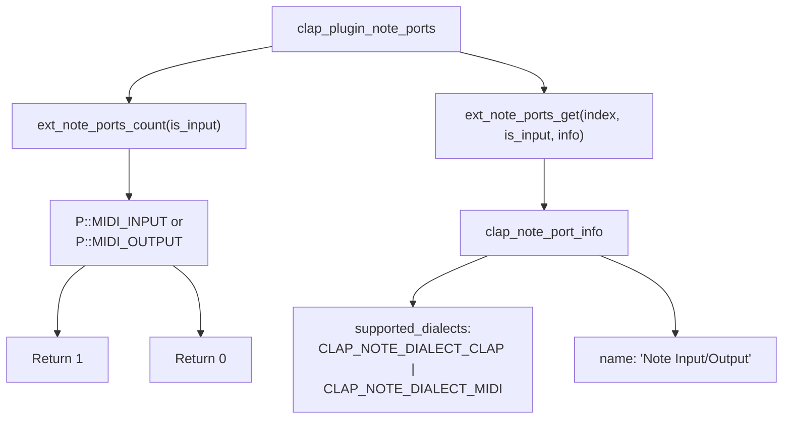

**Supported Dialects:**

* `CLAP_NOTE_DIALECT_CLAP`: Native CLAP note events with voice IDs and expressions
* `CLAP_NOTE_DIALECT_MIDI`: Standard MIDI events (if `P::MIDI_INPUT >= MidiConfig::MidiCCs`)

**Sources:** [src/wrapper/clap/wrapper.rs L33-L36](https://github.com/robbert-vdh/nih-plug/blob/28b149ec/src/wrapper/clap/wrapper.rs#L33-L36)

 [src/wrapper/clap/wrapper.rs L186](https://github.com/robbert-vdh/nih-plug/blob/28b149ec/src/wrapper/clap/wrapper.rs#L186-L186)

 [src/wrapper/clap/wrapper.rs L623-L626](https://github.com/robbert-vdh/nih-plug/blob/28b149ec/src/wrapper/clap/wrapper.rs#L623-L626)

### Event Processing

CLAP sends note events through `clap_input_events` during processing. The wrapper translates these to `NoteEvent
`:

| CLAP Event Type | NIH-plug Event |
| --- | --- |
| `CLAP_EVENT_NOTE_ON` | `NoteEvent::NoteOn { voice_id, channel, note, velocity }` |
| `CLAP_EVENT_NOTE_OFF` | `NoteEvent::NoteOff { voice_id, channel, note, velocity }` |
| `CLAP_EVENT_NOTE_CHOKE` | `NoteEvent::Choke { voice_id, channel, note }` |
| `CLAP_EVENT_NOTE_END` | `NoteEvent::VoiceTerminated { voice_id, channel, note }` |
| `CLAP_EVENT_NOTE_EXPRESSION` | `NoteEvent::Poly*` variants (pressure, volume, pan, tuning, vibrato, expression, brightness) |
| `CLAP_EVENT_MIDI` | `NoteEvent::MidiCC`, `MidiChannelPressure`, `MidiPitchBend`, `MidiProgramChange` |
| `CLAP_EVENT_MIDI_SYSEX` | `NoteEvent::MidiSysEx { message }` |

**Event Handling Code:**
[src/wrapper/clap/wrapper.rs L1434-L1540](https://github.com/robbert-vdh/nih-plug/blob/28b149ec/src/wrapper/clap/wrapper.rs#L1434-L1540)

**Sources:** [src/wrapper/clap/wrapper.rs L3-L17](https://github.com/robbert-vdh/nih-plug/blob/28b149ec/src/wrapper/clap/wrapper.rs#L3-L17)

 [src/wrapper/clap/wrapper.rs L882-L1057](https://github.com/robbert-vdh/nih-plug/blob/28b149ec/src/wrapper/clap/wrapper.rs#L882-L1057)

## Advanced Extensions

### Voice Info Extension

The voice info extension (`CLAP_EXT_VOICE_INFO`) supports polyphonic modulation for instruments.

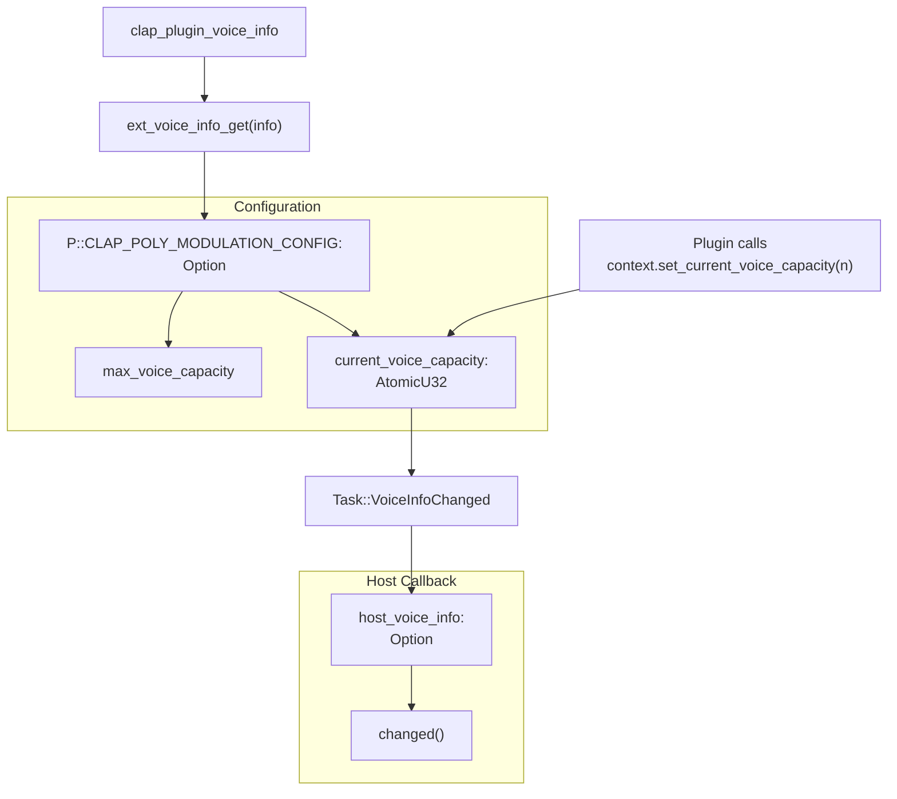

**Polyphonic Modulation IDs:**

For parameters with `ParamFlags::POLYPHONIC_MODULATION`, the wrapper generates `poly_mod_ids_by_hash` mapping parameter hashes to poly modulation IDs. These IDs are passed to the plugin through `NoteEvent::PolyModulation`.

**Sources:** [src/wrapper/clap/wrapper.rs L50-L53](https://github.com/robbert-vdh/nih-plug/blob/28b149ec/src/wrapper/clap/wrapper.rs#L50-L53)

 [src/wrapper/clap/wrapper.rs L238-L243](https://github.com/robbert-vdh/nih-plug/blob/28b149ec/src/wrapper/clap/wrapper.rs#L238-L243)

 [src/wrapper/clap/wrapper.rs L214-L217](https://github.com/robbert-vdh/nih-plug/blob/28b149ec/src/wrapper/clap/wrapper.rs#L214-L217)

 [src/wrapper/clap/wrapper.rs L668-L670](https://github.com/robbert-vdh/nih-plug/blob/28b149ec/src/wrapper/clap/wrapper.rs#L668-L670)

 [src/wrapper/clap/wrapper.rs L408-L414](https://github.com/robbert-vdh/nih-plug/blob/28b149ec/src/wrapper/clap/wrapper.rs#L408-L414)

### Remote Controls Extension

The remote controls extension (`CLAP_EXT_REMOTE_CONTROLS`) provides curated parameter pages for hardware controllers.

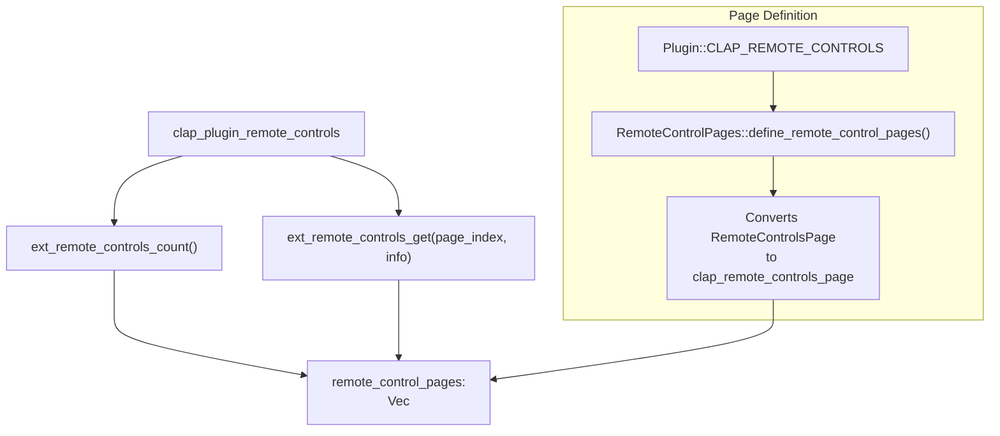

**Page Structure:**

Each page contains:

* `section_name`: Display name for the page
* `page_name`: Page identifier
* `param_ids`: Up to 8 parameter IDs for the page
* `is_for_preset`: Whether page settings should be stored per preset

The wrapper converts `Plugin::CLAP_REMOTE_CONTROLS` into CLAP page structs during initialization.

**Sources:** [src/wrapper/clap/wrapper.rs L25-L27](https://github.com/robbert-vdh/nih-plug/blob/28b149ec/src/wrapper/clap/wrapper.rs#L25-L27)

 [src/wrapper/clap/wrapper.rs L228-L230](https://github.com/robbert-vdh/nih-plug/blob/28b149ec/src/wrapper/clap/wrapper.rs#L228-L230)

 [src/wrapper/clap/wrapper.rs L527-L533](https://github.com/robbert-vdh/nih-plug/blob/28b149ec/src/wrapper/clap/wrapper.rs#L527-L533)

 [src/wrapper/clap/wrapper.rs L648-L651](https://github.com/robbert-vdh/nih-plug/blob/28b149ec/src/wrapper/clap/wrapper.rs#L648-L651)

 [src/wrapper/clap/context.rs L1-L91](https://github.com/robbert-vdh/nih-plug/blob/28b149ec/src/wrapper/clap/context.rs#L1-L91)

### GUI Extension

The GUI extension (`CLAP_EXT_GUI`) manages the plugin's editor window lifecycle.

```mermaid
flowchart TD

GUIExt["clap_plugin_gui"]
IsAPISupported["ext_gui_is_api_supported(api)"]
GetPreferred["ext_gui_get_preferred_api()"]
Create["ext_gui_create(api)"]
Destroy["ext_gui_destroy()"]
Show["ext_gui_show()"]
Hide["ext_gui_hide()"]
SetScale["ext_gui_set_scale(factor)"]
GetSize["ext_gui_get_size(width, height)"]
CanResize["ext_gui_can_resize()"]
GetHints["ext_gui_get_resize_hints(hints)"]
AdjustSize["ext_gui_adjust_size(width, height)"]
SetSize["ext_gui_set_size(width, height)"]
SetParent["ext_gui_set_parent(window)"]
SetTransient["ext_gui_set_transient(window)"]
SuggestTitle["ext_gui_suggest_title(title)"]

GUIExt --> IsAPISupported
GUIExt --> GetPreferred
GUIExt --> Create
GUIExt --> Destroy
GUIExt --> SetScale
GUIExt --> GetSize
GUIExt --> CanResize
GUIExt --> GetHints
GUIExt --> AdjustSize
GUIExt --> SetSize
GUIExt --> SetParent
GUIExt --> SetTransient
GUIExt --> SuggestTitle
GUIExt --> Show
GUIExt --> Hide

subgraph Parenting ["Parenting"]
    SetParent
    SetTransient
    SuggestTitle
end

subgraph Sizing ["Sizing"]
    SetScale
    GetSize
    CanResize
    GetHints
    AdjustSize
    SetSize
end

subgraph Lifecycle ["Lifecycle"]
    Create
    Destroy
    Show
    Hide
end

subgraph Capabilities ["Capabilities"]
    IsAPISupported
    GetPreferred
end
```

**Platform-Specific APIs:**

| Platform | API Constant |
| --- | --- |
| Windows | `CLAP_WINDOW_API_WIN32` |
| macOS | `CLAP_WINDOW_API_COCOA` |
| Linux | `CLAP_WINDOW_API_X11` |

**Editor State:**

The wrapper stores editor-related state:

* `editor: AtomicRefCell<Option<Mutex<Box<dyn Editor>>>>`: The editor instance
* `editor_handle: Mutex<Option<Box<dyn Any + Send>>>`: Platform-specific window handle
* `editor_scaling_factor: AtomicF32`: DPI scaling (defaults to 1.0)
* `host_gui: AtomicRefCell<Option<ClapPtr<clap_host_gui>>>`: Host GUI extension for resize requests

**Resize Protocol:**

1. Plugin calls `context.request_resize()` when size changes
2. Wrapper invokes `host_gui.request_resize(width, height)`
3. Host may call `set_size()` to approve or `adjust_size()` to negotiate
4. Plugin adjusts to final size via `Editor::set_size()`

**Sources:** [src/wrapper/clap/wrapper.rs L28-L31](https://github.com/robbert-vdh/nih-plug/blob/28b149ec/src/wrapper/clap/wrapper.rs#L28-L31)

 [src/wrapper/clap/wrapper.rs L180-L181](https://github.com/robbert-vdh/nih-plug/blob/28b149ec/src/wrapper/clap/wrapper.rs#L180-L181)

 [src/wrapper/clap/wrapper.rs L115-L126](https://github.com/robbert-vdh/nih-plug/blob/28b149ec/src/wrapper/clap/wrapper.rs#L115-L126)

 [src/wrapper/clap/wrapper.rs L599-L615](https://github.com/robbert-vdh/nih-plug/blob/28b149ec/src/wrapper/clap/wrapper.rs#L599-L615)

 [src/wrapper/clap/wrapper.rs L789-L811](https://github.com/robbert-vdh/nih-plug/blob/28b149ec/src/wrapper/clap/wrapper.rs#L789-L811)

### Thread Check Extension

The thread check extension (`CLAP_EXT_THREAD_CHECK`) helps verify thread safety.

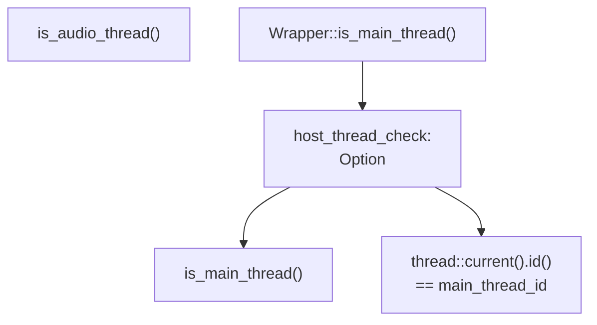

The wrapper uses this extension to verify whether code is running on the main thread, which is critical for operations like GUI updates and host callbacks. If unavailable, it falls back to comparing thread IDs.

**Sources:** [src/wrapper/clap/wrapper.rs L49](https://github.com/robbert-vdh/nih-plug/blob/28b149ec/src/wrapper/clap/wrapper.rs#L49-L49)

 [src/wrapper/clap/wrapper.rs L226](https://github.com/robbert-vdh/nih-plug/blob/28b149ec/src/wrapper/clap/wrapper.rs#L226-L226)

 [src/wrapper/clap/wrapper.rs L255](https://github.com/robbert-vdh/nih-plug/blob/28b149ec/src/wrapper/clap/wrapper.rs#L255-L255)

 [src/wrapper/clap/wrapper.rs L346-L357](https://github.com/robbert-vdh/nih-plug/blob/28b149ec/src/wrapper/clap/wrapper.rs#L346-L357)

## Extension Initialization

### Wrapper Constructor

During `Wrapper::new()`, the wrapper initializes all extension vtables:

```mermaid
flowchart TD

New["Wrapper::new(host_callback)"]
InitAudioPorts["clap_plugin_audio_ports"]
InitAudioPortsConfig["clap_plugin_audio_ports_config"]
InitParams["clap_plugin_params"]
InitState["clap_plugin_state"]
InitLatency["clap_plugin_latency"]
InitNotePorts["clap_plugin_note_ports"]
InitGUI["clap_plugin_gui"]
InitRemoteControls["clap_plugin_remote_controls"]
InitVoiceInfo["clap_plugin_voice_info"]
InitTail["clap_plugin_tail"]
InitRender["clap_plugin_render"]
ParamSetup["Build param_by_hash,<br>param_id_to_hash,<br>poly_mod_ids_by_hash"]
RemoteSetup["RemoteControlPages::<br>define_remote_control_pages()"]

New --> InitAudioPorts
New --> InitAudioPortsConfig
New --> InitParams
New --> InitState
New --> InitLatency
New --> InitNotePorts
New --> InitGUI
New --> InitRemoteControls
New --> InitVoiceInfo
New --> InitTail
New --> InitRender
New --> ParamSetup
New --> RemoteSetup

subgraph subGraph0 ["Plugin Extensions"]
    InitAudioPorts
    InitAudioPortsConfig
    InitParams
    InitState
    InitLatency
    InitNotePorts
    InitGUI
    InitRemoteControls
    InitVoiceInfo
    InitTail
    InitRender
end
```

**Host Extension Discovery:**

Host extensions are queried after plugin initialization:

1. Plugin's `init()` function is called
2. Wrapper caches `host_callback` pointer
3. For each needed host extension, wrapper calls `host_callback.get_extension(id)`
4. Extension pointers are stored in `AtomicRefCell<Option<ClapPtr<...>>>` fields

**Sources:** [src/wrapper/clap/wrapper.rs L426-L728](https://github.com/robbert-vdh/nih-plug/blob/28b149ec/src/wrapper/clap/wrapper.rs#L426-L728)

 [src/wrapper/clap/wrapper.rs L430-L533](https://github.com/robbert-vdh/nih-plug/blob/28b149ec/src/wrapper/clap/wrapper.rs#L430-L533)

## Summary Table

| Extension | Plugin Provides | Host Provides | Purpose |
| --- | --- | --- | --- |
| **audio-ports** | Port count, info | — | Describe audio routing |
| **audio-ports-config** | Layout list, selection | — | Switch audio configurations |
| **params** | Count, info, value conversion, flush | `request_flush()`, `rescan()` | Parameter automation |
| **state** | Save, load | — | Preset/session state |
| **latency** | Get samples | `changed()` | Latency compensation |
| **note-ports** | Port count, info | — | MIDI/note capabilities |
| **gui** | Lifecycle, sizing, parenting | `request_resize()`, `closed()` | Editor window management |
| **remote-controls** | Page count, definitions | — | Hardware controller mapping |
| **voice-info** | Voice capacity, modulation support | `changed()` | Polyphonic modulation |
| **tail** | Get tail samples | — | Effect tail/decay time |
| **render** | Hard realtime requirement, mode setter | — | Offline rendering support |
| **thread-check** | — | `is_main_thread()`, `is_audio_thread()` | Thread safety verification |

**Sources:** [src/wrapper/clap/wrapper.rs L1-L259](https://github.com/robbert-vdh/nih-plug/blob/28b149ec/src/wrapper/clap/wrapper.rs#L1-L259)

 [src/wrapper/clap/wrapper.rs L426-L728](https://github.com/robbert-vdh/nih-plug/blob/28b149ec/src/wrapper/clap/wrapper.rs#L426-L728)