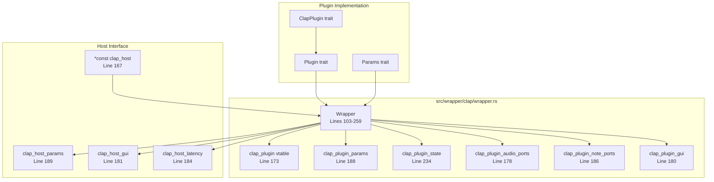
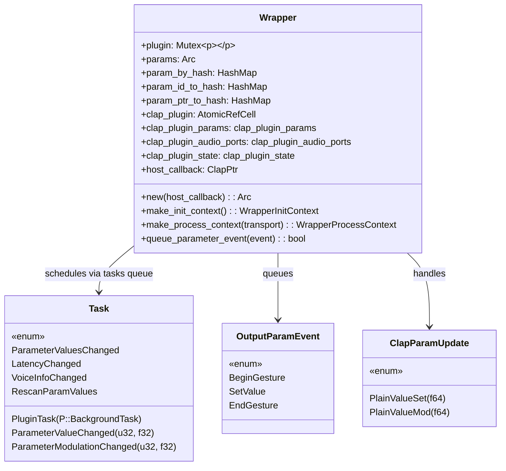
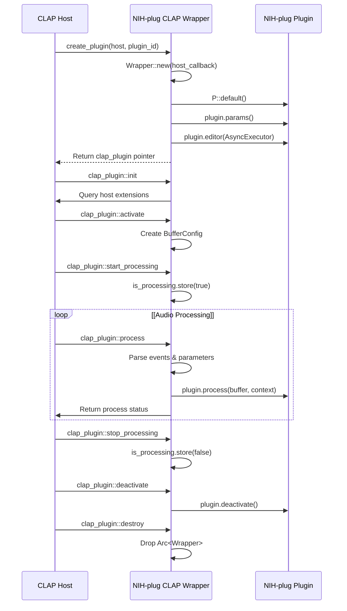
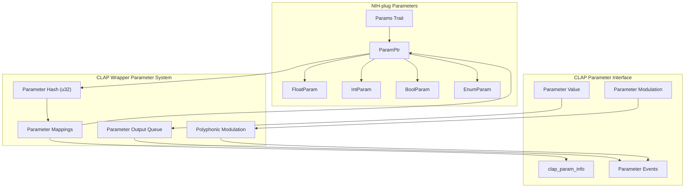
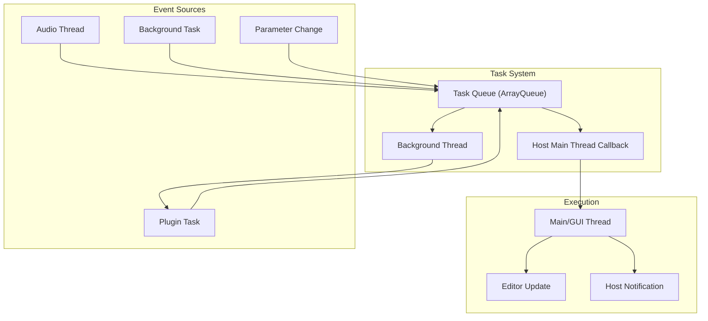
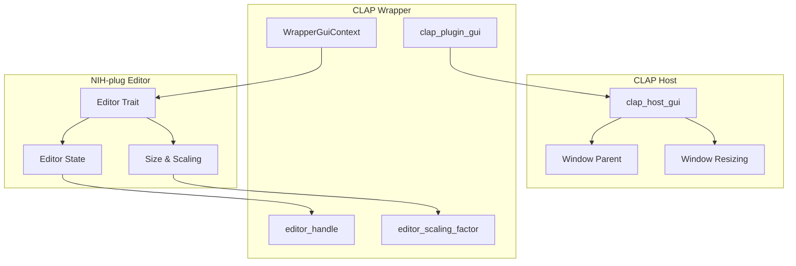
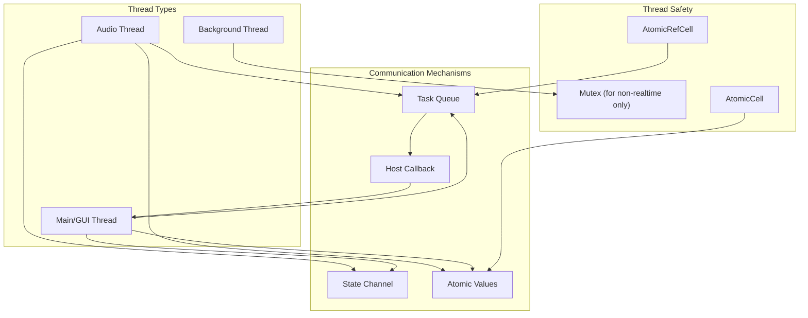

# CLAP Wrapper

> **Relevant source files**
> * [src/wrapper/clap/wrapper.rs](https://github.com/robbert-vdh/nih-plug/blob/28b149ec/src/wrapper/clap/wrapper.rs)
> * [src/wrapper/vst3/inner.rs](https://github.com/robbert-vdh/nih-plug/blob/28b149ec/src/wrapper/vst3/inner.rs)
> * [src/wrapper/vst3/wrapper.rs](https://github.com/robbert-vdh/nih-plug/blob/28b149ec/src/wrapper/vst3/wrapper.rs)

The CLAP (CLever Audio Plugin) wrapper translates NIH-plug's generic `Plugin` trait into the CLAP plugin format. This page documents the wrapper architecture, the `nih_export_clap!` macro, and CLAP's extension system. For the VST3 wrapper, see page 3.1.

## Architecture Overview

The CLAP wrapper implements the `clap_plugin` interface and manages the plugin lifecycle, parameter system, event handling, and extensions. Unlike VST3's COM-based architecture, CLAP uses a simpler C API with function pointers and extension discovery.

**CLAP Wrapper Structure**



Sources: [src/wrapper/clap/wrapper.rs L103-L259](https://github.com/robbert-vdh/nih-plug/blob/28b149ec/src/wrapper/clap/wrapper.rs#L103-L259)

 [src/wrapper/clap.rs L1-L17](https://github.com/robbert-vdh/nih-plug/blob/28b149ec/src/wrapper/clap.rs#L1-L17)

## Wrapper Structure

### Wrapper<P: ClapPlugin>

The `Wrapper<P>` struct [src/wrapper/clap/wrapper.rs L103-L259](https://github.com/robbert-vdh/nih-plug/blob/28b149ec/src/wrapper/clap/wrapper.rs#L103-L259)

 is the central adapter that implements all CLAP interfaces. Key fields:

**Core Plugin State**

* `plugin: Mutex<P>` - The wrapped plugin instance [Line 108](https://github.com/robbert-vdh/nih-plug/blob/28b149ec/Line 108)
* `params: Arc<dyn Params>` - Plugin parameters, fetched once during initialization [Line 114](https://github.com/robbert-vdh/nih-plug/blob/28b149ec/Line 114)
* `editor: AtomicRefCell<Option<Mutex<Box<dyn Editor>>>>` - Plugin editor instance [Line 118](https://github.com/robbert-vdh/nih-plug/blob/28b149ec/Line 118)
* `task_executor: Mutex<TaskExecutor<P>>` - Background task executor [Line 110](https://github.com/robbert-vdh/nih-plug/blob/28b149ec/Line 110)

**Audio Processing State**

* `is_processing: AtomicBool` - Whether audio processing is active [Line 128](https://github.com/robbert-vdh/nih-plug/blob/28b149ec/Line 128)
* `current_audio_io_layout: AtomicCell<AudioIOLayout>` - Active bus arrangement [Line 131](https://github.com/robbert-vdh/nih-plug/blob/28b149ec/Line 131)
* `current_buffer_config: AtomicCell<Option<BufferConfig>>` - Sample rate and buffer size [Line 134](https://github.com/robbert-vdh/nih-plug/blob/28b149ec/Line 134)
* `current_process_mode: AtomicCell<ProcessMode>` - Realtime vs offline [Line 136](https://github.com/robbert-vdh/nih-plug/blob/28b149ec/Line 136)
* `buffer_manager: AtomicRefCell<BufferManager>` - Manages buffer allocations [Line 153](https://github.com/robbert-vdh/nih-plug/blob/28b149ec/Line 153)

**Event Handling**

* `input_events: AtomicRefCell<VecDeque<PluginNoteEvent<P>>>` - Incoming MIDI/note events [Line 142](https://github.com/robbert-vdh/nih-plug/blob/28b149ec/Line 142)
* `output_events: AtomicRefCell<VecDeque<PluginNoteEvent<P>>>` - Outgoing events [Line 145](https://github.com/robbert-vdh/nih-plug/blob/28b149ec/Line 145)
* `output_parameter_events: ArrayQueue<OutputParamEvent>` - Parameter change queue [Line 224](https://github.com/robbert-vdh/nih-plug/blob/28b149ec/Line 224)

**State Management**

* `updated_state_sender: channel::Sender<PluginState>` - Zero-capacity channel for state updates [Line 162](https://github.com/robbert-vdh/nih-plug/blob/28b149ec/Line 162)
* `updated_state_receiver: channel::Receiver<PluginState>` - Receives state from audio thread [Line 164](https://github.com/robbert-vdh/nih-plug/blob/28b149ec/Line 164)

Sources: [src/wrapper/clap/wrapper.rs L103-L259](https://github.com/robbert-vdh/nih-plug/blob/28b149ec/src/wrapper/clap/wrapper.rs#L103-L259)

**Wrapper Key Data Structures**



Sources: [src/wrapper/clap/wrapper.rs L103-L259](https://github.com/robbert-vdh/nih-plug/blob/28b149ec/src/wrapper/clap/wrapper.rs#L103-L259)

 [src/wrapper/clap/wrapper.rs L264-L282](https://github.com/robbert-vdh/nih-plug/blob/28b149ec/src/wrapper/clap/wrapper.rs#L264-L282)

 [src/wrapper/clap/wrapper.rs L285-L293](https://github.com/robbert-vdh/nih-plug/blob/28b149ec/src/wrapper/clap/wrapper.rs#L285-L293)

 [src/wrapper/clap/wrapper.rs L298-L313](https://github.com/robbert-vdh/nih-plug/blob/28b149ec/src/wrapper/clap/wrapper.rs#L298-L313)

### Context Objects

The wrapper creates specialized context objects for different plugin lifecycle phases [src/wrapper/clap/context.rs L1-L500](https://github.com/robbert-vdh/nih-plug/blob/28b149ec/src/wrapper/clap/context.rs#L1-L500)

:

| Context | Created In | Purpose | Key Methods |
| --- | --- | --- | --- |
| `WrapperInitContext<'_, P>` | `Plugin::initialize()` | One-time setup | `set_latency_samples()`, `set_current_voice_capacity()` |
| `WrapperProcessContext<'_, P>` | `Plugin::process()` | Audio processing | `next_event()`, `send_event()`, `set_latency_samples()` |
| `WrapperGuiContext<P>` | Editor creation | GUI operations | `set_state()`, `get_state()`, parameter gestures |

**Context Creation** [src/wrapper/clap/wrapper.rs L742-L756](https://github.com/robbert-vdh/nih-plug/blob/28b149ec/src/wrapper/clap/wrapper.rs#L742-L756)

:

```rust
fn make_init_context(&self) -> WrapperInitContext<'_, P>
fn make_process_context(&self, transport: Transport) -> WrapperProcessContext<'_, P>
fn make_gui_context(self: Arc<Self>) -> Arc<WrapperGuiContext<P>>
```

Sources: [src/wrapper/clap/wrapper.rs L742-L756](https://github.com/robbert-vdh/nih-plug/blob/28b149ec/src/wrapper/clap/wrapper.rs#L742-L756)

 [src/wrapper/clap/context.rs L1-L500](https://github.com/robbert-vdh/nih-plug/blob/28b149ec/src/wrapper/clap/context.rs#L1-L500)

## Plugin Lifecycle

The CLAP wrapper handles the complete lifecycle of a plugin from creation to destruction.



Sources: [src/wrapper/clap/wrapper.rs L426-L727](https://github.com/robbert-vdh/nih-plug/blob/28b149ec/src/wrapper/clap/wrapper.rs#L426-L727)

 [src/wrapper/clap.rs L83-L114](https://github.com/robbert-vdh/nih-plug/blob/28b149ec/src/wrapper/clap.rs#L83-L114)

### Initialization

During initialization, the wrapper:

1. Creates a new plugin instance with `P::default()`
2. Retrieves and organizes the plugin's parameters
3. Creates mappings between parameter IDs, hashes, and pointers
4. Sets up the plugin's editor if available
5. Initializes extension interfaces

Sources: [src/wrapper/clap/wrapper.rs L426-L727](https://github.com/robbert-vdh/nih-plug/blob/28b149ec/src/wrapper/clap/wrapper.rs#L426-L727)

### Processing

The audio processing flow involves:

1. Parsing incoming CLAP events into NIH-plug events
2. Handling parameter changes
3. Calling the plugin's `process` method
4. Processing output events and parameter changes
5. Returning the appropriate processing status to the host

The wrapper handles timing and synchronization of events to ensure sample-accurate processing.

Sources: [src/wrapper/clap/wrapper.rs L582-L597](https://github.com/robbert-vdh/nih-plug/blob/28b149ec/src/wrapper/clap/wrapper.rs#L582-L597)

## Parameter System

The CLAP wrapper implements a parameter system that bridges between NIH-plug's parameter representation and CLAP's parameter interface.



Sources: [src/wrapper/clap/wrapper.rs L194-L224](https://github.com/robbert-vdh/nih-plug/blob/28b149ec/src/wrapper/clap/wrapper.rs#L194-L224)

 [src/wrapper/clap/wrapper.rs L453-L480](https://github.com/robbert-vdh/nih-plug/blob/28b149ec/src/wrapper/clap/wrapper.rs#L453-L480)

### Parameter Representation

Parameters in NIH-plug are identified by string IDs, which are hashed to numeric IDs for CLAP. The wrapper maintains several mappings:

* `param_hashes`: Vector of parameter hashes in stable order
* `param_by_hash`: Maps parameter hashes to `ParamPtr`
* `param_id_by_hash`: Maps parameter hashes to string IDs
* `param_ptr_to_hash`: Maps `ParamPtr` to parameter hashes

These mappings enable efficient parameter lookups from both CLAP's numeric perspective and NIH-plug's pointer-based approach.

Sources: [src/wrapper/clap/wrapper.rs L453-L480](https://github.com/robbert-vdh/nih-plug/blob/28b149ec/src/wrapper/clap/wrapper.rs#L453-L480)

### Parameter Events

Parameter changes are communicated through the `OutputParamEvent` enum:

* `BeginGesture`: Start of a parameter automation gesture
* `SetValue`: Change a parameter value
* `EndGesture`: End of a parameter automation gesture

These events are queued and sent to the host at appropriate times.

Sources: [src/wrapper/clap/wrapper.rs L298-L313](https://github.com/robbert-vdh/nih-plug/blob/28b149ec/src/wrapper/clap/wrapper.rs#L298-L313)

 [src/wrapper/clap/wrapper.rs L768-L787](https://github.com/robbert-vdh/nih-plug/blob/28b149ec/src/wrapper/clap/wrapper.rs#L768-L787)

## Event Handling

The CLAP wrapper handles various types of events:

### Note Events

MIDI and note events are processed through the `input_events` and `output_events` queues. The wrapper translates between CLAP's event formats and NIH-plug's `PluginNoteEvent` type.

Sources: [src/wrapper/clap/wrapper.rs L152-L157](https://github.com/robbert-vdh/nih-plug/blob/28b149ec/src/wrapper/clap/wrapper.rs#L152-L157)

 [src/wrapper/clap/wrapper.rs L158-L160](https://github.com/robbert-vdh/nih-plug/blob/28b149ec/src/wrapper/clap/wrapper.rs#L158-L160)

### Task System

The CLAP wrapper includes a task execution system for non-blocking, realtime-safe communication between threads:



Sources: [src/wrapper/clap/wrapper.rs L264-L282](https://github.com/robbert-vdh/nih-plug/blob/28b149ec/src/wrapper/clap/wrapper.rs#L264-L282)

 [src/wrapper/clap/wrapper.rs L317-L358](https://github.com/robbert-vdh/nih-plug/blob/28b149ec/src/wrapper/clap/wrapper.rs#L317-L358)

 [src/wrapper/clap/wrapper.rs L360-L423](https://github.com/robbert-vdh/nih-plug/blob/28b149ec/src/wrapper/clap/wrapper.rs#L360-L423)

## State Management

The CLAP wrapper supports saving and loading plugin state through the CLAP state extension.

### State Saving

When saving state, the wrapper:

1. Serializes parameter values from the plugin
2. Serializes any additional fields from the plugin's `Params` implementation
3. Writes the serialized data to the CLAP stream

Sources: [src/wrapper/clap/wrapper.rs L232-L245](https://github.com/robbert-vdh/nih-plug/blob/28b149ec/src/wrapper/clap/wrapper.rs#L232-L245)

### State Loading

When loading state, the wrapper:

1. Reads serialized data from the CLAP stream
2. Deserializes parameter values and additional fields
3. Updates the plugin's parameters
4. Reinitializes the plugin if necessary

The wrapper includes a mechanism for safely loading state even while audio is processing, by deferring the state update to the end of the audio processing cycle.

Sources: [src/wrapper/clap/wrapper.rs L162-L167](https://github.com/robbert-vdh/nih-plug/blob/28b149ec/src/wrapper/clap/wrapper.rs#L162-L167)

 [src/wrapper/clap/wrapper.rs L559-L564](https://github.com/robbert-vdh/nih-plug/blob/28b149ec/src/wrapper/clap/wrapper.rs#L559-L564)

## GUI Integration

The CLAP wrapper provides UI support through the CLAP GUI extension.



Sources: [src/wrapper/clap/wrapper.rs L126-L144](https://github.com/robbert-vdh/nih-plug/blob/28b149ec/src/wrapper/clap/wrapper.rs#L126-L144)

 [src/wrapper/clap/wrapper.rs L599-L616](https://github.com/robbert-vdh/nih-plug/blob/28b149ec/src/wrapper/clap/wrapper.rs#L599-L616)

### Editor Creation

When the host requests a plugin editor, the wrapper:

1. Creates the editor using the plugin's `Editor` implementation
2. Sets up the appropriate parent window
3. Handles scaling and size negotiation
4. Establishes communication channels for parameter updates

Sources: [src/wrapper/clap/wrapper.rs L599-L616](https://github.com/robbert-vdh/nih-plug/blob/28b149ec/src/wrapper/clap/wrapper.rs#L599-L616)

### Parameter Updates

The editor is notified of parameter changes through the task system:

* `ParameterValuesChanged`: Multiple parameters changed
* `ParameterValueChanged`: A single parameter changed
* `ParameterModulationChanged`: Modulation of a parameter changed

Sources: [src/wrapper/clap/wrapper.rs L364-L390](https://github.com/robbert-vdh/nih-plug/blob/28b149ec/src/wrapper/clap/wrapper.rs#L364-L390)

## Export Mechanism

### The nih_export_clap! Macro

The `nih_export_clap!` macro generates the C entry point and plugin factory required by CLAP hosts:

```
nih_export_clap!(MyPlugin);
```

**Macro Expansion**

The macro expands to [src/wrapper/clap.rs L18-L143](https://github.com/robbert-vdh/nih-plug/blob/28b149ec/src/wrapper/clap.rs#L18-L143)

:

1. **Entry Point Function**: `clap_entry` - The host calls this to obtain the plugin factory ```javascript #[no_mangle] pub extern "C" fn clap_entry(path: *const c_char) -> *const clap_plugin_entry ```
2. **Factory Implementation**: Returns a `clap_plugin_factory` with: * `get_plugin_count`: Returns 1 (single plugin per library) * `get_plugin_descriptor`: Returns plugin metadata via `PluginDescriptor` * `create_plugin`: Instantiates `Wrapper<P>` with host callback
3. **Plugin Instantiation**: `Factory::create_plugin()` [src/wrapper/clap.rs L83-L114](https://github.com/robbert-vdh/nih-plug/blob/28b149ec/src/wrapper/clap.rs#L83-L114) * Validates plugin ID matches * Calls `Wrapper::<P>::new(host)` [src/wrapper/clap/wrapper.rs L426-L727](https://github.com/robbert-vdh/nih-plug/blob/28b149ec/src/wrapper/clap/wrapper.rs#L426-L727) * Returns raw pointer to `clap_plugin` vtable

**Factory Table**

| Function | Purpose | Implementation |
| --- | --- | --- |
| `get_plugin_count` | Returns number of plugins in library | Always returns 1 [src/wrapper/clap.rs L66-L70](https://github.com/robbert-vdh/nih-plug/blob/28b149ec/src/wrapper/clap.rs#L66-L70) |
| `get_plugin_descriptor` | Returns `clap_plugin_descriptor` | Via `PluginDescriptor::clap_plugin_descriptor()` [src/wrapper/clap.rs L72-L81](https://github.com/robbert-vdh/nih-plug/blob/28b149ec/src/wrapper/clap.rs#L72-L81) |
| `create_plugin` | Instantiates plugin | Creates `Arc<Wrapper<P>>`, returns `clap_plugin*` [src/wrapper/clap.rs L83-L114](https://github.com/robbert-vdh/nih-plug/blob/28b149ec/src/wrapper/clap.rs#L83-L114) |

Sources: [src/wrapper/clap.rs L18-L143](https://github.com/robbert-vdh/nih-plug/blob/28b149ec/src/wrapper/clap.rs#L18-L143)

 [src/wrapper/clap/descriptor.rs L10-L110](https://github.com/robbert-vdh/nih-plug/blob/28b149ec/src/wrapper/clap/descriptor.rs#L10-L110)

### Plugin Descriptor

The `PluginDescriptor` struct [src/wrapper/clap/descriptor.rs L10-L67](https://github.com/robbert-vdh/nih-plug/blob/28b149ec/src/wrapper/clap/descriptor.rs#L10-L67)

 translates NIH-plug metadata to CLAP:

| NIH-plug Constant | CLAP Field | Notes |
| --- | --- | --- |
| `P::NAME` | `name` | Plugin display name |
| `P::VENDOR` | `vendor` | Plugin developer/company |
| `P::URL` | `url` | Plugin homepage |
| `P::EMAIL_CONTACT` | `support_url` | Support contact |
| `P::VERSION` | `version` | Converted to "major.minor.patch" format |
| `P::CLAP_ID` | `id` | Unique reverse-DNS identifier |
| `P::CLAP_DESCRIPTION` | `description` | Plugin description |
| `P::CLAP_FEATURES` | `features` | Array of feature strings (null-terminated) |
| `P::CLAP_MANUAL_URL` | `manual_url` | Documentation URL |

Sources: [src/wrapper/clap/descriptor.rs L69-L110](https://github.com/robbert-vdh/nih-plug/blob/28b149ec/src/wrapper/clap/descriptor.rs#L69-L110)

## Threading Model

The CLAP wrapper implements a carefully designed threading model to ensure thread safety and real-time performance:



Sources: [src/wrapper/clap/wrapper.rs L317-L358](https://github.com/robbert-vdh/nih-plug/blob/28b149ec/src/wrapper/clap/wrapper.rs#L317-L358)

 [src/wrapper/clap/wrapper.rs L344-L358](https://github.com/robbert-vdh/nih-plug/blob/28b149ec/src/wrapper/clap/wrapper.rs#L344-L358)

### Thread Identification

The wrapper determines whether code is executing on the main thread through:

1. The CLAP thread check extension if available
2. Thread ID comparison otherwise

Sources: [src/wrapper/clap/wrapper.rs L344-L358](https://github.com/robbert-vdh/nih-plug/blob/28b149ec/src/wrapper/clap/wrapper.rs#L344-L358)

### Task Execution

Tasks are executed through an event loop system:

1. If on the main thread, tasks are executed immediately
2. If on another thread, tasks are queued and executed later on the main thread
3. Background tasks are executed on a dedicated background thread

Sources: [src/wrapper/clap/wrapper.rs L317-L358](https://github.com/robbert-vdh/nih-plug/blob/28b149ec/src/wrapper/clap/wrapper.rs#L317-L358)

 [src/wrapper/clap/wrapper.rs L360-L423](https://github.com/robbert-vdh/nih-plug/blob/28b149ec/src/wrapper/clap/wrapper.rs#L360-L423)

## Summary

The CLAP wrapper is a sophisticated adapter that enables NIH-plug plugins to work seamlessly within CLAP hosts. It provides comprehensive support for the CLAP standard, including audio processing, parameter handling, event management, GUI integration, and state persistence. The wrapper's careful attention to thread safety and real-time performance ensures that plugins can operate efficiently in professional audio environments.

Sources: [src/wrapper/clap/wrapper.rs L103-L759](https://github.com/robbert-vdh/nih-plug/blob/28b149ec/src/wrapper/clap/wrapper.rs#L103-L759)

 [src/wrapper/clap.rs L1-L144](https://github.com/robbert-vdh/nih-plug/blob/28b149ec/src/wrapper/clap.rs#L1-L144)