# Context System

> **Relevant source files**
> * [src/context.rs](https://github.com/robbert-vdh/nih-plug/blob/28b149ec/src/context.rs)
> * [src/prelude.rs](https://github.com/robbert-vdh/nih-plug/blob/28b149ec/src/prelude.rs)
> * [src/wrapper/clap/context.rs](https://github.com/robbert-vdh/nih-plug/blob/28b149ec/src/wrapper/clap/context.rs)
> * [src/wrapper/vst3/context.rs](https://github.com/robbert-vdh/nih-plug/blob/28b149ec/src/wrapper/vst3/context.rs)

The Context System provides type-safe interfaces for plugins to communicate with the host application across different plugin APIs. NIH-plug defines three primary context traits—`InitContext`, `ProcessContext`, and `GuiContext`—each available at specific points in the plugin lifecycle and providing appropriate operations for that context. This abstraction layer allows plugins to interact with hosts without knowledge of the underlying plugin format (VST3, CLAP, standalone).

For information about parameter management through contexts, see [Parameter System](/robbert-vdh/nih-plug/2.2-parameter-system). For details on the audio processing lifecycle where `ProcessContext` is used, see [Audio Processing Lifecycle](/robbert-vdh/nih-plug/2.5-audio-processing-lifecycle).

## Purpose and Scope

The Context System serves several critical functions:

1. **Lifecycle-Appropriate Operations**: Each context type exposes only the operations that are safe and meaningful at that point in the plugin lifecycle
2. **Thread Safety**: Contexts enforce thread boundaries, with `InitContext` and `GuiContext` for GUI-thread operations and `ProcessContext` for real-time audio thread operations
3. **API Abstraction**: Plugin code uses the same context traits regardless of whether running as VST3, CLAP, or standalone
4. **Host Communication**: Contexts provide methods for notifying the host of state changes (latency, parameter gestures, resize requests) and scheduling background tasks

## Context Type Overview

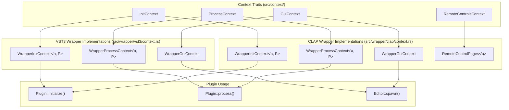

**Sources:** [src/context.rs L1-L30](https://github.com/robbert-vdh/nih-plug/blob/28b149ec/src/context.rs#L1-L30)

 [src/wrapper/clap/context.rs L19-L56](https://github.com/robbert-vdh/nih-plug/blob/28b149ec/src/wrapper/clap/context.rs#L19-L56)

 [src/wrapper/vst3/context.rs L15-L55](https://github.com/robbert-vdh/nih-plug/blob/28b149ec/src/wrapper/vst3/context.rs#L15-L55)

The context system uses generic associated types, with each context parameterized by the plugin type `P` (which must implement `ClapPlugin` or `Vst3Plugin`). This allows contexts to provide type-safe access to plugin-specific features like the `BackgroundTask` associated type.

| Context Trait | Available During | Thread | Primary Purpose |
| --- | --- | --- | --- |
| `InitContext` | `Plugin::initialize()` | GUI/Main | One-time setup, task executor initialization, initial latency reporting |
| `ProcessContext` | `Plugin::process()` | Audio/Real-time | Event handling, transport info, background task scheduling, latency updates |
| `GuiContext` | `Editor::spawn()` and editor lifetime | GUI/Main | Parameter updates with gestures, resize requests, state save/load |
| `RemoteControlsContext` | `ClapPlugin::remote_controls()` | GUI/Main | Define CLAP remote control pages (CLAP-only) |

## InitContext

`InitContext` is provided during the `Plugin::initialize()` call and allows the plugin to perform one-time setup operations that require communication with the host.

### Core Methods

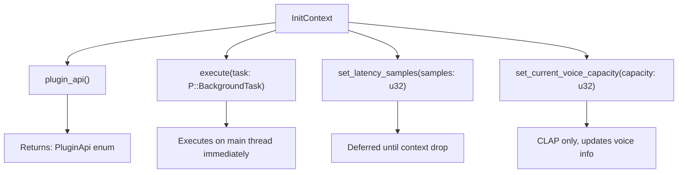

**Sources:** [src/wrapper/clap/context.rs L76-L93](https://github.com/robbert-vdh/nih-plug/blob/28b149ec/src/wrapper/clap/context.rs#L76-L93)

 [src/wrapper/vst3/context.rs L65-L82](https://github.com/robbert-vdh/nih-plug/blob/28b149ec/src/wrapper/vst3/context.rs#L65-L82)

### Method Descriptions

**`plugin_api(&self) -> PluginApi`**  

Returns the current plugin API (`PluginApi::Clap`, `PluginApi::Vst3`, or `PluginApi::Standalone`). The plugin can use this to enable API-specific behavior or display the current API in an about screen.

**`execute(&self, task: P::BackgroundTask)`**  

Executes a background task immediately on the main thread. During initialization, the audio thread is not yet running, so tasks execute synchronously. This is useful for performing I/O operations or other non-real-time work during plugin initialization.

**`set_latency_samples(&self, samples: u32)`**  

Reports the plugin's processing latency to the host. The latency notification is deferred until the `InitContext` is dropped to avoid reentrancy issues where the host might deactivate and reactivate the plugin during the initialization call itself. See [src/wrapper/clap/context.rs L68-L74](https://github.com/robbert-vdh/nih-plug/blob/28b149ec/src/wrapper/clap/context.rs#L68-L74)

 and [src/wrapper/vst3/context.rs L57-L63](https://github.com/robbert-vdh/nih-plug/blob/28b149ec/src/wrapper/vst3/context.rs#L57-L63)

 for the drop implementation.

**`set_current_voice_capacity(&self, capacity: u32)`**  

Reports the current polyphonic voice capacity. This is only supported by CLAP and is a no-op for VST3. Used by polyphonic plugins to inform the host how many simultaneous voices can be active.

### Deferred Request Pattern

Both wrapper implementations use a `PendingInitContextRequests` struct to defer host notifications until the context is dropped:

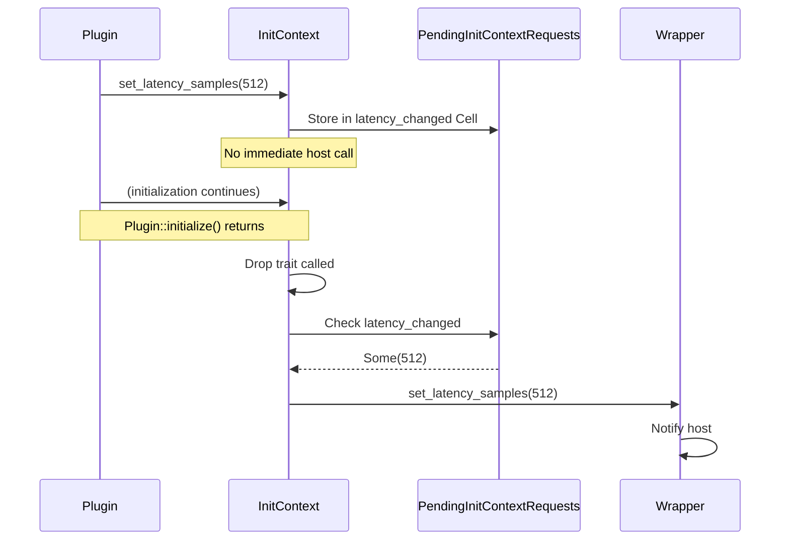

**Sources:** [src/wrapper/clap/context.rs L30-L36](https://github.com/robbert-vdh/nih-plug/blob/28b149ec/src/wrapper/clap/context.rs#L30-L36)

 [src/wrapper/vst3/context.rs L29-L35](https://github.com/robbert-vdh/nih-plug/blob/28b149ec/src/wrapper/vst3/context.rs#L29-L35)

This pattern prevents the host from making reentrant calls back into the plugin while it's still initializing, which would be difficult to handle safely in Rust without pervasive interior mutability.

## ProcessContext

`ProcessContext` is provided to the `Plugin::process()` method and allows the plugin to interact with MIDI/note events, access transport information, schedule background tasks, and update latency during processing.

### Core Methods

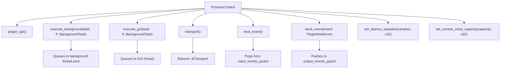

**Sources:** [src/wrapper/clap/context.rs L95-L130](https://github.com/robbert-vdh/nih-plug/blob/28b149ec/src/wrapper/clap/context.rs#L95-L130)

 [src/wrapper/vst3/context.rs L84-L119](https://github.com/robbert-vdh/nih-plug/blob/28b149ec/src/wrapper/vst3/context.rs#L84-L119)

### Method Descriptions

**`plugin_api(&self) -> PluginApi`**  

Same as `InitContext::plugin_api()`.

**`execute_background(&self, task: P::BackgroundTask)`**  

Schedules a task to run on a background thread pool. This allows the plugin to perform non-real-time work (file I/O, network requests, expensive computations) without blocking the audio thread. The task is queued using lock-free data structures and will be executed asynchronously. If the queue is full, the task is dropped with a debug assertion.

**`execute_gui(&self, task: P::BackgroundTask)`**  

Schedules a task to run on the GUI/main thread. This is useful when the audio thread needs to trigger GUI updates or perform operations that require main-thread execution. The task is queued similarly to `execute_background()`.

**`transport(&self) -> &Transport`**  

Returns a reference to the current transport state, including playback position, tempo, time signature, and play/record status. The `Transport` struct is populated from host-provided transport information before the process call.

**`next_event(&mut self) -> Option<PluginNoteEvent<P>>`**  

Retrieves the next MIDI or note event from the input event queue. Events are pre-sorted by sample offset. The plugin should call this method repeatedly, processing events at their designated sample offsets to maintain sample-accurate timing.

**`send_event(&mut self, event: PluginNoteEvent<P>)`**  

Sends a MIDI or note event to the host. The event will be delivered to the host's output event stream, allowing the plugin to generate MIDI notes or control messages.

**`set_latency_samples(&self, samples: u32)`**  

Updates the plugin's latency. Unlike `InitContext::set_latency_samples()`, this directly notifies the host during processing, allowing for dynamic latency changes.

**`set_current_voice_capacity(&self, capacity: u32)`**  

Updates polyphonic voice capacity dynamically. CLAP-only.

### Event Queue Management

The `WrapperProcessContext` holds `AtomicRefMut` guards for both input and output event queues throughout the process call:

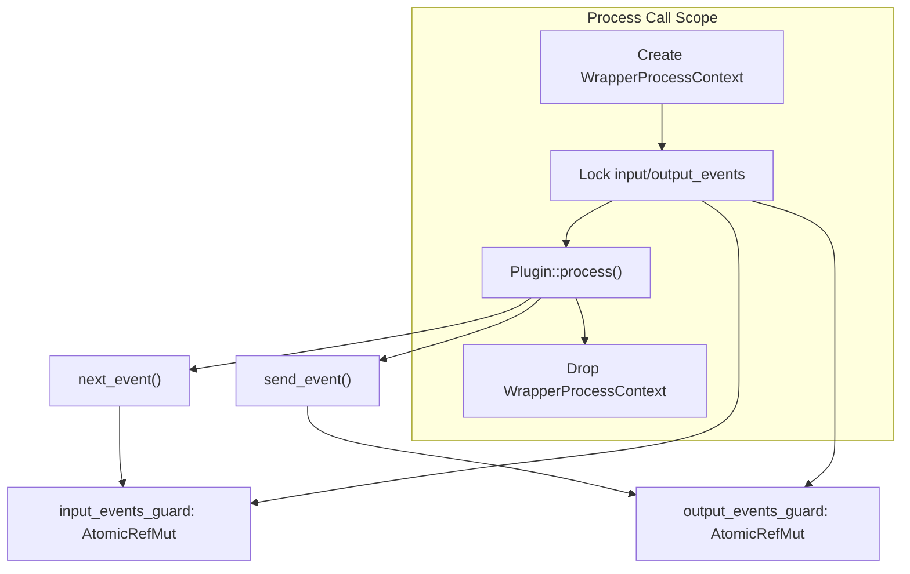

**Sources:** [src/wrapper/clap/context.rs L41-L46](https://github.com/robbert-vdh/nih-plug/blob/28b149ec/src/wrapper/clap/context.rs#L41-L46)

 [src/wrapper/vst3/context.rs L40-L45](https://github.com/robbert-vdh/nih-plug/blob/28b149ec/src/wrapper/vst3/context.rs#L40-L45)

The guards are acquired once at the start of processing and held throughout, avoiding repeated atomic operations for each event access.

## GuiContext

`GuiContext` is provided to the editor through `Editor::spawn()` and allows the GUI to manipulate parameters, request window resizes, and save/load plugin state.

### Core Methods

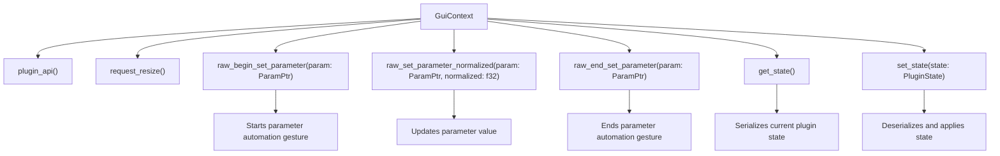

**Sources:** [src/wrapper/clap/context.rs L132-L243](https://github.com/robbert-vdh/nih-plug/blob/28b149ec/src/wrapper/clap/context.rs#L132-L243)

 [src/wrapper/vst3/context.rs L121-L231](https://github.com/robbert-vdh/nih-plug/blob/28b149ec/src/wrapper/vst3/context.rs#L121-L231)

### Parameter Gesture Protocol

GUI parameter changes must follow a strict three-step protocol:

1. **`raw_begin_set_parameter(param: ParamPtr)`** - Notifies the host that a gesture is beginning (e.g., user clicked a slider)
2. **`raw_set_parameter_normalized(param: ParamPtr, normalized: f32)`** - Sets the parameter value (can be called multiple times during a gesture)
3. **`raw_end_set_parameter(param: ParamPtr)`** - Notifies the host that the gesture is complete (e.g., user released the slider)

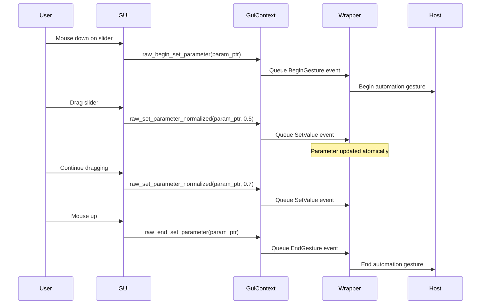

**Sources:** [src/wrapper/clap/context.rs L143-L234](https://github.com/robbert-vdh/nih-plug/blob/28b149ec/src/wrapper/clap/context.rs#L143-L234)

 [src/wrapper/vst3/context.rs L137-L221](https://github.com/robbert-vdh/nih-plug/blob/28b149ec/src/wrapper/vst3/context.rs#L137-L221)

This protocol allows hosts to record automation correctly, distinguishing between the start and end of user interactions versus continuous parameter changes during the interaction.

### CLAP vs VST3 Implementation Differences

**CLAP Implementation** ([src/wrapper/clap/context.rs L143-L206](https://github.com/robbert-vdh/nih-plug/blob/28b149ec/src/wrapper/clap/context.rs#L143-L206)

):

* Uses `queue_parameter_event()` to queue `OutputParamEvent` enum variants
* Events are consumed and sent to the host during the audio callback or via explicit flush
* Parameter values are only updated when the output event is actually written

**VST3 Implementation** ([src/wrapper/vst3/context.rs L137-L199](https://github.com/robbert-vdh/nih-plug/blob/28b149ec/src/wrapper/vst3/context.rs#L137-L199)

):

* Directly calls `IComponentHandler` methods (`begin_edit`, `perform_edit`, `end_edit`)
* Parameters are updated immediately if not currently processing audio (checked via `is_processing` atomic flag)
* Includes a workaround for DAWs like REAPER that silently stop processing when bypassed

### State Management

**`get_state(&self) -> PluginState`**  

Serializes the current plugin state, including all parameter values and persistent fields, into a `PluginState` object. This state can be saved, transmitted, or used for undo/redo.

**`set_state(&self, state: PluginState)`**  

Deserializes and applies a `PluginState`. The wrapper handles the ping-pong pattern for state updates: the GUI sends the state through a zero-capacity channel, the audio thread applies it between processing cycles, and sends it back for deallocation on the GUI thread.

**Sources:** [src/wrapper/clap/context.rs L236-L242](https://github.com/robbert-vdh/nih-plug/blob/28b149ec/src/wrapper/clap/context.rs#L236-L242)

 [src/wrapper/vst3/context.rs L224-L230](https://github.com/robbert-vdh/nih-plug/blob/28b149ec/src/wrapper/vst3/context.rs#L224-L230)

### Debug Assertions for Parameter Gestures

In debug builds, both wrappers include a `ParamGestureChecker` that validates the gesture protocol is followed correctly:

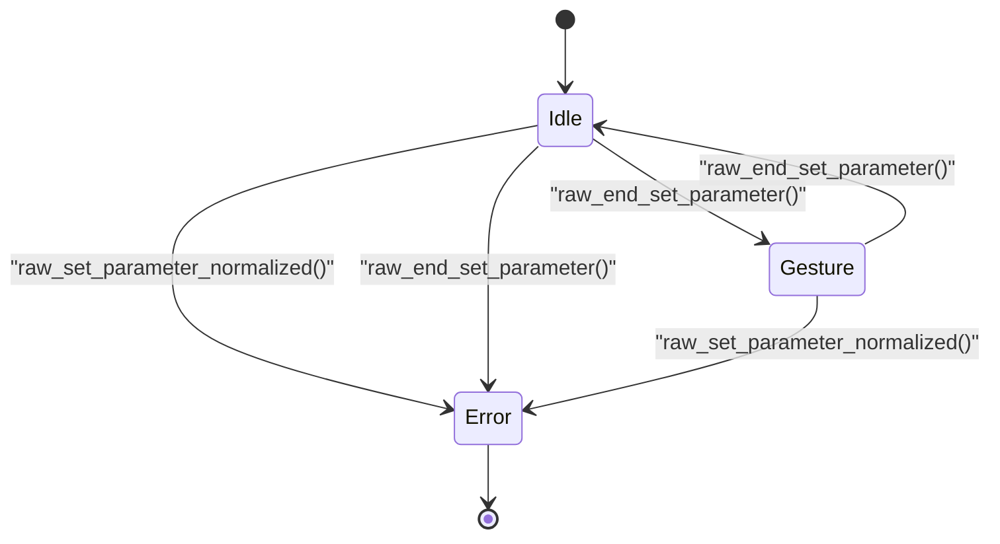

**Sources:** [src/wrapper/clap/context.rs L54-L55](https://github.com/robbert-vdh/nih-plug/blob/28b149ec/src/wrapper/clap/context.rs#L54-L55)

 [src/wrapper/vst3/context.rs L53-L54](https://github.com/robbert-vdh/nih-plug/blob/28b149ec/src/wrapper/vst3/context.rs#L53-L54)

If the protocol is violated (e.g., setting a parameter without a gesture, or starting a gesture twice), a debug assertion is triggered to help catch bugs during development.

## RemoteControlsContext (CLAP)

`RemoteControlsContext` is a CLAP-specific trait that allows plugins to define remote control pages for hardware controllers. The plugin calls `ClapPlugin::remote_controls()` during initialization, receiving a `RemoteControlPages` implementation.

### Remote Control Structure

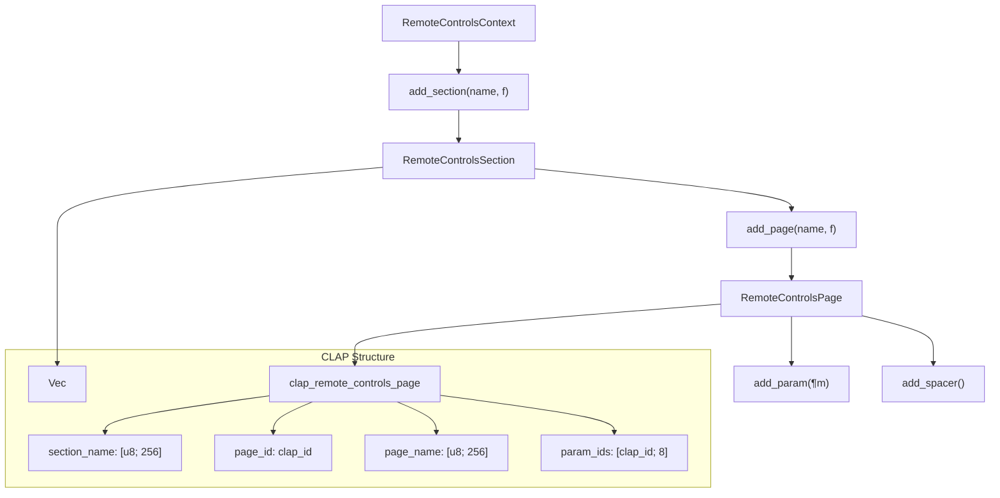

**Sources:** [src/wrapper/clap/context.rs L324-L378](https://github.com/robbert-vdh/nih-plug/blob/28b149ec/src/wrapper/clap/context.rs#L324-L378)

### Usage Pattern

Plugins define remote control pages using a builder pattern:

```rust
fn remote_controls(&self, context: &mut impl RemoteControlsContext) {
    context.add_section("Main", |section| {
        section.add_page("Page 1", |page| {
            page.add_param(&self.params.gain);
            page.add_param(&self.params.frequency);
            page.add_spacer();  // Empty slot
            page.add_param(&self.params.resonance);
        });
    });
}
```

### Automatic Page Splitting

If a page defines more than 8 parameters (the maximum for a single CLAP remote control page), `RemoteControlPages` automatically splits it into multiple pages:

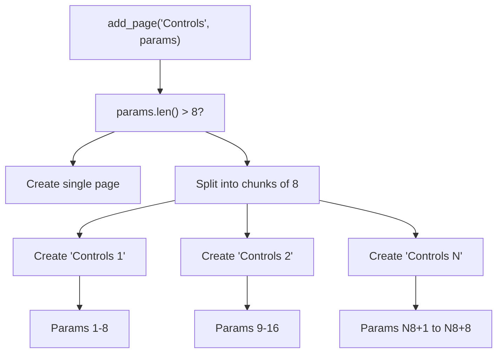

**Sources:** [src/wrapper/clap/context.rs L337-L352](https://github.com/robbert-vdh/nih-plug/blob/28b149ec/src/wrapper/clap/context.rs#L337-L352)

This allows plugins to define logical groupings without worrying about the 8-parameter hardware limitation.

## Wrapper Implementation Details

### Wrapper Structure References

Both CLAP and VST3 wrappers contain wrapper implementations that hold references to the wrapper state:

**CLAP Wrapper** ([src/wrapper/clap/context.rs L25-L28](https://github.com/robbert-vdh/nih-plug/blob/28b149ec/src/wrapper/clap/context.rs#L25-L28)

):

```
pub(crate) struct WrapperInitContext<'a, P: ClapPlugin> {
    pub(super) wrapper: &'a Wrapper<P>,
    pub(super) pending_requests: PendingInitContextRequests,
}
```

**VST3 Wrapper** ([src/wrapper/vst3/context.rs L24-L27](https://github.com/robbert-vdh/nih-plug/blob/28b149ec/src/wrapper/vst3/context.rs#L24-L27)

):

```
pub(crate) struct WrapperInitContext<'a, P: Vst3Plugin> {
    pub(super) inner: &'a WrapperInner<P>,
    pub(super) pending_requests: PendingInitContextRequests,
}
```

The `GuiContext` implementations hold `Arc<Wrapper<P>>` references to allow the context to outlive individual method calls and be safely shared with the GUI thread:

**Sources:** [src/wrapper/clap/context.rs L51-L52](https://github.com/robbert-vdh/nih-plug/blob/28b149ec/src/wrapper/clap/context.rs#L51-L52)

 [src/wrapper/vst3/context.rs L50-L51](https://github.com/robbert-vdh/nih-plug/blob/28b149ec/src/wrapper/vst3/context.rs#L50-L51)

### Parameter Pointer to Hash Mapping

Both wrappers use hash maps to translate `ParamPtr` (raw pointers to parameters) to plugin-API-specific identifiers:

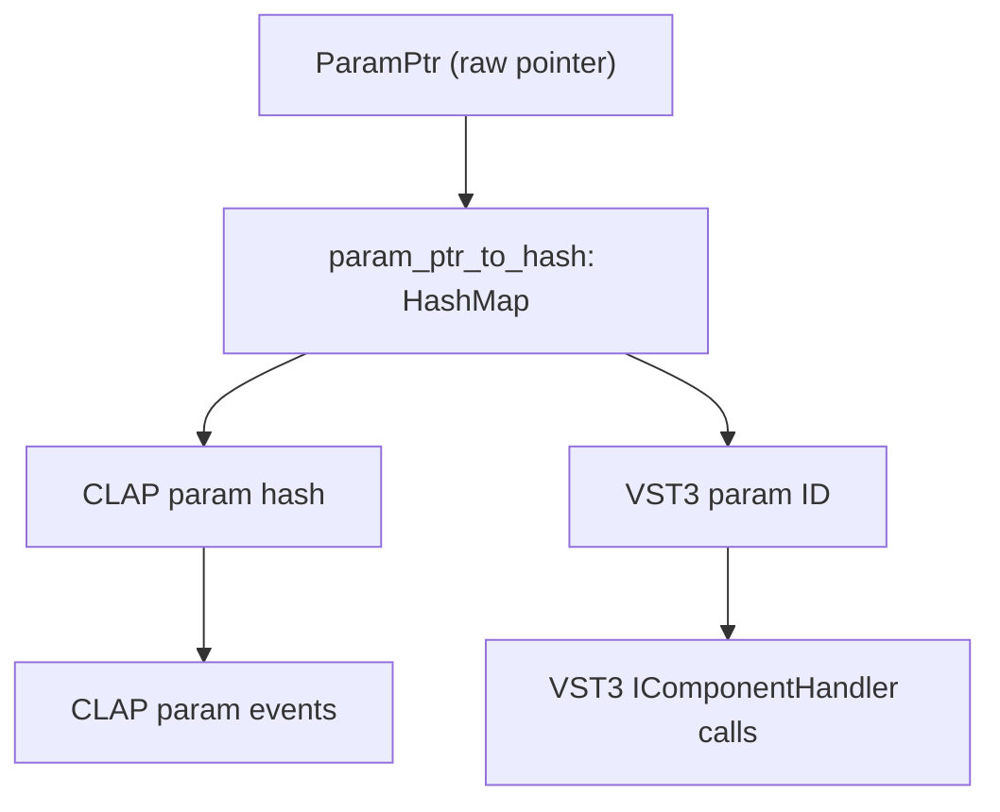

**Sources:** [src/wrapper/clap/context.rs L144-L148](https://github.com/robbert-vdh/nih-plug/blob/28b149ec/src/wrapper/clap/context.rs#L144-L148)

 [src/wrapper/vst3/context.rs L139-L143](https://github.com/robbert-vdh/nih-plug/blob/28b149ec/src/wrapper/vst3/context.rs#L139-L143)

This indirection allows the same `ParamPtr` to be used regardless of the plugin format, with the wrapper translating to the appropriate identifier for the current API.

### Thread Safety and Atomic Operations

The context system enforces thread safety through careful design:

| Operation | Thread | Safety Mechanism |
| --- | --- | --- |
| `InitContext::execute()` | Main/GUI | Synchronous execution via `task_executor` mutex |
| `ProcessContext::execute_background()` | Audio | Lock-free task queue (`ArrayQueue`) |
| `ProcessContext::execute_gui()` | Audio | Lock-free task queue (`ArrayQueue`) |
| `ProcessContext::next_event()` | Audio | Holds `AtomicRefMut` guard for duration of process call |
| `GuiContext::raw_set_parameter_*()` | GUI | Atomic parameter storage, lock-free event queue |
| `GuiContext::set_state()` | GUI | Zero-capacity channel with ping-pong pattern |

**Sources:** [src/wrapper/clap/context.rs L81-L82](https://github.com/robbert-vdh/nih-plug/blob/28b149ec/src/wrapper/clap/context.rs#L81-L82)

 [src/wrapper/clap/context.rs L100-L107](https://github.com/robbert-vdh/nih-plug/blob/28b149ec/src/wrapper/clap/context.rs#L100-L107)

 [src/wrapper/clap/context.rs L143-L206](https://github.com/robbert-vdh/nih-plug/blob/28b149ec/src/wrapper/clap/context.rs#L143-L206)

The parameter change queues and background task queues use `crossbeam::queue::ArrayQueue` for lock-free, wait-free operations that are safe to call from the real-time audio thread.

## Context Lifecycle

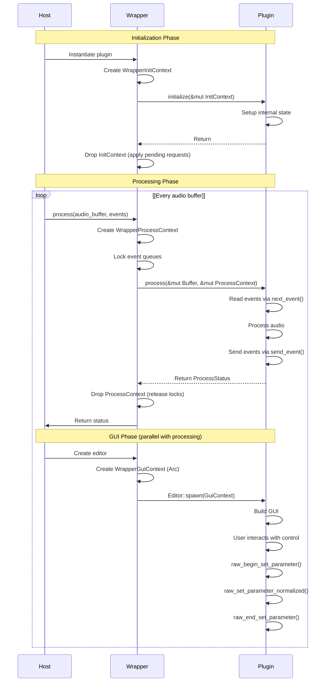

**Sources:** [src/wrapper/clap/context.rs L19-L56](https://github.com/robbert-vdh/nih-plug/blob/28b149ec/src/wrapper/clap/context.rs#L19-L56)

 [src/wrapper/vst3/context.rs L15-L55](https://github.com/robbert-vdh/nih-plug/blob/28b149ec/src/wrapper/vst3/context.rs#L15-L55)

Each context type has a specific lifetime and purpose:

* `InitContext` lives only during `Plugin::initialize()` and is dropped immediately after
* `ProcessContext` is created and destroyed for each `Plugin::process()` call
* `GuiContext` lives for the entire lifetime of the editor, stored in an `Arc` for shared ownership

This lifecycle design ensures that operations are only available when they make sense and are safe to perform, preventing common plugin development mistakes like calling GUI operations from the audio thread or scheduling background tasks before the plugin is fully initialized.