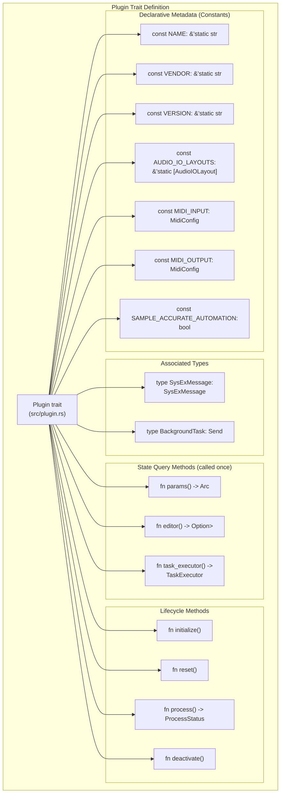
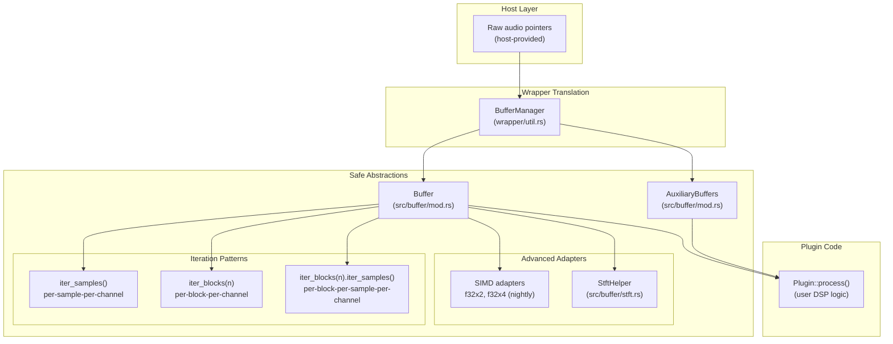
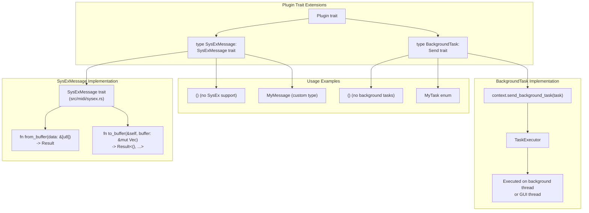
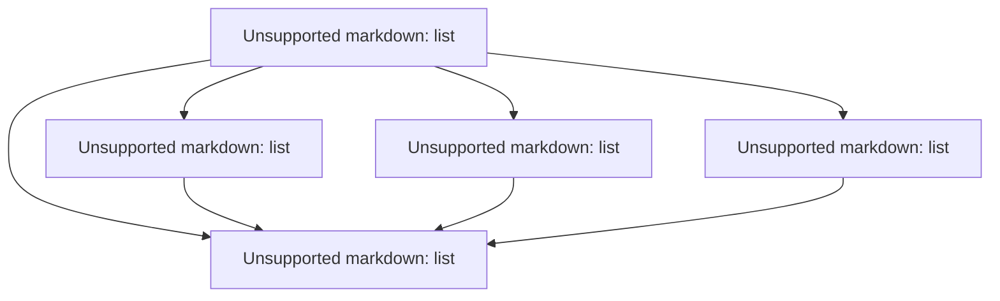

# Core Concepts

> **Relevant source files**
> * [Cargo.lock](https://github.com/robbert-vdh/nih-plug/blob/28b149ec/Cargo.lock)
> * [Cargo.toml](https://github.com/robbert-vdh/nih-plug/blob/28b149ec/Cargo.toml)
> * [README.md](https://github.com/robbert-vdh/nih-plug/blob/28b149ec/README.md)
> * [src/lib.rs](https://github.com/robbert-vdh/nih-plug/blob/28b149ec/src/lib.rs)
> * [src/plugin.rs](https://github.com/robbert-vdh/nih-plug/blob/28b149ec/src/plugin.rs)

## Purpose and Scope

This page provides an overview of the fundamental abstractions that all NIH-plug plugin developers must understand. These core concepts form the foundation of the framework's API-agnostic design and enable plugins to work across multiple formats (VST3, CLAP, standalone) from a single implementation.

The five essential concepts are:

1. **Plugin Trait** - The main interface defining plugin behavior and metadata
2. **Parameter System** - Declarative parameter management with automatic host integration
3. **Audio Buffer System** - Safe, flexible audio processing abstractions
4. **Context System** - Communication channels between plugin and host
5. **Processing Lifecycle** - The sequence of function calls during plugin operation

For detailed implementation guides, see:

* [Plugin Trait](/robbert-vdh/nih-plug/2.1-plugin-trait) for trait methods and constants
* [Parameter System](/robbert-vdh/nih-plug/2.2-parameter-system) for parameter types and serialization
* [Audio Buffer System](/robbert-vdh/nih-plug/2.3-audio-buffer-system) for buffer iterators and adapters
* [Context System](/robbert-vdh/nih-plug/2.4-context-system) for InitContext, ProcessContext, and GuiContext
* [Audio Processing Lifecycle](/robbert-vdh/nih-plug/2.5-audio-processing-lifecycle) for the complete processing flow

---

## The Plugin Trait

The `Plugin` trait is the central abstraction in NIH-plug. Every plugin must implement this trait, which combines stateful lifecycle methods with declarative metadata and configuration.

### Plugin Trait Structure



**Sources:** [src/plugin.rs L59-L255](https://github.com/robbert-vdh/nih-plug/blob/28b149ec/src/plugin.rs#L59-L255)

### Key Characteristics

The `Plugin` trait is **semi-declarative**, meaning it combines:

| Aspect | Implementation Method | Example |
| --- | --- | --- |
| Static metadata | Compile-time constants | `const NAME: &'static str = "My Plugin";` |
| Parameterization | One-time query methods | `fn params(&self) -> Arc<dyn Params>` |
| Audio processing | Stateful methods | `fn process(&mut self, buffer: &mut Buffer, ...)` |
| Type-safe extensions | Associated types | `type SysExMessage = MyMessage;` |

The trait requires `Default + Send + 'static` bounds, allowing the wrapper to instantiate the plugin and move it between threads safely.

**Sources:** [src/plugin.rs L59-L62](https://github.com/robbert-vdh/nih-plug/blob/28b149ec/src/plugin.rs#L59-L62)

 [src/lib.rs L21-L27](https://github.com/robbert-vdh/nih-plug/blob/28b149ec/src/lib.rs#L21-L27)

---

## Parameter System Overview

NIH-plug uses a **declarative parameter system** where parameters are defined as struct fields with derive macros, eliminating boilerplate while providing thread-safe access, smoothing, and automatic host integration.

### Parameter Architecture

```

```

**Sources:** [src/params/mod.rs](https://github.com/robbert-vdh/nih-plug/blob/28b149ec/src/params/mod.rs)

 [nih_plug_derive/](https://github.com/robbert-vdh/nih-plug/blob/28b149ec/nih_plug_derive/)

 [src/plugin.rs L147-L152](https://github.com/robbert-vdh/nih-plug/blob/28b149ec/src/plugin.rs#L147-L152)

### Parameter Types and Features

| Parameter Type | Use Case | Storage | Special Features |
| --- | --- | --- | --- |
| `FloatParam` | Continuous values | `AtomicF32` | Smoothing, ranges, value distributions |
| `IntParam` | Discrete integers | `AtomicI32` | Optional smoothing, step sizes |
| `BoolParam` | On/off switches | `AtomicBool` | Simple boolean state |
| `EnumParam<T>` | Multiple options | `AtomicI32` | Type-safe enum variants |

All parameters support:

* **Atomic access** - Lock-free reads from both GUI and audio threads
* **Stable IDs** - `#[id = "..."]` attribute ensures backward compatibility
* **Smoothing** - Optional `.with_smoother()` for interpolation
* **Nested structures** - `#[nested]` attribute for parameter groups

For detailed parameter configuration, see [Parameter Types and Derive Macros](/robbert-vdh/nih-plug/2.2.1-parameter-types-and-derive-macros).

**Sources:** [src/params/mod.rs](https://github.com/robbert-vdh/nih-plug/blob/28b149ec/src/params/mod.rs)

 [README.md L98-L119](https://github.com/robbert-vdh/nih-plug/blob/28b149ec/README.md#L98-L119)

---

## Audio Buffer System

NIH-plug provides safe abstractions over raw audio buffers with multiple iteration patterns and adapters for different processing styles.

### Buffer System Components



**Sources:** [src/buffer/mod.rs](https://github.com/robbert-vdh/nih-plug/blob/28b149ec/src/buffer/mod.rs)

 [src/buffer/stft.rs](https://github.com/robbert-vdh/nih-plug/blob/28b149ec/src/buffer/stft.rs)

 [wrapper/util.rs](https://github.com/robbert-vdh/nih-plug/blob/28b149ec/wrapper/util.rs)

### Buffer Access Patterns

The `Buffer` object supports multiple iteration styles:

```javascript
// Per-sample per-channel (fine-grained control)
for mut channel_samples in buffer.iter_samples() {
    for sample in channel_samples { *sample *= gain; }
}

// Per-block per-channel (efficient batch processing)
for mut channel_block in buffer.iter_blocks(64) {
    let slice = channel_block.get_mut(channel_idx);
    process_block(slice);
}

// SIMD (nightly feature)
for mut channel_samples in buffer.iter_samples() {
    *channel_samples.to_simd::<f32x2>() *= gain_simd;
}
```

The framework handles:

* **In-place processing** - Output overwrites input by default
* **Channel safety** - All channels guaranteed to have equal sample count
* **Auxiliary ports** - Sidechain inputs and aux outputs via `AuxiliaryBuffers`

For complete buffer API documentation, see [Audio Buffer System](/robbert-vdh/nih-plug/2.3-audio-buffer-system).

**Sources:** [src/buffer/mod.rs](https://github.com/robbert-vdh/nih-plug/blob/28b149ec/src/buffer/mod.rs)

 [src/lib.rs L124-L132](https://github.com/robbert-vdh/nih-plug/blob/28b149ec/src/lib.rs#L124-L132)

 [README.md L123-L132](https://github.com/robbert-vdh/nih-plug/blob/28b149ec/README.md#L123-L132)

---

## Context System

The context system provides **type-safe communication** between plugins and hosts through three specialized context traits, each available at different lifecycle stages.

### Context Trait Hierarchy

```mermaid
flowchart TD

InitContext["InitContext<br>(initialization time)"]
ProcessContext["ProcessContext<br>(audio processing)"]
GuiContext["GuiContext<br>(GUI thread)"]
SetLatency["set_latency(samples: u32)"]
SetCurrentVoice["set_current_voice_capacity(capacity: u32)"]
Transport["transport() -> &Transport"]
NextEvent["next_event() -> Option"]
SendEvent["send_event(event: NoteEvent)"]
SetLatency2["set_latency(samples: u32)"]
SendBgTask["send_background_task(task: P::BackgroundTask)"]
GetState["get_state() -> PluginState"]
SetState["set_state(state: &PluginState)"]
SetParameter["set_parameter(param: &P, value)"]
BeginSet["begin_set_parameter(param: &P)"]
EndSet["end_set_parameter(param: &P)"]
SendBgTask2["send_background_task(task: P::BackgroundTask)"]
Initialize["Plugin::initialize(&mut self,<br>context: &mut impl InitContext)"]
Process["Plugin::process(&mut self,<br>context: &mut impl ProcessContext)"]
EditorSpawn["Editor::spawn(<br>context: Arc)"]

InitContext --> Initialize
ProcessContext --> Process
GuiContext --> EditorSpawn

subgraph subGraph1 ["Plugin Lifecycle"]
    Initialize
    Process
    EditorSpawn
end

subgraph subGraph0 ["Context Traits (src/context/)"]
    InitContext
    ProcessContext
    GuiContext
    SetLatency
    SetCurrentVoice
    Transport
    NextEvent
    SendEvent
    SetLatency2
    SendBgTask
    GetState
    SetState
    SetParameter
    BeginSet
    EndSet
    SendBgTask2
    InitContext --> SetLatency
    InitContext --> SetCurrentVoice
    ProcessContext --> Transport
    ProcessContext --> NextEvent
    ProcessContext --> SendEvent
    ProcessContext --> SetLatency2
    ProcessContext --> SendBgTask
    GuiContext --> GetState
    GuiContext --> SetState
    GuiContext --> SetParameter
    GuiContext --> BeginSet
    GuiContext --> EndSet
    GuiContext --> SendBgTask2
end
```



**Sources:** [src/context/init.rs](https://github.com/robbert-vdh/nih-plug/blob/28b149ec/src/context/init.rs)

 [src/context/process.rs](https://github.com/robbert-vdh/nih-plug/blob/28b149ec/src/context/process.rs)

 [src/context/gui.rs](https://github.com/robbert-vdh/nih-plug/blob/28b149ec/src/context/gui.rs)

### Context Capabilities

| Context | Lifetime | Primary Use Cases |
| --- | --- | --- |
| `InitContext` | During `initialize()` | Set latency, allocate voices, access buffer config |
| `ProcessContext` | During `process()` | Handle events, read transport, send background tasks |
| `GuiContext` | While editor exists | Parameter automation, state management, request resize |

All contexts are **generic over the plugin type** (`impl Context<P: Plugin>`), enabling type-safe access to plugin-specific associated types like `P::BackgroundTask`.

For detailed context methods, see [Context System](/robbert-vdh/nih-plug/2.4-context-system).

**Sources:** [src/context/](https://github.com/robbert-vdh/nih-plug/blob/28b149ec/src/context/)

 [src/plugin.rs L204-L244](https://github.com/robbert-vdh/nih-plug/blob/28b149ec/src/plugin.rs#L204-L244)

---

## Processing Lifecycle

The plugin's lifecycle follows a well-defined sequence of function calls, enabling proper resource management and state transitions.

### Lifecycle State Machine

```

```

**Sources:** [src/plugin.rs L185-L255](https://github.com/robbert-vdh/nih-plug/blob/28b149ec/src/plugin.rs#L185-L255)

 [src/lib.rs L39-L65](https://github.com/robbert-vdh/nih-plug/blob/28b149ec/src/lib.rs#L39-L65)

### Lifecycle Function Summary

| Function | Called When | Allocations Allowed | Purpose |
| --- | --- | --- | --- |
| `Default::default()` | Plugin instantiation | ❌ (but ignored) | Create plugin object |
| `params()` | Once after instantiation | ✅ | Return parameter structure |
| `editor()` | Once after instantiation | ✅ | Return editor interface |
| `initialize()` | Before first process call | ✅ | Allocate DSP resources |
| `reset()` | After initialize, or anytime | ❌ | Clear runtime state |
| `process()` | Repeatedly during playback | ❌ | Process audio buffers |
| `deactivate()` | When processing stops | ✅ | Deallocate resources |

**Key Rules:**

1. **Cheap instantiation** - The `Default` implementation should be fast, avoiding heavy computation or I/O [src/plugin.rs L188-L189](https://github.com/robbert-vdh/nih-plug/blob/28b149ec/src/plugin.rs#L188-L189)
2. **One-time queries** - `params()`, `editor()`, and `task_executor()` are called exactly once after instantiation [src/plugin.rs L39-L40](https://github.com/robbert-vdh/nih-plug/blob/28b149ec/src/plugin.rs#L39-L40)
3. **Initialization order** - `initialize()` is always followed immediately by `reset()` [src/plugin.rs L191-L192](https://github.com/robbert-vdh/nih-plug/blob/28b149ec/src/plugin.rs#L191-L192)
4. **Realtime safety** - `reset()` and `process()` must be allocation-free as they're called from the audio thread [src/plugin.rs L213-L216](https://github.com/robbert-vdh/nih-plug/blob/28b149ec/src/plugin.rs#L213-L216)
5. **Multiple initializations** - `initialize()` may be called multiple times without intervening `deactivate()` when hosts restore state [src/plugin.rs L200-L202](https://github.com/robbert-vdh/nih-plug/blob/28b149ec/src/plugin.rs#L200-L202)

**Sources:** [src/plugin.rs L185-L255](https://github.com/robbert-vdh/nih-plug/blob/28b149ec/src/plugin.rs#L185-L255)

 [src/lib.rs L39-L65](https://github.com/robbert-vdh/nih-plug/blob/28b149ec/src/lib.rs#L39-L65)

---

## Type-Safe Extension System

NIH-plug uses **associated types** on the `Plugin` trait to provide type-safe, zero-cost abstractions for optional plugin features.

### Extension Associated Types



**Sources:** [src/plugin.rs L120-L145](https://github.com/robbert-vdh/nih-plug/blob/28b149ec/src/plugin.rs#L120-L145)

 [src/midi/sysex.rs](https://github.com/robbert-vdh/nih-plug/blob/28b149ec/src/midi/sysex.rs)

 [src/context/process.rs](https://github.com/robbert-vdh/nih-plug/blob/28b149ec/src/context/process.rs)

### Associated Type Usage

| Associated Type | Purpose | Unit Type Behavior | Custom Type Behavior |
| --- | --- | --- | --- |
| `SysExMessage` | MIDI SysEx handling | `()` = no SysEx support | Custom struct/enum implementing `SysExMessage` trait |
| `BackgroundTask` | Async operations | `()` = ignored | Enum/struct sent via contexts, executed by `task_executor()` |

These types enable:

* **Compile-time optimization** - Unit types have zero runtime cost
* **Type safety** - Custom types are checked at compile time
* **Flexible design** - Plugins only implement what they need

For SysEx examples, see the [sysex example plugin](https://github.com/robbert-vdh/nih-plug/blob/28b149ec/sysex example plugin)

 For background task examples, see [Background Tasks and Async Execution](/robbert-vdh/nih-plug/6.3-background-tasks-and-async-execution).

**Sources:** [src/plugin.rs L120-L145](https://github.com/robbert-vdh/nih-plug/blob/28b149ec/src/plugin.rs#L120-L145)

 [src/midi/sysex.rs](https://github.com/robbert-vdh/nih-plug/blob/28b149ec/src/midi/sysex.rs)

 [plugins/examples/sysex/](https://github.com/robbert-vdh/nih-plug/blob/28b149ec/plugins/examples/sysex/)

---

## Summary: Core Abstractions

The five core concepts work together to provide NIH-plug's unified plugin API:



**Key Takeaways:**

1. **Semi-declarative design** - Metadata is static, behavior is stateful
2. **Thread safety built-in** - Atomic parameters, safe buffer abstractions, realtime-safe contexts
3. **Format agnostic** - Same code exports to VST3, CLAP, and standalone
4. **Composable abstractions** - Mix and match buffer iterators, adapters, and processing patterns
5. **Type-safe extensions** - Associated types provide zero-cost optional features

For implementation details, proceed to the child pages:

* [Plugin Trait](/robbert-vdh/nih-plug/2.1-plugin-trait) - Complete trait reference
* [Parameter System](/robbert-vdh/nih-plug/2.2-parameter-system) - Parameter types and state management
* [Audio Buffer System](/robbert-vdh/nih-plug/2.3-audio-buffer-system) - Buffer iteration and adapters
* [Context System](/robbert-vdh/nih-plug/2.4-context-system) - Context trait methods
* [Audio Processing Lifecycle](/robbert-vdh/nih-plug/2.5-audio-processing-lifecycle) - Detailed lifecycle documentation

**Sources:** [src/plugin.rs](https://github.com/robbert-vdh/nih-plug/blob/28b149ec/src/plugin.rs)

 [src/lib.rs](https://github.com/robbert-vdh/nih-plug/blob/28b149ec/src/lib.rs)

 [README.md L89-L169](https://github.com/robbert-vdh/nih-plug/blob/28b149ec/README.md#L89-L169)

 [Cargo.toml L49-L77](https://github.com/robbert-vdh/nih-plug/blob/28b149ec/Cargo.toml#L49-L77)