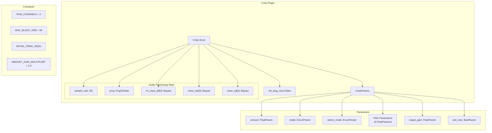
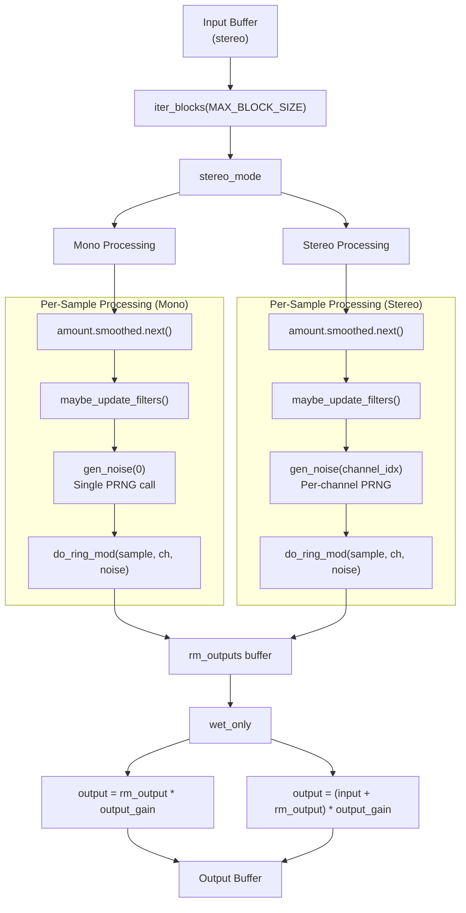
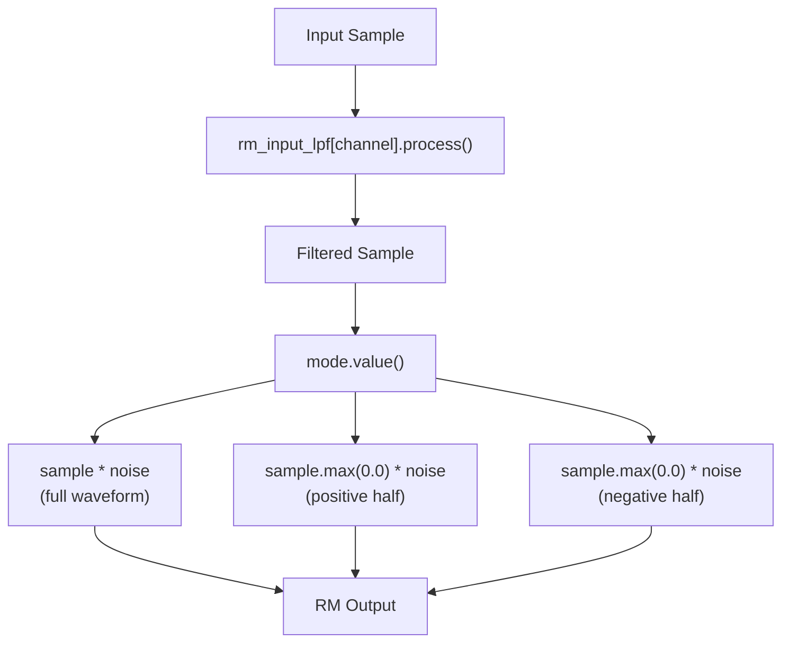
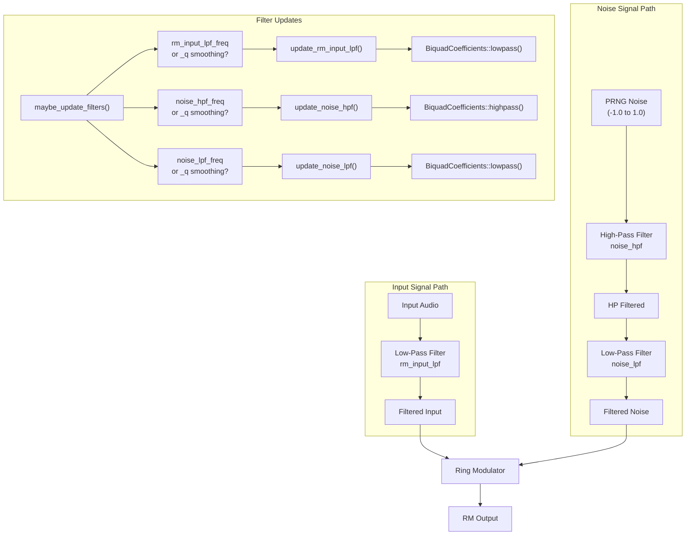
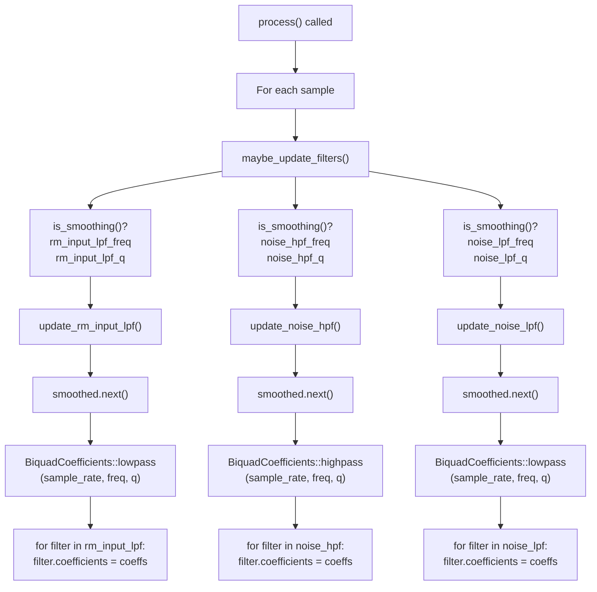
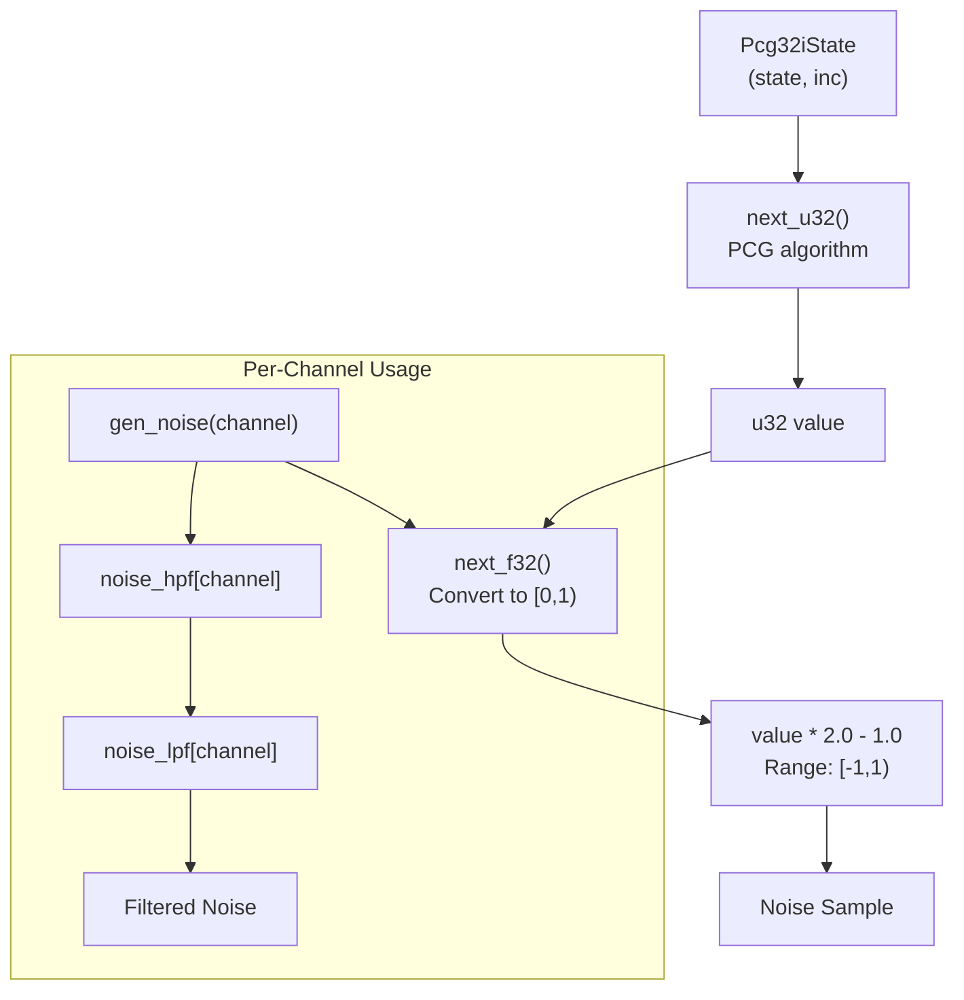
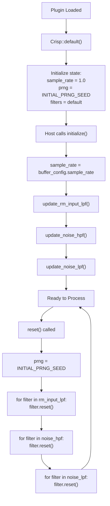
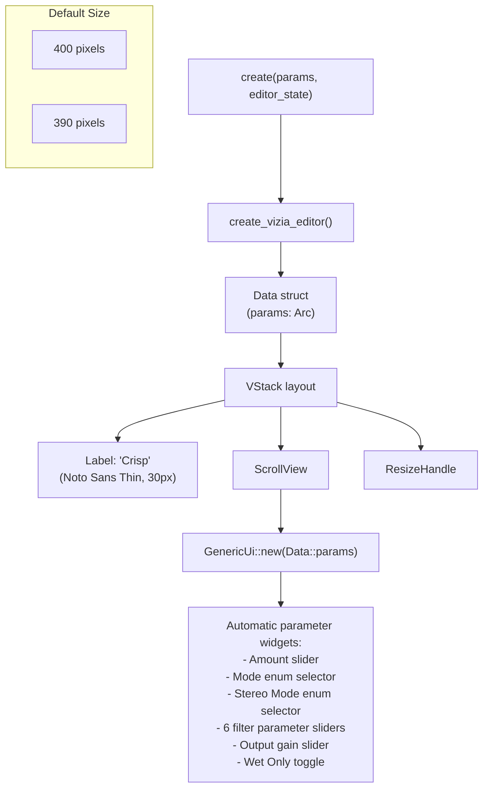
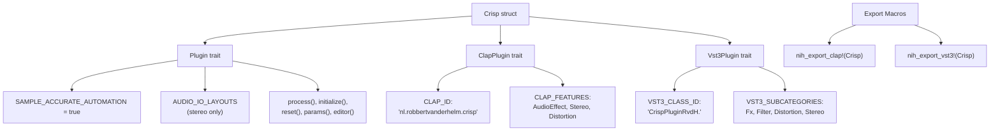

# Crisp Plugin

> **Relevant source files**
> * [plugins/crisp/src/editor.rs](https://github.com/robbert-vdh/nih-plug/blob/28b149ec/plugins/crisp/src/editor.rs)
> * [plugins/crisp/src/lib.rs](https://github.com/robbert-vdh/nih-plug/blob/28b149ec/plugins/crisp/src/lib.rs)
> * [plugins/diopser/src/editor.rs](https://github.com/robbert-vdh/nih-plug/blob/28b149ec/plugins/diopser/src/editor.rs)
> * [plugins/diopser/src/lib.rs](https://github.com/robbert-vdh/nih-plug/blob/28b149ec/plugins/diopser/src/lib.rs)
> * [plugins/examples/gain_gui_vizia/src/editor.rs](https://github.com/robbert-vdh/nih-plug/blob/28b149ec/plugins/examples/gain_gui_vizia/src/editor.rs)
> * [plugins/spectral_compressor/src/editor.rs](https://github.com/robbert-vdh/nih-plug/blob/28b149ec/plugins/spectral_compressor/src/editor.rs)

This page provides a detailed walkthrough of the Crisp plugin, demonstrating ring modulation with filtered noise. Crisp layers the input signal with a ring modulated copy using noise as the modulator, with extensive filtering options to shape the character of the effect.

For information about other example plugins demonstrating different NIH-plug features, see [Simple Examples](/robbert-vdh/nih-plug/5.1-simple-examples), [Diopser Plugin](/robbert-vdh/nih-plug/5.2-diopser-plugin), and [Spectral Compressor Plugin](/robbert-vdh/nih-plug/5.3-spectral-compressor-plugin).

## Overview

Crisp is a creative audio effect that adds high-frequency content to low-frequency signals through ring modulation. The plugin generates filtered noise and uses it to ring-modulate the input signal, creating a bright, crispy top end. The effect includes multiple modulation modes, stereo handling options, and a comprehensive filter chain for precise tonal control.

**Key Features:**

* Three ring modulation modes (full waveform, positive half, negative half)
* Deterministic PRNG-based noise generation for reproducible bouncing
* Cascaded biquad filters for input and noise signal shaping
* Mono/stereo noise source options
* Sample-accurate automation support
* Wet-only output mode for parallel processing

Sources: [plugins/crisp/src/lib.rs L1-L59](https://github.com/robbert-vdh/nih-plug/blob/28b149ec/plugins/crisp/src/lib.rs#L1-L59)

## Plugin Architecture

### Main Plugin Structure

The `Crisp` struct maintains processing state including the PRNG for noise generation and three pairs of biquad filters (one pair each for input low-pass, noise high-pass, and noise low-pass). The hardcoded `NUM_CHANNELS = 2` allows for potential future SIMD optimization.

Sources: [plugins/crisp/src/lib.rs L26-L59](https://github.com/robbert-vdh/nih-plug/blob/28b149ec/plugins/crisp/src/lib.rs#L26-L59)

 [plugins/crisp/src/lib.rs L131-L144](https://github.com/robbert-vdh/nih-plug/blob/28b149ec/plugins/crisp/src/lib.rs#L131-L144)

### Parameter Configuration

| Parameter | Type | Range | Purpose |
| --- | --- | --- | --- |
| `amount` | FloatParam | 0.0 - 1.0 | Wet/dry mix (scales up to 2x gain) |
| `mode` | EnumParam | Soggy/Crispy/CrispyNegated | Ring modulation type |
| `stereo_mode` | EnumParam | Mono/Stereo | Noise generation per channel |
| `rm_input_lpf_freq` | FloatParam | 5 - 22000 Hz | Input low-pass cutoff |
| `rm_input_lpf_q` | FloatParam | 0.707 - 10.0 | Input low-pass resonance |
| `noise_hpf_freq` | FloatParam | 5 - 22000 Hz | Noise high-pass cutoff |
| `noise_hpf_q` | FloatParam | 0.707 - 10.0 | Noise high-pass resonance |
| `noise_lpf_freq` | FloatParam | 5 - 22000 Hz | Noise low-pass cutoff |
| `noise_lpf_q` | FloatParam | 0.707 - 10.0 | Noise low-pass resonance |
| `output_gain` | FloatParam | -24 to 0 dB | Final output gain |
| `wet_only` | BoolParam | true/false | Output only the RM signal |

All filter parameters use logarithmic smoothing with 100ms time constant, while `amount` and `output_gain` use linear and logarithmic smoothing (10ms) respectively for responsive control without artifacts.

Sources: [plugins/crisp/src/lib.rs L60-L103](https://github.com/robbert-vdh/nih-plug/blob/28b149ec/plugins/crisp/src/lib.rs#L60-L103)

 [plugins/crisp/src/lib.rs L146-L294](https://github.com/robbert-vdh/nih-plug/blob/28b149ec/plugins/crisp/src/lib.rs#L146-L294)

## Processing Pipeline

### Audio Processing Flow

The processing pipeline operates on blocks of up to 64 samples to reduce per-sample branching overhead. The key distinction between mono and stereo modes is whether a single noise value is shared across channels (mono) or generated independently per channel (stereo).

Sources: [plugins/crisp/src/lib.rs L355-L416](https://github.com/robbert-vdh/nih-plug/blob/28b149ec/plugins/crisp/src/lib.rs#L355-L416)

### Ring Modulation Modes

The `do_ring_mod()` method first applies the input low-pass filter, then performs ring modulation according to the selected mode. The `Crispy` and `CrispyNegated` modes use `sample.max(0.0)` to rectify the signal, creating asymmetric modulation that preserves more of the original signal's character.

Sources: [plugins/crisp/src/lib.rs L427-L438](https://github.com/robbert-vdh/nih-plug/blob/28b149ec/plugins/crisp/src/lib.rs#L427-L438)

## Filter System

### Filter Chain Architecture

The filter chain provides comprehensive tonal shaping:

* **Input LPF**: Removes high frequencies from the input before ring modulation, preventing the effect from becoming pure noise on already bright signals
* **Noise HPF**: Brightens the noise by removing low frequencies
* **Noise LPF**: Further shapes the noise spectrum after high-pass filtering

Each filter can be disabled by setting its frequency to the extreme value (HPF to `MIN_FILTER_FREQUENCY`, LPF to `MAX_FILTER_FREQUENCY`), which is displayed as "Disabled" in the UI.

Sources: [plugins/crisp/src/lib.rs L440-L487](https://github.com/robbert-vdh/nih-plug/blob/28b149ec/plugins/crisp/src/lib.rs#L440-L487)

### Filter Update Strategy

Filters are updated per-sample when their parameters are smoothing, ensuring smooth transitions without zipper noise. The update methods apply the same coefficients to both channel filters to maintain stereo coherence.

Sources: [plugins/crisp/src/lib.rs L440-L457](https://github.com/robbert-vdh/nih-plug/blob/28b149ec/plugins/crisp/src/lib.rs#L440-L457)

 [plugins/crisp/src/lib.rs L459-L487](https://github.com/robbert-vdh/nih-plug/blob/28b149ec/plugins/crisp/src/lib.rs#L459-L487)

## Noise Generation

### PCG PRNG Implementation

Crisp uses a PCG (Permuted Congruential Generator) PRNG for noise generation, providing high-quality pseudo-random numbers with deterministic behavior for reproducible bouncing.

The PRNG is initialized with a fixed seed (`INITIAL_PRNG_SEED = Pcg32iState::new(69, 420)`) and reset on each `reset()` call, ensuring that bouncing the same audio produces identical results. This determinism is critical for professional production workflows.

**Stereo Handling:**

* **Mono mode**: Single `gen_noise(0)` call per sample, same noise for both channels
* **Stereo mode**: Separate `gen_noise(channel_idx)` calls, advancing PRNG differently per channel for decorrelated noise

Sources: [plugins/crisp/src/lib.rs L19-L24](https://github.com/robbert-vdh/nih-plug/blob/28b149ec/plugins/crisp/src/lib.rs#L19-L24)

 [plugins/crisp/src/lib.rs L32-L33](https://github.com/robbert-vdh/nih-plug/blob/28b149ec/plugins/crisp/src/lib.rs#L32-L33)

 [plugins/crisp/src/lib.rs L340-L353](https://github.com/robbert-vdh/nih-plug/blob/28b149ec/plugins/crisp/src/lib.rs#L340-L353)

 [plugins/crisp/src/lib.rs L420-L425](https://github.com/robbert-vdh/nih-plug/blob/28b149ec/plugins/crisp/src/lib.rs#L420-L425)

## Plugin Lifecycle

### Initialization and Reset

The initialization sequence ensures filter coefficients are computed based on the actual sample rate before processing begins. The `reset()` method clears filter state and resets the PRNG seed, making bounces deterministic.

Sources: [plugins/crisp/src/lib.rs L324-L353](https://github.com/robbert-vdh/nih-plug/blob/28b149ec/plugins/crisp/src/lib.rs#L324-L353)

## GUI Implementation

The Crisp editor uses `nih_plug_vizia` with a minimalist design featuring `GenericUi` for automatic parameter layout. The editor is defined in [plugins/crisp/src/editor.rs](https://github.com/robbert-vdh/nih-plug/blob/28b149ec/plugins/crisp/src/editor.rs)

### Editor Structure

The `GenericUi` widget automatically generates appropriate controls for each parameter type:

* `FloatParam` → Slider with value display
* `EnumParam` → Dropdown or labeled steps
* `BoolParam` → Toggle button

This approach minimizes GUI code while providing full parameter access. The scroll view accommodates the relatively large number of parameters (11 total) within the compact window size.

Sources: [plugins/crisp/src/editor.rs L1-L76](https://github.com/robbert-vdh/nih-plug/blob/28b149ec/plugins/crisp/src/editor.rs#L1-L76)

## Technical Implementation Details

### Constants and Configuration

| Constant | Value | Purpose |
| --- | --- | --- |
| `NUM_CHANNELS` | 2 | Stereo processing, hardcoded for potential SIMD |
| `MAX_BLOCK_SIZE` | 64 | Block iteration size for reduced branching |
| `INITIAL_PRNG_SEED` | `(69, 420)` | Fixed seed for deterministic bouncing |
| `AMOUNT_GAIN_MULTIPLIER` | 2.0 | Allows 100% amount to boost above unity |
| `MIN_FILTER_FREQUENCY` | 5.0 Hz | Lower bound for filter cutoffs |
| `MAX_FILTER_FREQUENCY` | 22000.0 Hz | Upper bound (used for "disabled") |

Sources: [plugins/crisp/src/lib.rs L26-L37](https://github.com/robbert-vdh/nih-plug/blob/28b149ec/plugins/crisp/src/lib.rs#L26-L37)

### Plugin Traits Implementation

The plugin is exported for both CLAP and VST3 formats. Setting `SAMPLE_ACCURATE_AUTOMATION = true` enables sample-accurate parameter changes, ensuring precise timing for automation and modulation.

Sources: [plugins/crisp/src/lib.rs L296-L318](https://github.com/robbert-vdh/nih-plug/blob/28b149ec/plugins/crisp/src/lib.rs#L296-L318)

 [plugins/crisp/src/lib.rs L490-L515](https://github.com/robbert-vdh/nih-plug/blob/28b149ec/plugins/crisp/src/lib.rs#L490-L515)

### Future SIMD Considerations

The codebase includes comments indicating planned SIMD optimization:

* `NUM_CHANNELS` is hardcoded to 2 for easier SIMD-ification
* `MAX_BLOCK_SIZE` allows processing multiple samples at once
* The `do_ring_mod()` method includes a TODO comment about avoiding branching for SIMD compatibility

The current implementation processes channels sequentially, but the architecture is designed to support future vectorization where both channels could be processed simultaneously using SIMD types like `f32x2`.

Sources: [plugins/crisp/src/lib.rs L26-L29](https://github.com/robbert-vdh/nih-plug/blob/28b149ec/plugins/crisp/src/lib.rs#L26-L29)

 [plugins/crisp/src/lib.rs L367](https://github.com/robbert-vdh/nih-plug/blob/28b149ec/plugins/crisp/src/lib.rs#L367-L367)

 [plugins/crisp/src/lib.rs L432](https://github.com/robbert-vdh/nih-plug/blob/28b149ec/plugins/crisp/src/lib.rs#L432-L432)

## Parameter Smoothing Strategy

All time-varying parameters use smoothers to prevent audio artifacts:

| Parameter Category | Smoothing Type | Time Constant |
| --- | --- | --- |
| Amount | Linear | 10 ms |
| Filter frequencies | Logarithmic | 100 ms |
| Filter Q values | Logarithmic | 100 ms |
| Output gain | Logarithmic | 10 ms |

Logarithmic smoothing is appropriate for frequency and gain parameters as they are perceived logarithmically, while linear smoothing works for the amount parameter which represents a linear mix ratio. The longer smoothing time for filter parameters (100ms) prevents audible filter sweeps while still allowing responsive control.

Sources: [plugins/crisp/src/lib.rs L154-L276](https://github.com/robbert-vdh/nih-plug/blob/28b149ec/plugins/crisp/src/lib.rs#L154-L276)