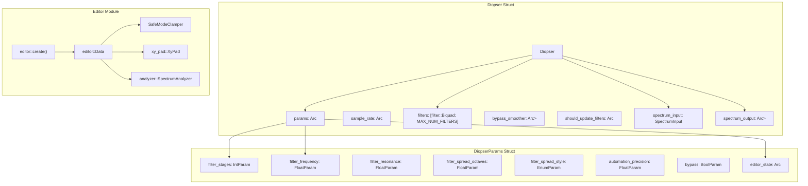
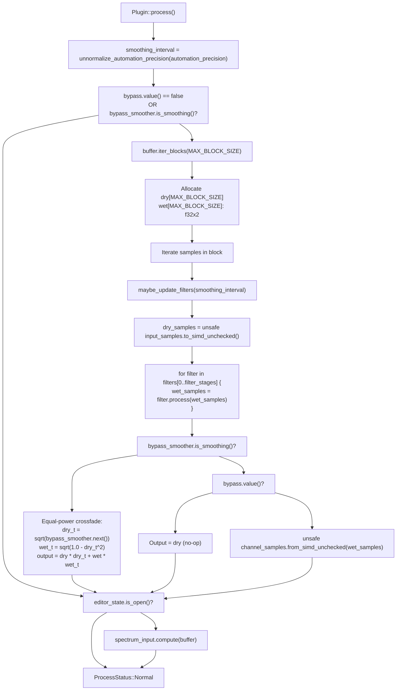
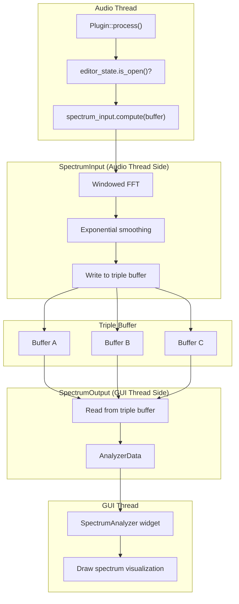
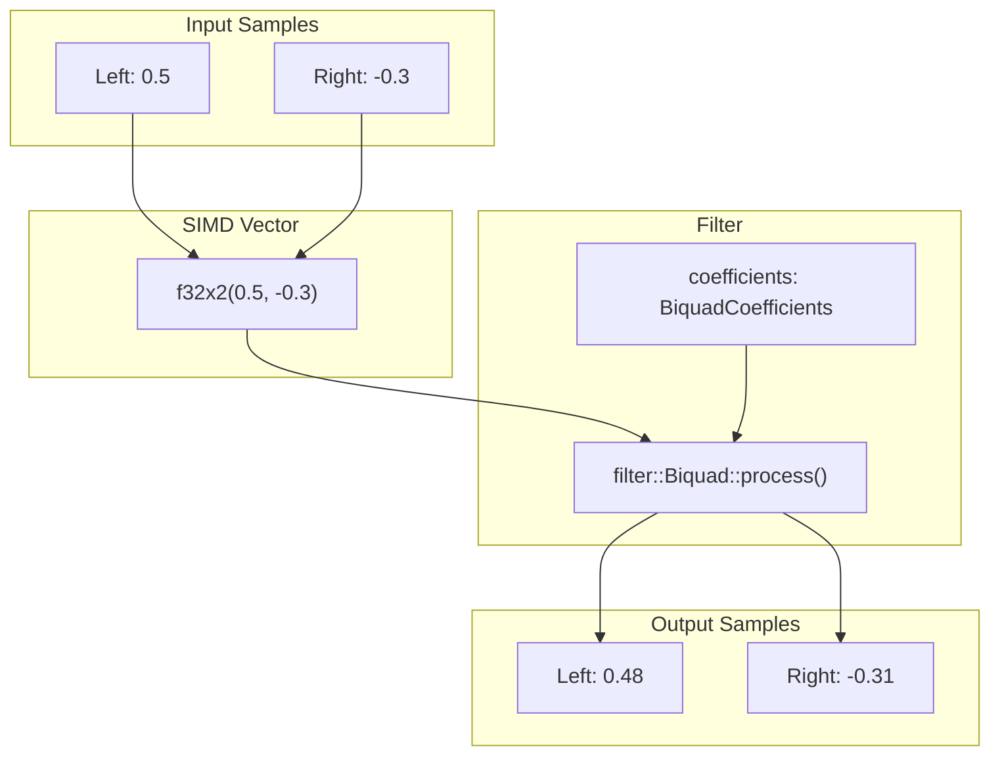
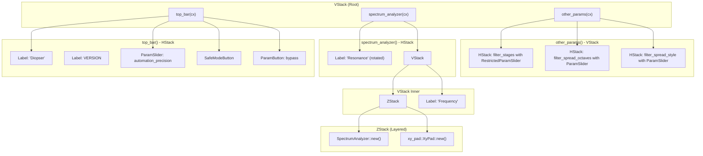
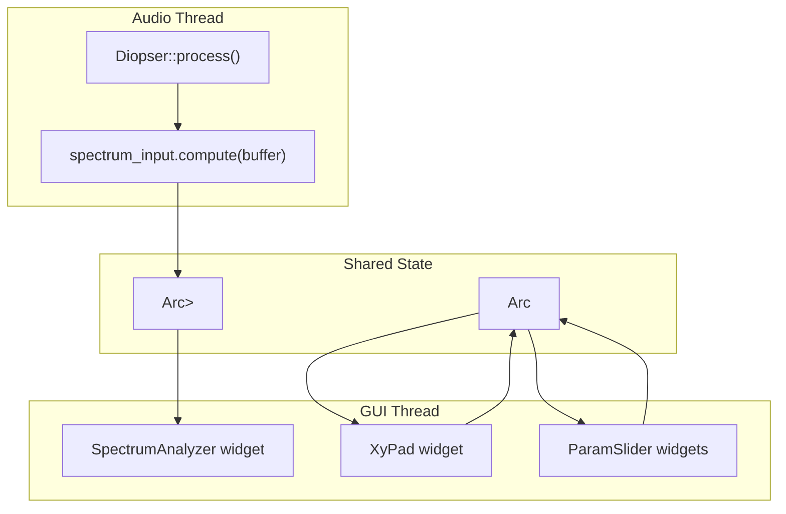
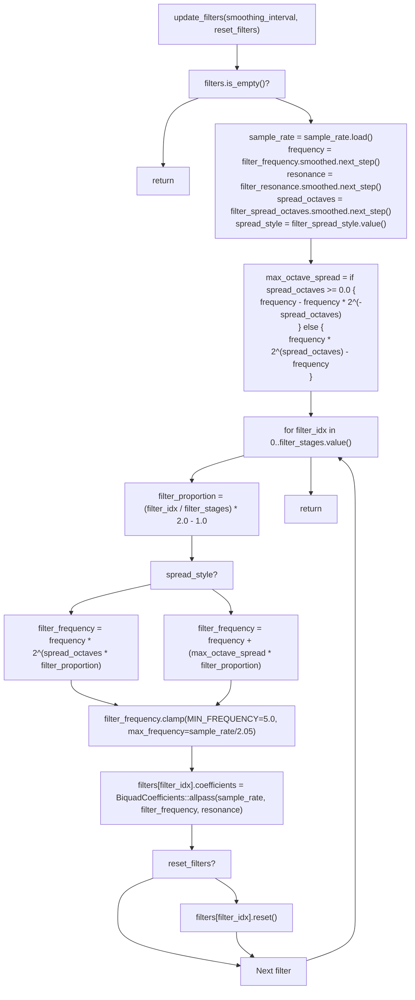
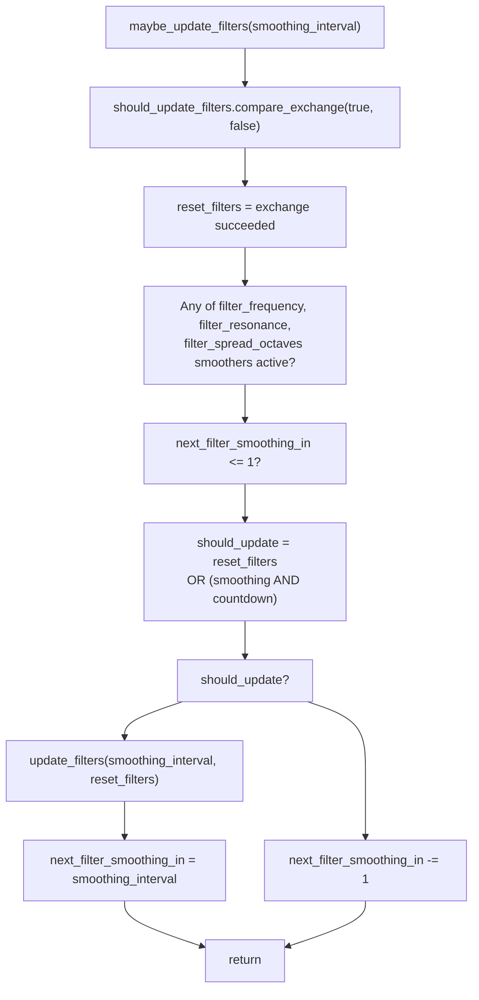

# Diopser Plugin

> **Relevant source files**
> * [plugins/crisp/src/editor.rs](https://github.com/robbert-vdh/nih-plug/blob/28b149ec/plugins/crisp/src/editor.rs)
> * [plugins/crisp/src/lib.rs](https://github.com/robbert-vdh/nih-plug/blob/28b149ec/plugins/crisp/src/lib.rs)
> * [plugins/diopser/src/editor.rs](https://github.com/robbert-vdh/nih-plug/blob/28b149ec/plugins/diopser/src/editor.rs)
> * [plugins/diopser/src/lib.rs](https://github.com/robbert-vdh/nih-plug/blob/28b149ec/plugins/diopser/src/lib.rs)
> * [plugins/examples/gain_gui_vizia/src/editor.rs](https://github.com/robbert-vdh/nih-plug/blob/28b149ec/plugins/examples/gain_gui_vizia/src/editor.rs)
> * [plugins/spectral_compressor/src/editor.rs](https://github.com/robbert-vdh/nih-plug/blob/28b149ec/plugins/spectral_compressor/src/editor.rs)

## Overview

Diopser is a phase rotation plugin demonstrating SIMD-optimized DSP processing with a custom VIZIA-based GUI. The plugin applies cascaded all-pass biquad filters to rotate the phase of audio signals while preserving amplitude characteristics. It serves as an example of sample-accurate automation, real-time spectrum visualization, and safe parameter clamping.

The plugin is hardcoded for stereo operation to leverage `f32x2` SIMD vectorization, processing both channels simultaneously. It requires the `simd` feature flag and nightly Rust.

For related examples, see [Simple Examples](/robbert-vdh/nih-plug/5.1-simple-examples), [Spectral Compressor Plugin](/robbert-vdh/nih-plug/5.3-spectral-compressor-plugin), and [Crisp Plugin](/robbert-vdh/nih-plug/5.4-crisp-plugin).

### Core Plugin Components



Sources: [plugins/diopser/src/lib.rs L17-L20](https://github.com/robbert-vdh/nih-plug/blob/28b149ec/plugins/diopser/src/lib.rs#L17-L20)

 [plugins/diopser/src/lib.rs L42-L73](https://github.com/robbert-vdh/nih-plug/blob/28b149ec/plugins/diopser/src/lib.rs#L42-L73)

 [plugins/diopser/src/lib.rs L75-L102](https://github.com/robbert-vdh/nih-plug/blob/28b149ec/plugins/diopser/src/lib.rs#L75-L102)

 [plugins/diopser/src/editor.rs L47-L59](https://github.com/robbert-vdh/nih-plug/blob/28b149ec/plugins/diopser/src/editor.rs#L47-L59)

## Architecture

Diopser is implemented as a stereo-only plugin due to its SIMD (Single Instruction, Multiple Data) optimization approach. The core architecture consists of several key components that work together to create the phase rotation effect.

### Plugin Structure

The `Diopser` struct at [plugins/diopser/src/lib.rs L42-L73](https://github.com/robbert-vdh/nih-plug/blob/28b149ec/plugins/diopser/src/lib.rs#L42-L73)

 contains state for audio processing, parameter management, and GUI communication:

| Field | Type | Purpose |
| --- | --- | --- |
| `params` | `Arc<DiopserParams>` | Parameter state shared with GUI and wrappers |
| `sample_rate` | `Arc<AtomicF32>` | Current sample rate, shared with editor for spectrum display |
| `filters` | `[filter::Biquad<f32x2>; MAX_NUM_FILTERS]` | Array of SIMD biquad filters (40 maximum) |
| `bypass_smoother` | `Arc<Smoother<f32>>` | Crossfades between dry/wet when bypass toggles |
| `should_update_filters` | `Arc<AtomicBool>` | Signals filter coefficient recalculation needed |
| `next_filter_smoothing_in` | `i32` | Countdown for throttled filter updates based on `automation_precision` |
| `spectrum_input` | `SpectrumInput` | Audio thread side of spectrum analysis pipeline |
| `spectrum_output` | `Arc<Mutex<SpectrumOutput>>` | GUI thread side of spectrum analysis pipeline |

The plugin is compiled with `#![cfg_attr(feature = "simd", feature(portable_simd))]` at [plugins/diopser/src/lib.rs L17](https://github.com/robbert-vdh/nih-plug/blob/28b149ec/plugins/diopser/src/lib.rs#L17-L17)

 and enforces SIMD support at compile time via [plugins/diopser/src/lib.rs L19-L20](https://github.com/robbert-vdh/nih-plug/blob/28b149ec/plugins/diopser/src/lib.rs#L19-L20)

Constants:

* `NUM_CHANNELS = 2` - Hardcoded stereo for SIMD optimization
* `MAX_BLOCK_SIZE = 64` - Maximum samples processed per iteration
* `MAX_NUM_FILTERS = 40` (in params module) - Maximum filter stages

Sources: [plugins/diopser/src/lib.rs L17-L20](https://github.com/robbert-vdh/nih-plug/blob/28b149ec/plugins/diopser/src/lib.rs#L17-L20)

 [plugins/diopser/src/lib.rs L37-L73](https://github.com/robbert-vdh/nih-plug/blob/28b149ec/plugins/diopser/src/lib.rs#L37-L73)

 [plugins/diopser/src/lib.rs L75-L102](https://github.com/robbert-vdh/nih-plug/blob/28b149ec/plugins/diopser/src/lib.rs#L75-L102)

### Audio Processing Flow

The `process` method at [plugins/diopser/src/lib.rs L178-L254](https://github.com/robbert-vdh/nih-plug/blob/28b149ec/plugins/diopser/src/lib.rs#L178-L254)

 implements sample-accurate automation with block-based processing for efficient SIMD operations.

### Process Method Flow



Key implementation details:

* Uses `buffer.iter_blocks(MAX_BLOCK_SIZE)` for processing up to 64 samples at a time
* Allocates stack buffers `dry` and `wet` as `[f32x2; MAX_BLOCK_SIZE]` for SIMD processing
* Converts samples with `unsafe { input_samples.to_simd_unchecked() }` to pack stereo channels into `f32x2`
* Applies only active filters: `filters[0..filter_stages.value()]`
* Implements equal-power crossfade when `bypass_smoother.is_smoothing()` to avoid clicks
* Converts back with `unsafe { channel_samples.from_simd_unchecked(wet_samples) }`

Sources: [plugins/diopser/src/lib.rs L178-L254](https://github.com/robbert-vdh/nih-plug/blob/28b149ec/plugins/diopser/src/lib.rs#L178-L254)

 [plugins/diopser/src/lib.rs L192-L244](https://github.com/robbert-vdh/nih-plug/blob/28b149ec/plugins/diopser/src/lib.rs#L192-L244)

## DSP Algorithm: Phase Rotation via All-Pass Filters

Diopser implements phase rotation using cascaded all-pass biquad filters. All-pass filters have unity gain at all frequencies but apply frequency-dependent phase shifts. By chaining multiple filters, the plugin creates complex phase manipulation without affecting amplitude.

### All-Pass Filter Characteristics

The plugin uses `filter::BiquadCoefficients::allpass(sample_rate, frequency, resonance)` at [plugins/diopser/src/lib.rs L330-L331](https://github.com/robbert-vdh/nih-plug/blob/28b149ec/plugins/diopser/src/lib.rs#L330-L331)

 to compute coefficients. An all-pass filter:

* Has flat magnitude response (0 dB at all frequencies)
* Applies phase shift that varies with frequency
* The phase shift is maximum at the filter's center frequency
* Higher Q (resonance) creates sharper phase transitions

### Filter Cascade

With `filter_stages` set to N, the signal passes through N all-pass filters sequentially:

```
input → filter[0] → filter[1] → ... → filter[N-1] → output
```

Each filter is tuned to a different frequency based on the spread parameters, creating a frequency-dependent phase rotation profile. The cumulative effect is complex phase relationships between frequency components while preserving the signal's amplitude spectrum.

Sources: [plugins/diopser/src/lib.rs L210-L216](https://github.com/robbert-vdh/nih-plug/blob/28b149ec/plugins/diopser/src/lib.rs#L210-L216)

 [plugins/diopser/src/lib.rs L330-L331](https://github.com/robbert-vdh/nih-plug/blob/28b149ec/plugins/diopser/src/lib.rs#L330-L331)

## Spectrum Analysis Pipeline

Diopser computes a real-time frequency spectrum for GUI visualization using a lock-free triple-buffer pattern implemented in the `spectrum` module.

### Spectrum Data Flow



The `SpectrumInput` and `SpectrumOutput` are created as a pair in `Diopser::default()` at [plugins/diopser/src/lib.rs L82](https://github.com/robbert-vdh/nih-plug/blob/28b149ec/plugins/diopser/src/lib.rs#L82-L82)

:

```javascript
let (spectrum_input, spectrum_output) = SpectrumInput::new(NUM_CHANNELS as usize);
```

The audio thread only computes the spectrum when the editor is open (checked via `self.params.editor_state.is_open()` at [plugins/diopser/src/lib.rs L249](https://github.com/robbert-vdh/nih-plug/blob/28b149ec/plugins/diopser/src/lib.rs#L249-L249)

). This avoids wasting CPU on FFT computations when the GUI is not visible.

The triple buffer pattern allows:

* Audio thread to write new spectrum data without blocking
* GUI thread to read the latest available data without blocking
* No mutexes or locks in the audio processing path

Sources: [plugins/diopser/src/lib.rs L69-L72](https://github.com/robbert-vdh/nih-plug/blob/28b149ec/plugins/diopser/src/lib.rs#L69-L72)

 [plugins/diopser/src/lib.rs L82](https://github.com/robbert-vdh/nih-plug/blob/28b149ec/plugins/diopser/src/lib.rs#L82-L82)

 [plugins/diopser/src/lib.rs L99-L100](https://github.com/robbert-vdh/nih-plug/blob/28b149ec/plugins/diopser/src/lib.rs#L99-L100)

 [plugins/diopser/src/lib.rs L249-L251](https://github.com/robbert-vdh/nih-plug/blob/28b149ec/plugins/diopser/src/lib.rs#L249-L251)

### SIMD Optimization

Diopser uses Rust's portable SIMD feature (`std::simd::f32x2`) to process both stereo channels in a single operation. This is enabled via:

1. **Nightly feature gate**: `#![cfg_attr(feature = "simd", feature(portable_simd))]` at [plugins/diopser/src/lib.rs L17](https://github.com/robbert-vdh/nih-plug/blob/28b149ec/plugins/diopser/src/lib.rs#L17-L17)
2. **Compile-time enforcement**: `compile_error!` if the `simd` feature is not enabled at [plugins/diopser/src/lib.rs L19-L20](https://github.com/robbert-vdh/nih-plug/blob/28b149ec/plugins/diopser/src/lib.rs#L19-L20)
3. **Filter storage**: `filters: [filter::Biquad<f32x2>; params::MAX_NUM_FILTERS]` stores vectorized coefficients
4. **Conversion functions**: * `unsafe { input_samples.to_simd_unchecked() }` packs left/right channels into `f32x2` * `unsafe { channel_samples.from_simd_unchecked(result) }` unpacks back to separate channels

The `filter::Biquad<f32x2>` implementation processes both channels simultaneously, computing the same filter operation on both left and right samples in one instruction. This approximately halves the number of operations compared to processing channels separately.

### SIMD Filter Processing Example



Sources: [plugins/diopser/src/lib.rs L17-L20](https://github.com/robbert-vdh/nih-plug/blob/28b149ec/plugins/diopser/src/lib.rs#L17-L20)

 [plugins/diopser/src/lib.rs L25](https://github.com/robbert-vdh/nih-plug/blob/28b149ec/plugins/diopser/src/lib.rs#L25-L25)

 [plugins/diopser/src/lib.rs L52](https://github.com/robbert-vdh/nih-plug/blob/28b149ec/plugins/diopser/src/lib.rs#L52-L52)

 [plugins/diopser/src/lib.rs L207-L215](https://github.com/robbert-vdh/nih-plug/blob/28b149ec/plugins/diopser/src/lib.rs#L207-L215)

## Parameters

### DiopserParams Structure

All parameters are defined in the `DiopserParams` struct using the `#[derive(Params)]` macro. The struct contains:

| Parameter | Type | Range/Options | Description |
| --- | --- | --- | --- |
| `filter_stages` | `IntParam` | 0 to `MAX_NUM_FILTERS` (40) | Number of all-pass filters in cascade |
| `filter_frequency` | `FloatParam` | 5.0 Hz to 20 kHz (log scale) | Base frequency for filter spread calculation |
| `filter_resonance` | `FloatParam` | `sqrt(2)/2` to 10.0 (log scale) | Q factor for all-pass filters |
| `filter_spread_octaves` | `FloatParam` | -5.0 to +5.0 octaves | Frequency spread range for filter distribution |
| `filter_spread_style` | `EnumParam<SpreadStyle>` | `Octaves` or `Linear` | Algorithm for distributing filter frequencies |
| `automation_precision` | `FloatParam` | Low to High | Controls filter update frequency during automation |
| `bypass` | `BoolParam` | true/false | Enables/disables processing with crossfade |
| `safe_mode` | Persistent field | true/false | Restricts parameters to prevent CPU overload (not a parameter, stored in plugin state) |
| `editor_state` | `Arc<ViziaState>` | N/A | Persisted GUI state (window size, etc.) |

### SpreadStyle Enum

Defined in the params module with two variants:

* **`SpreadStyle::Octaves`**: Distributes filters exponentially using `frequency * 2^(spread * proportion)`
* **`SpreadStyle::Linear`**: Distributes filters linearly by adding fixed Hz offsets

### Parameter Callbacks

Several parameters have callbacks attached:

* `filter_stages` sets `should_update_filters` flag when changed to trigger filter reset
* `bypass` updates the `bypass_smoother` target to initiate crossfade
* All smoothed parameters (`filter_frequency`, `filter_resonance`, `filter_spread_octaves`) use `SmoothingStyle::Logarithmic` for natural-sounding automation

Sources: [plugins/diopser/src/params.rs](https://github.com/robbert-vdh/nih-plug/blob/28b149ec/plugins/diopser/src/params.rs)

 [plugins/diopser/src/lib.rs L85-L89](https://github.com/robbert-vdh/nih-plug/blob/28b149ec/plugins/diopser/src/lib.rs#L85-L89)

## User Interface

Diopser uses `nih_plug_vizia` for its GUI, created by the `editor::create` function at [plugins/diopser/src/editor.rs L66-L85](https://github.com/robbert-vdh/nih-plug/blob/28b149ec/plugins/diopser/src/editor.rs#L66-L85)

 The interface has three main sections:

### UI Layout Structure



### Spectrum Analyzer and XY Pad

The most distinctive feature is the combined spectrum analyzer and XY pad at [plugins/diopser/src/editor.rs L134-L193](https://github.com/robbert-vdh/nih-plug/blob/28b149ec/plugins/diopser/src/editor.rs#L134-L193)

 It uses a `ZStack` to layer two widgets:

1. **SpectrumAnalyzer** (`analyzer::SpectrumAnalyzer`) - Displays the frequency spectrum
2. **XyPad** (`xy_pad::XyPad`) - Controls frequency (X-axis) and resonance (Y-axis)

The XY pad is transparent, allowing both visualization and parameter control simultaneously. Both widgets receive the `safe_mode_clamper` for frequency renormalization when safe mode is active:

* `safe_mode_clamper.filter_frequency_renormalize_display(t)` remaps the display
* `safe_mode_clamper.filter_frequency_renormalize_event(t)` remaps user input events

### Safe Mode UI Integration

The `SafeModeButton` at [plugins/diopser/src/editor.rs L120](https://github.com/robbert-vdh/nih-plug/blob/28b149ec/plugins/diopser/src/editor.rs#L120-L120)

 toggles the `SafeModeClamper` which:

* Limits `filter_stages` to 40 when enabled
* Restricts `filter_frequency` parameter range for safer operation
* Updates the `RestrictedParamSlider` behavior via renormalization callbacks

The `RestrictedParamSlider` at [plugins/diopser/src/editor.rs L200-L212](https://github.com/robbert-vdh/nih-plug/blob/28b149ec/plugins/diopser/src/editor.rs#L200-L212)

 uses closures that capture the `SafeModeClamper` to dynamically adjust the parameter range.

### Data Flow



The spectrum data flows from audio processing through a lock-free triple buffer (inside `SpectrumInput`/`SpectrumOutput`) to the GUI for visualization.

Sources: [plugins/diopser/src/editor.rs L66-L85](https://github.com/robbert-vdh/nih-plug/blob/28b149ec/plugins/diopser/src/editor.rs#L66-L85)

 [plugins/diopser/src/editor.rs L87-L130](https://github.com/robbert-vdh/nih-plug/blob/28b149ec/plugins/diopser/src/editor.rs#L87-L130)

 [plugins/diopser/src/editor.rs L134-L193](https://github.com/robbert-vdh/nih-plug/blob/28b149ec/plugins/diopser/src/editor.rs#L134-L193)

 [plugins/diopser/src/editor.rs L195-L236](https://github.com/robbert-vdh/nih-plug/blob/28b149ec/plugins/diopser/src/editor.rs#L195-L236)

## Integration with NIH-plug Framework

### Filter Coefficient Calculation

The `update_filters` method at [plugins/diopser/src/lib.rs L283-L336](https://github.com/robbert-vdh/nih-plug/blob/28b149ec/plugins/diopser/src/lib.rs#L283-L336)

 recalculates biquad coefficients based on smoothed parameters. The method is called conditionally to balance audio quality and CPU usage.

### Filter Update Algorithm



The `filter_proportion` ranges from -1.0 (first filter) to +1.0 (last filter), centering the spread around the base frequency. The spread calculation ensures filters never exceed the valid frequency range [5.0 Hz, sample_rate/2.05].

Sources: [plugins/diopser/src/lib.rs L283-L336](https://github.com/robbert-vdh/nih-plug/blob/28b149ec/plugins/diopser/src/lib.rs#L283-L336)

 [plugins/diopser/src/lib.rs L307-L328](https://github.com/robbert-vdh/nih-plug/blob/28b149ec/plugins/diopser/src/lib.rs#L307-L328)

### Smoothing and Automation Precision

Diopser implements two smoothing mechanisms to balance audio quality with CPU efficiency:

#### 1. Parameter Smoothing

All continuously-varying parameters use the NIH-plug `Smoother` API:

* `filter_frequency.smoothed.next_step(smoothing_interval)` at [plugins/diopser/src/lib.rs L289-L293](https://github.com/robbert-vdh/nih-plug/blob/28b149ec/plugins/diopser/src/lib.rs#L289-L293)
* `filter_resonance.smoothed.next_step(smoothing_interval)` at [plugins/diopser/src/lib.rs L294-L298](https://github.com/robbert-vdh/nih-plug/blob/28b149ec/plugins/diopser/src/lib.rs#L294-L298)
* `filter_spread_octaves.smoothed.next_step(smoothing_interval)` at [plugins/diopser/src/lib.rs L299-L303](https://github.com/robbert-vdh/nih-plug/blob/28b149ec/plugins/diopser/src/lib.rs#L299-L303)

#### 2. Automation Precision Throttling

The `maybe_update_filters` method at [plugins/diopser/src/lib.rs L258-L279](https://github.com/robbert-vdh/nih-plug/blob/28b149ec/plugins/diopser/src/lib.rs#L258-L279)

 controls how frequently filters are recalculated:



The `smoothing_interval` is derived from `automation_precision` parameter using `params::unnormalize_automation_precision()`. When set to lower precision values, filter updates happen less frequently (e.g., every 10 samples instead of every sample), reducing CPU load at the cost of potential audio artifacts.

#### 3. Bypass Crossfading

The `bypass_smoother` at [plugins/diopser/src/lib.rs L56](https://github.com/robbert-vdh/nih-plug/blob/28b149ec/plugins/diopser/src/lib.rs#L56-L56)

 performs equal-power crossfading when bypass state changes:

* Uses `SmoothingStyle::Linear(10.0)` for 10ms fade time
* Computes `dry_t = sqrt(smoother.next())` and `wet_t = sqrt(1.0 - dry_t^2)`
* Applies weights: `output = dry * dry_t + wet * wet_t`

This prevents clicks when engaging/disengaging the effect.

Sources: [plugins/diopser/src/lib.rs L56](https://github.com/robbert-vdh/nih-plug/blob/28b149ec/plugins/diopser/src/lib.rs#L56-L56)

 [plugins/diopser/src/lib.rs L79](https://github.com/robbert-vdh/nih-plug/blob/28b149ec/plugins/diopser/src/lib.rs#L79-L79)

 [plugins/diopser/src/lib.rs L187-L188](https://github.com/robbert-vdh/nih-plug/blob/28b149ec/plugins/diopser/src/lib.rs#L187-L188)

 [plugins/diopser/src/lib.rs L221-L234](https://github.com/robbert-vdh/nih-plug/blob/28b149ec/plugins/diopser/src/lib.rs#L221-L234)

 [plugins/diopser/src/lib.rs L258-L279](https://github.com/robbert-vdh/nih-plug/blob/28b149ec/plugins/diopser/src/lib.rs#L258-L279)

## Safe Mode Implementation

Safe mode is implemented through the `SafeModeClamper` struct in [plugins/diopser/src/editor/safe_mode.rs](https://github.com/robbert-vdh/nih-plug/blob/28b149ec/plugins/diopser/src/editor/safe_mode.rs)

 It dynamically restricts parameter ranges to prevent CPU overload.

### SafeModeClamper Architecture

The `SafeModeClamper` holds:

* `inner: Arc<AtomicBool>` - Toggle state shared between button and parameter logic
* `params: Arc<DiopserParams>` - Reference to plugin parameters

When safe mode is enabled (default state per [plugins/diopser/src/lib.rs L142-L152](https://github.com/robbert-vdh/nih-plug/blob/28b149ec/plugins/diopser/src/lib.rs#L142-L152)

):

* **Filter stages**: Clamped to maximum of 40 (instead of the full range defined in params)
* **Filter frequency**: Range is restricted to safer values

### Parameter Renormalization

The clamper provides renormalization functions used by the UI:

| Function | Purpose | Used By |
| --- | --- | --- |
| `filter_stages_renormalize_display(t)` | Remaps normalized value for display | `RestrictedParamSlider` at [plugins/diopser/src/editor.rs L200-L212](https://github.com/robbert-vdh/nih-plug/blob/28b149ec/plugins/diopser/src/editor.rs#L200-L212) |
| `filter_stages_renormalize_event(t)` | Remaps user input to restricted range | `RestrictedParamSlider` |
| `filter_frequency_renormalize_display(t)` | Remaps frequency for spectrum display | `SpectrumAnalyzer` at [plugins/diopser/src/editor.rs L151-L155](https://github.com/robbert-vdh/nih-plug/blob/28b149ec/plugins/diopser/src/editor.rs#L151-L155) |
| `filter_frequency_renormalize_event(t)` | Remaps XY pad input | `XyPad` at [plugins/diopser/src/editor.rs L158-L171](https://github.com/robbert-vdh/nih-plug/blob/28b149ec/plugins/diopser/src/editor.rs#L158-L171) |

These functions intercept the normalized parameter value `t` (in range [0, 1]) and remap it according to the current safe mode state.

### State Migration

The `filter_state` method at [plugins/diopser/src/lib.rs L142-L153](https://github.com/robbert-vdh/nih-plug/blob/28b149ec/plugins/diopser/src/lib.rs#L142-L153)

 ensures backward compatibility:

```rust
fn filter_state(state: &mut PluginState) {
    // Safe-mode is enabled by default, so to avoid changing the behavior we'll keep it disabled
    // for older presets
    if semver::Version::parse(&state.version)
        .map(|version| version < semver::Version::parse("0.4.0").unwrap())
        .unwrap_or(true)
    {
        state.fields.insert(String::from("safe-mode"), String::from("false"));
    }
}
```

This disables safe mode for presets saved before version 0.4.0, preventing sound changes when loading old presets.

Sources: [plugins/diopser/src/lib.rs L142-L153](https://github.com/robbert-vdh/nih-plug/blob/28b149ec/plugins/diopser/src/lib.rs#L142-L153)

 [plugins/diopser/src/editor.rs L36-L37](https://github.com/robbert-vdh/nih-plug/blob/28b149ec/plugins/diopser/src/editor.rs#L36-L37)

 [plugins/diopser/src/editor.rs L53-L56](https://github.com/robbert-vdh/nih-plug/blob/28b149ec/plugins/diopser/src/editor.rs#L53-L56)

 [plugins/diopser/src/editor.rs L120](https://github.com/robbert-vdh/nih-plug/blob/28b149ec/plugins/diopser/src/editor.rs#L120-L120)

 [plugins/diopser/src/editor.rs L200-L212](https://github.com/robbert-vdh/nih-plug/blob/28b149ec/plugins/diopser/src/editor.rs#L200-L212)

### Trait Implementations

Diopser implements the following NIH-plug traits:

#### Plugin Trait (plugins/diopser/src/lib.rs105-255)

Constants:

* `NAME = "Diopser"`
* `VENDOR = "Robbert van der Helm"`
* `AUDIO_IO_LAYOUTS`: Hardcoded stereo layout at [plugins/diopser/src/lib.rs L114-L118](https://github.com/robbert-vdh/nih-plug/blob/28b149ec/plugins/diopser/src/lib.rs#L114-L118)
* `SAMPLE_ACCURATE_AUTOMATION = true` enables parameter updates at block boundaries

Methods:

* `params()`: Returns `Arc<dyn Params>` pointing to `DiopserParams`
* `editor()`: Creates VIZIA editor via `editor::create()`
* `filter_state()`: Migrates safe-mode setting for older presets
* `initialize()`: Sets sample rate, initializes spectrum analyzer sample rate
* `reset()`: Sets `should_update_filters` flag, resets bypass smoother
* `process()`: Main audio processing loop described earlier

#### ClapPlugin Trait (plugins/diopser/src/lib.rs339-350)

```javascript
impl ClapPlugin for Diopser {
    const CLAP_ID: &'static str = "nl.robbertvanderhelm.diopser";
    const CLAP_DESCRIPTION: Option<&'static str> = Some("A totally original phase rotation plugin");
    const CLAP_FEATURES: &'static [ClapFeature] = &[
        ClapFeature::AudioEffect,
        ClapFeature::Stereo,
        ClapFeature::Filter,
        ClapFeature::Utility,
    ];
}
```

#### Vst3Plugin Trait (plugins/diopser/src/lib.rs352-359)

```javascript
impl Vst3Plugin for Diopser {
    const VST3_CLASS_ID: [u8; 16] = *b"DiopserPlugRvdH.";
    const VST3_SUBCATEGORIES: &'static [Vst3SubCategory] = &[
        Vst3SubCategory::Fx,
        Vst3SubCategory::Filter,
        Vst3SubCategory::Stereo,
    ];
}
```

### Export Macros

At [plugins/diopser/src/lib.rs L361-L362](https://github.com/robbert-vdh/nih-plug/blob/28b149ec/plugins/diopser/src/lib.rs#L361-L362)

:

```
nih_export_clap!(Diopser);
nih_export_vst3!(Diopser);
```

These macros generate the necessary entry point code for CLAP and VST3 hosts to load the plugin.

Sources: [plugins/diopser/src/lib.rs L105-L255](https://github.com/robbert-vdh/nih-plug/blob/28b149ec/plugins/diopser/src/lib.rs#L105-L255)

 [plugins/diopser/src/lib.rs L339-L362](https://github.com/robbert-vdh/nih-plug/blob/28b149ec/plugins/diopser/src/lib.rs#L339-L362)

## Conclusion

Diopser is a phase rotation plugin that showcases multiple aspects of the NIH-plug framework, including:

1. DSP implementation with SIMD optimization
2. Custom GUI development with the VIZIA framework
3. Parameter handling with smoothing and automation
4. Spectrum analysis for visualization
5. Plugin format integration (VST3, CLAP)

The plugin demonstrates how to build a moderately complex audio effect using the NIH-plug framework while maintaining good performance and a user-friendly interface.