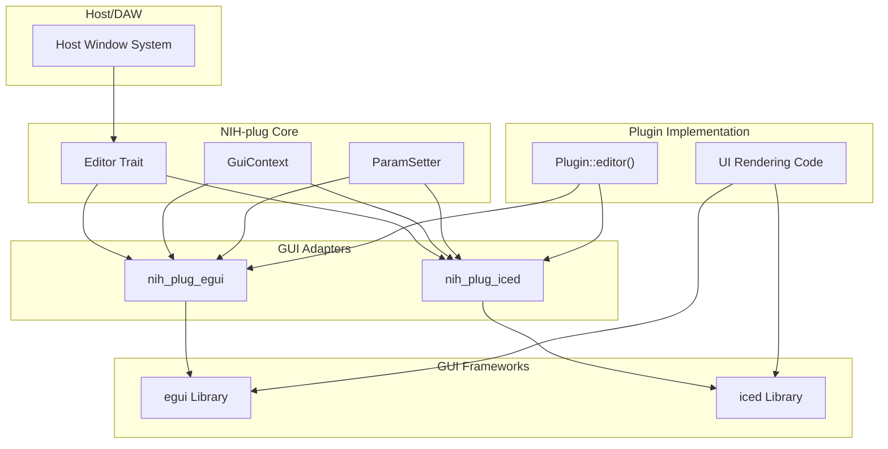
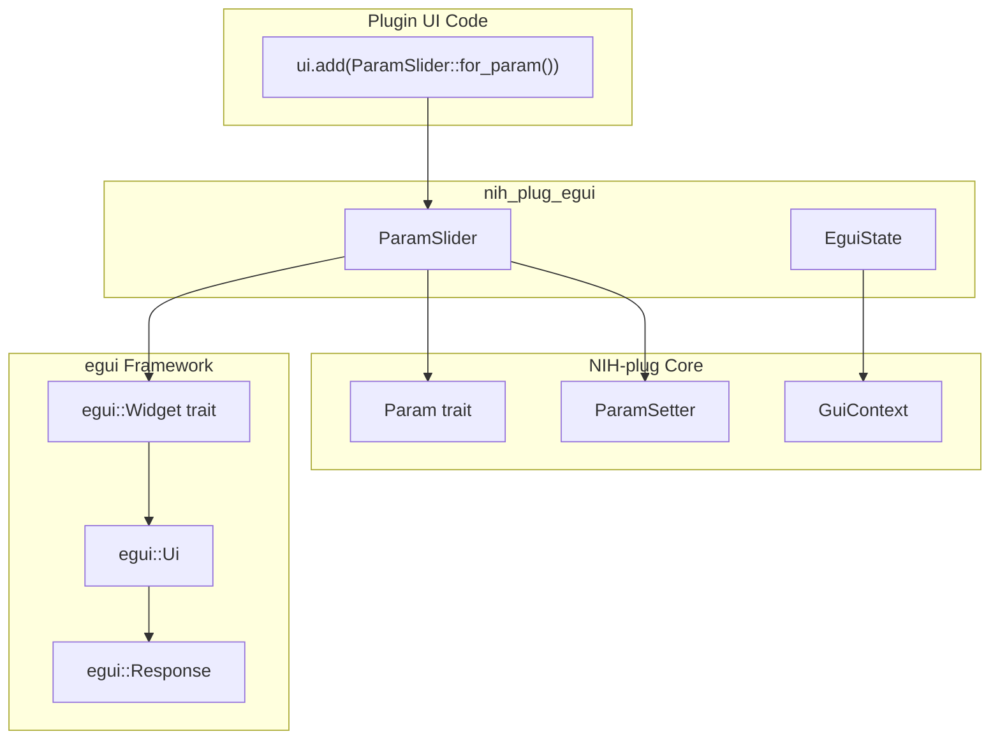
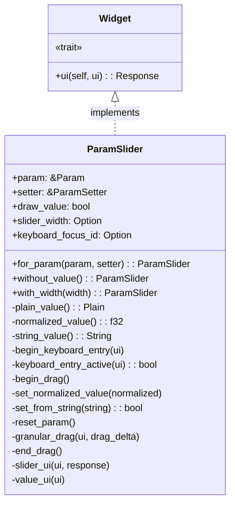
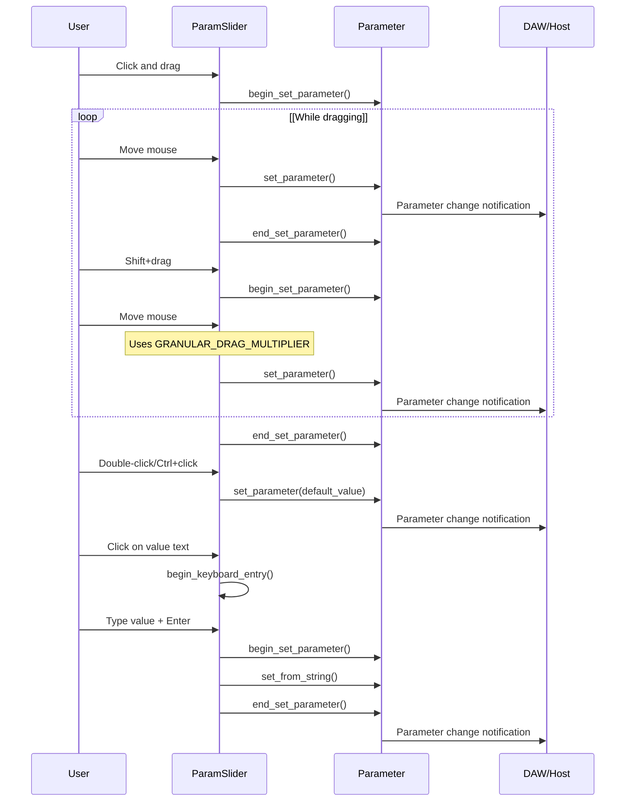
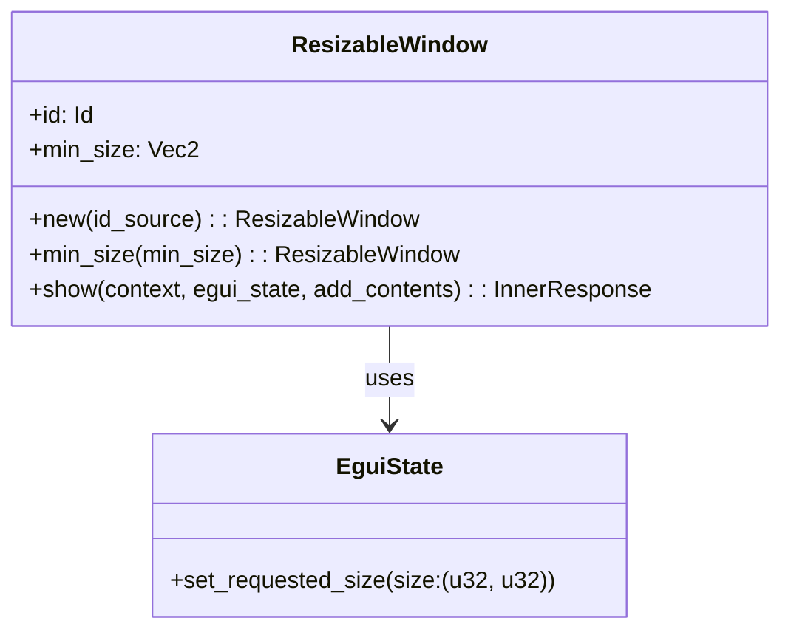
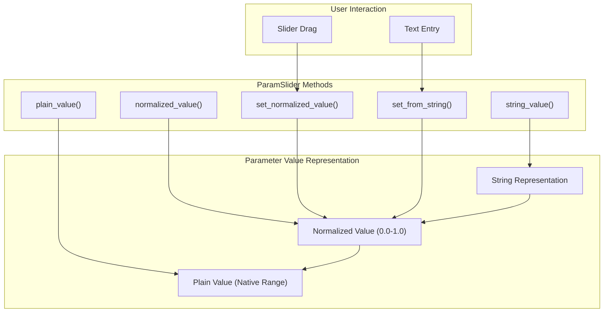
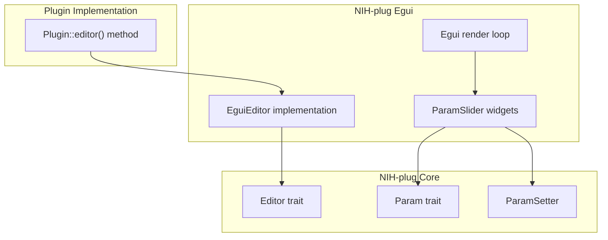

# Egui and Iced Integration

> **Relevant source files**
> * [Cargo.lock](https://github.com/robbert-vdh/nih-plug/blob/28b149ec/Cargo.lock)
> * [Cargo.toml](https://github.com/robbert-vdh/nih-plug/blob/28b149ec/Cargo.toml)
> * [README.md](https://github.com/robbert-vdh/nih-plug/blob/28b149ec/README.md)

NIH-plug provides adapters for two popular immediate mode GUI frameworks: [egui](https://github.com/robbert-vdh/nih-plug/blob/28b149ec/egui)

 and [iced](https://github.com/robbert-vdh/nih-plug/blob/28b149ec/iced)

 These adapters handle the integration between the plugin framework and the GUI library, managing window lifecycle, parameter binding, and rendering. This page provides a brief overview of both adapters. For detailed implementation guidance, refer to each crate's documentation and the example plugins.

## GUI Adapter Architecture

Both GUI adapters follow a common pattern, implementing the `Editor` trait from NIH-plug core and bridging between the host's windowing system and the GUI framework:

**NIH-plug GUI Adapter Integration**



Sources: [Cargo.toml L17-L19](https://github.com/robbert-vdh/nih-plug/blob/28b149ec/Cargo.toml#L17-L19)

 [README.md L138-L141](https://github.com/robbert-vdh/nih-plug/blob/28b149ec/README.md#L138-L141)

## nih_plug_egui

The `nih_plug_egui` crate provides integration with the egui immediate mode GUI library. Egui is characterized by its simple API where UI code is written in regular Rust functions that are called every frame.

### Key Components

| Component | Purpose |
| --- | --- |
| `create_egui_editor` | Factory function that creates an egui-based editor implementation |
| `EguiState` | Manages editor state including window size |
| `ParamSlider` | Widget for parameter manipulation with mouse, keyboard, and automation support |
| `ResizableWindow` | Provides window resizing functionality via draggable corner |

**egui Parameter Widget Architecture**



Sources: [nih_plug_egui/Cargo.toml L1-L27](https://github.com/robbert-vdh/nih-plug/blob/28b149ec/nih_plug_egui/Cargo.toml#L1-L27)

 [Cargo.toml L17](https://github.com/robbert-vdh/nih-plug/blob/28b149ec/Cargo.toml#L17-L17)

### ParamSlider Interaction

The `ParamSlider` widget provides multiple interaction methods:

* **Click and drag**: Normal parameter adjustment
* **Shift + drag**: Fine-grained control (granular drag)
* **Double-click / Ctrl+click**: Reset to default value
* **Click on value text**: Enter value via keyboard

Sources: [nih_plug_egui/src/widgets/param_slider.rs L42-L177](https://github.com/robbert-vdh/nih-plug/blob/28b149ec/nih_plug_egui/src/widgets/param_slider.rs#L42-L177)

### Example Usage

```
// In Plugin::editor() implementation
Some(Box::new(create_egui_editor(
    self.params.editor_state.clone(),
    (),
    |_, _| {},
    move |egui_ctx, setter, _state| {
        egui::CentralPanel::default().show(egui_ctx, |ui| {
            ui.label("My Plugin");
            ui.add(ParamSlider::for_param(&params.gain, setter));
        });
    },
)))
```

Sources: [plugins/examples/gain_gui_egui/src/lib.rs L1-L100](https://github.com/robbert-vdh/nih-plug/blob/28b149ec/plugins/examples/gain_gui_egui/src/lib.rs#L1-L100)

## Core Components

### ParamSlider Widget

The `ParamSlider` is the primary widget for displaying and manipulating plugin parameters. It provides a sophisticated slider control with several interaction methods:

* Normal clicking and dragging for standard parameter adjustment
* Shift+drag for fine-grained parameter control
* Double-click or Control+click to reset to default value
* Value text display with click-to-edit functionality



Sources: [nih_plug_egui/src/widgets/param_slider.rs L22-L358](https://github.com/robbert-vdh/nih-plug/blob/28b149ec/nih_plug_egui/src/widgets/param_slider.rs#L22-L358)

### Parameter Interaction Flow

The slider handles multiple types of interactions with differing behaviors:



Sources: [nih_plug_egui/src/widgets/param_slider.rs L42-L177](https://github.com/robbert-vdh/nih-plug/blob/28b149ec/nih_plug_egui/src/widgets/param_slider.rs#L42-L177)

 [nih_plug_egui/src/widgets/param_slider.rs L178-L356](https://github.com/robbert-vdh/nih-plug/blob/28b149ec/nih_plug_egui/src/widgets/param_slider.rs#L178-L356)

### ParamSlider Usage

To use `ParamSlider` in a plugin UI:

```
// In plugin editor implementation
ui.add(ParamSlider::for_param(&params.gain, &param_setter)
    .with_width(200.0));

// Or without value display
ui.add(ParamSlider::for_param(&params.threshold, &param_setter)
    .without_value());
```

Sources: [nih_plug_egui/src/widgets/param_slider.rs L43-L68](https://github.com/robbert-vdh/nih-plug/blob/28b149ec/nih_plug_egui/src/widgets/param_slider.rs#L43-L68)

### ResizableWindow

The `ResizableWindow` component handles plugin window resizing through a draggable corner:



Sources: [nih_plug_egui/src/resizable_window.rs L9-L81](https://github.com/robbert-vdh/nih-plug/blob/28b149ec/nih_plug_egui/src/resizable_window.rs#L9-L81)

## Implementation Details

### Parameter Value Handling

The `ParamSlider` widget handles parameter values in multiple formats:

1. **Normalized values** (0.0 to 1.0) for internal slider representation
2. **Plain values** (the actual parameter value in its native range)
3. **String representation** for displaying and entering values

The flow between these representations is managed by the `Param` trait from NIH-plug core:



Sources: [nih_plug_egui/src/widgets/param_slider.rs L70-L125](https://github.com/robbert-vdh/nih-plug/blob/28b149ec/nih_plug_egui/src/widgets/param_slider.rs#L70-L125)

### Granular Drag Implementation

The granular drag feature (activated with Shift+drag) provides fine control over parameters:

* Uses `GRANULAR_DRAG_MULTIPLIER` (0.0015) to scale mouse movement to smaller value changes
* Stores the starting value and accumulated movement in UI memory
* Allows precise adjustments to parameters with large ranges

Sources: [nih_plug_egui/src/widgets/param_slider.rs L13-L15](https://github.com/robbert-vdh/nih-plug/blob/28b149ec/nih_plug_egui/src/widgets/param_slider.rs#L13-L15)

 [nih_plug_egui/src/widgets/param_slider.rs L133-L149](https://github.com/robbert-vdh/nih-plug/blob/28b149ec/nih_plug_egui/src/widgets/param_slider.rs#L133-L149)

### UI Memory Management

The `ParamSlider` uses Egui's memory system to maintain state between frames:

| Memory ID | Purpose |
| --- | --- |
| `DRAG_NORMALIZED_START_VALUE_MEMORY_ID` | Stores initial value when granular dragging starts |
| `DRAG_AMOUNT_MEMORY_ID` | Accumulates drag distance for granular control |
| `VALUE_ENTRY_MEMORY_ID` | Stores text being entered during keyboard input mode |

Sources: [nih_plug_egui/src/widgets/param_slider.rs L17-L20](https://github.com/robbert-vdh/nih-plug/blob/28b149ec/nih_plug_egui/src/widgets/param_slider.rs#L17-L20)

 [nih_plug_egui/src/widgets/param_slider.rs L155-L176](https://github.com/robbert-vdh/nih-plug/blob/28b149ec/nih_plug_egui/src/widgets/param_slider.rs#L155-L176)

## Visual Rendering

The `ParamSlider` rendering consists of multiple components:

1. A background rectangle for the full slider range
2. A filled foreground rectangle representing the current value
3. A border stroke around the entire slider
4. An optional text value display that can be clicked to edit

For visual customization, utility functions are provided to manipulate colors:

* `add_hsv`: Additively modify hue, saturation, and value
* `scale_hsv`: Multiplicatively modify hue, saturation, and value

Sources: [nih_plug_egui/src/widgets/param_slider.rs L218-L242](https://github.com/robbert-vdh/nih-plug/blob/28b149ec/nih_plug_egui/src/widgets/param_slider.rs#L218-L242)

 [nih_plug_egui/src/widgets/util.rs L1-L21](https://github.com/robbert-vdh/nih-plug/blob/28b149ec/nih_plug_egui/src/widgets/util.rs#L1-L21)

## Integration with NIH-plug Core

The Egui integration connects with the core NIH-plug system through the following components:



Sources: [nih_plug_egui/src/widgets/param_slider.rs L8](https://github.com/robbert-vdh/nih-plug/blob/28b149ec/nih_plug_egui/src/widgets/param_slider.rs#L8-L8)

 [nih_plug_egui/Cargo.toml L19](https://github.com/robbert-vdh/nih-plug/blob/28b149ec/nih_plug_egui/Cargo.toml#L19-L19)

## Summary

The NIH-plug Egui integration provides a comprehensive system for creating plugin user interfaces with the Egui immediate mode GUI library. The `ParamSlider` widget forms the core of parameter interaction, offering multiple ways to manipulate plugin parameters with precise control. The integration handles the complexities of parameter value conversion, window management, and user interaction patterns, allowing plugin developers to focus on creative UI design rather than low-level details.