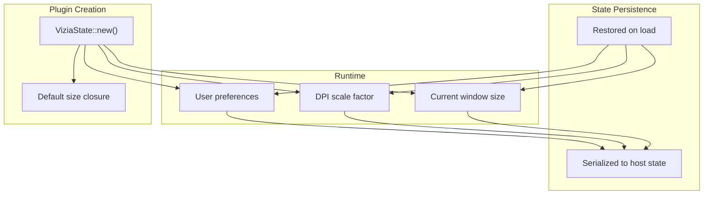
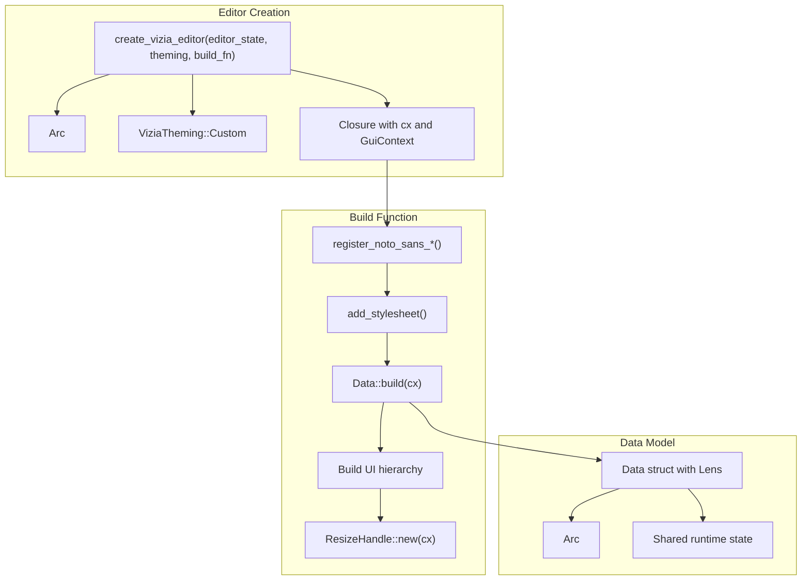
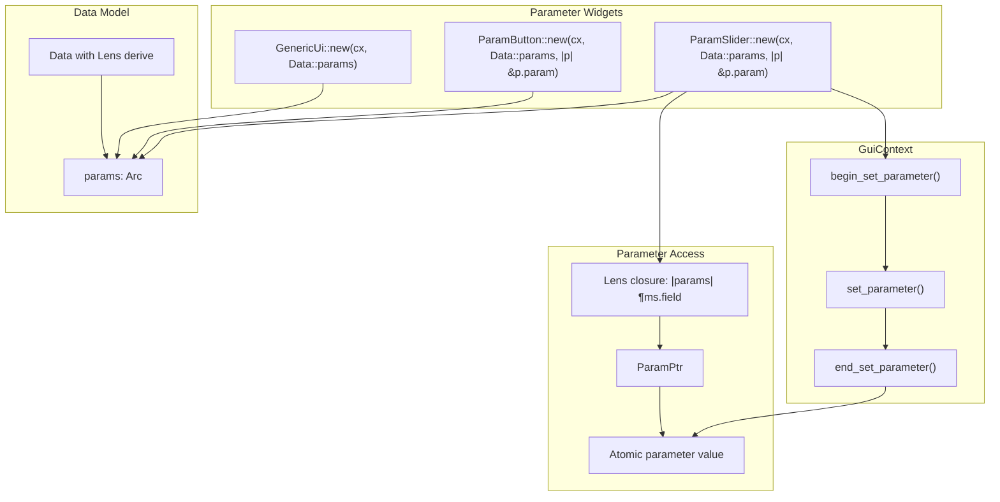
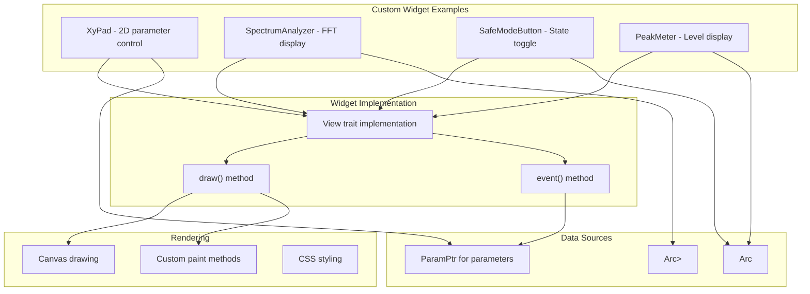
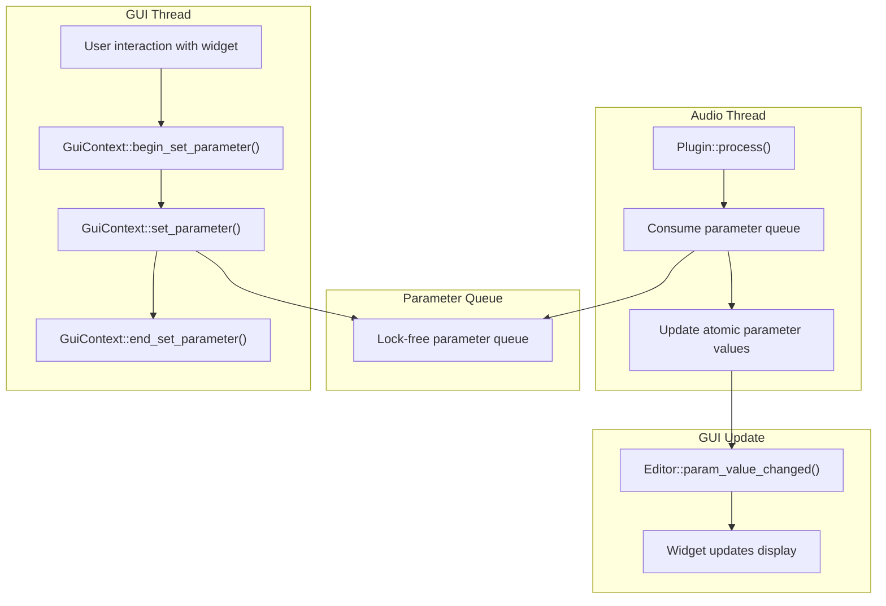

# GUI Integration

> **Relevant source files**
> * [Cargo.lock](https://github.com/robbert-vdh/nih-plug/blob/28b149ec/Cargo.lock)
> * [Cargo.toml](https://github.com/robbert-vdh/nih-plug/blob/28b149ec/Cargo.toml)
> * [README.md](https://github.com/robbert-vdh/nih-plug/blob/28b149ec/README.md)
> * [plugins/crisp/src/editor.rs](https://github.com/robbert-vdh/nih-plug/blob/28b149ec/plugins/crisp/src/editor.rs)
> * [plugins/diopser/src/editor.rs](https://github.com/robbert-vdh/nih-plug/blob/28b149ec/plugins/diopser/src/editor.rs)
> * [plugins/examples/gain_gui_vizia/src/editor.rs](https://github.com/robbert-vdh/nih-plug/blob/28b149ec/plugins/examples/gain_gui_vizia/src/editor.rs)
> * [plugins/spectral_compressor/src/editor.rs](https://github.com/robbert-vdh/nih-plug/blob/28b149ec/plugins/spectral_compressor/src/editor.rs)

This document covers NIH-plug's GUI system, the `Editor` trait, and the available GUI framework integrations. It explains how plugins create user interfaces, bind parameters to UI controls, and implement custom widgets. For information about parameters themselves, see [Parameter System](/robbert-vdh/nih-plug/2.2-parameter-system). For details on how contexts enable GUI-plugin communication, see [Context System](/robbert-vdh/nih-plug/2.4-context-system).

---

## Overview

NIH-plug provides an abstraction layer for plugin GUIs through the `Editor` trait, allowing plugins to integrate with multiple GUI frameworks without being tied to a specific implementation. The framework currently provides three official GUI adapters as separate crates:

* **nih_plug_vizia** - Integration with the [VIZIA](https://github.com/robbert-vdh/nih-plug/blob/28b149ec/VIZIA)  framework
* **nih_plug_egui** - Integration with [egui](https://github.com/robbert-vdh/nih-plug/blob/28b149ec/egui)
* **nih_plug_iced** - Integration with [iced](https://github.com/robbert-vdh/nih-plug/blob/28b149ec/iced)

Each adapter handles the complexity of window creation, event handling, and parameter synchronization, providing a simplified API for plugin developers.

**Sources:** [Cargo.toml L15-L19](https://github.com/robbert-vdh/nih-plug/blob/28b149ec/Cargo.toml#L15-L19)

 [README.md L138-L141](https://github.com/robbert-vdh/nih-plug/blob/28b149ec/README.md#L138-L141)

---

## The Editor Trait

The `Editor` trait defines the interface between a plugin and its GUI. Plugins implement this trait to provide a visual interface, which the wrapper then embeds into the host's window system.

### Core Editor Responsibilities

```

```

**Diagram: Editor trait integration with plugin and wrapper**

The `Editor` trait methods handle:

* `spawn()` - Creates the GUI window embedded in the host's parent window
* `size()` - Reports the GUI's current dimensions
* `set_scale()` - Handles DPI scaling changes from the host
* `param_value_changed()` - Notifies the GUI when parameter values change
* `param_modulation_changed()` - Notifies the GUI when parameter modulation changes (CLAP)
* `param_values_changed()` - Batch notification for multiple parameter changes

**Sources:** Based on framework architecture from high-level diagrams

---

## GUI State Management

Each GUI framework adapter provides a state object that persists GUI-specific settings across plugin instances. This state is separate from plugin parameters and is managed by the editor.

### ViziaState

The most commonly used state object in the codebase is `ViziaState`, which stores window size and other VIZIA-specific settings.



**Diagram: ViziaState lifecycle and persistence**

The pattern for creating editor state:

```rust
pub(crate) fn default_state() -> Arc<ViziaState> {
    ViziaState::new(|| (EDITOR_WIDTH, EDITOR_HEIGHT))
}
```

**Example from Diopser:**

* [plugins/diopser/src/editor.rs L62-L64](https://github.com/robbert-vdh/nih-plug/blob/28b149ec/plugins/diopser/src/editor.rs#L62-L64)  - Defines `default_state()` returning a `ViziaState` with fixed dimensions
* [plugins/spectral_compressor/src/editor.rs L74-L79](https://github.com/robbert-vdh/nih-plug/blob/28b149ec/plugins/spectral_compressor/src/editor.rs#L74-L79)  - Shows dynamic sizing based on `EditorMode`
* [plugins/examples/gain_gui_vizia/src/editor.rs L20-L23](https://github.com/robbert-vdh/nih-plug/blob/28b149ec/plugins/examples/gain_gui_vizia/src/editor.rs#L20-L23)  - Simple fixed-size state

**Sources:** [plugins/diopser/src/editor.rs L62-L64](https://github.com/robbert-vdh/nih-plug/blob/28b149ec/plugins/diopser/src/editor.rs#L62-L64)

 [plugins/spectral_compressor/src/editor.rs L74-L79](https://github.com/robbert-vdh/nih-plug/blob/28b149ec/plugins/spectral_compressor/src/editor.rs#L74-L79)

 [plugins/examples/gain_gui_vizia/src/editor.rs L20-L23](https://github.com/robbert-vdh/nih-plug/blob/28b149ec/plugins/examples/gain_gui_vizia/src/editor.rs#L20-L23)

---

## Creating Editors with Framework Adapters

### VIZIA Integration

VIZIA is the most feature-complete integration in the codebase, used by Diopser, Spectral Compressor, and Crisp. The `create_vizia_editor()` function handles editor creation.



**Diagram: VIZIA editor creation flow**

#### Typical VIZIA Editor Pattern

1. **Define a Data struct** implementing `Model` with `Lens` derive:

```rust
#[derive(Lens, Clone)]
pub(crate) struct Data {
    pub(crate) params: Arc<DiopserParams>,
    pub(crate) sample_rate: Arc<AtomicF32>,
    pub(crate) spectrum: Arc<Mutex<SpectrumOutput>>,
    // ... other shared state
}

impl Model for Data {}
```

1. **Create the editor** with `create_vizia_editor()`:

```javascript
pub(crate) fn create(editor_data: Data, editor_state: Arc<ViziaState>) -> Option<Box<dyn Editor>> {
    create_vizia_editor(editor_state, ViziaTheming::Custom, move |cx, _| {
        assets::register_noto_sans_light(cx);
        assets::register_noto_sans_thin(cx);
        
        if let Err(err) = cx.add_stylesheet(include_style!("src/editor/theme.css")) {
            nih_error!("Failed to load stylesheet: {err:?}")
        }
        
        editor_data.clone().build(cx);
        
        // Build UI hierarchy
        VStack::new(cx, |cx| {
            // ... UI elements
        });
        
        ResizeHandle::new(cx);
    })
}
```

**Examples:**

* [plugins/diopser/src/editor.rs L66-L85](https://github.com/robbert-vdh/nih-plug/blob/28b149ec/plugins/diopser/src/editor.rs#L66-L85)  - Full editor creation with custom widgets
* [plugins/spectral_compressor/src/editor.rs L81-L106](https://github.com/robbert-vdh/nih-plug/blob/28b149ec/plugins/spectral_compressor/src/editor.rs#L81-L106)  - Editor with conditional analyzer display
* [plugins/crisp/src/editor.rs L37-L75](https://github.com/robbert-vdh/nih-plug/blob/28b149ec/plugins/crisp/src/editor.rs#L37-L75)  - Simple editor with GenericUi
* [plugins/examples/gain_gui_vizia/src/editor.rs L25-L67](https://github.com/robbert-vdh/nih-plug/blob/28b149ec/plugins/examples/gain_gui_vizia/src/editor.rs#L25-L67)  - Minimal example with ParamSlider

**Sources:** [plugins/diopser/src/editor.rs L47-L85](https://github.com/robbert-vdh/nih-plug/blob/28b149ec/plugins/diopser/src/editor.rs#L47-L85)

 [plugins/spectral_compressor/src/editor.rs L59-L106](https://github.com/robbert-vdh/nih-plug/blob/28b149ec/plugins/spectral_compressor/src/editor.rs#L59-L106)

 [plugins/crisp/src/editor.rs L25-L75](https://github.com/robbert-vdh/nih-plug/blob/28b149ec/plugins/crisp/src/editor.rs#L25-L75)

 [plugins/examples/gain_gui_vizia/src/editor.rs L12-L67](https://github.com/robbert-vdh/nih-plug/blob/28b149ec/plugins/examples/gain_gui_vizia/src/editor.rs#L12-L67)

---

## Parameter Binding

NIH-plug's GUI widgets automatically bind to parameters through the `GuiContext` and the Data model's lens system.

### Parameter Widget Pattern



**Diagram: Parameter widget binding flow**

### Available Parameter Widgets

| Widget | Purpose | Example Usage |
| --- | --- | --- |
| `ParamSlider` | Slider control for numeric parameters | [plugins/diopser/src/editor.rs L116-L118](https://github.com/robbert-vdh/nih-plug/blob/28b149ec/plugins/diopser/src/editor.rs#L116-L118) |
| `ParamButton` | Toggle button for boolean parameters | [plugins/diopser/src/editor.rs L122-L124](https://github.com/robbert-vdh/nih-plug/blob/28b149ec/plugins/diopser/src/editor.rs#L122-L124) |
| `ParamKnob` | Rotary knob control | (Available but not shown in examples) |
| `GenericUi` | Auto-generates UI for all parameters | [plugins/crisp/src/editor.rs L64](https://github.com/robbert-vdh/nih-plug/blob/28b149ec/plugins/crisp/src/editor.rs#L64-L64) |

**ParamSlider Example:**

```yaml
ParamSlider::new(cx, Data::params, |params| &params.automation_precision)
    .with_label("Automation Precision")
    .id("automation-precision");
```

**GenericUi Example:**

```
GenericUi::new(cx, Data::params.map(|p| p.global.clone()));
```

**Sources:** [plugins/diopser/src/editor.rs L116-L118](https://github.com/robbert-vdh/nih-plug/blob/28b149ec/plugins/diopser/src/editor.rs#L116-L118)

 [plugins/spectral_compressor/src/editor.rs L156-L196](https://github.com/robbert-vdh/nih-plug/blob/28b149ec/plugins/spectral_compressor/src/editor.rs#L156-L196)

 [plugins/crisp/src/editor.rs L64](https://github.com/robbert-vdh/nih-plug/blob/28b149ec/plugins/crisp/src/editor.rs#L64-L64)

 [plugins/examples/gain_gui_vizia/src/editor.rs L49-L50](https://github.com/robbert-vdh/nih-plug/blob/28b149ec/plugins/examples/gain_gui_vizia/src/editor.rs#L49-L50)

---

## Custom Widgets and Visualizations

NIH-plug plugins often implement custom widgets for specialized visualization and interaction. These widgets are built using the underlying GUI framework's APIs while integrating with NIH-plug's parameter system.

### Custom Widget Architecture



**Diagram: Custom widget patterns in NIH-plug**

### XyPad Widget

The XyPad widget in Diopser provides 2D control over two parameters simultaneously (frequency and resonance), overlaid on the spectrum analyzer.

**Key implementation aspects:**

* Maps 2D mouse position to two normalized parameter values
* Applies custom normalization functions for non-linear parameter mapping
* Integrates with `GuiContext` for parameter automation
* Renders control point and guide lines over spectrum visualization

**Sources:** [plugins/diopser/src/editor.rs L158-L173](https://github.com/robbert-vdh/nih-plug/blob/28b149ec/plugins/diopser/src/editor.rs#L158-L173)

### SpectrumAnalyzer Widget

Both Diopser and Spectral Compressor implement custom spectrum analyzers that visualize FFT data in real-time.

**Diopser's analyzer:**

* Receives FFT data through `Arc<Mutex<SpectrumOutput>>`
* Renders frequency spectrum with logarithmic frequency axis
* Overlays filter frequency visualization
* Integrates with safe mode parameter clamping

**Spectral Compressor's analyzer:**

* Shows multiple spectrum types (input, output, sidechain)
* Displays compression envelopes per-frequency
* Uses `triple_buffer` for lock-free data transfer from audio thread
* Renders threshold and gain reduction curves

**Sources:** [plugins/diopser/src/editor.rs L151-L156](https://github.com/robbert-vdh/nih-plug/blob/28b149ec/plugins/diopser/src/editor.rs#L151-L156)

 [plugins/spectral_compressor/src/editor.rs L225-L232](https://github.com/robbert-vdh/nih-plug/blob/28b149ec/plugins/spectral_compressor/src/editor.rs#L225-L232)

### SafeModeButton Widget

A custom toggle button in Diopser that clamps the filter stages parameter to prevent CPU overload:

```yaml
SafeModeButton::new(cx, Data::safe_mode_clamper, "Safe mode")
```

The button interacts with a `SafeModeClamper` that adjusts parameter ranges dynamically:

**Sources:** [plugins/diopser/src/editor.rs L120](https://github.com/robbert-vdh/nih-plug/blob/28b149ec/plugins/diopser/src/editor.rs#L120-L120)

 [plugins/diopser/src/editor.rs L54-L56](https://github.com/robbert-vdh/nih-plug/blob/28b149ec/plugins/diopser/src/editor.rs#L54-L56)

### PeakMeter Widget

The gain_gui_vizia example demonstrates a peak meter that displays audio levels:

```yaml
PeakMeter::new(
    cx,
    Data::peak_meter
        .map(|peak_meter| util::gain_to_db(peak_meter.load(Ordering::Relaxed))),
    Some(Duration::from_millis(600)),
)
```

The meter reads from an `Arc<AtomicF32>` updated by the audio processing thread, demonstrating thread-safe GUI updates.

**Sources:** [plugins/examples/gain_gui_vizia/src/editor.rs L52-L59](https://github.com/robbert-vdh/nih-plug/blob/28b149ec/plugins/examples/gain_gui_vizia/src/editor.rs#L52-L59)

---

## Thread Safety and Parameter Updates

GUI updates in NIH-plug follow a unidirectional data flow pattern to maintain thread safety between the GUI thread and the audio processing thread.



**Diagram: Thread-safe parameter update flow**

This architecture ensures:

* **Lock-free audio thread** - Parameter changes are queued without blocking
* **Atomic reads in GUI** - Widgets read current values from atomic storage
* **Consistent state** - Updates flow unidirectionally from user → audio → GUI
* **Host automation** - The same queue handles both user and host parameter changes

**Sources:** Based on Runtime Architecture from high-level diagrams

---

## Egui and Iced Integration

### Egui Integration (nih_plug_egui)

The egui adapter provides immediate-mode GUI support. While not shown in the provided example files, the integration follows a similar pattern:

* Uses `create_egui_editor()` function
* Provides `EguiState` for state management
* Implements immediate-mode update callback with parameter widgets
* Reference implementation in [nih_plug_egui](https://github.com/robbert-vdh/nih-plug/blob/28b149ec/nih_plug_egui)  crate

### Iced Integration (nih_plug_iced)

The iced adapter provides retained-mode GUI with the Elm architecture:

* Uses `create_iced_editor()` function
* Provides `IcedState` for state management
* Implements message-based update pattern
* Reference implementation in [nih_plug_iced](https://github.com/robbert-vdh/nih-plug/blob/28b149ec/nih_plug_iced)  crate

**Sources:** [Cargo.toml L15-L19](https://github.com/robbert-vdh/nih-plug/blob/28b149ec/Cargo.toml#L15-L19)

 [README.md L138-L141](https://github.com/robbert-vdh/nih-plug/blob/28b149ec/README.md#L138-L141)

---

## Bring-Your-Own-GUI Examples

NIH-plug also supports custom GUI implementations using raw window access through baseview. The repository includes examples for:

* **byo_gui_gl** - OpenGL rendering [plugins/examples/byo_gui_gl](https://github.com/robbert-vdh/nih-plug/blob/28b149ec/plugins/examples/byo_gui_gl)
* **byo_gui_wgpu** - wgpu (WebGPU) rendering [plugins/examples/byo_gui_wgpu](https://github.com/robbert-vdh/nih-plug/blob/28b149ec/plugins/examples/byo_gui_wgpu)
* **byo_gui_softbuffer** - Software rendering [plugins/examples/byo_gui_softbuffer](https://github.com/robbert-vdh/nih-plug/blob/28b149ec/plugins/examples/byo_gui_softbuffer)

These examples demonstrate direct baseview integration for custom rendering pipelines, useful for plugins requiring specialized graphics or existing rendering code.

**Sources:** [README.md L206-L208](https://github.com/robbert-vdh/nih-plug/blob/28b149ec/README.md#L206-L208)

 [Cargo.toml L25-L27](https://github.com/robbert-vdh/nih-plug/blob/28b149ec/Cargo.toml#L25-L27)

---

## Editor Integration with Plugin

The `Plugin` trait's `editor()` method returns the editor implementation:

```rust
impl Plugin for MyPlugin {
    // ...
    
    fn editor(&mut self, _async_executor: AsyncExecutor<Self>) -> Option<Box<dyn Editor>> {
        editor::create(
            self.params.clone(),
            self.editor_state.clone(),
        )
    }
}
```

The editor has access to:

* **Parameters** via `Arc<Params>` for reading and binding to widgets
* **GuiContext** (provided by wrappers) for modifying parameters
* **Shared state** via `Arc<AtomicX>` or `Arc<Mutex<X>>` for audio-thread data
* **AsyncExecutor** for background tasks (if needed)

This separation ensures the editor can be created and destroyed independently of the audio processing, supporting hosts that open/close GUIs dynamically.

**Sources:** Based on Plugin trait architecture from overview diagrams

---

## Summary

| Component | Purpose | Key Types |
| --- | --- | --- |
| `Editor` trait | Defines GUI lifecycle and host integration | `spawn()`, `size()`, `param_value_changed()` |
| GUI state objects | Persist window size and preferences | `ViziaState`, `EguiState`, `IcedState` |
| Framework adapters | Create editors for specific GUI libraries | `create_vizia_editor()`, `create_egui_editor()` |
| Parameter widgets | Bind UI controls to plugin parameters | `ParamSlider`, `ParamButton`, `GenericUi` |
| Custom widgets | Specialized visualizations and controls | `XyPad`, `SpectrumAnalyzer`, `PeakMeter` |
| Data model | Shares state between audio and GUI threads | `Arc<Params>`, `Arc<AtomicF32>`, `Arc<Mutex<T>>` |

**Sources:** All sections above