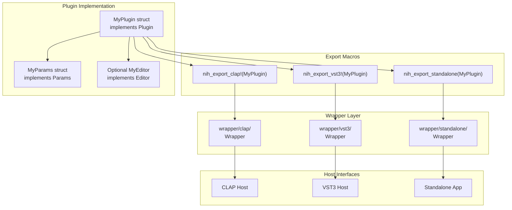

# Plugin Trait

> **Relevant source files**
> * [src/lib.rs](https://github.com/robbert-vdh/nih-plug/blob/28b149ec/src/lib.rs)
> * [src/plugin.rs](https://github.com/robbert-vdh/nih-plug/blob/28b149ec/src/plugin.rs)

This document covers the `Plugin` trait, the central trait that all NIH-plug plugins must implement. It defines the interface between plugin implementations and the framework's wrapper layer. For information about the parameter system accessed through `Plugin::params()`, see [Parameter System](/robbert-vdh/nih-plug/2.2-parameter-system). For details on the processing lifecycle, see [Audio Processing Lifecycle](/robbert-vdh/nih-plug/2.5-audio-processing-lifecycle). For information about how wrappers consume this trait, see [Plugin Wrappers](/robbert-vdh/nih-plug/3-plugin-wrappers).

## Overview

The `Plugin` trait is defined in [src/plugin.rs L59-L255](https://github.com/robbert-vdh/nih-plug/blob/28b149ec/src/plugin.rs#L59-L255)

 and follows a semi-declarative design philosophy. Plugin information is defined through three mechanisms:

1. **Compile-time constants** - Immutable plugin metadata and configuration (e.g., `NAME`, `AUDIO_IO_LAYOUTS`)
2. **Once-queried methods** - Functions called immediately after plugin instantiation (e.g., `params()`, `editor()`)
3. **Lifecycle methods** - Stateful functions called throughout the plugin's lifetime (e.g., `initialize()`, `process()`)

All `Plugin` implementations must also implement `Default + Send + 'static`, as the framework instantiates plugins using `Plugin::default()`.

**Sources**: [src/plugin.rs L59-L255](https://github.com/robbert-vdh/nih-plug/blob/28b149ec/src/plugin.rs#L59-L255)

 [src/lib.rs L21-L27](https://github.com/robbert-vdh/nih-plug/blob/28b149ec/src/lib.rs#L21-L27)

## Trait Structure Overview

```mermaid
flowchart TD

Plugin["Plugin trait<br>(src/plugin.rs:59)"]
Metadata["NAME, VENDOR, URL<br>EMAIL, VERSION"]
AudioConfig["AUDIO_IO_LAYOUTS<br>MIDI_INPUT, MIDI_OUTPUT"]
ProcessConfig["SAMPLE_ACCURATE_AUTOMATION<br>HARD_REALTIME_ONLY"]
SysExType["SysExMessage<br>(default: unit type)"]
TaskType["BackgroundTask<br>(default: unit type)"]
ParamsMethod["params() -> Arc"]
EditorMethod["editor() -> Option>"]
ExecutorMethod["task_executor() -> TaskExecutor"]
FilterMethod["filter_state()"]
InitMethod["initialize()<br>returns bool"]
ResetMethod["reset()"]
ProcessMethod["process()<br>returns ProcessStatus"]
DeactivateMethod["deactivate()"]
ParamSystem["Parameter System"]
EditorSystem["Editor System"]
BufferContext["Buffer & Context"]

ParamsMethod --> ParamSystem
EditorMethod --> EditorSystem
ProcessMethod --> BufferContext

subgraph subGraph4 ["Plugin Trait Definition"]
    Plugin
    Plugin --> Metadata
    Plugin --> AudioConfig
    Plugin --> ProcessConfig
    Plugin --> SysExType
    Plugin --> TaskType
    Plugin --> ParamsMethod
    Plugin --> EditorMethod
    Plugin --> ExecutorMethod
    Plugin --> FilterMethod
    Plugin --> InitMethod
    Plugin --> ResetMethod
    Plugin --> ProcessMethod
    Plugin --> DeactivateMethod

subgraph subGraph3 ["Lifecycle Methods"]
    InitMethod
    ResetMethod
    ProcessMethod
    DeactivateMethod
end

subgraph subGraph2 ["Once-Queried Methods"]
    ParamsMethod
    EditorMethod
    ExecutorMethod
    FilterMethod
end

subgraph subGraph1 ["Associated Types"]
    SysExType
    TaskType
end

subgraph subGraph0 ["Compile-Time Constants"]
    Metadata
    AudioConfig
    ProcessConfig
end
end
```



**Sources**: [src/plugin.rs L59-L255](https://github.com/robbert-vdh/nih-plug/blob/28b149ec/src/plugin.rs#L59-L255)

## Plugin Constants

The following compile-time constants define plugin metadata and processing configuration:

| Constant | Type | Purpose |
| --- | --- | --- |
| `NAME` | `&'static str` | Plugin name displayed to users |
| `VENDOR` | `&'static str` | Plugin vendor/developer name |
| `URL` | `&'static str` | URL to plugin's website |
| `EMAIL` | `&'static str` | Vendor contact email |
| `VERSION` | `&'static str` | Semver-compatible version string (e.g., `"0.1.0"`) |
| `AUDIO_IO_LAYOUTS` | `&'static [AudioIOLayout]` | Supported audio I/O configurations (first is default) |
| `MIDI_INPUT` | `MidiConfig` | MIDI/note event input configuration (default: `MidiConfig::None`) |
| `MIDI_OUTPUT` | `MidiConfig` | MIDI/note event output configuration (default: `MidiConfig::None`) |
| `SAMPLE_ACCURATE_AUTOMATION` | `bool` | Enable sub-buffer parameter change splitting (default: `false`) |
| `HARD_REALTIME_ONLY` | `bool` | Declare hard realtime processing requirement (default: `false`) |

**Sources**: [src/plugin.rs L60-L118](https://github.com/robbert-vdh/nih-plug/blob/28b149ec/src/plugin.rs#L60-L118)

### AUDIO_IO_LAYOUTS

The `AUDIO_IO_LAYOUTS` constant defines all supported audio configurations. The slice order matters: the first layout is used as the default. Both `AudioIOLayout` and `PortNames` provide `.const_default()` for const construction:

```javascript
const AUDIO_IO_LAYOUTS: &'static [AudioIOLayout] = &[AudioIOLayout {
    main_input_channels: NonZeroU32::new(2),
    main_output_channels: NonZeroU32::new(2),
    aux_input_ports: &[new_nonzero_u32(2)],
    ..AudioIOLayout::const_default()
}];
```

An empty slice indicates the plugin has no audio I/O. Note that some hosts (e.g., Ableton Live) may refuse to load plugins with no main output.

**Sources**: [src/plugin.rs L73-L99](https://github.com/robbert-vdh/nih-plug/blob/28b149ec/src/plugin.rs#L73-L99)

### SAMPLE_ACCURATE_AUTOMATION

When `SAMPLE_ACCURATE_AUTOMATION` is `true`, the processing cycle may be split into smaller chunks when parameter changes occur mid-buffer. Chunks can be as small as a single sample depending on the host (Bitwig Studio limits this to 64-sample granularity). This enables precise automation at the cost of additional processing overhead.

**Sources**: [src/plugin.rs L109-L113](https://github.com/robbert-vdh/nih-plug/blob/28b149ec/src/plugin.rs#L109-L113)

## Associated Types

### SysExMessage

```
type SysExMessage: SysExMessage;
```

Defines the plugin's SysEx message type for MIDI System Exclusive communication. Set to `()` if the plugin does not use SysEx. To send/receive SysEx, `MIDI_INPUT` and/or `MIDI_OUTPUT` must be set to `MidiConfig::Basic` or higher. The type must implement the `SysExMessage` trait for conversion between structured messages and byte buffers.

**Sources**: [src/plugin.rs L120-L126](https://github.com/robbert-vdh/nih-plug/blob/28b149ec/src/plugin.rs#L120-L126)

### BackgroundTask

```
type BackgroundTask: Send;
```

Defines the type for background tasks that execute off the audio thread. Typically an enum representing different task types. Tasks should avoid heap allocations (`Vec`, `Box`) for real-time safety. Set to `()` if the plugin has no background tasks. Tasks are dispatched via context methods and executed through `task_executor()`.

**Sources**: [src/plugin.rs L128-L145](https://github.com/robbert-vdh/nih-plug/blob/28b149ec/src/plugin.rs#L128-L145)

## Plugin Lifecycle

```

```

**Sources**: [src/plugin.rs L185-L254](https://github.com/robbert-vdh/nih-plug/blob/28b149ec/src/plugin.rs#L185-L254)

 [src/lib.rs L38-L66](https://github.com/robbert-vdh/nih-plug/blob/28b149ec/src/lib.rs#L38-L66)

## Lifecycle Methods

### initialize()

```rust
fn initialize(
    &mut self,
    audio_io_layout: &AudioIOLayout,
    buffer_config: &BufferConfig,
    context: &mut impl InitContext<Self>,
) -> bool
```

Called when the plugin is activated with a specific audio configuration. This is where memory allocation and sample-rate-dependent precomputation should occur. Key behaviors:

* Called after `Plugin::default()` and after loading saved state
* May be called multiple times in rapid succession (e.g., during state restoration)
* Return `false` to indicate initialization failure
* Audio I/O and buffer sizes are fixed until this is called again
* Always followed by a call to `reset()`
* Latency can be set via `context.set_latency_samples()`

Default implementation returns `true` (success).

**Sources**: [src/plugin.rs L185-L211](https://github.com/robbert-vdh/nih-plug/blob/28b149ec/src/plugin.rs#L185-L211)

### reset()

```rust
fn reset(&mut self)
```

Clears internal state such as filter coefficients, envelopes, phases, and other runtime data. Always called immediately after `initialize()`, and may be called at any time from the audio thread. Must be realtime-safe (no allocations or blocking operations).

Default implementation is a no-op.

**Sources**: [src/plugin.rs L213-L216](https://github.com/robbert-vdh/nih-plug/blob/28b149ec/src/plugin.rs#L213-L216)

### process()

```rust
fn process(
    &mut self,
    buffer: &mut Buffer,
    aux: &mut AuxiliaryBuffers,
    context: &mut impl ProcessContext<Self>,
) -> ProcessStatus
```

The main audio processing callback. Key properties:

* Input buffers are pre-copied to output buffers unless processing in-place (most hosts do in-place)
* All channels contain the same number of samples
* Denormals are handled by the framework
* `Buffer` provides multiple iteration patterns (per-sample, per-block) - see [Audio Buffer System](/robbert-vdh/nih-plug/2.3-audio-buffer-system)
* `AuxiliaryBuffers` contains sidechain inputs and auxiliary outputs
* `ProcessContext` provides event handling and transport info - see [Context System](/robbert-vdh/nih-plug/2.4-context-system)

When `assert_process_allocs` feature is enabled, allocations in this function abort the program in debug mode.

**Sources**: [src/plugin.rs L218-L244](https://github.com/robbert-vdh/nih-plug/blob/28b149ec/src/plugin.rs#L218-L244)

### deactivate()

```rust
fn deactivate(&mut self)
```

Called when the plugin is deactivated. Optional cleanup or deallocation can occur here. The host will call `initialize()` again before resuming processing. No one-to-one relationship exists between `initialize()` and `deactivate()` calls - `initialize()` may be called multiple times before deactivation.

Default implementation is a no-op.

**Sources**: [src/plugin.rs L246-L254](https://github.com/robbert-vdh/nih-plug/blob/28b149ec/src/plugin.rs#L246-L254)

## Extension Methods

### params()

```rust
fn params(&self) -> Arc<dyn Params>
```

Returns the plugin's parameter tree. Called once immediately after plugin instantiation. The returned `Arc<dyn Params>` is shared between the audio thread and GUI thread, enabling lock-free parameter access. See [Parameter System](/robbert-vdh/nih-plug/2.2-parameter-system) for details on implementing the `Params` trait.

**Sources**: [src/plugin.rs L147-L152](https://github.com/robbert-vdh/nih-plug/blob/28b149ec/src/plugin.rs#L147-L152)

### editor()

```rust
fn editor(&mut self, async_executor: AsyncExecutor<Self>) -> Option<Box<dyn Editor>>
```

Returns an editor extension if the plugin has a GUI. Called once after instantiation. Takes `&mut self` to facilitate moving data into the `Editor` implementation. The `async_executor` parameter provides task scheduling capabilities. See [Editor System Overview](/robbert-vdh/nih-plug/4.1-editor-system-overview) for details.

Default implementation returns `None` (no GUI).

**Sources**: [src/plugin.rs L154-L167](https://github.com/robbert-vdh/nih-plug/blob/28b149ec/src/plugin.rs#L154-L167)

### task_executor()

```rust
fn task_executor(&mut self) -> TaskExecutor<Self>
```

Returns a closure that executes `BackgroundTask`s. Called once after instantiation. Takes `&mut self` to facilitate capturing state. Tasks are typically sent over channels or triple buffers for communication with the audio thread. See [Background Tasks and Async Execution](/robbert-vdh/nih-plug/6.3-background-tasks-and-async-execution) for details.

Default implementation returns a no-op executor.

**Sources**: [src/plugin.rs L136-L145](https://github.com/robbert-vdh/nih-plug/blob/28b149ec/src/plugin.rs#L136-L145)

### filter_state()

```rust
fn filter_state(state: &mut PluginState)
```

Called before loading a `PluginState`, allowing migration of old state. Use cases include:

* Renaming parameter IDs
* Remapping parameter values
* Preserving preset compatibility when adding new parameters

Access `state.version` to perform version-specific migrations. Note that automation may still break when renaming parameters.

Default implementation is a no-op.

**Sources**: [src/plugin.rs L169-L179](https://github.com/robbert-vdh/nih-plug/blob/28b149ec/src/plugin.rs#L169-L179)

## ProcessStatus

```
pub enum ProcessStatus {
    Error(&'static str),
    Normal,
    Tail(u32),
    KeepAlive,
}
```

The return type of `process()` indicating the plugin's current state:

| Variant | Behavior |
| --- | --- |
| `Error(&'static str)` | Processing error occurred; message describes the issue |
| `Normal` | Processing completed normally; host may suspend if input is silent |
| `Tail(u32)` | Plugin has a tail (e.g., reverb decay) lasting the specified number of samples |
| `KeepAlive` | Plugin produces sound regardless of input (synthesizer, infinite tail); host should not deactivate |

**Sources**: [src/plugin.rs L257-L271](https://github.com/robbert-vdh/nih-plug/blob/28b149ec/src/plugin.rs#L257-L271)

## Integration with Wrappers



The wrappers instantiate plugins via `Plugin::default()`, query constants and once-called methods, then translate host-specific calls into `Plugin` trait method invocations. Each wrapper handles:

* Parameter mapping between host and `Params` tree
* Audio buffer format conversion
* Event translation (MIDI, note expressions)
* State persistence via `PluginState` serialization
* GUI lifecycle management via `Editor` trait

See [Plugin Wrappers](/robbert-vdh/nih-plug/3-plugin-wrappers) for detailed wrapper architecture.

**Sources**: [src/plugin.rs L20-L23](https://github.com/robbert-vdh/nih-plug/blob/28b149ec/src/plugin.rs#L20-L23)

 [src/lib.rs L21-L35](https://github.com/robbert-vdh/nih-plug/blob/28b149ec/src/lib.rs#L21-L35)