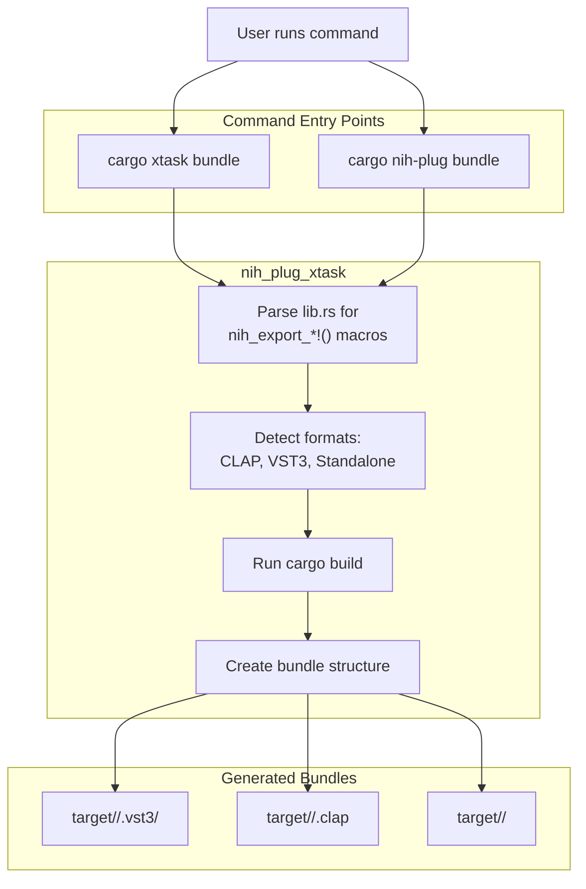

# Project Structure

> **Relevant source files**
> * [Cargo.lock](https://github.com/robbert-vdh/nih-plug/blob/28b149ec/Cargo.lock)
> * [Cargo.toml](https://github.com/robbert-vdh/nih-plug/blob/28b149ec/Cargo.toml)
> * [README.md](https://github.com/robbert-vdh/nih-plug/blob/28b149ec/README.md)

This page documents the workspace structure of the NIH-plug repository. It describes the directory layout, core crates, their dependencies, and how they are organized within the Cargo workspace.

## Cargo Workspace Structure

The repository is organized as a Cargo workspace defined in the root `Cargo.toml`. The workspace uses resolver version 2 and contains 35 member crates organized into functional groups:

### Workspace Members

```mermaid
flowchart TD

nih_plug_xtask["nih_plug_xtask<br>(Bundling logic)"]
cargo_nih_plug["cargo_nih_plug<br>(Cargo subcommand)"]
xtask["xtask<br>(Build scripts)"]
nih_plug["nih_plug<br>(Root package)"]
nih_plug_derive["nih_plug_derive<br>(Proc macros)"]
nih_plug_egui["nih_plug_egui"]
nih_plug_iced["nih_plug_iced"]
nih_plug_vizia["nih_plug_vizia"]
gain["gain"]
gain_gui_egui["gain_gui_egui"]
gain_gui_iced["gain_gui_iced"]
gain_gui_vizia["gain_gui_vizia"]
sine["sine"]
midi_inverter["midi_inverter"]
poly_mod_synth["poly_mod_synth"]
stft["stft"]
sysex["sysex"]
byo_gui_gl["byo_gui_gl"]
byo_gui_softbuffer["byo_gui_softbuffer"]
byo_gui_wgpu["byo_gui_wgpu"]
diopser["diopser"]
spectral_compressor["spectral_compressor"]
crisp["crisp"]
crossover["crossover"]
loudness_war_winner["loudness_war_winner"]
puberty_simulator["puberty_simulator"]
safety_limiter["safety_limiter"]
soft_vacuum["soft_vacuum"]
buffr_glitch["buffr_glitch"]

nih_plug_egui --> nih_plug
nih_plug_iced --> nih_plug
nih_plug_vizia --> nih_plug
gain --> nih_plug
gain_gui_egui --> nih_plug
gain_gui_egui --> nih_plug_egui
gain_gui_iced --> nih_plug_iced
gain_gui_vizia --> nih_plug_vizia
diopser --> nih_plug
diopser --> nih_plug_vizia
spectral_compressor --> nih_plug
spectral_compressor --> nih_plug_vizia
crisp --> nih_plug
crisp --> nih_plug_vizia

subgraph ProductionPlugins ["plugins/*"]
    diopser
    spectral_compressor
    crisp
    crossover
    loudness_war_winner
    puberty_simulator
    safety_limiter
    soft_vacuum
    buffr_glitch
end

subgraph ExamplePlugins ["plugins/examples/*"]
    gain
    gain_gui_egui
    gain_gui_iced
    gain_gui_vizia
    sine
    midi_inverter
    poly_mod_synth
    stft
    sysex
    byo_gui_gl
    byo_gui_softbuffer
    byo_gui_wgpu
end

subgraph GUICrates ["GUI Adapter Crates"]
    nih_plug_egui
    nih_plug_iced
    nih_plug_vizia
end

subgraph CoreFramework ["Core Framework Crates"]
    nih_plug
    nih_plug_derive
    nih_plug --> nih_plug_derive
end

subgraph BuildTools ["Build System Crates"]
    nih_plug_xtask
    cargo_nih_plug
    xtask
    cargo_nih_plug --> nih_plug_xtask
    xtask --> nih_plug_xtask
end
```



**Workspace Member Dependency Graph**

Sources: [Cargo.toml L13-L47](https://github.com/robbert-vdh/nih-plug/blob/28b149ec/Cargo.toml#L13-L47)

The workspace is organized into five functional categories:

| Category | Crates | Purpose |
| --- | --- | --- |
| Core Framework | `nih_plug`, `nih_plug_derive` | Core plugin API and procedural macros |
| GUI Adapters | `nih_plug_egui`, `nih_plug_iced`, `nih_plug_vizia` | Integrations with GUI frameworks |
| Build Tools | `nih_plug_xtask`, `cargo_nih_plug`, `xtask` | Plugin bundling and build automation |
| Example Plugins | 12 crates in `plugins/examples/` | Educational examples demonstrating features |
| Production Plugins | 9 crates in `plugins/` | Full-featured plugin implementations |

Sources: [Cargo.toml L15-L47](https://github.com/robbert-vdh/nih-plug/blob/28b149ec/Cargo.toml#L15-L47)

## Core Crate: nih_plug

The `nih_plug` crate is the root workspace package and contains the core framework code. It defines the plugin API and provides utilities for audio processing, parameter management, and wrapper implementations.

### nih_plug Directory Structure

```markdown
nih_plug/
├── src/
│   ├── lib.rs                    # Crate root, re-exports public API
│   ├── plugin.rs                 # Plugin trait definition
│   ├── params/                   # Parameter system implementation
│   │   ├── mod.rs
│   │   ├── enums.rs
│   │   ├── float.rs
│   │   ├── integer.rs
│   │   └── ...
│   ├── buffer/                   # Audio buffer abstractions
│   │   ├── mod.rs
│   │   ├── iterators.rs
│   │   └── simd.rs
│   ├── context/                  # Context traits and implementations
│   │   ├── init.rs
│   │   ├── process.rs
│   │   └── gui.rs
│   ├── wrapper/                  # Plugin format wrappers
│   │   ├── clap/
│   │   ├── vst3/
│   │   └── standalone/
│   └── util/                     # Utility modules
│       ├── stft.rs
│       ├── window.rs
│       └── ...
└── Cargo.toml
```

Sources: [Cargo.toml L1-L148](https://github.com/robbert-vdh/nih-plug/blob/28b149ec/Cargo.toml#L1-L148)

### nih_plug Feature Flags

The main crate exposes several feature flags for optional functionality:

| Feature | Default | Dependencies Added | Purpose |
| --- | --- | --- | --- |
| `vst3` | ✓ | `vst3-sys` | Enables `nih_export_vst3!()` macro |
| `standalone` | ✗ | `baseview`, `clap`, `cpal`, `jack`, `midir`, `rtrb` | Enables `nih_export_standalone()` function |
| `assert_process_allocs` | ✗ | `assert_no_alloc` | Detects allocations in `process()` during debug builds |
| `simd` | ✗ | None (nightly feature) | Adds SIMD buffer adapters |
| `zstd` | ✗ | `zstd` | Compresses plugin state using Zstandard |
| `docs` | ✗ | None | Adds `doc_auto_cfg` for documentation generation |

Sources: [Cargo.toml L49-L76](https://github.com/robbert-vdh/nih-plug/blob/28b149ec/Cargo.toml#L49-L76)

### nih_plug Core Dependencies

```mermaid
flowchart TD

nih_plug["nih_plug"]
nih_plug_derive["nih_plug_derive"]
serde["serde"]
serde_json["serde_json"]
atomic_float["atomic_float"]
atomic_refcell["atomic_refcell"]
crossbeam["crossbeam"]
parking_lot["parking_lot"]
clap_sys["clap-sys<br>(CLAP 1.2.2)"]
vst3_sys["vst3-sys<br>(optional: vst3)"]
baseview["baseview"]
cpal["cpal"]
jack["jack"]
midir["midir"]
rtrb["rtrb"]

nih_plug --> nih_plug_derive
nih_plug --> serde
nih_plug --> serde_json
nih_plug --> atomic_float
nih_plug --> atomic_refcell
nih_plug --> crossbeam
nih_plug --> parking_lot
nih_plug --> clap_sys
nih_plug --> vst3_sys
nih_plug --> baseview
nih_plug --> cpal
nih_plug --> jack

subgraph StandaloneDeps ["Standalone Dependencies(optional: standalone)"]
    baseview
    cpal
    jack
    midir
    rtrb
end

subgraph PluginAPIs ["Plugin API Dependencies"]
    clap_sys
    vst3_sys
end

subgraph CoreDeps ["Core Dependencies"]
    nih_plug_derive
    serde
    serde_json
    atomic_float
    atomic_refcell
    crossbeam
    parking_lot
end
```



**nih_plug Dependency Graph**

Sources: [Cargo.toml L78-L118](https://github.com/robbert-vdh/nih-plug/blob/28b149ec/Cargo.toml#L78-L118)

The core dependencies serve specific purposes:

* `nih_plug_derive`: Procedural macros for `#[derive(Params)]` and `#[derive(Enum)]`
* `serde`, `serde_json`: State serialization and deserialization
* `atomic_float`, `atomic_refcell`: Lock-free parameter value storage
* `crossbeam`: Thread-safe data structures for parameter changes
* `parking_lot`: Fast mutex implementations
* `clap-sys`: CLAP plugin API bindings (always included)
* `vst3-sys`: VST3 plugin API bindings (GPLv3 licensed, default feature)

Sources: [Cargo.toml L78-L118](https://github.com/robbert-vdh/nih-plug/blob/28b149ec/Cargo.toml#L78-L118)

## Procedural Macro Crate: nih_plug_derive

The `nih_plug_derive` crate is a proc-macro crate that provides the `#[derive(Params)]` and `#[derive(Enum)]` macros used throughout the framework.

### nih_plug_derive Structure

```markdown
nih_plug_derive/
├── src/
│   ├── lib.rs                    # Proc macro definitions
│   ├── params.rs                 # #[derive(Params)] implementation
│   └── enums.rs                  # #[derive(Enum)] implementation
└── Cargo.toml
```

The crate depends on:

* `syn`: For parsing Rust syntax
* `quote`: For generating Rust code
* `proc-macro2`: For manipulating token streams

Sources: [Cargo.toml L16](https://github.com/robbert-vdh/nih-plug/blob/28b149ec/Cargo.toml#L16-L16)

The `#[derive(Params)]` macro generates the implementation of the `Params` trait, which includes:

* `param_map()`: Returns a map of parameter IDs to `ParamPtr` references
* `serialize_fields()`: Serializes non-parameter state marked with `#[persist]`
* `deserialize_fields()`: Deserializes persisted state

The `#[derive(Enum)]` macro generates string conversions and display implementations for enums used with `EnumParam<T>`.

## GUI Adapter Crates

NIH-plug provides three official GUI adapter crates that integrate popular Rust GUI frameworks with the plugin API.

### nih_plug_egui

Provides integration with [egui](https://github.com/robbert-vdh/nih-plug/blob/28b149ec/egui)

 an immediate-mode GUI framework. Located at `nih_plug_egui/`.

Key exports:

* `create_egui_editor()`: Creates an `Editor` implementation using egui
* `EguiState`: Stores GUI state (size, scale factor)
* Integration with `baseview` for windowing

Sources: [Cargo.toml L17](https://github.com/robbert-vdh/nih-plug/blob/28b149ec/Cargo.toml#L17-L17)

### nih_plug_iced

Provides integration with [iced](https://github.com/robbert-vdh/nih-plug/blob/28b149ec/iced)

 a retained-mode GUI framework inspired by Elm. Located at `nih_plug_iced/`.

Key exports:

* `create_iced_editor()`: Creates an `Editor` implementation using iced
* `IcedState`: Stores GUI state
* Widget wrappers for parameter controls

Sources: [Cargo.toml L18](https://github.com/robbert-vdh/nih-plug/blob/28b149ec/Cargo.toml#L18-L18)

### nih_plug_vizia

Provides integration with [VIZIA](https://github.com/robbert-vdh/nih-plug/blob/28b149ec/VIZIA)

 a reactive GUI framework. Located at `nih_plug_vizia/`.

Key exports:

* `create_vizia_editor()`: Creates an `Editor` implementation using VIZIA
* `ViziaState`: Stores GUI state
* `ViziaTheming`: Theming support
* Custom widgets: `ParamSlider`, `ParamButton`, `PeakMeter`, `ResizeHandle`, `GenericUi`

All GUI adapters depend on `baseview` for cross-platform windowing and require the plugin to define an `Editor` through the `Plugin::editor()` method.

Sources: [Cargo.toml L19](https://github.com/robbert-vdh/nih-plug/blob/28b149ec/Cargo.toml#L19-L19)

## Plugin Workspace Members

The workspace contains two categories of plugin implementations: example plugins demonstrating framework features and production-ready plugins.

### Example Plugins (plugins/examples/)

| Crate Name | GUI Framework | Key Features |
| --- | --- | --- |
| `gain` | None | Basic gain plugin, parameter smoothing, state persistence |
| `gain_gui_egui` | egui | Same as `gain` with egui GUI |
| `gain_gui_iced` | iced | Same as `gain` with iced GUI |
| `gain_gui_vizia` | VIZIA | Same as `gain` with VIZIA GUI |
| `sine` | None | Tone generator, MIDI input, note-based frequency |
| `midi_inverter` | None | MIDI event processing and transformation |
| `poly_mod_synth` | None | Polyphonic synthesis, CLAP polyphonic modulation |
| `stft` | None | STFT processing using `StftHelper` |
| `sysex` | None | Custom SysEx message types |
| `byo_gui_gl` | Custom (OpenGL) | Bring-your-own GUI with `baseview` and `glow` |
| `byo_gui_softbuffer` | Custom (softbuffer) | Software rendering with `baseview` and `softbuffer` |
| `byo_gui_wgpu` | Custom (wgpu) | GPU rendering with `baseview` and `wgpu` |

Sources: [Cargo.toml L25-L36](https://github.com/robbert-vdh/nih-plug/blob/28b149ec/Cargo.toml#L25-L36)

 [README.md L194-L224](https://github.com/robbert-vdh/nih-plug/blob/28b149ec/README.md#L194-L224)

### Production Plugins (plugins/)

| Crate Name | GUI | Description |
| --- | --- | --- |
| `buffr_glitch` | None | MIDI-triggered buffer repeat effect |
| `crisp` | VIZIA | High-frequency enhancement via ring modulation |
| `crossover` | None | Multi-band frequency splitter with auxiliary outputs |
| `diopser` | VIZIA | Phase rotation plugin with spectrum analyzer |
| `loudness_war_winner` | None | Extreme loudness maximizer |
| `puberty_simulator` | None | Octave-down pitch effect |
| `safety_limiter` | None | Emergency limiter with SOS signal |
| `soft_vacuum` | None | Vacuum tube distortion with oversampling |
| `spectral_compressor` | VIZIA | FFT-based multi-band compressor |

Sources: [Cargo.toml L38-L46](https://github.com/robbert-vdh/nih-plug/blob/28b149ec/Cargo.toml#L38-L46)

 [README.md L42-L85](https://github.com/robbert-vdh/nih-plug/blob/28b149ec/README.md#L42-L85)

## Build System Crates

The repository includes three crates for building and bundling plugins.

### nih_plug_xtask

Located at `nih_plug_xtask/`, this crate contains the core bundling logic. It provides:

* Bundle format detection by scanning for `nih_export_*!()` macro invocations
* Platform-specific bundle creation (`.vst3` directories on all platforms, `.clap` single files)
* Cross-compilation support
* Bundle signing on macOS

Key functionality:

* Parses `lib.rs` to detect which export macros are present
* Invokes `cargo build` with appropriate target specifications
* Copies binaries into format-specific bundle structures
* Handles universal binaries on macOS (combining x86_64 and aarch64)

Sources: [Cargo.toml L20](https://github.com/robbert-vdh/nih-plug/blob/28b149ec/Cargo.toml#L20-L20)

### cargo_nih_plug

Located at `cargo_nih_plug/`, this is a thin wrapper around `nih_plug_xtask` that can be installed as a cargo subcommand:

```go
cargo install --path cargo_nih_plug
cargo nih-plug bundle <package> <build_args>
```

This provides a globally-available command for bundling plugins without needing xtask infrastructure in every project.

Sources: [Cargo.toml L22](https://github.com/robbert-vdh/nih-plug/blob/28b149ec/Cargo.toml#L22-L22)

### xtask

Located at `xtask/`, this is the repository-local build script runner. It provides the `cargo xtask bundle` command for workspace members:

```go
cargo xtask bundle <package> --release
```

The xtask pattern is a common Rust convention where the `xtask` crate is listed as a workspace member but not published. It depends on `nih_plug_xtask` for the actual implementation.

Sources: [Cargo.toml L23](https://github.com/robbert-vdh/nih-plug/blob/28b149ec/Cargo.toml#L23-L23)

### Build Command Flow



**Build System Flow**

Sources: [Cargo.toml L20-L23](https://github.com/robbert-vdh/nih-plug/blob/28b149ec/Cargo.toml#L20-L23)

 [README.md L157-L164](https://github.com/robbert-vdh/nih-plug/blob/28b149ec/README.md#L157-L164)

 [README.md L175-L181](https://github.com/robbert-vdh/nih-plug/blob/28b149ec/README.md#L175-L181)

## Conclusion

The NIH-plug framework provides a modular and well-organized structure for audio plugin development in Rust. By separating the core functionality, GUI integrations, and build tools into distinct crates, it maintains a clean architecture while offering flexibility for plugin developers. The consistent implementation pattern and comprehensive example plugins make it accessible for developers to create plugins in multiple formats from a single codebase.

For more detailed information about specific components of the framework, please refer to the relevant pages in this wiki.

Sources: [Cargo.toml](https://github.com/robbert-vdh/nih-plug/blob/28b149ec/Cargo.toml)

 [README.md](https://github.com/robbert-vdh/nih-plug/blob/28b149ec/README.md)

 [plugins/examples/sine/src/lib.rs](https://github.com/robbert-vdh/nih-plug/blob/28b149ec/plugins/examples/sine/src/lib.rs)

 [plugins/examples/gain/src/lib.rs](https://github.com/robbert-vdh/nih-plug/blob/28b149ec/plugins/examples/gain/src/lib.rs)