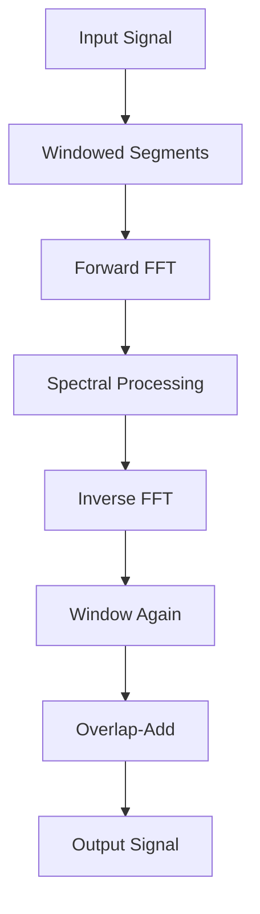
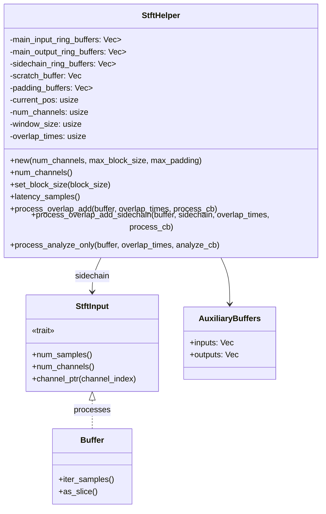
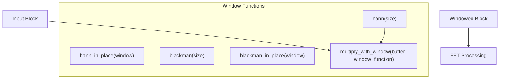
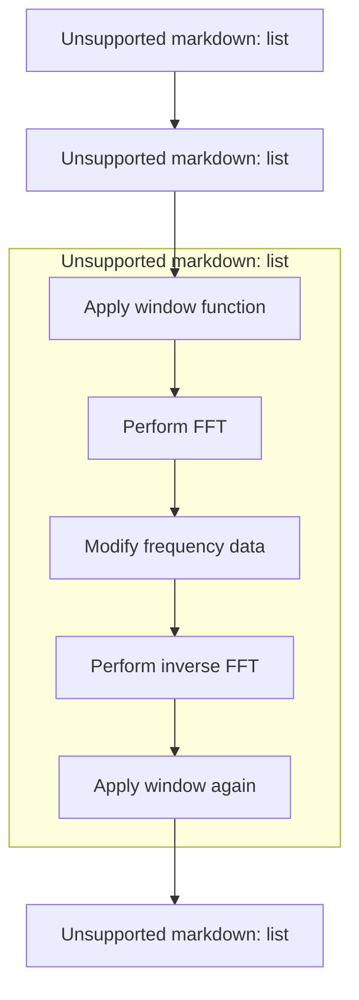
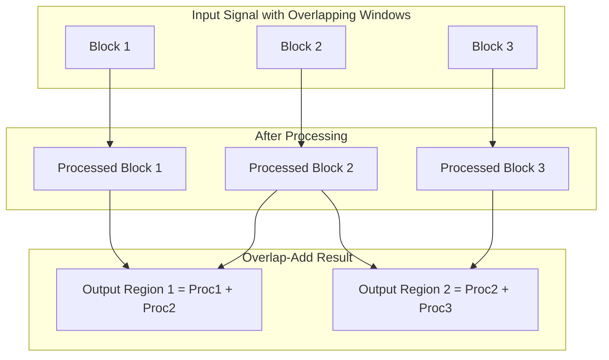
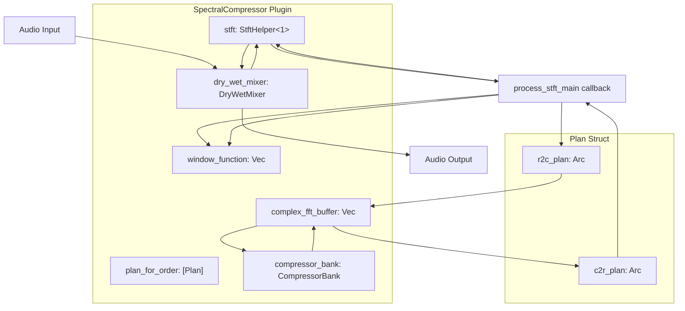
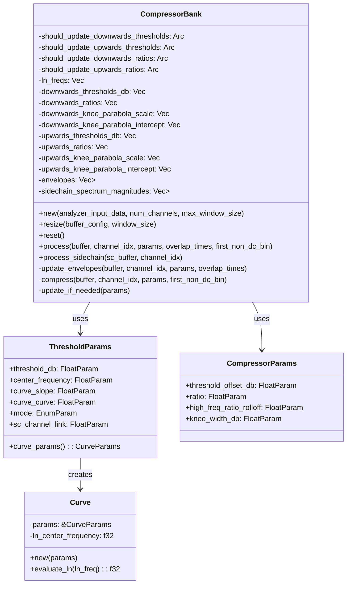

# STFT and Spectral Processing

> **Relevant source files**
> * [plugins/spectral_compressor/src/compressor_bank.rs](https://github.com/robbert-vdh/nih-plug/blob/28b149ec/plugins/spectral_compressor/src/compressor_bank.rs)
> * [plugins/spectral_compressor/src/curve.rs](https://github.com/robbert-vdh/nih-plug/blob/28b149ec/plugins/spectral_compressor/src/curve.rs)
> * [plugins/spectral_compressor/src/lib.rs](https://github.com/robbert-vdh/nih-plug/blob/28b149ec/plugins/spectral_compressor/src/lib.rs)

This document explains how to use the Short-Time Fourier Transform (STFT) capabilities in NIH-plug for spectral audio processing. The STFT is a fundamental technique that allows audio to be analyzed and manipulated in the frequency domain, enabling advanced effects like spectral compression, phase rotation, and frequency-dependent processing.

## Contents

* [Introduction to STFT](https://github.com/robbert-vdh/nih-plug/blob/28b149ec/Introduction to STFT)
* [StftHelper Class](https://github.com/robbert-vdh/nih-plug/blob/28b149ec/StftHelper Class)
* [Window Functions](https://github.com/robbert-vdh/nih-plug/blob/28b149ec/Window Functions)
* [Implementing Spectral Processing](https://github.com/robbert-vdh/nih-plug/blob/28b149ec/Implementing Spectral Processing)
* [Real-world Example](https://github.com/robbert-vdh/nih-plug/blob/28b149ec/Real-world Example#LNaN-LNaN)
* [Performance Considerations](https://github.com/robbert-vdh/nih-plug/blob/28b149ec/Performance Considerations)

## Introduction to STFT

The Short-Time Fourier Transform (STFT) divides an audio signal into short, overlapping segments, applies a window function to each segment, and then performs a Fourier transform on each windowed segment. This allows time-varying spectral analysis and processing while maintaining the time-domain representation.

### STFT Process Overview



Sources: [src/util/stft.rs L1-L48](https://github.com/robbert-vdh/nih-plug/blob/28b149ec/src/util/stft.rs#L1-L48)

 [plugins/spectral_compressor/src/lib.rs L537-L594](https://github.com/robbert-vdh/nih-plug/blob/28b149ec/plugins/spectral_compressor/src/lib.rs#L537-L594)

## StftHelper Struct

NIH-plug provides the `StftHelper` struct (located in [src/util/stft.rs](https://github.com/robbert-vdh/nih-plug/blob/28b149ec/src/util/stft.rs)

) that handles the complex process of dividing the signal, applying window functions, and recombining the processed segments using the overlap-add method.

### StftHelper Architecture



The `StftHelper` struct manages:

1. **Ring Buffers**: Separate buffers for main input/output and sidechain input, allowing efficient processing without reallocating memory
2. **Overlap-Add Algorithm**: Automatically handles the correct recombination of windowed, processed segments
3. **Latency Management**: Provides latency information that plugins must report to hosts via `Context::set_latency_samples()`

Key methods:

| Method | Description |
| --- | --- |
| `new(num_channels, max_block_size, max_padding)` | Creates a new StftHelper with preallocated buffers |
| `num_channels()` | Returns the number of channels this helper processes |
| `set_block_size(block_size)` | Updates the FFT window size (must not exceed `max_block_size`) |
| `latency_samples()` | Returns the latency in samples based on window size and overlap |
| `process_overlap_add(buffer, overlap_times, process_cb)` | Main processing method - calls callback for each windowed segment |
| `process_overlap_add_sidechain(...)` | Like `process_overlap_add` but also processes sidechain buffers |
| `process_analyze_only(buffer, overlap_times, analyze_cb)` | Analysis-only mode that doesn't modify the buffer |

Sources: [src/util/stft.rs](https://github.com/robbert-vdh/nih-plug/blob/28b149ec/src/util/stft.rs)

## Window Functions

Window functions are essential in STFT to reduce spectral leakage. NIH-plug provides common window functions like Hann and Blackman.

### Window Functions in NIH-plug



The window function is typically applied twice in the STFT process:

1. Before the forward FFT to prepare the signal
2. After the inverse FFT to ensure smooth overlap-add recombination

Sources: [src/util/window.rs L1-L58](https://github.com/robbert-vdh/nih-plug/blob/28b149ec/src/util/window.rs#L1-L58)

## Implementing Spectral Processing

To implement spectral processing using NIH-plug's STFT tools, follow these steps:

### Basic Processing Flow



### Overlap-Add Process



### Code Structure

A typical implementation pattern:

```javascript
// During plugin initialization
self.stft = util::StftHelper::new(num_channels, MAX_WINDOW_SIZE, 0);
self.window_function.resize(window_size, 0.0);
util::window::hann_in_place(&mut self.window_function);

// During processing
self.stft.process_overlap_add(
    buffer,
    overlap_times,
    |channel_idx, real_fft_buffer| {
        // 1. Apply window function and input gain
        for (sample, window_sample) in real_fft_buffer.iter_mut().zip(&window_function) {
            *sample *= window_sample * input_gain;
        }
        
        // 2. Perform forward FFT (using realfft crate)
        fft_plan.r2c_plan
            .process_with_scratch(real_fft_buffer, complex_buffer, &mut [])
            .unwrap();
        
        // 3. Spectral processing - modify complex_buffer
        // (e.g., apply compression to each frequency bin)
        
        // 4. Perform inverse FFT
        fft_plan.c2r_plan
            .process_with_scratch(complex_buffer, real_fft_buffer, &mut [])
            .unwrap();
        
        // 5. Apply window function again and output gain
        for (sample, window_sample) in real_fft_buffer.iter_mut().zip(&window_function) {
            *sample *= window_sample * output_gain;
        }
    }
);
```

The callback receives a `real_fft_buffer` for each channel and overlap position. This buffer should be:

1. Windowed before the forward FFT
2. Transformed to the frequency domain
3. Processed (bins are `Complex32` values from `realfft::num_complex`)
4. Transformed back to the time domain
5. Windowed again for smooth overlap-add reconstruction

Sources: [plugins/spectral_compressor/src/lib.rs L546-L594](https://github.com/robbert-vdh/nih-plug/blob/28b149ec/plugins/spectral_compressor/src/lib.rs#L546-L594)

 [src/util/stft.rs](https://github.com/robbert-vdh/nih-plug/blob/28b149ec/src/util/stft.rs)

## Real-world Example: Spectral Compressor

The Spectral Compressor plugin demonstrates advanced spectral processing using NIH-plug's STFT capabilities. The implementation can be found in [plugins/spectral_compressor/](https://github.com/robbert-vdh/nih-plug/blob/28b149ec/plugins/spectral_compressor/)

### Spectral Compressor Architecture



The spectral compressor processing flow:

1. **Initialization**: Pre-plans all FFT sizes using `RealFftPlanner` from the `realfft` crate
2. **Dry/Wet Mixing**: Stores dry signal in `DryWetMixer` for latency-compensated mixing
3. **STFT Processing**: Calls `process_overlap_add` which invokes `process_stft_main` for each windowed segment
4. **Spectral Compression**: `CompressorBank::process` applies per-bin compression
5. **Reconstruction**: Inverse FFT and overlap-add handled by `StftHelper`

### CompressorBank Implementation

The `CompressorBank` struct (in [plugins/spectral_compressor/src/compressor_bank.rs L49-L115](https://github.com/robbert-vdh/nih-plug/blob/28b149ec/plugins/spectral_compressor/src/compressor_bank.rs#L49-L115)

) is the core spectral processing engine:



Key processing steps in `CompressorBank::process`:

1. **Envelope Following** ([plugins/spectral_compressor/src/compressor_bank.rs L684-L740](https://github.com/robbert-vdh/nih-plug/blob/28b149ec/plugins/spectral_compressor/src/compressor_bank.rs#L684-L740) ): Tracks the magnitude of each frequency bin using attack/release envelopes * Uses exponential coefficient: `(-1.0 / (time_ms / 1000.0 * effective_sample_rate)).exp()` * Different coefficients for attack and release phases * `effective_sample_rate` compensates for the periodic STFT operation
2. **Threshold and Ratio Calculation** ([plugins/spectral_compressor/src/compressor_bank.rs L1049-L1172](https://github.com/robbert-vdh/nih-plug/blob/28b149ec/plugins/spectral_compressor/src/compressor_bank.rs#L1049-L1172) ): Computes per-bin compression parameters * Evaluates polynomial curve: `threshold_db + curve_slope*x + curve_curve*(x^2)` where `x = ln(center_frequency) - ln(bin_frequency)` * Applies frequency-dependent ratio rolloff for high frequencies * Precomputes soft-knee parabola coefficients using formula from "Digital Dynamic Range Compressor Design" paper
3. **Compression** ([plugins/spectral_compressor/src/compressor_bank.rs L836-L925](https://github.com/robbert-vdh/nih-plug/blob/28b149ec/plugins/spectral_compressor/src/compressor_bank.rs#L836-L925) ): Applies gain reduction to each bin * Separate downwards and upwards compression stages * Soft-knee transition using parabolic formula: `x + a * (x + b)^2` * Direct multiplication of complex bins by gain factors
4. **Sidechain Support**: Three threshold modes * `Internal`: Standard compression based on input signal * `SidechainMatch`: Thresholds scaled by sidechain spectrum magnitudes * `SidechainCompress`: Envelopes computed from sidechain, applied to main signal

Sources: [plugins/spectral_compressor/src/lib.rs L55-L84](https://github.com/robbert-vdh/nih-plug/blob/28b149ec/plugins/spectral_compressor/src/lib.rs#L55-L84)

 [plugins/spectral_compressor/src/compressor_bank.rs L49-L115](https://github.com/robbert-vdh/nih-plug/blob/28b149ec/plugins/spectral_compressor/src/compressor_bank.rs#L49-L115)

 [plugins/spectral_compressor/src/compressor_bank.rs L426-L509](https://github.com/robbert-vdh/nih-plug/blob/28b149ec/plugins/spectral_compressor/src/compressor_bank.rs#L426-L509)

 [plugins/spectral_compressor/src/curve.rs L1-L62](https://github.com/robbert-vdh/nih-plug/blob/28b149ec/plugins/spectral_compressor/src/curve.rs#L1-L62)

## Performance Considerations

Effective use of STFT requires balancing several factors:

### Window Size and Overlap Trade-offs

| Window Size | Advantages | Disadvantages |
| --- | --- | --- |
| Small (64-512) | Better temporal resolution, Lower latency | Poorer frequency resolution |
| Medium (1024-2048) | Good balance (common default) | Moderate latency |
| Large (4096-32768) | Excellent frequency resolution | Higher latency, Poor transient response |

The Spectral Compressor supports window sizes from 2^6 (64) to 2^15 (32768) samples ([plugins/spectral_compressor/src/lib.rs L35-L42](https://github.com/robbert-vdh/nih-plug/blob/28b149ec/plugins/spectral_compressor/src/lib.rs#L35-L42)

).

### Overlap Factor Considerations

| Overlap Factor | Effect |
| --- | --- |
| 4x (75%) | Minimum recommended for Hann window, Good for most cases |
| 8x (87.5%) | Better quality, Higher CPU usage |
| 16x (93.75%) | Very high quality, Default in Spectral Compressor |
| 32x (96.9%) | Maximum quality, Significant CPU usage |

The overlap gain compensation for a squared Hann window is: `((overlap_times / 4.0) * 1.5).recip() / window_size`

Higher overlap provides:

* Smoother parameter changes
* Better quality for time-varying processing
* More frequent processing callbacks

Sources: [plugins/spectral_compressor/src/lib.rs L44-L52](https://github.com/robbert-vdh/nih-plug/blob/28b149ec/plugins/spectral_compressor/src/lib.rs#L44-L52)

 [plugins/spectral_compressor/src/lib.rs L420-L424](https://github.com/robbert-vdh/nih-plug/blob/28b149ec/plugins/spectral_compressor/src/lib.rs#L420-L424)

### Memory and CPU Optimization

1. **Pre-plan FFTs during initialization**: The `realfft` crate planning is fast but allocates, so pre-plan all needed sizes ```javascript // Example from Spectral Compressor initialization let mut planner = RealFftPlanner::new(); let plan_for_order: Vec<Plan> = (MIN_WINDOW_ORDER..=MAX_WINDOW_ORDER)     .map(|order| Plan {         r2c_plan: planner.plan_fft_forward(1 << order),         c2r_plan: planner.plan_fft_inverse(1 << order),     })     .collect(); ```
2. **Preallocate buffers with maximum capacity**: Avoid reallocations during `set_block_size` calls ```javascript // Allocate once with maximum size self.complex_fft_buffer = Vec::with_capacity(MAX_WINDOW_SIZE / 2 + 1); self.window_function = Vec::with_capacity(MAX_WINDOW_SIZE); // Resize without allocating when window size changes self.complex_fft_buffer.resize(window_size / 2 + 1, Complex32::default()); ```
3. **Atomic flags for parameter updates**: Defer expensive recalculations to the audio thread ```javascript // In parameter callback (GUI thread) self.should_update_thresholds.store(true, Ordering::SeqCst); // In process function (audio thread) if self.should_update_thresholds.compare_exchange(...).is_ok() {     // Recompute thresholds for all bins } ```
4. **Optimize hot loops**: Use unsafe indexing with bounds assertions when performance-critical ```javascript // Example from CompressorBank::compress assert!(self.downwards_thresholds_db.len() == buffer.len()); for (bin_idx, bin) in buffer.iter_mut().enumerate() {     let threshold = unsafe { self.downwards_thresholds_db.get_unchecked(bin_idx) };     // Process bin... } ```
5. **Parameter smoothing considerations**: * STFT processing inherently smooths parameter changes through overlap-add * No need for per-sample smoothing on FFT parameters * Dry/wet ratio still benefits from smoothing for clickless mixing

Sources: [plugins/spectral_compressor/src/lib.rs L366-L379](https://github.com/robbert-vdh/nih-plug/blob/28b149ec/plugins/spectral_compressor/src/lib.rs#L366-L379)

 [plugins/spectral_compressor/src/lib.rs L521-L536](https://github.com/robbert-vdh/nih-plug/blob/28b149ec/plugins/spectral_compressor/src/lib.rs#L521-L536)

 [plugins/spectral_compressor/src/compressor_bank.rs L1049-L1057](https://github.com/robbert-vdh/nih-plug/blob/28b149ec/plugins/spectral_compressor/src/compressor_bank.rs#L1049-L1057)

 [plugins/spectral_compressor/src/compressor_bank.rs L850-L859](https://github.com/robbert-vdh/nih-plug/blob/28b149ec/plugins/spectral_compressor/src/compressor_bank.rs#L850-L859)

## Conclusion

NIH-plug's STFT and spectral processing capabilities provide a powerful foundation for creating advanced audio effects. The `StftHelper` class abstracts away much of the complexity, allowing plugin developers to focus on the creative aspects of spectral processing.

For implementing your own spectral processing plugin:

1. Study the Spectral Compressor and Diopser plugins as reference implementations
2. Understand the trade-offs in window size, overlap, and window function selection
3. Consider the latency implications and report them correctly to the host

Sources: [plugins/spectral_compressor/src/lib.rs L383-L384](https://github.com/robbert-vdh/nih-plug/blob/28b149ec/plugins/spectral_compressor/src/lib.rs#L383-L384)

 [plugins/diopser/src/spectrum.rs L17-L147](https://github.com/robbert-vdh/nih-plug/blob/28b149ec/plugins/diopser/src/spectrum.rs#L17-L147)