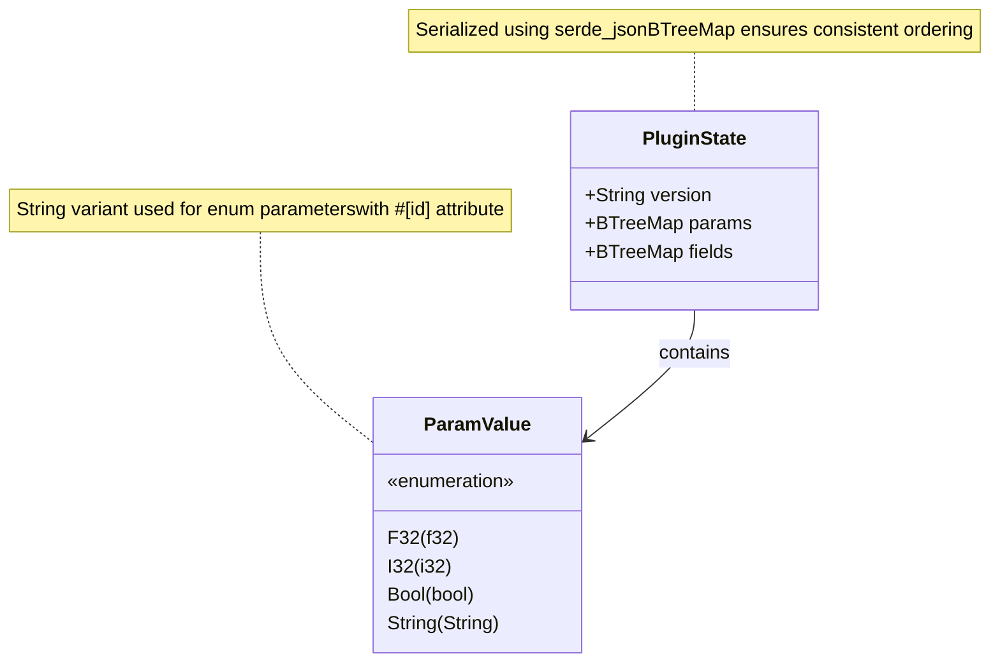
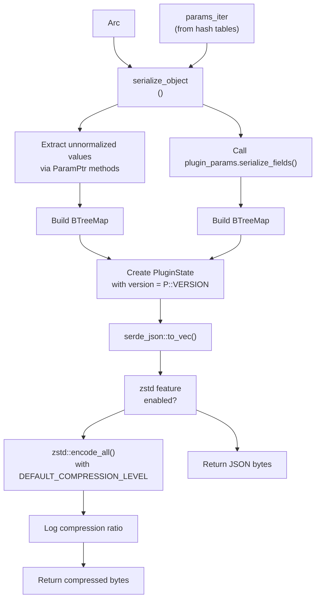
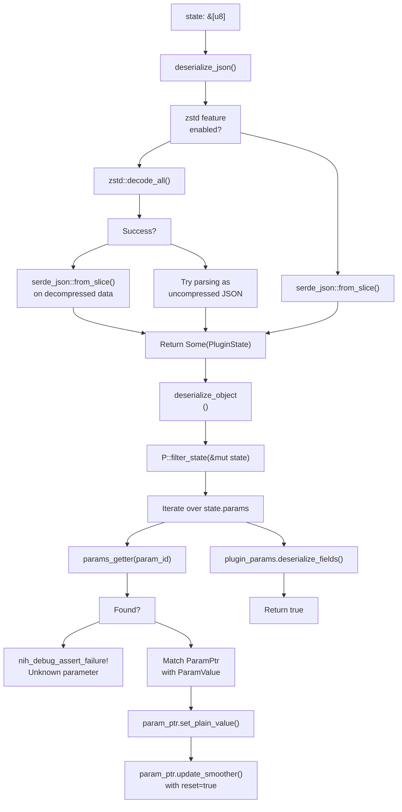
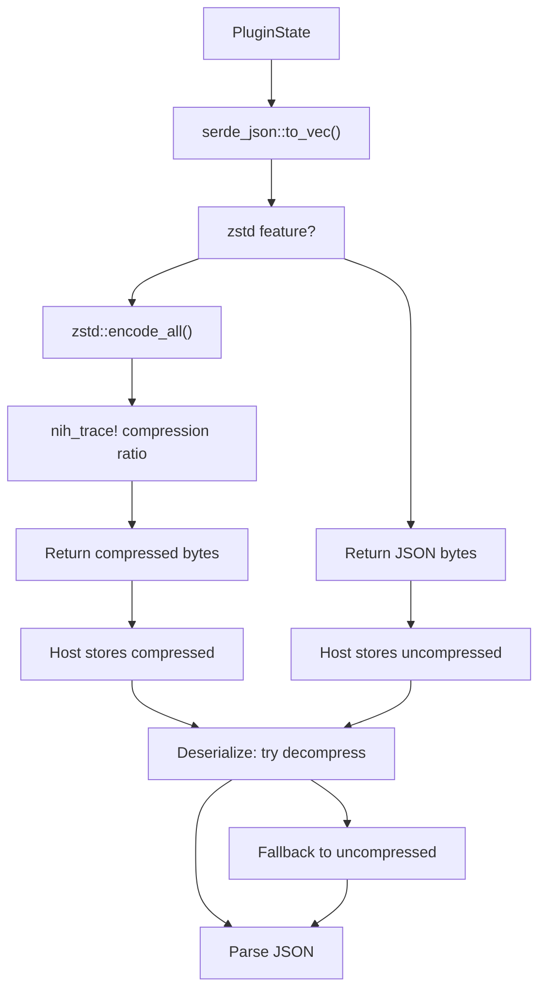
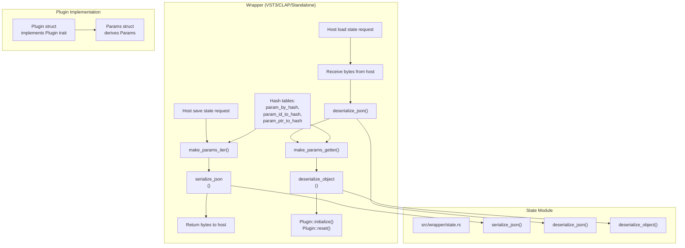

# State Serialization

> **Relevant source files**
> * [src/wrapper/state.rs](https://github.com/robbert-vdh/nih-plug/blob/28b149ec/src/wrapper/state.rs)

## Purpose and Scope

This document describes NIH-plug's state serialization system, which enables plugins to save and restore their complete state including parameter values and arbitrary persistent data. The serialization system converts plugin state to JSON format (optionally compressed with Zstandard) for storage by the host and implements a migration mechanism for handling breaking changes between plugin versions.

For information about defining parameters themselves, see [Parameter Types and Derive Macros](/robbert-vdh/nih-plug/2.2.1-parameter-types-and-derive-macros). For information about the broader parameter system architecture, see [Parameter System](/robbert-vdh/nih-plug/2.2-parameter-system).

Sources: [src/wrapper/state.rs L1-L12](https://github.com/robbert-vdh/nih-plug/blob/28b149ec/src/wrapper/state.rs#L1-L12)

---

## PluginState Structure

The `PluginState` struct is the core data structure for state persistence. It contains three fields that together represent the complete serializable state of a plugin instance.



**PluginState Fields**

| Field | Type | Purpose |
| --- | --- | --- |
| `version` | `String` | Plugin version that saved this state (from `Plugin::VERSION`). Used for state migration via `Plugin::filter_state()`. May be empty for very old states. |
| `params` | `BTreeMap<String, ParamValue>` | Parameter values stored **unnormalized**. Keys are parameter IDs from `#[id]` attributes. Using BTreeMap ensures consistent serialization order. |
| `fields` | `BTreeMap<String, String>` | Arbitrary persistent fields from struct fields annotated with `#[persist = "stable_name"]`. Each field is itself serialized as JSON for independent restoration. |

**ParamValue Enum**

The `ParamValue` enum represents unnormalized parameter values in a type-safe manner:

* `F32(f32)` - for `FloatParam`
* `I32(i32)` - for `IntParam` and enum parameters without stable IDs
* `Bool(bool)` - for `BoolParam`
* `String(String)` - for `EnumParam` with `#[id = "..."]` attributes, enabling variant reordering

Sources: [src/wrapper/state.rs L15-L53](https://github.com/robbert-vdh/nih-plug/blob/28b149ec/src/wrapper/state.rs#L15-L53)

---

## Serialization Process

Serialization converts a live plugin instance's state into a JSON byte array suitable for host storage. The process extracts unnormalized parameter values and persistent fields, optionally compressing the result.



**Serialization Functions**

The serialization process is split into two functions:

**`serialize_object<P: Plugin>()`** - Creates a `PluginState` object from plugin parameters:

* Takes `Arc<dyn Params>` and a parameter iterator
* Iterates over all parameters, calling `unmodulated_plain_value()` to extract raw values without modulation
* Handles special cases for enum parameters (stable string IDs vs. variant indices)
* Calls `plugin_params.serialize_fields()` to extract persistent fields
* Returns a `PluginState` struct

**`serialize_json<P: Plugin>()`** - Converts `PluginState` to bytes:

* Calls `serialize_object()` to get the state object
* Serializes to JSON using `serde_json::to_vec()`
* If `zstd` feature is enabled, compresses the JSON with Zstandard
* Logs compression statistics via `nih_trace!` macro
* Returns a `Vec<u8>` ready for host storage

**Unnormalized Values**

Parameters are serialized in their **unnormalized** form (plain values, not 0.0-1.0 normalized). This design choice ensures that when a parameter's range is increased in a later plugin version, old saved values remain valid and are recalled correctly. However, this may affect parameter automation if the host stores automation in normalized form.

Sources: [src/wrapper/state.rs L81-L160](https://github.com/robbert-vdh/nih-plug/blob/28b149ec/src/wrapper/state.rs#L81-L160)

---

## Deserialization Process

Deserialization restores plugin state from serialized bytes, handling both compressed and uncompressed formats. The process includes state migration support and smoother reinitialization.



**Deserialization Functions**

**`deserialize_json(state: &[u8])`** - Parses bytes into a `PluginState`:

* If `zstd` feature is enabled, attempts Zstandard decompression first
* Falls back to parsing as uncompressed JSON (for backward compatibility)
* Logs decompression statistics
* Returns `Option<PluginState>` (None on error)

**`deserialize_object<P: Plugin>()`** - Loads state into plugin:

* Calls `P::filter_state(&mut state)` for migration (see State Migration section)
* Iterates over `state.params`, looking up each parameter by ID
* Matches `ParamPtr` type with `ParamValue` type, calling `set_plain_value()`
* Handles enum parameters with both string IDs and numeric indices
* Resets smoothers via `param_ptr.update_smoother(sample_rate, true)`
* Calls `plugin_params.deserialize_fields(&state.fields)`
* Returns `bool` indicating success

**Error Handling**

The deserialization process uses debug assertions to log errors without panicking:

* Unknown parameters trigger `nih_debug_assert_failure!` but don't prevent loading other parameters
* Type mismatches between `ParamPtr` and `ParamValue` are logged
* Unknown enum IDs are logged with `nih_debug_assert!`

**Post-Deserialization Requirements**

After calling `deserialize_object()`, the wrapper must:

1. Call `Plugin::initialize()` to let the plugin react to new parameter values
2. Call `Plugin::reset()` to initialize audio processing state
3. Optionally call `Plugin::process()` to ensure state is fully initialized

Sources: [src/wrapper/state.rs L162-L294](https://github.com/robbert-vdh/nih-plug/blob/28b149ec/src/wrapper/state.rs#L162-L294)

---

## Persistent Fields

In addition to parameters, plugins can persist arbitrary data by annotating fields on their `Params` struct with the `#[persist]` attribute. This is useful for storing sample data, lookup tables, or other state that doesn't fit the parameter model.

**Defining Persistent Fields**

```python
// Example from codebase (conceptual)
#[derive(Params)]
struct MyPluginParams {
    #[id = "gain"]
    pub gain: FloatParam,
    
    #[persist = "sample_data"]
    pub sample: Arc<Vec<f32>>,
}
```

**Serialization and Deserialization**

The `Params` trait provides two methods for handling persistent fields:

| Method | Signature | Purpose |
| --- | --- | --- |
| `serialize_fields()` | `fn serialize_fields(&self) -> BTreeMap<String, String>` | Returns a map of stable field names to JSON-serialized values. Each field is serialized independently. |
| `deserialize_fields()` | `fn deserialize_fields(&self, fields: &BTreeMap<String, String>)` | Restores fields from the map. Each field is deserialized independently, allowing graceful handling of missing or incompatible fields. |

**Independent Serialization**

Each persistent field is serialized as its own JSON string within the `fields` map. This design allows:

* Fields to be added or removed between plugin versions
* Graceful degradation when a field can't be deserialized
* Fields to evolve independently without affecting other state

**Use Cases**

Persistent fields are appropriate for:

* Sample or wavetable data loaded by the user
* Pre-computed lookup tables that are expensive to generate
* State that changes infrequently but must persist
* Data structures that don't map to the parameter model

For frequently-changing state that represents plugin behavior, consider using parameters instead to enable host automation.

Sources: [src/wrapper/state.rs L46-L52](https://github.com/robbert-vdh/nih-plug/blob/28b149ec/src/wrapper/state.rs#L46-L52)

 [src/wrapper/state.rs L122](https://github.com/robbert-vdh/nih-plug/blob/28b149ec/src/wrapper/state.rs#L122-L122)

 [src/wrapper/state.rs L236](https://github.com/robbert-vdh/nih-plug/blob/28b149ec/src/wrapper/state.rs#L236-L236)

---

## State Migration

The state migration system allows plugins to handle breaking changes between versions, such as renamed parameters, removed features, or changed data formats.

```mermaid
sequenceDiagram
  participant Host
  participant Wrapper
  participant Plugin::filter_state()
  participant PluginState

  Host->>Wrapper: Load saved state bytes
  Wrapper->>Wrapper: deserialize_json()
  Wrapper->>PluginState: Create PluginState with old data
  Wrapper->>Plugin::filter_state(): filter_state(&mut state)
  note over Plugin::filter_state(),PluginState: Plugin can inspect state.version
  Plugin::filter_state()->>PluginState: Check version
  loop [Version < 2.0]
    Plugin::filter_state()->>PluginState: Rename "old_param" to "new_param"
    Plugin::filter_state()->>PluginState: Remove deprecated parameters
    Plugin::filter_state()->>PluginState: Convert field formats
  end
  Plugin::filter_state()-->>Wrapper: Return
  Wrapper->>Wrapper: Apply modified state to parameters
  Wrapper->>Plugin::filter_state(): initialize()
  Wrapper->>Plugin::filter_state(): reset()
```

**Migration Hook**

The `Plugin::filter_state()` method is called before state is applied to parameters:

```rust
// From Plugin trait (conceptual reference)
fn filter_state(state: &mut PluginState) {
    // Default implementation does nothing
    // Plugins override to perform migration
}
```

**Migration Strategy**

The migration process:

1. **Wrapper calls `deserialize_json()`** - Parses saved bytes into `PluginState`
2. **Wrapper calls `Plugin::filter_state(&mut state)`** - Plugin can modify state
3. **Plugin inspects `state.version`** - String from `Plugin::VERSION` when state was saved
4. **Plugin modifies `state.params` or `state.fields`** - Rename, remove, or transform data
5. **Wrapper applies modified state** - Calls `set_plain_value()` on current parameters

**Migration Examples**

| Scenario | Implementation |
| --- | --- |
| Rename parameter | Check version, copy `state.params["old_name"]` to `state.params["new_name"]`, remove old entry |
| Remove parameter | Check version, remove from `state.params` map (deserialization already ignores unknown parameters) |
| Change range | No migration needed - unnormalized values adapt automatically |
| Reorder enum variants | Use `#[id = "..."]` on enum variants for stable serialization |
| Change field format | Check version, deserialize old format from `state.fields`, serialize new format back |

**Version String**

The `state.version` field comes from `Plugin::VERSION` constant. Best practices:

* Use semantic versioning (e.g., "1.2.3")
* Increment when making breaking state changes
* Check version ranges, not equality (e.g., `if state.version < "2.0.0"`)
* Handle empty version (very old states may not have version field)

**Limitations**

State migration runs **before** `Plugin::initialize()`, so:

* The plugin instance is not fully initialized
* `BufferConfig` is not yet available (but passed separately to `deserialize_object()`)
* Migration logic should be pure data transformation

Sources: [src/wrapper/state.rs L31-L40](https://github.com/robbert-vdh/nih-plug/blob/28b149ec/src/wrapper/state.rs#L31-L40)

 [src/wrapper/state.rs L174-L181](https://github.com/robbert-vdh/nih-plug/blob/28b149ec/src/wrapper/state.rs#L174-L181)

---

## Compression

The state serialization system supports optional Zstandard compression via the `zstd` feature flag. Compression is transparent to the plugin implementation.

**Compression Flow**



**Configuration**

Enable compression in `Cargo.toml`:

```
[dependencies]
nih_plug = { version = "...", features = ["zstd"] }
```

**Compression Parameters**

| Parameter | Value | Location |
| --- | --- | --- |
| Compression level | `zstd::DEFAULT_COMPRESSION_LEVEL` | [src/wrapper/state.rs L143](https://github.com/robbert-vdh/nih-plug/blob/28b149ec/src/wrapper/state.rs#L143-L143) |
| Algorithm | Zstandard | Via `zstd` crate |

**Backward Compatibility**

The deserialization process maintains backward compatibility:

1. If `zstd` feature is enabled, attempts to decompress first
2. If decompression fails, falls back to parsing as uncompressed JSON
3. This allows plugins compiled with `zstd` to load states saved without it

**Performance Characteristics**

The implementation logs compression statistics:

```
// Example log output
// Compressed 4096 bytes of state to 512 bytes (12.5% compression ratio)
```

Compression is beneficial for:

* Large parameter counts (hundreds of parameters)
* Persistent fields with repetitive data (samples, lookup tables)
* Plugins with many enum parameters (string IDs are highly compressible)

Compression overhead is negligible for small states but provides significant savings for large states, particularly those with persistent sample data.

Sources: [src/wrapper/state.rs L141-L160](https://github.com/robbert-vdh/nih-plug/blob/28b149ec/src/wrapper/state.rs#L141-L160)

 [src/wrapper/state.rs L246-L282](https://github.com/robbert-vdh/nih-plug/blob/28b149ec/src/wrapper/state.rs#L246-L282)

---

## Integration with Wrappers

State serialization is used by plugin wrappers to implement host-specific state persistence APIs. Each wrapper (VST3, CLAP, standalone) calls these functions at appropriate points in the host lifecycle.



**Helper Functions for Wrappers**

The state module provides helper functions to avoid rebuilding hash tables:

**`make_params_iter()`** - Creates a parameter iterator from cached hash tables:

* Takes `param_by_hash: &HashMap<u32, ParamPtr>` and `param_id_to_hash: &HashMap<String, u32>`
* Returns an iterator over `(&String, ParamPtr)` tuples
* Avoids calling `.param_map()` which may include expensive user code

**`make_params_getter()`** - Creates a parameter lookup closure:

* Takes the same hash table references
* Returns `impl Fn(&str) -> Option<ParamPtr>`
* Used during deserialization to look up parameters by ID

**Wrapper Responsibilities**

When implementing a plugin wrapper, the state module expects:

1. **At initialization:** * Build `param_by_hash`, `param_id_to_hash`, and `param_ptr_to_hash` from `.param_map()` * Keep these hash tables cached to avoid repeated calls
2. **On save state:** * Call `make_params_iter()` with cached hash tables * Call `serialize_json::<P>()` with `Arc<dyn Params>` and iterator * Return bytes to host via wrapper-specific API
3. **On load state:** * Receive bytes from host * Call `deserialize_json()` to parse into `PluginState` * Call `make_params_getter()` with cached hash tables * Call `deserialize_object::<P>()` with state, params, getter, and current buffer config * Call `Plugin::initialize()` and `Plugin::reset()` to reinitialize plugin

**Thread Safety**

State serialization operations are **not realtime-safe** and must be performed:

* On the GUI/main thread (VST3, CLAP typically do this)
* Outside the audio processing callback
* With appropriate synchronization if parameters are being accessed concurrently

The state module functions are marked `unsafe` because they require proper synchronization by the caller.

Sources: [src/wrapper/state.rs L55-L79](https://github.com/robbert-vdh/nih-plug/blob/28b149ec/src/wrapper/state.rs#L55-L79)

---

## Example: Complete State Lifecycle

The following diagram shows the complete lifecycle of plugin state from creation through serialization, host storage, and restoration.

```

```

Sources: [src/wrapper/state.rs L1-L294](https://github.com/robbert-vdh/nih-plug/blob/28b149ec/src/wrapper/state.rs#L1-L294)