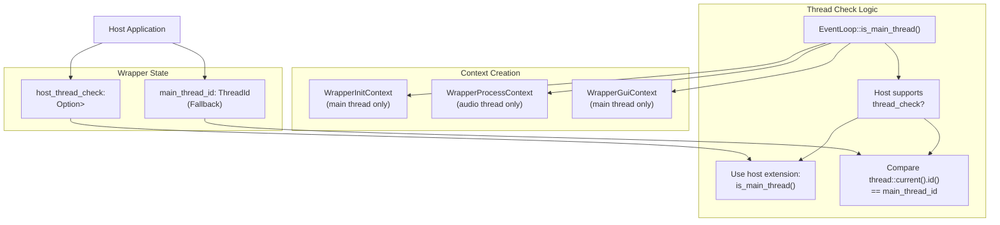
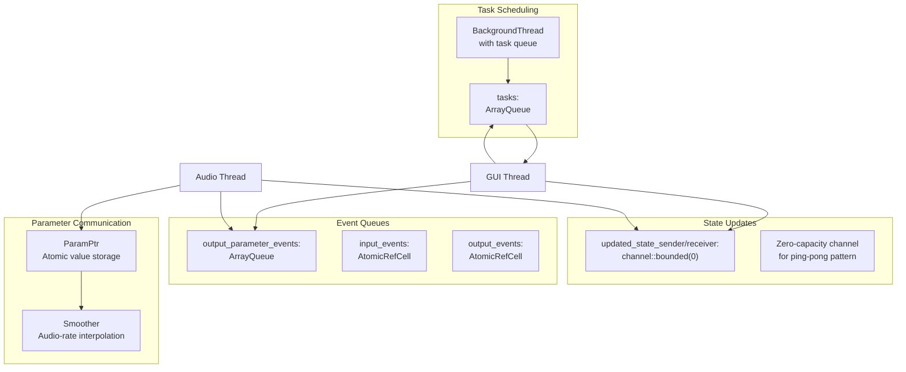
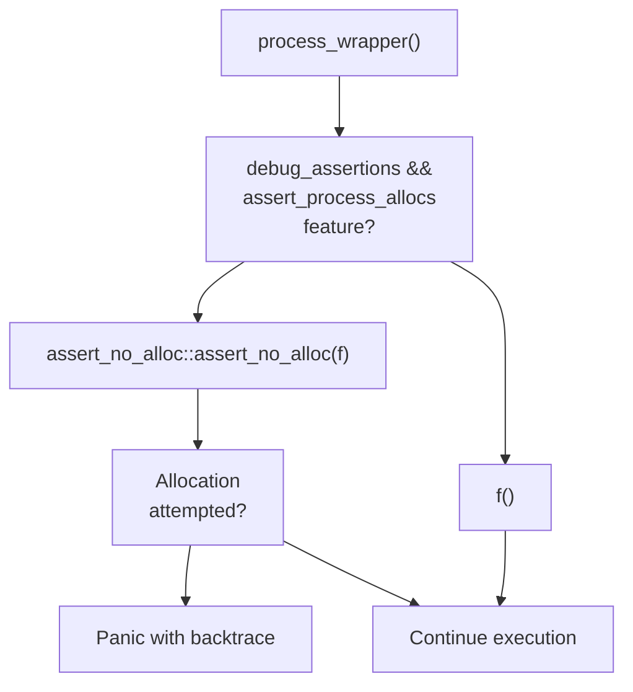
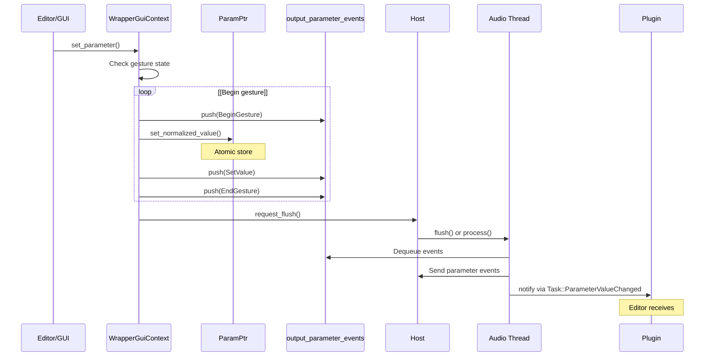
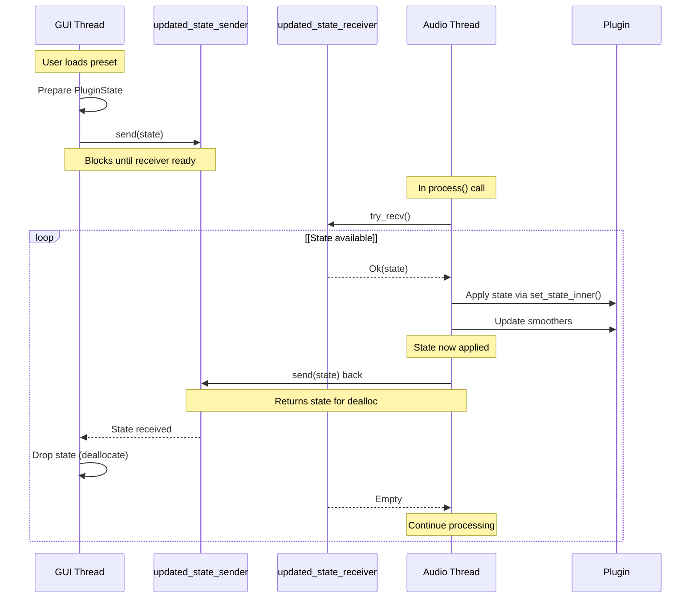
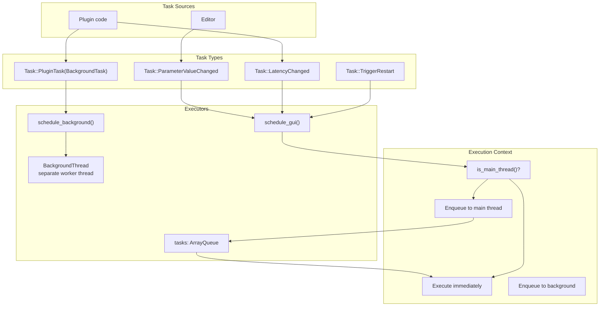
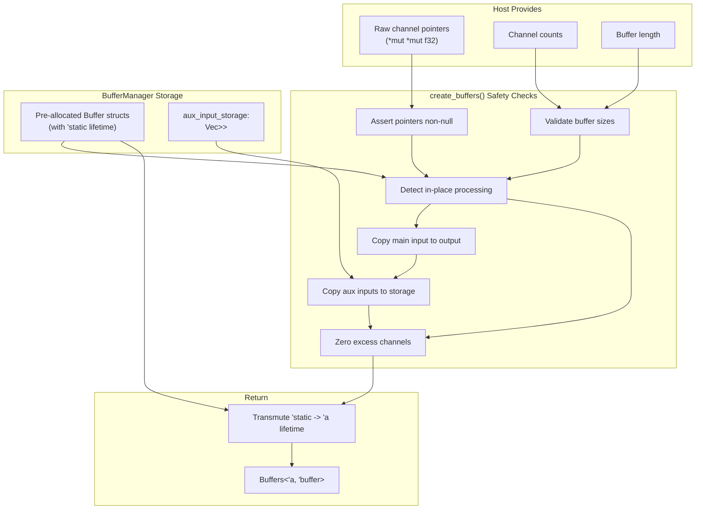

# Thread Safety and Real-time Constraints

> **Relevant source files**
> * [CHANGELOG.md](https://github.com/robbert-vdh/nih-plug/blob/28b149ec/CHANGELOG.md)
> * [src/wrapper/clap/wrapper.rs](https://github.com/robbert-vdh/nih-plug/blob/28b149ec/src/wrapper/clap/wrapper.rs)
> * [src/wrapper/util.rs](https://github.com/robbert-vdh/nih-plug/blob/28b149ec/src/wrapper/util.rs)
> * [src/wrapper/util/buffer_management.rs](https://github.com/robbert-vdh/nih-plug/blob/28b149ec/src/wrapper/util/buffer_management.rs)
> * [src/wrapper/vst3/factory.rs](https://github.com/robbert-vdh/nih-plug/blob/28b149ec/src/wrapper/vst3/factory.rs)
> * [src/wrapper/vst3/inner.rs](https://github.com/robbert-vdh/nih-plug/blob/28b149ec/src/wrapper/vst3/inner.rs)
> * [src/wrapper/vst3/view.rs](https://github.com/robbert-vdh/nih-plug/blob/28b149ec/src/wrapper/vst3/view.rs)
> * [src/wrapper/vst3/wrapper.rs](https://github.com/robbert-vdh/nih-plug/blob/28b149ec/src/wrapper/vst3/wrapper.rs)

This page documents NIH-plug's threading model, real-time safety mechanisms, and lock-free communication strategies. These systems ensure plugins can process audio without blocking, allocating memory, or causing priority inversions while safely communicating with GUI and background threads.

For information about the async task system that uses these primitives, see [Background Tasks and Async Execution](/robbert-vdh/nih-plug/6.3-background-tasks-and-async-execution). For details on how parameters are updated in real-time contexts, see [Parameter Smoothing and Automation](/robbert-vdh/nih-plug/6.4-parameter-smoothing-and-automation).

## Threading Model Overview

NIH-plug plugins operate across three distinct thread types, each with different constraints:

| Thread Type | Characteristics | Constraints | Primary Use |
| --- | --- | --- | --- |
| **Audio Thread** | High priority, host-scheduled, deterministic timing | No blocking, no allocations, no syscalls | `Plugin::process()` callback |
| **Main/GUI Thread** | Host's UI thread or OS event loop | Can allocate, may call host APIs | Editor updates, host communication |
| **Background Thread** | Lower priority worker pool | Can block, perform I/O, allocate freely | File loading, network requests, heavy computation |

### Thread Identification

**Diagram: Thread Identification and Context Creation**



Sources: [src/wrapper/clap/wrapper.rs L346-L357](https://github.com/robbert-vdh/nih-plug/blob/28b149ec/src/wrapper/clap/wrapper.rs#L346-L357)

 [src/wrapper/vst3/inner.rs L401-L405](https://github.com/robbert-vdh/nih-plug/blob/28b149ec/src/wrapper/vst3/inner.rs#L401-L405)

The wrappers store `main_thread_id` during initialization [src/wrapper/clap/wrapper.rs L685](https://github.com/robbert-vdh/nih-plug/blob/28b149ec/src/wrapper/clap/wrapper.rs#L685-L685)

 CLAP plugins optionally use the host's `thread_check` extension for more reliable thread identification [src/wrapper/clap/wrapper.rs L349-L352](https://github.com/robbert-vdh/nih-plug/blob/28b149ec/src/wrapper/clap/wrapper.rs#L349-L352)

## Lock-free Data Structures

NIH-plug uses several specialized data structures to enable safe, wait-free communication between threads without locks that could block the audio thread.

### Core Primitives

**Diagram: Lock-free Communication Primitives**



Sources: [src/wrapper/clap/wrapper.rs L99-L225](https://github.com/robbert-vdh/nih-plug/blob/28b149ec/src/wrapper/clap/wrapper.rs#L99-L225)

 [src/wrapper/vst3/inner.rs L54-L120](https://github.com/robbert-vdh/nih-plug/blob/28b149ec/src/wrapper/vst3/inner.rs#L54-L120)

#### ArrayQueue for Parameter Events

The `ArrayQueue` from crossbeam provides lock-free, bounded MPMC (multi-producer, multi-consumer) queue semantics:

```yaml
output_parameter_events: ArrayQueue::new(OUTPUT_EVENT_QUEUE_CAPACITY)
```

Sources: [src/wrapper/clap/wrapper.rs L224](https://github.com/robbert-vdh/nih-plug/blob/28b149ec/src/wrapper/clap/wrapper.rs#L224-L224)

 [src/wrapper/clap/wrapper.rs L99-L101](https://github.com/robbert-vdh/nih-plug/blob/28b149ec/src/wrapper/clap/wrapper.rs#L99-L101)

When the GUI changes a parameter, it pushes an `OutputParamEvent` to this queue [src/wrapper/clap/wrapper.rs L775-L787](https://github.com/robbert-vdh/nih-plug/blob/28b149ec/src/wrapper/clap/wrapper.rs#L775-L787)

 The audio thread consumes these events during parameter flushes without blocking.

#### Zero-Capacity Channel for State

State updates use a zero-capacity crossbeam channel for a ping-pong pattern:

```javascript
let (updated_state_sender, updated_state_receiver) = channel::bounded(0);
```

Sources: [src/wrapper/clap/wrapper.rs L436](https://github.com/robbert-vdh/nih-plug/blob/28b149ec/src/wrapper/clap/wrapper.rs#L436-L436)

 [src/wrapper/vst3/inner.rs L196](https://github.com/robbert-vdh/nih-plug/blob/28b149ec/src/wrapper/vst3/inner.rs#L196-L196)

**State Update Flow:**

1. GUI thread sends `PluginState` through `updated_state_sender` (blocks until audio thread ready)
2. Audio thread receives state at end of `process()` [src/wrapper/clap/wrapper.rs L2337-L2348](https://github.com/robbert-vdh/nih-plug/blob/28b149ec/src/wrapper/clap/wrapper.rs#L2337-L2348)
3. Audio thread applies state to plugin
4. Audio thread sends state **back** through same channel [src/wrapper/clap/wrapper.rs L2348](https://github.com/robbert-vdh/nih-plug/blob/28b149ec/src/wrapper/clap/wrapper.rs#L2348-L2348)
5. GUI thread receives and deallocates state object

This ensures:

* State changes never happen mid-process
* Deallocation occurs on GUI thread (may allocate during drop)
* Audio thread never blocks (send returns immediately if GUI not waiting)

Sources: [src/wrapper/clap/wrapper.rs L154-L164](https://github.com/robbert-vdh/nih-plug/blob/28b149ec/src/wrapper/clap/wrapper.rs#L154-L164)

#### AtomicRefCell for Event Buffers

Event queues use `AtomicRefCell<VecDeque>` to allow borrowing across `process()` calls while maintaining interior mutability:

```yaml
input_events: AtomicRefCell::new(VecDeque::with_capacity(512))
output_events: AtomicRefCell::new(VecDeque::with_capacity(512))
```

Sources: [src/wrapper/clap/wrapper.rs L552-L553](https://github.com/robbert-vdh/nih-plug/blob/28b149ec/src/wrapper/clap/wrapper.rs#L552-L553)

The `WrapperProcessContext` borrows these mutably for the duration of the process call [src/wrapper/clap/wrapper.rs L751-L754](https://github.com/robbert-vdh/nih-plug/blob/28b149ec/src/wrapper/clap/wrapper.rs#L751-L754)

 ensuring no concurrent access.

## Real-time Safety Mechanisms

### ScopedFtz: Flush-to-Zero Control

Denormal floating-point numbers can cause severe performance degradation on some processors. `ScopedFtz` enables Flush-to-Zero (FTZ) mode for the duration of audio processing.

**Implementation Details:**

| Architecture | Register | Bit | Assembly |
| --- | --- | --- | --- |
| x86/x86_64 with SSE | MXCSR | Bit 15 | `stmxcsr`/`ldmxcsr` |
| AArch64 | FPCR | Bit 24 | `mrs`/`msr` |

Sources: [src/wrapper/util.rs L12-L26](https://github.com/robbert-vdh/nih-plug/blob/28b149ec/src/wrapper/util.rs#L12-L26)

 [src/wrapper/util.rs L213-L263](https://github.com/robbert-vdh/nih-plug/blob/28b149ec/src/wrapper/util.rs#L213-L263)

**Diagram: ScopedFtz Lifecycle**

```mermaid
sequenceDiagram
  participant Host
  participant process_wrapper()
  participant ScopedFtz
  participant Plugin::process()

  Host->>process_wrapper(): Call with audio buffers
  process_wrapper()->>ScopedFtz: ScopedFtz::enable()
  loop [FTZ not already enabled]
    ScopedFtz->>ScopedFtz: Read MXCSR/FPCR
    ScopedFtz->>ScopedFtz: Set FTZ bit
    note over ScopedFtz: should_disable_again = true
    note over ScopedFtz: should_disable_again = false
    ScopedFtz->>Plugin::process(): Execute process function
    Plugin::process()->>Plugin::process(): Process audio (denormals flushed to zero)
    Plugin::process()-->>ScopedFtz: Return
    ScopedFtz->>ScopedFtz: Read MXCSR/FPCR
    ScopedFtz->>ScopedFtz: Clear FTZ bit
  end
  ScopedFtz-->>process_wrapper(): Drop
  process_wrapper()-->>Host: Return result
```

Sources: [src/wrapper/util.rs L189-L200](https://github.com/robbert-vdh/nih-plug/blob/28b149ec/src/wrapper/util.rs#L189-L200)

 [src/wrapper/util.rs L214-L263](https://github.com/robbert-vdh/nih-plug/blob/28b149ec/src/wrapper/util.rs#L214-L263)

 [src/wrapper/util.rs L265-L284](https://github.com/robbert-vdh/nih-plug/blob/28b149ec/src/wrapper/util.rs#L265-L284)

The guard automatically restores the previous FTZ state when dropped, ensuring host state is not modified [src/wrapper/util.rs L265-L284](https://github.com/robbert-vdh/nih-plug/blob/28b149ec/src/wrapper/util.rs#L265-L284)

### assert_process_allocs: Allocation Detection

When compiled with the `assert_process_allocs` feature in debug mode, NIH-plug detects memory allocations during `process()`:

```
#[cfg(all(debug_assertions, feature = "assert_process_allocs"))]
#[global_allocator]
static A: assert_no_alloc::AllocDisabler = assert_no_alloc::AllocDisabler;
```

Sources: [src/wrapper/util.rs L28-L37](https://github.com/robbert-vdh/nih-plug/blob/28b149ec/src/wrapper/util.rs#L28-L37)

 [src/wrapper/util.rs L193-L199](https://github.com/robbert-vdh/nih-plug/blob/28b149ec/src/wrapper/util.rs#L193-L199)

**Detection Flow:**



Sources: [src/wrapper/util.rs L189-L200](https://github.com/robbert-vdh/nih-plug/blob/28b149ec/src/wrapper/util.rs#L189-L200)

**Exemptions:** Code within `permit_alloc()` blocks is allowed to allocate even during process calls. This is used for:

* Thread identification the first time it's needed [src/wrapper/clap/wrapper.rs L355](https://github.com/robbert-vdh/nih-plug/blob/28b149ec/src/wrapper/clap/wrapper.rs#L355-L355)
* Panic logging [src/wrapper/util.rs L145](https://github.com/robbert-vdh/nih-plug/blob/28b149ec/src/wrapper/util.rs#L145-L145)

### HARD_REALTIME_ONLY Flag

Plugins can declare strict real-time requirements:

```javascript
const HARD_REALTIME_ONLY: bool = true;
```

This flag:

* Informs hosts the plugin cannot tolerate priority inversions or scheduling latency
* Gets added to VST3 subcategories as `OnlyRT` [src/wrapper/vst3/factory.rs L119-L123](https://github.com/robbert-vdh/nih-plug/blob/28b149ec/src/wrapper/vst3/factory.rs#L119-L123)
* Used in CLAP's render extension [src/wrapper/clap/wrapper.rs L2836-L2838](https://github.com/robbert-vdh/nih-plug/blob/28b149ec/src/wrapper/clap/wrapper.rs#L2836-L2838)
* Appropriate for plugins that would fail if real-time constraints are violated

Sources: [src/wrapper/vst3/factory.rs L119-L123](https://github.com/robbert-vdh/nih-plug/blob/28b149ec/src/wrapper/vst3/factory.rs#L119-L123)

 [src/wrapper/clap/wrapper.rs L2836-L2838](https://github.com/robbert-vdh/nih-plug/blob/28b149ec/src/wrapper/clap/wrapper.rs#L2836-L2838)

## Thread Communication Patterns

### Parameter Changes: GUI to Audio

**Diagram: Parameter Change Flow**



Sources: [src/wrapper/clap/wrapper.rs L769-L787](https://github.com/robbert-vdh/nih-plug/blob/28b149ec/src/wrapper/clap/wrapper.rs#L769-L787)

 [src/wrapper/clap/wrapper.rs L372-L379](https://github.com/robbert-vdh/nih-plug/blob/28b149ec/src/wrapper/clap/wrapper.rs#L372-L379)

The `GuiContext` methods validate gesture state in debug builds using `param_gesture_checker` to detect incorrect usage patterns [src/wrapper/clap/wrapper.rs L733-L735](https://github.com/robbert-vdh/nih-plug/blob/28b149ec/src/wrapper/clap/wrapper.rs#L733-L735)

### State Updates: Ping-Pong Pattern

The state update mechanism ensures thread-safe preset changes without blocking:

**Diagram: State Update Ping-Pong**



Sources: [src/wrapper/clap/wrapper.rs L2337-L2362](https://github.com/robbert-vdh/nih-plug/blob/28b149ec/src/wrapper/clap/wrapper.rs#L2337-L2362)

 [src/wrapper/vst3/inner.rs L110-L120](https://github.com/robbert-vdh/nih-plug/blob/28b149ec/src/wrapper/vst3/inner.rs#L110-L120)

Key properties:

* Zero-capacity channel ensures send/receive are paired
* Audio thread never blocks (uses `try_recv()`)
* Deallocation always happens on GUI thread
* State changes apply between processing blocks

The process call checks for state at the very end [src/wrapper/clap/wrapper.rs L2337-L2348](https://github.com/robbert-vdh/nih-plug/blob/28b149ec/src/wrapper/clap/wrapper.rs#L2337-L2348)

 after all audio processing is complete.

### Background Task Execution

**Task Scheduling Architecture:**



Sources: [src/wrapper/clap/wrapper.rs L322-L344](https://github.com/robbert-vdh/nih-plug/blob/28b149ec/src/wrapper/clap/wrapper.rs#L322-L344)

 [src/wrapper/clap/wrapper.rs L338-L344](https://github.com/robbert-vdh/nih-plug/blob/28b149ec/src/wrapper/clap/wrapper.rs#L338-L344)

 [src/wrapper/vst3/inner.rs L384-L421](https://github.com/robbert-vdh/nih-plug/blob/28b149ec/src/wrapper/vst3/inner.rs#L384-L421)

**CLAP vs VST3 Differences:**

| Aspect | CLAP | VST3 |
| --- | --- | --- |
| Main thread tasks | `host->request_callback()` [src/wrapper/clap/wrapper.rs L331](https://github.com/robbert-vdh/nih-plug/blob/28b149ec/src/wrapper/clap/wrapper.rs#L331-L331) | `OsEventLoop` with platform event loop [src/wrapper/vst3/inner.rs L326-L327](https://github.com/robbert-vdh/nih-plug/blob/28b149ec/src/wrapper/vst3/inner.rs#L326-L327) |
| Task capacity | `TASK_QUEUE_CAPACITY` (shared constant) | Same |
| Background thread | Shared `BackgroundThread` | Shared `BackgroundThread` |
| Linux optimization | Direct `request_callback()` | IRunLoop integration [src/wrapper/vst3/view.rs L163-L169](https://github.com/robbert-vdh/nih-plug/blob/28b149ec/src/wrapper/vst3/view.rs#L163-L169) |

The background thread uses its own task queue and executor, separate from the main thread queue [src/wrapper/clap/wrapper.rs L338-L344](https://github.com/robbert-vdh/nih-plug/blob/28b149ec/src/wrapper/clap/wrapper.rs#L338-L344)

## Buffer Management Thread Safety

The `BufferManager` safely converts host-provided raw pointers into Rust `Buffer` objects without allocations:

**Diagram: Buffer Initialization Safety**



Sources: [src/wrapper/util/buffer_management.rs L167-L373](https://github.com/robbert-vdh/nih-plug/blob/28b149ec/src/wrapper/util/buffer_management.rs#L167-L373)

Key safety mechanisms:

1. **Pre-allocation:** All `Buffer` structs and auxiliary input storage are allocated during initialization [src/wrapper/util/buffer_management.rs L90-L146](https://github.com/robbert-vdh/nih-plug/blob/28b149ec/src/wrapper/util/buffer_management.rs#L90-L146)
2. **Lifetime transmutation:** Buffers store `'static` internally but return shortened lifetimes [src/wrapper/util/buffer_management.rs L365-L372](https://github.com/robbert-vdh/nih-plug/blob/28b149ec/src/wrapper/util/buffer_management.rs#L365-L372)
3. **In-place detection:** Compares input and output pointers to determine if copying is needed [src/wrapper/util/buffer_management.rs L220-L244](https://github.com/robbert-vdh/nih-plug/blob/28b149ec/src/wrapper/util/buffer_management.rs#L220-L244)
4. **Null pointer checks:** Debug assertions validate all pointers [src/wrapper/util/buffer_management.rs L189-L206](https://github.com/robbert-vdh/nih-plug/blob/28b149ec/src/wrapper/util/buffer_management.rs#L189-L206)
5. **Thread safety:** The manager is marked `Send + Sync` because raw pointers are only used within `create_buffers()` [src/wrapper/util/buffer_management.rs L47-L50](https://github.com/robbert-vdh/nih-plug/blob/28b149ec/src/wrapper/util/buffer_management.rs#L47-L50)

The entire buffer creation process is allocation-free, making it safe for real-time audio threads.

---

**Sources for entire page:**

* [src/wrapper/clap/wrapper.rs](https://github.com/robbert-vdh/nih-plug/blob/28b149ec/src/wrapper/clap/wrapper.rs)
* [src/wrapper/vst3/wrapper.rs](https://github.com/robbert-vdh/nih-plug/blob/28b149ec/src/wrapper/vst3/wrapper.rs)
* [src/wrapper/vst3/inner.rs](https://github.com/robbert-vdh/nih-plug/blob/28b149ec/src/wrapper/vst3/inner.rs)
* [src/wrapper/vst3/view.rs](https://github.com/robbert-vdh/nih-plug/blob/28b149ec/src/wrapper/vst3/view.rs)
* [src/wrapper/util.rs](https://github.com/robbert-vdh/nih-plug/blob/28b149ec/src/wrapper/util.rs)
* [src/wrapper/util/buffer_management.rs](https://github.com/robbert-vdh/nih-plug/blob/28b149ec/src/wrapper/util/buffer_management.rs)
* [CHANGELOG.md](https://github.com/robbert-vdh/nih-plug/blob/28b149ec/CHANGELOG.md)