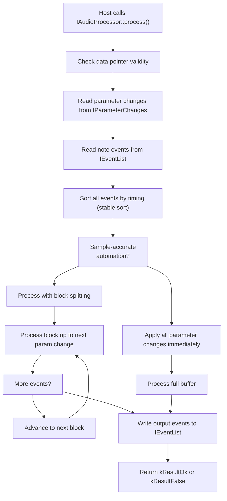
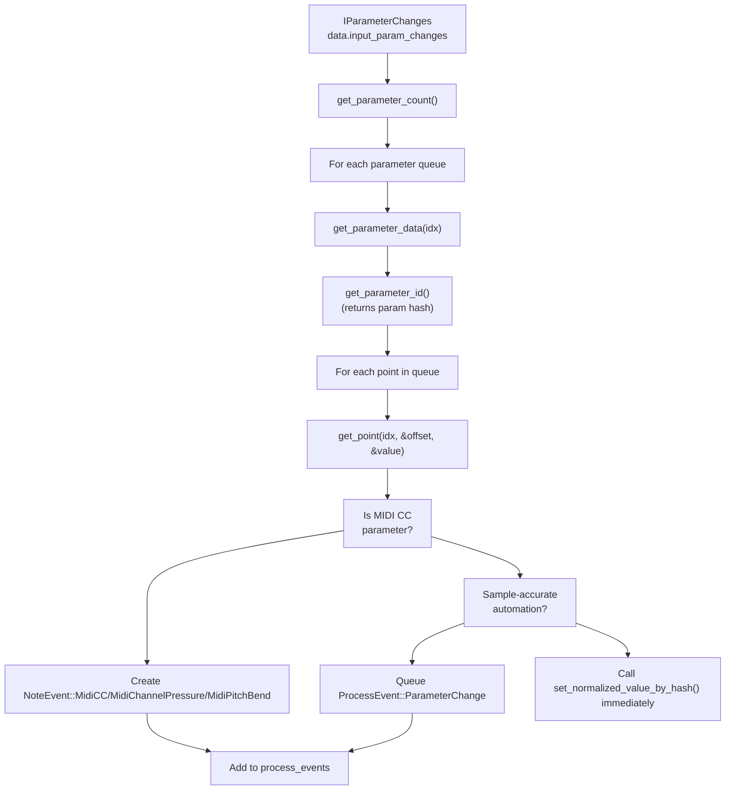
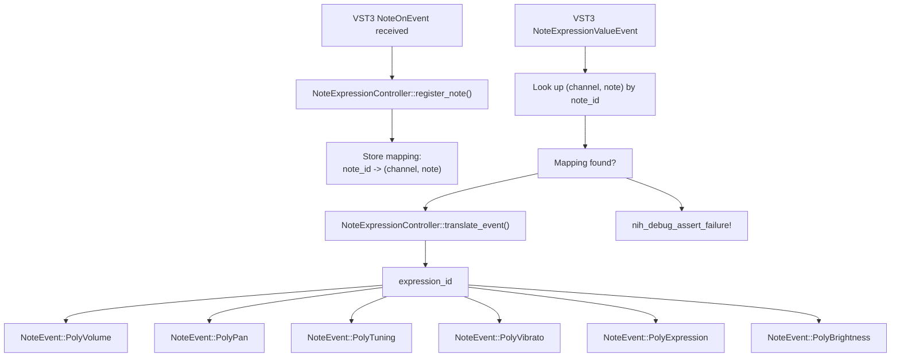
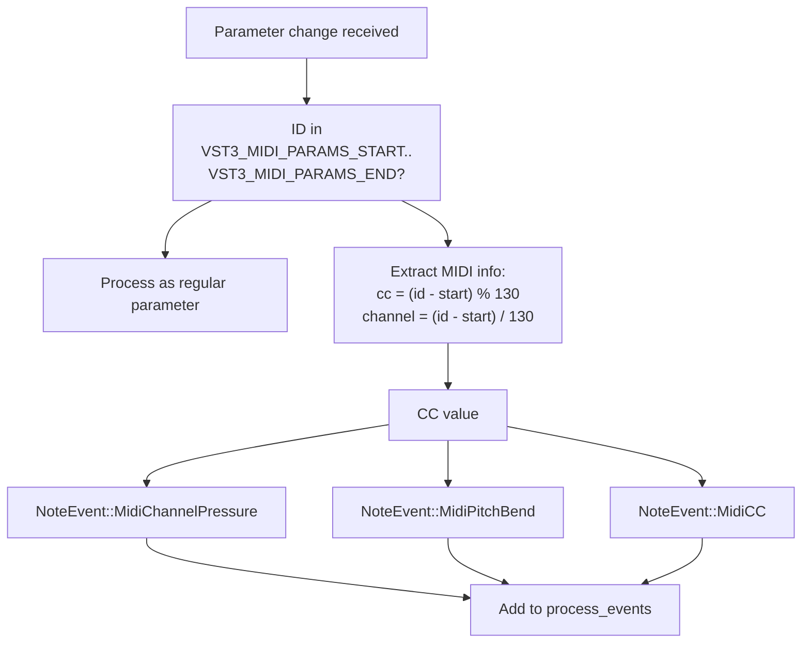
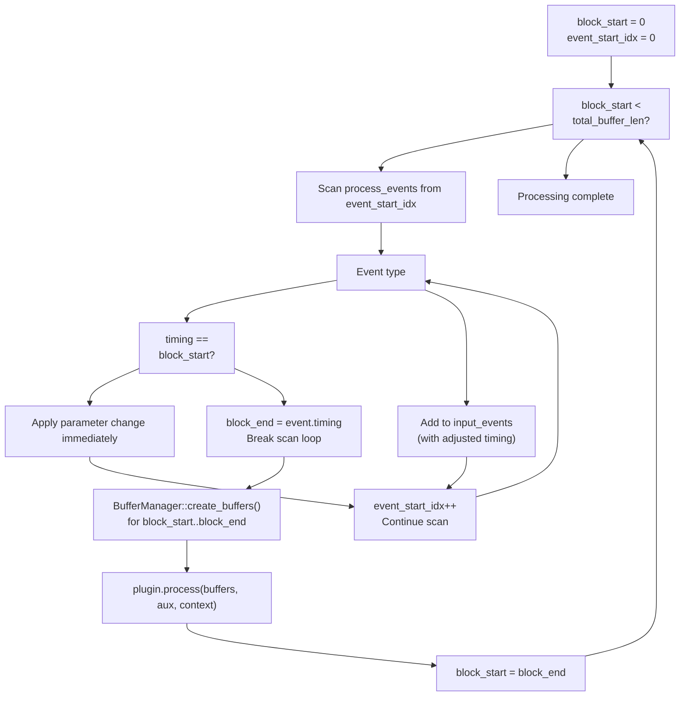
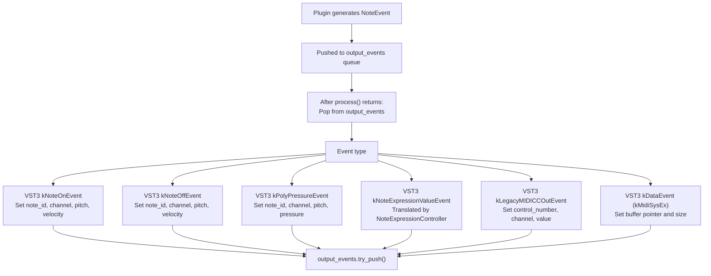
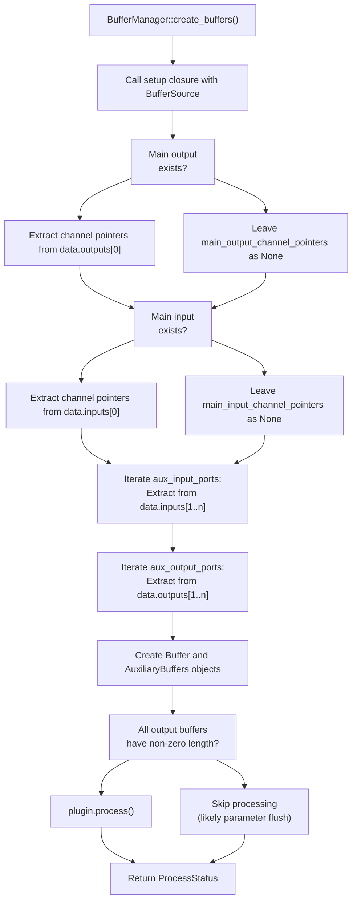

# VST3 Audio Processing and Events

> **Relevant source files**
> * [src/wrapper/clap/wrapper.rs](https://github.com/robbert-vdh/nih-plug/blob/28b149ec/src/wrapper/clap/wrapper.rs)
> * [src/wrapper/vst3/inner.rs](https://github.com/robbert-vdh/nih-plug/blob/28b149ec/src/wrapper/vst3/inner.rs)
> * [src/wrapper/vst3/wrapper.rs](https://github.com/robbert-vdh/nih-plug/blob/28b149ec/src/wrapper/vst3/wrapper.rs)

## Purpose and Scope

This page details how the VST3 wrapper handles audio processing and event translation. It covers the implementation of the `IAudioProcessor` interface, parameter change handling, event translation between VST3 and NIH-plug formats, sample-accurate automation through block splitting, and transport information extraction. For information about VST3 plugin instantiation and COM interfaces, see [VST3 Factory and COM Interfaces](/robbert-vdh/nih-plug/3.1.1-vst3-factory-and-com-interfaces). For the broader VST3 wrapper architecture, see [VST3 Wrapper](/robbert-vdh/nih-plug/3.1-vst3-wrapper).

---

## IAudioProcessor Interface Implementation

The `Wrapper<P>` struct implements the `IAudioProcessor` interface from the VST3 SDK, which provides the core audio processing callback. The wrapper is responsible for translating between VST3's processing model and NIH-plug's generic `Plugin::process()` interface.

### Key Components

| Component | Type | Purpose |
| --- | --- | --- |
| `WrapperInner<P>` | Struct | Contains all shared state between VST3 interface implementations |
| `process_events` | `AtomicRefCell<Vec<ProcessEvent<P>>>` | Stores sorted parameter changes and note events |
| `input_events` | `AtomicRefCell<VecDeque<PluginNoteEvent<P>>>` | Queue of translated note events for the plugin |
| `output_events` | `AtomicRefCell<VecDeque<PluginNoteEvent<P>>>` | Queue of events produced by the plugin |
| `buffer_manager` | `AtomicRefCell<BufferManager>` | Manages audio buffer allocation and slicing |

**Sources:** [src/wrapper/vst3/wrapper.rs L50-L52](https://github.com/robbert-vdh/nih-plug/blob/28b149ec/src/wrapper/vst3/wrapper.rs#L50-L52)

 [src/wrapper/vst3/inner.rs L30-L140](https://github.com/robbert-vdh/nih-plug/blob/28b149ec/src/wrapper/vst3/inner.rs#L30-L140)

---

## Process Call Flow



**Diagram: VST3 Process Call Execution Flow**

The `process()` function orchestrates the entire audio processing cycle, handling both parameter changes and note events while optionally splitting buffers for sample-accurate automation.

**Sources:** [src/wrapper/vst3/wrapper.rs L933-L1596](https://github.com/robbert-vdh/nih-plug/blob/28b149ec/src/wrapper/vst3/wrapper.rs#L933-L1596)

---

## Parameter Change Processing

VST3 delivers parameter changes through the `IParameterChanges` interface, which provides a collection of `IParamValueQueue` objects—one per parameter. Each queue contains timestamped parameter value changes.

### Parameter Change Extraction



**Diagram: Parameter Change Extraction from VST3 Host**

The wrapper iterates through all parameter change queues and extracts timestamped values. MIDI CC messages are delivered as special parameter changes with IDs in the range `VST3_MIDI_PARAMS_START..VST3_MIDI_PARAMS_END`.

### ProcessEvent Enum

The `ProcessEvent<P>` enum consolidates parameter changes and note events into a single sortable timeline:

```yaml
enum ProcessEvent<P: Plugin> {
    ParameterChange {
        timing: u32,
        hash: u32,
        normalized_value: f32,
    },
    NoteEvent(PluginNoteEvent<P>),
}
```

**Sources:** [src/wrapper/vst3/wrapper.rs L986-L1064](https://github.com/robbert-vdh/nih-plug/blob/28b149ec/src/wrapper/vst3/wrapper.rs#L986-L1064)

 [src/wrapper/vst3/inner.rs L165-L186](https://github.com/robbert-vdh/nih-plug/blob/28b149ec/src/wrapper/vst3/inner.rs#L165-L186)

---

## Event Translation: VST3 to NIH-plug

VST3 uses several event types for MIDI and note expression data. The wrapper translates these into NIH-plug's unified `NoteEvent` enum.

### VST3 Event Types

| VST3 Event Type | NIH-plug Translation | Condition |
| --- | --- | --- |
| `kNoteOnEvent` | `NoteEvent::NoteOn` | `P::MIDI_INPUT >= MidiConfig::Basic` |
| `kNoteOffEvent` | `NoteEvent::NoteOff` | `P::MIDI_INPUT >= MidiConfig::Basic` |
| `kPolyPressureEvent` | `NoteEvent::PolyPressure` | `P::MIDI_INPUT >= MidiConfig::Basic` |
| `kNoteExpressionValueEvent` | `NoteEvent::PolyVolume/PolyPan/PolyTuning/...` | Translated by `NoteExpressionController` |
| `kDataEvent` (SysEx) | `NoteEvent::MidiSysEx` | Parsed from raw MIDI bytes |

### Note Expression Translation

VST3's note expression events lack MIDI channel and note ID information, requiring the wrapper to maintain state tracking through `NoteExpressionController`:



**Diagram: Note Expression Translation via NoteExpressionController**

The `NoteExpressionController` maintains a bidirectional mapping between VST3 note IDs and (channel, note) pairs, enabling translation of expression events that don't include this information.

**Sources:** [src/wrapper/vst3/wrapper.rs L1068-L1156](https://github.com/robbert-vdh/nih-plug/blob/28b149ec/src/wrapper/vst3/wrapper.rs#L1068-L1156)

 [src/wrapper/vst3/inner.rs L98-L99](https://github.com/robbert-vdh/nih-plug/blob/28b149ec/src/wrapper/vst3/inner.rs#L98-L99)

---

## MIDI CC as Parameter Changes

When `P::MIDI_INPUT >= MidiConfig::MidiCCs`, the wrapper automatically generates synthetic parameters for all MIDI CC messages, channel pressure, and pitch bend. These are delivered to the plugin as parameter changes.

### MIDI Parameter ID Mapping

The wrapper reserves parameter ID space `VST3_MIDI_PARAMS_START` to `VST3_MIDI_PARAMS_END` for MIDI messages:

| MIDI Message Type | Parameter ID Formula | Count |
| --- | --- | --- |
| CC 0-127 | `VST3_MIDI_PARAMS_START + (channel * 130) + cc` | 128 × 16 = 2048 |
| Channel Pressure | `VST3_MIDI_PARAMS_START + (channel * 130) + 128` | 16 |
| Pitch Bend | `VST3_MIDI_PARAMS_START + (channel * 130) + 129` | 16 |

**Total:** 2080 synthetic parameters (130 messages × 16 channels)

### MIDI CC Translation Logic



**Diagram: MIDI CC to NoteEvent Translation**

**Sources:** [src/wrapper/vst3/wrapper.rs L1017-L1047](https://github.com/robbert-vdh/nih-plug/blob/28b149ec/src/wrapper/vst3/wrapper.rs#L1017-L1047)

 [src/wrapper/vst3/util.rs L28-L30](https://github.com/robbert-vdh/nih-plug/blob/28b149ec/src/wrapper/vst3/util.rs#L28-L30)

---

## Sample-Accurate Automation

When `P::SAMPLE_ACCURATE_AUTOMATION` is `true`, the wrapper splits audio buffers at parameter change boundaries to ensure parameters update at the exact sample where the change occurs.

### Block Splitting Algorithm



**Diagram: Sample-Accurate Automation Block Splitting**

The algorithm ensures that:

1. Parameter changes are applied **before** processing the block where they occur
2. Note events have their timing adjusted relative to the current block start
3. The stable sort ensures parameter changes are processed before note events at the same sample

### Block Splitting Example

Consider a 512-sample buffer with parameter changes at samples 100 and 300:

```yaml
Buffer: [0..512]
Events: [ParameterChange(100), NoteEvent(150), ParameterChange(300), NoteEvent(350)]

Block 1: [0..100]   - No parameter changes
Block 2: [100..300] - ParameterChange(100) applied, NoteEvent(50) processed
Block 3: [300..512] - ParameterChange(300) applied, NoteEvent(50) processed
```

**Sources:** [src/wrapper/vst3/wrapper.rs L1176-L1220](https://github.com/robbert-vdh/nih-plug/blob/28b149ec/src/wrapper/vst3/wrapper.rs#L1176-L1220)

 [src/wrapper/vst3/inner.rs L165-L186](https://github.com/robbert-vdh/nih-plug/blob/28b149ec/src/wrapper/vst3/inner.rs#L165-L186)

---

## Output Event Handling

The plugin can generate output events during processing, which the wrapper translates back to VST3 events and writes to the host's output event list.

### Output Event Translation



**Diagram: Plugin Output Event Translation to VST3**

### Event Timing Compensation

Output events have their timing adjusted for:

1. **Block splitting offset:** `event.timing() + block_start`
2. **Clamping:** Out-of-bounds events are clamped to `[0, total_buffer_len]`

This ensures events are reported with absolute timing relative to the full buffer, even when processing was split into blocks.

**Sources:** [src/wrapper/vst3/wrapper.rs L1418-L1596](https://github.com/robbert-vdh/nih-plug/blob/28b149ec/src/wrapper/vst3/wrapper.rs#L1418-L1596)

 [src/wrapper/util.rs L96-L108](https://github.com/robbert-vdh/nih-plug/blob/28b149ec/src/wrapper/util.rs#L96-L108)

---

## Transport Information Extraction

The wrapper extracts transport information from VST3's `ProcessContext` structure and populates NIH-plug's `Transport` object. VST3 uses bit flags to indicate which fields are valid.

### Transport Field Mapping

| VST3 Field | Transport Field | Condition Flag | Notes |
| --- | --- | --- | --- |
| `state & (1 << 1)` | `playing` | `kPlaying` | Boolean flag |
| `state & (1 << 3)` | `recording` | `kRecording` | Boolean flag |
| `tempo` | `tempo` | `kTempoValid` | BPM value |
| `time_sig_num` | `time_sig_numerator` | `kTimeSigValid` | E.g., 4 in 4/4 |
| `time_sig_den` | `time_sig_denominator` | `kTimeSigValid` | E.g., 4 in 4/4 |
| `project_time_samples` | `pos_samples` | Always available | Absolute sample position |
| `project_time_music` | `pos_beats` | `kProjectTimeMusicValid` | Absolute beat position |
| `bar_position_music` | `bar_start_pos_beats` | `kBarPositionValid` | Beat position of bar start |
| `cycle_start_music` | `loop_range_beats.0` | `kCycleActive && kCycleValid` | Loop start in beats |
| `cycle_end_music` | `loop_range_beats.1` | `kCycleActive && kCycleValid` | Loop end in beats |

### Block Splitting Compensation

When sample-accurate automation splits a buffer, transport positions need adjustment:

```javascript
// Sample position compensation
transport.pos_samples = context.project_time_samples + block_start as i64;

// Beat position compensation (requires tempo)
if P::SAMPLE_ACCURATE_AUTOMATION && block_start > 0 && tempo_valid {
    transport.pos_beats = context.project_time_music
        + (block_start as f64 / sample_rate as f64 / 60.0 * tempo);
}

// Bar position can be recomputed from other fields
transport.bar_start_pos_beats = match transport.bar_start_pos_beats() {
    Some(updated) => Some(updated),
    None => Some(context.bar_position_music),
};
```

The wrapper ensures that each split block receives transport information relative to its start position within the full buffer.

**Sources:** [src/wrapper/vst3/wrapper.rs L1334-L1390](https://github.com/robbert-vdh/nih-plug/blob/28b149ec/src/wrapper/vst3/wrapper.rs#L1334-L1390)

---

## Buffer Management and Processing

The `BufferManager` creates `Buffer` and `AuxiliaryBuffers` objects from the host's raw channel pointers, handling various bus configurations.

### Buffer Creation Flow



**Diagram: Audio Buffer Extraction and Validation**

The wrapper validates that all output buffers have the expected length before calling the plugin's process function. If the buffer size is zero or channels are missing, it's likely a "parameter flush" operation where the host only wants to update parameters without processing audio.

**Sources:** [src/wrapper/vst3/wrapper.rs L1231-L1329](https://github.com/robbert-vdh/nih-plug/blob/28b149ec/src/wrapper/vst3/wrapper.rs#L1231-L1329)

 [src/wrapper/util/buffer_management.rs L1-L400](https://github.com/robbert-vdh/nih-plug/blob/28b149ec/src/wrapper/util/buffer_management.rs#L1-L400)

---

## Error Handling and Return Codes

The `process()` function returns VST3 result codes based on the plugin's process status:

| ProcessStatus | VST3 Return Code | Meaning |
| --- | --- | --- |
| `Normal` | `kResultOk` | Processing succeeded |
| `Tail(_)` | `kResultOk` | Processing succeeded, tail active |
| `KeepAlive` | `kResultOk` | Processing succeeded, keep alive |
| `Error(msg)` | `kResultFalse` | Processing failed with error message |

The wrapper also logs debug assertions when:

* Parameter change timing is out of bounds
* Note expression events reference unknown note IDs
* Output event push operations fail
* Buffer validation fails unexpectedly

**Sources:** [src/wrapper/vst3/wrapper.rs L1408-L1416](https://github.com/robbert-vdh/nih-plug/blob/28b149ec/src/wrapper/vst3/wrapper.rs#L1408-L1416)

---

## Thread Safety Considerations

The audio processing path uses several thread-safe data structures:

| Structure | Type | Thread Safety Mechanism |
| --- | --- | --- |
| `process_events` | `AtomicRefCell<Vec<...>>` | Single-threaded borrow during process call |
| `input_events` | `AtomicRefCell<VecDeque<...>>` | Single-threaded borrow during process call |
| `output_events` | `AtomicRefCell<VecDeque<...>>` | Single-threaded borrow during process call |
| `buffer_manager` | `AtomicRefCell<BufferManager>` | Single-threaded borrow during process call |
| `current_buffer_config` | `AtomicCell<Option<BufferConfig>>` | Lock-free atomic operations |
| `is_processing` | `AtomicBool` | Lock-free atomic flag |

The `AtomicRefCell` types provide runtime borrow checking without locks, panicking if multiple borrows occur simultaneously. This is safe in the VST3 model because the host guarantees `process()` is not called concurrently with itself or with most other interface methods.

**Sources:** [src/wrapper/vst3/inner.rs L83-L109](https://github.com/robbert-vdh/nih-plug/blob/28b149ec/src/wrapper/vst3/inner.rs#L83-L109)