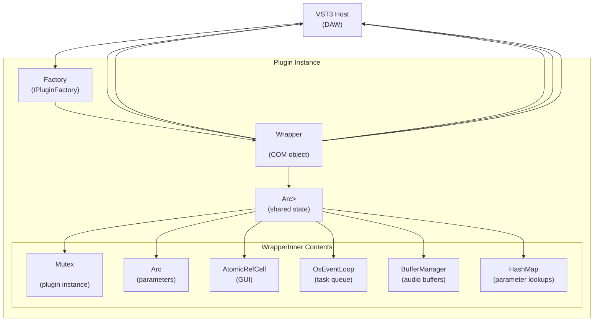
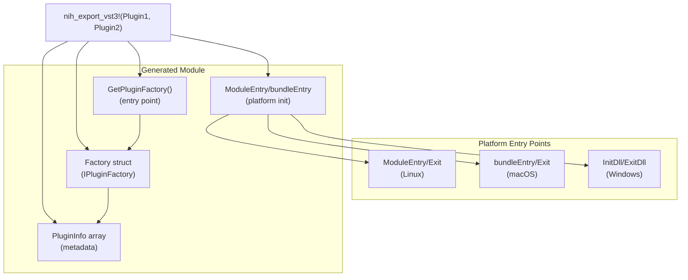
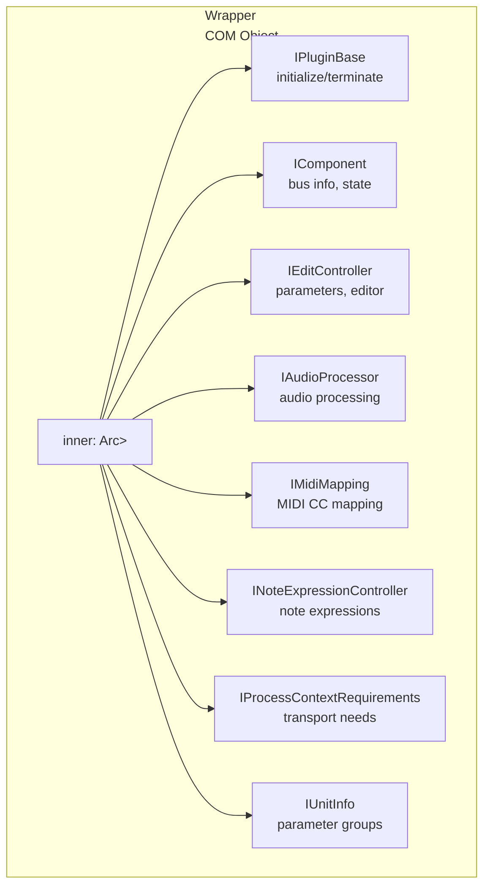
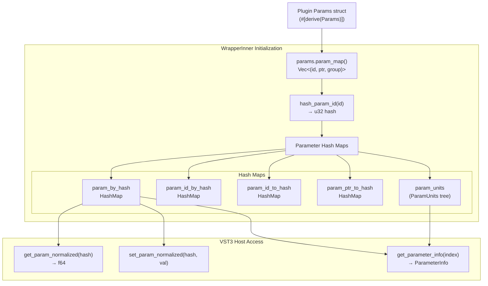
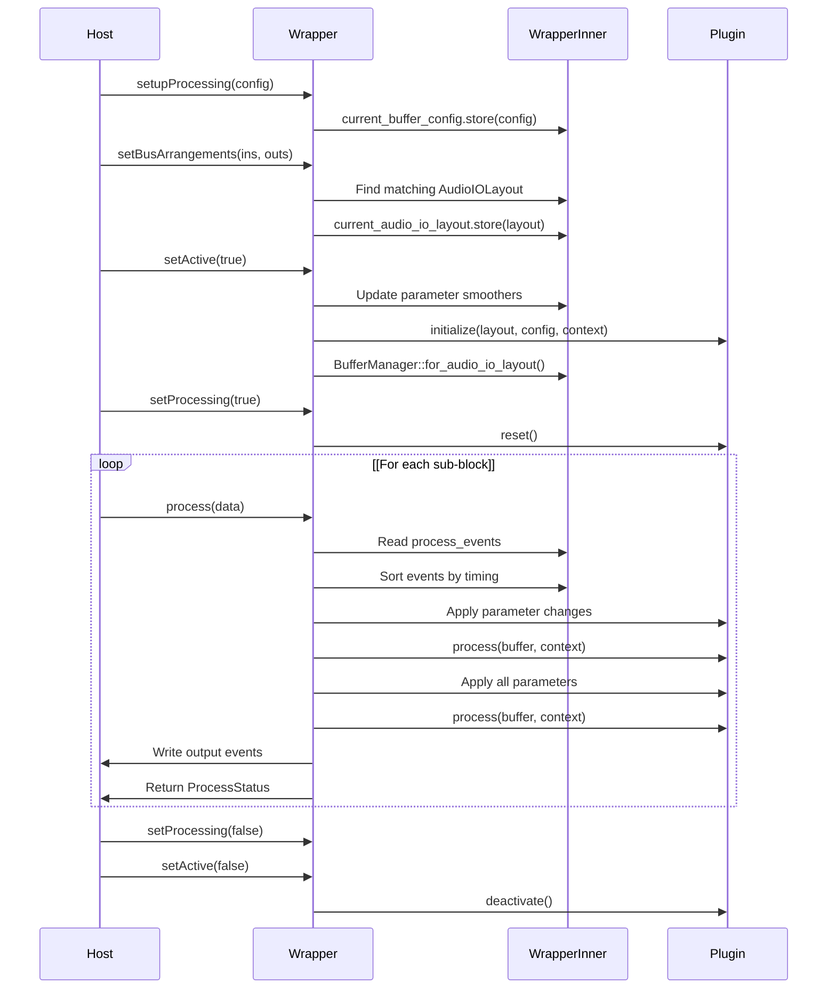
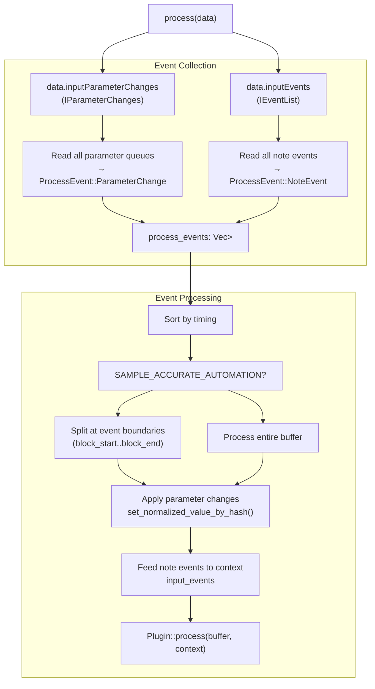
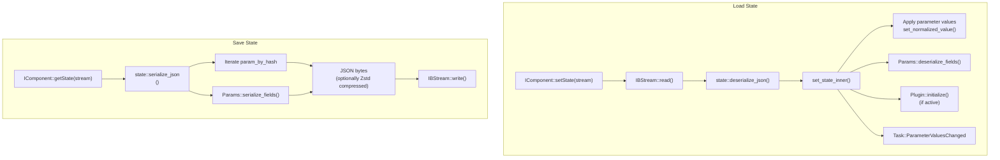
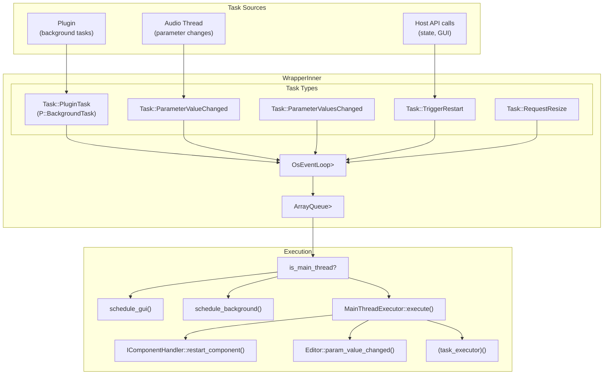
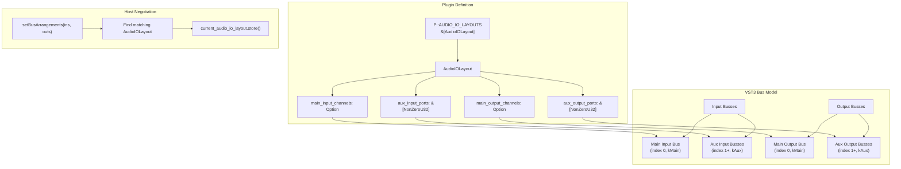
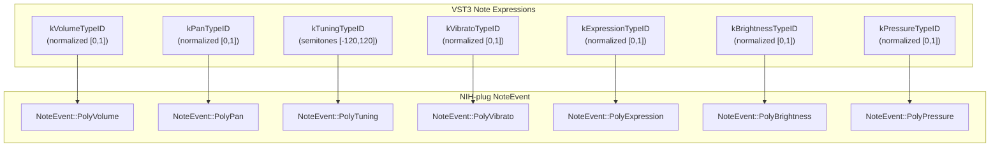

# VST3 Wrapper

> **Relevant source files**
> * [nih_plug_derive/src/lib.rs](https://github.com/robbert-vdh/nih-plug/blob/28b149ec/nih_plug_derive/src/lib.rs)
> * [src/params.rs](https://github.com/robbert-vdh/nih-plug/blob/28b149ec/src/params.rs)
> * [src/wrapper/clap/wrapper.rs](https://github.com/robbert-vdh/nih-plug/blob/28b149ec/src/wrapper/clap/wrapper.rs)
> * [src/wrapper/vst3.rs](https://github.com/robbert-vdh/nih-plug/blob/28b149ec/src/wrapper/vst3.rs)
> * [src/wrapper/vst3/inner.rs](https://github.com/robbert-vdh/nih-plug/blob/28b149ec/src/wrapper/vst3/inner.rs)
> * [src/wrapper/vst3/wrapper.rs](https://github.com/robbert-vdh/nih-plug/blob/28b149ec/src/wrapper/vst3/wrapper.rs)

## Purpose and Scope

The VST3 wrapper translates NIH-plug's generic plugin abstractions into Steinberg's VST3 plugin format. It implements VST3's COM-based interface system using the `vst3-sys` bindings, handling parameter mapping, audio processing, state serialization, and GUI integration. The wrapper enables plugins implementing the `Vst3Plugin` trait to load in VST3-compatible hosts.

For information about the generic plugin abstractions being wrapped, see [Plugin Trait](/robbert-vdh/nih-plug/2.1-plugin-trait). For CLAP wrapper implementation details, see [CLAP Wrapper](/robbert-vdh/nih-plug/3.2-clap-wrapper). For details on factory instantiation and COM interfaces, see [VST3 Factory and COM Interfaces](/robbert-vdh/nih-plug/3.1.1-vst3-factory-and-com-interfaces). For audio processing specifics, see [VST3 Audio Processing and Events](/robbert-vdh/nih-plug/3.1.2-vst3-audio-processing-and-events).

---

## Architecture Overview

The VST3 wrapper uses a dual-structure design to reconcile VST3's COM reference counting with Rust's `Arc`-based shared ownership:

**VST3 Wrapper Architecture**



**Sources:** [src/wrapper/vst3/wrapper.rs L41-L58](https://github.com/robbert-vdh/nih-plug/blob/28b149ec/src/wrapper/vst3/wrapper.rs#L41-L58)

 [src/wrapper/vst3/inner.rs L27-L141](https://github.com/robbert-vdh/nih-plug/blob/28b149ec/src/wrapper/vst3/inner.rs#L27-L141)

---

## Export Macro and Plugin Registration

The `nih_export_vst3!` macro generates the necessary entry points and factory implementation for VST3 plugins:

**VST3 Export Macro Structure**



**Sources:** [src/wrapper/vst3.rs L18-L244](https://github.com/robbert-vdh/nih-plug/blob/28b149ec/src/wrapper/vst3.rs#L18-L244)

The macro expansion creates:

* A `Factory` struct implementing `IPluginFactory`, `IPluginFactory2`, and `IPluginFactory3`
* Platform-specific entry points (e.g., `GetPluginFactory`, `ModuleEntry`, `bundleEntry`, `InitDll`)
* Plugin metadata stored in `PluginInfo` structs
* Instance creation logic that instantiates `Wrapper<P>` for each plugin type

**Key Macro Components:**

| Component | Purpose | Location |
| --- | --- | --- |
| `GetPluginFactory()` | Returns factory instance to host | [src/wrapper/vst3.rs L186-L190](https://github.com/robbert-vdh/nih-plug/blob/28b149ec/src/wrapper/vst3.rs#L186-L190) |
| `Factory::create_instance()` | Instantiates plugin wrapper | [src/wrapper/vst3.rs L99-L148](https://github.com/robbert-vdh/nih-plug/blob/28b149ec/src/wrapper/vst3.rs#L99-L148) |
| Platform entry points | Initialize logging, return true | [src/wrapper/vst3.rs L196-L242](https://github.com/robbert-vdh/nih-plug/blob/28b149ec/src/wrapper/vst3.rs#L196-L242) |
| `PluginInfo::for_plugin::<P>()` | Extracts plugin metadata | [src/wrapper/vst3.rs L58](https://github.com/robbert-vdh/nih-plug/blob/28b149ec/src/wrapper/vst3.rs#L58-L58) |

**Sources:** [src/wrapper/vst3.rs L20-L244](https://github.com/robbert-vdh/nih-plug/blob/28b149ec/src/wrapper/vst3.rs#L20-L244)

---

## Wrapper Structure

The `Wrapper<P: Vst3Plugin>` struct is the COM object that hosts interact with directly. It delegates to `WrapperInner<P>` for actual functionality:

**Wrapper COM Interface Mapping**



**Sources:** [src/wrapper/vst3/wrapper.rs L41-L58](https://github.com/robbert-vdh/nih-plug/blob/28b149ec/src/wrapper/vst3/wrapper.rs#L41-L58)

**Implementation Details:**

The `#[VST3(implements(...))]` attribute macro from `vst3-sys` generates the COM vtables and reference counting. The `Wrapper` struct is created via:

```yaml
Wrapper::new() -> Box<Self>
  ├─ WrapperInner::new() -> Arc<WrapperInner<P>>
  │  ├─ Plugin instantiation: P::default()
  │  ├─ Parameter collection: plugin.params()
  │  ├─ Parameter hash mapping
  │  └─ Event loop creation: OsEventLoop::new_and_spawn()
  └─ COM object allocation: Self::allocate(inner)
```

**Sources:** [src/wrapper/vst3/wrapper.rs L54-L58](https://github.com/robbert-vdh/nih-plug/blob/28b149ec/src/wrapper/vst3/wrapper.rs#L54-L58)

 [src/wrapper/vst3/inner.rs L188-L354](https://github.com/robbert-vdh/nih-plug/blob/28b149ec/src/wrapper/vst3/inner.rs#L188-L354)

---

## Parameter System Integration

The wrapper maps NIH-plug's parameter system to VST3's parameter management:

**Parameter Hash Mapping Flow**



**Sources:** [src/wrapper/vst3/inner.rs L204-L275](https://github.com/robbert-vdh/nih-plug/blob/28b149ec/src/wrapper/vst3/inner.rs#L204-L275)

 [src/wrapper/vst3/wrapper.rs L516-L683](https://github.com/robbert-vdh/nih-plug/blob/28b149ec/src/wrapper/vst3/wrapper.rs#L516-L683)

**MIDI CC Parameter Generation:**

For plugins with `P::MIDI_INPUT >= MidiConfig::MidiCCs`, the wrapper automatically generates 2,080 hidden parameters (128 CCs + channel pressure + pitch bend) × 16 channels:

| Parameter Range | Purpose | Hash Range |
| --- | --- | --- |
| 0..N | Plugin parameters | `hash_param_id(id)` |
| N..N+2080 | MIDI CC params | `VST3_MIDI_PARAMS_START + index` |

**Sources:** [src/wrapper/vst3/wrapper.rs L516-L593](https://github.com/robbert-vdh/nih-plug/blob/28b149ec/src/wrapper/vst3/wrapper.rs#L516-L593)

 [src/wrapper/vst3/util.rs L24-L27](https://github.com/robbert-vdh/nih-plug/blob/28b149ec/src/wrapper/vst3/util.rs#L24-L27)

**Parameter Unit Hierarchy:**

The `ParamUnits` struct organizes parameters into a VST3 unit hierarchy based on group names:

```
Root Unit (kRootUnitId = 0)
├─ Group 1 (unit_id = 1)
│  ├─ param_hash_1
│  └─ param_hash_2
└─ Group 2 (unit_id = 2)
   └─ Subgroup (unit_id = 3)
      └─ param_hash_3
```

**Sources:** [src/wrapper/vst3/param_units.rs](https://github.com/robbert-vdh/nih-plug/blob/28b149ec/src/wrapper/vst3/param_units.rs)

 [src/wrapper/vst3/inner.rs L262-L267](https://github.com/robbert-vdh/nih-plug/blob/28b149ec/src/wrapper/vst3/inner.rs#L262-L267)

---

## Audio Processing Lifecycle

The VST3 audio processing lifecycle involves several interface methods that must be called in sequence:

**VST3 Processing Lifecycle**



**Sources:** [src/wrapper/vst3/wrapper.rs L704-L1101](https://github.com/robbert-vdh/nih-plug/blob/28b149ec/src/wrapper/vst3/wrapper.rs#L704-L1101)

 [src/wrapper/util/process_wrapper.rs](https://github.com/robbert-vdh/nih-plug/blob/28b149ec/src/wrapper/util/process_wrapper.rs)

**Key Processing Methods:**

| Method | Purpose | Plugin Action |
| --- | --- | --- |
| `setupProcessing()` | Set buffer config | Store config in `current_buffer_config` |
| `setBusArrangements()` | Set channel layout | Match to `P::AUDIO_IO_LAYOUTS` |
| `setActive(true)` | Enable plugin | Call `Plugin::initialize()` |
| `setProcessing(true)` | Start audio | Call `Plugin::reset()` |
| `process()` | Process audio | Call `Plugin::process()` |

**Sources:** [src/wrapper/vst3/wrapper.rs L370-L410](https://github.com/robbert-vdh/nih-plug/blob/28b149ec/src/wrapper/vst3/wrapper.rs#L370-L410)

 [src/wrapper/vst3/wrapper.rs L815-L1101](https://github.com/robbert-vdh/nih-plug/blob/28b149ec/src/wrapper/vst3/wrapper.rs#L815-L1101)

---

## Event Processing and Parameter Automation

VST3 parameter changes and note events require special handling due to sample-accurate automation support:

**ProcessEvent Handling Flow**



**Sources:** [src/wrapper/vst3/wrapper.rs L815-L1101](https://github.com/robbert-vdh/nih-plug/blob/28b149ec/src/wrapper/vst3/wrapper.rs#L815-L1101)

 [src/wrapper/vst3/inner.rs L162-L186](https://github.com/robbert-vdh/nih-plug/blob/28b149ec/src/wrapper/vst3/inner.rs#L162-L186)

**ProcessEvent Types:**

The `ProcessEvent` enum represents events that need sample-accurate handling:

```yaml
pub enum ProcessEvent<P: Plugin> {
    ParameterChange {
        timing: u32,           // Sample offset
        hash: u32,             // Parameter hash
        normalized_value: f32, // Normalized [0,1] value
    },
    NoteEvent(PluginNoteEvent<P>), // MIDI/note event
}
```

**Sources:** [src/wrapper/vst3/inner.rs L165-L186](https://github.com/robbert-vdh/nih-plug/blob/28b149ec/src/wrapper/vst3/inner.rs#L165-L186)

**MIDI CC to Parameter Mapping:**

When `P::MIDI_INPUT >= MidiConfig::MidiCCs`, MIDI CC messages arrive as VST3 parameter changes with hashes in the range `VST3_MIDI_PARAMS_START..VST3_MIDI_PARAMS_END`. The wrapper translates these back to `NoteEvent::MidiCC` events.

**Sources:** [src/wrapper/vst3/wrapper.rs L917-L961](https://github.com/robbert-vdh/nih-plug/blob/28b149ec/src/wrapper/vst3/wrapper.rs#L917-L961)

 [src/wrapper/vst3/util.rs L24-L32](https://github.com/robbert-vdh/nih-plug/blob/28b149ec/src/wrapper/vst3/util.rs#L24-L32)

---

## State Serialization and Management

State management handles both component and controller state, though NIH-plug uses a unified state model:

**State Save/Load Flow**



**Sources:** [src/wrapper/vst3/wrapper.rs L412-L495](https://github.com/robbert-vdh/nih-plug/blob/28b149ec/src/wrapper/vst3/wrapper.rs#L412-L495)

 [src/wrapper/vst3/inner.rs L467-L605](https://github.com/robbert-vdh/nih-plug/blob/28b149ec/src/wrapper/vst3/inner.rs#L467-L605)

 [src/wrapper/state.rs](https://github.com/robbert-vdh/nih-plug/blob/28b149ec/src/wrapper/state.rs)

**PluginState Structure:**

```
pub struct PluginState {
    pub params: HashMap<String, f32>, // parameter_id → normalized_value
    pub fields: BTreeMap<String, String>, // persist_key → JSON string
}
```

**Sources:** [src/wrapper/state.rs](https://github.com/robbert-vdh/nih-plug/blob/28b149ec/src/wrapper/state.rs)

**GUI State Updates:**

The wrapper uses a zero-capacity channel for GUI-initiated state updates to avoid blocking the audio thread:

```sql
GUI Thread                     Audio Thread
    │                              │
    ├─ set_state_object_from_gui() │
    ├─ updated_state_sender.send() ─→ updated_state_receiver.recv()
    │                              ├─ set_state_inner()
    │                              ├─ Apply state
    ├← updated_state_receiver.recv()─┤─ updated_state_sender.send()
    ├─ Drop state (dealloc)        │
```

**Sources:** [src/wrapper/vst3/inner.rs L479-L527](https://github.com/robbert-vdh/nih-plug/blob/28b149ec/src/wrapper/vst3/inner.rs#L479-L527)

---

## Threading Model and Task Execution

The VST3 wrapper uses an event loop for cross-thread communication:

**Task Queue and Execution**



**Sources:** [src/wrapper/vst3/inner.rs L384-L422](https://github.com/robbert-vdh/nih-plug/blob/28b149ec/src/wrapper/vst3/inner.rs#L384-L422)

 [src/wrapper/vst3/inner.rs L608-L653](https://github.com/robbert-vdh/nih-plug/blob/28b149ec/src/wrapper/vst3/inner.rs#L608-L653)

 [src/event_loop/mod.rs](https://github.com/robbert-vdh/nih-plug/blob/28b149ec/src/event_loop/mod.rs)

**Task Execution Flow:**

| Task Type | Source | Executor | Action |
| --- | --- | --- | --- |
| `PluginTask(task)` | Plugin code | GUI/BG thread | `(task_executor)(task)` |
| `ParameterValueChanged` | Audio thread | GUI thread | `editor.param_value_changed()` |
| `ParameterValuesChanged` | State load | GUI thread | `editor.param_values_changed()` |
| `TriggerRestart(flags)` | Plugin context | GUI thread | `handler.restart_component()` |
| `RequestResize` | Editor resize | GUI thread | `plug_view.request_resize()` |

**Sources:** [src/wrapper/vst3/inner.rs L146-L160](https://github.com/robbert-vdh/nih-plug/blob/28b149ec/src/wrapper/vst3/inner.rs#L146-L160)

 [src/wrapper/vst3/inner.rs L609-L652](https://github.com/robbert-vdh/nih-plug/blob/28b149ec/src/wrapper/vst3/inner.rs#L609-L652)

**OsEventLoop Implementation:**

The `OsEventLoop` creates a platform-specific background thread and uses the OS message loop for GUI tasks:

* **Linux**: Background thread + X11/Wayland event integration
* **macOS**: Background thread + CFRunLoop integration
* **Windows**: Background thread + Windows message loop integration

**Sources:** [src/event_loop/os_event_loop.rs](https://github.com/robbert-vdh/nih-plug/blob/28b149ec/src/event_loop/os_event_loop.rs)

---

## Bus Arrangements and IO Configuration

VST3 uses a bus-based IO model that the wrapper maps to NIH-plug's `AudioIOLayout`:

**Bus Configuration Mapping**



**Sources:** [src/wrapper/vst3/wrapper.rs L89-L263](https://github.com/robbert-vdh/nih-plug/blob/28b149ec/src/wrapper/vst3/wrapper.rs#L89-L263)

 [src/wrapper/vst3/wrapper.rs L705-L790](https://github.com/robbert-vdh/nih-plug/blob/28b149ec/src/wrapper/vst3/wrapper.rs#L705-L790)

**Bus Arrangement Matching:**

The `setBusArrangements()` method searches `P::AUDIO_IO_LAYOUTS` for a layout matching the host's proposal:

```
Match criteria:
1. Number of busses must match exactly (VST3 doesn't support optional busses)
2. Main bus presence must match (Some vs None)
3. Auxiliary bus count must match
4. Channel counts must match (ignores speaker arrangements)
```

**Sources:** [src/wrapper/vst3/wrapper.rs L705-L790](https://github.com/robbert-vdh/nih-plug/blob/28b149ec/src/wrapper/vst3/wrapper.rs#L705-L790)

**MIDI IO Busses:**

If `P::MIDI_INPUT >= MidiConfig::Basic`, the wrapper reports one event input bus. If `P::MIDI_OUTPUT >= MidiConfig::Basic`, it reports one event output bus.

**Sources:** [src/wrapper/vst3/wrapper.rs L123-L136](https://github.com/robbert-vdh/nih-plug/blob/28b149ec/src/wrapper/vst3/wrapper.rs#L123-L136)

 [src/wrapper/vst3/wrapper.rs L229-L260](https://github.com/robbert-vdh/nih-plug/blob/28b149ec/src/wrapper/vst3/wrapper.rs#L229-L260)

---

## Note Expression Controller

VST3's note expression system provides predefined parameter types for per-note control:

**Note Expression Translation**



**Sources:** [src/wrapper/vst3/note_expressions.rs](https://github.com/robbert-vdh/nih-plug/blob/28b149ec/src/wrapper/vst3/note_expressions.rs)

 [src/wrapper/vst3/wrapper.rs L962-L1015](https://github.com/robbert-vdh/nih-plug/blob/28b149ec/src/wrapper/vst3/wrapper.rs#L962-L1015)

**Note ID Tracking:**

VST3 note expressions lack MIDI note ID and channel fields. The `NoteExpressionController` maintains a mapping from VST3 note IDs to MIDI note IDs and channels:

```yaml
pub struct NoteExpressionController {
    note_id_to_channel_and_note: HashMap<i32, (u8, u8)>,
    channel_and_note_to_note_id: HashMap<(u8, u8), i32>,
}
```

**Sources:** [src/wrapper/vst3/note_expressions.rs L16-L27](https://github.com/robbert-vdh/nih-plug/blob/28b149ec/src/wrapper/vst3/note_expressions.rs#L16-L27)

This tracking is populated during `NoteOn` events and used when translating note expressions back to NIH-plug's unified event format.

**Sources:** [src/wrapper/vst3/wrapper.rs L962-L1015](https://github.com/robbert-vdh/nih-plug/blob/28b149ec/src/wrapper/vst3/wrapper.rs#L962-L1015)