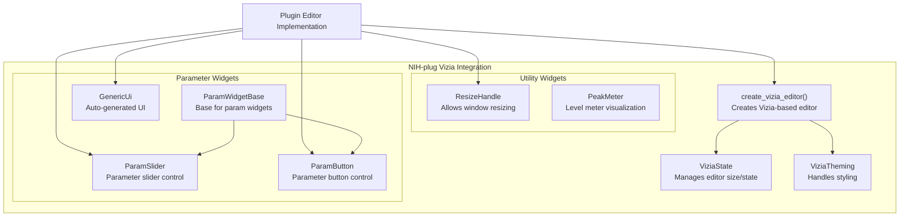
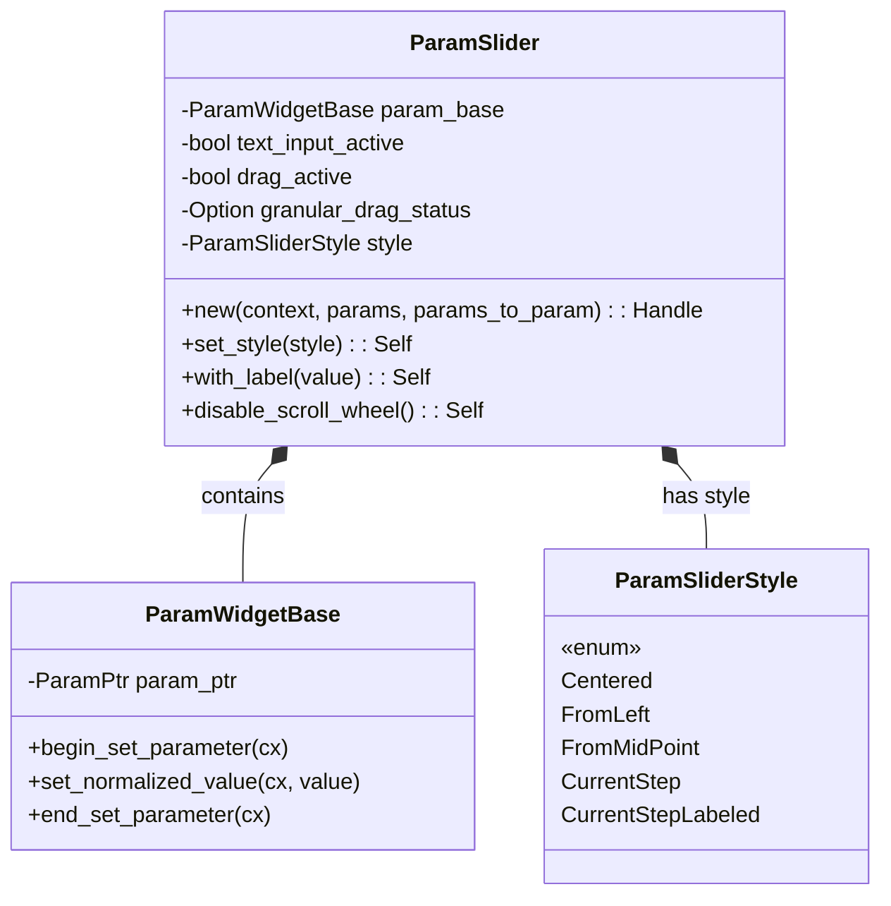

# Vizia Integration

> **Relevant source files**
> * [plugins/crisp/src/editor.rs](https://github.com/robbert-vdh/nih-plug/blob/28b149ec/plugins/crisp/src/editor.rs)
> * [plugins/diopser/src/editor.rs](https://github.com/robbert-vdh/nih-plug/blob/28b149ec/plugins/diopser/src/editor.rs)
> * [plugins/examples/gain_gui_vizia/src/editor.rs](https://github.com/robbert-vdh/nih-plug/blob/28b149ec/plugins/examples/gain_gui_vizia/src/editor.rs)
> * [plugins/spectral_compressor/src/editor.rs](https://github.com/robbert-vdh/nih-plug/blob/28b149ec/plugins/spectral_compressor/src/editor.rs)

This document explains how to create plugin user interfaces using the Vizia framework with NIH-plug. For information about using the Egui framework instead, see [Egui Integration](/robbert-vdh/nih-plug/4.1-editor-system-overview).

## Overview

Vizia is a declarative, reactive GUI framework for Rust that NIH-plug integrates with to enable plugin developers to create user interfaces. The integration provides widgets specifically designed to work with NIH-plug's parameter system, along with utilities for creating and managing plugin editors.



Sources: [nih_plug_vizia/src/widgets/param_base.rs](https://github.com/robbert-vdh/nih-plug/blob/28b149ec/nih_plug_vizia/src/widgets/param_base.rs)

 [nih_plug_vizia/src/widgets/param_slider.rs](https://github.com/robbert-vdh/nih-plug/blob/28b149ec/nih_plug_vizia/src/widgets/param_slider.rs)

 [nih_plug_vizia/src/widgets/param_button.rs](https://github.com/robbert-vdh/nih-plug/blob/28b149ec/nih_plug_vizia/src/widgets/param_button.rs)

## Creating a Vizia-based Editor

To implement a Vizia-based UI for your plugin, you need to define:

1. A data model for binding UI elements to your plugin state
2. A function to create the default editor state
3. A function to create the editor UI

### Data Model

The data model is a struct that contains your plugin parameters and any additional state you want to display:

```rust
#[derive(Lens)]
struct Data {
    params: Arc<MyPluginParams>,
    // Additional state, e.g., peak meters, analyzer data
}

impl Model for Data {}
```

### Editor State

The `ViziaState` defines the initial size and behavior of your UI:

```rust
pub(crate) fn default_state() -> Arc<ViziaState> {
    ViziaState::new(|| (400, 300)) // Width and height in pixels
}
```

### Editor Creation

Use the `create_vizia_editor` function to build your editor:

```rust
pub(crate) fn create(
    params: Arc<MyPluginParams>,
    editor_state: Arc<ViziaState>,
) -> Option<Box<dyn Editor>> {
    create_vizia_editor(editor_state, ViziaTheming::Default, move |cx, _| {
        // Build your data model
        Data { params: params.clone() }.build(cx);
        
        // Create your UI
        VStack::new(cx, |cx| {
            Label::new(cx, "My Plugin");
            ParamSlider::new(cx, Data::params, |params| &params.my_param);
        });
        
        // Add a resize handle
        ResizeHandle::new(cx);
    })
}
```

Sources: [plugins/examples/gain_gui_vizia/src/editor.rs L20-L67](https://github.com/robbert-vdh/nih-plug/blob/28b149ec/plugins/examples/gain_gui_vizia/src/editor.rs#L20-L67)

 [plugins/crisp/src/editor.rs L25-L75](https://github.com/robbert-vdh/nih-plug/blob/28b149ec/plugins/crisp/src/editor.rs#L25-L75)

## Parameter Widgets

NIH-plug's Vizia integration provides specialized widgets for interacting with parameters:

### ParamSlider

`ParamSlider` is for continuous or discrete numerical parameters, providing a slider interface:



Usage:

```yaml
ParamSlider::new(cx, Data::params, |params| &params.gain)
    .with_label("Gain") // Optional custom label
    .set_style(ParamSliderStyle::Centered); // Visual style
```

Features:

* Multiple visualization styles through `ParamSliderStyle`
* Shift+drag for fine-grained control
* Double-click or right-click to reset to default
* Alt+click for text value entry
* Mouse wheel support for stepping through values
* Automatic parameter modulation display
* Support for both continuous and discrete parameters

Sources: [nih_plug_vizia/src/widgets/param_slider.rs L82-L636](https://github.com/robbert-vdh/nih-plug/blob/28b149ec/nih_plug_vizia/src/widgets/param_slider.rs#L82-L636)

 [plugins/examples/gain_gui_vizia/src/editor.rs L49-L51](https://github.com/robbert-vdh/nih-plug/blob/28b149ec/plugins/examples/gain_gui_vizia/src/editor.rs#L49-L51)

### ParamButton

`ParamButton` is designed for boolean parameters, providing a toggleable button:

```yaml
ParamButton::new(cx, Data::params, |params| &params.bypass)
    .for_bypass() // Optional, adds bypass styling
    .with_label("Bypass"); // Optional custom label
```

Features:

* Click to toggle between on/off states
* Mouse wheel support
* Can be used for bypass buttons with special styling
* Custom labels

Sources: [nih_plug_vizia/src/widgets/param_button.rs L13-L150](https://github.com/robbert-vdh/nih-plug/blob/28b149ec/nih_plug_vizia/src/widgets/param_button.rs#L13-L150)

 [plugins/diopser/src/editor.rs L122-L124](https://github.com/robbert-vdh/nih-plug/blob/28b149ec/plugins/diopser/src/editor.rs#L122-L124)

## Layout System

Vizia provides a flexible layout system with various containers:

### Basic Layout Elements

* `VStack` - Vertical stack layout
* `HStack` - Horizontal stack layout
* `ZStack` - Z-ordered stack (elements on top of each other)

Example:

```yaml
VStack::new(cx, |cx| {
    Label::new(cx, "My Plugin")
        .font_size(30.0);
    
    HStack::new(cx, |cx| {
        Label::new(cx, "Gain");
        ParamSlider::new(cx, Data::params, |params| &params.gain);
    });
});
```

### Styling & Positioning

Elements can be positioned and styled using Vizia's properties:

```yaml
Label::new(cx, "My Plugin")
    .font_size(30.0)
    .height(Pixels(50.0))
    .child_top(Stretch(1.0))
    .child_bottom(Pixels(0.0));
```

You can also use CSS-like stylesheets:

```
cx.add_stylesheet(include_style!("src/editor/theme.css"))
```

Sources: [plugins/examples/gain_gui_vizia/src/editor.rs L40-L63](https://github.com/robbert-vdh/nih-plug/blob/28b149ec/plugins/examples/gain_gui_vizia/src/editor.rs#L40-L63)

 [plugins/diopser/src/editor.rs L71-L84](https://github.com/robbert-vdh/nih-plug/blob/28b149ec/plugins/diopser/src/editor.rs#L71-L84)

## Advanced Features

### Resizable UIs

Add a `ResizeHandle` to make your UI resizable:

```
ResizeHandle::new(cx);
```

### Generic UI

For quick prototyping, use `GenericUi` to automatically generate UI for all parameters:

```
GenericUi::new(cx, Data::params);
```

### Dynamic UI Elements

Create UI elements conditionally using Vizia's bindings:

```sql
Binding::new(cx, some_condition_lens, |cx, condition| {
    if condition.get(cx) {
        // Create UI elements conditionally
    }
});
```

### Custom Widgets

Create custom widgets by implementing custom Views and handling events:

```rust
struct MyCustomWidget {
    // Widget state
}

impl View for MyCustomWidget {
    fn element(&self) -> Option<&'static str> {
        Some("my-custom-widget")
    }
    
    fn event(&mut self, cx: &mut EventContext, event: &mut Event) {
        // Handle events
    }
}
```

Sources: [plugins/spectral_compressor/src/editor.rs L95-L102](https://github.com/robbert-vdh/nih-plug/blob/28b149ec/plugins/spectral_compressor/src/editor.rs#L95-L102)

 [plugins/diopser/src/editor.rs L30-L35](https://github.com/robbert-vdh/nih-plug/blob/28b149ec/plugins/diopser/src/editor.rs#L30-L35)

## Example Implementation

Here's a complete example of a basic gain plugin UI:

```rust
// Define the data model
#[derive(Lens)]
struct Data {
    params: Arc<GainParams>,
    peak_meter: Arc<AtomicF32>,
}

impl Model for Data {}

// Create the default state
pub(crate) fn default_state() -> Arc<ViziaState> {
    ViziaState::new(|| (200, 150))
}

// Create the editor
pub(crate) fn create(
    params: Arc<GainParams>,
    peak_meter: Arc<AtomicF32>,
    editor_state: Arc<ViziaState>,
) -> Option<Box<dyn Editor>> {
    create_vizia_editor(editor_state, ViziaTheming::Custom, move |cx, _| {
        // Register fonts
        assets::register_noto_sans_light(cx);
        
        // Build data model
        Data {
            params: params.clone(),
            peak_meter: peak_meter.clone(),
        }
        .build(cx);
        
        // Create UI
        VStack::new(cx, |cx| {
            Label::new(cx, "Gain GUI")
                .font_family(vec![FamilyOwned::Name(String::from(assets::NOTO_SANS))])
                .font_size(30.0);
                
            Label::new(cx, "Gain");
            ParamSlider::new(cx, Data::params, |params| &params.gain);
            
            PeakMeter::new(cx, Data::peak_meter.map(|pm| util::gain_to_db(pm.load(Ordering::Relaxed))))
                .top(Pixels(10.0));
        })
        .child_left(Stretch(1.0))
        .child_right(Stretch(1.0));
        
        // Add resize handle
        ResizeHandle::new(cx);
    })
}
```

Sources: [plugins/examples/gain_gui_vizia/src/editor.rs L12-L67](https://github.com/robbert-vdh/nih-plug/blob/28b149ec/plugins/examples/gain_gui_vizia/src/editor.rs#L12-L67)

## Real-World Examples

NIH-plug includes several plugins with Vizia-based UIs:

1. **Gain GUI** - A simple gain plugin with slider and meter
2. **Diopser** - A phase rotation plugin with a spectrum analyzer and XY pad
3. **Spectral Compressor** - An FFT-based compressor with complex UI and analyzer
4. **Crisp** - A distortion plugin with scrollable parameter list

Exploring these examples is highly recommended for learning how to implement more complex user interfaces with Vizia.

Sources: [plugins/examples/gain_gui_vizia/src/editor.rs](https://github.com/robbert-vdh/nih-plug/blob/28b149ec/plugins/examples/gain_gui_vizia/src/editor.rs)

 [plugins/diopser/src/editor.rs](https://github.com/robbert-vdh/nih-plug/blob/28b149ec/plugins/diopser/src/editor.rs)

 [plugins/spectral_compressor/src/editor.rs](https://github.com/robbert-vdh/nih-plug/blob/28b149ec/plugins/spectral_compressor/src/editor.rs)

 [plugins/crisp/src/editor.rs](https://github.com/robbert-vdh/nih-plug/blob/28b149ec/plugins/crisp/src/editor.rs)