# Wrapper Utilities

> **Relevant source files**
> * [CHANGELOG.md](https://github.com/robbert-vdh/nih-plug/blob/28b149ec/CHANGELOG.md)
> * [src/wrapper/util.rs](https://github.com/robbert-vdh/nih-plug/blob/28b149ec/src/wrapper/util.rs)
> * [src/wrapper/util/buffer_management.rs](https://github.com/robbert-vdh/nih-plug/blob/28b149ec/src/wrapper/util/buffer_management.rs)
> * [src/wrapper/vst3/factory.rs](https://github.com/robbert-vdh/nih-plug/blob/28b149ec/src/wrapper/vst3/factory.rs)
> * [src/wrapper/vst3/view.rs](https://github.com/robbert-vdh/nih-plug/blob/28b149ec/src/wrapper/vst3/view.rs)

## Purpose and Scope

This page documents shared utilities used by all wrapper implementations (VST3, CLAP, standalone) in NIH-plug. These utilities handle common concerns across plugin formats including parameter hashing, buffer management, realtime safety, logging, and CPU feature setup. The utilities are primarily located in [src/wrapper/util.rs](https://github.com/robbert-vdh/nih-plug/blob/28b149ec/src/wrapper/util.rs)

 and its submodules.

For wrapper-specific implementations, see [VST3 Wrapper](/robbert-vdh/nih-plug/3.1-vst3-wrapper), [CLAP Wrapper](/robbert-vdh/nih-plug/3.2-clap-wrapper), and [Standalone Wrapper](/robbert-vdh/nih-plug/3.3-standalone-wrapper). For the buffer abstractions exposed to plugins, see [Audio Buffer System](/robbert-vdh/nih-plug/2.3-audio-buffer-system).

---

## Utility Module Organization

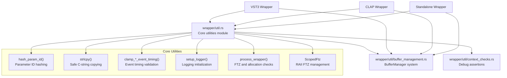

**Sources:** [src/wrapper/util.rs L1-L314](https://github.com/robbert-vdh/nih-plug/blob/28b149ec/src/wrapper/util.rs#L1-L314)

 [src/wrapper/util/buffer_management.rs L1-L505](https://github.com/robbert-vdh/nih-plug/blob/28b149ec/src/wrapper/util/buffer_management.rs#L1-L505)

---

## Parameter ID Hashing

VST3 and other plugin formats use numeric parameter identifiers rather than strings. The `hash_param_id()` function converts NIH-plug's string-based parameter IDs to 32-bit hashes using a Rabin fingerprint algorithm.

### Implementation Details

| Aspect | Detail |
| --- | --- |
| **Function** | `hash_param_id(id: &str) -> u32` |
| **Algorithm** | Rabin fingerprint: `hash = hash * 31 + byte` |
| **VST3 Constraint** | Bit 31 reserved for host parameters, masked out |
| **Location** | [src/wrapper/util.rs L40-L51](https://github.com/robbert-vdh/nih-plug/blob/28b149ec/src/wrapper/util.rs#L40-L51) |

The hash function iterates through each byte of the parameter ID string, multiplying the running hash by 31 and adding the byte value. This produces a deterministic hash that remains consistent across plugin sessions.

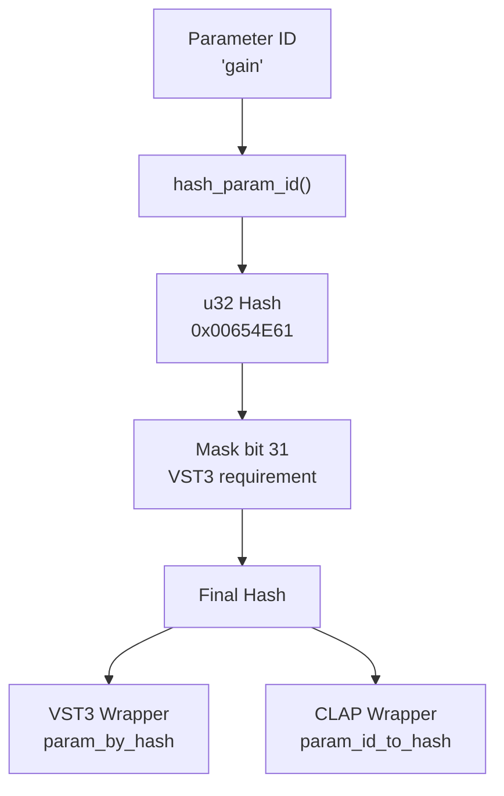

**Sources:** [src/wrapper/util.rs L40-L51](https://github.com/robbert-vdh/nih-plug/blob/28b149ec/src/wrapper/util.rs#L40-L51)

---

## String Utilities

### strlcpy Function

The `strlcpy()` function safely copies Rust strings to C-style null-terminated character arrays, preventing buffer overflows. This is essential for communicating with C-based plugin APIs like VST3.

| Parameter | Type | Purpose |
| --- | --- | --- |
| `dest` | `&mut [c_char]` | Destination C-string buffer |
| `src` | `&str` | Source Rust string |

**Key behaviors:**

* Always null-terminates the destination buffer
* Truncates if source exceeds destination capacity
* Handles platform differences (`c_char` is `i8` on x86, `u8` on AArch64)

**Sources:** [src/wrapper/util.rs L53-L70](https://github.com/robbert-vdh/nih-plug/blob/28b149ec/src/wrapper/util.rs#L53-L70)

 [src/wrapper/util.rs L293-L312](https://github.com/robbert-vdh/nih-plug/blob/28b149ec/src/wrapper/util.rs#L293-L312)

---

## Event Timing Validation

Two functions validate and clamp event timings to ensure they fall within buffer boundaries:

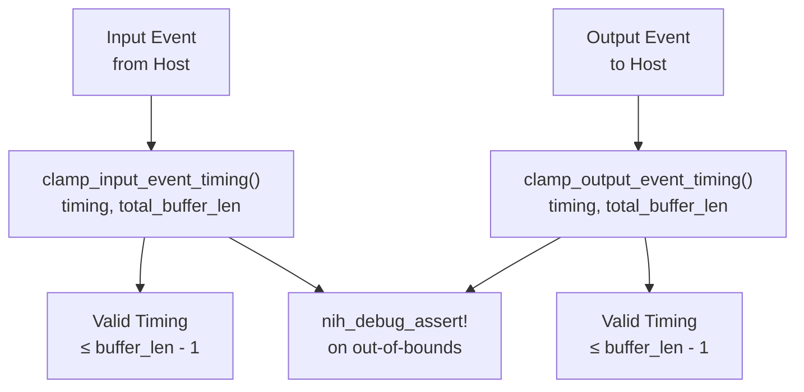

Both functions:

* Accept timing as `u32` and buffer length
* Return clamped timing value (min of timing and last valid index)
* Emit debug assertions on out-of-bounds values
* Handle edge case where `total_buffer_len == 0`

**Sources:** [src/wrapper/util.rs L72-L99](https://github.com/robbert-vdh/nih-plug/blob/28b149ec/src/wrapper/util.rs#L72-L99)

---

## Logging System

### setup_logger Function

The `setup_logger()` function initializes NIH-plug's logging infrastructure using [nih-log](https://github.com/robbert-vdh/nih-plug/blob/28b149ec/nih-log)

 which routes logs to platform-appropriate destinations.

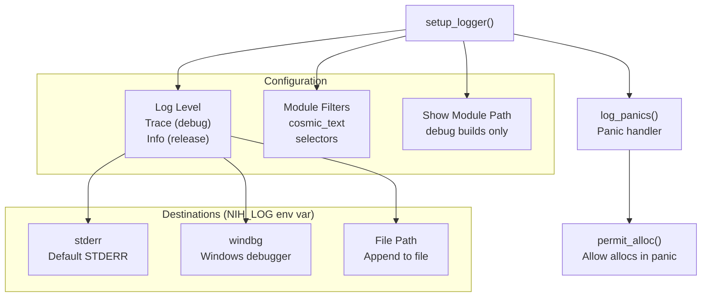

**Environment variable control:**

* `NIH_LOG=stderr` - Force STDERR output
* `NIH_LOG=windbg` - Windows debugger output (Windows only)
* `NIH_LOG=/path/to/file.log` - Append to specified file

**Panic handling:** The `log_panics()` helper registers a panic hook that logs panics with backtraces, wrapped in `permit_alloc()` to avoid triggering allocation assertions.

**Sources:** [src/wrapper/util.rs L101-L184](https://github.com/robbert-vdh/nih-plug/blob/28b149ec/src/wrapper/util.rs#L101-L184)

---

## Process Wrapper and FTZ Management

### process_wrapper Function

The `process_wrapper()` function wraps the entire audio processing callback to ensure proper CPU state and allocation checking:

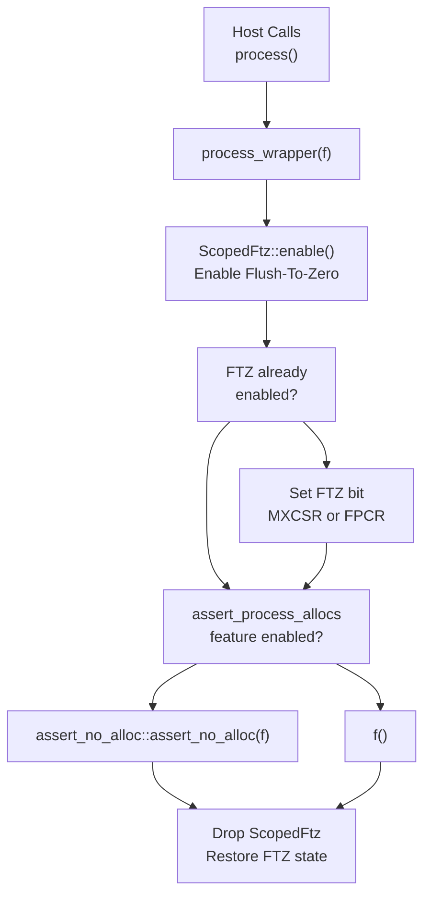

**Sources:** [src/wrapper/util.rs L186-L200](https://github.com/robbert-vdh/nih-plug/blob/28b149ec/src/wrapper/util.rs#L186-L200)

### ScopedFtz RAII Guard

The `ScopedFtz` struct manages the CPU's Flush-To-Zero (FTZ) flag using RAII. FTZ treats denormal floating-point numbers as zero, preventing performance degradation during audio processing.

#### Platform-Specific Implementation

| Platform | Register | Bit | Assembly |
| --- | --- | --- | --- |
| **x86/x86_64 (SSE)** | MXCSR | Bit 15 | `stmxcsr`, `ldmxcsr` |
| **AArch64** | FPCR | Bit 24 | `mrs`, `msr` |
| **Other** | N/A | N/A | No-op |

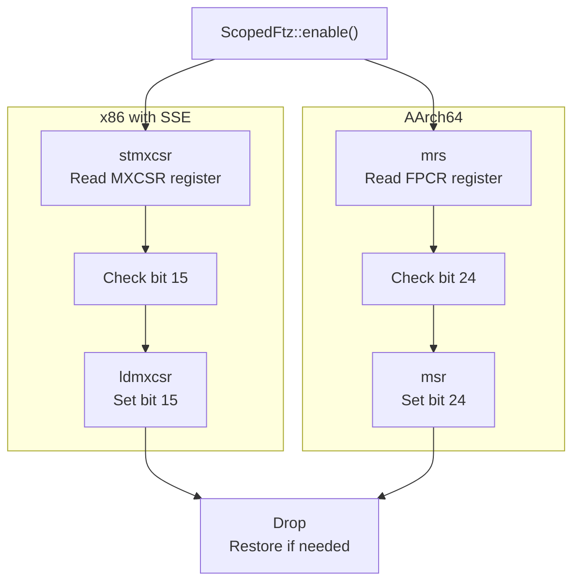

**Key characteristics:**

* Non-`Send`/`Sync` - affects current thread only
* Reads current FTZ state before modifying
* Restores original state on drop (if it was disabled)
* No-op when running under Miri

**Sources:** [src/wrapper/util.rs L12-L26](https://github.com/robbert-vdh/nih-plug/blob/28b149ec/src/wrapper/util.rs#L12-L26)

 [src/wrapper/util.rs L202-L284](https://github.com/robbert-vdh/nih-plug/blob/28b149ec/src/wrapper/util.rs#L202-L284)

### Allocation Checking

When the `assert_process_allocs` feature is enabled in debug builds, the `process_wrapper()` uses the [assert-no-alloc](https://github.com/robbert-vdh/nih-plug/blob/28b149ec/assert-no-alloc)

 crate to panic if any allocations occur during processing.

**Limitations:**

* Does not work with `x86_64-pc-windows-gnu` target (compile error)
* Only active in debug builds with feature flag

**Sources:** [src/wrapper/util.rs L28-L37](https://github.com/robbert-vdh/nih-plug/blob/28b149ec/src/wrapper/util.rs#L28-L37)

 [src/wrapper/util.rs L194-L199](https://github.com/robbert-vdh/nih-plug/blob/28b149ec/src/wrapper/util.rs#L194-L199)

---

## Buffer Management System

The buffer management system provides a safe, allocation-free way to create plugin `Buffer` instances from host-provided raw pointers. This logic is shared across all wrappers.

### Core Components

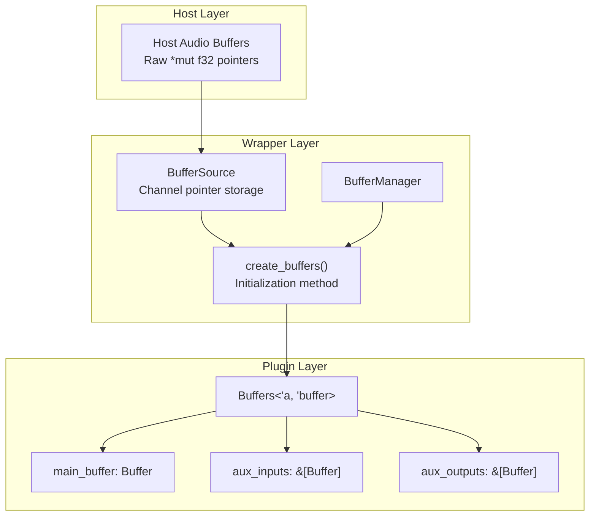

**Sources:** [src/wrapper/util/buffer_management.rs L1-L505](https://github.com/robbert-vdh/nih-plug/blob/28b149ec/src/wrapper/util/buffer_management.rs#L1-L505)

### BufferManager Structure

The `BufferManager` maintains all buffer storage and handles the complexity of:

* **In-place processing** - Detecting when input/output buffers are the same
* **Channel count mismatches** - Handling more outputs than inputs
* **Missing buffers** - Gracefully handling null or absent buffer pointers
* **Auxiliary buffers** - Managing sidechain inputs and auxiliary outputs

#### Storage Layout

| Field | Type | Purpose |
| --- | --- | --- |
| `main_buffer` | `Buffer<'static>` | Main in-place processing buffer |
| `aux_input_buffers` | `Vec<Buffer<'static>>` | Auxiliary input buffers |
| `aux_input_storage` | `Vec<Vec<Vec<f32>>>` | Backing storage for aux inputs |
| `aux_output_buffers` | `Vec<Buffer<'static>>` | Auxiliary output buffers |
| `*_channel_pointers` | `Option<ChannelPointers>` | Host-provided pointers |

The `'static` lifetime is used internally for storage but shrunk to actual lifetimes when returning buffers.

**Sources:** [src/wrapper/util/buffer_management.rs L22-L45](https://github.com/robbert-vdh/nih-plug/blob/28b149ec/src/wrapper/util/buffer_management.rs#L22-L45)

### ChannelPointers Structure

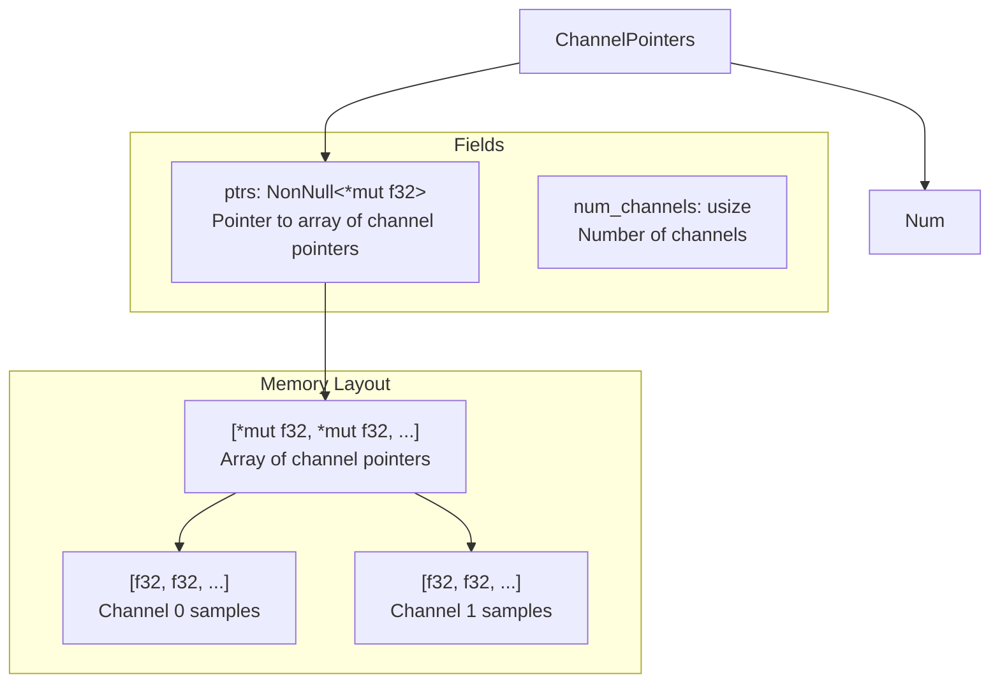

**Sources:** [src/wrapper/util/buffer_management.rs L62-L71](https://github.com/robbert-vdh/nih-plug/blob/28b149ec/src/wrapper/util/buffer_management.rs#L62-L71)

### Buffer Creation Flow

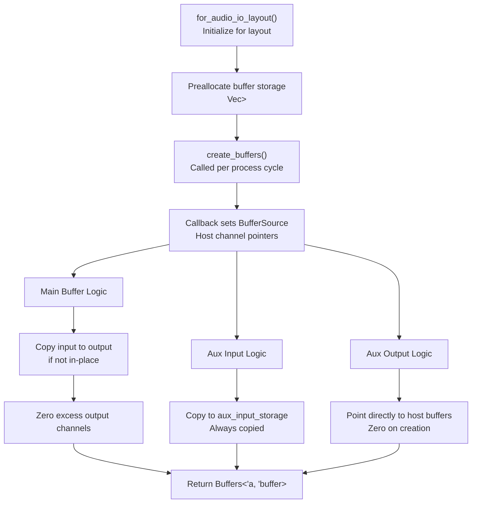

**Sources:** [src/wrapper/util/buffer_management.rs L76-L147](https://github.com/robbert-vdh/nih-plug/blob/28b149ec/src/wrapper/util/buffer_management.rs#L76-L147)

 [src/wrapper/util/buffer_management.rs L167-L374](https://github.com/robbert-vdh/nih-plug/blob/28b149ec/src/wrapper/util/buffer_management.rs#L167-L374)

### In-Place Processing Detection

The buffer manager detects whether the host provides the same pointer for input and output (in-place processing):

```python
// Pseudo-code from buffer_management.rs:237-242
if input_channel_pointer != output_channel_pointer {
    output_slice.copy_from_slice(input_slice)
    // Host uses separate buffers, copy required
}
// else: Already in-place, no copy needed
```

This optimization avoids unnecessary memory copies when the host already provides shared buffers.

**Sources:** [src/wrapper/util/buffer_management.rs L219-L255](https://github.com/robbert-vdh/nih-plug/blob/28b149ec/src/wrapper/util/buffer_management.rs#L219-L255)

### Auxiliary Input Handling

Auxiliary inputs (e.g., sidechain) are **always copied** to internal storage vectors because:

1. NIH-plug's `Buffer` API expects mutable access
2. The host may reuse input buffers across plugins
3. Copying ensures the plugin can safely modify auxiliary inputs

**Sources:** [src/wrapper/util/buffer_management.rs L256-L317](https://github.com/robbert-vdh/nih-plug/blob/28b149ec/src/wrapper/util/buffer_management.rs#L256-L317)

### Sample-Accurate Automation Support

The `create_buffers()` method accepts `sample_offset` and `num_samples` parameters to slice buffers for sample-accurate parameter automation:

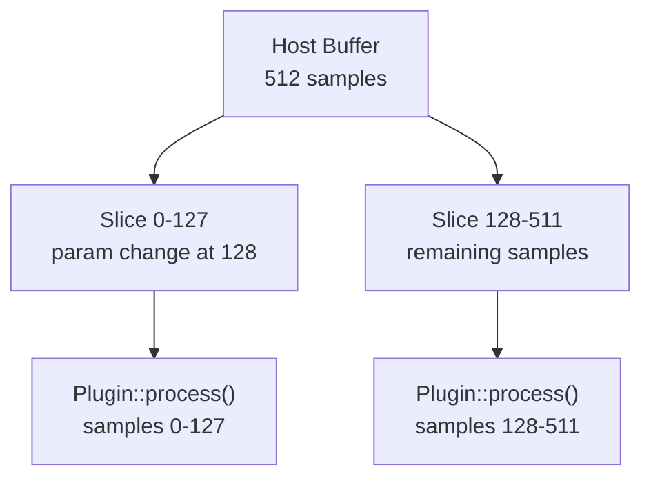

This allows wrappers to split buffers at parameter change boundaries when `Plugin::SAMPLE_ACCURATE_AUTOMATION` is enabled.

**Sources:** [src/wrapper/util/buffer_management.rs L155-L172](https://github.com/robbert-vdh/nih-plug/blob/28b149ec/src/wrapper/util/buffer_management.rs#L155-L172)

---

## Debug Assertions and Context Checks

The `wrapper/util/context_checks.rs` module (conditionally compiled only in debug builds) provides runtime validation of `GuiContext` method usage to catch common mistakes.

**Common validation scenarios:**

* Detecting incorrect parameter access during process callbacks
* Ensuring GUI-only methods aren't called from audio thread
* Validating proper context lifetime usage

This module is only compiled when `cfg(debug_assertions)` is true and helps catch wrapper API misuse during development.

**Sources:** [src/wrapper/util.rs L9-L10](https://github.com/robbert-vdh/nih-plug/blob/28b149ec/src/wrapper/util.rs#L9-L10)

---

## Integration with Wrappers

All three wrapper implementations use these utilities in consistent patterns:

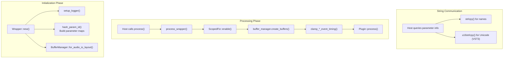

**Sources:** [src/wrapper/util.rs L1-L314](https://github.com/robbert-vdh/nih-plug/blob/28b149ec/src/wrapper/util.rs#L1-L314)

 [src/wrapper/util/buffer_management.rs L1-L505](https://github.com/robbert-vdh/nih-plug/blob/28b149ec/src/wrapper/util/buffer_management.rs#L1-L505)

---

## Summary Table

| Utility | Purpose | Key Characteristics |
| --- | --- | --- |
| **hash_param_id()** | Convert string IDs to numeric hashes | Rabin fingerprint, VST3 bit 31 mask |
| **strlcpy()** | Safe C-string copying | Null-terminated, overflow-safe |
| **clamp_*_event_timing()** | Validate event sample positions | Debug assertions, clamps to buffer |
| **setup_logger()** | Initialize logging system | Platform-aware, panic hooks |
| **process_wrapper()** | Wrap process callback | FTZ + allocation checking |
| **ScopedFtz** | Manage FTZ CPU flag | RAII, platform-specific assembly |
| **BufferManager** | Safe buffer creation | In-place detection, aux buffers |
| **ChannelPointers** | Raw pointer abstraction | Null-safe, channel count aware |

These utilities form the foundation that allows NIH-plug wrappers to present a safe, idiomatic Rust API to plugin developers while interfacing with C-based plugin APIs.