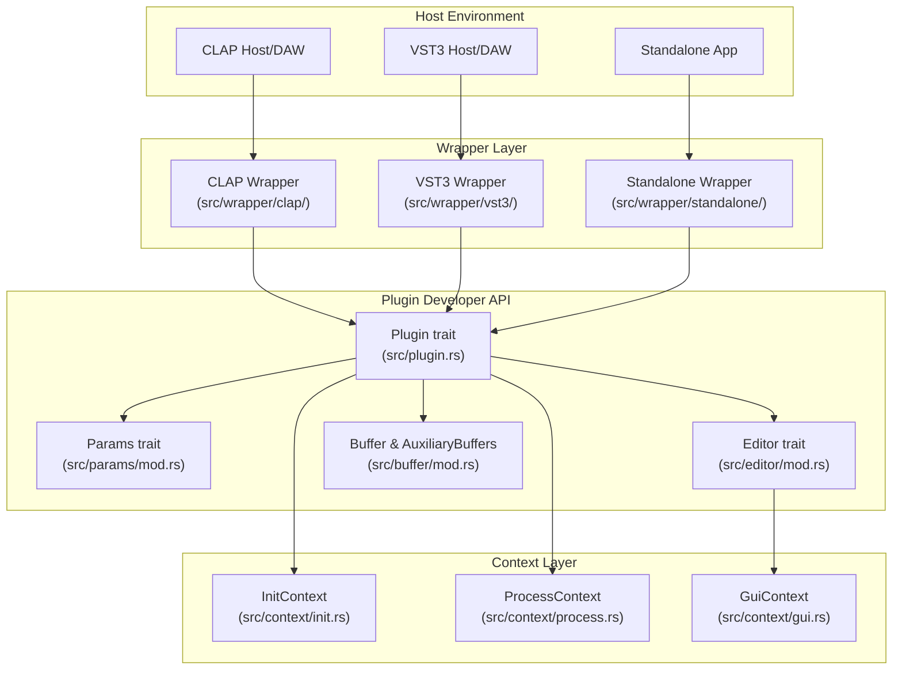
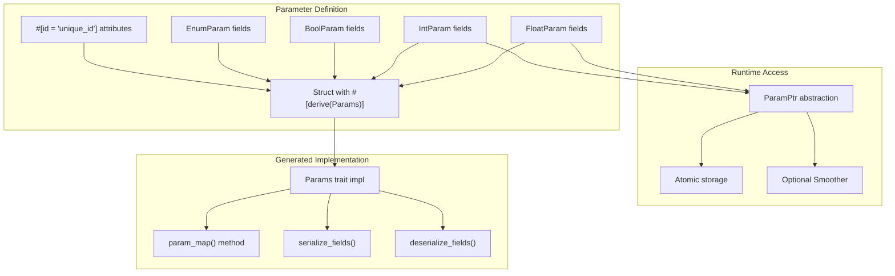
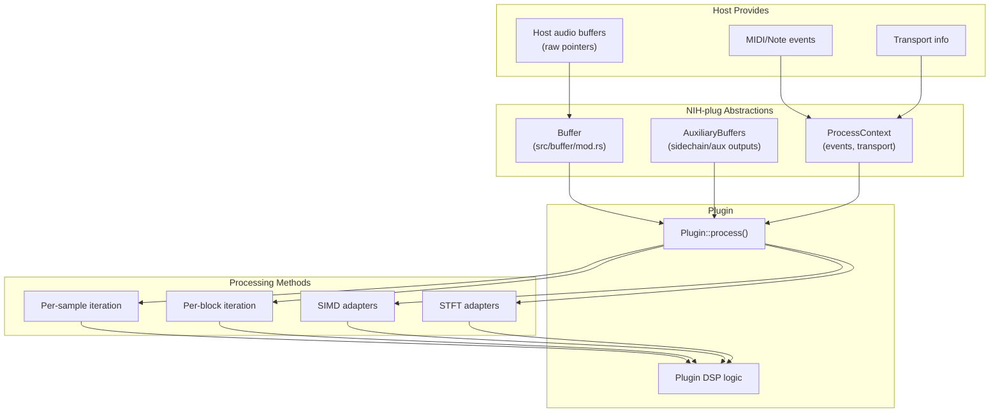
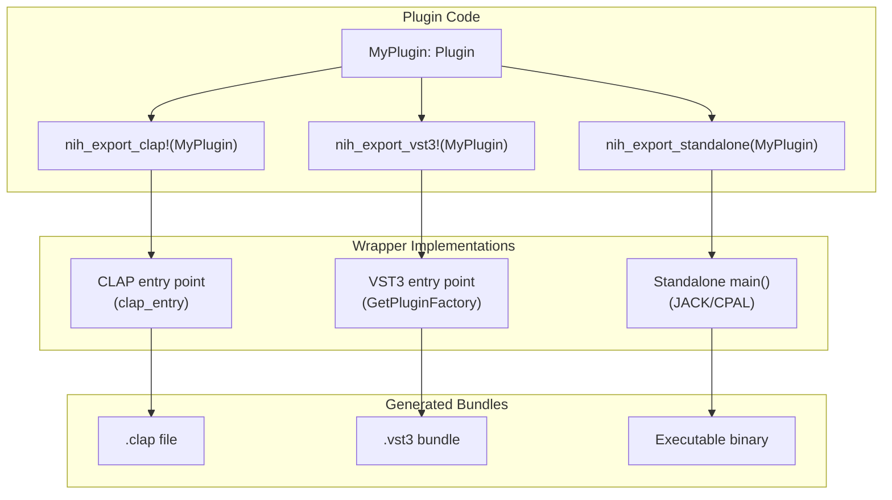
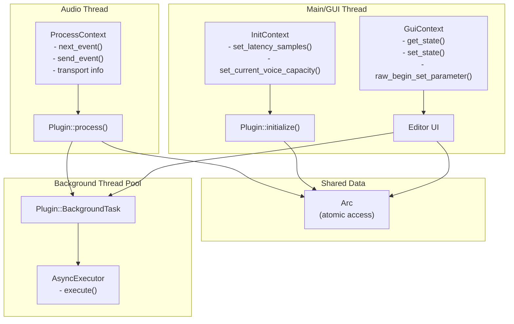

# Overview

> **Relevant source files**
> * [Cargo.lock](https://github.com/robbert-vdh/nih-plug/blob/28b149ec/Cargo.lock)
> * [Cargo.toml](https://github.com/robbert-vdh/nih-plug/blob/28b149ec/Cargo.toml)
> * [README.md](https://github.com/robbert-vdh/nih-plug/blob/28b149ec/README.md)
> * [src/lib.rs](https://github.com/robbert-vdh/nih-plug/blob/28b149ec/src/lib.rs)
> * [src/plugin.rs](https://github.com/robbert-vdh/nih-plug/blob/28b149ec/src/plugin.rs)

NIH-plug is an API-agnostic audio plugin framework written in Rust that provides a stateful yet simple plugin API. The framework eliminates unnecessary boilerplate through declarative parameter definitions while maintaining minimal "magic" and allowing developers to experiment with different approaches. This page introduces the framework's purpose, design philosophy, and core abstractions.

For information about setting up a NIH-plug project and configuring dependencies, see [Installation and Setup](/robbert-vdh/nih-plug/1.1-installation-and-setup). For details about the workspace structure and how the various crates relate to each other, see [Project Structure](/robbert-vdh/nih-plug/1.2-project-structure). For information about building and distributing plugins, see [Build System and Bundling](/robbert-vdh/nih-plug/1.3-build-system-and-bundling).

**Sources:** [README.md L1-L12](https://github.com/robbert-vdh/nih-plug/blob/28b149ec/README.md#L1-L12)

 [src/lib.rs L1-L83](https://github.com/robbert-vdh/nih-plug/blob/28b149ec/src/lib.rs#L1-L83)

---

## What is NIH-plug?

NIH-plug is a framework that enables developers to write audio plugins once and export them to multiple plugin formats (VST3, CLAP, standalone) without format-specific code. The framework handles all plugin format translation through wrapper layers, allowing plugin developers to focus on DSP and parameter management using a unified Rust API.

The framework is designed around several core principles:

* **API-agnostic design**: Write plugin logic once, export to VST3, CLAP, and standalone formats using simple macros
* **Declarative parameters**: Define parameters using derive macros with automatic host integration
* **Stateful architecture**: Similar to JUCE's approach but without boilerplate
* **Type-safe and realtime-safe**: Leverage Rust's type system for compile-time guarantees about thread safety and realtime constraints
* **Minimal ceremony**: Framework functionality is accessed through well-defined traits and context objects

**Sources:** [README.md L7-L12](https://github.com/robbert-vdh/nih-plug/blob/28b149ec/README.md#L7-L12)

 [Cargo.toml L1-L12](https://github.com/robbert-vdh/nih-plug/blob/28b149ec/Cargo.toml#L1-L12)

 [src/plugin.rs L20-L57](https://github.com/robbert-vdh/nih-plug/blob/28b149ec/src/plugin.rs#L20-L57)

---

## Core Architecture

The following diagram shows the primary architectural components and how they relate:

**NIH-plug Core Architecture**

The architecture consists of three distinct layers:

1. **Plugin Developer API**: Traits that plugin developers implement (`Plugin`, `Params`, `Editor`)
2. **Context Layer**: Objects passed to plugin methods providing host interaction capabilities
3. **Wrapper Layer**: Format-specific implementations that translate between the generic API and host requirements

**Sources:** [src/plugin.rs L20-L57](https://github.com/robbert-vdh/nih-plug/blob/28b149ec/src/plugin.rs#L20-L57)

 [src/lib.rs L21-L32](https://github.com/robbert-vdh/nih-plug/blob/28b149ec/src/lib.rs#L21-L32)

 [Cargo.toml L13-L47](https://github.com/robbert-vdh/nih-plug/blob/28b149ec/Cargo.toml#L13-L47)

---

## The Plugin Trait

The `Plugin` trait is the central abstraction in NIH-plug. It defines both compile-time constants describing the plugin's capabilities and runtime methods for the plugin's lifecycle.

**Plugin Trait Structure**

```mermaid
flowchart TD

NAME["NAME: &'static str"]
VENDOR["VENDOR: &'static str"]
VERSION["VERSION: &'static str"]
AUDIO_IO["AUDIO_IO_LAYOUTS"]
MIDI["MIDI_INPUT/OUTPUT"]
SAMPLE_ACC["SAMPLE_ACCURATE_AUTOMATION"]
Params["params() -> Arc"]
Initialize["initialize(layout, config, ctx)"]
Reset["reset()"]
Process["process(buffer, aux, ctx)"]
Editor["editor() -> Option"]
SysEx["SysExMessage"]
BgTask["BackgroundTask"]
PluginImpl["Plugin Implementation"]

NAME --> PluginImpl
VENDOR --> PluginImpl
VERSION --> PluginImpl
AUDIO_IO --> PluginImpl
MIDI --> PluginImpl
SAMPLE_ACC --> PluginImpl
Params --> PluginImpl
Initialize --> PluginImpl
Reset --> PluginImpl
Process --> PluginImpl
Editor --> PluginImpl
SysEx --> PluginImpl
BgTask --> PluginImpl

subgraph subGraph2 ["Plugin Associated Types"]
    SysEx
    BgTask
end

subgraph subGraph1 ["Plugin Methods"]
    Params
    Initialize
    Reset
    Process
    Editor
end

subgraph subGraph0 ["Plugin Constants"]
    NAME
    VENDOR
    VERSION
    AUDIO_IO
    MIDI
    SAMPLE_ACC
end
```

The `Plugin` trait divides plugin functionality into three categories:

**Compile-Time Constants**: Static plugin metadata and capabilities defined as associated constants:

* `NAME`, `VENDOR`, `VERSION`, `URL`, `EMAIL`: Plugin identification
* `AUDIO_IO_LAYOUTS`: Supported audio input/output configurations
* `MIDI_INPUT`, `MIDI_OUTPUT`: MIDI and note event support via `MidiConfig`
* `SAMPLE_ACCURATE_AUTOMATION`: Whether to split processing at parameter changes
* `HARD_REALTIME_ONLY`: Whether the plugin requires hard realtime processing

**Lifecycle Methods**: Functions called by the host at specific points:

* `params()`: Returns the parameter hierarchy (called once at instantiation)
* `editor()`: Returns the GUI interface if any (called once at instantiation)
* `initialize()`: Allocates resources based on buffer config and audio layout
* `reset()`: Clears runtime state like filters and envelopes (realtime-safe)
* `process()`: Processes audio buffers (the main DSP callback)
* `deactivate()`: Deallocates resources when plugin is deactivated

**Associated Types**: Type parameters for extensibility:

* `SysExMessage`: Custom type for MIDI SysEx messages
* `BackgroundTask`: Type-safe background task dispatch system

**Sources:** [src/plugin.rs L59-L272](https://github.com/robbert-vdh/nih-plug/blob/28b149ec/src/plugin.rs#L59-L272)

 [src/lib.rs L21-L40](https://github.com/robbert-vdh/nih-plug/blob/28b149ec/src/lib.rs#L21-L40)

---

## Parameter System Overview

NIH-plug uses a declarative parameter system where parameters are defined as struct fields with derive macros. The framework automatically handles parameter enumeration, serialization, host integration, and GUI updates.

**Parameter System Components**

Parameters in NIH-plug work as follows:

1. **Declaration**: Plugin defines a struct with parameter fields (`FloatParam`, `IntParam`, `BoolParam`, `EnumParam<T>`)
2. **Attribution**: Each parameter field has an `#[id = "..."]` attribute providing a stable identifier
3. **Derivation**: The `#[derive(Params)]` macro generates the `Params` trait implementation
4. **Hash Mapping**: Parameters are indexed by hash of their ID for O(1) access during processing
5. **Atomic Access**: Parameter values are stored atomically for lock-free reading from multiple threads
6. **Optional Smoothing**: Parameters can use smoothers to interpolate value changes and prevent audio artifacts

The `Params` trait provides methods for parameter enumeration, serialization, and persistence. Nested parameter groups are supported via `#[nested]` attributes.

**Sources:** [src/plugin.rs L147-L152](https://github.com/robbert-vdh/nih-plug/blob/28b149ec/src/plugin.rs#L147-L152)

 [README.md L97-L119](https://github.com/robbert-vdh/nih-plug/blob/28b149ec/README.md#L97-L119)

 [src/lib.rs L67-L77](https://github.com/robbert-vdh/nih-plug/blob/28b149ec/src/lib.rs#L67-L77)

---

## Audio Processing Model

NIH-plug provides abstractions for audio processing that don't impose specific DSP patterns while offering convenient utilities.

**Audio Processing Data Flow**

The processing model consists of:

1. **Buffer Abstraction**: `Buffer` wraps host audio buffers providing safe access patterns * Supports in-place processing (most hosts) and separate I/O buffers * Multiple iteration patterns: per-sample-per-channel, per-block-per-channel, per-block-per-sample-per-channel * Optional SIMD adapters for vectorized processing (requires nightly Rust)
2. **Auxiliary Buffers**: `AuxiliaryBuffers` provides access to sidechain inputs and auxiliary outputs
3. **Process Context**: `ProcessContext` provides: * Transport information (tempo, position, playing state) * Note/MIDI event iteration via `next_event()` * Output event generation via `send_event()` * Parameter change scheduling
4. **Sample-Accurate Automation**: When `Plugin::SAMPLE_ACCURATE_AUTOMATION` is `true`, the wrapper splits buffers at parameter change boundaries for precise automation

**Sources:** [src/plugin.rs L218-L244](https://github.com/robbert-vdh/nih-plug/blob/28b149ec/src/plugin.rs#L218-L244)

 [src/lib.rs L55-L62](https://github.com/robbert-vdh/nih-plug/blob/28b149ec/src/lib.rs#L55-L62)

 [README.md L123-L132](https://github.com/robbert-vdh/nih-plug/blob/28b149ec/README.md#L123-L132)

---

## Plugin Format Wrappers

NIH-plug translates the generic `Plugin` API into format-specific implementations through wrapper layers. Plugins are exported to specific formats using macros.

**Export Macros and Wrappers**

The wrapper system operates as follows:

1. **Export Macros**: Plugins use `nih_export_clap!()` and/or `nih_export_vst3!()` macros to expose format-specific entry points
2. **Wrapper Translation**: Each wrapper implements the format's API by delegating to `Plugin` trait methods
3. **Bundle Generation**: The `cargo xtask bundle` command detects export macros and creates appropriate bundles

**CLAP Wrapper** (`src/wrapper/clap/`):

* Implements CLAP 1.2.2 specification via `clap-sys`
* Provides extensions for params, state, latency, note ports, remote controls, voice info
* Modern event handling with polyphonic modulation support

**VST3 Wrapper** (`src/wrapper/vst3/`):

* Implements VST3 via `vst3-sys` (GPLv3 licensed)
* COM interface implementation via `Factory` struct
* Full parameter automation and MIDI support

**Standalone Wrapper** (`src/wrapper/standalone/`):

* Requires `standalone` feature flag
* JACK and CPAL audio backend support
* CLI configuration for audio/MIDI settings

**Sources:** [src/plugin.rs L11-L13](https://github.com/robbert-vdh/nih-plug/blob/28b149ec/src/plugin.rs#L11-L13)

 [Cargo.toml L49-L65](https://github.com/robbert-vdh/nih-plug/blob/28b149ec/Cargo.toml#L49-L65)

 [README.md L183-L191](https://github.com/robbert-vdh/nih-plug/blob/28b149ec/README.md#L183-L191)

 [src/lib.rs L119-L121](https://github.com/robbert-vdh/nih-plug/blob/28b149ec/src/lib.rs#L119-L121)

---

## Threading Model and Context Objects

NIH-plug provides thread-safe access to plugin functionality through context objects passed to lifecycle methods. This design allows safe communication between the audio thread, GUI thread, and background threads without requiring the plugin to manage synchronization primitives.

**Context Objects by Thread**

The context system provides:

**InitContext** (main thread, during initialization):

* `set_latency_samples()`: Report plugin latency to host
* `set_current_voice_capacity()`: Report voice count for polyphonic plugins

**ProcessContext** (audio thread, during processing):

* `next_event()`: Iterate over incoming note/MIDI events
* `send_event()`: Send output events to host
* `transport()`: Access transport info (tempo, position, playing state)

**GuiContext** (GUI thread, from editor):

* `get_state()`, `set_state()`: Load/save plugin state
* `raw_begin_set_parameter()`, `raw_end_set_parameter()`: Modify parameters
* Parameter changes are queued and applied by audio thread

**AsyncExecutor** (background threads):

* Executes `Plugin::BackgroundTask` types asynchronously
* Used for long-running operations like file I/O without blocking audio

All contexts access parameters through `Arc<dyn Params>` which uses atomic operations for lock-free reading across threads.

**Sources:** [src/plugin.rs L15-L18](https://github.com/robbert-vdh/nih-plug/blob/28b149ec/src/plugin.rs#L15-L18)

 [src/plugin.rs L135-L145](https://github.com/robbert-vdh/nih-plug/blob/28b149ec/src/plugin.rs#L135-L145)

 [src/context/](https://github.com/robbert-vdh/nih-plug/blob/28b149ec/src/context/)

---

## Feature Flags

NIH-plug uses Cargo feature flags to enable optional functionality and manage licensing requirements.

| Feature | Default | Description |
| --- | --- | --- |
| `vst3` | ✓ | Enable VST3 export via `nih_export_vst3!()`. **GPLv3 licensed** due to `vst3-sys` dependency. |
| `standalone` | ✗ | Enable standalone binary export via `nih_export_standalone()`. Adds audio I/O dependencies (JACK, CPAL). |
| `assert_process_allocs` | ✗ | Abort on allocations in `process()` during debug builds for realtime safety validation. |
| `simd` | ✗ | Enable SIMD buffer adapters. **Requires nightly Rust compiler**. |
| `zstd` | ✗ | Compress plugin state using Zstandard algorithm. Loading uncompressed state remains supported. |
| `docs` | ✗ | Enable `doc_auto_cfg` for documentation generation. |

**Important Licensing Note**: The `vst3` feature (enabled by default) introduces GPLv3 licensing requirements through the `vst3-sys` dependency. Commercial plugins must either comply with GPLv3 terms or provide alternative VST3 bindings.

**Sources:** [Cargo.toml L49-L76](https://github.com/robbert-vdh/nih-plug/blob/28b149ec/Cargo.toml#L49-L76)

 [README.md L226-L234](https://github.com/robbert-vdh/nih-plug/blob/28b149ec/README.md#L226-L234)

---

## Plugin Lifecycle Summary

The following table summarizes the sequence of calls during a plugin's lifetime:

| Stage | Method | Thread | Purpose | Allocations Allowed |
| --- | --- | --- | --- | --- |
| 1. Instantiation | `Plugin::default()` | Main | Create plugin instance | Yes |
| 2. Query | `Plugin::params()` | Main | Get parameter structure | Yes (once) |
| 3. Query | `Plugin::editor()` | Main | Get editor interface | Yes (once) |
| 4. Initialization | `Plugin::initialize()` | Main | Allocate DSP resources | Yes |
| 5. Reset | `Plugin::reset()` | Audio | Clear runtime state | No |
| 6. Processing | `Plugin::process()` | Audio | Process audio buffers | No |
| 7. Deactivation | `Plugin::deactivate()` | Main | Deallocate resources | Yes |

The separation between `initialize()` (allocations allowed) and `reset()` (realtime-safe) enables efficient preset loading without reallocating resources. The `process()` function must be allocation-free; the `assert_process_allocs` feature validates this in debug builds.

**Sources:** [src/plugin.rs L185-L254](https://github.com/robbert-vdh/nih-plug/blob/28b149ec/src/plugin.rs#L185-L254)

 [src/lib.rs L37-L65](https://github.com/robbert-vdh/nih-plug/blob/28b149ec/src/lib.rs#L37-L65)

---

## Next Steps

This overview introduces NIH-plug's architecture and core abstractions. For hands-on information:

* To set up a new plugin project: [Installation and Setup](/robbert-vdh/nih-plug/1.1-installation-and-setup)
* To understand the workspace layout: [Project Structure](/robbert-vdh/nih-plug/1.2-project-structure)
* To build and distribute plugins: [Build System and Bundling](/robbert-vdh/nih-plug/1.3-build-system-and-bundling)
* To explore core concepts in depth: [Core Concepts](/robbert-vdh/nih-plug/2-core-concepts)
* To learn about specific plugin formats: [Plugin Wrappers](/robbert-vdh/nih-plug/3-plugin-wrappers)
* To add a GUI: [GUI Integration](/robbert-vdh/nih-plug/4-gui-integration)
* To study working examples: [Example Plugins](/robbert-vdh/nih-plug/5-example-plugins)

**Sources:** [README.md L14-L25](https://github.com/robbert-vdh/nih-plug/blob/28b149ec/README.md#L14-L25)

 [src/lib.rs L1-L83](https://github.com/robbert-vdh/nih-plug/blob/28b149ec/src/lib.rs#L1-L83)