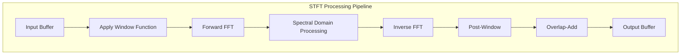
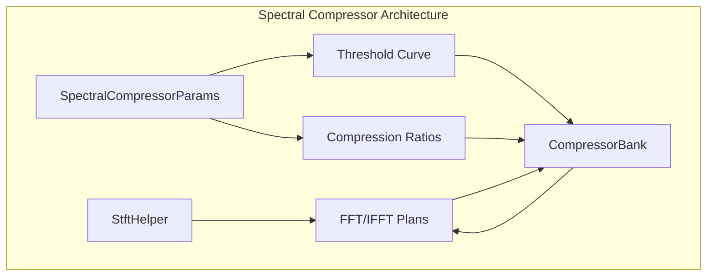
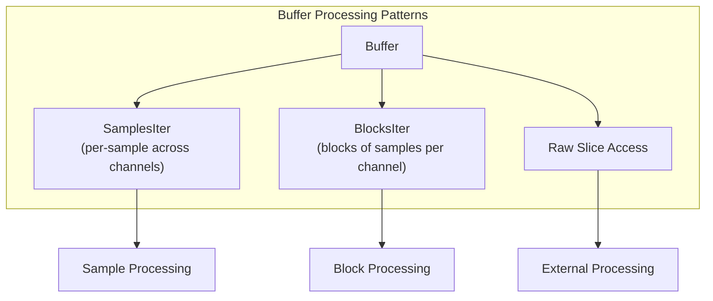
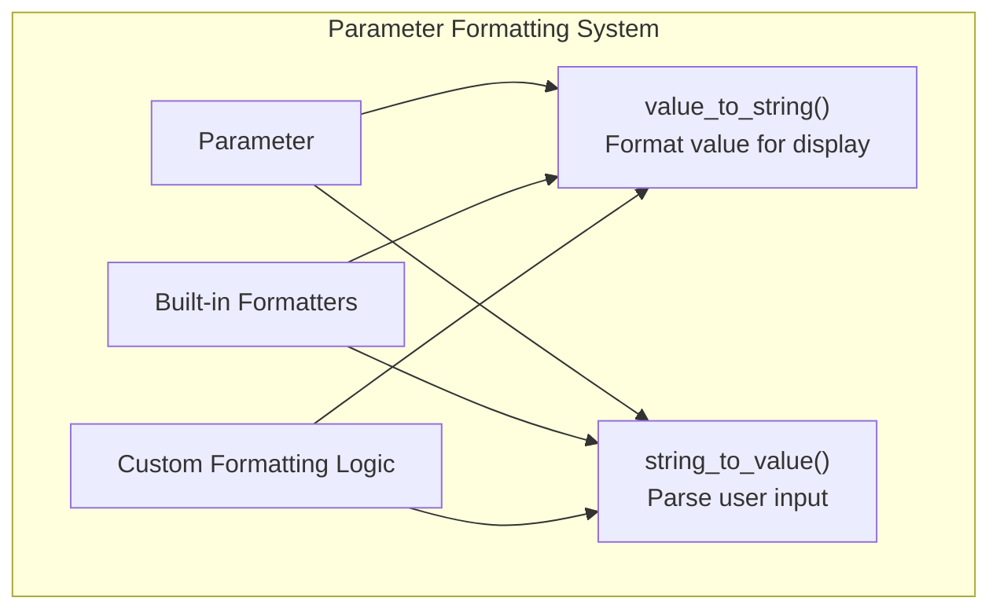
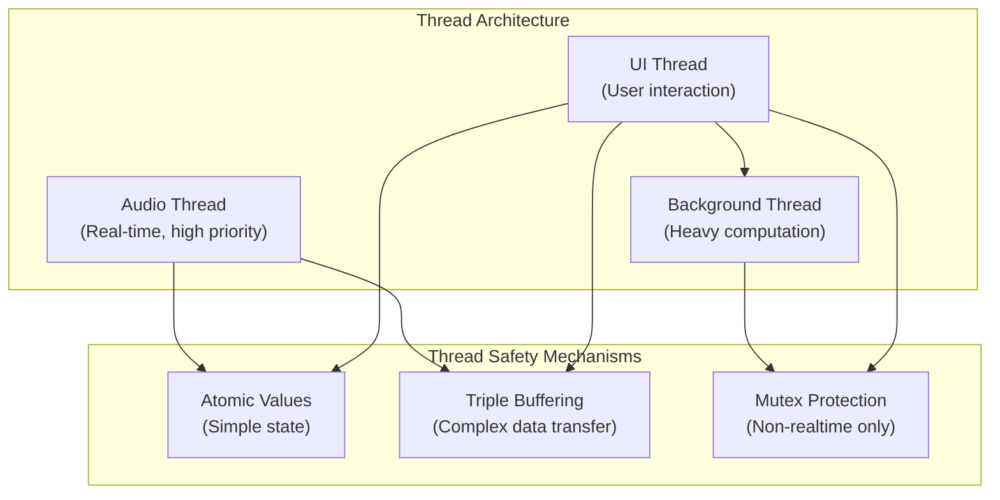

# Advanced Topics

> **Relevant source files**
> * [CHANGELOG.md](https://github.com/robbert-vdh/nih-plug/blob/28b149ec/CHANGELOG.md)
> * [plugins/spectral_compressor/src/compressor_bank.rs](https://github.com/robbert-vdh/nih-plug/blob/28b149ec/plugins/spectral_compressor/src/compressor_bank.rs)
> * [plugins/spectral_compressor/src/curve.rs](https://github.com/robbert-vdh/nih-plug/blob/28b149ec/plugins/spectral_compressor/src/curve.rs)
> * [plugins/spectral_compressor/src/lib.rs](https://github.com/robbert-vdh/nih-plug/blob/28b149ec/plugins/spectral_compressor/src/lib.rs)
> * [src/wrapper/util.rs](https://github.com/robbert-vdh/nih-plug/blob/28b149ec/src/wrapper/util.rs)
> * [src/wrapper/util/buffer_management.rs](https://github.com/robbert-vdh/nih-plug/blob/28b149ec/src/wrapper/util/buffer_management.rs)
> * [src/wrapper/vst3/factory.rs](https://github.com/robbert-vdh/nih-plug/blob/28b149ec/src/wrapper/vst3/factory.rs)
> * [src/wrapper/vst3/view.rs](https://github.com/robbert-vdh/nih-plug/blob/28b149ec/src/wrapper/vst3/view.rs)

This document explores advanced features and techniques within the NIH-plug framework that enable sophisticated audio plugin development. While the core concepts provide the foundation for building plugins, these advanced topics unlock more powerful audio processing capabilities and optimization techniques.

For information about basic plugin development, see [Core Concepts](/robbert-vdh/nih-plug/2-core-concepts).

## STFT and Spectral Processing

NIH-plug provides powerful utilities for spectral domain processing through its Short-Time Fourier Transform (STFT) implementation in the `StftHelper` class. This enables plugins to analyze and modify audio in the frequency domain.



The `StftHelper` class handles the complex overlap-add algorithm and window management, allowing plugin developers to focus on the spectral processing itself. Key features include:

* Configurable window sizes and overlap factors
* Automatic handling of the overlap-add algorithm
* Support for sidechain inputs
* Dedicated analysis-only mode for spectrum visualizers

Sources: [src/util/stft.rs L36-L586](https://github.com/robbert-vdh/nih-plug/blob/28b149ec/src/util/stft.rs#L36-L586)

 [plugins/spectral_compressor/src/lib.rs L65-L73](https://github.com/robbert-vdh/nih-plug/blob/28b149ec/plugins/spectral_compressor/src/lib.rs#L65-L73)

### Case Study: Spectral Compressor

The Spectral Compressor plugin serves as an excellent example of advanced spectral processing using NIH-plug's STFT utilities. It implements a multiband compressor that operates directly in the frequency domain.



The processing flow includes:

1. Buffering input audio and applying windowing (handled by `StftHelper`)
2. Performing FFT to convert to frequency domain
3. Applying per-bin compression based on threshold curves and ratios
4. Performing IFFT to return to time domain
5. Applying post-windowing and overlap-add (handled by `StftHelper`)

Sources: [plugins/spectral_compressor/src/lib.rs L384-L506](https://github.com/robbert-vdh/nih-plug/blob/28b149ec/plugins/spectral_compressor/src/lib.rs#L384-L506)

 [plugins/spectral_compressor/src/compressor_bank.rs L49-L115](https://github.com/robbert-vdh/nih-plug/blob/28b149ec/plugins/spectral_compressor/src/compressor_bank.rs#L49-L115)

### Window Functions

NIH-plug provides window functions essential for spectral processing in `window.rs`:

* Hann window: `hann()` and `hann_in_place()`
* Blackman window: `blackman()` and `blackman_in_place()`
* Window application helper: `multiply_with_window()`

The window functions minimize spectral leakage and improve frequency resolution when performing FFT operations.

Sources: [src/util/window.rs L6-L58](https://github.com/robbert-vdh/nih-plug/blob/28b149ec/src/util/window.rs#L6-L58)

 [plugins/spectral_compressor/src/lib.rs L526-L527](https://github.com/robbert-vdh/nih-plug/blob/28b149ec/plugins/spectral_compressor/src/lib.rs#L526-L527)

## Advanced Buffer Processing

NIH-plug offers sophisticated buffer handling methods to optimize audio processing. The `Buffer` struct provides multiple iteration patterns to suit different processing techniques.



### Sample-based Processing

The `iter_samples()` method enables iteration through each sample position across all channels, which is ideal for per-sample processing that requires access to all channels simultaneously:

```
for mut samples in buffer.iter_samples() {
    // Process all channels at this sample position
    for sample in samples {
        *sample = process_sample(*sample);
    }
}
```

Sources: [src/buffer.rs L68-L75](https://github.com/robbert-vdh/nih-plug/blob/28b149ec/src/buffer.rs#L68-L75)

 [src/buffer/samples.rs L41-L68](https://github.com/robbert-vdh/nih-plug/blob/28b149ec/src/buffer/samples.rs#L41-L68)

### Block-based Processing

The `iter_blocks()` method supports processing audio in blocks, which is more efficient for many algorithms and enables SIMD optimization:

```
for (offset, block) in buffer.iter_blocks(128) {
    for channel in block {
        // Process up to 128 samples at once
        process_block(channel);
    }
}
```

This approach is particularly useful for:

* Algorithms that can operate on vectors of samples
* Integration with DSP libraries that process blocks
* Leveraging SIMD instructions for parallel processing

Sources: [src/buffer.rs L102-L109](https://github.com/robbert-vdh/nih-plug/blob/28b149ec/src/buffer.rs#L102-L109)

 [src/buffer/blocks.rs L43-L75](https://github.com/robbert-vdh/nih-plug/blob/28b149ec/src/buffer/blocks.rs#L43-L75)

### Memory Layout and Safety

The buffer system uses careful memory management to provide safe but efficient access patterns:

* Mutable access to individual samples without aliasing
* Block slices that don't overlap or alias
* Mechanisms to get raw pointer access when needed for interoperability

Sources: [src/buffer.rs L121-L133](https://github.com/robbert-vdh/nih-plug/blob/28b149ec/src/buffer.rs#L121-L133)

 [src/buffer/blocks.rs L92-L122](https://github.com/robbert-vdh/nih-plug/blob/28b149ec/src/buffer/blocks.rs#L92-L122)

## Parameter Formatting and Display

NIH-plug provides extensive parameter formatting capabilities to create intuitive UIs and provide meaningful parameter displays to users.



### Built-in Formatters

NIH-plug includes formatters for common audio parameter types:

* Frequency formatters (`v2s_f32_hz_then_khz`)
* Decibel formatters (`v2s_f32_gain_to_db`)
* Percentage formatters (`v2s_f32_percentage`)
* Ratio formatters (`v2s_compression_ratio`)
* Power-of-two formatters (`v2s_i32_power_of_two`)

Example from Spectral Compressor:

```yaml
FloatParam::new("Window Size",
    DEFAULT_WINDOW_ORDER as i32,
    IntRange::Linear {
        min: MIN_WINDOW_ORDER as i32,
        max: MAX_WINDOW_ORDER as i32,
    },
)
.with_value_to_string(formatters::v2s_i32_power_of_two())
.with_string_to_value(formatters::s2v_i32_power_of_two())
```

Sources: [plugins/spectral_compressor/src/lib.rs L217-L236](https://github.com/robbert-vdh/nih-plug/blob/28b149ec/plugins/spectral_compressor/src/lib.rs#L217-L236)

 [plugins/spectral_compressor/src/compressor_bank.rs L390-L394](https://github.com/robbert-vdh/nih-plug/blob/28b149ec/plugins/spectral_compressor/src/compressor_bank.rs#L390-L394)

### Custom Parameter Visualization

The Spectral Compressor plugin demonstrates how to implement specialized parameter visualization:

* Creating threshold curves based on parameter values
* Visualizing compression in a spectrum analyzer
* Linking curve parameters to visual representations

Sources: [plugins/spectral_compressor/src/curve.rs L6-L62](https://github.com/robbert-vdh/nih-plug/blob/28b149ec/plugins/spectral_compressor/src/curve.rs#L6-L62)

 [plugins/spectral_compressor/src/compressor_bank.rs L331-L395](https://github.com/robbert-vdh/nih-plug/blob/28b149ec/plugins/spectral_compressor/src/compressor_bank.rs#L331-L395)

## Background Tasks and Thread Safety

Audio plugins operate in a multi-threaded environment where audio processing, UI rendering, and background tasks must coexist without data races or audio glitches.



### Triple Buffering

NIH-plug uses triple buffering for lock-free communication between the audio thread and UI thread. This is particularly important for transferring visualization data that would be too complex for atomic operations.

Example from the Spectral Compressor:

```javascript
// Create triple buffer for analyzer data
let (analyzer_input_data, analyzer_output_data) = TripleBuffer::default().split();

// In audio thread
analyzer_input_data.write(new_data);
analyzer_input_data.publish(); // Makes data available to UI

// In UI thread
let analyzer_data = analyzer_output_data.read(); // Get latest published data
```

Sources: [plugins/spectral_compressor/src/lib.rs L159-L188](https://github.com/robbert-vdh/nih-plug/blob/28b149ec/plugins/spectral_compressor/src/lib.rs#L159-L188)

 [plugins/diopser/src/spectrum.rs L67-L91](https://github.com/robbert-vdh/nih-plug/blob/28b149ec/plugins/diopser/src/spectrum.rs#L67-L91)

### Thread-Safe Parameters

Parameter updates flow from the UI thread to the audio thread through thread-safe mechanisms:

* Atomic values for simple numeric parameters
* Callback registration for parameter changes to update derived values
* Flags to signal when recalculation is needed

Example from the CompressorBank:

```sql
// Signal that thresholds need update on next processing cycle
should_update_thresholds.store(true, Ordering::SeqCst);
```

Sources: [plugins/spectral_compressor/src/compressor_bank.rs L222-L227](https://github.com/robbert-vdh/nih-plug/blob/28b149ec/plugins/spectral_compressor/src/compressor_bank.rs#L222-L227)

 [plugins/spectral_compressor/src/compressor_bank.rs L352-L354](https://github.com/robbert-vdh/nih-plug/blob/28b149ec/plugins/spectral_compressor/src/compressor_bank.rs#L352-L354)

## Conclusion

NIH-plug's advanced features enable sophisticated audio processing while maintaining performance and stability. By leveraging the STFT utilities, optimized buffer processing patterns, advanced parameter formatting, and thread-safe communication mechanisms, developers can create complex audio plugins that operate efficiently in modern DAW environments.

For more detailed information on these topics, see:

* [STFT and Spectral Processing](/robbert-vdh/nih-plug/6.1-stft-and-spectral-processing)
* [Parameter Formatting and Display](/robbert-vdh/nih-plug/6.2-thread-safety-and-real-time-constraints)
* [Background Tasks and Thread Safety](/robbert-vdh/nih-plug/6.3-background-tasks-and-async-execution)