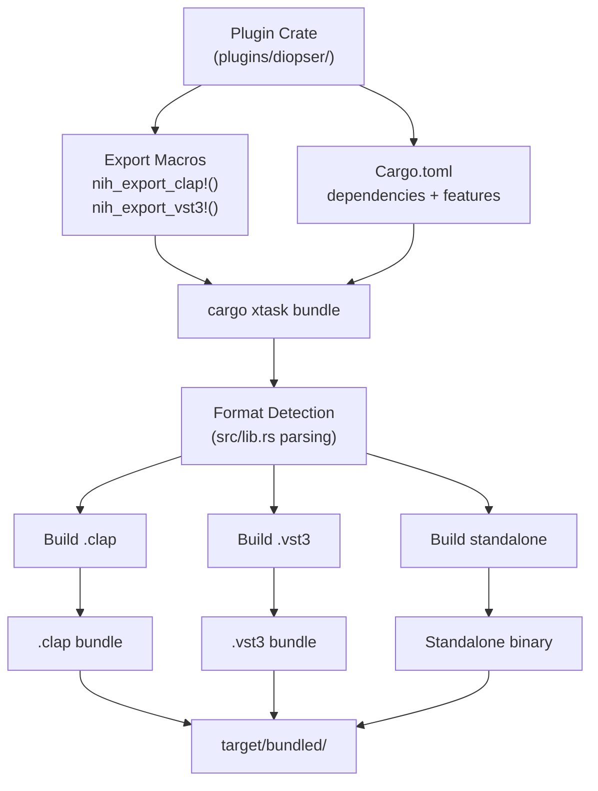
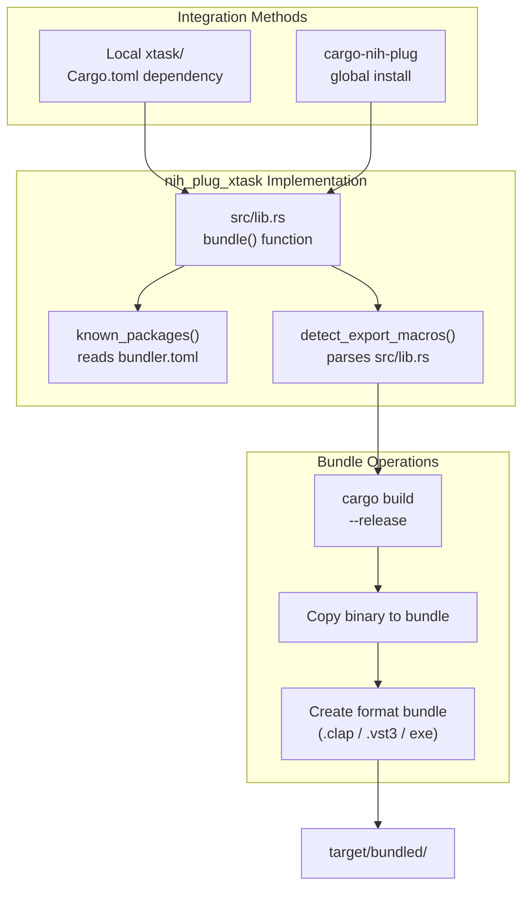
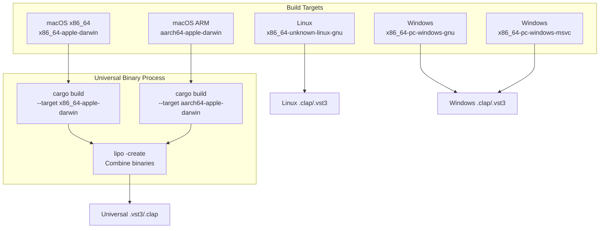
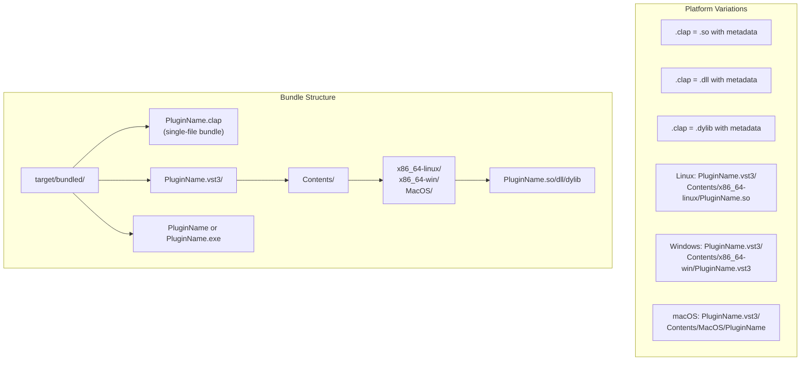

# Build System and Bundling

> **Relevant source files**
> * [.github/workflows/build.yml](https://github.com/robbert-vdh/nih-plug/blob/28b149ec/.github/workflows/build.yml)
> * [.github/workflows/docs.yml](https://github.com/robbert-vdh/nih-plug/blob/28b149ec/.github/workflows/docs.yml)
> * [.github/workflows/test.yml](https://github.com/robbert-vdh/nih-plug/blob/28b149ec/.github/workflows/test.yml)
> * [Cargo.lock](https://github.com/robbert-vdh/nih-plug/blob/28b149ec/Cargo.lock)
> * [Cargo.toml](https://github.com/robbert-vdh/nih-plug/blob/28b149ec/Cargo.toml)
> * [README.md](https://github.com/robbert-vdh/nih-plug/blob/28b149ec/README.md)

This document describes NIH-plug's build automation and plugin packaging infrastructure. It covers the `cargo xtask bundle` command, cross-compilation workflows, feature flag configuration, and the CI/CD pipeline for generating distributable plugin bundles. For information about the plugin format wrappers themselves (VST3, CLAP, standalone), see [Plugin Wrappers](/robbert-vdh/nih-plug/3-plugin-wrappers). For project structure and dependency management, see [Project Structure](/robbert-vdh/nih-plug/1.2-project-structure).

---

## Overview

NIH-plug uses a custom Cargo xtask system to automate plugin bundling. The system detects which plugin formats are exported by a crate (via `nih_export_clap!()`, `nih_export_vst3!()`, or `nih_export_standalone()` macros) and generates the appropriate format-specific bundles without requiring manual configuration.



**Bundle Generation Flow**

Sources: [Cargo.toml L1-L148](https://github.com/robbert-vdh/nih-plug/blob/28b149ec/Cargo.toml#L1-L148)

 [README.md L157-L164](https://github.com/robbert-vdh/nih-plug/blob/28b149ec/README.md#L157-L164)

---

## Feature Flags

NIH-plug uses Cargo features to control compilation targets and functionality. Features are configured in the workspace root `Cargo.toml`.

### Core Features

| Feature | Default | Description | License Impact |
| --- | --- | --- | --- |
| `vst3` | ✓ | Enables `nih_export_vst3!()` macro | **GPL-3.0** via vst3-sys |
| `standalone` | ✗ | Enables `nih_export_standalone()` | ISC (adds JACK, CPAL dependencies) |
| `simd` | ✗ | SIMD buffer adapters | ISC (requires nightly Rust) |
| `zstd` | ✗ | Zstandard state compression | ISC |
| `assert_process_allocs` | ✗ | Panic on allocations in `process()` | ISC (debug builds only) |

### Feature Configuration

```
// Cargo.toml
[features]
default = ["vst3"]
standalone = ["dep:baseview", "dep:clap", "dep:cpal", "dep:jack", "dep:midir", "dep:rtrb"]
vst3 = ["dep:vst3-sys"]
simd = []
zstd = ["dep:zstd"]
assert_process_allocs = ["dep:assert_no_alloc"]
```

**Critical Licensing Note**: The `vst3` feature is enabled by default but requires GPL-3.0 compliance for VST3 exports due to `vst3-sys` bindings. Commercial closed-source plugins must either:

1. Disable the `vst3` feature and export only CLAP/standalone
2. Comply with GPL-3.0 for VST3 builds
3. Provide alternative VST3 bindings

Sources: [Cargo.toml L49-L76](https://github.com/robbert-vdh/nih-plug/blob/28b149ec/Cargo.toml#L49-L76)

 [README.md L226-L237](https://github.com/robbert-vdh/nih-plug/blob/28b149ec/README.md#L226-L237)

---

## The xtask Bundle System

NIH-plug implements plugin bundling through the `nih_plug_xtask` crate, which can be integrated as either a workspace member or a global Cargo subcommand.



**xtask Architecture**

### Usage Patterns

**Local xtask (per-project)**:

```go
# From plugin workspace root
cargo xtask bundle my_plugin --release
cargo xtask bundle my_plugin --release --target x86_64-pc-windows-gnu
```

**Global cargo-nih-plug**:

```python
# Install globally
cargo install cargo-nih-plug

# Use from any directory
cargo nih-plug bundle my_plugin --release
```

### Format Detection Algorithm

The bundler detects plugin formats by parsing `src/lib.rs` for export macros:

1. Read `src/lib.rs` as a string
2. Search for `nih_export_clap!` → build `.clap`
3. Search for `nih_export_vst3!` → build `.vst3`
4. Search for `nih_export_standalone` → build standalone binary
5. Execute appropriate `cargo build` commands
6. Copy binaries into format-specific bundle structures

This design allows a single crate to export multiple formats without configuration:

```rust
// src/lib.rs - exports all three formats
nih_export_clap!(MyPlugin);
nih_export_vst3!(MyPlugin);

// main.rs - standalone entry point
fn main() {
    nih_export_standalone::<MyPlugin>();
}
```

Sources: [README.md L157-L164](https://github.com/robbert-vdh/nih-plug/blob/28b149ec/README.md#L157-L164)

 [Cargo.toml L13-L47](https://github.com/robbert-vdh/nih-plug/blob/28b149ec/Cargo.toml#L13-L47)

---

## Cross-Compilation and Platform Support

NIH-plug supports cross-compilation for all major platforms with special handling for macOS universal binaries.



**Cross-Compilation Architecture**

### Platform-Specific Dependencies

**Linux** (Ubuntu 22.04):

```markdown
sudo apt-get install -y \
    libasound2-dev \      # ALSA
    libgl-dev \           # OpenGL
    libjack-dev \         # JACK
    libx11-xcb-dev \      # X11
    libxcb1-dev \         # XCB
    libxcb-dri2-0-dev \   # XCB extensions
    libxcb-icccm4-dev \
    libxcursor-dev \
    libxkbcommon-dev \
    libxcb-shape0-dev \
    libxcb-xfixes0-dev
```

**macOS Universal Binaries**:

```javascript
# Set deployment target for backward compatibility
export MACOSX_DEPLOYMENT_TARGET=10.13

# Bundle both architectures
cargo xtask bundle-universal my_plugin --release
```

The `bundle-universal` command:

1. Builds for `x86_64-apple-darwin` target
2. Builds for `aarch64-apple-darwin` target
3. Combines both using `lipo -create`
4. Creates single `.vst3`/`.clap` bundle containing universal binary

**Windows**: No cross-compilation required; builds native binaries for `x86_64-pc-windows-msvc` or GNU targets.

Sources: [.github/workflows/build.yml L35-L40](https://github.com/robbert-vdh/nih-plug/blob/28b149ec/.github/workflows/build.yml#L35-L40)

 [.github/workflows/build.yml L78-L80](https://github.com/robbert-vdh/nih-plug/blob/28b149ec/.github/workflows/build.yml#L78-L80)

 [.github/workflows/test.yml L28-L31](https://github.com/robbert-vdh/nih-plug/blob/28b149ec/.github/workflows/test.yml#L28-L31)

---

## CI/CD Pipeline

NIH-plug uses GitHub Actions for automated testing, building, and documentation deployment across three workflows.

```mermaid
flowchart TD

DocsTrigger["Push to master"]
DocsGen["cargo doc<br>--features docs,simd,standalone,zstd"]
DocsRedirect["Create index.html redirect"]
DocsDeploy["Deploy to gh-pages branch<br>(robbert-vdh/nih-plug-docs)"]
BuildTrigger["Push / Tag / PR"]
BuildMatrix["Matrix:<br>ubuntu-22.04<br>macos-universal<br>windows"]
BuildKnown["cargo xtask known-packages"]
BuildAll["cargo xtask bundle/bundle-universal<br>all packages --release"]
BuildUpload["Upload artifacts<br>with timestamp"]
TestTrigger["Push / PR to master"]
TestMatrix["Matrix: ubuntu, macos, windows"]
TestDeps["Install platform dependencies"]
TestRun["cargo test --workspace<br>--features simd,standalone,zstd"]
TestNoVst3["cargo build --no-default-features"]

subgraph subGraph2 ["docs.yml Workflow"]
    DocsTrigger
    DocsGen
    DocsRedirect
    DocsDeploy
    DocsTrigger --> DocsGen
    DocsGen --> DocsRedirect
    DocsRedirect --> DocsDeploy
end

subgraph subGraph1 ["build.yml Workflow"]
    BuildTrigger
    BuildMatrix
    BuildKnown
    BuildAll
    BuildUpload
    BuildTrigger --> BuildMatrix
    BuildMatrix --> BuildKnown
    BuildKnown --> BuildAll
    BuildAll --> BuildUpload
end

subgraph subGraph0 ["test.yml Workflow"]
    TestTrigger
    TestMatrix
    TestDeps
    TestRun
    TestNoVst3
    TestTrigger --> TestMatrix
    TestMatrix --> TestDeps
    TestDeps --> TestRun
    TestRun --> TestNoVst3
end
```



**CI/CD Workflow Structure**

### Test Workflow

**File**: `.github/workflows/test.yml`

**Triggers**: Push to any branch, PR to master

**Matrix Strategy**:

* Ubuntu 22.04, macOS latest, Windows latest
* Nightly Rust toolchain (for SIMD features)

**Key Operations**:

1. Checkout with full git history (`git fetch --unshallow`) for version detection
2. Install platform-specific dependencies
3. Restore Cargo cache (excluding `target/` on Windows due to disk space issues)
4. Run `cargo test --locked --workspace --features "simd,standalone,zstd"`
5. Verify no-VST3 build: `cargo build --no-default-features`

The `--locked` flag ensures `Cargo.lock` is up-to-date, catching dependency drift.

Sources: [.github/workflows/test.yml L1-L89](https://github.com/robbert-vdh/nih-plug/blob/28b149ec/.github/workflows/test.yml#L1-L89)

### Build Workflow

**File**: `.github/workflows/build.yml`

**Triggers**: Push to any branch, tags, PRs, manual dispatch

**Matrix Strategy**:

| Runner | OS | Cross Target | Output |
| --- | --- | --- | --- |
| ubuntu-22.04 | Linux | - | x86_64 Linux binaries |
| macos-universal | macOS | x86_64-apple-darwin | Universal binaries |
| windows | Windows | - | x86_64 Windows binaries |

**Build Process**:

```javascript
# 1. Detect all bundled packages
package_args=()
for package in $(cargo xtask known-packages); do
  package_args+=("-p" "$package")
done

# 2. Platform-specific bundling
if [[ $runner = 'macos-universal' ]]; then
  export MACOSX_DEPLOYMENT_TARGET=10.13
  cargo xtask bundle-universal "${package_args[@]}" --release
else
  cargo xtask bundle "${package_args[@]}" --release $cross_target_flag
fi

# 3. Archive with timestamp
ARCHIVE_NAME=nih-plugs-$(date -u +"%Y-%m-%d-%H%m%S")-$runner_name
mv target/bundled/* "$ARCHIVE_NAME/"
```

**Artifacts**: Uploaded as `nih-plugs-YYYY-MM-DD-HHmmSS-<platform>` containing all bundled plugins.

Sources: [.github/workflows/build.yml L1-L105](https://github.com/robbert-vdh/nih-plug/blob/28b149ec/.github/workflows/build.yml#L1-L105)

### Documentation Workflow

**File**: `.github/workflows/docs.yml`

**Triggers**: Push to master branch

**Documentation Generation**:

```go
cargo doc --features docs,simd,standalone,zstd --no-deps \
  -p nih_plug \
  -p nih_plug_derive \
  -p nih_plug_egui \
  -p nih_plug_iced \
  -p nih_plug_vizia \
  -p nih_plug_xtask

# Create redirect index
echo '<meta http-equiv="refresh" content="0; url=nih_plug">' > target/doc/index.html
```

**Deployment**: Uses `JamesIves/github-pages-deploy-action` to deploy to `gh-pages` branch in `robbert-vdh/nih-plug-docs` repository (separate repo to reduce noise in main repository feed).

Sources: [.github/workflows/docs.yml L1-L80](https://github.com/robbert-vdh/nih-plug/blob/28b149ec/.github/workflows/docs.yml#L1-L80)

---

## Bundle Output Formats

NIH-plug generates platform-specific bundle structures for each plugin format.



**Bundle Output Structure**

### CLAP Format

CLAP plugins are single-file bundles:

**Linux**: `PluginName.clap` (shared object `.so` with CLAP entry points)
**Windows**: `PluginName.clap` (DLL with CLAP entry points)
**macOS**: `PluginName.clap` (dylib with CLAP entry points)

CLAP uses a simpler bundle format than VST3, requiring only the shared library with proper symbol exports.

### VST3 Format

VST3 requires platform-specific directory structures:

**Linux**:

```
PluginName.vst3/
└── Contents/
    └── x86_64-linux/
        └── PluginName.so
```

**Windows**:

```
PluginName.vst3/
└── Contents/
    └── x86_64-win/
        └── PluginName.vst3  (DLL extension)
```

**macOS**:

```
PluginName.vst3/
└── Contents/
    ├── MacOS/
    │   └── PluginName  (universal binary)
    └── Resources/  (optional)
```

The bundler automatically creates these directory structures and places the compiled shared library in the correct location.

### Standalone Format

Standalone binaries are platform-native executables:

**Linux**: `PluginName` (ELF executable)
**Windows**: `PluginName.exe` (PE executable)
**macOS**: `PluginName` (Mach-O universal executable)

Standalone binaries support:

* JACK audio/MIDI/transport
* CPAL for fallback audio I/O
* CLI configuration interface
* Full parameter automation via MIDI CC

Sources: [README.md L183-L190](https://github.com/robbert-vdh/nih-plug/blob/28b149ec/README.md#L183-L190)

 [Cargo.toml L49-L76](https://github.com/robbert-vdh/nih-plug/blob/28b149ec/Cargo.toml#L49-L76)

---

## Build Profiles

NIH-plug defines custom Cargo profiles for different use cases.

### Release Profile

```
[profile.release]
lto = "thin"
strip = "symbols"
```

**Configuration**:

* **LTO**: `"thin"` enables thin link-time optimization for better performance without excessive compile times
* **Strip**: `"symbols"` removes debug symbols to reduce binary size

This profile is used for distribution builds (`cargo xtask bundle --release`).

### Profiling Profile

```
[profile.profiling]
inherits = "release"
debug = true
strip = "none"
```

**Purpose**: Performance profiling with tools like `perf`, `Instruments`, or VTune while maintaining release-mode optimizations.

**Configuration**:

* Inherits release optimizations
* Enables debug info for profiler symbol resolution
* Retains all symbols

**Usage**: `cargo xtask bundle --profile profiling`

Sources: [Cargo.toml L140-L148](https://github.com/robbert-vdh/nih-plug/blob/28b149ec/Cargo.toml#L140-L148)

---

## Dependency Caching Strategy

The CI/CD pipeline uses different caching strategies per platform to optimize build times.

### Linux and macOS

```yaml
- uses: actions/cache@v4
  with:
    path: |
      ~/.cargo/registry/index/
      ~/.cargo/registry/cache/
      ~/.cargo/git/db/
      target/
    key: ${{ matrix.name }}-${{ matrix.cross-target }}
```

Caches both Cargo registry and `target/` directory for incremental compilation.

### Windows

```yaml
- uses: actions/cache@v4
  with:
    path: |
      ~/.cargo/registry/index/
      ~/.cargo/registry/cache/
      ~/.cargo/git/db/
    key: ${{ matrix.name }}-${{ matrix.cross-target }}
```

**Excludes `target/`** due to disk space issues on Windows runners. The target directory can grow very large and cause the runner to run out of space.

Sources: [.github/workflows/build.yml L41-L58](https://github.com/robbert-vdh/nih-plug/blob/28b149ec/.github/workflows/build.yml#L41-L58)

 [.github/workflows/test.yml L33-L50](https://github.com/robbert-vdh/nih-plug/blob/28b149ec/.github/workflows/test.yml#L33-L50)

---

## Integration with Plugin Development

### Export Macro Usage

Plugins declare format support using export macros in their library root:

```rust
// src/lib.rs
use nih_plug::prelude::*;

struct MyPlugin { /* ... */ }
impl Plugin for MyPlugin { /* ... */ }

// Export CLAP format
nih_export_clap!(MyPlugin);

// Export VST3 format (requires GPL compliance)
nih_export_vst3!(MyPlugin);
```

For standalone support, add to `main.rs` or separate binary:

```rust
// main.rs or bin/standalone.rs
use nih_plug::prelude::*;
use my_plugin::MyPlugin;

fn main() {
    nih_export_standalone::<MyPlugin>();
}
```

The bundler detects these macros automatically—no additional configuration required.

### Multi-Package Bundling

The `known-packages` command reads from `bundler.toml` (if present) to determine which workspace members to bundle:

```go
# Bundle all known packages in one command
cargo xtask bundle $(cargo xtask known-packages | xargs -I{} echo "-p {}") --release
```

This enables efficient parallel compilation of all plugins in the workspace.

Sources: [.github/workflows/build.yml L67-L88](https://github.com/robbert-vdh/nih-plug/blob/28b149ec/.github/workflows/build.yml#L67-L88)

 [README.md L89-L96](https://github.com/robbert-vdh/nih-plug/blob/28b149ec/README.md#L89-L96)

---

## Summary

NIH-plug's build system provides:

1. **Zero-configuration bundling** via export macro detection
2. **Multi-format support** from a single codebase (CLAP, VST3, standalone)
3. **Cross-platform builds** with universal macOS binary support
4. **Feature-based compilation** for SIMD, compression, and format selection
5. **Automated CI/CD** for testing, building, and documentation across all platforms
6. **Cargo integration** as local xtask or global subcommand

The system prioritizes developer ergonomics—plugins automatically support multiple formats without manual configuration, while the CI pipeline ensures cross-platform compatibility with every commit.