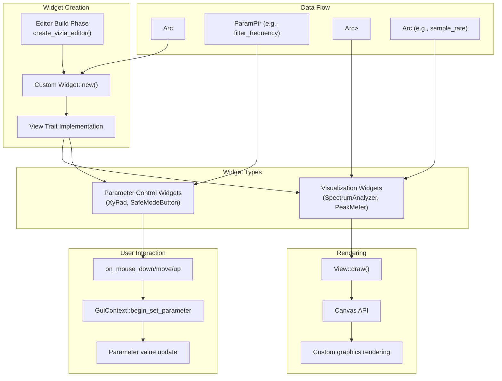
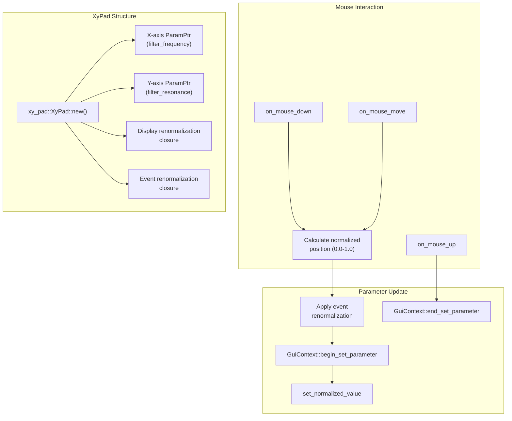
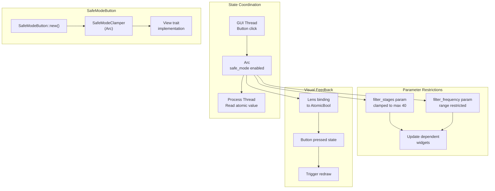
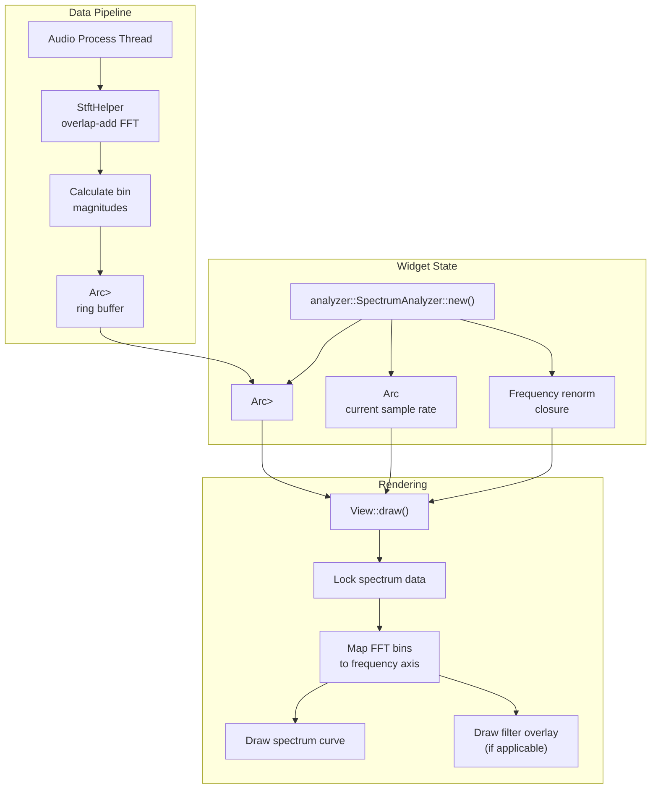
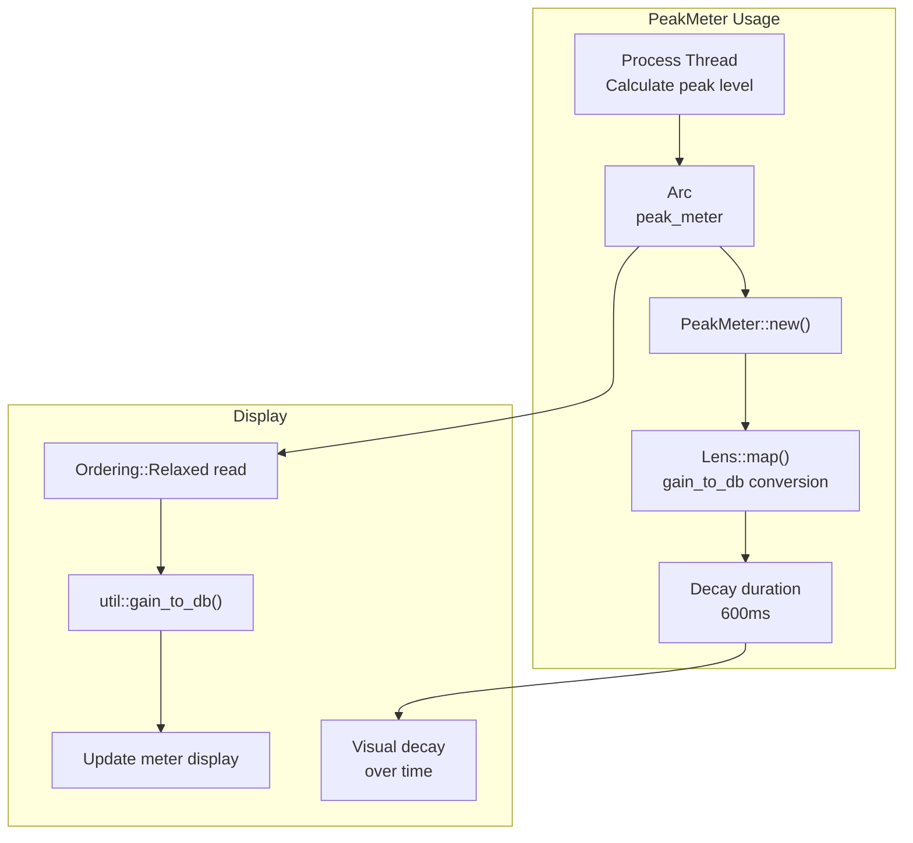
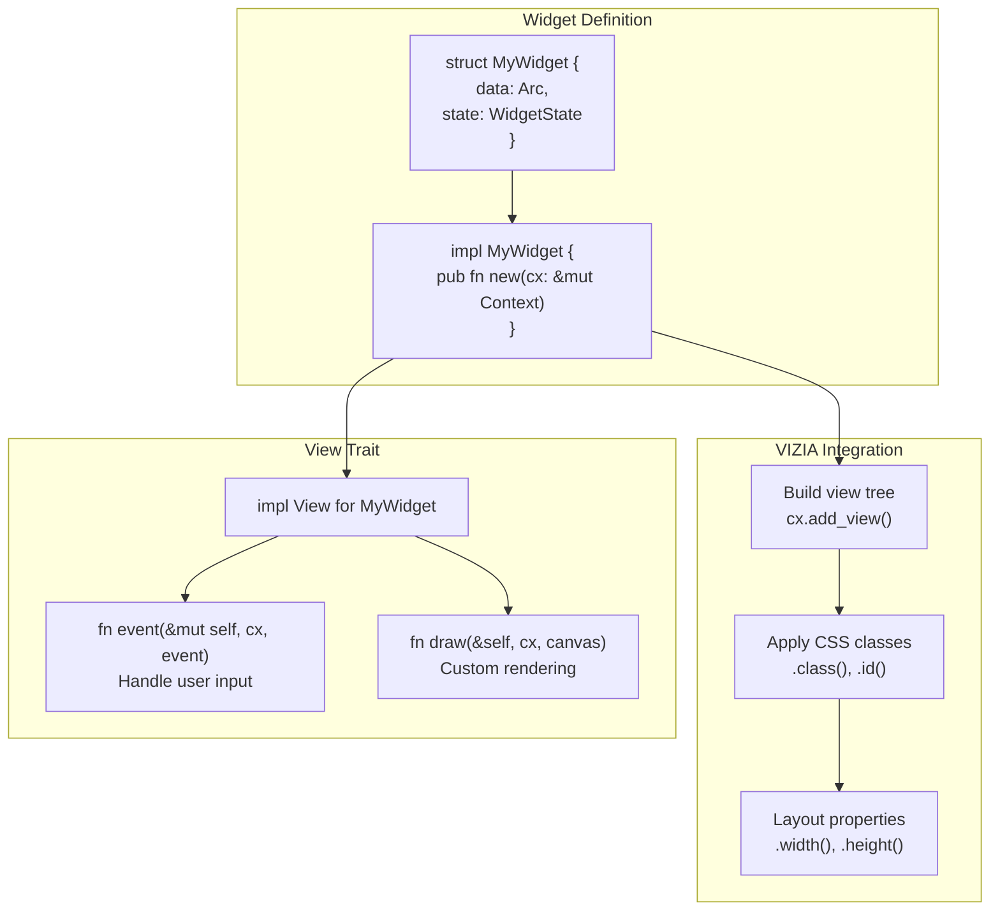
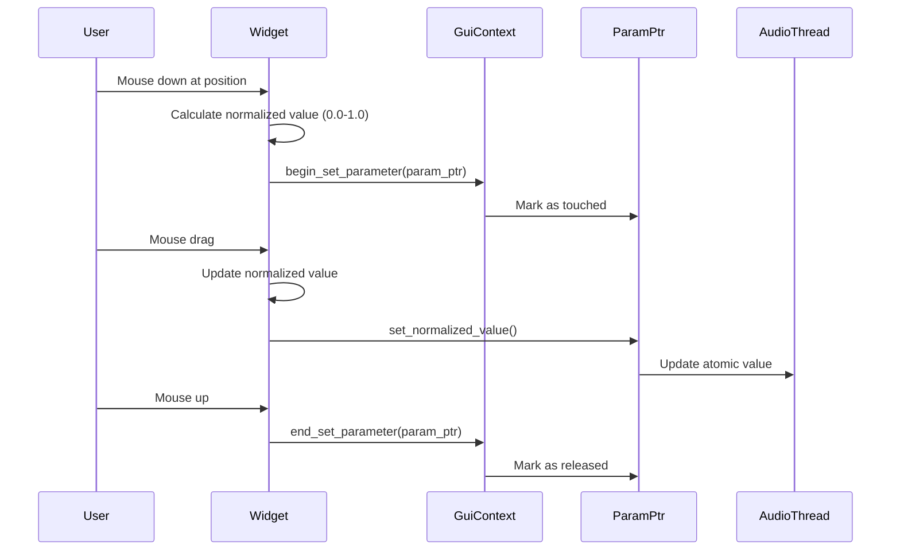
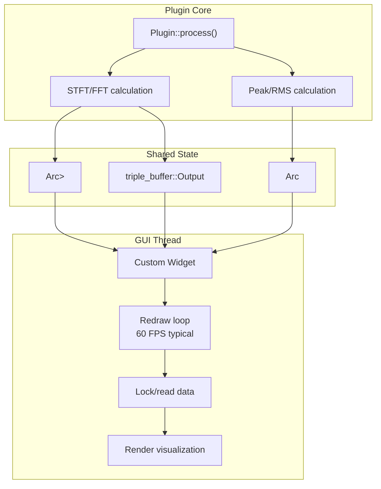

# Custom Widgets and Visualizations

> **Relevant source files**
> * [plugins/crisp/src/editor.rs](https://github.com/robbert-vdh/nih-plug/blob/28b149ec/plugins/crisp/src/editor.rs)
> * [plugins/diopser/src/editor.rs](https://github.com/robbert-vdh/nih-plug/blob/28b149ec/plugins/diopser/src/editor.rs)
> * [plugins/examples/gain_gui_vizia/src/editor.rs](https://github.com/robbert-vdh/nih-plug/blob/28b149ec/plugins/examples/gain_gui_vizia/src/editor.rs)
> * [plugins/spectral_compressor/src/editor.rs](https://github.com/robbert-vdh/nih-plug/blob/28b149ec/plugins/spectral_compressor/src/editor.rs)

This page documents how to create custom widgets and visualizations for NIH-plug GUIs using the VIZIA framework. Custom widgets extend beyond the built-in `ParamSlider`, `ParamButton`, and `GenericUi` components to provide specialized controls and visual feedback. For general editor concepts and the `Editor` trait, see [Editor System Overview](/robbert-vdh/nih-plug/4.1-editor-system-overview). For VIZIA adapter basics and built-in widgets, see [Vizia Integration](/robbert-vdh/nih-plug/4.2-vizia-integration).

## Widget Architecture Overview

Custom widgets in NIH-plug follow VIZIA's `View` trait pattern. Widgets are created during the GUI build phase and can:

* Bind to parameter data through `Arc<dyn Params>` and `ParamPtr`
* React to user input events (mouse, keyboard)
* Render custom graphics using VIZIA's Canvas API
* Observe shared state through `Arc<Mutex<T>>` or `Arc<AtomicCell<T>>`



**Sources:** [plugins/diopser/src/editor.rs L1-L237](https://github.com/robbert-vdh/nih-plug/blob/28b149ec/plugins/diopser/src/editor.rs#L1-L237)

 [plugins/spectral_compressor/src/editor.rs L1-L250](https://github.com/robbert-vdh/nih-plug/blob/28b149ec/plugins/spectral_compressor/src/editor.rs#L1-L250)

## Parameter Control Widgets

Parameter control widgets provide specialized interfaces for modifying plugin parameters. They use `GuiContext` to update parameters in a thread-safe, host-compatible manner.

### XyPad Widget

The XyPad provides two-dimensional parameter control, commonly used for frequency and resonance in Diopser. It maps mouse position to two separate parameters simultaneously.



The XyPad in Diopser demonstrates advanced features:

* **Dual parameter control**: Maps X-axis to `filter_frequency` and Y-axis to `filter_resonance` [plugins/diopser/src/editor.rs L158-L173](https://github.com/robbert-vdh/nih-plug/blob/28b149ec/plugins/diopser/src/editor.rs#L158-L173)
* **Safe mode clamping**: Uses closures to restrict parameter ranges when safe mode is enabled [plugins/diopser/src/editor.rs L163-L170](https://github.com/robbert-vdh/nih-plug/blob/28b149ec/plugins/diopser/src/editor.rs#L163-L170)
* **Visual overlay**: Rendered on top of the spectrum analyzer in a `ZStack` [plugins/diopser/src/editor.rs L150-L174](https://github.com/robbert-vdh/nih-plug/blob/28b149ec/plugins/diopser/src/editor.rs#L150-L174)

**Key implementation detail**: The widget stores `Arc<DiopserParams>` and uses `GuiContext` from the editor's `Data` struct to perform parameter updates. Renormalization closures enable dynamic range restrictions without modifying the underlying parameter definition.

**Sources:** [plugins/diopser/src/editor.rs L158-L173](https://github.com/robbert-vdh/nih-plug/blob/28b149ec/plugins/diopser/src/editor.rs#L158-L173)

### RestrictedParamSlider Widget

A specialized slider that dynamically restricts the parameter range based on external state, used in Diopser to clamp filter stages when safe mode is active.

| Feature | Implementation |
| --- | --- |
| Base widget | Extends standard slider behavior |
| Range restriction | Two closures: display renormalization and event renormalization |
| Visual feedback | Shows restricted range while preserving underlying parameter range |
| Thread safety | Uses `SafeModeClamper` to coordinate with processing thread |

The widget is instantiated with display and event renormalization closures [plugins/diopser/src/editor.rs L200-L212](https://github.com/robbert-vdh/nih-plug/blob/28b149ec/plugins/diopser/src/editor.rs#L200-L212)

:

```yaml
RestrictedParamSlider::new(
    cx,
    Data::params,
    |params| &params.filter_stages,
    { display_renorm_closure },
    { event_renorm_closure },
)
```

**Sources:** [plugins/diopser/src/editor.rs L200-L212](https://github.com/robbert-vdh/nih-plug/blob/28b149ec/plugins/diopser/src/editor.rs#L200-L212)

### SafeModeButton Widget

A custom toggle button that coordinates state between GUI and audio processing without using a parameter. This demonstrates handling non-parameter state in custom widgets.



The `SafeModeClamper` wraps an `Arc<AtomicBool>` and provides methods for renormalizing parameter values based on the safe mode state [plugins/diopser/src/editor.rs L56](https://github.com/robbert-vdh/nih-plug/blob/28b149ec/plugins/diopser/src/editor.rs#L56-L56)

 This allows other widgets (XyPad, RestrictedParamSlider) to query the current restriction state and adjust their behavior accordingly.

**Sources:** [plugins/diopser/src/editor.rs L25-L56](https://github.com/robbert-vdh/nih-plug/blob/28b149ec/plugins/diopser/src/editor.rs#L25-L56)

 [plugins/diopser/src/editor.rs L120](https://github.com/robbert-vdh/nih-plug/blob/28b149ec/plugins/diopser/src/editor.rs#L120-L120)

## Visualization Widgets

Visualization widgets display audio analysis data or metering information. They typically read from lock-free data structures populated by the audio processing thread.

### SpectrumAnalyzer Widget

Displays real-time frequency spectrum analysis, used in Diopser to visualize the output signal and show filter response overlays.



The analyzer is created with shared data from the plugin [plugins/diopser/src/editor.rs L151-L156](https://github.com/robbert-vdh/nih-plug/blob/28b149ec/plugins/diopser/src/editor.rs#L151-L156)

:

```yaml
analyzer::SpectrumAnalyzer::new(
    cx, 
    Data::spectrum,
    Data::sample_rate,
    { renormalization_closure }
)
```

**Key features:**

* **Lock-free updates**: Audio thread writes to `SpectrumOutput` ring buffer, GUI thread reads without blocking
* **Frequency mapping**: Converts FFT bin indices to frequencies using `sample_rate`
* **Dynamic overlays**: Can display filter response curves or other overlays on top of spectrum
* **Efficient rendering**: Only redraws when new spectrum data is available

**Sources:** [plugins/diopser/src/editor.rs L151-L156](https://github.com/robbert-vdh/nih-plug/blob/28b149ec/plugins/diopser/src/editor.rs#L151-L156)

 [plugins/diopser/src/editor.rs L42-L53](https://github.com/robbert-vdh/nih-plug/blob/28b149ec/plugins/diopser/src/editor.rs#L42-L53)

### PeakMeter Widget

A built-in VIZIA widget used in example plugins to display audio level metering with decay characteristics.



The gain_gui_vizia example demonstrates typical usage [plugins/examples/gain_gui_vizia/src/editor.rs L52-L59](https://github.com/robbert-vdh/nih-plug/blob/28b149ec/plugins/examples/gain_gui_vizia/src/editor.rs#L52-L59)

:

```yaml
PeakMeter::new(
    cx,
    Data::peak_meter.map(|peak_meter| 
        util::gain_to_db(peak_meter.load(Ordering::Relaxed))
    ),
    Some(Duration::from_millis(600)),
)
```

**Implementation details:**

* **Atomic storage**: Uses `AtomicF32` for lock-free reads from GUI thread
* **Lens mapping**: Converts linear gain to dB in the lens for efficient reactive updates
* **Visual decay**: Optional decay parameter creates smooth visual falloff
* **Built-in widget**: Part of `nih_plug_vizia::widgets`, no custom implementation needed

**Sources:** [plugins/examples/gain_gui_vizia/src/editor.rs L52-L59](https://github.com/robbert-vdh/nih-plug/blob/28b149ec/plugins/examples/gain_gui_vizia/src/editor.rs#L52-L59)

 [plugins/examples/gain_gui_vizia/src/editor.rs L14-L16](https://github.com/robbert-vdh/nih-plug/blob/28b149ec/plugins/examples/gain_gui_vizia/src/editor.rs#L14-L16)

### Analyzer Widget (Spectral Compressor)

A more complex visualization that displays frequency-domain compression activity, showing threshold curves, gain reduction, and spectrum data simultaneously.

**Data structure:**

| Component | Type | Purpose |
| --- | --- | --- |
| `analyzer_data` | `Arc<Mutex<triple_buffer::Output<AnalyzerData>>>` | Triple-buffered spectrum and envelope data |
| `sample_rate` | `Arc<AtomicF32>` | Frequency axis calibration |
| Visual layers | Multiple overlays | Threshold curves, gain reduction, input/output spectra |

The analyzer is instantiated with triple-buffered data [plugins/spectral_compressor/src/editor.rs L226-L231](https://github.com/robbert-vdh/nih-plug/blob/28b149ec/plugins/spectral_compressor/src/editor.rs#L226-L231)

:

```yaml
Analyzer::new(
    cx, 
    Data::analyzer_data,
    Data::sample_rate
)
```

**Advanced features:**

* **Triple buffering**: Uses `triple_buffer` crate for lock-free data exchange between audio and GUI threads
* **Multi-layer rendering**: Displays input spectrum, output spectrum, threshold curves, and gain reduction overlays
* **Editor mode integration**: Can be toggled on/off via `EditorMode` enum [plugins/spectral_compressor/src/editor.rs L48-L57](https://github.com/robbert-vdh/nih-plug/blob/28b149ec/plugins/spectral_compressor/src/editor.rs#L48-L57)
* **Dynamic sizing**: Expands GUI width when visible, collapses when hidden [plugins/spectral_compressor/src/editor.rs L74-L79](https://github.com/robbert-vdh/nih-plug/blob/28b149ec/plugins/spectral_compressor/src/editor.rs#L74-L79)

**Sources:** [plugins/spectral_compressor/src/editor.rs L226-L231](https://github.com/robbert-vdh/nih-plug/blob/28b149ec/plugins/spectral_compressor/src/editor.rs#L226-L231)

 [plugins/spectral_compressor/src/editor.rs L48-L57](https://github.com/robbert-vdh/nih-plug/blob/28b149ec/plugins/spectral_compressor/src/editor.rs#L48-L57)

 [plugins/spectral_compressor/src/editor.rs L66-L69](https://github.com/robbert-vdh/nih-plug/blob/28b149ec/plugins/spectral_compressor/src/editor.rs#L66-L69)

## Widget Implementation Patterns

### View Trait Implementation

All custom VIZIA widgets must implement the `View` trait. The minimal implementation requires defining how the widget is built and optionally how it draws custom graphics.



**Key methods:**

* `new()`: Constructor that calls `Self { ... }.build(cx)` to add the widget to the view tree
* `event()`: Handles mouse, keyboard, and other events
* `draw()`: Custom canvas rendering for complex graphics

**Sources:** [plugins/diopser/src/editor.rs L158-L173](https://github.com/robbert-vdh/nih-plug/blob/28b149ec/plugins/diopser/src/editor.rs#L158-L173)

 (XyPad instantiation)

### Data Binding with Lens

Widgets observe state changes using VIZIA's `Lens` trait, which provides reactive data binding.

**Common binding patterns:**

| Pattern | Code | Use Case |
| --- | --- | --- |
| Direct parameter | `Data::params` | Access entire `Params` struct |
| Param getter | `Data::params.map(\|p\| &p.gain)` | Specific parameter |
| Atomic value | `Data::peak_meter.map(\|m\| m.load())` | Shared atomic state |
| Nested state | `Data::params.map(\|p\| p.global.clone())` | Nested parameter groups |

The `Data` struct serves as the lens root and must implement `Lens` [plugins/diopser/src/editor.rs L47-L59](https://github.com/robbert-vdh/nih-plug/blob/28b149ec/plugins/diopser/src/editor.rs#L47-L59)

:

```css
#[derive(Lens, Clone)]
pub(crate) struct Data {
    pub(crate) params: Arc<DiopserParams>,
    pub(crate) sample_rate: Arc<AtomicF32>,
    pub(crate) spectrum: Arc<Mutex<SpectrumOutput>>,
    pub(crate) safe_mode_clamper: SafeModeClamper,
}
```

**Reactive updates**: VIZIA automatically triggers widget redraws when lens-bound data changes, eliminating manual update logic.

**Sources:** [plugins/diopser/src/editor.rs L47-L59](https://github.com/robbert-vdh/nih-plug/blob/28b149ec/plugins/diopser/src/editor.rs#L47-L59)

 [plugins/spectral_compressor/src/editor.rs L59-L69](https://github.com/robbert-vdh/nih-plug/blob/28b149ec/plugins/spectral_compressor/src/editor.rs#L59-L69)

### Event Handling

Custom widgets handle user input by implementing the `event()` method from the `View` trait.

**Event flow for parameter modification:**



**Critical methods:**

* `GuiContext::begin_set_parameter(param)`: Notify host that parameter editing started
* `ParamPtr::set_normalized_value(value)`: Update parameter atomically
* `GuiContext::end_set_parameter(param)`: Notify host that parameter editing ended

This sequence ensures:

* Host knows when automation should be overridden
* Parameter changes are thread-safe
* Undo/redo points are created correctly
* Host automation lanes update appropriately

**Sources:** Pattern inferred from [plugins/diopser/src/editor.rs L158-L173](https://github.com/robbert-vdh/nih-plug/blob/28b149ec/plugins/diopser/src/editor.rs#L158-L173)

### Drawing Custom Graphics

Complex visualizations use VIZIA's Canvas API in the `draw()` method.

**Canvas drawing primitives:**

| Primitive | Method | Usage |
| --- | --- | --- |
| Path | `Path::new()` | Define shapes and curves |
| Stroke | `canvas.stroke_path()` | Draw outlines |
| Fill | `canvas.fill_path()` | Fill shapes |
| Text | `canvas.fill_text()` | Render text labels |
| Transform | `canvas.translate()`, `canvas.scale()` | Coordinate transformations |

**Typical rendering sequence:**

1. Lock shared data (spectrum buffer, analyzer data)
2. Map data coordinates to canvas coordinates
3. Build path with `moveTo()` and `lineTo()` operations
4. Apply paint style (color, stroke width)
5. Render path with `stroke_path()` or `fill_path()`
6. Draw overlays (grid lines, labels, cursors)

**Performance considerations:**

* Minimize data copies during rendering
* Use pre-allocated buffers where possible
* Limit redraw frequency with timers or change detection
* Batch drawing operations to reduce canvas API calls

**Sources:** Pattern inferred from analyzer widget usage in [plugins/diopser/src/editor.rs L151-L156](https://github.com/robbert-vdh/nih-plug/blob/28b149ec/plugins/diopser/src/editor.rs#L151-L156)

 [plugins/spectral_compressor/src/editor.rs L226-L231](https://github.com/robbert-vdh/nih-plug/blob/28b149ec/plugins/spectral_compressor/src/editor.rs#L226-L231)

### Integration with Plugin Data

Custom widgets integrate with plugin processing through shared state:



**Data sharing strategies:**

1. **Mutex-protected buffers**: Simple but can cause contention. Use for infrequent updates [plugins/diopser/src/editor.rs L53](https://github.com/robbert-vdh/nih-plug/blob/28b149ec/plugins/diopser/src/editor.rs#L53-L53)
2. **Atomic values**: Best for simple metrics (peak level, sample rate) [plugins/examples/gain_gui_vizia/src/editor.rs L15](https://github.com/robbert-vdh/nih-plug/blob/28b149ec/plugins/examples/gain_gui_vizia/src/editor.rs#L15-L15)
3. **Triple buffering**: Lock-free for complex data structures. Audio thread writes, GUI reads [plugins/spectral_compressor/src/editor.rs L66](https://github.com/robbert-vdh/nih-plug/blob/28b149ec/plugins/spectral_compressor/src/editor.rs#L66-L66)
4. **Ring buffers**: Time-series data with automatic overwrite behavior

**Thread safety guarantees:**

* Audio processing never blocks on GUI locks
* GUI reads are non-blocking or use timeouts
* Data structures are sized to prevent allocation in audio thread
* Updates are atomic or use lock-free primitives

**Sources:** [plugins/diopser/src/editor.rs L47-L57](https://github.com/robbert-vdh/nih-plug/blob/28b149ec/plugins/diopser/src/editor.rs#L47-L57)

 [plugins/spectral_compressor/src/editor.rs L59-L69](https://github.com/robbert-vdh/nih-plug/blob/28b149ec/plugins/spectral_compressor/src/editor.rs#L59-L69)

 [plugins/examples/gain_gui_vizia/src/editor.rs L12-L16](https://github.com/robbert-vdh/nih-plug/blob/28b149ec/plugins/examples/gain_gui_vizia/src/editor.rs#L12-L16)