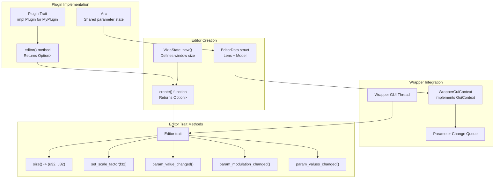
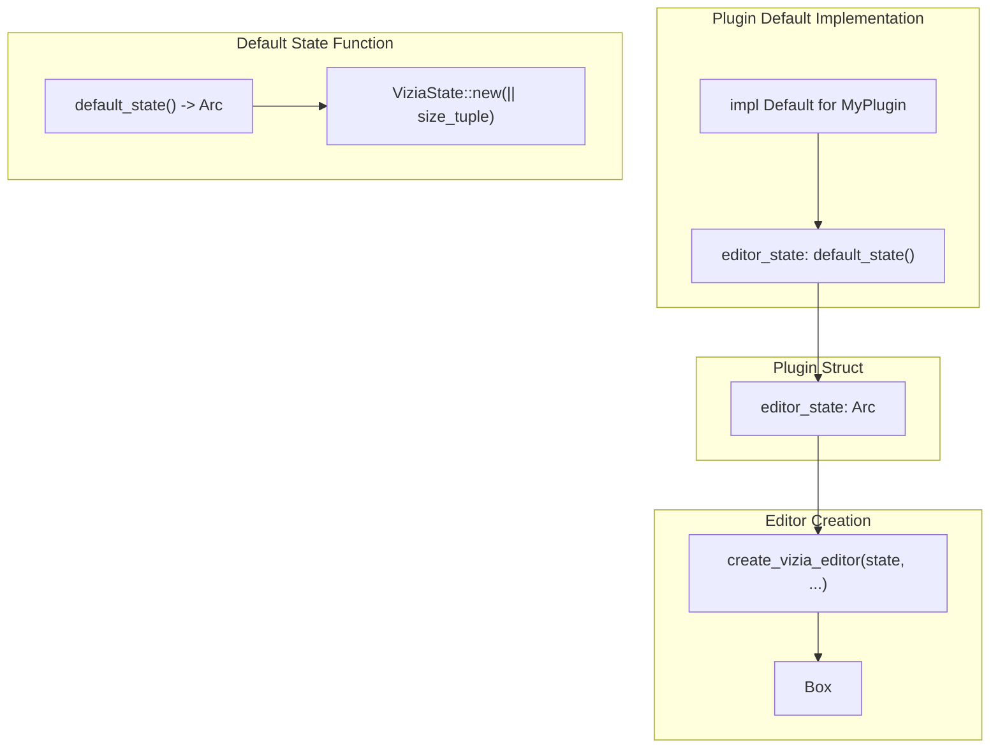
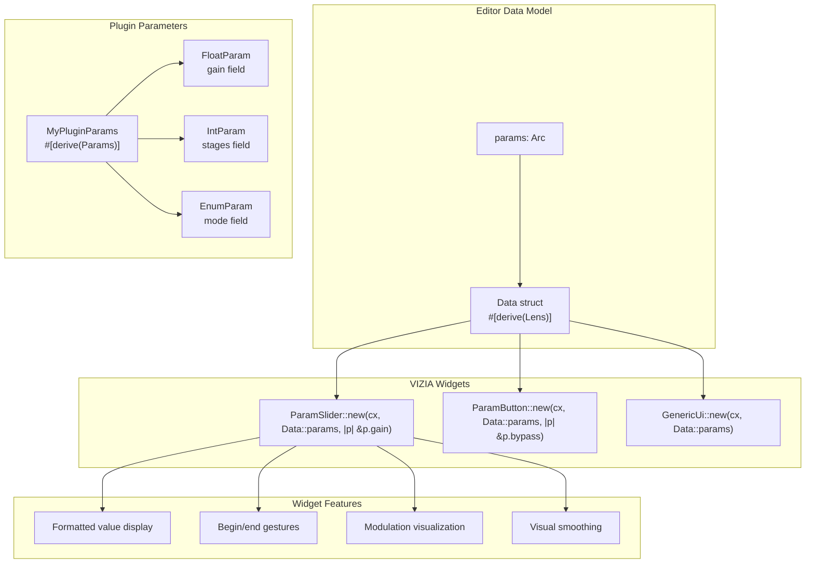
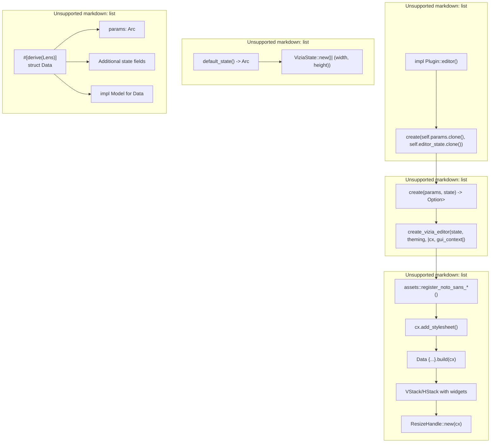
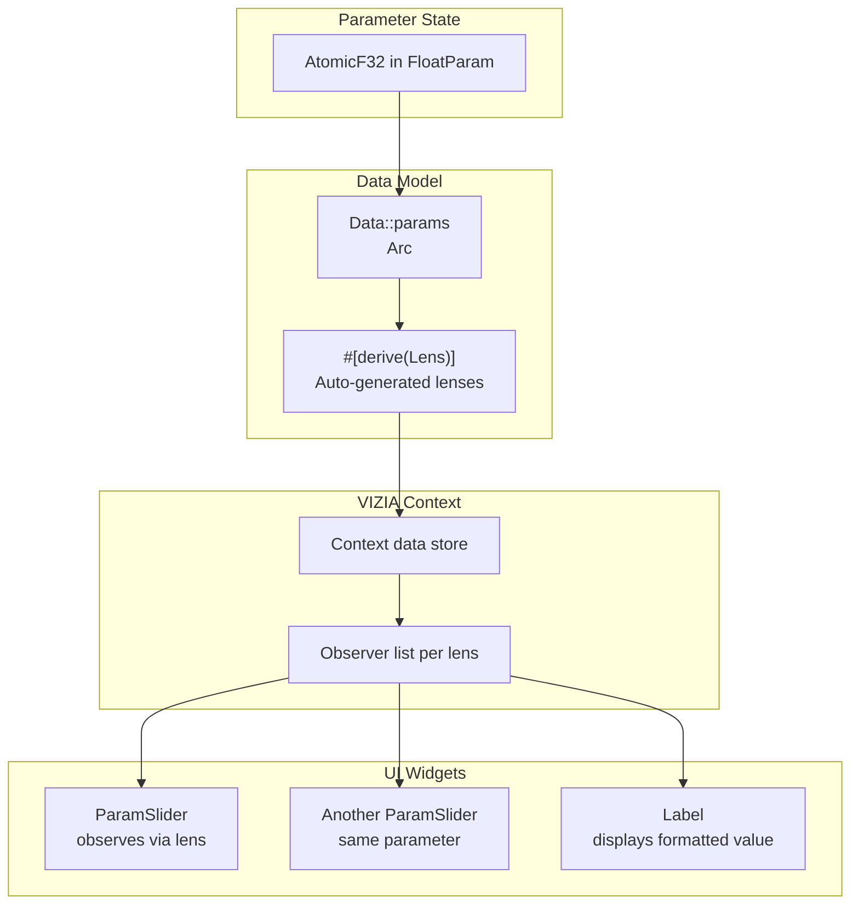
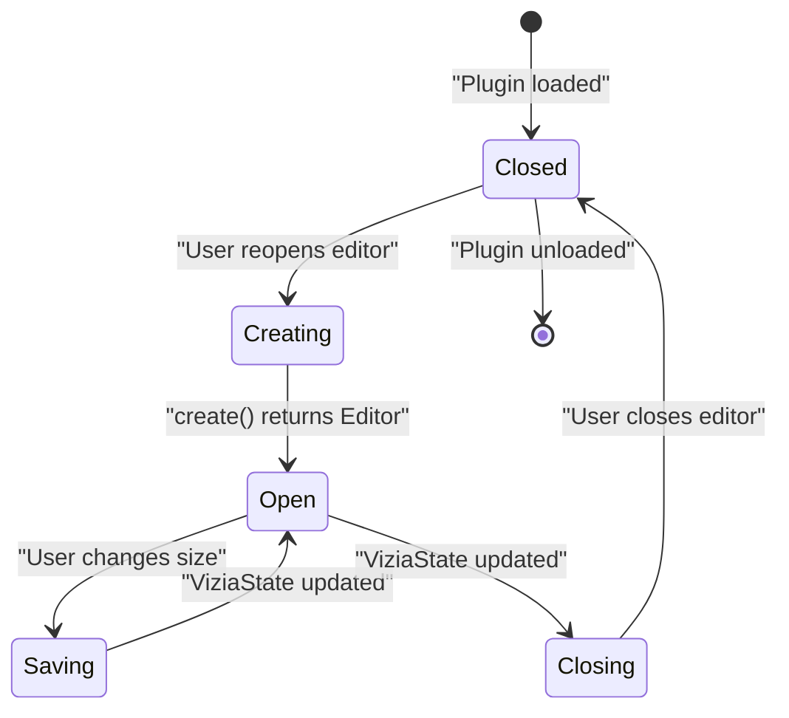

# Editor System Overview

> **Relevant source files**
> * [Cargo.lock](https://github.com/robbert-vdh/nih-plug/blob/28b149ec/Cargo.lock)
> * [Cargo.toml](https://github.com/robbert-vdh/nih-plug/blob/28b149ec/Cargo.toml)
> * [README.md](https://github.com/robbert-vdh/nih-plug/blob/28b149ec/README.md)
> * [plugins/crisp/src/editor.rs](https://github.com/robbert-vdh/nih-plug/blob/28b149ec/plugins/crisp/src/editor.rs)
> * [plugins/diopser/src/editor.rs](https://github.com/robbert-vdh/nih-plug/blob/28b149ec/plugins/diopser/src/editor.rs)
> * [plugins/examples/gain_gui_vizia/src/editor.rs](https://github.com/robbert-vdh/nih-plug/blob/28b149ec/plugins/examples/gain_gui_vizia/src/editor.rs)
> * [plugins/spectral_compressor/src/editor.rs](https://github.com/robbert-vdh/nih-plug/blob/28b149ec/plugins/spectral_compressor/src/editor.rs)

## Purpose and Scope

This document explains NIH-plug's editor system, which provides the abstraction layer between plugins and GUI frameworks. It covers the `Editor` trait, `ViziaState` for editor state persistence, `GuiContext` for plugin-editor communication, parameter binding mechanisms, and the standard pattern for creating plugin editors.

For information about specific GUI framework integrations (VIZIA, egui, iced), see [4.2](/robbert-vdh/nih-plug/4.2-vizia-integration) and [4.3](/robbert-vdh/nih-plug/4.3-egui-and-iced-integration). For details on custom widgets and visualizations, see [4.4](/robbert-vdh/nih-plug/4.4-custom-widgets-and-visualizations).

---

## Editor Trait Architecture

The `Editor` trait serves as the format-agnostic interface between a plugin and its graphical user interface. Plugin wrappers instantiate editors through the `Plugin::editor()` method, which returns `Option<Box<dyn Editor>>`.

**Editor Trait Lifecycle and Integration**



Sources: [plugins/diopser/src/editor.rs L66-L85](https://github.com/robbert-vdh/nih-plug/blob/28b149ec/plugins/diopser/src/editor.rs#L66-L85)

 [plugins/spectral_compressor/src/editor.rs L81-L106](https://github.com/robbert-vdh/nih-plug/blob/28b149ec/plugins/spectral_compressor/src/editor.rs#L81-L106)

 [plugins/crisp/src/editor.rs L37-L75](https://github.com/robbert-vdh/nih-plug/blob/28b149ec/plugins/crisp/src/editor.rs#L37-L75)

 [plugins/examples/gain_gui_vizia/src/editor.rs L25-L67](https://github.com/robbert-vdh/nih-plug/blob/28b149ec/plugins/examples/gain_gui_vizia/src/editor.rs#L25-L67)

The `Editor` trait defines methods for:

* `size()`: Returns the editor's current dimensions in logical pixels
* `set_scale_factor()`: Notifies the editor of DPI changes
* `param_value_changed()`: Called when a parameter value changes externally
* `param_modulation_changed()`: Called when polyphonic modulation is applied
* `param_values_changed()`: Batch notification for multiple parameter changes

---

## ViziaState: Editor State Management

`ViziaState` manages editor window state, including size and open/closed status. It persists across plugin reloads, allowing editors to remember their dimensions and restore to the same state.

**ViziaState Creation Pattern**



Sources: [plugins/diopser/src/editor.rs L62-L64](https://github.com/robbert-vdh/nih-plug/blob/28b149ec/plugins/diopser/src/editor.rs#L62-L64)

 [plugins/spectral_compressor/src/editor.rs L74-L79](https://github.com/robbert-vdh/nih-plug/blob/28b149ec/plugins/spectral_compressor/src/editor.rs#L74-L79)

 [plugins/crisp/src/editor.rs L33-L35](https://github.com/robbert-vdh/nih-plug/blob/28b149ec/plugins/crisp/src/editor.rs#L33-L35)

 [plugins/examples/gain_gui_vizia/src/editor.rs L21-L23](https://github.com/robbert-vdh/nih-plug/blob/28b149ec/plugins/examples/gain_gui_vizia/src/editor.rs#L21-L23)

**Common Implementation Pattern:**

| Component | Implementation | Example |
| --- | --- | --- |
| State Function | `default_state() -> Arc<ViziaState>` | Returns `ViziaState::new(\|\| (width, height))` |
| Plugin Field | `editor_state: Arc<ViziaState>` | Stored in plugin struct |
| Default Init | `impl Default for MyPlugin` | Calls `default_state()` |
| Editor Size | Static or dynamic | Can use `Arc<AtomicCell<EditorMode>>` for dynamic sizing |

The Spectral Compressor demonstrates dynamic sizing based on editor mode:

```javascript
// Dynamic sizing based on editor mode
ViziaState::new(move || match editor_mode.load() {
    EditorMode::Collapsed => (COLLAPSED_GUI_WIDTH, GUI_HEIGHT),
    EditorMode::AnalyzerVisible => (EXPANDED_GUI_WIDTH, GUI_HEIGHT),
})
```

Sources: [plugins/spectral_compressor/src/editor.rs L74-L79](https://github.com/robbert-vdh/nih-plug/blob/28b149ec/plugins/spectral_compressor/src/editor.rs#L74-L79)

---

## GuiContext: Plugin-Editor Communication

`GuiContext` provides the communication channel between the editor and the plugin's processing logic. It enables parameter updates, state notifications, and background task scheduling from the GUI thread.

**GuiContext Communication Flow**

```

```

Sources: [plugins/diopser/src/editor.rs L116-L124](https://github.com/robbert-vdh/nih-plug/blob/28b149ec/plugins/diopser/src/editor.rs#L116-L124)

 [plugins/examples/gain_gui_vizia/src/editor.rs L50](https://github.com/robbert-vdh/nih-plug/blob/28b149ec/plugins/examples/gain_gui_vizia/src/editor.rs#L50-L50)

**GuiContext Methods:**

| Method | Purpose | Thread Safety |
| --- | --- | --- |
| `set_parameter()` | Set parameter value | Lock-free, safe from GUI |
| `get_parameter()` | Read current parameter value | Atomic read |
| `raw_begin_set_parameter()` | Begin gesture (automation) | Lock-free |
| `raw_end_set_parameter()` | End gesture | Lock-free |
| `get_state()` | Get serialized plugin state | Returns JSON |
| `set_state()` | Restore plugin state | Applies state on audio thread |

The `GuiContext` is provided to widgets through VIZIA's data model system, allowing any widget to access it for parameter manipulation.

Sources: [plugins/diopser/src/editor.rs L48-L57](https://github.com/robbert-vdh/nih-plug/blob/28b149ec/plugins/diopser/src/editor.rs#L48-L57)

 [plugins/spectral_compressor/src/editor.rs L59-L69](https://github.com/robbert-vdh/nih-plug/blob/28b149ec/plugins/spectral_compressor/src/editor.rs#L59-L69)

---

## Parameter Binding and Widgets

NIH-plug provides parameter-aware widgets that automatically bind to plugin parameters using VIZIA's lens system. These widgets handle parameter updates, formatting, and gesture tracking without manual implementation.

**Parameter Widget Architecture**



Sources: [plugins/diopser/src/editor.rs L116-L124](https://github.com/robbert-vdh/nih-plug/blob/28b149ec/plugins/diopser/src/editor.rs#L116-L124)

 [plugins/spectral_compressor/src/editor.rs L156-L161](https://github.com/robbert-vdh/nih-plug/blob/28b149ec/plugins/spectral_compressor/src/editor.rs#L156-L161)

 [plugins/crisp/src/editor.rs L64](https://github.com/robbert-vdh/nih-plug/blob/28b149ec/plugins/crisp/src/editor.rs#L64-L64)

 [plugins/examples/gain_gui_vizia/src/editor.rs L50](https://github.com/robbert-vdh/nih-plug/blob/28b149ec/plugins/examples/gain_gui_vizia/src/editor.rs#L50-L50)

**Standard Parameter Widgets:**

| Widget | Parameter Type | Usage |
| --- | --- | --- |
| `ParamSlider` | `FloatParam`, `IntParam` | Continuous value control with drag/scroll |
| `ParamButton` | `BoolParam` | Toggle or momentary button |
| `GenericUi` | Any `Params` | Auto-generates UI for all parameters |
| `PeakMeter` | `Arc<AtomicF32>` | Visual feedback (not a parameter) |
| Custom | Any | Implement VIZIA `View` trait |

**Parameter Slider Example:**

```yaml
ParamSlider::new(cx, Data::params, |params| &params.filter_frequency)
    .with_label("Frequency")
    .set_style(ParamSliderStyle::Centered);
```

**Generic UI Example:**

```
// Automatically creates sliders/buttons for all parameters
GenericUi::new(cx, Data::params.map(|p| p.global.clone()));
```

Sources: [plugins/diopser/src/editor.rs L116-L118](https://github.com/robbert-vdh/nih-plug/blob/28b149ec/plugins/diopser/src/editor.rs#L116-L118)

 [plugins/spectral_compressor/src/editor.rs L156](https://github.com/robbert-vdh/nih-plug/blob/28b149ec/plugins/spectral_compressor/src/editor.rs#L156-L156)

 [plugins/crisp/src/editor.rs L64](https://github.com/robbert-vdh/nih-plug/blob/28b149ec/plugins/crisp/src/editor.rs#L64-L64)

---

## Editor Creation Pattern

The standard pattern for creating editors follows a consistent structure across all GUI framework adapters. This pattern uses VIZIA's reactive data model with lenses for efficient UI updates.

**Complete Editor Creation Flow**



Sources: [plugins/diopser/src/editor.rs L47-L85](https://github.com/robbert-vdh/nih-plug/blob/28b149ec/plugins/diopser/src/editor.rs#L47-L85)

 [plugins/spectral_compressor/src/editor.rs L59-L106](https://github.com/robbert-vdh/nih-plug/blob/28b149ec/plugins/spectral_compressor/src/editor.rs#L59-L106)

 [plugins/crisp/src/editor.rs L25-L75](https://github.com/robbert-vdh/nih-plug/blob/28b149ec/plugins/crisp/src/editor.rs#L25-L75)

 [plugins/examples/gain_gui_vizia/src/editor.rs L12-L67](https://github.com/robbert-vdh/nih-plug/blob/28b149ec/plugins/examples/gain_gui_vizia/src/editor.rs#L12-L67)

**Step-by-Step Pattern:**

**1. Define Data Model** ([plugins/diopser/src/editor.rs L47-L59](https://github.com/robbert-vdh/nih-plug/blob/28b149ec/plugins/diopser/src/editor.rs#L47-L59)

):

```rust
#[derive(Lens, Clone)]
pub(crate) struct Data {
    pub(crate) params: Arc<DiopserParams>,
    pub(crate) sample_rate: Arc<AtomicF32>,
    pub(crate) spectrum: Arc<Mutex<SpectrumOutput>>,
    pub(crate) safe_mode_clamper: SafeModeClamper,
}

impl Model for Data {}
```

**2. Create State Function** ([plugins/diopser/src/editor.rs L62-L64](https://github.com/robbert-vdh/nih-plug/blob/28b149ec/plugins/diopser/src/editor.rs#L62-L64)

):

```rust
pub(crate) fn default_state() -> Arc<ViziaState> {
    ViziaState::new(|| (EDITOR_WIDTH, EDITOR_HEIGHT))
}
```

**3. Create Editor Function** ([plugins/diopser/src/editor.rs L66-L85](https://github.com/robbert-vdh/nih-plug/blob/28b149ec/plugins/diopser/src/editor.rs#L66-L85)

):

```javascript
pub(crate) fn create(editor_data: Data, editor_state: Arc<ViziaState>) -> Option<Box<dyn Editor>> {
    create_vizia_editor(editor_state, ViziaTheming::Custom, move |cx, _| {
        assets::register_noto_sans_light(cx);
        
        if let Err(err) = cx.add_stylesheet(include_style!("src/editor/theme.css")) {
            nih_error!("Failed to load stylesheet: {err:?}")
        }
        
        editor_data.clone().build(cx);
        
        VStack::new(cx, |cx| {
            // Build UI hierarchy
        });
        
        ResizeHandle::new(cx);
    })
}
```

**4. Plugin Integration:**

```rust
fn editor(&mut self, _async_executor: AsyncExecutor<Self>) -> Option<Box<dyn Editor>> {
    editor::create(
        editor::Data {
            params: self.params.clone(),
            sample_rate: self.sample_rate.clone(),
            spectrum: self.spectrum.clone(),
            safe_mode_clamper: self.safe_mode_clamper.clone(),
        },
        self.editor_state.clone(),
    )
}
```

Sources: [plugins/diopser/src/editor.rs L66-L85](https://github.com/robbert-vdh/nih-plug/blob/28b149ec/plugins/diopser/src/editor.rs#L66-L85)

 [plugins/spectral_compressor/src/editor.rs L81-L106](https://github.com/robbert-vdh/nih-plug/blob/28b149ec/plugins/spectral_compressor/src/editor.rs#L81-L106)

---

## Data Model and Reactivity

VIZIA's lens system enables reactive UI updates. When parameter values change, VIZIA automatically updates all widgets observing those parameters through lens-mapped data.

**Lens-Based Reactivity**



Sources: [plugins/diopser/src/editor.rs L47-L59](https://github.com/robbert-vdh/nih-plug/blob/28b149ec/plugins/diopser/src/editor.rs#L47-L59)

 [plugins/spectral_compressor/src/editor.rs L59-L69](https://github.com/robbert-vdh/nih-plug/blob/28b149ec/plugins/spectral_compressor/src/editor.rs#L59-L69)

**Lens Usage Examples:**

```javascript
// Direct lens mapping to nested parameter
ParamSlider::new(cx, Data::params, |params| &params.filter.frequency)

// Mapping through method
let analyzer_visible = Data::editor_mode
    .map(|editor_mode| editor_mode.load() == EditorMode::AnalyzerVisible);

// Binding with computed values
Binding::new(cx, analyzer_visible, |cx, is_visible| {
    if is_visible.get(cx) {
        build_analyzer(cx);
    }
});
```

Sources: [plugins/diopser/src/editor.rs L116-L124](https://github.com/robbert-vdh/nih-plug/blob/28b149ec/plugins/diopser/src/editor.rs#L116-L124)

 [plugins/spectral_compressor/src/editor.rs L95-L101](https://github.com/robbert-vdh/nih-plug/blob/28b149ec/plugins/spectral_compressor/src/editor.rs#L95-L101)

---

## Layout and Styling

VIZIA provides a flexbox-based layout system with CSS-like styling. Editors typically use `VStack` and `HStack` for layout, with styling applied through CSS or inline properties.

**Layout Structure Example:**

| Element | Purpose | Common Properties |
| --- | --- | --- |
| `VStack` | Vertical stack container | `row_between()`, `child_space()` |
| `HStack` | Horizontal stack container | `col_between()`, `size()` |
| `ZStack` | Layered elements (overlapping) | Used for XY pads with backgrounds |
| `ScrollView` | Scrollable content area | `width()`, `height()`, scroll direction |
| `Label` | Text display | `font_size()`, `font_weight()` |
| `ResizeHandle` | Window resize control | Added at end of layout |

**Typical Layout Pattern:**

```yaml
VStack::new(cx, |cx| {
    // Title bar
    HStack::new(cx, |cx| {
        Label::new(cx, "Plugin Name")
            .font_size(30.0);
        ParamButton::new(cx, Data::params, |p| &p.bypass)
            .left(Stretch(1.0));
    })
    .height(Pixels(50.0));
    
    // Parameters
    HStack::new(cx, |cx| {
        make_column(cx, "Column 1", |cx| {
            GenericUi::new(cx, Data::params);
        });
        make_column(cx, "Column 2", |cx| {
            // More parameters
        });
    });
})
.row_between(Pixels(10.0))
.child_left(Stretch(1.0))
.child_right(Stretch(1.0));
```

Sources: [plugins/diopser/src/editor.rs L77-L85](https://github.com/robbert-vdh/nih-plug/blob/28b149ec/plugins/diopser/src/editor.rs#L77-L85)

 [plugins/spectral_compressor/src/editor.rs L108-L222](https://github.com/robbert-vdh/nih-plug/blob/28b149ec/plugins/spectral_compressor/src/editor.rs#L108-L222)

 [plugins/crisp/src/editor.rs L50-L75](https://github.com/robbert-vdh/nih-plug/blob/28b149ec/plugins/crisp/src/editor.rs#L50-L75)

---

## Editor Lifecycle and State Persistence

The editor's lifecycle is managed by the plugin wrapper. Editors can be opened and closed multiple times during a plugin session, with state persisted through `ViziaState`.

**Editor Lifecycle Events:**



Sources: [plugins/spectral_compressor/src/editor.rs L48-L79](https://github.com/robbert-vdh/nih-plug/blob/28b149ec/plugins/spectral_compressor/src/editor.rs#L48-L79)

**State Persistence with Custom Editor Modes:**

The Spectral Compressor demonstrates persisting custom editor state (collapsed vs. expanded mode) through the plugin's parameter system:

```typescript
#[derive(Debug, Default, Clone, Copy, PartialEq, Eq, Serialize, Deserialize)]
pub enum EditorMode {
    #[serde(rename = "collapsed")]
    Collapsed,
    #[default]
    #[serde(rename = "analyzer-visible")]
    AnalyzerVisible,
}

// Stored in plugin struct as persistent state
pub editor_mode: Arc<AtomicCell<EditorMode>>,

// Used to determine ViziaState size
ViziaState::new(move || match editor_mode.load() {
    EditorMode::Collapsed => (COLLAPSED_GUI_WIDTH, GUI_HEIGHT),
    EditorMode::AnalyzerVisible => (EXPANDED_GUI_WIDTH, GUI_HEIGHT),
})
```

Sources: [plugins/spectral_compressor/src/editor.rs L48-L79](https://github.com/robbert-vdh/nih-plug/blob/28b149ec/plugins/spectral_compressor/src/editor.rs#L48-L79)

---

## Thread Safety and Real-time Considerations

Editor operations execute on the GUI thread, separate from the audio processing thread. All communication between threads uses lock-free data structures to prevent blocking audio processing.

**Thread-Safe Communication Mechanisms:**

| Mechanism | Usage | Lock-Free |
| --- | --- | --- |
| `Arc<AtomicF32>` | Simple atomic values (e.g., sample rate) | Yes |
| `Arc<AtomicCell<T>>` | Atomic values for larger types | Yes |
| `Arc<Mutex<triple_buffer::Output<T>>>` | High-frequency data (spectrum, meters) | Reader lock only |
| `GuiContext` parameter methods | Parameter value changes | Yes (uses `ArrayQueue`) |
| State serialization | Infrequent, blocking acceptable | No (but infrequent) |

**Parameter Update Flow (Lock-Free):**

```javascript
// Editor thread: User drags slider
gui_context.set_parameter(&param_ptr, new_value);
// Pushes to ArrayQueue, returns immediately

// Audio thread: Between processing blocks
while let Some(change) = param_queue.pop() {
    apply_parameter_change(change);
}
// No blocking, continues to process()
```

**Spectrum Data Flow (Triple Buffer):**

```python
// Audio thread: Write spectrum data
spectrum_output.write(|buffer| {
    // Compute FFT, write to buffer
});

// Editor thread: Read latest spectrum
analyzer_data.lock().unwrap().read()
// Reads from separate buffer, no contention
```

Sources: [plugins/diopser/src/editor.rs L48-L57](https://github.com/robbert-vdh/nih-plug/blob/28b149ec/plugins/diopser/src/editor.rs#L48-L57)

 [plugins/spectral_compressor/src/editor.rs L67](https://github.com/robbert-vdh/nih-plug/blob/28b149ec/plugins/spectral_compressor/src/editor.rs#L67-L67)

---

## Summary Table: Key Components

| Component | Location | Purpose |
| --- | --- | --- |
| `Editor` trait | `nih_plug::prelude` | Format-agnostic editor interface |
| `ViziaState` | `nih_plug_vizia` | Editor state persistence and sizing |
| `GuiContext` | `nih_plug::context` | Plugin-editor communication channel |
| `create_vizia_editor()` | `nih_plug_vizia` | VIZIA editor constructor |
| `ParamSlider` | `nih_plug_vizia::widgets` | Parameter slider widget |
| `ParamButton` | `nih_plug_vizia::widgets` | Parameter button widget |
| `GenericUi` | `nih_plug_vizia::widgets` | Auto-generated parameter UI |
| `Data` struct | User-defined | VIZIA data model with lenses |
| `default_state()` | User-defined | Creates initial `ViziaState` |
| `create()` | User-defined | Builds editor implementation |

Sources: [plugins/diopser/src/editor.rs](https://github.com/robbert-vdh/nih-plug/blob/28b149ec/plugins/diopser/src/editor.rs)

 [plugins/spectral_compressor/src/editor.rs](https://github.com/robbert-vdh/nih-plug/blob/28b149ec/plugins/spectral_compressor/src/editor.rs)

 [plugins/crisp/src/editor.rs](https://github.com/robbert-vdh/nih-plug/blob/28b149ec/plugins/crisp/src/editor.rs)

 [plugins/examples/gain_gui_vizia/src/editor.rs](https://github.com/robbert-vdh/nih-plug/blob/28b149ec/plugins/examples/gain_gui_vizia/src/editor.rs)