# Example Plugins

> **Relevant source files**
> * [Cargo.lock](https://github.com/robbert-vdh/nih-plug/blob/28b149ec/Cargo.lock)
> * [Cargo.toml](https://github.com/robbert-vdh/nih-plug/blob/28b149ec/Cargo.toml)
> * [README.md](https://github.com/robbert-vdh/nih-plug/blob/28b149ec/README.md)
> * [plugins/crisp/src/lib.rs](https://github.com/robbert-vdh/nih-plug/blob/28b149ec/plugins/crisp/src/lib.rs)
> * [plugins/diopser/src/lib.rs](https://github.com/robbert-vdh/nih-plug/blob/28b149ec/plugins/diopser/src/lib.rs)

This page provides documentation for the example plugins included in the NIH-plug repository. These plugins serve as practical demonstrations of how to implement different types of audio processing using the NIH-plug framework. They range from simple examples that illustrate basic concepts to more complex plugins that showcase advanced audio processing techniques.

For information about the core concepts and architecture of NIH-plug, see [Core Concepts](/robbert-vdh/nih-plug/2-core-concepts).

## Overview of Example Plugins

The NIH-plug repository contains example plugins organized into two categories: simple examples demonstrating basic concepts and advanced examples showcasing sophisticated audio processing techniques.

**Simple Examples** (in `plugins/examples/`):

* **gain** - Basic parameter handling and state persistence
* **sine** - Test tone generation with MIDI support
* **midi_inverter** - MIDI event processing and transformation
* **gain_gui_egui** - GUI implementation using egui framework
* **gain_gui_iced** - GUI implementation using iced framework
* **gain_gui_vizia** - GUI implementation using VIZIA framework
* **stft** - Short-time Fourier Transform processing
* **sysex** - SysEx message handling
* **poly_mod_synth** - Polyphonic synthesis with modulation
* **byo_gui_gl**, **byo_gui_wgpu**, **byo_gui_softbuffer** - Custom GUI implementations

**Advanced Examples** (in `plugins/`):

* **diopser** - Phase rotation using cascaded all-pass filters with SIMD
* **spectral_compressor** - FFT-based spectral domain dynamics processing
* **crisp** - Ring modulation distortion with filtered noise

**Production Plugins** (also in `plugins/`):

* **buffr_glitch** - MIDI-triggered buffer repeat effect
* **crossover** - Multi-band crossover filter
* **loudness_war_winner** - Extreme limiting
* **puberty_simulator** - Octave-down pitch shifting
* **safety_limiter** - Emergency limiter with SOS signal
* **soft_vacuum** - Distortion with oversampling

**Example Plugin Complexity Hierarchy**

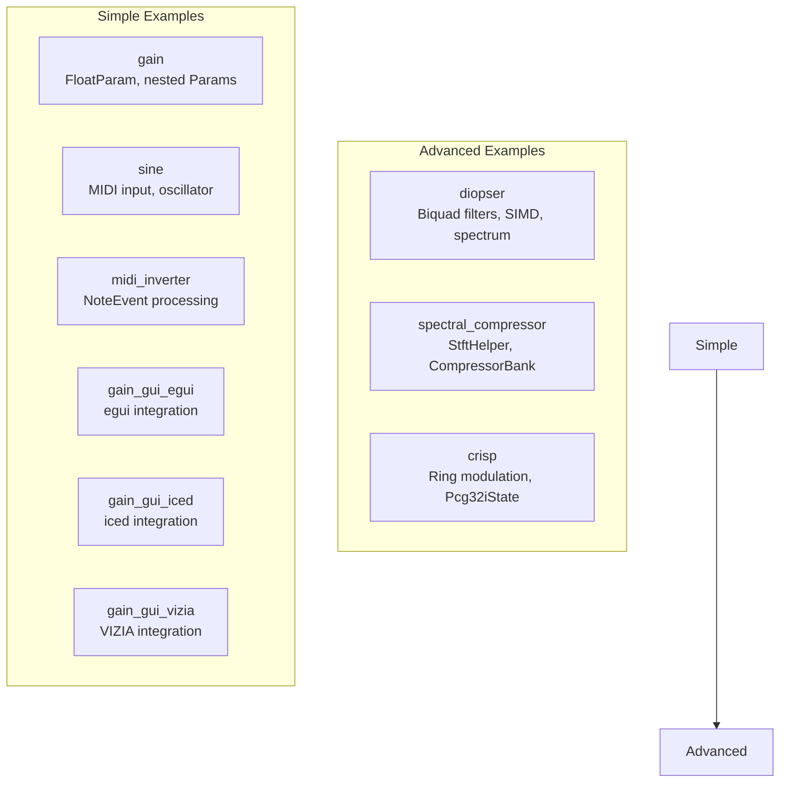

Sources:

* [Cargo.toml L25-L46](https://github.com/robbert-vdh/nih-plug/blob/28b149ec/Cargo.toml#L25-L46)
* [README.md L192-L224](https://github.com/robbert-vdh/nih-plug/blob/28b149ec/README.md#L192-L224)
* [plugins/examples/gain/src/lib.rs L1-L215](https://github.com/robbert-vdh/nih-plug/blob/28b149ec/plugins/examples/gain/src/lib.rs#L1-L215)
* [plugins/examples/sine/src/lib.rs L1-L231](https://github.com/robbert-vdh/nih-plug/blob/28b149ec/plugins/examples/sine/src/lib.rs#L1-L231)
* [plugins/examples/midi_inverter/src/lib.rs L1-L183](https://github.com/robbert-vdh/nih-plug/blob/28b149ec/plugins/examples/midi_inverter/src/lib.rs#L1-L183)
* [plugins/diopser/src/lib.rs L1-L363](https://github.com/robbert-vdh/nih-plug/blob/28b149ec/plugins/diopser/src/lib.rs#L1-L363)
* [plugins/spectral_compressor/src/lib.rs L1-L649](https://github.com/robbert-vdh/nih-plug/blob/28b149ec/plugins/spectral_compressor/src/lib.rs#L1-L649)
* [plugins/crisp/src/lib.rs L1-L515](https://github.com/robbert-vdh/nih-plug/blob/28b149ec/plugins/crisp/src/lib.rs#L1-L515)

## Common Plugin Architecture Pattern

All example plugins implement the `Plugin` trait and use the `nih_export_clap!()` and `nih_export_vst3!()` macros to generate format-specific entry points. This architecture allows a single plugin implementation to target multiple plugin formats.

**Plugin Trait Implementation Pattern**

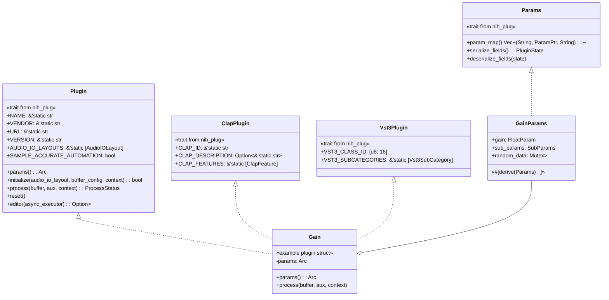

Sources:

* [src/plugin.rs L1-L500](https://github.com/robbert-vdh/nih-plug/blob/28b149ec/src/plugin.rs#L1-L500)
* [plugins/examples/gain/src/lib.rs L5-L36](https://github.com/robbert-vdh/nih-plug/blob/28b149ec/plugins/examples/gain/src/lib.rs#L5-L36)
* [plugins/examples/gain/src/lib.rs L113-L191](https://github.com/robbert-vdh/nih-plug/blob/28b149ec/plugins/examples/gain/src/lib.rs#L113-L191)
* [plugins/examples/sine/src/lib.rs L7-L24](https://github.com/robbert-vdh/nih-plug/blob/28b149ec/plugins/examples/sine/src/lib.rs#L7-L24)
* [plugins/examples/sine/src/lib.rs L100-L203](https://github.com/robbert-vdh/nih-plug/blob/28b149ec/plugins/examples/sine/src/lib.rs#L100-L203)

## Simple Examples

This section covers basic example plugins that demonstrate core NIH-plug concepts without complex DSP.

### Gain Plugin

The `gain` example demonstrates fundamental parameter handling, state persistence, and nested parameter groups. It is the simplest useful plugin in the repository.

**Plugin Structure:**

The `Gain` struct contains an `Arc<GainParams>` reference to parameters. The `GainParams` struct uses the `#[derive(Params)]` macro to automatically implement the `Params` trait.

**Parameter Organization:**

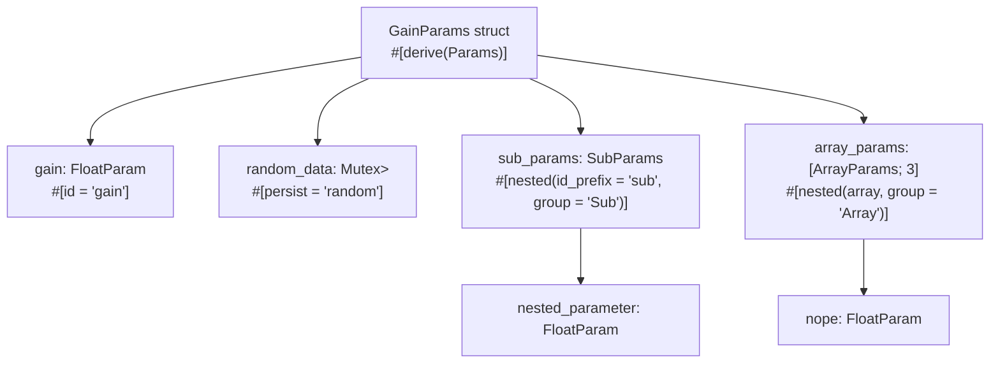

**Processing:**

The `process()` method iterates over the buffer and multiplies each sample by the smoothed gain value:

```javascript
for mut channel_samples in buffer.iter_samples() {
    let gain = self.params.gain.smoothed.next();
    for sample in channel_samples {
        *sample *= gain;
    }
}
```

Sources:

* [plugins/examples/gain/src/lib.rs L5-L36](https://github.com/robbert-vdh/nih-plug/blob/28b149ec/plugins/examples/gain/src/lib.rs#L5-L36)
* [plugins/examples/gain/src/lib.rs L38-L109](https://github.com/robbert-vdh/nih-plug/blob/28b149ec/plugins/examples/gain/src/lib.rs#L38-L109)
* [plugins/examples/gain/src/lib.rs L171-L188](https://github.com/robbert-vdh/nih-plug/blob/28b149ec/plugins/examples/gain/src/lib.rs#L171-L188)

### Sine Test Tone Generator

The `sine` plugin generates test tones and demonstrates oscillator implementation, MIDI input handling, and the `NoteEvent` API.

**Plugin Struct:**

```yaml
pub struct Sine {
    params: Arc<SineParams>,
    sample_rate: f32,
    phase: f32,
    // MIDI note tracking
    midi_note_id: u8,
    midi_note_freq: f32,
    midi_note_gain: f32,
}
```

**Oscillator Implementation:**

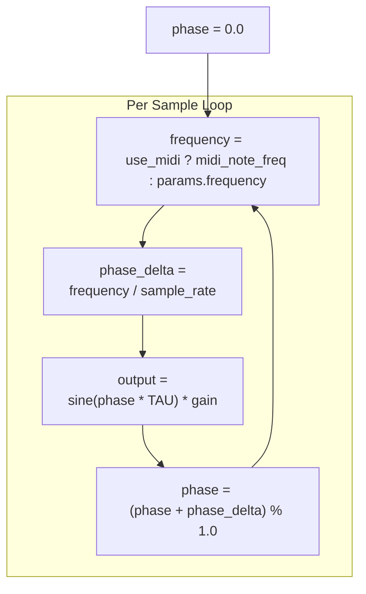

**MIDI Handling:**

The plugin processes `NoteEvent::NoteOn` and `NoteEvent::NoteOff` events from `context.next_event()`, converting MIDI note numbers to frequencies using `util::midi_note_to_freq()`.

Sources:

* [plugins/examples/sine/src/lib.rs L7-L24](https://github.com/robbert-vdh/nih-plug/blob/28b149ec/plugins/examples/sine/src/lib.rs#L7-L24)
* [plugins/examples/sine/src/lib.rs L26-L97](https://github.com/robbert-vdh/nih-plug/blob/28b149ec/plugins/examples/sine/src/lib.rs#L26-L97)
* [plugins/examples/sine/src/lib.rs L150-L201](https://github.com/robbert-vdh/nih-plug/blob/28b149ec/plugins/examples/sine/src/lib.rs#L150-L201)

### MIDI Inverter

The `midi_inverter` plugin demonstrates how to receive and output MIDI/note events. It inverts MIDI note numbers, channels, velocities, and CC values.

**Event Processing:**

The plugin iterates through incoming events using `context.next_event()` and outputs transformed events using `context.send_event()`:

```javascript
while let Some(event) = context.next_event() {
    match event {
        NoteEvent::NoteOn { note, velocity, .. } => {
            let inverted_note = 127 - note;
            let inverted_velocity = 1.0 - velocity;
            context.send_event(NoteEvent::NoteOn {
                note: inverted_note,
                velocity: inverted_velocity,
                ...
            });
        }
        // Handle other event types...
    }
}
```

Sources:

* [plugins/examples/midi_inverter/src/lib.rs L1-L183](https://github.com/robbert-vdh/nih-plug/blob/28b149ec/plugins/examples/midi_inverter/src/lib.rs#L1-L183)

### GUI Examples

Three variants of the gain plugin demonstrate different GUI framework integrations:

| Plugin | Framework | File Location |
| --- | --- | --- |
| `gain_gui_egui` | egui | [plugins/examples/gain_gui_egui/](https://github.com/robbert-vdh/nih-plug/blob/28b149ec/plugins/examples/gain_gui_egui/) |
| `gain_gui_iced` | iced | [plugins/examples/gain_gui_iced/](https://github.com/robbert-vdh/nih-plug/blob/28b149ec/plugins/examples/gain_gui_iced/) |
| `gain_gui_vizia` | VIZIA | [plugins/examples/gain_gui_vizia/](https://github.com/robbert-vdh/nih-plug/blob/28b149ec/plugins/examples/gain_gui_vizia/) |

Each variant implements the `Editor` trait using framework-specific adapters (`nih_plug_egui`, `nih_plug_iced`, `nih_plug_vizia`) and demonstrates parameter binding to GUI widgets.

**VIZIA Example:**

The `gain_gui_vizia` plugin uses `nih_plug_vizia::create_vizia_editor()` to create an editor with VIZIA-specific widgets like `ParamSlider`:

```rust
fn editor(&mut self, _async_executor: AsyncExecutor<Self>) -> Option<Box<dyn Editor>> {
    create_vizia_editor(self.params.editor_state.clone(), |cx, _| {
        ParamSlider::new(cx, Data::params, |params| &params.gain);
    })
}
```

Sources:

* [plugins/examples/gain_gui_egui/src/lib.rs L1-L150](https://github.com/robbert-vdh/nih-plug/blob/28b149ec/plugins/examples/gain_gui_egui/src/lib.rs#L1-L150)
* [plugins/examples/gain_gui_iced/src/lib.rs L1-L200](https://github.com/robbert-vdh/nih-plug/blob/28b149ec/plugins/examples/gain_gui_iced/src/lib.rs#L1-L200)
* [plugins/examples/gain_gui_vizia/src/lib.rs L1-L120](https://github.com/robbert-vdh/nih-plug/blob/28b149ec/plugins/examples/gain_gui_vizia/src/lib.rs#L1-L120)
* [README.md L200-L208](https://github.com/robbert-vdh/nih-plug/blob/28b149ec/README.md#L200-L208)

## Advanced Example Plugins

## Diopser Plugin

Diopser is a phase rotation plugin that uses cascaded all-pass filters to modify the phase response without affecting magnitude. It demonstrates SIMD processing, filter design, spectrum analysis, and safe-mode parameter clamping.

**Plugin Architecture:**

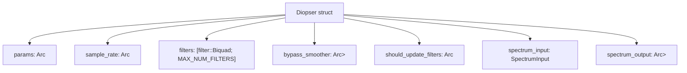

**Key Features:**

* **SIMD Processing**: Uses `f32x2` from `std::simd` to process both stereo channels simultaneously
* **Configurable Filter Chain**: Up to `MAX_NUM_FILTERS` (16) all-pass filters controlled by `filter_stages` parameter
* **Spread Control**: Distributes filter frequencies using octave or linear spread
* **Safe Mode**: `SafeModeClamper` prevents extreme parameter combinations
* **Spectrum Visualization**: Real-time FFT analysis sent to GUI via `SpectrumOutput`

**Processing Flow:**

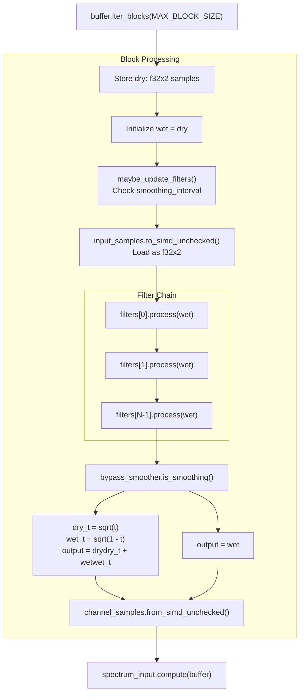

**Filter Coefficient Calculation:**

The `update_filters()` method computes `BiquadCoefficients::allpass()` for each filter based on:

* Base frequency from `filter_frequency` parameter
* Per-filter frequency offset from `filter_spread_octaves` and `filter_spread_style` (Octaves or Linear)
* Q factor from `filter_resonance` parameter

The spread calculation for octave mode:

```
filter_frequency * 2.0f32.powf(spread_octaves * filter_proportion)
```

where `filter_proportion` ranges from -1.0 to 1.0 across the filter stages.

**SIMD Optimization:**

Processing uses `f32x2` vectors to handle both stereo channels in one operation:

```javascript
let mut samples: f32x2 = unsafe { input_samples.to_simd_unchecked() };
for filter in filters.iter_mut().take(num_stages) {
    samples = filter.process(samples);
}
```

Sources:

* [plugins/diopser/src/lib.rs L17-L41](https://github.com/robbert-vdh/nih-plug/blob/28b149ec/plugins/diopser/src/lib.rs#L17-L41)
* [plugins/diopser/src/lib.rs L42-L103](https://github.com/robbert-vdh/nih-plug/blob/28b149ec/plugins/diopser/src/lib.rs#L42-L103)
* [plugins/diopser/src/lib.rs L178-L254](https://github.com/robbert-vdh/nih-plug/blob/28b149ec/plugins/diopser/src/lib.rs#L178-L254)
* [plugins/diopser/src/lib.rs L257-L336](https://github.com/robbert-vdh/nih-plug/blob/28b149ec/plugins/diopser/src/lib.rs#L257-L336)
* [plugins/diopser/src/filter.rs L1-L100](https://github.com/robbert-vdh/nih-plug/blob/28b149ec/plugins/diopser/src/filter.rs#L1-L100)

## Spectral Compressor Plugin

Spectral Compressor performs dynamics processing in the frequency domain using FFT, allowing independent compression of each frequency bin. It demonstrates the `StftHelper` API, complex parameter curves, and sidechain processing.

**Plugin Architecture:**

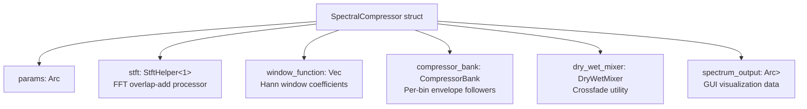

**STFT Processing:**

The plugin uses `StftHelper` to perform overlap-add FFT processing:

```
self.stft.process_overlap_add(buffer, overlap_times, |channel_idx, real_fft_buffer| {
    // Apply window function
    for (bin, window_value) in real_fft_buffer.iter_mut().zip(&self.window_function) {
        *bin *= window_value;
    }
    
    // Process in frequency domain
    self.process_frequency_bin(channel_idx, real_fft_buffer);
});
```

**Compressor Bank:**

The `CompressorBank` struct maintains envelope followers for each frequency bin:

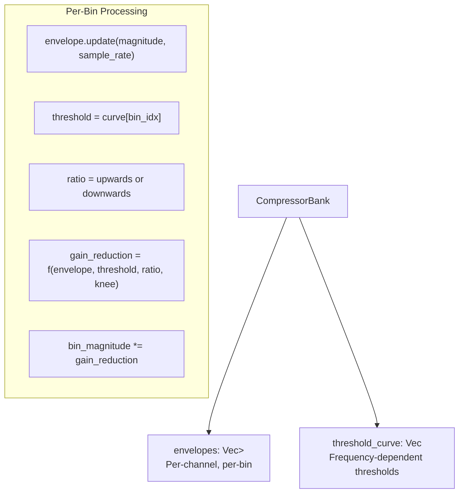

**Threshold Curve:**

The threshold curve is calculated using parametric control points:

```javascript
fn compute_threshold_curve(params: &ThresholdParams) -> Vec<f32> {
    // Create curve with center frequency, threshold offset, and curve shape
    let curve_values = logarithmic_curve(
        params.center_frequency,
        params.threshold_offset_db,
        params.curve_slope
    );
    curve_values
}
```

**Sidechain Processing:**

When sidechain mode is enabled, the plugin analyzes the sidechain input to drive compression on the main signal:

```javascript
if params.mode == SidechainMode::Match {
    // Analyze sidechain spectrum
    let sidechain_magnitudes = analyze_sidechain(aux.inputs[0]);
    
    // Drive compressor with sidechain levels
    compressor_bank.update_from_sidechain(sidechain_magnitudes);
}
```

**Processing Flow:**

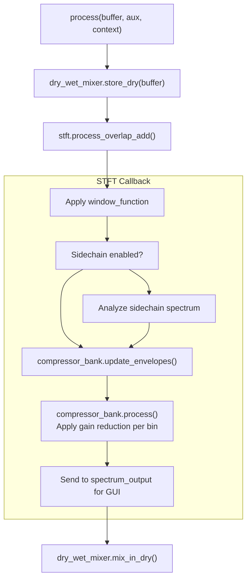

Sources:

* [plugins/spectral_compressor/src/lib.rs L55-L117](https://github.com/robbert-vdh/nih-plug/blob/28b149ec/plugins/spectral_compressor/src/lib.rs#L55-L117)
* [plugins/spectral_compressor/src/lib.rs L393-L508](https://github.com/robbert-vdh/nih-plug/blob/28b149ec/plugins/spectral_compressor/src/lib.rs#L393-L508)
* [plugins/spectral_compressor/src/compressor_bank.rs L1-L300](https://github.com/robbert-vdh/nih-plug/blob/28b149ec/plugins/spectral_compressor/src/compressor_bank.rs#L1-L300)

## Crisp Plugin

Crisp adds harmonic content to signals using ring modulation with filtered noise. It demonstrates custom random number generation (PCG), biquad filter design, and enum parameters for mode selection.

**Plugin Architecture:**

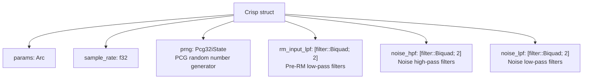

**Key Features:**

* **Ring Modulation Modes**: `Mode` enum with `Soggy`, `Crispy`, and `CrispyNegated` variants
* **Stereo Modes**: `StereoMode` enum controls mono vs. stereo noise generation
* **Deterministic Noise**: Uses `INITIAL_PRNG_SEED` constant for reproducible bounces
* **Filter Chain**: Configurable low-pass on input and high-pass/low-pass on noise

**Noise Generation:**

The plugin implements PCG (Permuted Congruential Generator) for fast, high-quality random numbers:

```javascript
fn gen_noise(&mut self, channel: usize) -> f32 {
    let noise = self.prng.next_f32() * 2.0 - 1.0;  // -1.0 to 1.0 range
    let high_passed = self.noise_hpf[channel].process(noise);
    self.noise_lpf[channel].process(high_passed)
}
```

**Ring Modulation Modes:**

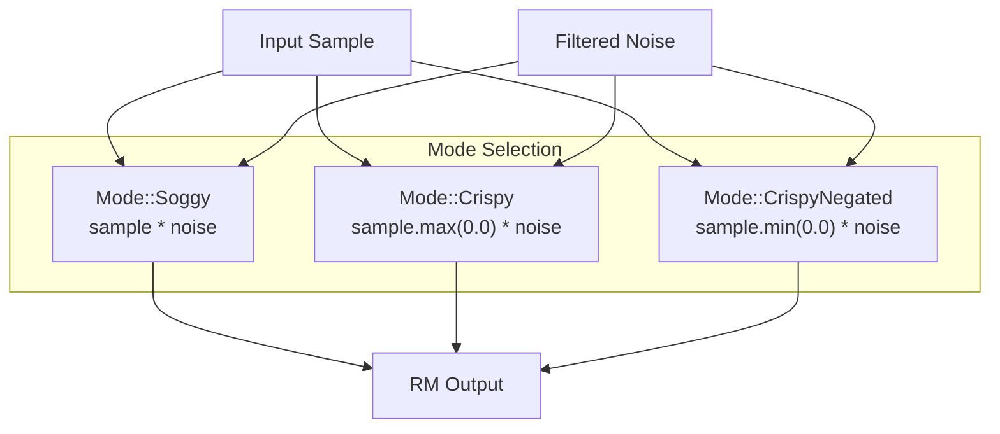

**Processing Flow:**

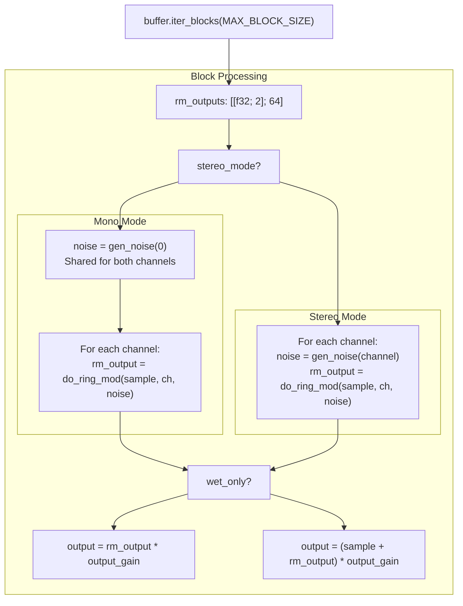

**Filter Coefficient Updates:**

Filters are updated when their parameters are smoothing:

```rust
fn maybe_update_filters(&mut self) {
    if self.params.rm_input_lpf_freq.smoothed.is_smoothing()
        || self.params.rm_input_lpf_q.smoothed.is_smoothing()
    {
        self.update_rm_input_lpf();
    }
    // Similar for noise_hpf and noise_lpf
}
```

Each update method computes new `BiquadCoefficients` and assigns them to the filter array.

Sources:

* [plugins/crisp/src/lib.rs L17-L33](https://github.com/robbert-vdh/nih-plug/blob/28b149ec/plugins/crisp/src/lib.rs#L17-L33)
* [plugins/crisp/src/lib.rs L42-L58](https://github.com/robbert-vdh/nih-plug/blob/28b149ec/plugins/crisp/src/lib.rs#L42-L58)
* [plugins/crisp/src/lib.rs L106-L129](https://github.com/robbert-vdh/nih-plug/blob/28b149ec/plugins/crisp/src/lib.rs#L106-L129)
* [plugins/crisp/src/lib.rs L355-L417](https://github.com/robbert-vdh/nih-plug/blob/28b149ec/plugins/crisp/src/lib.rs#L355-L417)
* [plugins/crisp/src/lib.rs L419-L487](https://github.com/robbert-vdh/nih-plug/blob/28b149ec/plugins/crisp/src/lib.rs#L419-L487)
* [plugins/crisp/src/pcg.rs L1-L50](https://github.com/robbert-vdh/nih-plug/blob/28b149ec/plugins/crisp/src/pcg.rs#L1-L50)

## Common Implementation Patterns

### Plugin and Parameter Structure

All NIH-plug example plugins follow a similar structure:

1. Define a plugin struct that holds parameters and processing state
2. Define a parameter struct that implements the `Params` trait
3. Implement required traits: `Plugin`, `ClapPlugin`, and `Vst3Plugin`
4. Export the plugin using the macros: `nih_export_clap!` and `nih_export_vst3!`

```rust
Table: Common Plugin Structure Components

| Component                | Purpose                                                  |
|--------------------------|----------------------------------------------------------|
| Plugin struct            | Holds plugin state and parameter references              |
| Params struct            | Defines parameters with ranges, formatters, and defaults |
| Plugin trait impl        | Core functionality: process, initialize, reset, etc.     |
| Format-specific traits   | Add metadata for specific plugin formats                 |
| Export macros            | Generate format-specific entry points                    |
```

Sources:

* [plugins/examples/sine/src/lib.rs L7-L24](https://github.com/robbert-vdh/nih-plug/blob/28b149ec/plugins/examples/sine/src/lib.rs#L7-L24)  - Sine plugin structure
* [plugins/examples/gain/src/lib.rs L5-L36](https://github.com/robbert-vdh/nih-plug/blob/28b149ec/plugins/examples/gain/src/lib.rs#L5-L36)  - Gain plugin structure
* [plugins/diopser/src/lib.rs L42-L73](https://github.com/robbert-vdh/nih-plug/blob/28b149ec/plugins/diopser/src/lib.rs#L42-L73)  - Diopser plugin structure
* [plugins/spectral_compressor/src/lib.rs L55-L84](https://github.com/robbert-vdh/nih-plug/blob/28b149ec/plugins/spectral_compressor/src/lib.rs#L55-L84)  - Spectral Compressor structure
* [plugins/crisp/src/lib.rs L42-L58](https://github.com/robbert-vdh/nih-plug/blob/28b149ec/plugins/crisp/src/lib.rs#L42-L58)  - Crisp plugin structure

### Audio Processing Patterns

The example plugins demonstrate different audio processing approaches:

1. **Sample-by-sample processing** (Sine, Gain)
2. **Block-based processing** (Crisp, Diopser)
3. **FFT-based spectral processing** (Spectral Compressor)

All processing is implemented in the `process` method, which takes a buffer of audio samples, auxiliary buffers, and a processing context.

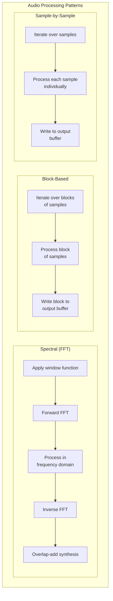

Sources:

* [plugins/examples/sine/src/lib.rs L150-L202](https://github.com/robbert-vdh/nih-plug/blob/28b149ec/plugins/examples/sine/src/lib.rs#L150-L202)  - Sine processing
* [plugins/examples/gain/src/lib.rs L171-L187](https://github.com/robbert-vdh/nih-plug/blob/28b149ec/plugins/examples/gain/src/lib.rs#L171-L187)  - Gain processing
* [plugins/diopser/src/lib.rs L178-L254](https://github.com/robbert-vdh/nih-plug/blob/28b149ec/plugins/diopser/src/lib.rs#L178-L254)  - Diopser processing
* [plugins/spectral_compressor/src/lib.rs L393-L508](https://github.com/robbert-vdh/nih-plug/blob/28b149ec/plugins/spectral_compressor/src/lib.rs#L393-L508)  - Spectral Compressor processing
* [plugins/crisp/src/lib.rs L355-L416](https://github.com/robbert-vdh/nih-plug/blob/28b149ec/plugins/crisp/src/lib.rs#L355-L416)  - Crisp processing

## Export Mechanism

All example plugins use the NIH-plug export macros to generate format-specific entry points:

```
// Export plugin in both CLAP and VST3 formats
nih_export_clap!(PluginStruct);
nih_export_vst3!(PluginStruct);
```

This allows a single plugin implementation to be compiled for multiple plugin formats.

Sources:

* [plugins/examples/sine/src/lib.rs L229-L230](https://github.com/robbert-vdh/nih-plug/blob/28b149ec/plugins/examples/sine/src/lib.rs#L229-L230)
* [plugins/examples/gain/src/lib.rs L213-L214](https://github.com/robbert-vdh/nih-plug/blob/28b149ec/plugins/examples/gain/src/lib.rs#L213-L214)
* [plugins/diopser/src/lib.rs L361-L362](https://github.com/robbert-vdh/nih-plug/blob/28b149ec/plugins/diopser/src/lib.rs#L361-L362)
* [plugins/spectral_compressor/src/lib.rs L647-L648](https://github.com/robbert-vdh/nih-plug/blob/28b149ec/plugins/spectral_compressor/src/lib.rs#L647-L648)
* [plugins/crisp/src/lib.rs L513-L514](https://github.com/robbert-vdh/nih-plug/blob/28b149ec/plugins/crisp/src/lib.rs#L513-L514)