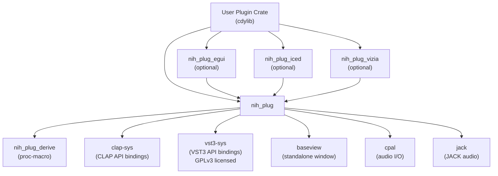
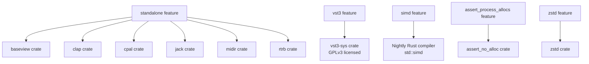
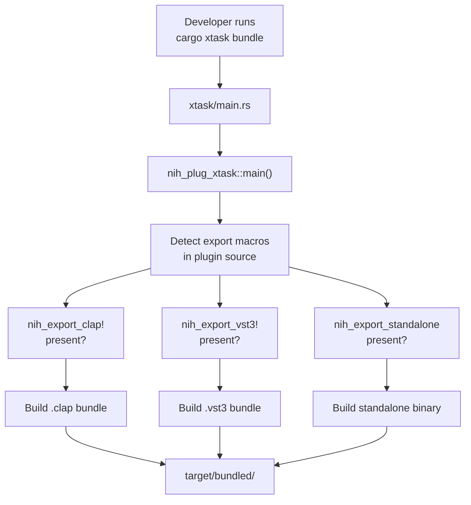

# Installation and Setup

> **Relevant source files**
> * [Cargo.lock](https://github.com/robbert-vdh/nih-plug/blob/28b149ec/Cargo.lock)
> * [Cargo.toml](https://github.com/robbert-vdh/nih-plug/blob/28b149ec/Cargo.toml)
> * [README.md](https://github.com/robbert-vdh/nih-plug/blob/28b149ec/README.md)

This page covers the initial setup and configuration required to start developing audio plugins with NIH-plug. It explains how to install dependencies, configure your project's `Cargo.toml`, understand feature flags, and set up the build system.

For information about the overall project structure and how the different crates relate to each other, see [Project Structure](/robbert-vdh/nih-plug/1.2-project-structure). For details on the build system and bundling process, see [Build System and Bundling](/robbert-vdh/nih-plug/1.3-build-system-and-bundling).

---

## Prerequisites

### Rust Toolchain

NIH-plug requires Rust version **1.80 or later**. The framework is designed to work with the stable Rust compiler, with the exception of the optional `simd` feature which requires nightly.

**Sources:** [Cargo.toml L5](https://github.com/robbert-vdh/nih-plug/blob/28b149ec/Cargo.toml#L5-L5)

To install Rust, use [rustup](https://rustup.rs/):

```
curl --proto '=https' --tlsv1.2 -sSf https://sh.rustup.rs | sh
```

Verify your installation:

```go
rustc --version  # Should be 1.80.0 or later
cargo --version
```

### Platform Support

NIH-plug has been tested on:

* **Linux** - Full support
* **Windows** - Full support (primarily tested through Wine with yabridge)
* **macOS** - Limited testing, may require disabling Gatekeeper

**Sources:** [README.md L165-L167](https://github.com/robbert-vdh/nih-plug/blob/28b149ec/README.md#L165-L167)

---

## Adding NIH-plug as a Dependency

### Basic Dependency Configuration

Create a new Rust library project or add NIH-plug to an existing one:

```css
[package]
name = "my_plugin"
version = "0.1.0"
edition = "2021"

[lib]
crate-type = ["cdylib"]  # Required for plugin exports

[dependencies]
nih_plug = { git = "https://github.com/robbert-vdh/nih-plug" }
```

The `cdylib` crate type is essential as it produces a dynamic library that plugin hosts can load.

**Sources:** [Cargo.toml L1-L11](https://github.com/robbert-vdh/nih-plug/blob/28b149ec/Cargo.toml#L1-L11)

### Dependency Hierarchy



**Sources:** [Cargo.toml L49-L118](https://github.com/robbert-vdh/nih-plug/blob/28b149ec/Cargo.toml#L49-L118)

---

## Feature Flags

NIH-plug uses Cargo features to enable optional functionality. Understanding these flags is crucial for configuring your plugin correctly.

### Feature Flag Reference

| Feature | Default | Description | License Impact |
| --- | --- | --- | --- |
| `vst3` | **Yes** | Enables `nih_export_vst3!()` macro | **GPLv3** due to `vst3-sys` |
| `standalone` | No | Enables `nih_export_standalone()` for standalone binaries with JACK/CPAL support | ISC |
| `assert_process_allocs` | No | Terminates plugin when allocations occur in `process()` during debug builds | ISC |
| `simd` | No | Adds SIMD adapters to `Buffer` object | ISC, **requires nightly** |
| `zstd` | No | Compresses plugin state using Zstandard (backward compatible with uncompressed) | ISC |

**Sources:** [Cargo.toml L49-L73](https://github.com/robbert-vdh/nih-plug/blob/28b149ec/Cargo.toml#L49-L73)

 [README.md L226-L234](https://github.com/robbert-vdh/nih-plug/blob/28b149ec/README.md#L226-L234)

### VST3 Licensing Consideration

The `vst3` feature is enabled by default but has **GPL licensing implications**. If you are developing a commercial plugin that cannot comply with GPLv3, you must disable this feature:

```
[dependencies]
nih_plug = { git = "https://github.com/robbert-vdh/nih-plug", default-features = false }
```

This removes VST3 support but allows CLAP and standalone exports under the ISC license.

**Sources:** [README.md L226-L234](https://github.com/robbert-vdh/nih-plug/blob/28b149ec/README.md#L226-L234)

 [Cargo.toml L61-L65](https://github.com/robbert-vdh/nih-plug/blob/28b149ec/Cargo.toml#L61-L65)

### Feature Configuration Examples

**Minimal CLAP-only plugin (no GPL dependencies):**

```
[dependencies]
nih_plug = { git = "https://github.com/robbert-vdh/nih-plug", default-features = false }
```

**VST3 + CLAP with standalone support:**

```
[dependencies]
nih_plug = { git = "https://github.com/robbert-vdh/nih-plug", features = ["standalone"] }
```

**Development build with allocation checking:**

```
[dependencies]
nih_plug = { git = "https://github.com/robbert-vdh/nih-plug", features = ["assert_process_allocs"] }
```

**Nightly build with SIMD and compression:**

```
[dependencies]
nih_plug = { git = "https://github.com/robbert-vdh/nih-plug", features = ["simd", "zstd"] }
```

**Sources:** [Cargo.toml L49-L118](https://github.com/robbert-vdh/nih-plug/blob/28b149ec/Cargo.toml#L49-L118)

### Feature Dependencies Diagram



**Sources:** [Cargo.toml L56-L118](https://github.com/robbert-vdh/nih-plug/blob/28b149ec/Cargo.toml#L56-L118)

---

## Build Tools Setup

NIH-plug provides two complementary build tools: `nih_plug_xtask` and `cargo-nih-plug`. These tools automate the process of detecting plugin formats and creating proper bundles.

### Workspace Integration with nih_plug_xtask

The recommended approach is to add `nih_plug_xtask` as a workspace member. This provides the `cargo xtask bundle` command.

**Typical workspace structure:**

```markdown
[workspace]
resolver = "2"
members = [
    "xtask",           # Build tool integration
    "plugins/my_plugin",
]

[profile.release]
lto = "thin"
strip = "symbols"

[profile.profiling]
inherits = "release"
debug = true
strip = "none"
```

**Sources:** [Cargo.toml L13-L147](https://github.com/robbert-vdh/nih-plug/blob/28b149ec/Cargo.toml#L13-L147)

**Create `xtask/Cargo.toml`:**

```
[package]
name = "xtask"
version = "0.1.0"
edition = "2021"

[dependencies]
nih_plug_xtask = { git = "https://github.com/robbert-vdh/nih-plug" }
```

**Create `xtask/src/main.rs`:**

```rust
fn main() -> nih_plug_xtask::Result<()> {
    nih_plug_xtask::main()
}
```

### Build Tool Command Flow



**Sources:** [README.md L157-L164](https://github.com/robbert-vdh/nih-plug/blob/28b149ec/README.md#L157-L164)

 [README.md L179-L190](https://github.com/robbert-vdh/nih-plug/blob/28b149ec/README.md#L179-L190)

### Global cargo-nih-plug Installation (Optional)

For convenience, you can install `cargo-nih-plug` globally:

```go
cargo install --git https://github.com/robbert-vdh/nih-plug cargo-nih-plug
```

This provides the `cargo nih-plug` subcommand that can be used from any directory without workspace setup.

**Sources:** [README.md L162-L164](https://github.com/robbert-vdh/nih-plug/blob/28b149ec/README.md#L162-L164)

---

## First Plugin Compilation

### Building Example Plugins

To verify your setup, compile one of the example plugins:

```go
# Clone the repository
git clone https://github.com/robbert-vdh/nih-plug
cd nih-plug

# Build the gain example plugin
cargo xtask bundle gain --release
```

**Sources:** [README.md L175-L181](https://github.com/robbert-vdh/nih-plug/blob/28b149ec/README.md#L175-L181)

### Build Command Syntax

```go
cargo xtask bundle <package> [cargo_options]
```

**Common options:**

* `--release` - Build optimized release version
* `--target <triple>` - Cross-compile for specific target
* `--features <features>` - Enable specific features

**Examples:**

```python
# Debug build with allocation checking
cargo xtask bundle my_plugin --features assert_process_allocs

# Release build for Windows (from Linux)
cargo xtask bundle my_plugin --release --target x86_64-pc-windows-gnu

# Build with standalone support
cargo xtask bundle my_plugin --release --features standalone
```

**Sources:** [README.md L179-L181](https://github.com/robbert-vdh/nih-plug/blob/28b149ec/README.md#L179-L181)

### Output Artifacts

The `cargo xtask bundle` command creates plugin bundles in `target/bundled/`:

```markdown
target/
└── bundled/
    ├── my_plugin.clap          # CLAP plugin (Linux)
    ├── my_plugin.vst3/         # VST3 bundle (all platforms)
    │   └── Contents/
    │       └── x86_64-linux/
    │           └── my_plugin.so
    └── my_plugin               # Standalone binary
```

**Platform-specific bundle formats:**

* **Linux:** `.clap` file, `.vst3` directory, standalone ELF binary
* **Windows:** `.clap` file, `.vst3` directory, standalone `.exe`
* **macOS:** `.clap` file, `.vst3` bundle, standalone app bundle

**Sources:** [README.md L183-L190](https://github.com/robbert-vdh/nih-plug/blob/28b149ec/README.md#L183-L190)

---

## Development Environment Considerations

### Debug vs. Release Builds

**Debug builds** (without `--release`):

* Include debug symbols
* No optimization (slow audio processing)
* Stack traces on panic
* `assert_process_allocs` feature active if enabled

**Release builds** (with `--release`):

* Optimized code (essential for real-time audio)
* Symbols stripped by default
* Thin LTO enabled
* `assert_process_allocs` inactive

**Sources:** [Cargo.toml L140-L147](https://github.com/robbert-vdh/nih-plug/blob/28b149ec/Cargo.toml#L140-L147)

### Release Profile Configuration

The default release profile in NIH-plug projects is configured for optimal size and performance:

```markdown
[profile.release]
lto = "thin"          # Link-time optimization for better performance
strip = "symbols"      # Remove debug symbols for smaller binaries
```

For profiling, use the dedicated profile:

```markdown
[profile.profiling]
inherits = "release"
debug = true          # Include debug symbols
strip = "none"        # Don't strip symbols
```

**Sources:** [Cargo.toml L140-L147](https://github.com/robbert-vdh/nih-plug/blob/28b149ec/Cargo.toml#L140-L147)

### Platform-Specific Notes

#### macOS

Distributed plugins may require disabling Gatekeeper:

```python
# Remove quarantine attribute from downloaded plugins
xattr -cr /path/to/plugin.vst3
```

**Sources:** [README.md L37-L38](https://github.com/robbert-vdh/nih-plug/blob/28b149ec/README.md#L37-L38)

#### Linux

Ensure JACK development libraries are installed if using the `standalone` feature:

```markdown
# Debian/Ubuntu
sudo apt install libjack-jackd2-dev libasound2-dev

# Fedora
sudo dnf install jack-audio-connection-kit-devel alsa-lib-devel
```

#### Windows

VST3 plugins are tested primarily through Wine with yabridge. Native Windows builds are supported but less extensively tested.

**Sources:** [README.md L165-L167](https://github.com/robbert-vdh/nih-plug/blob/28b149ec/README.md#L165-L167)

### Allocation Checking in Development

The `assert_process_allocs` feature helps catch real-time safety violations during development:

```
[dependencies]
nih_plug = { git = "https://github.com/robbert-vdh/nih-plug", features = ["assert_process_allocs"] }
```

**Behavior:**

* **Debug builds only:** Plugin terminates if allocations occur in `Plugin::process()`
* Includes backtrace for identifying allocation source
* Panics may also trigger if using string formatting

**Note:** Disable this feature temporarily when debugging panics, as panic formatting itself may allocate.

**Sources:** [Cargo.toml L52-L56](https://github.com/robbert-vdh/nih-plug/blob/28b149ec/Cargo.toml#L52-L56)

 [README.md L52-L55](https://github.com/robbert-vdh/nih-plug/blob/28b149ec/README.md#L52-L55)

---

## Complete Setup Checklist

* Install Rust 1.80 or later
* Create new library crate with `crate-type = ["cdylib"]`
* Add `nih_plug` dependency with appropriate features
* Set up workspace with `xtask` member (or install `cargo-nih-plug` globally)
* Configure release profile for optimized builds
* Verify build with `cargo xtask bundle <plugin> --release`
* Install platform-specific audio dependencies if using `standalone` feature
* Review VST3 licensing implications if distributing commercially

**Sources:** [Cargo.toml L1-L147](https://github.com/robbert-vdh/nih-plug/blob/28b149ec/Cargo.toml#L1-L147)

 [README.md L171-L190](https://github.com/robbert-vdh/nih-plug/blob/28b149ec/README.md#L171-L190)