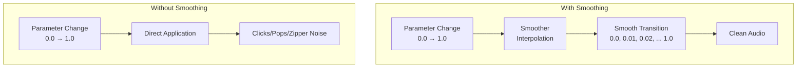
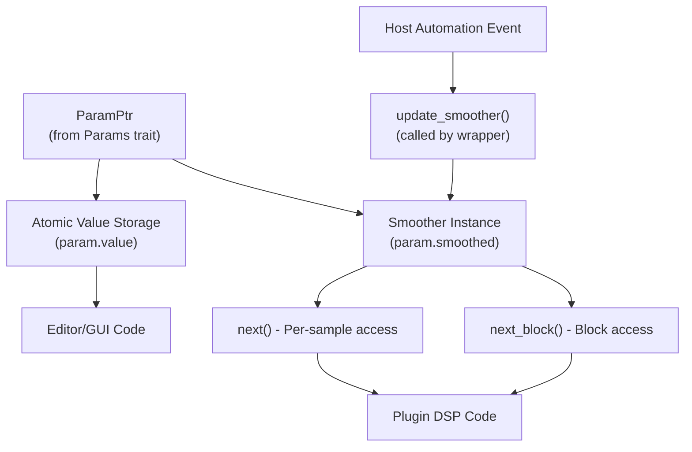
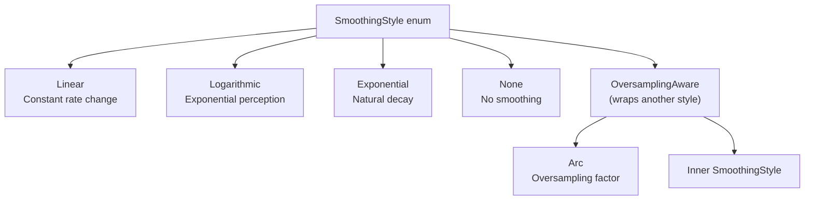
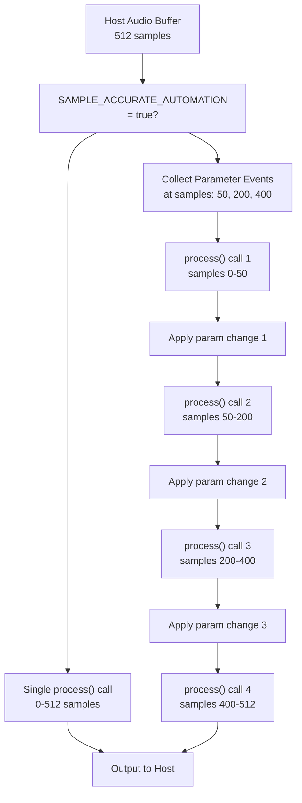
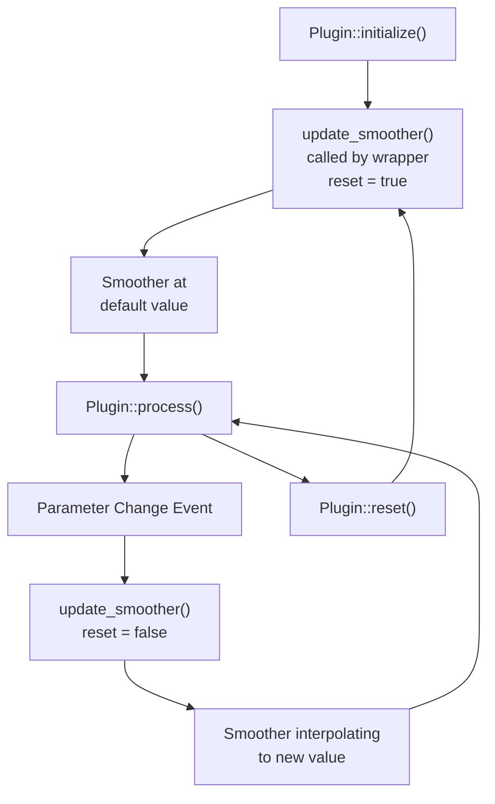
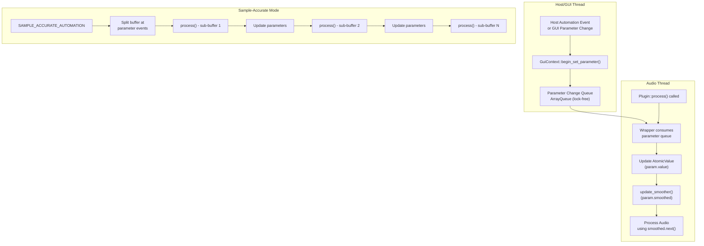

# Parameter Smoothing and Automation

> **Relevant source files**
> * [CHANGELOG.md](https://github.com/robbert-vdh/nih-plug/blob/28b149ec/CHANGELOG.md)
> * [nih_plug_derive/src/lib.rs](https://github.com/robbert-vdh/nih-plug/blob/28b149ec/nih_plug_derive/src/lib.rs)
> * [src/params.rs](https://github.com/robbert-vdh/nih-plug/blob/28b149ec/src/params.rs)
> * [src/wrapper/util.rs](https://github.com/robbert-vdh/nih-plug/blob/28b149ec/src/wrapper/util.rs)
> * [src/wrapper/util/buffer_management.rs](https://github.com/robbert-vdh/nih-plug/blob/28b149ec/src/wrapper/util/buffer_management.rs)
> * [src/wrapper/vst3.rs](https://github.com/robbert-vdh/nih-plug/blob/28b149ec/src/wrapper/vst3.rs)
> * [src/wrapper/vst3/factory.rs](https://github.com/robbert-vdh/nih-plug/blob/28b149ec/src/wrapper/vst3/factory.rs)
> * [src/wrapper/vst3/view.rs](https://github.com/robbert-vdh/nih-plug/blob/28b149ec/src/wrapper/vst3/view.rs)

## Purpose and Scope

This page documents NIH-plug's parameter smoothing system and sample-accurate automation capabilities. Parameter smoothing provides artifact-free transitions when parameter values change, while sample-accurate automation ensures precise timing of parameter changes synchronized to audio processing. This is essential for professional audio plugin development where abrupt parameter changes can cause audible clicks, pops, or zipper noise.

For information about the basic parameter system and parameter types, see [Parameter System](/robbert-vdh/nih-plug/2.2-parameter-system) and [Parameter Types and Derive Macros](/robbert-vdh/nih-plug/2.2.1-parameter-types-and-derive-macros). For general real-time safety concerns, see [Thread Safety and Real-time Constraints](/robbert-vdh/nih-plug/6.2-thread-safety-and-real-time-constraints).

---

## Why Parameter Smoothing is Needed

When a parameter value changes instantaneously (e.g., from user input or automation), applying that change directly to audio signals creates discontinuities that manifest as audible artifacts:

* **Clicks and pops**: Sudden amplitude changes create wideband transients
* **Zipper noise**: Rapid parameter changes at block boundaries create a characteristic "zipping" sound
* **Phase discontinuities**: Abrupt frequency changes in filters cause audible glitches

Parameter smoothing solves these problems by interpolating between the old and new values over a specified time period, creating smooth transitions that are inaudible or musically appropriate.

**Smoothing vs. Direct Access**



Sources: [CHANGELOG.md L643-L649](https://github.com/robbert-vdh/nih-plug/blob/28b149ec/CHANGELOG.md#L643-L649)

---

## The Smoother API

Each parameter type (`FloatParam`, `IntParam`) contains two fields for DSP code:

* `value`: An atomic field storing the current unsmoothed value
* `smoothed`: A `Smoother` instance that interpolates toward the target value

The `Smoother` type provides two primary usage patterns: per-sample smoothing and block smoothing.

**Smoother Data Flow**



Sources: [src/params.rs L65-L67](https://github.com/robbert-vdh/nih-plug/blob/28b149ec/src/params.rs#L65-L67)

 [src/params.rs L232](https://github.com/robbert-vdh/nih-plug/blob/28b149ec/src/params.rs#L232-L232)

### Per-Sample Smoothing

For processing that needs a smoothed value at every sample, use `Smoother::next()`:

```javascript
// In Plugin::process()
for sample in buffer.iter_samples() {
    let gain = self.params.gain.smoothed.next();
    for channel_sample in sample {
        *channel_sample *= gain;
    }
}
```

The `next()` method returns the next interpolated value and advances the smoother's internal state. Once the target value is reached, `next()` continues returning that value with minimal overhead.

### Block Smoothing

For efficiency when applying the same smoothed values to multiple channels or when processing can be vectorized, use block smoothing methods:

```javascript
// In Plugin::process()
let mut smoothed_values = [0.0f32; MAX_BLOCK_SIZE];
let num_samples = buffer.samples();

self.params.gain.smoothed.next_block(&mut smoothed_values[..num_samples], num_samples);

for (sample_idx, channel_samples) in buffer.iter_samples().enumerate() {
    let gain = smoothed_values[sample_idx];
    for channel_sample in channel_samples {
        *channel_sample *= gain;
    }
}
```

**Key Change (2022-07-06)**: The block smoothing API was reworked so smoothers no longer maintain internal buffers. Instead, the caller provides a mutable slice that the smoother fills. This design is more efficient when smoothing completes mid-block, allows smoother cloning without allocations, and gives plugins full control over buffer management.

Sources: [CHANGELOG.md L643-L649](https://github.com/robbert-vdh/nih-plug/blob/28b149ec/CHANGELOG.md#L643-L649)

### Mapped Block Smoothing

For parameters that require non-linear mapping (e.g., integer parameters, enum parameters, or modulated values), use the mapped variants:

```
self.params.frequency.smoothed.next_block_mapped(
    &mut smoothed_values[..num_samples],
    num_samples,
    |index, smoothed_float_value| {
        // Map smoothed value to actual frequency
        // index: position in the block
        // smoothed_float_value: the interpolated float value
        freq_range.unnormalize(smoothed_float_value)
    }
);
```

The mapping function is called for every sample in the block, even after smoothing completes. This ensures consistent behavior and makes it possible to smoothly modulate stepped parameters like integers.

Sources: [CHANGELOG.md L609-L617](https://github.com/robbert-vdh/nih-plug/blob/28b149ec/CHANGELOG.md#L609-L617)

---

## Smoothing Styles

NIH-plug provides multiple interpolation algorithms to suit different parameter types. The smoothing style is specified when creating a parameter:

**Smoothing Style Hierarchy**



Sources: [CHANGELOG.md L264-L275](https://github.com/robbert-vdh/nih-plug/blob/28b149ec/CHANGELOG.md#L264-L275)

### Linear Smoothing

Changes the parameter value at a constant rate. Suitable for parameters where perceptual uniformity is not critical:

```yaml
FloatParam::new(
    "Volume",
    0.5,
    FloatRange::Linear { min: 0.0, max: 1.0 }
)
.with_smoother(SmoothingStyle::Linear(50.0)) // 50ms smoothing time
```

### Logarithmic Smoothing

Follows a logarithmic curve, appropriate for frequency parameters where human perception is logarithmic:

```yaml
FloatParam::new(
    "Frequency",
    1000.0,
    FloatRange::Skewed { min: 20.0, max: 20000.0, factor: 0.25 }
)
.with_smoother(SmoothingStyle::Logarithmic(50.0))
```

### Exponential Smoothing

Follows an exponential decay curve, creating a natural-feeling transition similar to analog circuits:

```yaml
FloatParam::new(
    "Filter Cutoff",
    1000.0,
    FloatRange::Skewed { min: 20.0, max: 20000.0, factor: 0.25 }
)
.with_smoother(SmoothingStyle::Exponential(50.0))
```

### Oversampling-Aware Smoothing

When a plugin uses internal oversampling, smoothers must operate at the oversampled rate to maintain the same smoothing time. The `OversamplingAware` style wraps another smoothing style and multiplies the effective sample rate:

```javascript
// Shared oversampling factor (can be updated at runtime)
let oversampling_times = Arc::new(AtomicF32::new(1.0));

FloatParam::new("Gain", 0.5, FloatRange::Linear { min: 0.0, max: 1.0 })
    .with_smoother(SmoothingStyle::OversamplingAware(
        oversampling_times.clone(),
        Arc::new(SmoothingStyle::Linear(50.0))
    ))
```

Multiple parameters can share the same `Arc<AtomicF32>`, allowing a single oversampling amount to affect all smoothers simultaneously. This design supports runtime oversampling changes and allows different parameter groups to run at different effective rates.

**Breaking Change (2023-04-05)**: `SmoothingStyle::for_oversampling_factor()` was removed in favor of `OversamplingAware`. The new design is more flexible and allows runtime updates to oversampling amounts via shared atomic references.

Sources: [CHANGELOG.md L264-L275](https://github.com/robbert-vdh/nih-plug/blob/28b149ec/CHANGELOG.md#L264-L275)

---

## Sample-Accurate Automation

Sample-accurate automation ensures parameter changes occur at precise sample positions within a processing buffer, rather than only at buffer boundaries. This is critical for:

* Tight synchronization between automation and audio (e.g., filter sweeps matched to rhythm)
* Avoiding quantization of parameter timing to buffer sizes
* Proper handling of dense automation data

### The SAMPLE_ACCURATE_AUTOMATION Constant

Plugins opt into sample-accurate automation by setting a constant on the `Plugin` trait:

```javascript
impl Plugin for MyPlugin {
    const SAMPLE_ACCURATE_AUTOMATION: bool = true;
    
    // ... other trait items
}
```

When enabled, the wrapper splits processing buffers at parameter change events, calling `Plugin::process()` multiple times per host buffer if necessary.

**Sample-Accurate Automation Flow**



Sources: [CHANGELOG.md L232-L233](https://github.com/robbert-vdh/nih-plug/blob/28b149ec/CHANGELOG.md#L232-L233)

### How It Works

When `SAMPLE_ACCURATE_AUTOMATION` is enabled:

1. **Event Collection**: The wrapper collects all parameter change events for the current buffer
2. **Buffer Splitting**: The buffer is split into sub-buffers at each parameter change boundary
3. **Sequential Processing**: `Plugin::process()` is called once for each sub-buffer
4. **Parameter Updates**: Between calls, parameter values are updated to reflect automation

Each `process()` call receives a properly sized `Buffer` with `samples()` returning the sub-buffer length. Parameter smoothers operate normally within each sub-buffer.

**Implementation in Wrappers**

The buffer splitting is implemented in wrapper-specific code:

| Wrapper | Implementation Location |
| --- | --- |
| VST3 | [src/wrapper/vst3/wrapper.rs](https://github.com/robbert-vdh/nih-plug/blob/28b149ec/src/wrapper/vst3/wrapper.rs) <br>  - processes parameter events and splits buffers |
| CLAP | [src/wrapper/clap/wrapper.rs](https://github.com/robbert-vdh/nih-plug/blob/28b149ec/src/wrapper/clap/wrapper.rs) <br>  - uses CLAP's event iteration to split processing |
| Standalone | [src/wrapper/standalone/wrapper.rs](https://github.com/robbert-vdh/nih-plug/blob/28b149ec/src/wrapper/standalone/wrapper.rs) <br>  - emulates event-based splitting |

Sources: [src/wrapper/util.rs L189-L200](https://github.com/robbert-vdh/nih-plug/blob/28b149ec/src/wrapper/util.rs#L189-L200)

 [CHANGELOG.md L232-L233](https://github.com/robbert-vdh/nih-plug/blob/28b149ec/CHANGELOG.md#L232-L233)

### Performance Considerations

Sample-accurate automation has overhead:

* Multiple `process()` calls per buffer increase function call overhead
* More frequent smoother updates
* Potentially less effective CPU caching

For most plugins, this overhead is negligible. However, plugins that:

* Process simple operations (e.g., basic gain)
* Run on resource-constrained systems
* Prioritize maximum throughput over timing precision

...may prefer to disable sample-accurate automation and handle parameter updates at buffer boundaries only.

---

## Using Smoothers in DSP Code

### Basic Pattern

The typical pattern for using smoothers in DSP code:

```javascript
pub struct MyPlugin {
    params: Arc<MyParams>,
}

#[derive(Params)]
pub struct MyParams {
    #[id = "gain"]
    gain: FloatParam,
}

impl Plugin for MyPlugin {
    fn process(&mut self, buffer: &mut Buffer, context: &mut impl ProcessContext<Self>) -> ProcessStatus {
        for sample in buffer.iter_samples() {
            // Get smoothed value (automatically interpolates)
            let gain = self.params.gain.smoothed.next();
            
            for channel_sample in sample {
                *channel_sample *= gain;
            }
        }
        
        ProcessStatus::Normal
    }
}
```

### Accessing Unsmoothed Values

For display purposes (e.g., in a GUI), read the unsmoothed value directly:

```javascript
// In GUI code
let current_gain = params.gain.value(); // or params.gain.modulated_plain_value()
```

Do **not** use `smoothed.next()` in GUI code, as it advances the smoother state and would interfere with audio processing.

### Smoother Lifecycle

**Smoother State Management**



Sources: [src/params.rs L229-L233](https://github.com/robbert-vdh/nih-plug/blob/28b149ec/src/params.rs#L229-L233)

The wrapper automatically manages smoother state:

* **Initialization**: `update_smoother(sample_rate, reset: true)` called when plugin is activated
* **Parameter Changes**: `update_smoother(sample_rate, reset: false)` called when values change
* **Reset**: Smoothers are reset when `Plugin::reset()` is called

Plugins should **not** manually call `update_smoother()` unless implementing custom parameter handling.

---

## Oversampling Considerations

When implementing internal oversampling in a plugin, smoothers must be configured to operate at the oversampled rate. NIH-plug provides two approaches:

### Shared Oversampling Factor

Create a shared `Arc<AtomicF32>` that all smoothers reference:

```rust
pub struct MyPluginParams {
    // Shared reference updated when oversampling changes
    oversampling_times: Arc<AtomicF32>,
    
    #[id = "gain"]
    gain: FloatParam,
    
    #[id = "freq"]
    frequency: FloatParam,
}

impl MyPluginParams {
    pub fn new(oversampling_times: Arc<AtomicF32>) -> Self {
        Self {
            oversampling_times: oversampling_times.clone(),
            gain: FloatParam::new(
                "Gain",
                0.5,
                FloatRange::Linear { min: 0.0, max: 1.0 }
            )
            .with_smoother(SmoothingStyle::OversamplingAware(
                oversampling_times.clone(),
                Arc::new(SmoothingStyle::Linear(50.0))
            )),
            frequency: FloatParam::new(
                "Frequency", 
                1000.0,
                FloatRange::Skewed { min: 20.0, max: 20000.0, factor: 0.25 }
            )
            .with_smoother(SmoothingStyle::OversamplingAware(
                oversampling_times,
                Arc::new(SmoothingStyle::Logarithmic(50.0))
            )),
        }
    }
}
```

Update the oversampling factor when it changes:

```
// In Plugin::process() or parameter callback
self.oversampling_times.store(4.0, Ordering::Relaxed); // 4x oversampling
```

All parameters sharing this `Arc<AtomicF32>` will automatically adjust their smoothing rates.

### Per-Parameter Oversampling

For plugins where different parameters operate at different effective sample rates:

```javascript
// Audio-rate parameters at 4x oversampling
let audio_rate_oversampling = Arc::new(AtomicF32::new(4.0));

// Control-rate parameters at 1x (no oversampling)  
let control_rate_oversampling = Arc::new(AtomicF32::new(1.0));

FloatParam::new("Oscillator Frequency", 440.0, freq_range)
    .with_smoother(SmoothingStyle::OversamplingAware(
        audio_rate_oversampling,
        Arc::new(SmoothingStyle::Logarithmic(50.0))
    ))

FloatParam::new("LFO Rate", 1.0, lfo_range)
    .with_smoother(SmoothingStyle::OversamplingAware(
        control_rate_oversampling,
        Arc::new(SmoothingStyle::Linear(200.0))
    ))
```

This design allows flexible smoother configuration while maintaining type safety and real-time safety (no allocations during processing).

Sources: [CHANGELOG.md L264-L275](https://github.com/robbert-vdh/nih-plug/blob/28b149ec/CHANGELOG.md#L264-L275)

 [CHANGELOG.md L277-L280](https://github.com/robbert-vdh/nih-plug/blob/28b149ec/CHANGELOG.md#L277-L280)

---

## Integration with Parameter System

**Complete Parameter Update Flow**



Sources: [src/params.rs L195-L233](https://github.com/robbert-vdh/nih-plug/blob/28b149ec/src/params.rs#L195-L233)

 [src/wrapper/util.rs L189-L200](https://github.com/robbert-vdh/nih-plug/blob/28b149ec/src/wrapper/util.rs#L189-L200)

The parameter smoothing system integrates with NIH-plug's broader thread-safety architecture:

1. **Lock-free Updates**: Parameter changes from GUI or host use lock-free queues to communicate with the audio thread
2. **Atomic Storage**: The unsmoothed value is stored in atomic variables for thread-safe reads
3. **Smoother State**: Each parameter owns its smoother instance, avoiding shared mutable state
4. **Real-time Safety**: All smoothing operations are allocation-free and real-time safe

This design ensures that:

* Parameter updates never block the audio thread
* GUI can display current values without audio thread interference
* Smoothing operates entirely within the audio thread's processing loop
* No locks or allocations occur during audio processing

---

## Summary Table

| Concept | Purpose | Key Types/Methods |
| --- | --- | --- |
| **Parameter Smoothing** | Prevent audio artifacts from abrupt parameter changes | `Smoother::next()`, `Smoother::next_block()` |
| **Smoothing Styles** | Different interpolation algorithms | `Linear`, `Logarithmic`, `Exponential`, `OversamplingAware` |
| **Sample-Accurate Automation** | Precise timing of parameter changes | `Plugin::SAMPLE_ACCURATE_AUTOMATION` constant |
| **Oversampling Awareness** | Maintain smoothing time with internal oversampling | `SmoothingStyle::OversamplingAware(Arc<AtomicF32>, ...)` |
| **Block Smoothing** | Efficient smoothing for vectorized processing | `next_block()`, `next_block_mapped()` |
| **Mapped Smoothing** | Smooth stepped/discrete parameters | `next_block_mapped()`, `next_block_exact_mapped()` |

Sources: [CHANGELOG.md L643-L649](https://github.com/robbert-vdh/nih-plug/blob/28b149ec/CHANGELOG.md#L643-L649)

 [CHANGELOG.md L264-L275](https://github.com/robbert-vdh/nih-plug/blob/28b149ec/CHANGELOG.md#L264-L275)

 [CHANGELOG.md L609-L617](https://github.com/robbert-vdh/nih-plug/blob/28b149ec/CHANGELOG.md#L609-L617)

 [src/params.rs L1-L330](https://github.com/robbert-vdh/nih-plug/blob/28b149ec/src/params.rs#L1-L330)