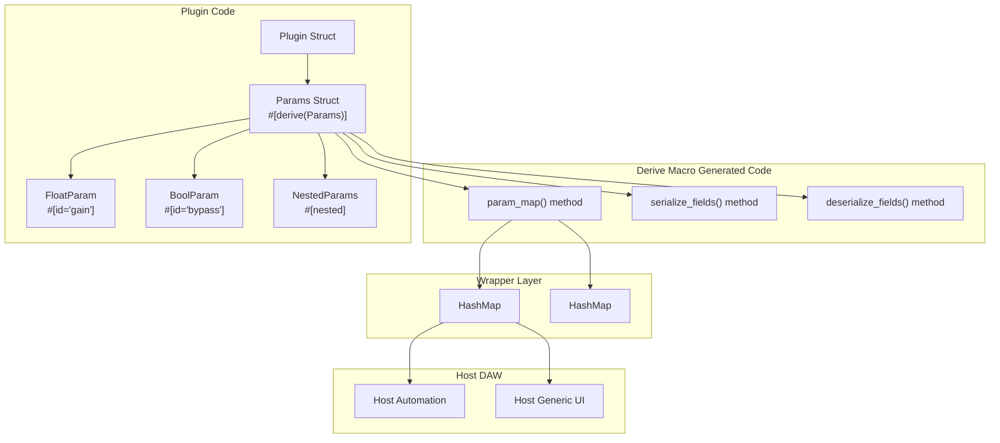
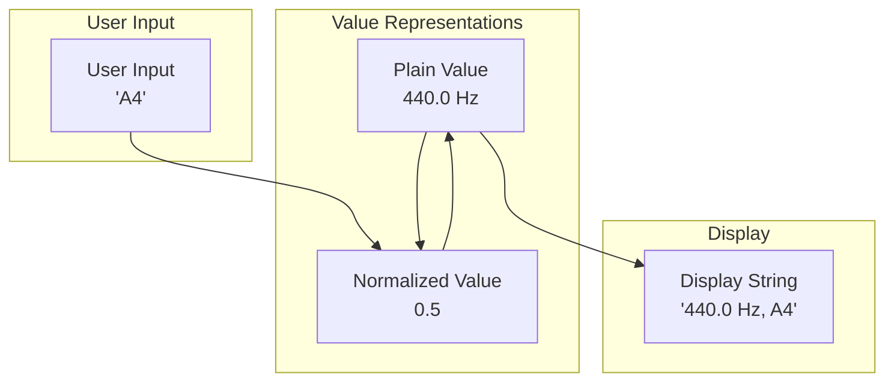
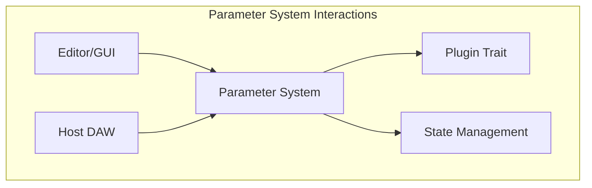

# Parameter System

> **Relevant source files**
> * [Cargo.lock](https://github.com/robbert-vdh/nih-plug/blob/28b149ec/Cargo.lock)
> * [Cargo.toml](https://github.com/robbert-vdh/nih-plug/blob/28b149ec/Cargo.toml)
> * [README.md](https://github.com/robbert-vdh/nih-plug/blob/28b149ec/README.md)
> * [nih_plug_derive/src/lib.rs](https://github.com/robbert-vdh/nih-plug/blob/28b149ec/nih_plug_derive/src/lib.rs)
> * [src/params.rs](https://github.com/robbert-vdh/nih-plug/blob/28b149ec/src/params.rs)
> * [src/wrapper/vst3.rs](https://github.com/robbert-vdh/nih-plug/blob/28b149ec/src/wrapper/vst3.rs)

The NIH-plug parameter system provides a declarative framework for defining plugin parameters. Parameters are the controls users adjust to modify plugin behavior, such as gain knobs, filter frequency sliders, or bypass switches. NIH-plug's approach eliminates boilerplate by using derive macros and providing thread-safe, automation-ready parameter types.

This page covers the core parameter abstractions (`Param` and `Params` traits), the declarative definition pattern, and how parameters integrate with plugin hosts. For detailed information on parameter types and the derive macro, see [Parameter Types and Derive Macros](/robbert-vdh/nih-plug/2.2.1-parameter-types-and-derive-macros). For state persistence, see [State Serialization](/robbert-vdh/nih-plug/2.2.2-state-serialization).

Sources: [src/params.rs L1-L5](https://github.com/robbert-vdh/nih-plug/blob/28b149ec/src/params.rs#L1-L5)

## Core Abstractions

### The Param Trait

The `Param` trait defines the interface all parameter types must implement. It provides methods for reading values, converting between normalized and plain representations, formatting for display, and querying metadata.

**Trait: `Param` Core Methods**

| Method | Description |
| --- | --- |
| `name()` | Parameter display name |
| `unit()` | Optional unit label (e.g., "Hz", "dB") |
| `modulated_plain_value()` | Current value in its natural range |
| `modulated_normalized_value()` | Current value normalized to [0, 1] |
| `unmodulated_plain_value()` | Value before host modulation |
| `default_plain_value()` | Default/reset value |
| `step_count()` | Number of steps for discrete parameters |
| `flags()` | Control flags (bypass, non-automatable, hidden) |

Sources: [src/params.rs L64-L192](https://github.com/robbert-vdh/nih-plug/blob/28b149ec/src/params.rs#L64-L192)

The trait is sealed (cannot be implemented outside NIH-plug) because parameter types require tight integration with the wrapper layer for thread-safe value updates and host communication.

Sources: [src/params.rs L56-L62](https://github.com/robbert-vdh/nih-plug/blob/28b149ec/src/params.rs#L56-L62)

### The Params Trait

The `Params` trait is implemented on structs that contain parameter fields. It provides methods for enumerating parameters and serializing/deserializing persistent state.

**Trait: `Params` Methods**

| Method | Purpose |
| --- | --- |
| `param_map()` | Returns `Vec<(String, ParamPtr, String)>` mapping parameter IDs to pointers and group names |
| `serialize_fields()` | Saves `#[persist]` fields to `BTreeMap<String, String>` |
| `deserialize_fields()` | Restores `#[persist]` fields from saved state |

The `param_map()` method returns a vector of tuples where:

* First element: Parameter ID (stable identifier)
* Second element: `ParamPtr` (type-erased pointer to the parameter)
* Third element: Group path (e.g., `"Filter/Cutoff"` or `""` for top-level)

Sources: [src/params.rs L235-L329](https://github.com/robbert-vdh/nih-plug/blob/28b149ec/src/params.rs#L235-L329)

### Parameter Types Overview

NIH-plug provides four built-in parameter types:

| Type | Atomic Storage | Use Case |
| --- | --- | --- |
| `FloatParam` | `AtomicF32` | Continuous values (gain, frequency, pan) |
| `IntParam` | `AtomicI32` | Discrete integer values (sample count, octave) |
| `BoolParam` | `AtomicBool` | Binary switches (bypass, enable/disable) |
| `EnumParam<T>` | Atomic index | Multiple discrete options (filter type, waveform) |

All parameter types use atomic storage for lock-free, thread-safe access from both the audio thread and GUI thread. Detailed documentation for each type is in [Parameter Types and Derive Macros](/robbert-vdh/nih-plug/2.2.1-parameter-types-and-derive-macros).

Sources: [src/params.rs L16-L30](https://github.com/robbert-vdh/nih-plug/blob/28b149ec/src/params.rs#L16-L30)

## Declarative Parameter Definition

### Using the #[derive(Params)] Macro

Parameters are defined declaratively using the `#[derive(Params)]` macro on a struct containing parameter fields. Each parameter field must have a unique `#[id = "stable"]` attribute that serves as a stable identifier for state persistence.

**Example Parameter Struct Pattern**

```css
struct MyPluginParams {
    #[id = "gain"]
    pub gain: FloatParam,
    
    #[id = "bypass"]
    pub bypass: BoolParam,
    
    #[persist = "editor_state"]
    pub editor_state: Arc<EditorState>,
}
```

The derive macro generates the `Params` trait implementation, including:

* The `param_map()` method that enumerates all parameter fields
* Serialization code for `#[persist]` fields
* Proper handling of `#[nested]` parameter groups

Sources: [nih_plug_derive/src/lib.rs L12-L16](https://github.com/robbert-vdh/nih-plug/blob/28b149ec/nih_plug_derive/src/lib.rs#L12-L16)

 [src/params.rs L237-L259](https://github.com/robbert-vdh/nih-plug/blob/28b149ec/src/params.rs#L237-L259)

### Parameter Attributes

**Attribute: `#[id = "stable_id"]`**

Every parameter field must have a stable ID up to 6 characters long. This ID is used internally by the host for automation and state persistence. The ID must remain constant across plugin versions to maintain compatibility with saved states.

**Attribute: `#[persist = "key"]`**

Fields annotated with `#[persist]` are serialized as part of the plugin state but are not exposed as automatable parameters. These fields must implement Serde's `Serialize` and `Deserialize` traits and should use thread-safe interior mutability (e.g., `Arc<RwLock<T>>`).

**Attribute: `#[nested(group = "Group Name")]`**

Nests a `Params` struct inside another, optionally placing all nested parameters in a named group. Parameter IDs must still be unique across all nested structs.

**Attribute: `#[nested(id_prefix = "prefix")]`**

Prefixes all parameter IDs and persist keys in the nested struct, enabling reuse of the same parameter struct multiple times with different identifiers.

**Attribute: `#[nested(array, group = "Group Name")]`**

Applies nesting to an array, automatically generating unique IDs by appending array indices (e.g., `param_1`, `param_2`).

Sources: [src/params.rs L237-L277](https://github.com/robbert-vdh/nih-plug/blob/28b149ec/src/params.rs#L237-L277)

### Diagram: Parameter Struct to Host Integration



Sources: [src/params.rs L283-L298](https://github.com/robbert-vdh/nih-plug/blob/28b149ec/src/params.rs#L283-L298)

 [src/wrapper/vst3.rs L1-L16](https://github.com/robbert-vdh/nih-plug/blob/28b149ec/src/wrapper/vst3.rs#L1-L16)

## Normalized Values and Host Integration

### Plain vs. Normalized Values

Parameters maintain two value representations:

1. **Plain Values**: Values in their natural range (e.g., 20 Hz to 20,000 Hz for frequency)
2. **Normalized Values**: Values mapped to [0.0, 1.0] for standardized host communication

Plugin hosts (DAWs) communicate with plugins using normalized values for automation and UI, as this provides a format-independent interface. The parameter types handle conversion between these representations using their defined ranges.

**Diagram: Value Conversions**



Sources: [src/params.rs L125-L176](https://github.com/robbert-vdh/nih-plug/blob/28b149ec/src/params.rs#L125-L176)

### Modulation and Automation

Parameters support both automation (time-varying parameter changes) and modulation (dynamic offsets applied to parameter values):

* **Unmodulated Value**: The base parameter value set by the user or automation
* **Modulated Value**: The effective value after applying modulation offsets

For example, a filter cutoff parameter at 1000 Hz with +200 Hz modulation results in an effective value of 1200 Hz. The `modulated_plain_value()` and `unmodulated_plain_value()` methods allow plugins and GUIs to distinguish between these.

Sources: [src/params.rs L100-L119](https://github.com/robbert-vdh/nih-plug/blob/28b149ec/src/params.rs#L100-L119)

## Thread Safety and Atomic Storage

### Lock-Free Parameter Access

All parameter types use atomic types for their internal storage, enabling lock-free concurrent access from multiple threads:

| Parameter Type | Atomic Storage Type |
| --- | --- |
| `FloatParam` | `AtomicF32` |
| `IntParam` | `AtomicI32` |
| `BoolParam` | `AtomicBool` |
| `EnumParam<T>` | `AtomicCell<usize>` (index into enum variants) |

This design allows the audio processing thread to read parameter values without blocking, even while the GUI thread is updating them. The atomic operations use `Ordering::Relaxed` for reads and `Ordering::SeqCst` for writes, providing the necessary synchronization without unnecessary overhead.

Sources: [src/params.rs L17-L30](https://github.com/robbert-vdh/nih-plug/blob/28b149ec/src/params.rs#L17-L30)

### Parameter Smoothing

`FloatParam` and `IntParam` include built-in smoothers to prevent audio artifacts when parameter values change abruptly. The smoother interpolates between the current and target values over a configurable time period.

Smoothing is especially important for parameters that directly affect audio generation (like oscillator frequency) or gain-related parameters. The smoother can be accessed via the `smoothed` field on the parameter, and plugins typically read smoothed values in their processing loop:

```javascript
// In process callback
let gain = params.gain.smoothed.next();
```

The smoother is updated automatically when parameter values change. See [Parameter Smoothing and Automation](/robbert-vdh/nih-plug/6.4-parameter-smoothing-and-automation) for detailed information on smoothing styles and sample-accurate automation.

Sources: [src/params/smoothing.rs](https://github.com/robbert-vdh/nih-plug/blob/28b149ec/src/params/smoothing.rs)

## Parameter Flags

The `ParamFlags` bitflags control parameter behavior and visibility:

| Flag | Effect |
| --- | --- |
| `BYPASS` | Marks a `BoolParam` as the plugin bypass control. Only one parameter can have this flag. If no parameter has it, NIH-plug adds a bypass parameter automatically. |
| `NON_AUTOMATABLE` | Prevents automation from the host but allows manual changes from GUIs. |
| `HIDDEN` | Hides the parameter in the host's generic UI. Implies `NON_AUTOMATABLE`. |
| `HIDE_IN_GENERIC_UI` | Hides the parameter only in NIH-plug's generic UI widgets, not in the host's UI. |

These flags are set when constructing a parameter using builder methods like `.with_flags()` or `.non_automatable()`.

Sources: [src/params.rs L32-L54](https://github.com/robbert-vdh/nih-plug/blob/28b149ec/src/params.rs#L32-L54)

## Integration with Wrappers and Hosts

### Wrapper Initialization

When a plugin is instantiated, the wrapper layer (VST3, CLAP, or standalone) calls the plugin's `params()` method to obtain an `Arc<dyn Params>`. The wrapper then:

1. Calls `param_map()` to enumerate all parameters
2. Builds hash maps for fast parameter lookup by ID and by hash
3. Registers parameters with the host
4. Sets up parameter value change callbacks

**Diagram: Wrapper Parameter Initialization**

```mermaid
sequenceDiagram
  participant Host DAW
  participant Wrapper<P>
  participant Plugin Instance
  participant Arc<dyn Params>

  Host DAW->>Wrapper<P>: Initialize plugin
  Wrapper<P>->>Plugin Instance: Default::default()
  Wrapper<P>->>Plugin Instance: params()
  Plugin Instance->>Wrapper<P>: Arc<dyn Params>
  Wrapper<P>->>Arc<dyn Params>: param_map()
  Arc<dyn Params>->>Wrapper<P>: Vec<(id, ParamPtr, group)>
  Wrapper<P>->>Wrapper<P>: Build param_by_hash
  Wrapper<P>->>Wrapper<P>: Build param_id_to_hash
  Wrapper<P>->>Wrapper<P>: Build param_ptr_to_hash
  Wrapper<P>->>Host DAW: Register parameters
```

Sources: [src/wrapper/vst3.rs L1-L16](https://github.com/robbert-vdh/nih-plug/blob/28b149ec/src/wrapper/vst3.rs#L1-L16)

### Parameter Updates from Host

When the host sends parameter automation or the user adjusts a parameter in the host's UI, the wrapper:

1. Looks up the `ParamPtr` using the parameter hash
2. Calls internal setter methods on the parameter
3. Updates the parameter's smoother if needed
4. Notifies the plugin's editor (if open) of the change

The wrapper uses lock-free queues to communicate parameter changes between the audio thread and GUI thread, ensuring realtime safety.

Sources: [src/wrapper/clap/wrapper.rs](https://github.com/robbert-vdh/nih-plug/blob/28b149ec/src/wrapper/clap/wrapper.rs)

 [src/wrapper/vst3/wrapper.rs](https://github.com/robbert-vdh/nih-plug/blob/28b149ec/src/wrapper/vst3/wrapper.rs)

### Parameter Updates from Plugin

When the plugin or its editor changes a parameter value programmatically, it must use the `GuiContext` or `ProcessContext` to ensure the host is notified:

```
// From GUI or processing code
context.set_parameter(param_ptr, plain_value);
```

This ensures:

* The host's automation system is updated
* Other editor instances (if any) are notified
* The parameter change is recorded in the host's undo history

Direct writes to parameter fields bypass this notification system and should be avoided except during initialization.

Sources: [src/context.rs](https://github.com/robbert-vdh/nih-plug/blob/28b149ec/src/context.rs)

## Parameter System Interactions

The Parameter System interacts with other components of NIH-plug:



Sources: [src/wrapper/state.rs L9-L10](https://github.com/robbert-vdh/nih-plug/blob/28b149ec/src/wrapper/state.rs#L9-L10)

Parameters are:

* Defined and initialized when creating a plugin
* Accessed during audio processing to determine signal flow
* Modified by the GUI based on user input
* Automated by the host DAW
* Saved and loaded as part of the plugin's state

## Conclusion

The Parameter System provides a robust foundation for creating flexible and intuitive controls in NIH-plug audio plugins. By handling the complexities of value representation, formatting, and persistence, it allows plugin developers to focus on the creative aspects of their designs while ensuring consistent behavior across different hosts and sessions.