# Parameter Types and Derive Macros

> **Relevant source files**
> * [Cargo.lock](https://github.com/robbert-vdh/nih-plug/blob/28b149ec/Cargo.lock)
> * [Cargo.toml](https://github.com/robbert-vdh/nih-plug/blob/28b149ec/Cargo.toml)
> * [README.md](https://github.com/robbert-vdh/nih-plug/blob/28b149ec/README.md)
> * [nih_plug_derive/src/lib.rs](https://github.com/robbert-vdh/nih-plug/blob/28b149ec/nih_plug_derive/src/lib.rs)
> * [src/params.rs](https://github.com/robbert-vdh/nih-plug/blob/28b149ec/src/params.rs)
> * [src/wrapper/vst3.rs](https://github.com/robbert-vdh/nih-plug/blob/28b149ec/src/wrapper/vst3.rs)

## Purpose and Scope

This page documents the concrete parameter types (`FloatParam`, `IntParam`, `BoolParam`, `EnumParam<T>`) and the `#[derive(Params)]` macro that generates parameter infrastructure code. These types define individual parameters, while the derive macro aggregates them into a `Params` struct that the plugin returns from `Plugin::params()`.

For information about how parameters integrate with the plugin lifecycle and host communication, see [Parameter System](/robbert-vdh/nih-plug/2.2-parameter-system). For state serialization details, see [State Serialization](/robbert-vdh/nih-plug/2.2.2-state-serialization).

---

## Parameter Type Overview

NIH-plug provides four concrete parameter types, each implementing the `Param` trait. These types store their values atomically and provide built-in smoothing capabilities.

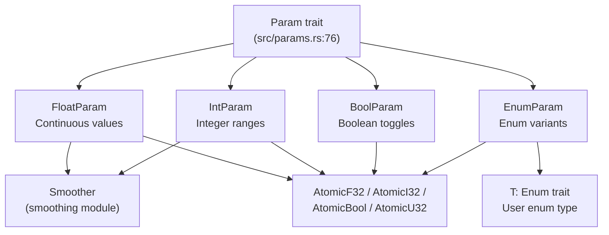

**Parameter Type Hierarchy and Storage**

Sources: [src/params.rs L17-L30](https://github.com/robbert-vdh/nih-plug/blob/28b149ec/src/params.rs#L17-L30)

 [src/params.rs L76-L192](https://github.com/robbert-vdh/nih-plug/blob/28b149ec/src/params.rs#L76-L192)

| Parameter Type | Use Case | Plain Type | Storage | Smoothing |
| --- | --- | --- | --- | --- |
| `FloatParam` | Continuous parameters (gain, frequency, etc.) | `f32` | `AtomicF32` | Yes |
| `IntParam` | Integer ranges (buffer size, MIDI note, etc.) | `i32` | `AtomicI32` | Yes |
| `BoolParam` | On/off toggles | `bool` | `AtomicBool` | No |
| `EnumParam<T>` | Multiple discrete choices | `T` (user enum) | `AtomicU32` | No |

Each parameter type is constructed using a builder pattern, with all configuration done at initialization. Parameters cannot be reconfigured after creation.

Sources: [src/params.rs L27-L30](https://github.com/robbert-vdh/nih-plug/blob/28b149ec/src/params.rs#L27-L30)

---

## FloatParam: Continuous Parameters

`FloatParam` represents floating-point parameters with configurable ranges, value distributions, and display formatting.

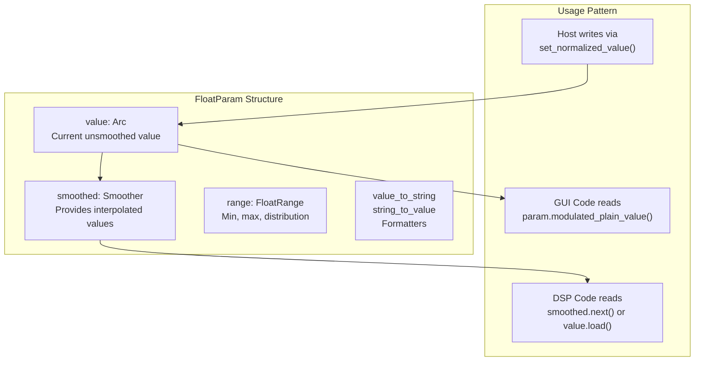

**FloatParam Data Flow**

### Key Configuration

```python
// Example from plugin code (not generating new code, just showing structure)
// Field definition:
// gain: FloatParam
```

The `FloatParam` builder provides:

* **Range specification**: `FloatRange` with min/max bounds and distribution curves (linear, skewed, exponential)
* **Step size**: Discrete stepping for quantized continuous parameters
* **Value formatting**: Custom `value_to_string` and `string_to_value` functions
* **Smoothing style**: Linear, logarithmic, or no smoothing via `smoothing_style()`
* **Unit suffix**: Display unit like "dB", "Hz"
* **Modulation ID**: Optional polyphonic modulation support via `with_poly_modulation_id()`

Sources: [src/params/float.rs](https://github.com/robbert-vdh/nih-plug/blob/28b149ec/src/params/float.rs)

 [src/params/range.rs](https://github.com/robbert-vdh/nih-plug/blob/28b149ec/src/params/range.rs)

 [src/params/smoothing.rs](https://github.com/robbert-vdh/nih-plug/blob/28b149ec/src/params/smoothing.rs)

---

## IntParam: Integer Parameters

`IntParam` provides integer-valued parameters with similar configuration to `FloatParam` but constrained to whole numbers.

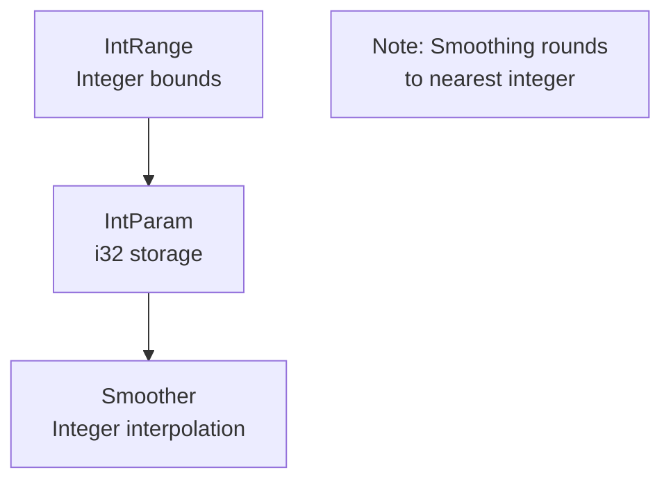

**IntParam Smoothing Behavior**

### Differences from FloatParam

* Plain type is `i32` instead of `f32`
* Range is `IntRange` with integer bounds
* Smoother outputs are rounded to nearest integer when smoothing is enabled
* Often used for buffer sizes, array indices, MIDI note numbers

Common use cases include sample buffer lengths, filter orders, or any parameter requiring whole number values.

Sources: [src/params/integer.rs](https://github.com/robbert-vdh/nih-plug/blob/28b149ec/src/params/integer.rs)

---

## BoolParam: Boolean Toggles

`BoolParam` represents on/off switches and boolean states. Unlike float and integer parameters, boolean parameters do not support smoothing.

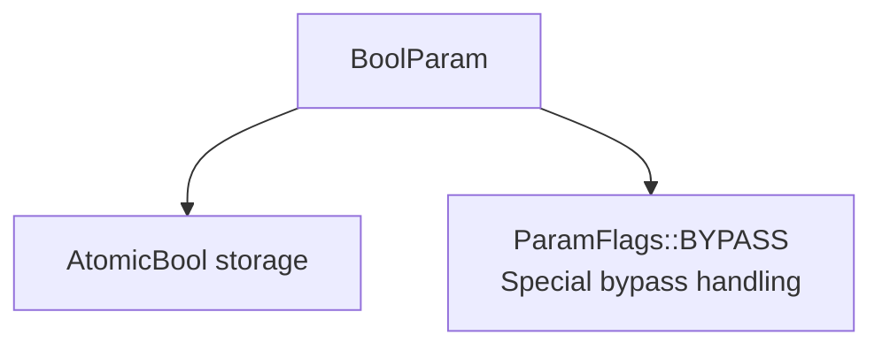

**BoolParam Structure**

### Special Flags

`BoolParam` is commonly used with the `ParamFlags::BYPASS` flag to designate the plugin's bypass parameter:

```
// Field marked with BYPASS flag becomes the host's bypass control
// Only one parameter should have this flag
// If none specified, NIH-plug adds one automatically
```

The bypass parameter is automatically linked to the host's bypass control, allowing the host to bypass processing without unloading the plugin.

Sources: [src/params/boolean.rs](https://github.com/robbert-vdh/nih-plug/blob/28b149ec/src/params/boolean.rs)

 [src/params.rs L37-L41](https://github.com/robbert-vdh/nih-plug/blob/28b149ec/src/params.rs#L37-L41)

---

## EnumParam<T>: Enumerated Choices

`EnumParam<T>` allows parameters with multiple discrete named choices, where `T` is a user-defined enum implementing the `Enum` trait.

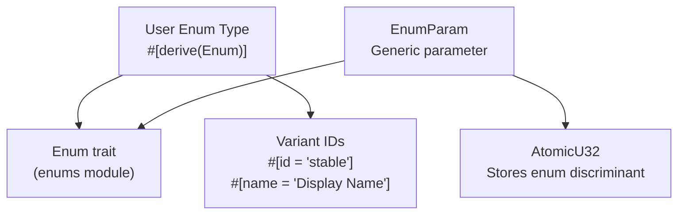

**EnumParam Type Relationships**

### Enum Trait Derivation

User enums must derive the `Enum` trait using `#[derive(Enum)]`:

```css
// Example enum structure (not new code):
// #[derive(Enum)]
// enum FilterType {
//     #[id = "lowpass"]
//     #[name = "Low Pass"]
//     LowPass,
//     
//     #[id = "highpass"]
//     HighPass,
// }
```

The derive macro generates:

* **Variant enumeration**: Methods to iterate all variants
* **ID mapping**: Stable identifiers for each variant
* **Display names**: Human-readable labels
* **Conversion functions**: Between enum values and indices

### Enum Attributes

| Attribute | Location | Purpose | Required |
| --- | --- | --- | --- |
| `#[derive(Enum)]` | Enum definition | Implements `Enum` trait | Yes |
| `#[id = "stable"]` | Variant | Stable identifier for persistence | Yes |
| `#[name = "Display"]` | Variant | Display name in UI | No (uses variant name) |

Sources: [src/params/enums.rs](https://github.com/robbert-vdh/nih-plug/blob/28b149ec/src/params/enums.rs)

 [nih_plug_derive/src/enums.rs](https://github.com/robbert-vdh/nih-plug/blob/28b149ec/nih_plug_derive/src/enums.rs)

 [nih_plug_derive/src/lib.rs L7-L10](https://github.com/robbert-vdh/nih-plug/blob/28b149ec/nih_plug_derive/src/lib.rs#L7-L10)

---

## The Params Derive Macro

The `#[derive(Params)]` macro generates the implementation of the `Params` trait, which provides parameter enumeration and serialization methods.

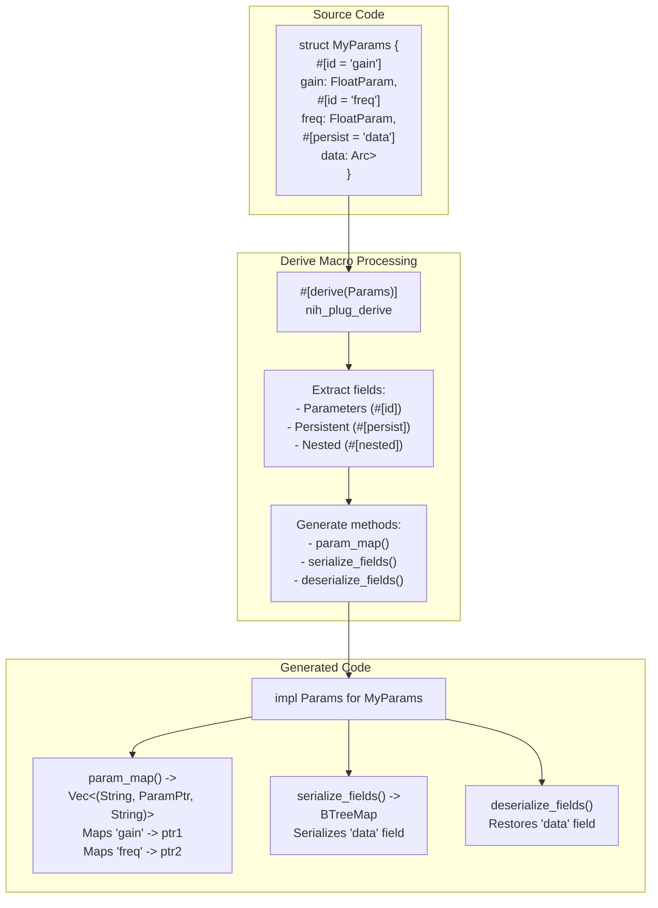

**Params Derive Macro Expansion Process**

### Generated Methods

The derive macro generates three methods for the `Params` trait:

1. **`param_map()`**: Returns a vector of `(param_id, param_ptr, group_name)` tuples * Used by wrappers to build parameter lookup tables * Order determines display order in host generic UIs * Group names are slash-delimited paths like `"Filter/Resonance"`
2. **`serialize_fields()`**: Serializes `#[persist]` fields to JSON strings * Returns `BTreeMap<String, String>` mapping persist keys to JSON * Only processes fields annotated with `#[persist = "key"]`
3. **`deserialize_fields()`**: Restores `#[persist]` fields from serialized state * Takes `&BTreeMap<String, String>` from saved state * Uses `persist::deserialize_field()` for each persistent field

Sources: [src/params.rs L235-L314](https://github.com/robbert-vdh/nih-plug/blob/28b149ec/src/params.rs#L235-L314)

 [nih_plug_derive/src/lib.rs L13-L16](https://github.com/robbert-vdh/nih-plug/blob/28b149ec/nih_plug_derive/src/lib.rs#L13-L16)

 [nih_plug_derive/src/params.rs](https://github.com/robbert-vdh/nih-plug/blob/28b149ec/nih_plug_derive/src/params.rs)

---

## Field Attributes

The `Params` derive macro recognizes three field attributes that control how parameters and persistent fields are processed.

### #[id = "stable"]

The `#[id]` attribute assigns a stable identifier to a parameter field. This identifier is used for:

* Host automation lane mapping
* State serialization and deserialization
* Parameter change notifications

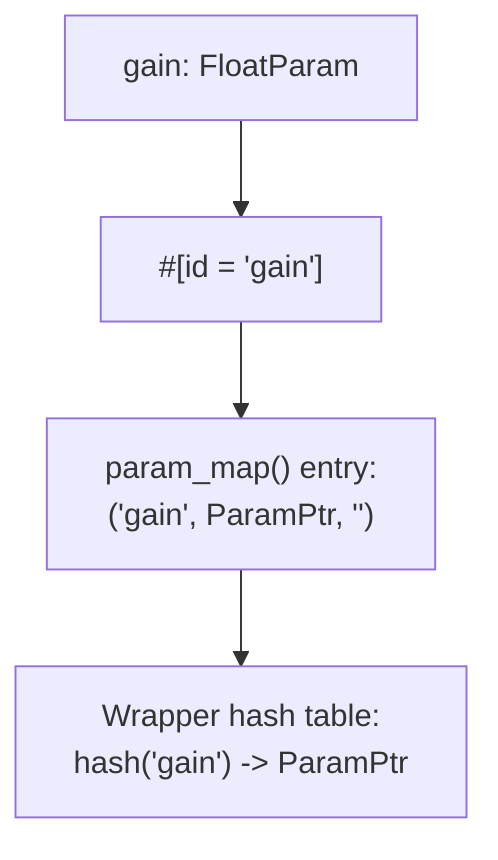

**ID Attribute Processing**

**Requirements**:

* Must be 1-6 characters (ASCII, avoid collisions)
* Must be unique across all parameters in the plugin
* Should remain stable across plugin versions
* Required for all parameter fields

Changing a parameter's ID breaks compatibility with existing automation and presets.

Sources: [src/params.rs L242-L243](https://github.com/robbert-vdh/nih-plug/blob/28b149ec/src/params.rs#L242-L243)

### #[persist = "key"]

The `#[persist]` attribute marks non-parameter fields for state persistence. These fields must be wrapped in `PersistentField` types (like `Arc<RwLock<T>>`) where `T` implements `Serialize` and `Deserialize`.

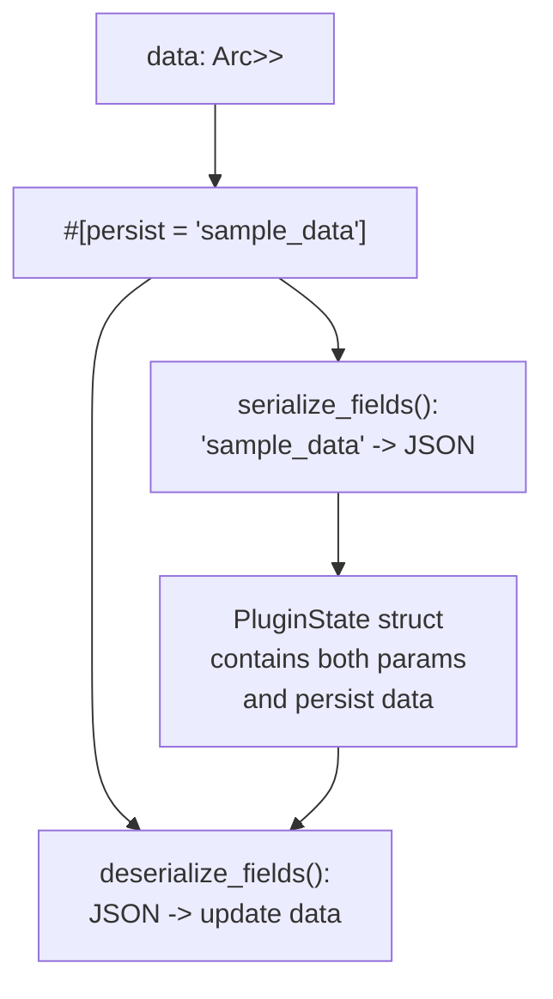

**Persist Attribute Flow**

**Usage pattern**:

* Field type must implement `Serialize + Deserialize`
* Typically wrapped in `Arc<RwLock<T>>` or similar for thread-safe mutation
* Key must be unique across the plugin
* Used for sample data, lookup tables, UI state, etc.

Sources: [src/params.rs L246-L250](https://github.com/robbert-vdh/nih-plug/blob/28b149ec/src/params.rs#L246-L250)

 [src/params/persist.rs](https://github.com/robbert-vdh/nih-plug/blob/28b149ec/src/params/persist.rs)

### #[nested]

The `#[nested]` attribute includes parameters from nested `Params` objects, optionally organizing them into groups.

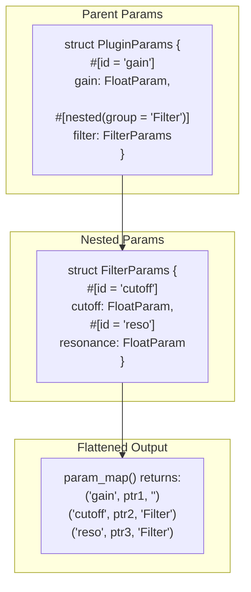

**Nested Parameter Flattening**

**Attributes**:

* `#[nested]`: Inline parameters without grouping
* `#[nested(group = "name")]`: Place parameters in named group
* Group names can be nested: `"Oscillator/Envelope"`

The derive macro recursively processes nested `Params` structs and prepends group names to their parameters' group paths.

Sources: [src/params.rs L252-L256](https://github.com/robbert-vdh/nih-plug/blob/28b149ec/src/params.rs#L252-L256)

### #[nested(id_prefix = "prefix")]

The `#[nested(id_prefix)]` attribute modifies parameter IDs to enable reusing the same `Params` struct multiple times with different identifiers.

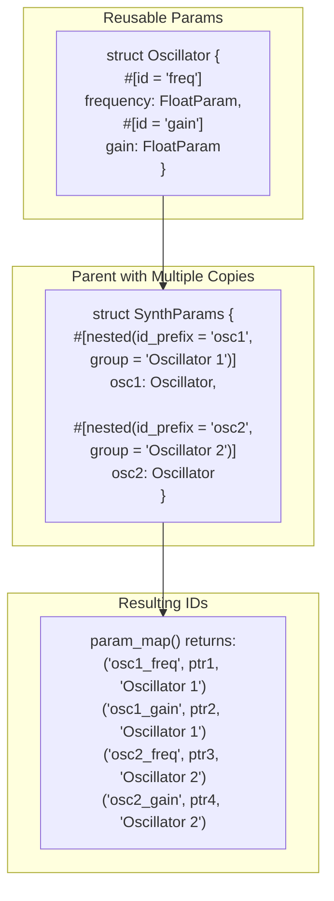

**ID Prefix Application**

The prefix is prepended with an underscore to all parameter IDs from the nested object. This also applies to `#[persist]` keys, enabling multiple copies of persistent state.

**Requirements**:

* Prefix itself must be unique
* Combined IDs (prefix + original ID) must remain within character limits
* Commonly used for multi-band processors, multiple oscillators, etc.

Sources: [src/params.rs L261-L268](https://github.com/robbert-vdh/nih-plug/blob/28b149ec/src/params.rs#L261-L268)

### #[nested(array)]

The `#[nested(array)]` attribute automatically generates unique IDs for parameters in array-like structures.

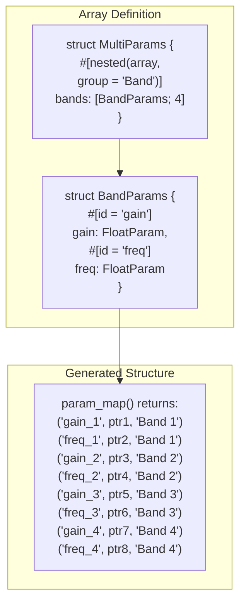

**Array Nesting with Automatic Indexing**

**Behavior**:

* Iterates over array elements (must implement `IntoIterator`)
* Appends `_{index + 1}` to each parameter ID (1-indexed)
* Appends `{index + 1}` to group name (1-indexed)
* Applies to both parameter IDs and persist keys

This pattern is commonly used for:

* Multi-band processors (EQs, compressors, crossovers)
* Voice/oscillator banks
* Step sequencers
* Any plugin with a fixed number of identical parameter groups

Sources: [src/params.rs L270-L276](https://github.com/robbert-vdh/nih-plug/blob/28b149ec/src/params.rs#L270-L276)

---

## Parameter Struct Composition Patterns

The flexible nesting system enables several common composition patterns for organizing plugin parameters.

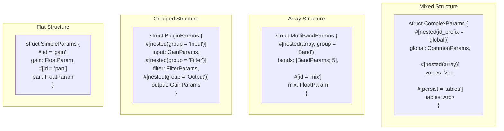

**Common Parameter Organization Patterns**

### Pattern Comparison

| Pattern | Use Case | Advantages | Example Plugins |
| --- | --- | --- | --- |
| **Flat** | Simple plugins | Minimal complexity | Gain, limiter |
| **Grouped** | Logical sections | Clear organization | Channel strip, synthesizer |
| **Array** | Repeated sections | Code reuse | Multi-band compressor, EQ |
| **Mixed** | Complex plugins | Maximum flexibility | Spectral processor, modular synth |

Sources: [plugins/examples/gain](https://github.com/robbert-vdh/nih-plug/blob/28b149ec/plugins/examples/gain)

 [plugins/diopser](https://github.com/robbert-vdh/nih-plug/blob/28b149ec/plugins/diopser)

 [plugins/spectral_compressor](https://github.com/robbert-vdh/nih-plug/blob/28b149ec/plugins/spectral_compressor)

---

## Compile-Time Parameter Processing

The `#[derive(Params)]` macro performs all parameter structure analysis at compile time, generating efficient runtime code.

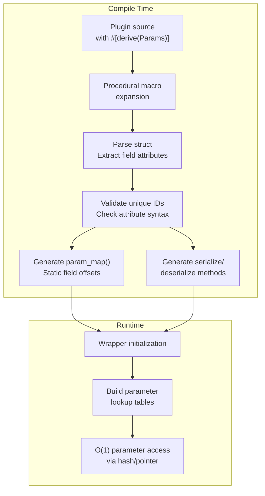

**Parameter Processing Timeline**

### Macro Responsibilities

The derive macro at compile time:

1. **Validates** all parameter IDs are unique
2. **Generates** `param_map()` with correct field offsets
3. **Generates** serialization code for `#[persist]` fields
4. **Flattens** nested structures into a single parameter list
5. **Applies** ID prefixes and group names

At runtime, the wrapper:

1. Calls `param_map()` once during initialization
2. Builds hash tables mapping IDs to `ParamPtr`
3. Uses these tables for O(1) parameter lookup during processing

This design ensures zero runtime overhead for parameter enumeration while maintaining flexibility.

Sources: [nih_plug_derive/src/params.rs](https://github.com/robbert-vdh/nih-plug/blob/28b149ec/nih_plug_derive/src/params.rs)

 [src/params.rs L283-L298](https://github.com/robbert-vdh/nih-plug/blob/28b149ec/src/params.rs#L283-L298)

 [src/wrapper/util.rs](https://github.com/robbert-vdh/nih-plug/blob/28b149ec/src/wrapper/util.rs)