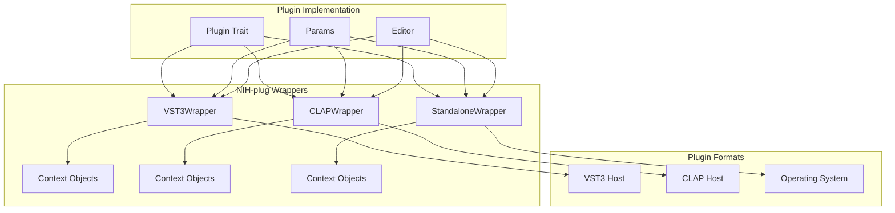
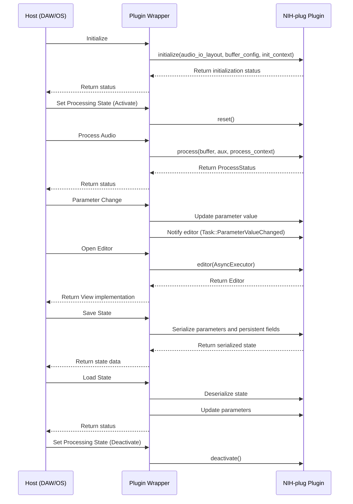
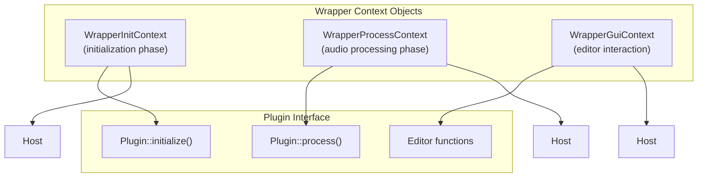
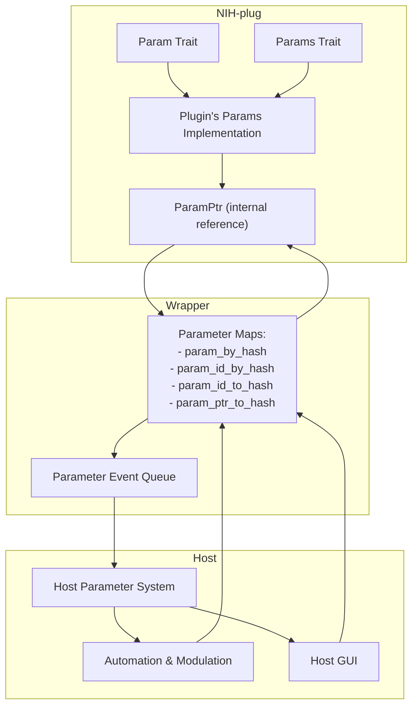
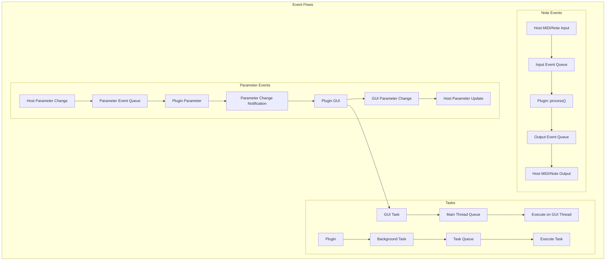
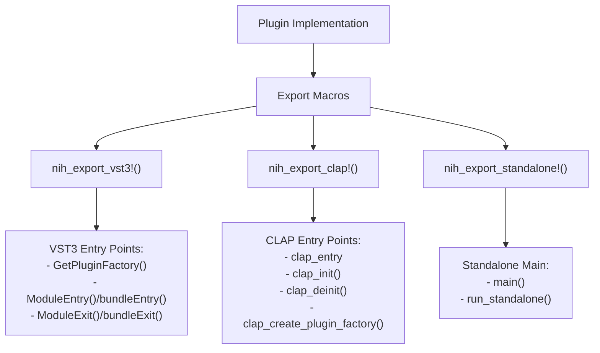

# Plugin Wrappers

> **Relevant source files**
> * [nih_plug_derive/src/lib.rs](https://github.com/robbert-vdh/nih-plug/blob/28b149ec/nih_plug_derive/src/lib.rs)
> * [src/params.rs](https://github.com/robbert-vdh/nih-plug/blob/28b149ec/src/params.rs)
> * [src/wrapper/clap/wrapper.rs](https://github.com/robbert-vdh/nih-plug/blob/28b149ec/src/wrapper/clap/wrapper.rs)
> * [src/wrapper/vst3.rs](https://github.com/robbert-vdh/nih-plug/blob/28b149ec/src/wrapper/vst3.rs)
> * [src/wrapper/vst3/inner.rs](https://github.com/robbert-vdh/nih-plug/blob/28b149ec/src/wrapper/vst3/inner.rs)
> * [src/wrapper/vst3/wrapper.rs](https://github.com/robbert-vdh/nih-plug/blob/28b149ec/src/wrapper/vst3/wrapper.rs)

## Purpose

Plugin Wrappers are a crucial part of NIH-plug that adapt plugins implementing the core NIH-plug API to different plugin formats (VST3, CLAP) and standalone applications. They serve as the bridge between the plugin's internal implementation and the host environment, handling format-specific interfaces, audio processing, parameter management, and GUI integration.

For detailed information about specific wrapper implementations, see [VST3 Wrapper](/robbert-vdh/nih-plug/3.1-vst3-wrapper), [CLAP Wrapper](/robbert-vdh/nih-plug/3.2-clap-wrapper), and [Standalone Mode](/robbert-vdh/nih-plug/3.3-standalone-wrapper).

## Architecture Overview

The Plugin Wrappers system follows a consistent pattern across all supported formats while accommodating format-specific requirements.

Sources: [src/wrapper/vst3/wrapper.rs L50-L52](https://github.com/robbert-vdh/nih-plug/blob/28b149ec/src/wrapper/vst3/wrapper.rs#L50-L52)

 [src/wrapper/clap/wrapper.rs L103-L257](https://github.com/robbert-vdh/nih-plug/blob/28b149ec/src/wrapper/clap/wrapper.rs#L103-L257)

 [src/wrapper/standalone/wrapper.rs L30-L91](https://github.com/robbert-vdh/nih-plug/blob/28b149ec/src/wrapper/standalone/wrapper.rs#L30-L91)

## Common Wrapper Components

Despite differences in implementation, all wrappers share common structural elements:

| Component | Purpose |
| --- | --- |
| Wrapper struct | Main container for plugin instance and state |
| Context objects | Provide plugin with interfaces for initialization, processing, and GUI |
| Parameter mapping | Translate between NIH-plug parameters and format-specific representations |
| Event handling | Manage MIDI, note, and parameter change events |
| Buffer management | Convert between host's audio buffers and plugin's expected format |
| Task execution | Coordinate tasks across audio, GUI, and background threads |
| State management | Serialize and deserialize plugin state |

Sources: [src/wrapper/vst3/inner.rs L30-L140](https://github.com/robbert-vdh/nih-plug/blob/28b149ec/src/wrapper/vst3/inner.rs#L30-L140)

 [src/wrapper/clap/wrapper.rs L103-L257](https://github.com/robbert-vdh/nih-plug/blob/28b149ec/src/wrapper/clap/wrapper.rs#L103-L257)

 [src/wrapper/standalone/wrapper.rs L30-L91](https://github.com/robbert-vdh/nih-plug/blob/28b149ec/src/wrapper/standalone/wrapper.rs#L30-L91)

## Plugin Lifecycle Flow

The following diagram illustrates how wrappers mediate between the host and plugin throughout the plugin lifecycle:

Sources: [src/wrapper/vst3/wrapper.rs L359-L409](https://github.com/robbert-vdh/nih-plug/blob/28b149ec/src/wrapper/vst3/wrapper.rs#L359-L409)

 [src/wrapper/clap/wrapper.rs L570-L602](https://github.com/robbert-vdh/nih-plug/blob/28b149ec/src/wrapper/clap/wrapper.rs#L570-L602)

 [src/wrapper/standalone/wrapper.rs L275-L301](https://github.com/robbert-vdh/nih-plug/blob/28b149ec/src/wrapper/standalone/wrapper.rs#L275-L301)

## Context Objects

Each wrapper provides context objects that expose format-specific capabilities to the plugin:

Sources: [src/wrapper/vst3/inner.rs L356-L382](https://github.com/robbert-vdh/nih-plug/blob/28b149ec/src/wrapper/vst3/inner.rs#L356-L382)

 [src/wrapper/clap/wrapper.rs L730-L756](https://github.com/robbert-vdh/nih-plug/blob/28b149ec/src/wrapper/clap/wrapper.rs#L730-L756)

 [src/wrapper/standalone/context.rs L11-L162](https://github.com/robbert-vdh/nih-plug/blob/28b149ec/src/wrapper/standalone/context.rs#L11-L162)

## Parameter System Integration

The wrappers bridge between NIH-plug's parameter system and host-specific parameter representations:

Sources: [src/wrapper/vst3/inner.rs L122-L139](https://github.com/robbert-vdh/nih-plug/blob/28b149ec/src/wrapper/vst3/inner.rs#L122-L139)

 [src/wrapper/clap/wrapper.rs L193-L214](https://github.com/robbert-vdh/nih-plug/blob/28b149ec/src/wrapper/clap/wrapper.rs#L193-L214)

 [src/params.rs L76-L192](https://github.com/robbert-vdh/nih-plug/blob/28b149ec/src/params.rs#L76-L192)

## Event Handling

Wrappers manage several types of event flows:

1. **MIDI and Note Events**: From host to plugin and back
2. **Parameter Changes**: From host to plugin and from plugin's GUI to host
3. **Task Execution**: For background processing and GUI updates

Sources: [src/wrapper/vst3/inner.rs L91-L109](https://github.com/robbert-vdh/nih-plug/blob/28b149ec/src/wrapper/vst3/inner.rs#L91-L109)

 [src/wrapper/clap/wrapper.rs L142-L282](https://github.com/robbert-vdh/nih-plug/blob/28b149ec/src/wrapper/clap/wrapper.rs#L142-L282)

## Export Macros

Each wrapper provides a macro for exporting plugins in the respective format:

Sources: [src/wrapper/vst3.rs L20-L244](https://github.com/robbert-vdh/nih-plug/blob/28b149ec/src/wrapper/vst3.rs#L20-L244)

 [src/wrapper/standalone/wrapper.rs L305-L393](https://github.com/robbert-vdh/nih-plug/blob/28b149ec/src/wrapper/standalone/wrapper.rs#L305-L393)

## Wrapper-specific Features

Each wrapper implementation has unique characteristics:

### VST3 Wrapper

* Implements multiple VST3 interfaces: `IComponent`, `IEditController`, `IAudioProcessor`, etc.
* Uses COM-style reference counting
* Manages parameter change queues with sample-accurate automation
* Handles note expression controllers for extended MIDI expression

Sources: [src/wrapper/vst3/wrapper.rs L41-L702](https://github.com/robbert-vdh/nih-plug/blob/28b149ec/src/wrapper/vst3/wrapper.rs#L41-L702)

 [src/wrapper/vst3/inner.rs L30-L579](https://github.com/robbert-vdh/nih-plug/blob/28b149ec/src/wrapper/vst3/inner.rs#L30-L579)

### CLAP Wrapper

* Implements CLAP's extensible plugin interface
* Supports polyphonic modulation and voice management
* Handles parameter gestures and automation
* Provides remote control pages for hardware controllers
* Implements CLAP-specific GUI integration

Sources: [src/wrapper/clap/wrapper.rs L103-L788](https://github.com/robbert-vdh/nih-plug/blob/28b149ec/src/wrapper/clap/wrapper.rs#L103-L788)

### Standalone Wrapper

* Uses platform-specific audio backends
* Creates a window for the plugin's GUI
* Simulates a host environment for testing
* Manages audio thread separate from the GUI thread
* Provides simplified parameter management

Sources: [src/wrapper/standalone/wrapper.rs L30-L620](https://github.com/robbert-vdh/nih-plug/blob/28b149ec/src/wrapper/standalone/wrapper.rs#L30-L620)

 [src/wrapper/standalone/context.rs L11-L162](https://github.com/robbert-vdh/nih-plug/blob/28b149ec/src/wrapper/standalone/context.rs#L11-L162)

## Parameter Translation Tables

The wrappers translate between NIH-plug's parameter system and format-specific parameter representations:

| NIH-plug Parameter Type | VST3 Representation | CLAP Representation | Standalone Representation |
| --- | --- | --- | --- |
| `FloatParam` | `ParameterInfo` with flags | `clap_param_info` | Internal parameter |
| `IntParam` | `ParameterInfo` with step count | `clap_param_info` with steps | Internal parameter |
| `BoolParam` | `ParameterInfo` with step count = 1 | `clap_param_info` with flags | Internal parameter |
| `EnumParam` | `ParameterInfo` with step count | `clap_param_info` with steps | Internal parameter |

Sources: [src/wrapper/vst3/wrapper.rs L525-L590](https://github.com/robbert-vdh/nih-plug/blob/28b149ec/src/wrapper/vst3/wrapper.rs#L525-L590)

 [src/wrapper/clap/wrapper.rs L193-L214](https://github.com/robbert-vdh/nih-plug/blob/28b149ec/src/wrapper/clap/wrapper.rs#L193-L214)

 [src/params.rs L27-L54](https://github.com/robbert-vdh/nih-plug/blob/28b149ec/src/params.rs#L27-L54)

## Conclusion

The Plugin Wrappers system is a central component of NIH-plug that enables plugin compatibility across multiple formats. By implementing format-specific interfaces while presenting a consistent API to plugins, wrappers allow developers to focus on their plugin's functionality rather than the intricacies of each plugin format.