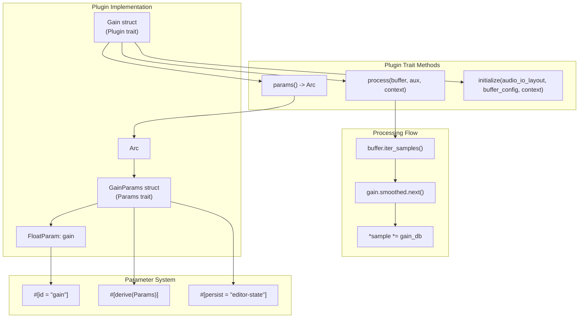
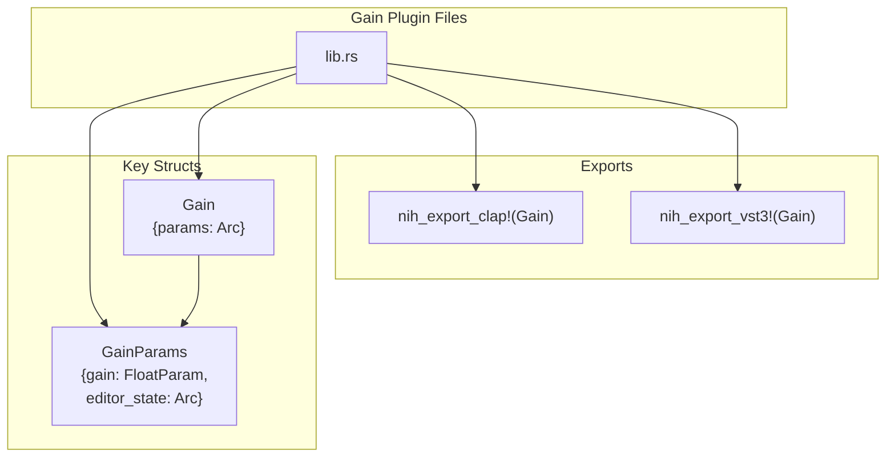
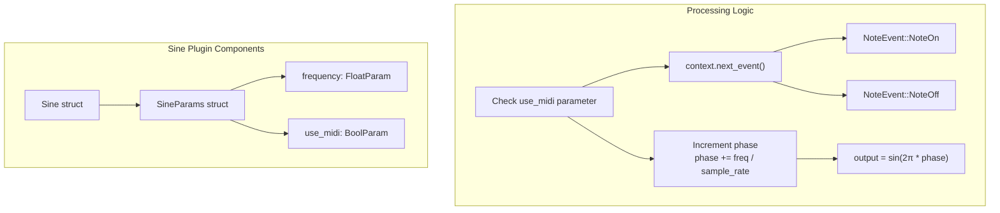
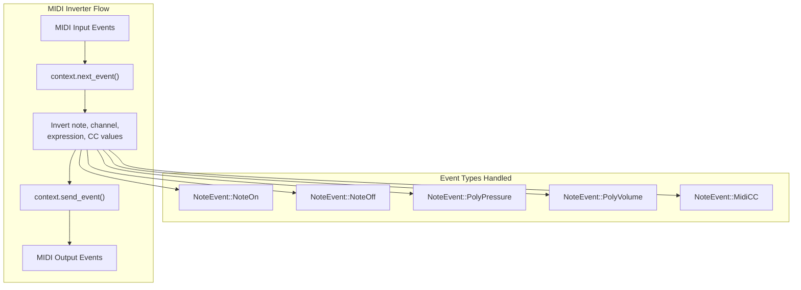
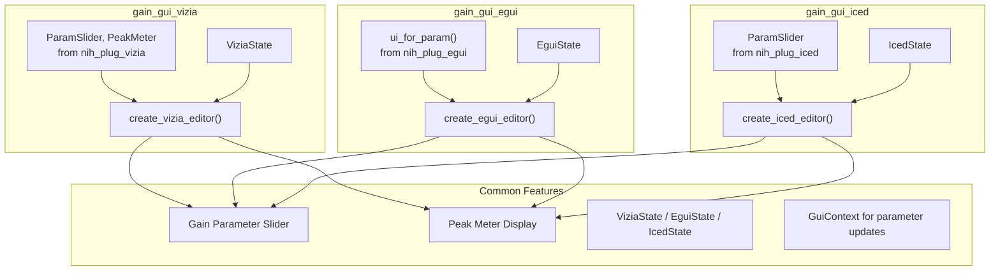
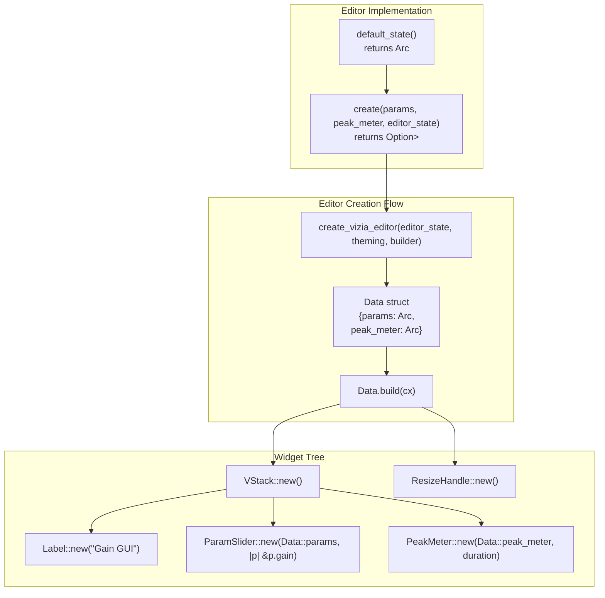
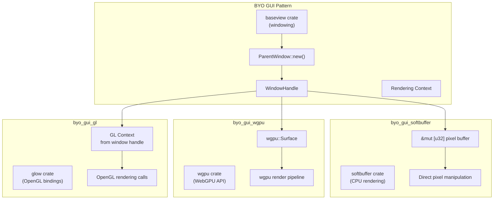

# Simple Examples

> **Relevant source files**
> * [Cargo.lock](https://github.com/robbert-vdh/nih-plug/blob/28b149ec/Cargo.lock)
> * [Cargo.toml](https://github.com/robbert-vdh/nih-plug/blob/28b149ec/Cargo.toml)
> * [README.md](https://github.com/robbert-vdh/nih-plug/blob/28b149ec/README.md)
> * [plugins/crisp/src/editor.rs](https://github.com/robbert-vdh/nih-plug/blob/28b149ec/plugins/crisp/src/editor.rs)
> * [plugins/diopser/src/editor.rs](https://github.com/robbert-vdh/nih-plug/blob/28b149ec/plugins/diopser/src/editor.rs)
> * [plugins/examples/gain_gui_vizia/src/editor.rs](https://github.com/robbert-vdh/nih-plug/blob/28b149ec/plugins/examples/gain_gui_vizia/src/editor.rs)
> * [plugins/spectral_compressor/src/editor.rs](https://github.com/robbert-vdh/nih-plug/blob/28b149ec/plugins/spectral_compressor/src/editor.rs)

## Purpose and Scope

This page documents the basic example plugins included in the NIH-plug repository that demonstrate fundamental framework features. These examples are designed as starting points for plugin developers to understand core concepts like parameter management, audio processing, MIDI handling, and GUI integration.

For more complex examples demonstrating advanced features like SIMD processing, spectral analysis, and custom widgets, see:

* [Diopser Plugin](/robbert-vdh/nih-plug/5.2-diopser-plugin) - phase rotation with advanced GUI
* [Spectral Compressor Plugin](/robbert-vdh/nih-plug/5.3-spectral-compressor-plugin) - FFT-based dynamics processing
* [Crisp Plugin](/robbert-vdh/nih-plug/5.4-crisp-plugin) - ring modulation with filtering

## Overview of Simple Examples

The NIH-plug repository includes several simple examples located in `plugins/examples/`:

| Example | Purpose | Key Features |
| --- | --- | --- |
| **gain** | Basic audio processing | Parameter smoothing, state serialization |
| **sine** | Tone generation | MIDI input, oscillator implementation |
| **midi_inverter** | MIDI event processing | Note event transformation, MIDI I/O |
| **gain_gui_vizia** | GUI with VIZIA | Peak meter, parameter controls |
| **gain_gui_egui** | GUI with egui | Same functionality as VIZIA variant |
| **gain_gui_iced** | GUI with iced | Same functionality as VIZIA variant |
| **byo_gui_gl** | Custom OpenGL rendering | Raw window handle access |
| **byo_gui_wgpu** | Custom wgpu rendering | Modern graphics API integration |
| **byo_gui_softbuffer** | Custom software rendering | CPU-based drawing |

Sources: [Cargo.toml L24-L36](https://github.com/robbert-vdh/nih-plug/blob/28b149ec/Cargo.toml#L24-L36)

 [README.md L196-L224](https://github.com/robbert-vdh/nih-plug/blob/28b149ec/README.md#L196-L224)

## The Gain Plugin Architecture

The `gain` example demonstrates the minimal structure of a NIH-plug plugin. It implements a simple gain control with parameter smoothing and persistent state.



Sources: [README.md L197-L199](https://github.com/robbert-vdh/nih-plug/blob/28b149ec/README.md#L197-L199)

### Core Components

The gain plugin consists of three primary code entities:

1. **Plugin struct** (`Gain`): Holds the parameter reference and implements the `Plugin` trait
2. **Parameters struct** (`GainParams`): Defines all plugin parameters using the declarative parameter system
3. **Processing logic**: Implemented in the `Plugin::process()` method



### Parameter Declaration

The gain plugin uses the `#[derive(Params)]` macro to automatically generate parameter enumeration and serialization:

**Key Parameter Fields:**

* `gain: FloatParam` - The main gain parameter with `#[id = "gain"]` attribute
* `editor_state: Arc<ViziaState>` - Persistent editor state (not a parameter, but serialized via `#[persist]`)

The `FloatParam` includes:

* Range and default value configuration
* Value-to-string and string-to-value formatters
* Built-in `Smoother` for artifact-free parameter changes
* Step size configuration for automation

### Processing Implementation

The `process()` method iterates over audio samples and applies gain:

**Processing Pattern:**

1. Iterate over samples using `buffer.iter_samples()`
2. For each sample, get the next smoothed gain value
3. Convert gain from dB to linear scale
4. Multiply each channel's sample by the gain

**State Management:**

* Parameters are accessed via `Arc<GainParams>` shared reference
* Atomic operations ensure thread-safe parameter reads
* `Smoother` handles interpolation between parameter changes

Sources: [README.md L197-L199](https://github.com/robbert-vdh/nih-plug/blob/28b149ec/README.md#L197-L199)

 [Cargo.toml L28](https://github.com/robbert-vdh/nih-plug/blob/28b149ec/Cargo.toml#L28-L28)

## The Sine Plugin

The `sine` example extends the basic gain pattern by adding tone generation with optional MIDI input support.



**Key Differences from Gain:**

* **MIDI Input**: Processes `NoteEvent::NoteOn` and `NoteOff` to control frequency
* **Oscillator State**: Maintains phase accumulator between process calls
* **Event Handling**: Uses `ProcessContext::next_event()` to consume MIDI events
* **Conditional Processing**: `use_midi` parameter switches between fixed frequency and MIDI-controlled mode

Sources: [README.md L216-L218](https://github.com/robbert-vdh/nih-plug/blob/28b149ec/README.md#L216-L218)

 [Cargo.toml L34](https://github.com/robbert-vdh/nih-plug/blob/28b149ec/Cargo.toml#L34-L34)

## The MIDI Inverter Plugin

The `midi_inverter` example demonstrates bidirectional MIDI event processing without audio modification.



**Event Transformation Examples:**

* Note numbers: `note = 127 - note` (inverts pitch)
* Channel: `channel = 15 - channel` (inverts MIDI channel)
* Velocity/pressure: `value = 1.0 - value` (inverts normalized value)
* CC values: `value = 1.0 - value`

**Audio Passthrough:**
The plugin passes audio unchanged by not modifying the buffer in `process()`, demonstrating that NIH-plug plugins can be MIDI-only processors.

Sources: [README.md L210-L212](https://github.com/robbert-vdh/nih-plug/blob/28b149ec/README.md#L210-L212)

 [Cargo.toml L32](https://github.com/robbert-vdh/nih-plug/blob/28b149ec/Cargo.toml#L32-L32)

## GUI Framework Integration

NIH-plug provides three first-party GUI framework adapters, all demonstrated through variants of the gain plugin with identical functionality but different GUI implementations.



Sources: [README.md L200-L204](https://github.com/robbert-vdh/nih-plug/blob/28b149ec/README.md#L200-L204)

 [Cargo.toml L29-L31](https://github.com/robbert-vdh/nih-plug/blob/28b149ec/Cargo.toml#L29-L31)

 [plugins/examples/gain_gui_vizia/src/editor.rs L1-L68](https://github.com/robbert-vdh/nih-plug/blob/28b149ec/plugins/examples/gain_gui_vizia/src/editor.rs#L1-L68)

### VIZIA Variant Structure

The `gain_gui_vizia` example demonstrates the VIZIA adapter pattern:



**Key VIZIA Concepts:**

* **`Data` struct with `Lens` derive**: Provides reactive data binding between plugin state and UI
* **`create_vizia_editor()`**: Factory function that takes state, theming, and a builder closure
* **`VStack/HStack`**: Layout containers for organizing widgets
* **`ParamSlider::new(cx, Data::params, accessor)`**: Declarative parameter widget with automatic synchronization
* **`PeakMeter::new()`**: Custom widget with decay animation via `Duration` parameter
* **`ResizeHandle::new()`**: Built-in widget for window resizing

Sources: [plugins/examples/gain_gui_vizia/src/editor.rs L20-L67](https://github.com/robbert-vdh/nih-plug/blob/28b149ec/plugins/examples/gain_gui_vizia/src/editor.rs#L20-L67)

### Framework Comparison

| Aspect | VIZIA | egui | iced |
| --- | --- | --- | --- |
| **Creation Function** | `create_vizia_editor()` | `create_egui_editor()` | `create_iced_editor()` |
| **State Type** | `ViziaState` | `EguiState` | `IcedState` |
| **Data Binding** | Lens-based reactivity | Immediate mode (no binding) | Message-based architecture |
| **Parameter Widget** | `ParamSlider::new(cx, lens, accessor)` | `ui_for_param(ui, param, setter)` | `ParamSlider::new(param, message)` |
| **Layout Style** | Declarative containers (VStack/HStack) | Immediate mode layout calls | Declarative element tree |
| **Custom Widgets** | View trait implementation | Custom painting in ui context | Widget trait implementation |
| **Styling** | CSS-like stylesheets | Inline styling API | Custom renderer or built-in styles |

### Editor State Persistence

All three GUI variants use framework-specific state structs that persist:

* Window size via `ViziaState::new(|| (width, height))`
* The state is stored in the `GainParams` struct with `#[persist = "editor-state"]`
* Serialization happens automatically through the `Params` trait implementation

The `default_state()` function creates initial state that gets used if no persisted state exists:

```rust
// Common pattern across all variants
pub(crate) fn default_state() -> Arc<StateType> {
    StateType::new(|| (width, height))
}
```

Sources: [plugins/examples/gain_gui_vizia/src/editor.rs L20-L23](https://github.com/robbert-vdh/nih-plug/blob/28b149ec/plugins/examples/gain_gui_vizia/src/editor.rs#L20-L23)

## Custom Rendering Examples (BYO GUI)

The "bring your own GUI" examples demonstrate raw window handle access for custom rendering, bypassing the provided GUI framework adapters.



**Common Pattern:**

1. Create `baseview::Window` with `ParentWindow::new()`
2. Extract raw window handle via `raw-window-handle` crate
3. Create rendering context (GL, wgpu, or software buffer)
4. Implement custom rendering loop
5. Handle parameter updates via atomic reads from `Arc<AtomicF32>`

**Use Cases:**

* **OpenGL**: High-performance 2D/3D graphics, shader-based effects
* **wgpu**: Cross-platform modern graphics, compute shaders
* **softbuffer**: Simple CPU-based drawing, maximum compatibility

These examples show that NIH-plug does not mandate a specific GUI approach—developers can use any rendering technology that works with raw window handles.

Sources: [README.md L206-L208](https://github.com/robbert-vdh/nih-plug/blob/28b149ec/README.md#L206-L208)

 [Cargo.toml L25-L27](https://github.com/robbert-vdh/nih-plug/blob/28b149ec/Cargo.toml#L25-L27)

## Building and Running Simple Examples

To build any simple example plugin:

```go
# Build specific example
cargo xtask bundle gain --release
cargo xtask bundle sine --release
cargo xtask bundle midi_inverter --release

# Build GUI variant
cargo xtask bundle gain_gui_vizia --release
cargo xtask bundle gain_gui_egui --release
cargo xtask bundle gain_gui_iced --release
```

The `cargo xtask bundle` command automatically:

1. Detects which plugin formats are exported (VST3, CLAP, standalone)
2. Compiles the plugin for the current platform
3. Creates properly structured bundles in `target/bundled/`
4. Copies necessary resources and sets bundle metadata

For standalone testing without a DAW:

```go
# If standalone feature is enabled
cargo run --package gain --release --features standalone
```

Sources: [README.md L172-L191](https://github.com/robbert-vdh/nih-plug/blob/28b149ec/README.md#L172-L191)