# Spectral Compressor Plugin

> **Relevant source files**
> * [plugins/crisp/src/editor.rs](https://github.com/robbert-vdh/nih-plug/blob/28b149ec/plugins/crisp/src/editor.rs)
> * [plugins/diopser/src/editor.rs](https://github.com/robbert-vdh/nih-plug/blob/28b149ec/plugins/diopser/src/editor.rs)
> * [plugins/examples/gain_gui_vizia/src/editor.rs](https://github.com/robbert-vdh/nih-plug/blob/28b149ec/plugins/examples/gain_gui_vizia/src/editor.rs)
> * [plugins/spectral_compressor/src/compressor_bank.rs](https://github.com/robbert-vdh/nih-plug/blob/28b149ec/plugins/spectral_compressor/src/compressor_bank.rs)
> * [plugins/spectral_compressor/src/curve.rs](https://github.com/robbert-vdh/nih-plug/blob/28b149ec/plugins/spectral_compressor/src/curve.rs)
> * [plugins/spectral_compressor/src/editor.rs](https://github.com/robbert-vdh/nih-plug/blob/28b149ec/plugins/spectral_compressor/src/editor.rs)
> * [plugins/spectral_compressor/src/lib.rs](https://github.com/robbert-vdh/nih-plug/blob/28b149ec/plugins/spectral_compressor/src/lib.rs)

## Purpose and Scope

This page documents the **Spectral Compressor** plugin, an FFT-based dynamics processor that applies independent compression to each frequency bin. The plugin performs both upwards and downwards compression with frequency-dependent thresholds defined by polynomial curves, supporting internal processing and two sidechain modes.

This page covers the STFT processing pipeline, the `CompressorBank` system, threshold curve computation, envelope followers, and the spectrum analyzer GUI. For general STFT concepts and the `StftHelper` adapter, see [STFT and Spectral Processing](/robbert-vdh/nih-plug/6.1-stft-and-spectral-processing). For basic plugin structure and the `Plugin` trait implementation, see [Plugin Trait](/robbert-vdh/nih-plug/2.1-plugin-trait).

---

## Architecture Overview

The Spectral Compressor is structured around an overlap-add STFT pipeline with per-bin compression applied in the frequency domain. The main components form a processing chain from time-domain input to frequency-domain analysis, compression, and back to time-domain output.

### Component Hierarchy

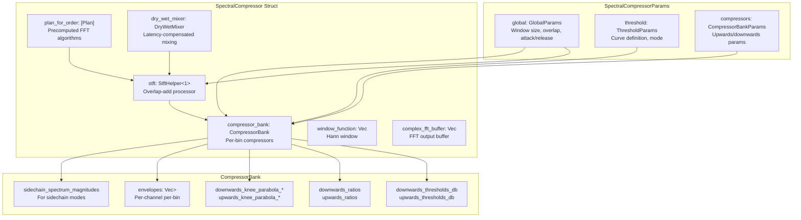

**Sources:** [plugins/spectral_compressor/src/lib.rs L55-L84](https://github.com/robbert-vdh/nih-plug/blob/28b149ec/plugins/spectral_compressor/src/lib.rs#L55-L84)

 [plugins/spectral_compressor/src/lib.rs L94-L118](https://github.com/robbert-vdh/nih-plug/blob/28b149ec/plugins/spectral_compressor/src/lib.rs#L94-L118)

 [plugins/spectral_compressor/src/compressor_bank.rs L49-L115](https://github.com/robbert-vdh/nih-plug/blob/28b149ec/plugins/spectral_compressor/src/compressor_bank.rs#L49-L115)

---

## STFT Processing Pipeline

The plugin uses NIH-plug's `StftHelper` to perform overlap-add processing, converting between time and frequency domains. The processing chain differs based on the selected threshold mode.

### Processing Flow Diagram

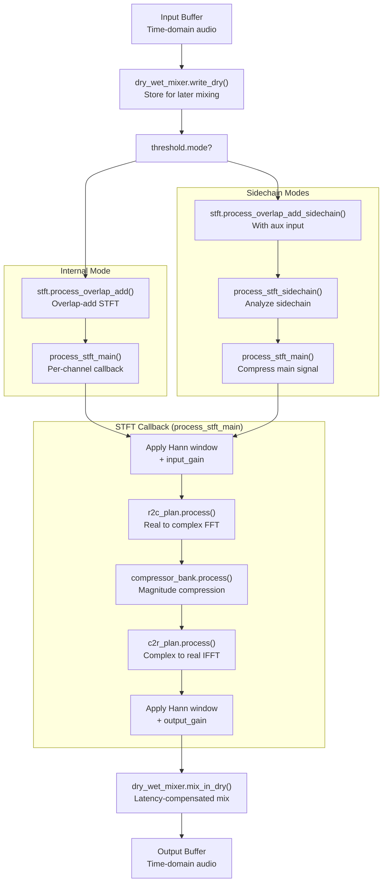

**Sources:** [plugins/spectral_compressor/src/lib.rs L393-L508](https://github.com/robbert-vdh/nih-plug/blob/28b149ec/plugins/spectral_compressor/src/lib.rs#L393-L508)

 [plugins/spectral_compressor/src/lib.rs L546-L595](https://github.com/robbert-vdh/nih-plug/blob/28b149ec/plugins/spectral_compressor/src/lib.rs#L546-L595)

 [plugins/spectral_compressor/src/lib.rs L600-L620](https://github.com/robbert-vdh/nih-plug/blob/28b149ec/plugins/spectral_compressor/src/lib.rs#L600-L620)

### Window Size and Overlap Configuration

The plugin supports configurable FFT window sizes (powers of 2 from 64 to 32768) and overlap amounts (4x to 32x). All FFT plans are precomputed during initialization to avoid runtime allocation:


The window size determines frequency resolution (`sample_rate / window_size` Hz per bin), while overlap determines temporal resolution and gain compensation requirements. Gain compensation is calculated as `((overlap_times / 4.0) * 1.5).recip() / window_size`, split between input and output stages.

**Sources:** [plugins/spectral_compressor/src/lib.rs L35-L52](https://github.com/robbert-vdh/nih-plug/blob/28b149ec/plugins/spectral_compressor/src/lib.rs#L35-L52)

 [plugins/spectral_compressor/src/lib.rs L366-L379](https://github.com/robbert-vdh/nih-plug/blob/28b149ec/plugins/spectral_compressor/src/lib.rs#L366-L379)

 [plugins/spectral_compressor/src/lib.rs L410-L433](https://github.com/robbert-vdh/nih-plug/blob/28b149ec/plugins/spectral_compressor/src/lib.rs#L410-L433)

---

## CompressorBank System

The `CompressorBank` struct manages a bank of independent compressors, one for each FFT bin. It maintains per-bin thresholds, ratios, knee parameters, and envelope followers across all channels.

### Data Structure Organization

| Vector | Purpose | Length | Type |
| --- | --- | --- | --- |
| `ln_freqs` | Precomputed `ln(frequency)` for each bin | `window_size / 2 + 1` | `Vec<f32>` |
| `downwards_thresholds_db` | Downwards compression thresholds | `window_size / 2 + 1` | `Vec<f32>` |
| `downwards_ratios` | Downwards compression ratios | `window_size / 2 + 1` | `Vec<f32>` |
| `downwards_knee_parabola_scale` | Soft knee `a` coefficient | `window_size / 2 + 1` | `Vec<f32>` |
| `downwards_knee_parabola_intercept` | Soft knee `b` coefficient | `window_size / 2 + 1` | `Vec<f32>` |
| `upwards_thresholds_db` | Upwards compression thresholds | `window_size / 2 + 1` | `Vec<f32>` |
| `upwards_ratios` | Upwards compression ratios | `window_size / 2 + 1` | `Vec<f32>` |
| `upwards_knee_parabola_scale` | Soft knee `a` coefficient | `window_size / 2 + 1` | `Vec<f32>` |
| `upwards_knee_parabola_intercept` | Soft knee `b` coefficient | `window_size / 2 + 1` | `Vec<f32>` |
| `envelopes` | Current envelope values per channel | `[num_channels][window_size / 2 + 1]` | `Vec<Vec<f32>>` |
| `sidechain_spectrum_magnitudes` | Sidechain magnitudes per channel | `[num_channels][window_size / 2 + 1]` | `Vec<Vec<f32>>` |

**Sources:** [plugins/spectral_compressor/src/compressor_bank.rs L49-L115](https://github.com/robbert-vdh/nih-plug/blob/28b149ec/plugins/spectral_compressor/src/compressor_bank.rs#L49-L115)

### Update Mechanism

Parameter changes trigger lazy updates via atomic flags. When a parameter changes, a callback sets the corresponding flag, and the compressor bank checks these flags before processing:

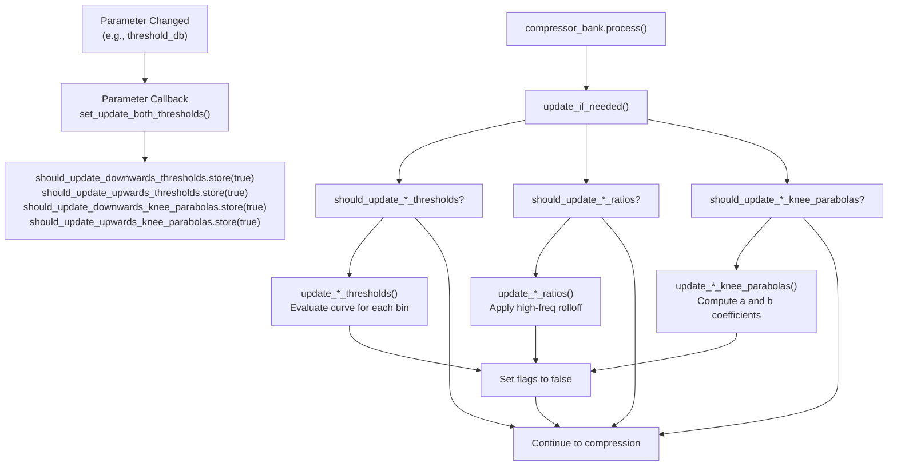

**Sources:** [plugins/spectral_compressor/src/compressor_bank.rs L209-L296](https://github.com/robbert-vdh/nih-plug/blob/28b149ec/plugins/spectral_compressor/src/compressor_bank.rs#L209-L296)

 [plugins/spectral_compressor/src/compressor_bank.rs L583-L609](https://github.com/robbert-vdh/nih-plug/blob/28b149ec/plugins/spectral_compressor/src/compressor_bank.rs#L583-L609)

---

## Threshold Curve System

Thresholds are computed using a polynomial curve evaluated in log-log space (frequency in octaves, gain in decibels). This allows frequency-dependent thresholds that naturally align with how humans perceive pitch and loudness.

### Curve Evaluation

The `Curve` struct evaluates the polynomial:

```
threshold_db = intercept + slope * (ln(freq) - ln(center_freq)) + curve * (ln(freq) - ln(center_freq))²
```

Where:

* **intercept**: Global threshold level (`threshold_db` parameter)
* **center_frequency**: The frequency around which the curve is centered
* **slope**: Linear slope in dB/octave (`curve_slope` parameter)
* **curve**: Parabolic curvature in dB/octave² (`curve_curve` parameter)

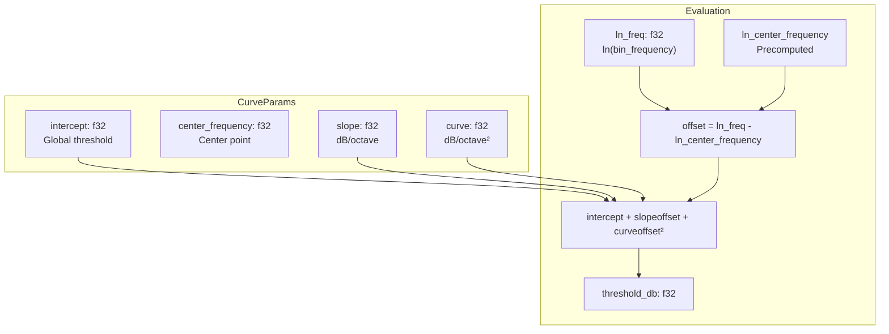

The curve supports three primary shapes:

* **Flat** (slope=0, curve=0): Equal threshold across all frequencies
* **Tilted** (slope≠0, curve=0): Linear tilt, e.g., -3 dB/octave to match pink noise
* **V-shaped or inverted-V** (curve≠0): Parabolic, emphasizing or de-emphasizing center frequencies

**Sources:** [plugins/spectral_compressor/src/curve.rs L1-L63](https://github.com/robbert-vdh/nih-plug/blob/28b149ec/plugins/spectral_compressor/src/curve.rs#L1-L63)

 [plugins/spectral_compressor/src/compressor_bank.rs L298-L314](https://github.com/robbert-vdh/nih-plug/blob/28b149ec/plugins/spectral_compressor/src/compressor_bank.rs#L298-L314)

### Pink Noise Compensation

In `ThresholdMode::Internal`, the plugin automatically applies a -3 dB/octave slope offset to match pink noise spectral distribution. This is removed for sidechain modes where the curve should directly reflect the sidechain input:

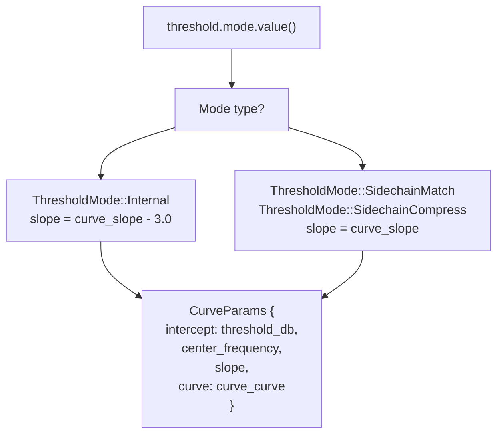

**Sources:** [plugins/spectral_compressor/src/compressor_bank.rs L298-L314](https://github.com/robbert-vdh/nih-plug/blob/28b149ec/plugins/spectral_compressor/src/compressor_bank.rs#L298-L314)

---

## Sidechain Modes

The plugin supports three operating modes that fundamentally change how compression thresholds are determined.

### Mode Comparison

```mermaid
flowchart TD

CompCurve["Curve defines base shape<br>No pink noise offset"]
CompSC["Sidechain magnitudes<br>stored per channel"]
CompEnv["Envelopes track<br>sidechain magnitudes"]
CompComp["Compress main signal<br>based on sidechain"]
MatchCurve["Curve defines base shape<br>No pink noise offset"]
MatchSC["Sidechain magnitudes<br>stored per channel"]
MatchMult["Effective threshold =<br>curve_threshold * sc_magnitude"]
MatchEnv["Envelopes track<br>main signal magnitudes"]
MatchComp["Compress to match<br>sidechain spectrum"]
IntCurve["Curve defines thresholds<br>-3 dB/oct pink noise offset"]
IntEnv["Envelopes track<br>main signal magnitudes"]
IntComp["Compress based on<br>main signal envelopes"]

subgraph ThresholdMode::SidechainCompress ["ThresholdMode::SidechainCompress"]
    CompCurve
    CompSC
    CompEnv
    CompComp
    CompCurve --> CompSC
    CompSC --> CompEnv
    CompEnv --> CompComp
end

subgraph ThresholdMode::SidechainMatch ["ThresholdMode::SidechainMatch"]
    MatchCurve
    MatchSC
    MatchMult
    MatchEnv
    MatchComp
    MatchCurve --> MatchSC
    MatchSC --> MatchMult
    MatchMult --> MatchEnv
    MatchEnv --> MatchComp
end

subgraph ThresholdMode::Internal ["ThresholdMode::Internal"]
    IntCurve
    IntEnv
    IntComp
    IntCurve --> IntEnv
    IntEnv --> IntComp
end
```

### Sidechain Channel Linking

The `sc_channel_link` parameter (0.0 to 1.0) controls how much of other channels' sidechain data to blend in before multiplying with thresholds or computing envelopes. This creates more consistent compression behavior across stereo/multi-channel material:

```yaml
effective_sc_magnitude[ch][bin] = 
    this_channel_t * sc_magnitude[ch][bin] + 
    other_channels_t * sum(sc_magnitude[other_ch][bin]) / (num_channels - 1)

where:
    other_channels_t = sc_channel_link / num_channels
    this_channel_t = 1.0 - (other_channels_t * (num_channels - 1))
```

**Sources:** [plugins/spectral_compressor/src/compressor_bank.rs L151-L174](https://github.com/robbert-vdh/nih-plug/blob/28b149ec/plugins/spectral_compressor/src/compressor_bank.rs#L151-L174)

 [plugins/spectral_compressor/src/compressor_bank.rs L610-L626](https://github.com/robbert-vdh/nih-plug/blob/28b149ec/plugins/spectral_compressor/src/compressor_bank.rs#L610-L626)

 [plugins/spectral_compressor/src/compressor_bank.rs L784-L811](https://github.com/robbert-vdh/nih-plug/blob/28b149ec/plugins/spectral_compressor/src/compressor_bank.rs#L784-L811)

---

## Envelope Followers

Each FFT bin has its own envelope follower that tracks the magnitude over time, with separate attack and release characteristics. Envelopes are initialized to `ENVELOPE_INIT_VALUE` (RMS of -24 dB sine wave ≈ 0.0884) to prevent pops during initialization.

### Envelope Update Algorithm

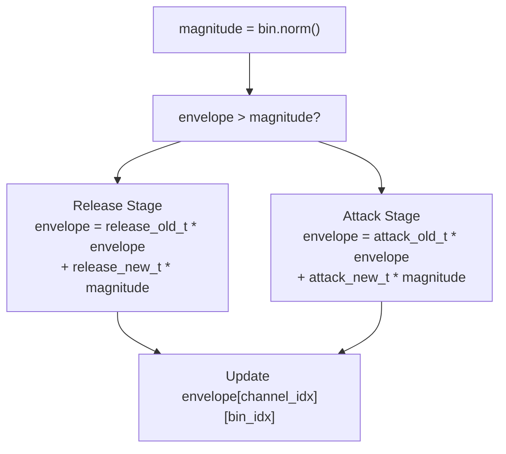

The coefficients `attack_old_t` and `release_old_t` are computed based on attack/release times and the effective sample rate (compensating for overlap):

```
effective_sample_rate = sample_rate / (window_size / overlap_times)
attack_old_t = exp(-1.0 / (attack_ms / 1000.0 * effective_sample_rate))
attack_new_t = 1.0 - attack_old_t
```

This gives a time constant where the envelope reaches 63.2% of the target after the specified attack/release time.

**Sources:** [plugins/spectral_compressor/src/compressor_bank.rs L685-L740](https://github.com/robbert-vdh/nih-plug/blob/28b149ec/plugins/spectral_compressor/src/compressor_bank.rs#L685-L740)

### Timing Scale Fade-In

After reset (e.g., when changing window size or after plugin suspend), the envelope follower timings are gradually faded in over 150ms to prevent huge spikes:

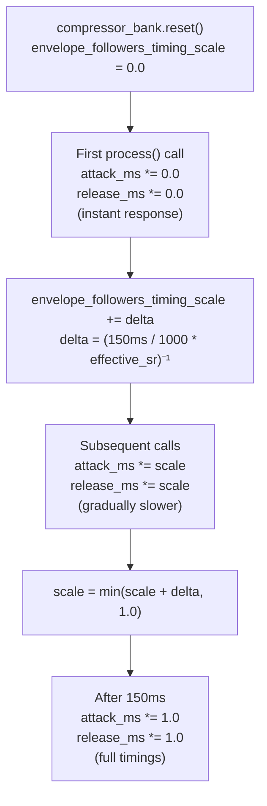

**Sources:** [plugins/spectral_compressor/src/compressor_bank.rs L33-L44](https://github.com/robbert-vdh/nih-plug/blob/28b149ec/plugins/spectral_compressor/src/compressor_bank.rs#L33-L44)

 [plugins/spectral_compressor/src/compressor_bank.rs L567-L576](https://github.com/robbert-vdh/nih-plug/blob/28b149ec/plugins/spectral_compressor/src/compressor_bank.rs#L567-L576)

 [plugins/spectral_compressor/src/compressor_bank.rs L695-L708](https://github.com/robbert-vdh/nih-plug/blob/28b149ec/plugins/spectral_compressor/src/compressor_bank.rs#L695-L708)

---

## Compression Application

The actual gain reduction is computed per-bin using the envelope value, threshold, ratio, and soft-knee parameters. Both upwards and downwards compression are applied sequentially.

### Gain Computation Formula

For each bin, the compressor calculates gain in dB using a soft-knee implementation:

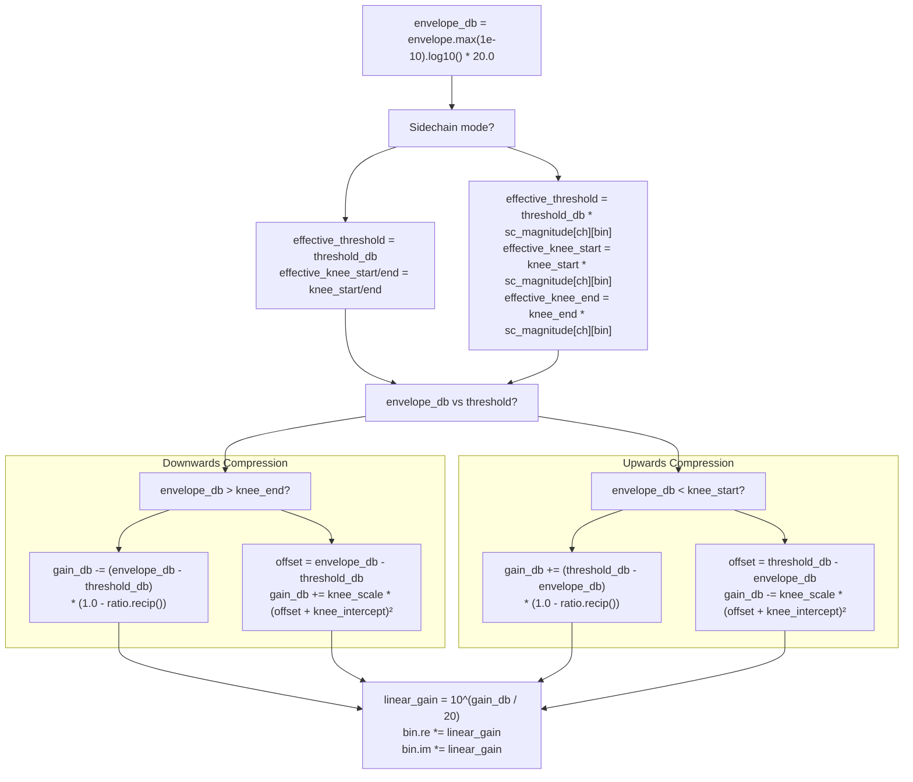

The soft-knee parabola uses the formula `gain_db += a * (x + b)²` where `a` is `knee_parabola_scale` and `b` is `knee_parabola_intercept`. These are precomputed when parameters change.

**Sources:** [plugins/spectral_compressor/src/compressor_bank.rs L813-L947](https://github.com/robbert-vdh/nih-plug/blob/28b149ec/plugins/spectral_compressor/src/compressor_bank.rs#L813-L947)

 [plugins/spectral_compressor/src/compressor_bank.rs L949-L1077](https://github.com/robbert-vdh/nih-plug/blob/28b149ec/plugins/spectral_compressor/src/compressor_bank.rs#L949-L1077)

### High-Frequency Ratio Rolloff

The `high_freq_ratio_rolloff` parameter scales compression ratios logarithmically across frequency, reducing the ratio for high frequencies:

```
ratio_multiplier = rolloff_amount^((ln(freq) - ln(22050)) / ln(22050))
effective_ratio = 1.0 + (ratio - 1.0) * ratio_multiplier
```

This prevents the compressor from making the signal unnaturally bright when using aggressive ratios.

**Sources:** [plugins/spectral_compressor/src/compressor_bank.rs L36-L40](https://github.com/robbert-vdh/nih-plug/blob/28b149ec/plugins/spectral_compressor/src/compressor_bank.rs#L36-L40)

 [plugins/spectral_compressor/src/compressor_bank.rs L1091-L1115](https://github.com/robbert-vdh/nih-plug/blob/28b149ec/plugins/spectral_compressor/src/compressor_bank.rs#L1091-L1115)

---

## GUI and Visualization

The editor displays both the plugin controls and an optional spectrum analyzer showing real-time compression activity.

### Editor Structure

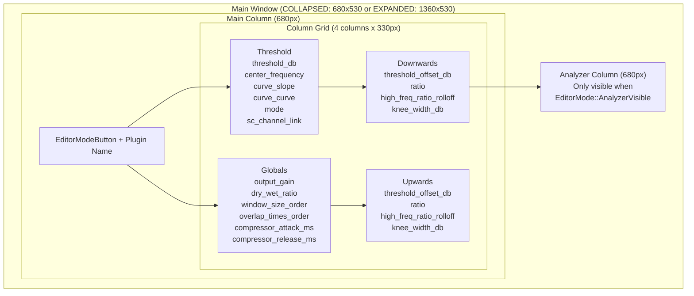

**Sources:** [plugins/spectral_compressor/src/editor.rs L34-L79](https://github.com/robbert-vdh/nih-plug/blob/28b149ec/plugins/spectral_compressor/src/editor.rs#L34-L79)

 [plugins/spectral_compressor/src/editor.rs L108-L249](https://github.com/robbert-vdh/nih-plug/blob/28b149ec/plugins/spectral_compressor/src/editor.rs#L108-L249)

### Analyzer Data Flow

The analyzer visualizes both the envelope followers and the gain reduction being applied:

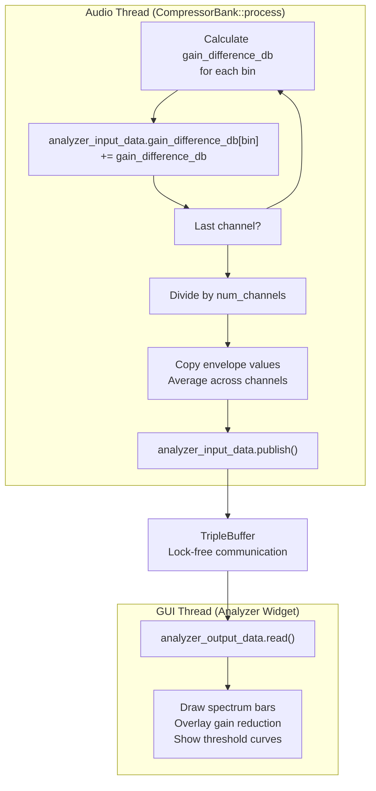

The `TripleBuffer` enables lock-free, wait-free communication from the audio thread to the GUI thread. The audio thread writes `AnalyzerData` containing:

* `envelope_followers`: Averaged envelope magnitudes across all channels
* `gain_difference_db`: Averaged gain reduction being applied
* `curve_params` and `curve_offsets_db`: For drawing threshold curves
* `num_bins`: Current FFT size

**Sources:** [plugins/spectral_compressor/src/compressor_bank.rs L111-L115](https://github.com/robbert-vdh/nih-plug/blob/28b149ec/plugins/spectral_compressor/src/compressor_bank.rs#L111-L115)

 [plugins/spectral_compressor/src/compressor_bank.rs L600-L672](https://github.com/robbert-vdh/nih-plug/blob/28b149ec/plugins/spectral_compressor/src/compressor_bank.rs#L600-L672)

 [plugins/spectral_compressor/src/editor.rs L225-L232](https://github.com/robbert-vdh/nih-plug/blob/28b149ec/plugins/spectral_compressor/src/editor.rs#L225-L232)

---

## Key Parameters

### Global Parameters (GlobalParams)

| Parameter | Range | Default | Purpose |
| --- | --- | --- | --- |
| `output_gain` | -50 to +50 dB | 0 dB | Post-processing gain applied after IDFT |
| `dry_wet_ratio` | 0% to 100% | 100% | Latency-compensated dry/wet mix |
| `window_size_order` | 6 to 15 (64 to 32768 samples) | 11 (2048) | FFT window size as power of 2 |
| `overlap_times_order` | 2 to 5 (4x to 32x) | 4 (16x) | Overlap amount as power of 2 |
| `compressor_attack_ms` | 0 to 10000 ms | 150 ms | Envelope follower attack time |
| `compressor_release_ms` | 0 to 10000 ms | 300 ms | Envelope follower release time |

**Sources:** [plugins/spectral_compressor/src/lib.rs L120-L152](https://github.com/robbert-vdh/nih-plug/blob/28b149ec/plugins/spectral_compressor/src/lib.rs#L120-L152)

 [plugins/spectral_compressor/src/lib.rs L193-L261](https://github.com/robbert-vdh/nih-plug/blob/28b149ec/plugins/spectral_compressor/src/lib.rs#L193-L261)

### Threshold Parameters (ThresholdParams)

| Parameter | Range | Default | Purpose |
| --- | --- | --- | --- |
| `threshold_db` | -100 to +20 dB | -12 dB | Global threshold (curve intercept) |
| `center_frequency` | 20 to 20000 Hz | 420 Hz | Center of threshold curve |
| `curve_slope` | -36 to +36 dB/oct | 0 dB/oct | Linear slope of threshold curve |
| `curve_curve` | -24 to +24 dB/oct² | 0 dB/oct² | Parabolic curvature coefficient |
| `mode` | Enum | Internal | Threshold mode (Internal/SidechainMatch/SidechainCompress) |
| `sc_channel_link` | 0% to 100% | 80% | Sidechain channel linking amount |

**Sources:** [plugins/spectral_compressor/src/compressor_bank.rs L117-L149](https://github.com/robbert-vdh/nih-plug/blob/28b149ec/plugins/spectral_compressor/src/compressor_bank.rs#L117-L149)

 [plugins/spectral_compressor/src/compressor_bank.rs L209-L296](https://github.com/robbert-vdh/nih-plug/blob/28b149ec/plugins/spectral_compressor/src/compressor_bank.rs#L209-L296)

### Compressor Parameters (CompressorParams)

Separate instances exist for upwards and downwards compression, with identical parameter structures:

| Parameter | Range | Default (Down/Up) | Purpose |
| --- | --- | --- | --- |
| `threshold_offset_db` | -50 to +50 dB | 0 dB | Offset from curve threshold |
| `ratio` | 1.0 to 500.0 | 1.0 | Compression ratio (1.0 = disabled) |
| `high_freq_ratio_rolloff` | 0% to 100% | 0% / 75% | High-frequency ratio reduction |
| `knee_width_db` | 0 to 36 dB | 6 dB | Soft-knee width |

**Sources:** [plugins/spectral_compressor/src/compressor_bank.rs L188-L207](https://github.com/robbert-vdh/nih-plug/blob/28b149ec/plugins/spectral_compressor/src/compressor_bank.rs#L188-L207)

 [plugins/spectral_compressor/src/compressor_bank.rs L339-L424](https://github.com/robbert-vdh/nih-plug/blob/28b149ec/plugins/spectral_compressor/src/compressor_bank.rs#L339-L424)

---

## Implementation Notes

### Capacity Management

The `CompressorBank` pre-allocates capacity for `MAX_WINDOW_SIZE` (32768 samples) to avoid runtime allocation when switching window sizes. The `resize()` method adjusts the active length without reallocating:

```javascript
// Pre-allocated capacity
let complex_buffer_len = MAX_WINDOW_SIZE / 2 + 1; // 16385

// Resize to current window size (no allocation if within capacity)
self.downwards_thresholds_db.resize(window_size / 2 + 1, 1.0);
```

**Sources:** [plugins/spectral_compressor/src/compressor_bank.rs L426-L467](https://github.com/robbert-vdh/nih-plug/blob/28b149ec/plugins/spectral_compressor/src/compressor_bank.rs#L426-L467)

 [plugins/spectral_compressor/src/compressor_bank.rs L511-L565](https://github.com/robbert-vdh/nih-plug/blob/28b149ec/plugins/spectral_compressor/src/compressor_bank.rs#L511-L565)

### DC Bin Handling

The plugin can optionally skip compression on DC bins (0-20 Hz) to prevent the Hann window from spreading DC content. The `first_non_dc_bin_idx` is computed based on window size:

```javascript
let first_non_dc_bin_idx = 
    (20.0 / ((sample_rate / 2.0) / num_bins as f32)).floor() as usize + 1;
```

Upwards compression is disabled for bins below this index to prevent amplifying convolved DC artifacts.

**Sources:** [plugins/spectral_compressor/src/lib.rs L413-L418](https://github.com/robbert-vdh/nih-plug/blob/28b149ec/plugins/spectral_compressor/src/lib.rs#L413-L418)

 [plugins/spectral_compressor/src/compressor_bank.rs L583-L626](https://github.com/robbert-vdh/nih-plug/blob/28b149ec/plugins/spectral_compressor/src/compressor_bank.rs#L583-L626)

### Parameter Smoothing

The plugin does not use parameter smoothing for compressor parameters because the overlap-add process itself provides smoothing. The `dry_wet_ratio` uses 15ms linear smoothing for seamless mixing.

**Sources:** [plugins/spectral_compressor/src/lib.rs L196-L197](https://github.com/robbert-vdh/nih-plug/blob/28b149ec/plugins/spectral_compressor/src/lib.rs#L196-L197)

 [plugins/spectral_compressor/src/lib.rs L211-L215](https://github.com/robbert-vdh/nih-plug/blob/28b149ec/plugins/spectral_compressor/src/lib.rs#L211-L215)

### Sample-Accurate Automation

The plugin enables `SAMPLE_ACCURATE_AUTOMATION = true`, ensuring that parameter changes are processed at exact sample positions rather than per-buffer. Combined with the STFT overlap, this provides very precise automation response.

**Sources:** [plugins/spectral_compressor/src/lib.rs L311](https://github.com/robbert-vdh/nih-plug/blob/28b149ec/plugins/spectral_compressor/src/lib.rs#L311-L311)