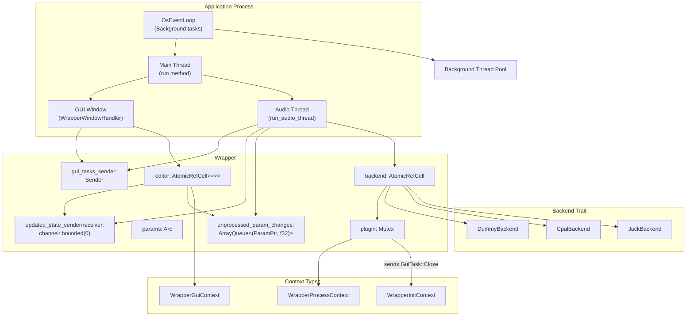
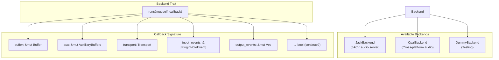
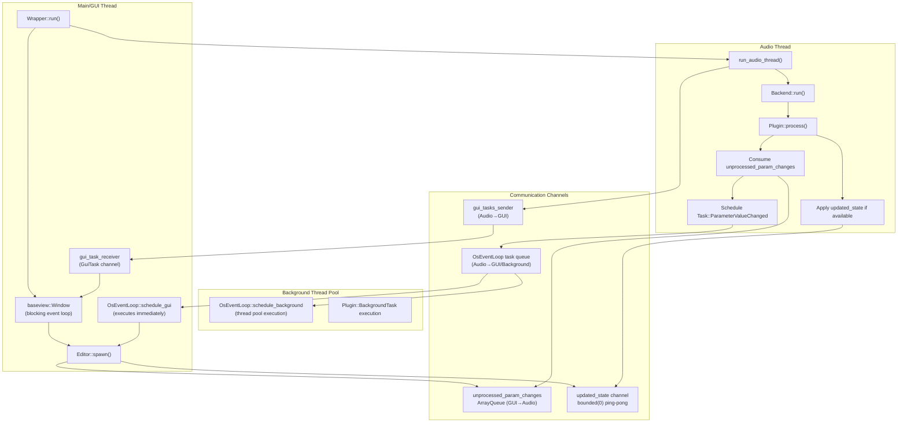
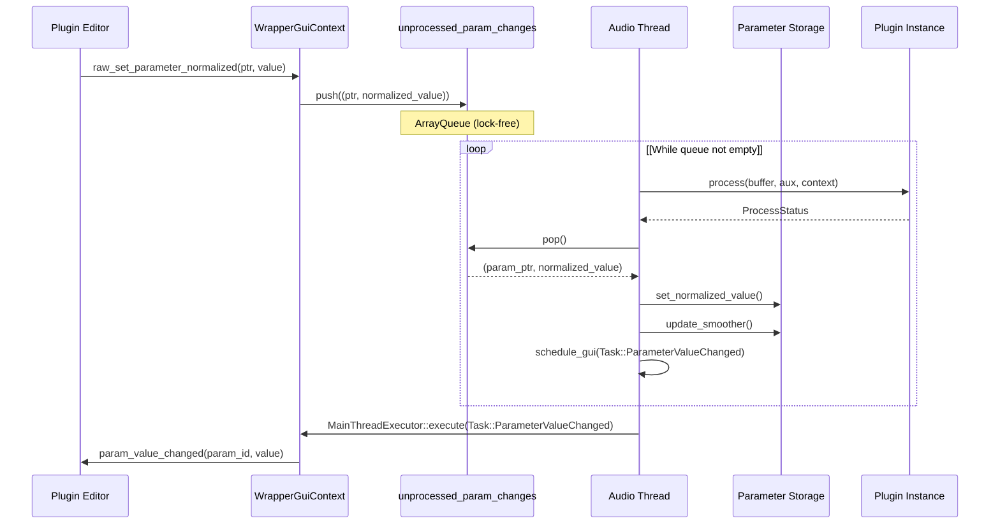
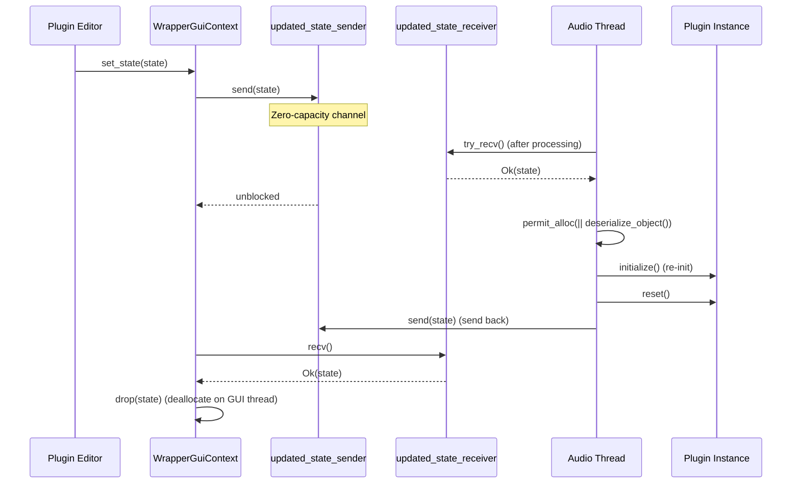
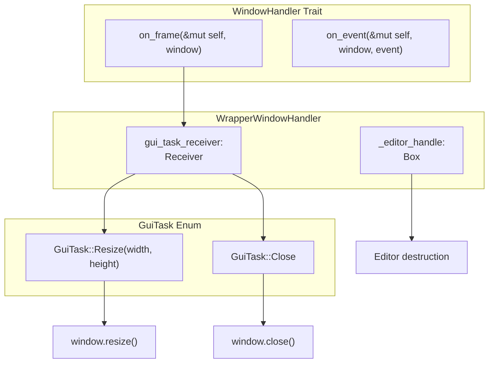
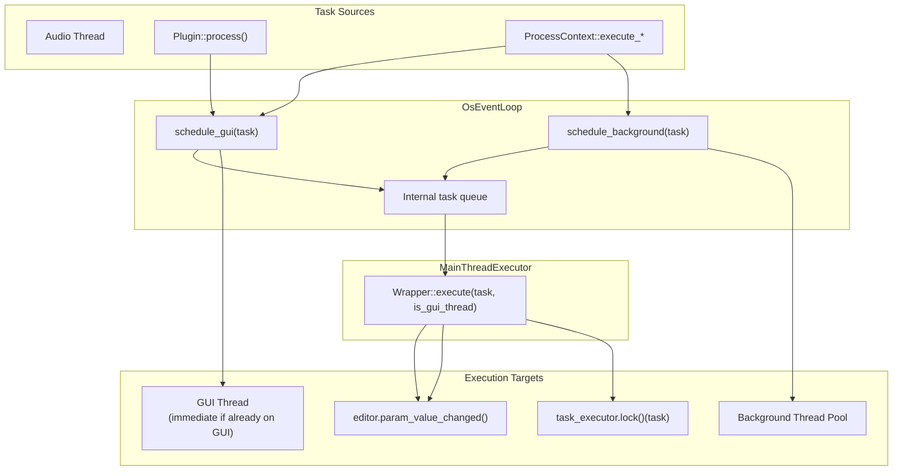

# Standalone Wrapper

> **Relevant source files**
> * [src/wrapper/standalone/context.rs](https://github.com/robbert-vdh/nih-plug/blob/28b149ec/src/wrapper/standalone/context.rs)
> * [src/wrapper/standalone/wrapper.rs](https://github.com/robbert-vdh/nih-plug/blob/28b149ec/src/wrapper/standalone/wrapper.rs)

## Purpose and Scope

The standalone wrapper enables NIH-plug plugins to run as independent executable applications rather than being loaded by a DAW or plugin host. This wrapper provides audio I/O through backend implementations (JACK or CPAL), manages the plugin lifecycle, handles GUI rendering via baseview, and orchestrates communication between audio processing and GUI threads.

For information about other plugin formats, see [VST3 Wrapper](/robbert-vdh/nih-plug/3.1-vst3-wrapper) and [CLAP Wrapper](/robbert-vdh/nih-plug/3.2-clap-wrapper). For details on the generic Plugin trait that the standalone wrapper implements, see [Plugin Trait](/robbert-vdh/nih-plug/2.1-plugin-trait).

**Sources:** [src/wrapper/standalone/wrapper.rs L1-L91](https://github.com/robbert-vdh/nih-plug/blob/28b149ec/src/wrapper/standalone/wrapper.rs#L1-L91)

## Architecture Overview

The standalone wrapper consists of three primary components: the `Wrapper` struct that manages plugin state and threading, a `Backend` trait for audio I/O abstraction, and context implementations that provide the plugin with access to wrapper functionality.



**Diagram: Standalone Wrapper Component Architecture**

**Sources:** [src/wrapper/standalone/wrapper.rs L30-L91](https://github.com/robbert-vdh/nih-plug/blob/28b149ec/src/wrapper/standalone/wrapper.rs#L30-L91)

 [src/wrapper/standalone/context.rs L1-L38](https://github.com/robbert-vdh/nih-plug/blob/28b149ec/src/wrapper/standalone/context.rs#L1-L38)

## Wrapper Struct and Core Fields

The `Wrapper<P: Plugin, B: Backend<P>>` struct is the central coordination point for the standalone application. It is generic over both the plugin type `P` and the audio backend type `B`.

| Field | Type | Purpose |
| --- | --- | --- |
| `backend` | `AtomicRefCell<B>` | Audio I/O backend (JACK/CPAL) |
| `plugin` | `Mutex<P>` | Plugin instance, protected for thread-safe access |
| `task_executor` | `Mutex<TaskExecutor<P>>` | Executes plugin background tasks |
| `params` | `Arc<dyn Params>` | Shared parameter access across threads |
| `editor` | `AtomicRefCell<Option<Arc<Mutex<Box<dyn Editor>>>>>` | Optional GUI editor |
| `gui_tasks_sender` | `AtomicRefCell<Option<Sender<GuiTask>>>` | Channel to GUI window for resize/close |
| `event_loop` | `AtomicRefCell<Option<OsEventLoop<Task<P>, Self>>>` | Task queue for GUI/background execution |
| `param_ptr_to_id` | `HashMap<ParamPtr, String>` | Maps parameter pointers to string IDs |
| `param_id_to_ptr` | `HashMap<String, ParamPtr>` | Maps string IDs to parameter pointers |
| `audio_io_layout` | `AudioIOLayout` | Static bus configuration |
| `buffer_config` | `BufferConfig` | Sample rate and buffer size |
| `unprocessed_param_changes` | `ArrayQueue<(ParamPtr, f32)>` | Lock-free queue for GUI→audio parameter updates |
| `updated_state_sender/receiver` | `channel::bounded(0)` | Zero-capacity channel for state ping-pong pattern |
| `current_latency` | `AtomicU32` | Plugin-reported latency (not currently used) |

The `EVENT_QUEUE_CAPACITY` constant is set to 2048, defining the maximum number of parameter changes that can be queued between processing cycles.

**Sources:** [src/wrapper/standalone/wrapper.rs L26-L91](https://github.com/robbert-vdh/nih-plug/blob/28b149ec/src/wrapper/standalone/wrapper.rs#L26-L91)

## Backend Trait and Audio I/O Integration

The `Backend<P: Plugin>` trait abstracts over different audio I/O implementations. The wrapper is agnostic to the specific backend used, allowing support for JACK, CPAL, or custom implementations.



**Diagram: Backend Trait Interface**

The backend's `run` method is called from the audio thread and repeatedly invokes the provided callback with prepared audio buffers, auxiliary I/O, transport information, and event vectors. The callback returns `false` to terminate the audio loop.

**Sources:** [src/wrapper/standalone/wrapper.rs L13](https://github.com/robbert-vdh/nih-plug/blob/28b149ec/src/wrapper/standalone/wrapper.rs#L13-L13)

 [src/wrapper/standalone/wrapper.rs L503-L583](https://github.com/robbert-vdh/nih-plug/blob/28b149ec/src/wrapper/standalone/wrapper.rs#L503-L583)

## Thread Model and Communication

The standalone wrapper operates with three thread contexts, communicating via lock-free and bounded channels to maintain real-time safety on the audio thread.



**Diagram: Thread Model and Data Flow**

### Thread Safety Mechanisms

* **Parameter Changes**: The `ArrayQueue<(ParamPtr, f32)>` with capacity 2048 provides lock-free SPSC communication from GUI to audio thread
* **State Updates**: Zero-capacity channel implements ping-pong pattern: GUI sends state, audio thread applies it, sends it back for GUI-thread deallocation
* **Task Execution**: `OsEventLoop` uses platform-specific event delivery for scheduling tasks on GUI or background threads
* **Parameter Access**: `Arc<dyn Params>` allows concurrent read access from both threads via atomic storage

**Sources:** [src/wrapper/standalone/wrapper.rs L30-L91](https://github.com/robbert-vdh/nih-plug/blob/28b149ec/src/wrapper/standalone/wrapper.rs#L30-L91)

 [src/wrapper/standalone/wrapper.rs L154-L173](https://github.com/robbert-vdh/nih-plug/blob/28b149ec/src/wrapper/standalone/wrapper.rs#L154-L173)

 [src/wrapper/standalone/wrapper.rs L503-L583](https://github.com/robbert-vdh/nih-plug/blob/28b149ec/src/wrapper/standalone/wrapper.rs#L503-L583)

## Initialization and Lifecycle

The wrapper follows a specific initialization sequence to prepare the plugin and spawn threads.

```mermaid
sequenceDiagram
  participant Application Entry
  participant Wrapper::new()
  participant Plugin Instance
  participant Audio Backend
  participant Wrapper::run()
  participant Audio Thread
  participant GUI Window

  Application Entry->>Wrapper::new(): new(backend, config)
  Wrapper::new()->>Plugin Instance: P::default()
  Wrapper::new()->>Plugin Instance: params()
  Wrapper::new()->>Wrapper::new(): Build param hash maps
  Wrapper::new()->>Wrapper::new(): OsEventLoop::new_and_spawn()
  Wrapper::new()->>Plugin Instance: editor(AsyncExecutor)
  Wrapper::new()->>Plugin Instance: initialize(&audio_io_layout, &buffer_config, &init_context)
  Plugin Instance-->>Wrapper::new(): bool (success/failure)
  Wrapper::new()->>Plugin Instance: reset()
  Wrapper::new()-->>Application Entry: Arc<Wrapper> or WrapperError
  Application Entry->>Wrapper::run(): wrapper.run()
  Wrapper::run()->>Audio Thread: spawn(run_audio_thread)
  Wrapper::run()->>GUI Window: Window::open_blocking()
  GUI Window->>Plugin Instance: editor.spawn(parent_handle, gui_context)
  Audio Thread->>Audio Backend: backend.run(callback)
  loop [Audio Processing]
    Audio Backend->>Audio Thread: callback(buffer, aux, transport, events)
    Audio Thread->>Plugin Instance: plugin.process(...)
    Plugin Instance-->>Audio Thread: ProcessStatus
    Audio Thread->>Audio Thread: Consume param changes
    Audio Thread->>Audio Thread: Apply state if available
  end
  GUI Window->>GUI Window: Window closed
  GUI Window-->>Wrapper::run(): returns
  Wrapper::run()->>Audio Thread: Set terminate flag
  Audio Thread-->>Wrapper::run(): Thread joins
  Wrapper::run()->>Plugin Instance: deactivate()
  Wrapper::run()-->>Application Entry: Ok(()) or WrapperError
```

**Diagram: Initialization and Execution Lifecycle**

### Initialization Steps (Wrapper::new)

1. **Validate Configuration**: Call `config.audio_io_layout_or_exit::<P>()` to ensure plugin accepts the configuration [src/wrapper/standalone/wrapper.rs L178-L182](https://github.com/robbert-vdh/nih-plug/blob/28b149ec/src/wrapper/standalone/wrapper.rs#L178-L182)
2. **Create Plugin**: Instantiate with `P::default()` [src/wrapper/standalone/wrapper.rs L184](https://github.com/robbert-vdh/nih-plug/blob/28b149ec/src/wrapper/standalone/wrapper.rs#L184-L184)
3. **Setup Task Executor**: Store `plugin.task_executor()` [src/wrapper/standalone/wrapper.rs L185](https://github.com/robbert-vdh/nih-plug/blob/28b149ec/src/wrapper/standalone/wrapper.rs#L185-L185)
4. **Get Parameters**: Call `plugin.params()` to obtain `Arc<dyn Params>` [src/wrapper/standalone/wrapper.rs L186](https://github.com/robbert-vdh/nih-plug/blob/28b149ec/src/wrapper/standalone/wrapper.rs#L186-L186)
5. **Create State Channel**: Initialize zero-capacity channel for state ping-pong [src/wrapper/standalone/wrapper.rs L190](https://github.com/robbert-vdh/nih-plug/blob/28b149ec/src/wrapper/standalone/wrapper.rs#L190-L190)
6. **Validate Parameters**: Check for duplicate IDs and bypass parameters (debug only) [src/wrapper/standalone/wrapper.rs L192-L217](https://github.com/robbert-vdh/nih-plug/blob/28b149ec/src/wrapper/standalone/wrapper.rs#L192-L217)
7. **Build Hash Maps**: Create `param_ptr_to_id` and `param_id_to_ptr` lookups [src/wrapper/standalone/wrapper.rs L233-L240](https://github.com/robbert-vdh/nih-plug/blob/28b149ec/src/wrapper/standalone/wrapper.rs#L233-L240)
8. **Spawn Event Loop**: Initialize `OsEventLoop` for task execution [src/wrapper/standalone/wrapper.rs L258-L259](https://github.com/robbert-vdh/nih-plug/blob/28b149ec/src/wrapper/standalone/wrapper.rs#L258-L259)
9. **Create Editor**: Call `plugin.editor(AsyncExecutor)` with task scheduling closures [src/wrapper/standalone/wrapper.rs L262-L283](https://github.com/robbert-vdh/nih-plug/blob/28b149ec/src/wrapper/standalone/wrapper.rs#L262-L283)
10. **Initialize Smoothers**: Set all parameter smoothers to default values [src/wrapper/standalone/wrapper.rs L286-L288](https://github.com/robbert-vdh/nih-plug/blob/28b149ec/src/wrapper/standalone/wrapper.rs#L286-L288)
11. **Initialize Plugin**: Call `plugin.initialize()` and `plugin.reset()` [src/wrapper/standalone/wrapper.rs L290-L300](https://github.com/robbert-vdh/nih-plug/blob/28b149ec/src/wrapper/standalone/wrapper.rs#L290-L300)

Returns `Err(WrapperError::InitializationFailed)` if initialization returns false.

### Execution (Wrapper::run)

1. **Create GUI Task Channel**: For audio thread to send resize/close commands [src/wrapper/standalone/wrapper.rs L311-L312](https://github.com/robbert-vdh/nih-plug/blob/28b149ec/src/wrapper/standalone/wrapper.rs#L311-L312)
2. **Spawn Audio Thread**: Start `run_audio_thread` with termination flag [src/wrapper/standalone/wrapper.rs L316-L321](https://github.com/robbert-vdh/nih-plug/blob/28b149ec/src/wrapper/standalone/wrapper.rs#L316-L321)
3. **Open GUI Window**: If editor exists, open baseview window (blocks until closed) [src/wrapper/standalone/wrapper.rs L323-L383](https://github.com/robbert-vdh/nih-plug/blob/28b149ec/src/wrapper/standalone/wrapper.rs#L323-L383)
4. **Wait for Termination**: If no editor, park thread indefinitely [src/wrapper/standalone/wrapper.rs L377-L382](https://github.com/robbert-vdh/nih-plug/blob/28b149ec/src/wrapper/standalone/wrapper.rs#L377-L382)
5. **Cleanup**: Set termination flag, join audio thread, call `plugin.deactivate()` [src/wrapper/standalone/wrapper.rs L385-L391](https://github.com/robbert-vdh/nih-plug/blob/28b149ec/src/wrapper/standalone/wrapper.rs#L385-L391)

**Sources:** [src/wrapper/standalone/wrapper.rs L175-L393](https://github.com/robbert-vdh/nih-plug/blob/28b149ec/src/wrapper/standalone/wrapper.rs#L175-L393)

## Parameter and State Management

Parameter handling in the standalone wrapper follows the lock-free pattern used by other NIH-plug wrappers, with modifications for the standalone environment.

### Parameter Change Flow



**Diagram: Parameter Update Flow**

### State Serialization Ping-Pong

The standalone wrapper uses a zero-capacity channel to safely handle state updates without blocking the audio thread or allocating on it.



**Diagram: State Update Ping-Pong Pattern**

The key methods are:

* **`get_state_object()`** [src/wrapper/standalone/wrapper.rs L425-L434](https://github.com/robbert-vdh/nih-plug/blob/28b149ec/src/wrapper/standalone/wrapper.rs#L425-L434) : Serializes current plugin state using `state::serialize_object`
* **`set_state_object_from_gui()`** [src/wrapper/standalone/wrapper.rs L439-L454](https://github.com/robbert-vdh/nih-plug/blob/28b149ec/src/wrapper/standalone/wrapper.rs#L439-L454) : Sends state through channel, blocks until audio thread returns it
* **`set_state_inner()`** [src/wrapper/standalone/wrapper.rs L624-L678](https://github.com/robbert-vdh/nih-plug/blob/28b149ec/src/wrapper/standalone/wrapper.rs#L624-L678) : Deserializes state, reinitializes plugin, schedules GUI notification

**Sources:** [src/wrapper/standalone/wrapper.rs L71-L85](https://github.com/robbert-vdh/nih-plug/blob/28b149ec/src/wrapper/standalone/wrapper.rs#L71-L85)

 [src/wrapper/standalone/wrapper.rs L408-L454](https://github.com/robbert-vdh/nih-plug/blob/28b149ec/src/wrapper/standalone/wrapper.rs#L408-L454)

 [src/wrapper/standalone/wrapper.rs L544-L578](https://github.com/robbert-vdh/nih-plug/blob/28b149ec/src/wrapper/standalone/wrapper.rs#L544-L578)

## GUI Integration with Baseview

The standalone wrapper uses [baseview](https://github.com/robbert-vdh/nih-plug/blob/28b149ec/baseview)

 to create native windows for plugin editors. The `WrapperWindowHandler` manages the baseview window lifecycle.

### Window Handler Implementation



**Diagram: GUI Window Handler Architecture**

The `WrapperWindowHandler` struct [src/wrapper/standalone/wrapper.rs L116-L124](https://github.com/robbert-vdh/nih-plug/blob/28b149ec/src/wrapper/standalone/wrapper.rs#L116-L124)

 implements baseview's `WindowHandler` trait:

* **`on_frame()`** [src/wrapper/standalone/wrapper.rs L135-L147](https://github.com/robbert-vdh/nih-plug/blob/28b149ec/src/wrapper/standalone/wrapper.rs#L135-L147) : Called each frame, polls `gui_task_receiver` for resize or close commands
* **`on_event()`** [src/wrapper/standalone/wrapper.rs L149-L151](https://github.com/robbert-vdh/nih-plug/blob/28b149ec/src/wrapper/standalone/wrapper.rs#L149-L151) : Ignores all window events (editor handles its own events)

### Platform-Specific Window Handle Conversion

When spawning the editor, the wrapper converts baseview's `RawWindowHandle` to NIH-plug's `ParentWindowHandle` enum [src/wrapper/standalone/wrapper.rs L348-L362](https://github.com/robbert-vdh/nih-plug/blob/28b149ec/src/wrapper/standalone/wrapper.rs#L348-L362)

:

| Platform | Raw Handle | Parent Handle |
| --- | --- | --- |
| X11 (Xlib) | `RawWindowHandle::Xlib` | `ParentWindowHandle::X11Window(window as u32)` |
| X11 (XCB) | `RawWindowHandle::Xcb` | `ParentWindowHandle::X11Window(window)` |
| macOS | `RawWindowHandle::AppKit` | `ParentWindowHandle::AppKitNsView(ns_view)` |
| Windows | `RawWindowHandle::Win32` | `ParentWindowHandle::Win32Hwnd(hwnd)` |

### DPI Scaling

DPI scaling is handled differently per platform:

* **macOS**: Uses `WindowScalePolicy::SystemScaleFactor` (OS handles scaling) [src/wrapper/standalone/wrapper.rs L328-L329](https://github.com/robbert-vdh/nih-plug/blob/28b149ec/src/wrapper/standalone/wrapper.rs#L328-L329)
* **Other platforms**: Uses `WindowScalePolicy::ScaleFactor` with `config.dpi_scale` [src/wrapper/standalone/wrapper.rs L330-L334](https://github.com/robbert-vdh/nih-plug/blob/28b149ec/src/wrapper/standalone/wrapper.rs#L330-L334)

### Window Resize Requests

The `request_resize()` method [src/wrapper/standalone/wrapper.rs L479-L490](https://github.com/robbert-vdh/nih-plug/blob/28b149ec/src/wrapper/standalone/wrapper.rs#L479-L490)

 sends a `GuiTask::Resize` through the GUI task channel, which is processed in the window handler's `on_frame()` method.

**Sources:** [src/wrapper/standalone/wrapper.rs L116-L152](https://github.com/robbert-vdh/nih-plug/blob/28b149ec/src/wrapper/standalone/wrapper.rs#L116-L152)

 [src/wrapper/standalone/wrapper.rs L310-L393](https://github.com/robbert-vdh/nih-plug/blob/28b149ec/src/wrapper/standalone/wrapper.rs#L310-L393)

 [src/wrapper/standalone/wrapper.rs L479-L490](https://github.com/robbert-vdh/nih-plug/blob/28b149ec/src/wrapper/standalone/wrapper.rs#L479-L490)

## Context Implementations

The standalone wrapper provides three context types that implement the corresponding NIH-plug traits, giving the plugin controlled access to wrapper functionality.

### WrapperInitContext

```
// Simplified structure
pub(crate) struct WrapperInitContext<'a, P: Plugin, B: Backend<P>> {
    pub(super) wrapper: &'a Wrapper<P, B>,
}
```

Implements `InitContext<P>` [src/wrapper/standalone/context.rs L39-L55](https://github.com/robbert-vdh/nih-plug/blob/28b149ec/src/wrapper/standalone/context.rs#L39-L55)

:

| Method | Implementation | Notes |
| --- | --- | --- |
| `plugin_api()` | Returns `PluginApi::Standalone` | Identifies wrapper type |
| `execute(task)` | `(wrapper.task_executor.lock())(task)` | Executes task synchronously |
| `set_latency_samples(samples)` | `wrapper.set_latency_samples(samples)` | Stores but doesn't use (no backend support) |
| `set_current_voice_capacity(capacity)` | No-op | CLAP-only feature |

### WrapperProcessContext

```
// Simplified structure
pub(crate) struct WrapperProcessContext<'a, P: Plugin, B: Backend<P>> {
    pub(super) wrapper: &'a Wrapper<P, B>,
    pub(super) input_events: &'a [PluginNoteEvent<P>],
    pub(super) input_events_idx: usize,
    pub(super) output_events: &'a mut Vec<PluginNoteEvent<P>>,
    pub(super) transport: Transport,
}
```

Implements `ProcessContext<P>` [src/wrapper/standalone/context.rs L57-L100](https://github.com/robbert-vdh/nih-plug/blob/28b149ec/src/wrapper/standalone/context.rs#L57-L100)

:

| Method | Implementation | Notes |
| --- | --- | --- |
| `plugin_api()` | Returns `PluginApi::Standalone` |  |
| `execute_background(task)` | `wrapper.schedule_background(Task::PluginTask(task))` | Posts to background thread pool |
| `execute_gui(task)` | `wrapper.schedule_gui(Task::PluginTask(task))` | Posts to GUI thread |
| `transport()` | Returns `&self.transport` | Provided by backend |
| `next_event()` | Returns `input_events[input_events_idx++]` | Simulates queue with slice iteration |
| `send_event(event)` | `output_events.push(event)` | Backend processes output vector |
| `set_latency_samples(samples)` | `wrapper.set_latency_samples(samples)` | Not currently used |
| `set_current_voice_capacity(capacity)` | No-op | CLAP-only feature |

### WrapperGuiContext

```css
// Simplified structure
pub(crate) struct WrapperGuiContext<P: Plugin, B: Backend<P>> {
    pub(super) wrapper: Arc<Wrapper<P, B>>,
    #[cfg(debug_assertions)]
    pub(super) param_gesture_checker: AtomicRefCell<ParamGestureChecker>,
}
```

Implements `GuiContext` [src/wrapper/standalone/context.rs L102-L162](https://github.com/robbert-vdh/nih-plug/blob/28b149ec/src/wrapper/standalone/context.rs#L102-L162)

:

| Method | Implementation | Notes |
| --- | --- | --- |
| `plugin_api()` | Returns `PluginApi::Standalone` |  |
| `request_resize()` | `wrapper.request_resize()`, returns `true` | Sends `GuiTask::Resize` |
| `raw_begin_set_parameter(param)` | No-op (debug: gesture checker) | No automation recording |
| `raw_set_parameter_normalized(param, value)` | `wrapper.set_parameter(param, value)` | Queues to `unprocessed_param_changes` |
| `raw_end_set_parameter(param)` | No-op (debug: gesture checker) |  |
| `get_state()` | `wrapper.get_state_object()` | Serializes current state |
| `set_state(state)` | `wrapper.set_state_object_from_gui(state)` | Uses ping-pong pattern |

**Sources:** [src/wrapper/standalone/context.rs L1-L162](https://github.com/robbert-vdh/nih-plug/blob/28b149ec/src/wrapper/standalone/context.rs#L1-L162)

## Task Execution and Event Loop

The standalone wrapper uses `OsEventLoop` for asynchronous task execution across thread boundaries.

### Task Enum

```
pub enum Task<P: Plugin> {
    /// Execute one of the plugin's background tasks.
    PluginTask(P::BackgroundTask),
    /// Inform the plugin that one or more parameter values have changed.
    ParameterValuesChanged,
    /// Inform the plugin that one parameter's value has changed.
    ParameterValueChanged(ParamPtr, f32),
}
```

[src/wrapper/standalone/wrapper.rs L97-L107](https://github.com/robbert-vdh/nih-plug/blob/28b149ec/src/wrapper/standalone/wrapper.rs#L97-L107)

### Task Execution Flow



**Diagram: Task Execution Flow**

### MainThreadExecutor Implementation

The `Wrapper` implements `MainThreadExecutor<Task<P>>` [src/wrapper/standalone/wrapper.rs L154-L173](https://github.com/robbert-vdh/nih-plug/blob/28b149ec/src/wrapper/standalone/wrapper.rs#L154-L173)

 to handle task execution:

* **`Task::PluginTask(task)`**: Calls the stored task executor closure
* **`Task::ParameterValuesChanged`**: Calls `editor.param_values_changed()`
* **`Task::ParameterValueChanged(param_ptr, normalized_value)`**: Looks up parameter ID and calls `editor.param_value_changed(param_id, normalized_value)`

The `_is_gui_thread` parameter is provided by the event loop but not used in the implementation.

**Sources:** [src/wrapper/standalone/wrapper.rs L49-L52](https://github.com/robbert-vdh/nih-plug/blob/28b149ec/src/wrapper/standalone/wrapper.rs#L49-L52)

 [src/wrapper/standalone/wrapper.rs L154-L173](https://github.com/robbert-vdh/nih-plug/blob/28b149ec/src/wrapper/standalone/wrapper.rs#L154-L173)

 [src/wrapper/standalone/wrapper.rs L456-L476](https://github.com/robbert-vdh/nih-plug/blob/28b149ec/src/wrapper/standalone/wrapper.rs#L456-L476)

## Audio Thread Processing Loop

The audio thread runs in `run_audio_thread()` [src/wrapper/standalone/wrapper.rs L501-L584](https://github.com/robbert-vdh/nih-plug/blob/28b149ec/src/wrapper/standalone/wrapper.rs#L501-L584)

 which contains the core processing loop.

### Processing Cycle

```

```

**Diagram: Audio Thread Processing Loop**

### Error Handling

When `Plugin::process()` returns `ProcessStatus::Error(err)` [src/wrapper/standalone/wrapper.rs L521-L536](https://github.com/robbert-vdh/nih-plug/blob/28b149ec/src/wrapper/standalone/wrapper.rs#L521-L536)

:

1. Log the error with `nih_error!`
2. Send `GuiTask::Close` to trigger application shutdown
3. Return `false` from the backend callback to stop processing

### Real-time Safety

The processing loop uses `process_wrapper(|| ...)` [src/wrapper/standalone/wrapper.rs L513](https://github.com/robbert-vdh/nih-plug/blob/28b149ec/src/wrapper/standalone/wrapper.rs#L513-L513)

 to wrap the callback, which:

* Sets flush-to-zero mode for denormal handling (`ScopedFtz`)
* Enables allocation tracking in debug builds (when `assert_process_allocs!` is used)

The only intentional allocation in the loop is in `permit_alloc(|| self.updated_state_receiver.try_recv())` [src/wrapper/standalone/wrapper.rs L566](https://github.com/robbert-vdh/nih-plug/blob/28b149ec/src/wrapper/standalone/wrapper.rs#L566-L566)

 which is wrapped to allow the zero-capacity channel's receive operation.

**Sources:** [src/wrapper/standalone/wrapper.rs L501-L584](https://github.com/robbert-vdh/nih-plug/blob/28b149ec/src/wrapper/standalone/wrapper.rs#L501-L584)

## Export Macro Usage

While the export macro implementation is not in the provided files, the standalone wrapper is typically exported using the `nih_export_standalone!` macro. This macro generates an entry point that:

1. Parses command-line arguments (sample rate, buffer size, audio backend selection, etc.)
2. Creates a `WrapperConfig` from parsed arguments
3. Instantiates the selected backend (JACK or CPAL)
4. Calls `Wrapper::new(backend, config)` to initialize
5. Calls `wrapper.run()` to start the application
6. Handles errors and exits with appropriate status codes

The macro is used in plugin code like:

```
nih_export_standalone!(MyPlugin);
```

This generates a standalone binary that can be invoked with command-line flags to configure audio I/O settings.

**Sources:** Based on wrapper design patterns from [src/wrapper/standalone/wrapper.rs L1-L680](https://github.com/robbert-vdh/nih-plug/blob/28b149ec/src/wrapper/standalone/wrapper.rs#L1-L680)

## Standalone-Specific Limitations

Compared to plugin wrappers, the standalone wrapper has several limitations due to its environment:

| Feature | Status | Notes |
| --- | --- | --- |
| Latency reporting | Not supported | `set_latency_samples()` stores value but backends don't use it [src/wrapper/standalone/wrapper.rs L492-L499](https://github.com/robbert-vdh/nih-plug/blob/28b149ec/src/wrapper/standalone/wrapper.rs#L492-L499) |
| Voice capacity reporting | Not supported | `set_current_voice_capacity()` is a no-op [src/wrapper/standalone/context.rs L52-L54](https://github.com/robbert-vdh/nih-plug/blob/28b149ec/src/wrapper/standalone/context.rs#L52-L54) |
| MIDI input | Backend-dependent | Depends on JACK/CPAL MIDI support |
| Automation recording | Not applicable | No gestures needed, `raw_begin/end_set_parameter` are no-ops [src/wrapper/standalone/context.rs L112-L153](https://github.com/robbert-vdh/nih-plug/blob/28b149ec/src/wrapper/standalone/context.rs#L112-L153) |
| Plugin scanning/validation | Not applicable | Single plugin per executable |
| Parameter groups/nesting | Fully supported | Same as other wrappers |
| State persistence | Fully supported | Via JSON serialization |
| Background tasks | Fully supported | Via `OsEventLoop` |
| SIGINT handling | Incomplete | TODO: Properly block until SIGINT when no GUI [src/wrapper/standalone/wrapper.rs L378-L382](https://github.com/robbert-vdh/nih-plug/blob/28b149ec/src/wrapper/standalone/wrapper.rs#L378-L382) |

**Sources:** [src/wrapper/standalone/context.rs L39-L162](https://github.com/robbert-vdh/nih-plug/blob/28b149ec/src/wrapper/standalone/context.rs#L39-L162)

 [src/wrapper/standalone/wrapper.rs L492-L499](https://github.com/robbert-vdh/nih-plug/blob/28b149ec/src/wrapper/standalone/wrapper.rs#L492-L499)