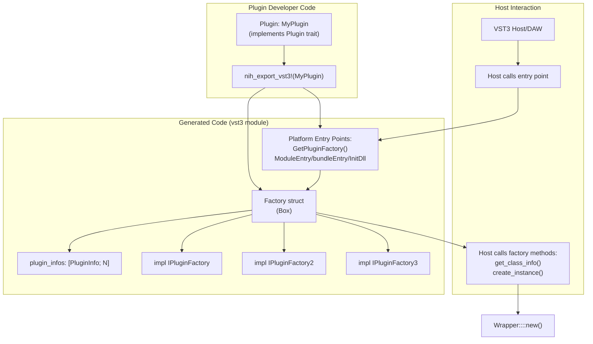
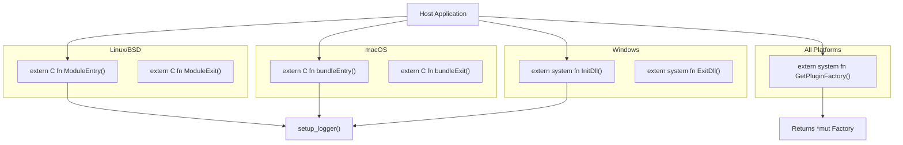

# VST3 Factory and COM Interfaces

> **Relevant source files**
> * [nih_plug_derive/src/lib.rs](https://github.com/robbert-vdh/nih-plug/blob/28b149ec/nih_plug_derive/src/lib.rs)
> * [src/params.rs](https://github.com/robbert-vdh/nih-plug/blob/28b149ec/src/params.rs)
> * [src/wrapper/vst3.rs](https://github.com/robbert-vdh/nih-plug/blob/28b149ec/src/wrapper/vst3.rs)

This page documents NIH-plug's VST3 factory implementation, which serves as the entry point for VST3 hosts to discover and instantiate plugins. The factory implements Steinberg's COM-based `IPluginFactory` interfaces and manages the creation of plugin instances through the `Wrapper` class.

This page covers the macro-generated factory code, COM interface implementations, and platform-specific entry points. For information about the `Wrapper` class that handles individual plugin instances, see [3.1](/robbert-vdh/nih-plug/3.1-vst3-wrapper). For VST3 audio processing and event handling, see [3.1.2](/robbert-vdh/nih-plug/3.1.2-vst3-audio-processing-and-events).

## Overview

The VST3 specification requires plugins to expose a factory object that implements the `IPluginFactory` family of COM interfaces. NIH-plug automates this through the `nih_export_vst3!` macro, which generates a complete factory implementation along with platform-specific entry points that hosts call to obtain the factory.



**Sources:** [src/wrapper/vst3.rs L21-L244](https://github.com/robbert-vdh/nih-plug/blob/28b149ec/src/wrapper/vst3.rs#L21-L244)

## The nih_export_vst3! Macro

The `nih_export_vst3!` macro is the primary mechanism for exporting VST3 plugins. It accepts one or more plugin types and generates a complete factory implementation in a hidden `vst3` module.

### Macro Expansion

[src/wrapper/vst3.rs L21-L47](https://github.com/robbert-vdh/nih-plug/blob/28b149ec/src/wrapper/vst3.rs#L21-L47)

```
nih_export_vst3!(MyPlugin);
// or multiple plugins:
nih_export_vst3!(PluginA, PluginB);
```

The macro expands to:

* A `vst3` child module containing all generated code
* A `Factory` struct with a fixed-size array of `PluginInfo` objects
* Implementations of `IPluginFactory`, `IPluginFactory2`, and `IPluginFactory3`
* Platform-specific entry point functions

The macro uses a compile-time constant to determine the number of plugins: [src/wrapper/vst3.rs L47](https://github.com/robbert-vdh/nih-plug/blob/28b149ec/src/wrapper/vst3.rs#L47-L47)

```javascript
const PLUGIN_COUNT: usize = [$(stringify!($plugin_ty)),+].len();
```

### Plugin Information Collection

At factory construction, the macro collects metadata for each plugin type: [src/wrapper/vst3.rs L56-L70](https://github.com/robbert-vdh/nih-plug/blob/28b149ec/src/wrapper/vst3.rs#L56-L70)

The factory validates that all plugin class IDs (CIDs) are unique in debug builds to prevent collisions: [src/wrapper/vst3.rs L60-L67](https://github.com/robbert-vdh/nih-plug/blob/28b149ec/src/wrapper/vst3.rs#L60-L67)

**Sources:** [src/wrapper/vst3.rs L21-L71](https://github.com/robbert-vdh/nih-plug/blob/28b149ec/src/wrapper/vst3.rs#L21-L71)

## Factory Struct and PluginInfo

### Factory Structure

The generated `Factory` struct is a COM object that implements three versions of the plugin factory interface: [src/wrapper/vst3.rs L50-L54](https://github.com/robbert-vdh/nih-plug/blob/28b149ec/src/wrapper/vst3.rs#L50-L54)

```css
#[VST3(implements(IPluginFactory, IPluginFactory2, IPluginFactory3))]
pub struct Factory {
    plugin_infos: [PluginInfo; PLUGIN_COUNT],
}
```

The `#[VST3]` attribute from `vst3-sys` generates the necessary COM boilerplate, including:

* Reference counting (`IUnknown::AddRef`, `IUnknown::Release`)
* Interface querying (`IUnknown::QueryInterface`)
* Virtual table setup

### PluginInfo Type

The `PluginInfo` struct (defined in [src/wrapper/vst3/factory.rs](https://github.com/robbert-vdh/nih-plug/blob/28b149ec/src/wrapper/vst3/factory.rs)

) stores type-erased plugin metadata extracted from the `Plugin` trait:

* Plugin name, vendor, URL, email
* VST3 class ID (CID)
* Version string
* VST3 category/subcategory
* Audio I/O configuration

This type erasure allows the factory to store information for multiple plugin types in a homogeneous array.

**Sources:** [src/wrapper/vst3.rs L50-L71](https://github.com/robbert-vdh/nih-plug/blob/28b149ec/src/wrapper/vst3.rs#L50-L71)

 [src/wrapper/vst3.rs L14](https://github.com/robbert-vdh/nih-plug/blob/28b149ec/src/wrapper/vst3.rs#L14-L14)

## COM Interface Implementation

The factory implements three progressively extended versions of the plugin factory interface. Each version adds new capabilities while maintaining backward compatibility.

### IPluginFactory (VST 3.0.0)

The base factory interface provides essential plugin enumeration and instantiation: [src/wrapper/vst3.rs L73-L148](https://github.com/robbert-vdh/nih-plug/blob/28b149ec/src/wrapper/vst3.rs#L73-L148)

| Method | Description | Implementation |
| --- | --- | --- |
| `get_factory_info` | Returns vendor information | Uses first plugin's metadata |
| `count_classes` | Returns number of plugin classes | Returns `plugin_infos.len()` |
| `get_class_info` | Returns basic plugin information | Converts `PluginInfo` to `PClassInfo` |
| `create_instance` | Creates a plugin instance | Instantiates `Wrapper<T>` for matching CID |

#### Plugin Instantiation Flow

The `create_instance` method is the most complex, handling plugin creation through an unrolled loop pattern: [src/wrapper/vst3.rs L99-L147](https://github.com/robbert-vdh/nih-plug/blob/28b149ec/src/wrapper/vst3.rs#L99-L147)

```

```

**Key implementation details:**

1. **Unrolled Loop**: The macro expands each plugin type into an explicit check: [src/wrapper/vst3.rs L115-L144](https://github.com/robbert-vdh/nih-plug/blob/28b149ec/src/wrapper/vst3.rs#L115-L144) ```javascript let mut plugin_idx = 0; $({     let plugin_info = &self.plugin_infos[plugin_idx];     if (*cid).data == *plugin_info.cid {         let wrapper = Wrapper::<$plugin_ty>::new();         // ... instantiation logic     }     plugin_idx += 1; })+ ```
2. **Reference Count Management**: After successful instantiation, the factory releases its reference and leaks the `Box` to transfer ownership to the host: [src/wrapper/vst3.rs L136-L137](https://github.com/robbert-vdh/nih-plug/blob/28b149ec/src/wrapper/vst3.rs#L136-L137)
3. **Interface Flexibility**: While hosts typically request `IComponent`, the code supports any interface the wrapper implements: [src/wrapper/vst3.rs L120-L125](https://github.com/robbert-vdh/nih-plug/blob/28b149ec/src/wrapper/vst3.rs#L120-L125)

**Sources:** [src/wrapper/vst3.rs L73-L148](https://github.com/robbert-vdh/nih-plug/blob/28b149ec/src/wrapper/vst3.rs#L73-L148)

### IPluginFactory2 (VST 3.1.0)

Extends the factory with more detailed class information: [src/wrapper/vst3.rs L150-L160](https://github.com/robbert-vdh/nih-plug/blob/28b149ec/src/wrapper/vst3.rs#L150-L160)

| Method | Description |
| --- | --- |
| `get_class_info2` | Returns extended plugin info including vendor, version, SDK version, and class flags |

The `PClassInfo2` structure provides additional metadata not available in the original interface, allowing hosts to make more informed decisions about plugin loading.

**Sources:** [src/wrapper/vst3.rs L150-L160](https://github.com/robbert-vdh/nih-plug/blob/28b149ec/src/wrapper/vst3.rs#L150-L160)

### IPluginFactory3 (VST 3.5.0)

Adds Unicode support and host context management: [src/wrapper/vst3.rs L162-L181](https://github.com/robbert-vdh/nih-plug/blob/28b149ec/src/wrapper/vst3.rs#L162-L181)

| Method | Description | Implementation |
| --- | --- | --- |
| `get_class_info_unicode` | Returns plugin info with UTF-16 strings | Converts strings to wide characters |
| `set_host_context` | Receives host application context | No-op (currently unused) |

The `set_host_context` method is provided for spec compliance but NIH-plug does not currently utilize the host context pointer.

**Sources:** [src/wrapper/vst3.rs L162-L181](https://github.com/robbert-vdh/nih-plug/blob/28b149ec/src/wrapper/vst3.rs#L162-L181)

## Platform-Specific Entry Points

VST3 requires different entry point functions depending on the operating system. The macro generates the appropriate set based on the target platform.



### Common Entry Point: GetPluginFactory

All platforms use this function to obtain the factory instance: [src/wrapper/vst3.rs L186-L190](https://github.com/robbert-vdh/nih-plug/blob/28b149ec/src/wrapper/vst3.rs#L186-L190)

```javascript
#[no_mangle]
pub extern "system" fn GetPluginFactory() -> *mut ::std::ffi::c_void {
    let factory = self::vst3::Factory::new();
    Box::into_raw(factory) as *mut ::std::ffi::c_void
}
```

The factory is allocated on the heap and ownership is transferred to the host. The host is responsible for eventually releasing the factory through COM reference counting.

### Linux/BSD Entry Points

[src/wrapper/vst3.rs L196-L208](https://github.com/robbert-vdh/nih-plug/blob/28b149ec/src/wrapper/vst3.rs#L196-L208)

| Function | Purpose |
| --- | --- |
| `ModuleEntry` | Called when the shared library is loaded; initializes logging |
| `ModuleExit` | Called when the shared library is unloaded |

### macOS Entry Points

[src/wrapper/vst3.rs L214-L225](https://github.com/robbert-vdh/nih-plug/blob/28b149ec/src/wrapper/vst3.rs#L214-L225)

| Function | Purpose |
| --- | --- |
| `bundleEntry` | Called when the bundle is loaded; initializes logging |
| `bundleExit` | Called when the bundle is unloaded |

### Windows Entry Points

[src/wrapper/vst3.rs L231-L242](https://github.com/robbert-vdh/nih-plug/blob/28b149ec/src/wrapper/vst3.rs#L231-L242)

| Function | Purpose |
| --- | --- |
| `InitDll` | Called when the DLL is loaded; initializes logging |
| `ExitDll` | Called when the DLL is unloaded |

All initialization entry points call `setup_logger()` to configure NIH-plug's logging system.

**Sources:** [src/wrapper/vst3.rs L186-L243](https://github.com/robbert-vdh/nih-plug/blob/28b149ec/src/wrapper/vst3.rs#L186-L243)

## Reference Counting and Memory Management

The factory uses COM reference counting for lifetime management. The `vst3-sys` crate's `#[VST3]` attribute generates:

1. **IUnknown Implementation**: Reference counting methods (`AddRef`, `Release`) and `QueryInterface`
2. **Automatic Cleanup**: When the reference count reaches zero, the factory is deallocated
3. **Thread Safety**: COM's reference counting is atomic by default

### Wrapper Ownership Transfer

During plugin instantiation, ownership transfers from factory to host: [src/wrapper/vst3.rs L126-L138](https://github.com/robbert-vdh/nih-plug/blob/28b149ec/src/wrapper/vst3.rs#L126-L138)

1. `Wrapper::new()` creates a `Box<Wrapper<T>>` with reference count 1
2. `query_interface()` increments to 2 (if successful)
3. `release()` decrements to 1
4. `Box::leak()` prevents automatic deallocation, leaving the host responsible for the final `Release()` call

This pattern is necessary because `vst3-sys` incorrectly uses `Box` instead of proper COM smart pointers in its type signatures.

**Sources:** [src/wrapper/vst3.rs L99-L147](https://github.com/robbert-vdh/nih-plug/blob/28b149ec/src/wrapper/vst3.rs#L99-L147)

 [src/wrapper/vst3.rs L50-L54](https://github.com/robbert-vdh/nih-plug/blob/28b149ec/src/wrapper/vst3.rs#L50-L54)

## Factory Information Methods

The factory provides plugin metadata through multiple info structures, each progressively more detailed.

### Factory-Level Information

`get_factory_info` returns vendor-level metadata using the first plugin's information: [src/wrapper/vst3.rs L74-L83](https://github.com/robbert-vdh/nih-plug/blob/28b149ec/src/wrapper/vst3.rs#L74-L83)

The `PFactoryInfo` structure contains:

* Vendor name
* Vendor URL
* Vendor email
* Factory flags (currently 0)

### Class Information Structures

| Structure | VST3 Version | Contains |
| --- | --- | --- |
| `PClassInfo` | 3.0.0 | CID, cardinality, category, name |
| `PClassInfo2` | 3.1.0 | Adds vendor, version, SDK version, class flags, subcategories |
| `PClassInfoW` | 3.5.0 | Unicode (UTF-16) versions of all strings |

Each structure is created by `PluginInfo` methods that convert NIH-plug's plugin metadata to VST3's format.

**Sources:** [src/wrapper/vst3.rs L73-L97](https://github.com/robbert-vdh/nih-plug/blob/28b149ec/src/wrapper/vst3.rs#L73-L97)

 [src/wrapper/vst3.rs L150-L175](https://github.com/robbert-vdh/nih-plug/blob/28b149ec/src/wrapper/vst3.rs#L150-L175)

## Summary

The VST3 factory system in NIH-plug provides:

* **Automated Factory Generation**: The `nih_export_vst3!` macro generates all boilerplate
* **Multi-Plugin Support**: A single binary can export multiple plugin types with unique CIDs
* **COM Compliance**: Proper implementation of all three `IPluginFactory` versions
* **Platform Portability**: Correct entry points for Windows, macOS, and Linux/BSD
* **Type-Safe Instantiation**: Compile-time plugin type association through macro expansion

The factory serves as the bridge between the host's COM-based discovery mechanism and NIH-plug's Rust-based `Plugin` trait, enabling seamless integration with any VST3-compatible host.

**Sources:** [src/wrapper/vst3.rs L21-L244](https://github.com/robbert-vdh/nih-plug/blob/28b149ec/src/wrapper/vst3.rs#L21-L244)